### AYS SPECIAL: Precarious living conditions for millions of refugees in Lebanon

_One of the AYS team members visited Lebanon and camps where mostly Syrian refugees are living, to find out more about their living conditions, but also about the local communities and the government’s reaction to new settlements being created and the consequent increase in the number of people in the area\. After volunteering for two weeks with a local [NGO Salam LADC](https://www.salamladc.org/Whatwedo) , she brings an overview of rules, conditions and pictures of every day life for people who are running away from war only to find difficult living conditions, hard to cope with\._

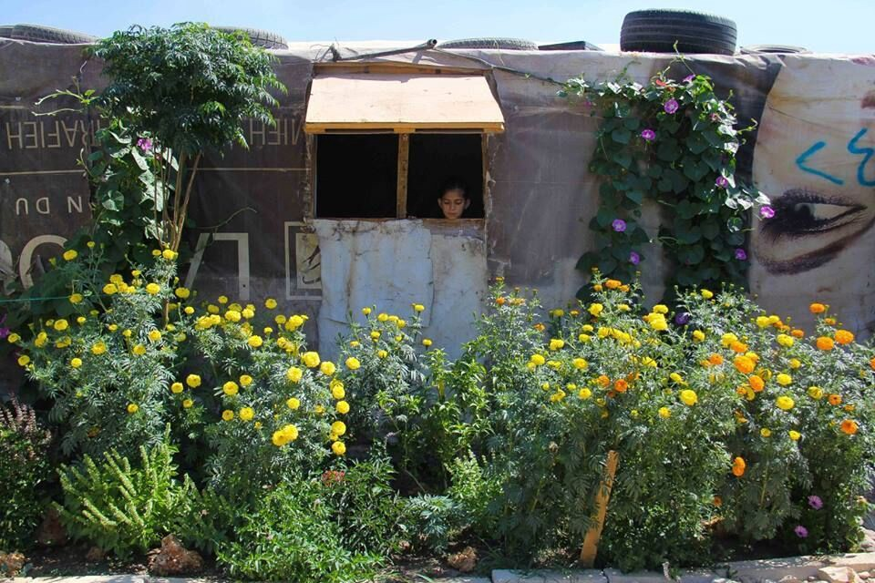

Little garden in a settlement\. Credit: LusseC\.

The increasing non sense violence against refugees and migrants in Europe, and the shift to far\-right polices and mindsets, made me take the decision to volunteer in Lebanon, one of those countries — together with Jordan and Turkey — that have been hosting Syrian refugees since the very beginning of the crises, in terms of millions of people\.

And here I am, trying to put together info I collected on the ground or from professionals working in the field, with the aim of making things a little bit clearer for those who know little about their life and living conditions\.

Lebanon has had a difficult history in terms of wars and conflicts, both regarding internal factions and external subjects heavily contributing to the instability of the region\. The Syrian crises did not help in these terms, but the country has adopted a non\-encampment policy since the beginning of the crises in 2011, which means that it won’t allow formal refugee camps to be set up in the country\.

Initially, Lebanon had an open\-border with Syria, and between 2013 and 2014, [UNHCR registered](http://data.unhcr.org/syrianrefugees/country.php?id=122) on average over 48,000 refugees per month\. But, when the border officially closed in 2015, the influx of people didn’t stop, condemning new arrivals to settle in informal settlements with barely any assistance given\. As a result, [an estimated 1\.5 million Syrian refugees](https://www.refugees-lebanon.org/) \(1\.001\.051 according to UNHCR data up to 30th June 2017\) live precariously in some 2\.398 informal settlements \(without mentioning informal settlements of less than four tents, which number by December 2016 amounted at 2\.136\) and 650 collective shelters scattered across the country, often among the poorest host communities\.

**Rules that are hard to understand**

According to the research conducted by the [Force Migration Forum](https://forcedmigrationforum.com/2017/06/22/why-are-there-no-syrian-refugee-%20camps-in-lebanon/) , there are three main reasons why this sort of non\-encampment policy is implemented:

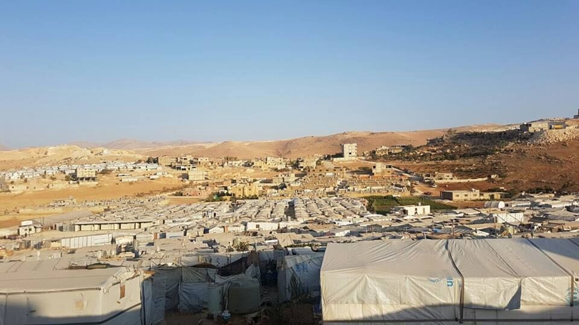

Credit: Salam LADC

•Refugees are seen as a security threat: following the nakba, hundred of thousands of Palestinians fled to Lebanon and were confined in camps managed by UNRWA\. Nearly 70 years later, 12 refugee camps remain, and Palestinian refugees remain excluded from key aspects of social, political and economic life\. \[…\] Committees replaced the Lebanese authority within the camps and undermined UNRWA’s role\. Palestinian camps are essentially politically autonomous, and Palestinian factions remain armed within the camps\. \[…\] With the experience of Palestinian, Lebanese authorities fear that this phenomenon would be replicate itself with Syrian refugees\. Rather than a solution to a security threat, refugee camps could become a permanent security threat;
- Lebanon has a sectarian power\-sharing system made up of 18 recognised religious sects, which rarely agree with one another\. A policy to establish formal refugee camps would require agreement from all major political forces in the country, and the two main political blocks hold opposing views regarding this issue;
- By supporting a non\-encampment policy, Syrian refugees can easier be employed as labor force to the benefit of Lebanese business/land owners\.

In terms of what services the government guarantees to refugees, the spectrum is quite narrow, as no official camp can be built on the territory, there is no help or support in terms of housing and food so UNHCR is in control of the management of flows and services\.

In February, [HRW published](https://www.hrw.org/news/2017/02/14/lebanon-new-refugee-policy-step-forward) an article explaining clearly the residency regulations for refugees introduced in January 2015\. According to their findings, all Syrians — 15 and over — are required to pay an annual $200 renewal fee per person, _“present valid identification and an entry slip obtained at the border, submit a housing pledge confirming their place of residence, and provide two photographs stamped by a Lebanese local official\.”_

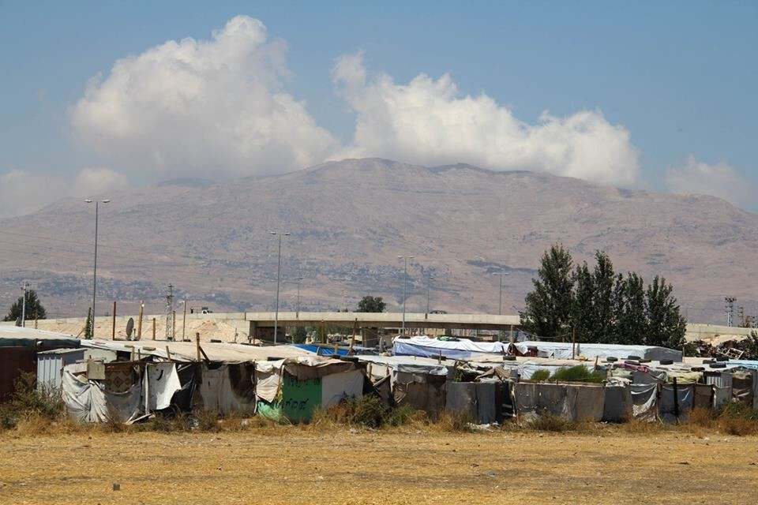

Makeshift camp in the Beqaa Valley\. Credit: LusseC\.

Sofia Kordonets, law expert and former volunteer with Salam LADC, explained for AYS how every refugee should be registered with UNHCR, before paying the fee\. _“If registered, they receive monthly help\. The amount varies depending on the vulnerability of the family and the place they live\. If people live in houses \(including substandard building\) they receive less\. In winter people receive money for fuel\. This help is also targeted at food, rent\. The amount depends also on number of family members,”_ she said\.

Additionally, every new coming family, even without registration, used to receive arrival kits \(mattresses, blankets, jerry cans, kitchen ware, mats\) and materials to build a tent\. This no longer holds true\. Now new arrivals need to wait anywhere from 1–3 months to receive assistance, and most are not getting anything\. This is why Salam LADC has started providing new arrival kits\. UNHCR is low on staff, and funds for this, and are also looking at changing over to a total cash distribution system\.

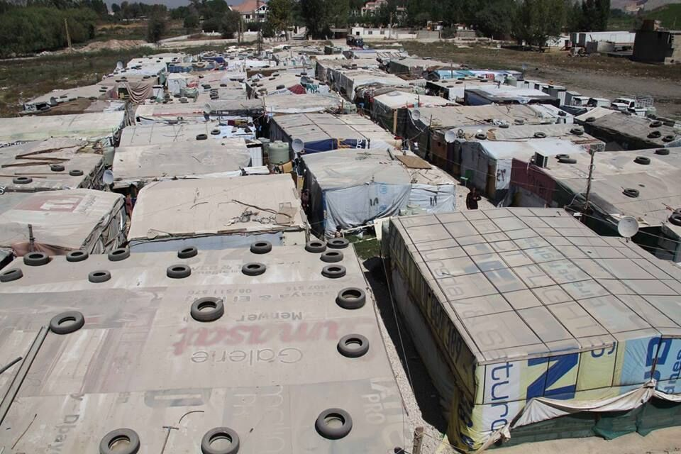

Credit: LusseC\.

Kordonets added that she was trying to contact UNHCR on several occasions, and in different ways, in order to understand what is every family is eligible to receive, as new comers or not, but with no success\. _“They prefer us to tell them the situation and they think if they can help or not\. Probably it is because the UNHCR in Lebanon is very understaffed and not financed enough and every family in Beqaa needs a big support,”_ she said\.

**Reality of everyday life**

If registered, refugees are entitled to use public health services, but, certain services are offered in specific structures or areas so it might not be that easy to gain access to the closest structures \( [Useful information and contacts/hotlines](https://www.refugees-lebanon.org/news/104/qa-on-emergency-health-assistance-provided-to-%20refugees-and-asylum-seekers-by-unhcr-and-partner-organizations-in-lebanon) \) \. Laran Matta, program officer and medical coordinator for Salam LADC, reported the following regarding how refugees can benefit from the health care system: _“Refugees/Syrians are allowed to access all public health services, if they enter one that is not cooperating with UNHCR or another NGO then they have to pay regular prices\. There are hundreds of clinics across Lebanon that are contracted by international NGOs and local NGOs to subsidise healthcare for refugees, they do not need to be registered, just have legal papers of some sort\. If they need to enter the hospital for emergency care and are not registered with UNHCR then they enter a “fast track” system that gives them the same access of 75% covered by UNHCR for those medical treatments covered in their mandate\. But again to receive subsidised care they need to go to the hospitals/clinics contracted by the NGOs\.”_

She also added that because of the huge demand and limited funding, UNHCR health assistance can only be provided to those suffering from life threatening emergencies\.

_“Some of the most common life threatening emergency cases are: heart attack, severe shortness of breath, babies with severe vomiting/diarrhoea, high fever, imminent delivery, severe bleeding, trauma, severe burns, convulsions, and unconsciousness\. These are what the majority of UNHCR Health funding covers: predominately subsidised cost \(85%\) for deliveries \(natural and caesarian\), heart attacks, stroke, premature baby \(hospital stays\), trauma/severe bleeding, burns; but there are also cases not covered like: chronic, not a good prognosis, cancers, experimental treatments, cosmetic surgery etc\. \.”,_ Laran stated _\._

UNHCR provides also some health assistance related to: care for new born babies, some orthopedic cases\.

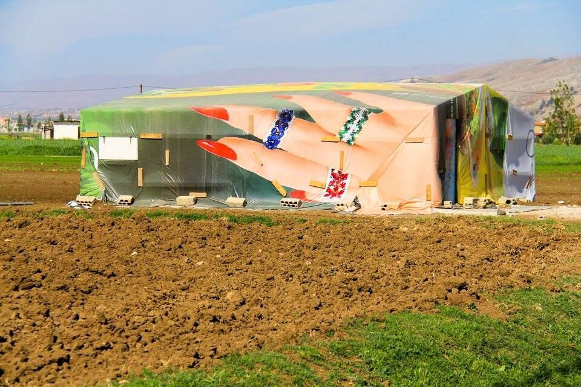

Newly arrived refugees living nearby the mountains that lead to Syria\. Beqaa Valley\. Credit: LusseC\.

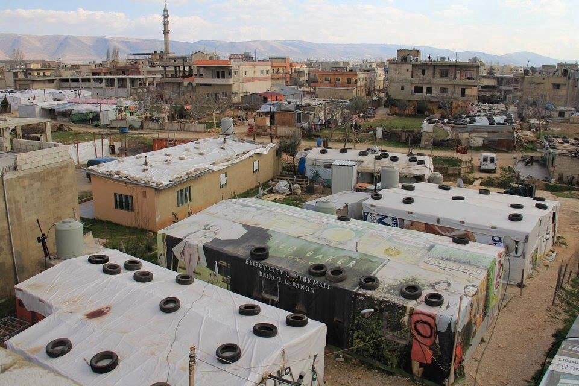

If there’s a life threatening condition, refugees should go to the nearest health facility and remember to call NEXtCARE immediately\. If they go to hospital that is not partner of the program and the UNHCR, they have to pay\. If in UNHCR is parter with hospital, they will cover 75% of hospital bill\. \(To know more on access to healthcare supported by UNHCR check the health brochure available in any UNHCR centre, in NEXtCARE centres in hospitals [or online](http://www.refugees-lebanon.org/) \)

If a woman is not registered with UNHCR or delivers a baby at home, she’s not entitled to receive any sort of assistance, medical or financial\.

Education is guaranteed as refugee children are allowed to attend regular lessons at public schools \(always if previously registered through UNHCR\); in addition, various local NGOs are committed to support this call by organising education sections for children and women \(HumanWire, Women now for development, Salam, Intersos etc\. \) \.

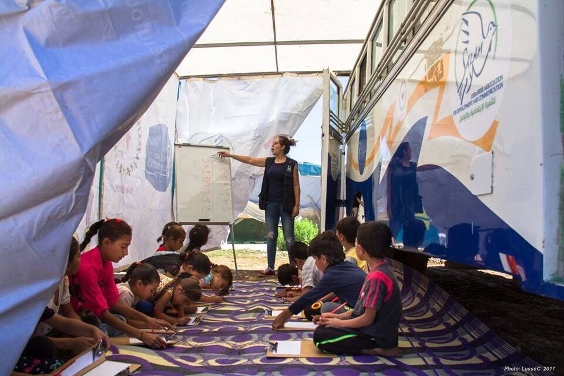

Bus Project\. Credit: Salam LADC

Recreational and educational activities are also implemented by the creation of community centres in different communities\. Lebanese and Syrian staff is hired for different projects, depending on previous experience and skills; during summer time, classes are secured by local NGOs who organise lessons/games in different settlements \(see Bus project of Salam\) \.

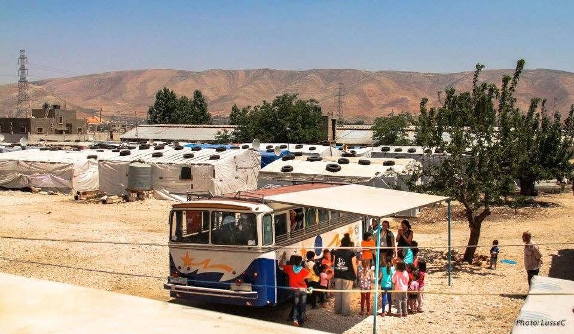

The very very cool Bus project by SALAM LADC, providing workshop for Women on Health and Educational and Fun activities for the children of numerous Syrian refugees settlements around the Beqaa Valley\. Credit: LusseC\.

\( [For figures regarding education and the possibility to receive scholarships, see this link and UNHCR data](https://www.refugees-lebanon.org/en/news/142/qa-for-the-back-to-school-programme-20162017) \)

What really stroke me when I was in Lebanon, is the apparent absence, in settlements, of unaccompanied minors; even looking at official statistics and data, it is difficult to find a clear number, so I contacted Intersos, an NGO that works in the child protection field and collaborates with Salam at their community development center in El Marj area\. Having a data sharing agreement with UNHCR, it was not possible for them to share specific information on the case\.

**So how does the housing/assistance system work for refugees in Lebanon?**

As previously stated, refugees are allowed to live in settlements \(houses \+ tents\) or find a place in collective housing solutions\. All of them though are built on private land, which need to be rented out\. Refugees need to pay a rent to the land owner which vary depending on the number of tents/ people, on the season and so on; contracts are usually verbal, a very small percentage are written\.

For example, during field assessments conducted in August 2017, we came in contact with four different realities, not only in terms of numbers of people/tents but also in the management of the renting process\.

The first settlement we visited was in the central Beqaa discovered in 2014 and by the time of the last update \(2016\), around 311 people where living there \(so, supposedly, the number has significantly increased in the last year\) \. The shawishe \(representative of the local community; one per settlement\) told the interpreter that the rent per tent increased to $ 55/month which sounded outrageous considered the living conditions and the fact that most of the refugees hosted in the settlement have a job in agriculture \(which, in that specific settlement, pays $ 7 a day\) \.

Sometimes, two families can live in the same tent in order to save money \(even up to 15–18 people\) \.

To consider is also the fact that, usually, there is more than one man who can work per tent and also women and some children \(unfortunately\), but, for these last two categories, the salary is considerably lower\.

Those who cannot afford the rent have two options: get into debt or leave the settlement in search for “better” renting options \(families can leave a settlement when they want\) \. NRC offers a sustainable housing program, where families are given cash aid to face the rent, even though no “free” housing is provided\. These families have to have certain characteristics \(see what Sonya said above\) \.

In some cases, refugees can’t afford the rent due to insolvency of the employer or simply because they haven’t been receiving their salaries for a long period of time; this last option, though, is always to verify as some of the shawishe may not be telling the truth in order to get food distributions for their settlement\.

**Winter times**

When a critical situation in a new/existing settlement arise, bigger NGOs should be contacted in order to deal with the emergency: UNHCR, Unicef, Save the Children, NRC, Medair are some of the main woking in settlements and that deal with different needs\.

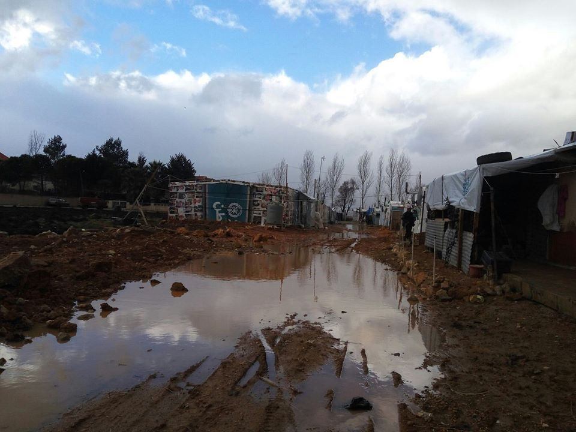

Flood in December 2016\. Settlement: Qab Elias\. Credit: Sofia Kordonets

In both cases Salam or actually any other organisation or probably even individuals can refer the case to UNHCR and they will provide what is needed after their own assessment\.

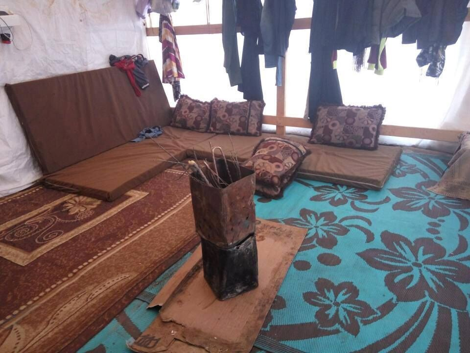

“Heating system” in winter\. Settlement: Khodr Baalbek\. Credit: Sofia Kordonets

Water tanks/toilets are usually provided given the number of people living in the settlement and are provided either by the land owner or Medair that also helps in mapping out the various settlements\. Sofia Kordonets adds that there are WASH and Shelter projects in UNHCR\.

_“Basically, under shelter assistance every family who lives or moves to settlement can receive shelter assistance\. If a family moves to a new location they can have new materials\. If the tent leaks, they receive some reparation materials\. The same with wood which can be very weak or already broken\. In winter UNHCR tries to make tent warmer, insulate them\.”_

WASH is a sector that focuses on providing Water and Sanitation needs for informal settlements/ collective shelters/substandard housing\. Standards: 1 toilet for no more than 20 people\.

Insulation and building materials for tents are arranged by UNHCR\. Food/clothes distribution are arranged by local NGOs when needed or in case of new arrivals/serious emergencies; in general, they are connected to the rent refugees have to pay, most likely in the case of an increase in the amount of rent paid and in a decreasing or unaltered salary\.

Settlements are regularly monitored\. Arrivals are constant\.

**Northern Beqaa Valley**

The other three settlements we visited are located in the Northern part of the Beqaa Valley, all of them relatively new; the residents of one of them \(the newest\) were all fleeing Raqqah; they barely had water and one makeshift toilets\.

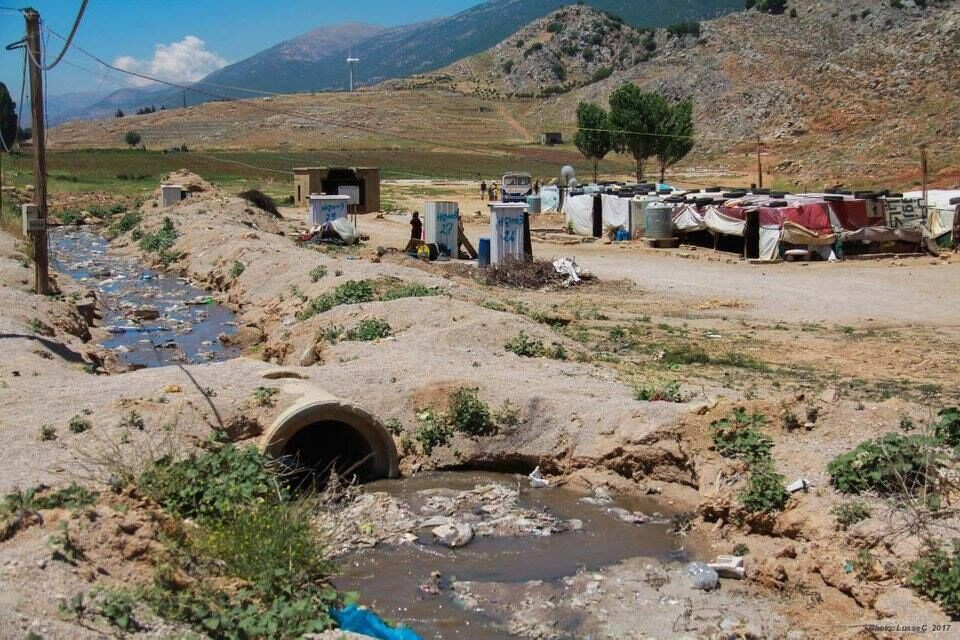

The harsh reality of many refugee settlements in Lebanon where there is not enough rubbish collection or even sometimes there is none, therefore polluting the streams nearby and creating additional health issues\. Credit: LusseC\.

What I found very ironic is that at the entrance of all these settlements, there are signs showing the stemmas of all the different big NGOs operating in Lebanon, some of them though never made the effort to check the real needs of the people\.

The second settlement we visited was better organised \(if we can say so\) \. Here we found that the rent was incredibly high, $100/month \+ electricity, which amounted to a total of $120/month\.

Talking to the residents though we discovered that the land owner allows the residents not to pay the rent during winter as the conditions are harsh and those working in agriculture \(all of them\) can hardly find a job or work in the field, that’s why the rent increase so much during summer, to “balance” the loss of the winter season\.

In this specific settlement, the salary for men is 15\.000 Lebanese Pound/day \($ 9–10\), while for women is 10\.000 Lebanese Pound/day \($ 6–7\), but there’s always more work for women as it is mainly picking tasks\. Five working days a week during high season\.

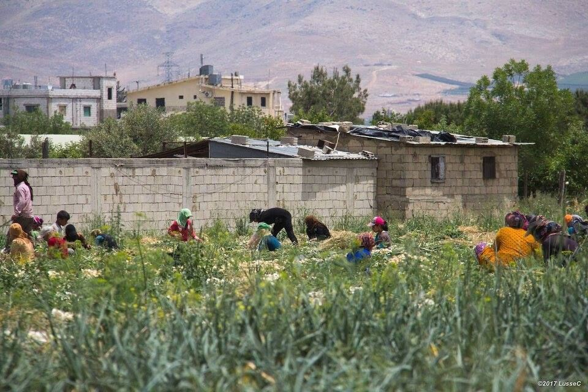

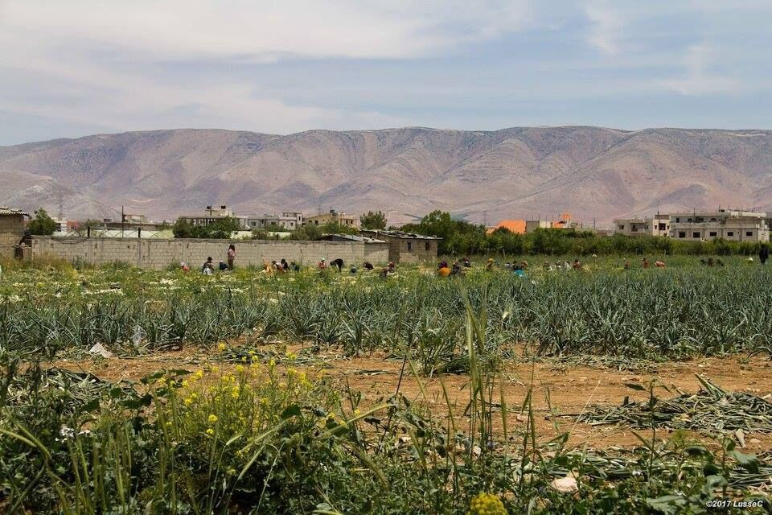

Syrian refugees, mostly women and children working in the field, for long hours, everyday for few dollars\. Beqaa Valley\. Credit: LusseC\.

Children/teenagers work in the fields too during summer as school is off, supposedly getting paid even less than women, around $ 4–5/day\. What the residents of this settlement complained the most is that children cannot go to school during winter, when it rains, as the road floods, preventing children from reaching the main paved road where the bus stops\. When dealing with these kind of requests, small NGOs cannot promise anything but to report the request to main NGOs or the municipality\.

For more information regarding statistics and data on the various aspects discussed, have a look at [this page](https://www.refugees-lebanon.org/en/section/16/frequently-asked-questions) \.

**Working in Lebanon**

Well, the majority of refugees is exploited in agriculture, and they do that in order to pay for their rent and food\. But there is also a legal way, very intricate and expensive, for them to be able to work: receive sponsorships\.

In their report, HRW wrote that without residency, refugees can be arrested, and their movement restricted\. _“This makes it difficult for them to work, \[…\] \. It has also hindered their ability to register marriages and births, leaving tens of thousands of Syrian children born in Lebanon at risk of statelessness\. An inability to work has exacerbated poverty among refugees, leading to increased child labor and early marriages\. The lack of legal status has also left refugees vulnerable to a range of abuses, including labor exploitation and sexual abuse, unable to turn to the authorities for protection for fear that police may arrest them for expired residency\.”_

Additionally, to maintain residency, Syrians not registered with UNHCR have to provide a “pledge of responsibility” signed by a Lebanese national or registered entity to sponsor an individual or family\. Some people charge refugees up to $1,000 for sponsorship\.

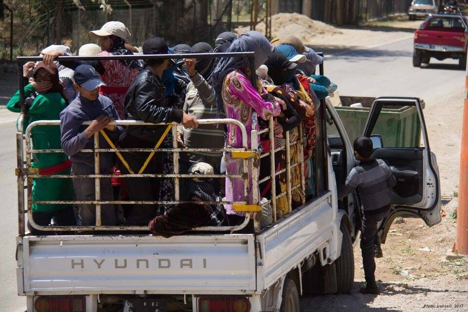

Women and children workers heading to farms around the area for a long and hard day under the sun\. Credit: LusseC\.

Moreover, as Matta told AYS, in case a Syrian refugee would like to open a shop, the majority of the business must be in a Lebanese individuals name; it is legally required for him/her to own around 40 percent of the property, while the remaining 60 percent circa \(legal percentage is approximate\) should be property of a Lebanese citizen, even if not actively involved in the business\.

As a consequence of these policies, Syrian refugees who are part of the Lebanese labour force are estimated to be around 47 percent of the population\.

However, there are many smaller NGOs working on the ground and who develop projects in collaboration with local communities to empower them, hiring Syrian and Lebanese staff to favourite integration and collaboration, including Salam Ladc, Humanwire, Women now for development etc\.

All of them collaborate and I was positively impressed by the good work done for women/children and local communities: yoga classes for women, Bus Project for those children who don’t have the possibility to get a proper education all year long \(it’s a school on four wheels\), cinema nights with animation movies for children, the Choir Project \(music lessons for children\), all of them run at the same time with field assessments, distributions, recycling/cleaning projects and medical awareness/health sessions programs \(these last ones in collaboration with Unicef and Days for Girls for example\) \.

While I was in the Beqaa, I took part to two community dinners, where Syrian families open their house to volunteers and other members of the community to cook and share a typical meal together, and just sharing a tea and a cigarette with an old Syrian granddad and his grandchildren, while looking at the sunset, is worth the whole experience\. As well as looking at the eyes and smiles of children who receive a small gift and a cake for their birthdays thanks to the Birthday Project which guarantees a special day to these kids in settlements, a glimmer of hope and positivity\.

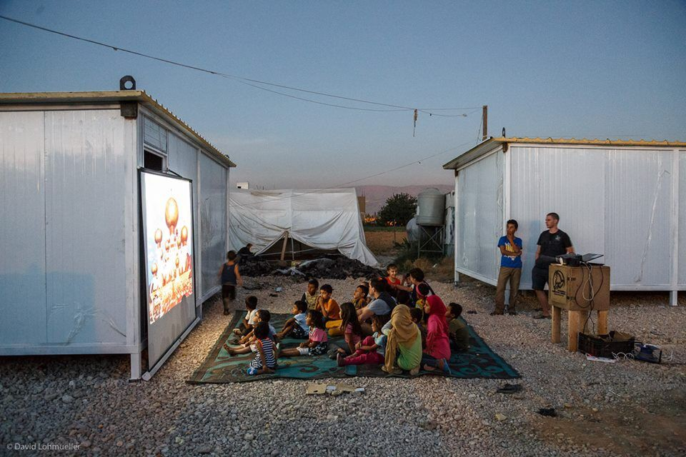

Cinema nights\. Credit: Salam LADC

Now that I’ve come back home, I can state that the situation in Lebanon is totally different from the European one\. The refugee population is scattered throughout the country, living in incredibly difficult conditions and undergoing a constant and legally accepted mistreatment \(this part exactly like in Europe, with different modalities\) \.

_\(Note: I do not refer to Palestinian refugees \(288\.900 as of March 2017\) in this summary, but just to Syrian refugees in Lebanon\. \)_

By: Cristina Guglielmini

> **_We strive to echo correct news from the ground, through collaboration and fairness, so let us know if something you read here is not right\._** 

> **_Anything you want to share — contact us on Facebook or write to:areyousyrious@gmail\.com_** 

_Converted [Medium Post](https://medium.com/are-you-syrious/ays-special-precarious-living-conditions-for-millions-of-refugees-in-lebanon-81f8845b6a9a) by [ZMediumToMarkdown](https://github.com/ZhgChgLi/ZMediumToMarkdown)._
