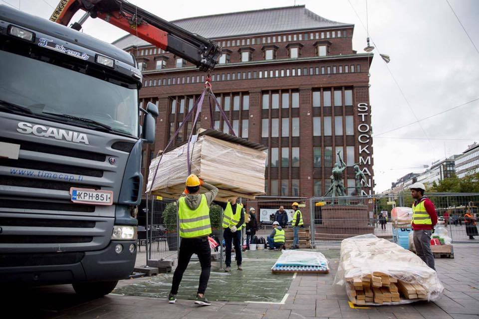

### AYS DAILY DIGEST 4/9/2017: Systematic abuse at UK’s Brook House Immigration Removal Centre

_Protest to close the Brook House centre / Libya in breach of international law regarding SAR zones / MOAS suspends Mediterranean rescue operations / Nearly 500 people reach Greek islands over the weekend / Declaration of Afghan Refugees in Austria / Police evacuated the Fori Imperiali “camp” in Rome_

 ‎, one of the organizers of the protest](assets/4c5991109fe9/1*wu7LFuaec09RrS72hyLcCw.jpeg)

Photo by [Kent Anti\-Racism Network](https://www.facebook.com/KentARN/) ‎, one of the organizers of the protest
#### Systematic abuse at UK’s Brook House Immigration Removal Centre

Brook House will be the subject of a BBC Panorama programme on Monday night\. Footage to be broadcast will show detainees being mocked, humiliated and even assaulted by staff at the privatised facility near Gatwick run by G4s\. As Free Movement [writes](https://www.freemovement.org.uk/systematic-abuse-found-brook-house-immigration-removal-centre/?utm_source=rss&utm_medium=rss&utm_campaign=systematic-abuse-found-brook-house-immigration-removal-centre) , BBC Panorama took undercover footage and uncovered, amongst other evidence of chaos and incompetence, G4S officers assaulting, abusing and mocking detainees, asylum seekers being forced to share cells with foreign national prisoners who have completed their sentences and rife drug use\. G4S suspends nine staff members since the story came through\.

> This is [hardly](https://www.freemovement.org.uk/shocking-new-report-on-detention-of-women-asylum-seekers/) [the](https://www.freemovement.org.uk/damning-reports-on-the-verne-and-yarls-wood-immigration-removal-centres/) [first](https://www.freemovement.org.uk/immigration-detention-what-is-the-point/) [time](http://www.telegraph.co.uk/women/womens-politics/11446389/Yarls-Wood-immigration-detention-centre-needs-to-ditch-male-guards.html) that investigation has uncovered abuse at immigration removal centres\. Nor is it the first time that G4S contractors have been involved\. G4S has reacted to this by conducting an internal investigation and suspending nine of its staff\. G4S could quite easily have conducted its own investigation or covert footage before the media found out\. G4S could have created a robust inspection system, or any other way of preventing such widespread abuse from happening\. However, they did not\. 

The allegations are the latest in series of well\-documented problems on government security contracts awarded to G4S, Guardian [reminds](https://www.theguardian.com/uk-news/2017/sep/01/g4s-staff-suspended-brook-house-immigration-centre-claims-abuse) \. In November 2013, three G4S guards were accused of manslaughter over the unlawful killing of [Jimmy Mubenga](https://www.theguardian.com/uk/jimmy-mubenga) , who died on a deportation flight to Angola\. G4S was temporarily banned from bidding for government contracts at the time, over allegations of overcharging on contracts to electronically monitor offenders\. The ban was lifted in 2014 when [G4S agreed to repay £109m](https://www.theguardian.com/business/2014/mar/12/g4s-repay-overcharging-tagging-contracts) and put in place a “corporate renewal plan” to prevent any recurrence\.

A demonstration will be held **tomorrow \(September 6th\) at 12\.30 at Home Office** to highlight the UK’s use of indefinite detention as an abuse of human rights and call for G4S to be stripped of all government contracts immediately\. More about the event [here](https://www.facebook.com/events/116345625698640/?acontext=%7B%22source%22%3A4%2C%22action_history%22%3A%22%5B%7B%5C%22surface%5C%22%3A%5C%22group%5C%22%2C%5C%22mechanism%5C%22%3A%5C%22surface%5C%22%2C%5C%22extra_data%5C%22%3A%5B%5D%7D%5D%22%2C%22has_source%22%3Atrue%7D&source=4&action_history=%5B%7B%22surface%22%3A%22group%22%2C%22mechanism%22%3A%22surface%22%2C%22extra_data%22%3A%5B%5D%7D%5D&has_source=1&fref=gs&dti=1652972374920129&hc_location=group) \.
#### SEA
#### Libya is in breach of international law

In the opinion of the Scientific Services of the Parliament, quoted by the Neue Osnabrücker Zeitung in its Monday edition, the right to free navigation also applies to a search and rescue zone beyond the shores of the coasts\.

A few weeks ago, Libyan government called for a 74\-mile\-wide search and rescue region which extends far into international waters\. In this zone, Libya claims sovereignty and declares itself responsible for maritime distress, thereby threatening international aid groups\. Many private distress rescuers have stopped their rescue operations for the time being\.

The political spokesperson of the [Fraktion DIE LINKE\. im Bundestag](https://www.facebook.com/linksfraktion/) , [Ulla Jelpke](https://www.facebook.com/Ulla.Jelpke/) and the German left has requested the issue of cooperation with Libya to be placed on the agenda of a special meeting of the bundestag parliamentary committee on Tuesday\.

The official Bundestag report on the legal questions in the case of sea rescue operations within a Libyan SAR zone in the Mediterranean can be found [here](https://www.bundestag.de/blob/525660/e43d2ccfb3b60ecb334f9276ae0f6f6c/wd-2-075-17-pdf-data.pdf) \.
#### MOAS suspends Mediterranean rescue operations

Migrant Offshore Aid Station \(MOAS\), which had signed the Italian government’s code of conduct on migrant rescues at sea, said it has decided to suspend its search and rescue operations in the Central Mediterranean, ANSA med [reports](http://www.ansamed.info/ansamed/en/news/sections/generalnews/2017/09/04/moas-suspends-mediterranean-rescue-operations_88a3368c-cb28-4db3-82f3-a2923b1411e0.html) \.

“MOAS does not want to become part of a mechanism where there is no guarantee of safe harbour or welcome for those being assisted and rescued at sea” they wrote in a [statement](https://www.moas.eu/moas-shifts-operations-south-east-asia/) published today\.
#### GREECE
#### Nearly 500 people reach Greek islands over the weekend

A total of 493 people arrived on Greek shores from neighboring Turkey between Friday morning and Monday morning, according to police figures made public today, [ekathimerini](http://www.ekathimerini.com/221362/article/ekathimerini/news/hundreds-of-migrants-reach-greek-islands-over-weekend) reports\.

Of the 493, 305 landed on Lesvos, 29 on Chios and 159 on Samos\. Only today there were 90 new arrivals on Lesvos and 59 on Samos\. The numbers of official registrations between 1/9 and 3/9 are following: 336 on Lesbos, 29 in Chios,159 in Samos, 50 in Kos and 2 others, making a total of **576 in only 3 days** \.

Average number of new registrations in August was 115, average between January and July was 53\. The new yearly average is almost 62\. In August total was 3572, which is the highest number this year after July’s 2249\.
#### Chios

[Refugee Education Chios](https://www.facebook.com/refugeeeducationchios/) is urgently looking for 1–2 teachers or youth workers to join them in Chios for at least 5 weeks\. You would be teaching across institutions \(primary school, secondary school and youth centre\) \. Get in contact with them including your CV in the message\. Ideally, you would be able to start within the next week\.

Imagine published their [weekly schedule](https://www.facebook.com/groups/1637579959839129/permalink/1898083013788821/?fref=gc&dti=1652972374920129&hc_location=ufi) for the Chios school\.
#### Lesvos

#### SERBIA
#### Donations needed in Šid

About a hundred refugees are staying in Šid in increasingly cold weather\. Many people have no shelter from rain and no covers at all, so donations are needed: TENTS, SLEEPING MATTRESSES, BLANKETS, WINTER SHOES, WARM CLOTHES, BACKPACKS, PHONES, POWER BANKS most urgently\.
#### AUSTRIA
#### Justice for Afgan refugees

Declaration of Afghan Refugees addressing the Austrian government and European officials has been published today at Protest Camp Vienna, read it in full [here](https://docs.google.com/document/d/1MnaLiQa6_msjGW1lxPHK3YdqCE-Fkjl8Lc68GrSEg0c/edit) \.

The declaration warns about the deterioration of security situation in the country, with increased civilian casualties and a growing internal displacement crisis, since the Taliban and the Daesh/Islamic State Khorasan now control more territory than at any point since 2001\.

Giving the situation they ask for an immediate halt on deportations to Afghanistan, reconsideration and reevaluation of all asylum cases which were rejected based on singular reports, provision of qualified interpreters for both the initial interview and the appeal process, provision of legal support for the adequate understanding of refugee rights by the asylum applicant and provision of education facilities for children, young adolescents, as well as young adults for better integration\.

The inability of the Afghan government to ensure adequate protection show that Afghanistan remains an unsafe country for refugees to be returned to, they write\.
#### Deportations to Pakistan

[Refugee Protest Camp Vienna](https://www.facebook.com/RefugeeCampVienna/) warns about forthcoming deportations from Austria to Pakistan set for September 6th\. Other EU countries may deport people with the same flight since every charter involves at least two European countries\.

> Who may be concerned by a mass deportation flight:
 

> \_ \_ \_ \_ \_ \_ \_ \_ \_ \_ \_ \_ \_ \_ \_ \_ \_ \_ \_ \_ \_ \_ \_ \_ \_ \_ \_ \_ \_ \_ \_ \_ \_ \_ \_ \_ \_ \_ \_ \_ \_ \_ \_ \_ \_ \_ \_ \_ \_ \_ \_ \_ \_ \_ \_
 

> \-Generally persons who have had a definite negative result of their asylum case\.
 

> \-People living in Austria under undocumented, irregular conditions\.
 

> \-The risk is generally higher if someone is already under severe pressure from the authorithies to leave Austria\.
 

> Trouble with Austrian law enforcement authorithies and having a criminal case on one’s record can increase the risk of deportation, but people who have never had any such problems are also concerned\. 

#### ITALY
#### Rome

Police evacuated the “camp” in Piazza Madonna di Loreto \(Fori Imperiali\) where 56 migrants slept last night \(all of them evacuated from via Curtatone\); municipality offered limited options that will divide families; 27 people accepted the accommodation offered by the municipality; no representative of the municipality itself is present\.

](assets/4c5991109fe9/1*2ZlaGPYsZVhmIqsBBdLVFA.jpeg)

Photo by [Progetto Degage](https://www.facebook.com/progettodegage/)

More than 500 people were evacuated in via Curtatone but the municipality offers only limited places: 24 places for women in Via Savi, 65 places for men in between Casalotti and Via dell’usignolo, Baobab writes\. It seems normal to separate children and fathers, they added\. Apart from being completely outlawed, there was no notice of eviction and no time left to remove personal belongings\.

■■■■■■■■■■■■■■ 
> **[Baobab Experience](https://twitter.com/BaobabExp) @ Twitter Says:** 

> > Più di 500 sgomberati in via Curtatone ma Comune offre: 24 posti donna in via savi,65 uomini tra casalotti e via dell'usignolo. #matematica https://t.co/RiJX923M3S 

> **Tweeted at [2017-09-04 08:40:17](https://twitter.com/baobabexp/status/904625147830837248).** 

■■■■■■■■■■■■■■ 

“The proposal by the City of Migrants for Migrants this morning to Madonna di Loreto is once again inadequate\. They have taken them to two centers: one Casalotti and the other Casilina who had already refused on August 20th” protesters said, adding that they are provisional and inadequate solutions\.
#### Ventimiglia

[Aktion Weitblick](https://www.facebook.com/AktionWeitblick/) has posted a summary of what has been going on in Ventimiglia, a town on the Italian\-French border which has come to represent an important transit point for migrants entering from the southern coasts of Italy or coming from the Balkans\. Also, an increasing number of migrants have been stranded there\. The fact that the area is a great touristic attraction, has led to forced, violent and costly actions, they write\.

To limit the number of people sleeping rough on the streets, on the beaches or on the riverbed of la Roja, the Red Cross had enlarged its refugee camp, that now host around 500 people, yet the camp is not included in the Italian system of migrant reception and integration\. There are still a few hundreds, mostly men, among them many minors, sleeping rough under the bridge along the banks of the river or outside the train station\.

Read the full report [here](https://www.facebook.com/AktionWeitblick/posts/1944286515844283?hc_location=ufi) \.

> Far from being an emergency situation, Ventimiglia is still being treated this way, rather than a structural problem that shows all the faults and contradictions of the migration policy in Italy and Europe\. What is needed is to keep on reporting what happens at our borders and the violations that refugees are constantly be subjected to, informing migrants of their rights and support their self\-determination and the freedom of movement of people escaping from violence and poverty\. 

](assets/4c5991109fe9/1*IBFv4VKlGrJq-GTwaEsYNg.jpeg)

Photo by [Aktion Weitblick](https://www.facebook.com/AktionWeitblick/)
#### Pordenone — donations needed

Waterproof shoes, size 42, 43, 44; waterproof jackets \(M\) and thick jumpers to face the sudden drop of temperature are most needed\. Contact [here](https://www.facebook.com/lorena.fornasir) \.
#### SPAIN

Doctors of the World has asked the Government to undertake a “comprehensive” and “independent” investigation to clarify responsibilities around the “blockade” of a boat with more than 40 people on board in the early hours of last September 1, when according to Walking Borders, seven women of Congolese and Guinean nationality have died\. Doctors of the World asks to clarify the exact circumstances of these deaths and why the Civil Guard did not ask the coast guard for help if there were lives at risk, following the usual procedure, Europa Press [reports](http://amp.europapress.es/andalucia/noticia-rescatados-36-subsaharianos-ellos-siete-mujeres-patera-54-millas-motril-granada-20170904150447.html) \. They also called for the establishment of a parliamentary committee to review the policies and practices of summary returns, known as “hot returns” and other possible violations of rights in the Spanish Southern Border, with a hearing to the parties involved, including NGOs working in the field\.

Doctors of the World criticizes the Government to understand that this type of returns are “legally held” after the amendment of the Aliens Act in 2015, which contemplates the possibility of “rejecting” foreigners who try to cross irregularly the border surpassing the “containment elements”\.

Rio Miño patrol of the “Guardia Civil” has rescued 36 people of sub\-Saharan origin, including seven women, all in apparent good health, from a boat located 54 miles southeast of Motril, Granada, on Monday\. The people on board were transferred to Salvamar Hamal from the coast guard, [according to](http://amp.europapress.es/andalucia/noticia-rescatados-36-subsaharianos-ellos-siete-mujeres-patera-54-millas-motril-granada-20170904150447.html) Europa Press\. Salvamar Hamal took them to the Port of Motril\.
#### FINLAND
#### Helsinki

People’s Architecture — a transitional shelter — will be built by Iraqi asylum seekers, citizens and international students with the guidance of architects during Helsinki Design Week, Stop Deportations [writes](https://www.facebook.com/SeisKarkotuksille/) \.

The building of Right To Live House started today in Kolmen Sepän Aukio, central Helsinki, and the house will be built every day from9AM to 5PM\. Happenings, discussions and exhibitions are held from 6 to 8PM\.

See more on their [page](http://www.architectureforpeople.org/exhibiti…/peoples-architecture) and follow the Facebook [event](https://www.facebook.com/events/270614030101734/?acontext=%7B%22source%22%3A108%2C%22action_history%22%3A%22[%7B%5C%22surface%5C%22%3A%5C%22post_page%5C%22%2C%5C%22mechanism%5C%22%3A%5C%22surface%5C%22%2C%5C%22extra_data%5C%22%3A[]%7D]%22%2C%22has_source%22%3Atrue%7D&source=108&action_history=[%7B%22surface%22%3A%22post_page%22%2C%22mechanism%22%3A%22surface%22%2C%22extra_data%22%3A[]%7D]&has_source=1&fref=mentions) for daily reporting\.

Photo by Stop Deportations

> **_We strive to echo correct news from the ground, through collaboration and fairness, so let us know if something you read here is not right\._** 

> **_Anything you want to share — contact us on Facebook or write to:areyousyrious@gmail\.com_** 

_Converted [Medium Post](https://areyousyrious.medium.com/ays-daily-digest-4-9-2017-systematic-abuse-at-uks-brook-house-immigration-removal-centre-4c5991109fe9) by [ZMediumToMarkdown](https://github.com/ZhgChgLi/ZMediumToMarkdown)._
