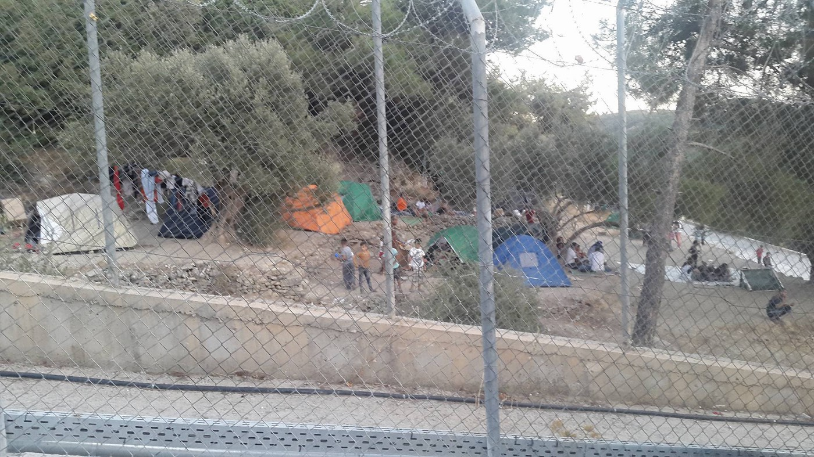

### AYS DAILY DIGEST 5/9/2017: Alien homeland: Afghanistan

_New report on the situation of returnees to Kabul / 223\.000 people internally displaced in Afghanistan in 2017 alone/ Sea arrivals in Europe drop but in comparison remain high in Greece / Search of No Name Kitchen house in Belgrade / First asylum granted in Serbia in 2017 / Evacuations in Italy / Several calls for volunteers_

 in Athens show solidarity in front of Acropilis\. Credits: City Plaza\.](assets/9be5db7dce08/1*vGhRuRnnMODIza8kN5ZJ9w.jpeg)

Activists from [City Plaza Refugees Hotel](https://www.facebook.com/groups/943355035786244/) in Athens show solidarity in front of Acropilis\. Credits: City Plaza\.
### Alien homeland: Afghanistan

Young Afghan men, especially the ones who arrive as unaccompanied minors in Europe, are facing a difficult situation when turning 18 years old\. The forms of protection they receive as minors are not valid anymore and they have to start their procedure as regular asylum seekers\. But the **recognition rate for Afghans in first instance was only 47%** in the first quarter 2017 \( [Eurostat](http://ec.europa.eu/eurostat/statistics-explained/index.php/Asylum_quarterly_report) \), which means that every second Afghan does not receive protection status in the European Union\. \(The recognation rates vary among the member countries\) \.

For these young men, the new procedure means that they can lose their legal status and be **denied further protection** \. Due to the estimated security situation of their area of origin, authorities can deny their application and order them to leave the host country — back to Afghanistan, regardless how long they stayed in the host country or how well they are integrated\. Some spent their youth outside Afghanistan\.

Asylos, a global network of volunteers, [released](https://asylos.eu/wp-content/uploads/2017/08/AFG2017-05-Afghanistan-Situation-of-young-male-Westernised-returnees-to-Kabul-1.pdf) a detailed report about the situation for these returnees back in Afghanistan\. In their documentation they not only cover forcible, but also voluntary returns from Europe to Kabul and provide in\-depth information which can be useful especially for legal representatives, practitioners working with these young Afghan males\.

Talking to the Asylos researchers, Abdul Ghafoor, the director of the Afghanistan Migrants Advice and Support Organisation \(AMASO\) in Kabul reveals: “Here is no any immigration person in the airport and nothing happens\. There are **not even proper medical facilities** that to check if you are fit enough to come to Afghanistan, what problems you have\. There is nothing like that\.” He further describes, that for returnees without a place to go, there is an accommodation offer for only two weeks\. After this two\-week period, people have to leave, even though **this means they are homeless** \.

But even if the returnees find relatives, it can be **hard for them to reintegrate into society and their family** \. Ghafoor later explains: “For someone who has been in Europe for 5 or 6 years and he has been away from religious issues, so it is very difficult to reintegrate into the family and society\. Yes, there have been cases that returnees were marginalized by the family because they are too westernized and they can create problems for their brother, their sister and parents, so they tell them don’t come to the area and stay away from us\.”

### Afghanistan

During the past months, several NGOs have pointed out that there are almost no safe zones in Afghanistan and the designation of a safe zone can hardly be more than temporary\. Conflicts and conflict zones are not static, war areas move with the clashes\. According to a new [UNHCR report](http://reliefweb.int/report/afghanistan/afghanistan-weekly-field-report-28-august-3-september-2017) , only in the **last week more than 11,000 people have been displaced internally** , raising to total number to 223,000 for 2017\. Since the US started withdrawing their troops from Afghanistan in 2015, the Taliban have been on the rise again\. Nowadays in almost all regions of the country, conflicts have already broken out or there is at least a risk of assaults\.
### Lebanon

AYS has visited Lebanon and camps and informal settlemtns in that country which hosts over 1\.5 million refugees from Syria\. We learned that every refugee from Syria has to be registered with UNHCR, and than pay a fee to the government in the amount of $200\.

_“If registered, they receive monthly help\. The amount varies depending on the vulnerability of the family and the place they live\. If people live in houses \(including substandard buildings\) they receive less\. In winter people receive money for fuel\. This help is also targeted at food, rent\. The amount depends also on the number of family members,”_ Sofia Kordonets, law expert and former volunteer with Salam LADC said\.

Additionally, every newcomer family, even without registration, used to receive arrival kits \(mattresses, blankets, jerry cans, kitchen ware, mats\) and materials to build a tent\. This no longer holds true\. Now new arrivals need to wait anywhere from 1–3 months to receive assistance, and most are not getting anything\. This is why Salam LADC has started providing new arrival kits\. UNHCR is low on staff and funds for this, and are also looking at changing over to a total cash distribution system\.

[See our full report from Lebanon](ays-special-precarious-living-conditions-for-millions-of-refugees-in-lebanon-81f8845b6a9a) \.

### Sea

The number of people arriving in Europe through the central Mediterranean route remains lower than in the previous months\. According to IOM, last week fewer than 5000 people arrived\. As of 3rd September, almost 100\.000 arrived in Italy and more than 15\.000 in Greece\.

](assets/9be5db7dce08/1*YFWGU267FZ0eYHwBdaWBog.jpeg)

In Berlin activists rolled out a 100 meter long list with the names of more than 17\.000 people who died on the sea\. Credits: [Gegen das Sterben im Mittelmeer](https://www.facebook.com/StopTheDying/)
### Greece

The number of people stuck on the Eastern Aegean islands is constantly dropping due to transfers to the mainland\. Nevertheless, numerous protection seekers still have to sleep rough on Samos\. The reception center only has an official capacity of 700, but more than 2,400 are being accomodated there\. This situation is forcing them to look for other, inhumane shelters\.

The makeshift camp on Samos\.

Meanwhile, Greek authorities registered 173 new arrivals on Monday: 108 on Lesbos, 46 on Samos and 19 on Chios\. Today volunteers reported 83 arrivals on Samos, 58 on Lesbos and 103 have been [rescued](http://www.ekathimerini.com/221398/article/ekathimerini/news/more-than-100-migrants-rescued-from-sea-off-crete) at sea off Crete\.

The [Feox rescue team](https://www.facebook.com/permalink.php?story_fbid=1973360302948605&id=1584119558539350) on Chios is calling for volunteers to join their activities\. They include distributions as well as warehouse work, community work in the camp and assistance for boat landings\. Interested volunteers can contact them on Facebook or write a mail to feox\.chios@gmail\.com\.

On the mainland, residents of countryside camps are struggling with the living conditions\. Volunteers report from Lavrio, close to Athens, that 86 people have been left without assistance\. They receive cash cards, but have to walk some 30 minutes to the next market\. To keep the support for these people going, volunteers and donations are needed\.

Cash card is the right keyword to highlight some changes in the programme in the region of Athens\. As the International Rescue Committee starts managing the programme, the procedure will change\. The most important change is that instead of being visited by the staff, people now have to visit the cash office of IRC in Athens to get the certificate to still be eligible for the programme\.

The Elliniko warehouse will have new opening times from 11th September on: Tuesday\-Thursday from 11\.00–17\.00\.
### Serbia

No Name Kitchen today had to face an unexpected search by the Serbian police\. “A group of policemen and inspectors came through our door with a search warrant to see what we were doing in the house\. Although they’ve known for some time what we do in there”, they said in a statement\. After ID checks they handcuffed and arrested one Afghan, who was supposed to go to Adaševci camp later that day\. Also one of the volunteers, who could not immediately identify himself, had to follow them \(without handcuffs\) to the police station, but — unlike the Afghan — was released without any charges\. So far they do not know what happened to their friend\.

For the first time this year, asylum [was granted](http://www.apc-cza.org/en/component/content/article/8-vesti/1216-prvi-odobren-azil-u-2017-godini.html) to a refugee in Serbia\. He is a person from Syria who filed his asylum request one year ago\.

He came to Serbia in 2011 and applied for asylum in 2015\. First he got subsidiary protection which lasted one year, and then, after he appealed, he was granted asylum\. According to the Center for protection and assistance for asylum seekers, since the beginning of 2017, a total of 158 people have applied for asylum, but only one person has been granted any kind of protection which is guaranteed by the existing law in Serbia\.
### Italy

According to volunteers, today the police once again evacuated the Piazza Madonna di Loreto\. Reportedly they not only took blankets and mattresses, but also personal belongings\.

](assets/9be5db7dce08/1*eLAgqf-adqijU0BwYn0Ysg.jpeg)

The evacuation at Piazza Madonna di Loreto\. Credits: [Progetto Degage](https://www.facebook.com/progettodegage/?hc_ref=ARS4FVAhDdFbmoqXstctem3AVl9BmoDc4ue-ND21-J0Iw6wuuWaMx19buZtOIPrlXzc)

[In Milan](http://milano.repubblica.it/cronaca/2017/09/05/foto/milano_sgombero_scuola_occupata_via_pizzigoni-174662588/1/?ref=fbplmi&fref=gc&dti=1652972374920129) , a former elementary school, Colombo in via Pizzigoni, was evacuated at dawn this morning\. A total of 90 migrants were living there, mainly from Senegal, Gambia and Morocco; together with them, there were also other destitute people\. Around 100 members of the police forces were present\. The former elementary school has been occupied for 6 months\. Among the people evacuated there were many without legal papers who have been taken to the Questura, while those who have applied for asylum are being monitored and inspections are carried out to place them in specific centres\. Occupied buildings are under strict control because the local administration wants to avoid concentrating migrants in demeaning conditions for security reasons after terrorist threats and also to avoid clashes with locals\.
### France

[Care4Calais](http://care4calais.org/wp-content/uploads/2017/09/Priority-Items-050917.pdf) is asking for volunteers and donations\. The NGO is supporting people in Northern France as well as in Paris and Brussels\.

> **_We strive to echo correct news from the ground, through collaborationand fairness, so let us know if something you read here is not right\._** 

> **_Anything you want to share — contact us on Facebook or writeto:areyousyrious@gmail\.com_** 

_Converted [Medium Post](https://areyousyrious.medium.com/ays-daily-digest-5-9-2017-alien-homeland-afghanistan-9be5db7dce08) by [ZMediumToMarkdown](https://github.com/ZhgChgLi/ZMediumToMarkdown)._
