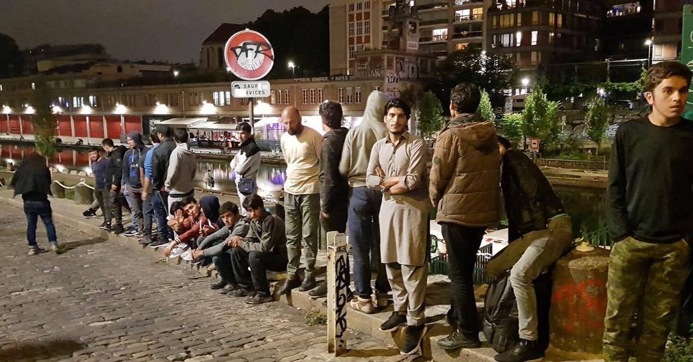

### AYS DAILY DIGEST 07\.09\.2017:Human Cruelty — the cost of current “migration management”

_Registration updates in Greece and call for action in Crete // Volunteer opportunities in Greece and Serbia // Call to support anti\-deportation action in Austria // Needs list for urgent support in France // Loan project in UK // Finland deports another_

](assets/80c461eb803a/1*3tGhspQjbI8q4Jkhxe0jfA.jpeg)

Photo credit: [**Acaro Tzigano Josè Arcadio**](https://www.facebook.com/acaro.tzigano?fref=gs&hc_location=group_dialog)
### Feature: Human Cruelty — the cost of current “migration management”

Several groups of humanitarian workers and activists are trying to bring awareness to the corruption and dangerous collaboration between European leaders and Libyan officials in encouraging the harming of refugees setting out from Libya\.

MSF has been extremely active on Twitter in calling for dissent and bringing awareness to the systematic human rights abuses against refugees in Libya\.

■■■■■■■■■■■■■■ 
> **[MSF Sea](https://twitter.com/MSF_Sea) @ Twitter Says:** 

> > LIVE: "What I saw in #Libya was the most extreme incarnation of human cruelty that I have ever seen."- @JoanneLiu_[MSF](https://twitter.com/MSF) after 21 years of @[MSF](https://twitter.com/MSF) 

> **Tweeted at [2017-09-07 09:06:43](https://twitter.com/msf_sea/status/905718964508139520).** 

■■■■■■■■■■■■■■ 

Horrifying reports of sexual and all forms of violence against those pushed into the margins of society — at the mercy of smugglers or corrupt officials\.

■■■■■■■■■■■■■■ 
> **[MSF Sea](https://twitter.com/MSF_Sea) @ Twitter Says:** 

> > This is the daily reality of #migrants and #refugees in #Libya. Are you OK with this? We are not. Retweet to send a message to #Europe. https://t.co/aQ0bG3xfOy 

> **Tweeted at [2017-09-07 14:44:21](https://twitter.com/msf_sea/status/905803935188963328).** 

■■■■■■■■■■■■■■ 

European officials hope to prevent further migration to Europe by blockading refugees in Libya, claiming they are not equipped to deal with this level of migration\.

In a scathing open letter to European officials, MSF states:

> Libya is just the most recent and extreme example of European migration policies which go back several years, where a primary objective is to push people out of sight\. The EU\-Turkey deal from 2016, what we have seen in Greece, in France, in the Balkans and beyond, are a growing trend of border closures and push backs\. 

> What this does is close options for people who seek safe and legal ways of coming to Europe and pushes them further and further into the smugglers’ networks, which European leaders insist they want to dismantle\. Safe and legal avenues for people to cross borders are the only way to eliminate the perverse incentives that allow for smugglers and traffickers to thrive whilst at the same time fulfilling border control objectives\. 

> We cannot say that we did not know that this was happening\. The predation on misery and the horrific suffering of those trapped must end now\. 

Read more [here](http://www.msf.org/en/article/libya-open-letter-european-governments-are-feeding-business-suffering) \.

AlarmPhone also included commentary about Libya in their 6\-week report, stating: “In the summer of 2017, we can witness how the ‘roll back’ of Europe’s border regime leads to an escalating war on migrants that counts already more than 2,400 known casualties\.”

The summary of the report is “deterrence no matter what\.” Read it [here](https://alarmphone.org/en/2017/09/07/deterrence-no-matter-what-europe-escalates-its-war-on-migrants-alarm-phone-6-week-report-24th-july-3rd-sept/) \.

Indeed it is a challenge not to cave to the outright cynical and hypocritical dealings of European officials in regards to the refugee crisis and migration in general\. Migration is an anthropological fact, this is undeniable\. It is a feature of human existence, and we can clearly see that the stubborn refusal to acknowledge this fact and ensure safety to those on the move only results in death, destruction, antagonism, and strengthening the power of evildoers who selfishly gain while attacking the vulnerable\.

All the while, in conference rooms and parliament halls, callous or “saddened” officials wring their hands, pass a resolution for “change” that only further pushes people out and away, while paying lipservice to their humanity by expressing extreme concern over the consequences\. They are happy to allow people to pay the price for their legislative decisions, pinning the blame on a shadowy illegal entity, while paying these evildoers under the table\.

It is typical that with the coming of fall, there is another drop in attention and activity in terms of supporting people on the move — it is vital that we do not back down\. Although volunteers are needed on the field, you can do much work at home, in small ways, and keep at it\.
### GREECE
#### GENERAL

[\#REGISTRATIONS](https://www.facebook.com/hashtag/registrations?fref=gc&dti=1652972374920129&hc_location=ufi) \(Official\) 6\.9\.

[\#Lesvos](https://www.facebook.com/hashtag/lesbos?fref=gc&dti=1652972374920129&hc_location=ufi) 120
[\#Leros](https://www.facebook.com/hashtag/leros?fref=gc&dti=1652972374920129&hc_location=ufi) 46
Total: 166

Makes more than 1000 new arrivals in six days\. In Italy in the same time “only” 716 people disembarked\. Not sure if this ever happened in this year, that Greece saw more arrivals than Italy in a period of one week\.

Additionally, here are the new arrivals\. This does not include those who arrived to Crete \(more info below\)

#### CRETE

Around 73 people arrived to Crete today, with 100 being transported from Crete to Athens\. It is clear that there is continued effort to transport people from the islands to the mainland\.

Activists report that Crete not be overlooked in terms of overloaded, under\-supported reception centers\. There is a serious shortage of services on Crete, no lawyers, not enough volunteers\. Haphazard detention of refugees makes people feel insecure as it is never clear who will go to detention, who will go to regular camps on the mainland, yet Crete continues to be on the front lines\. There is little to no system established for Crete being an entry point\. Of course, people are being pressured to take ever more dangerous routes and will end up in places not equipped to support them\.

■■■■■■■■■■■■■■ 
> **[NoBorders](https://twitter.com/Refugees_Gr) @ Twitter Says:** 

> > 72 #refugeesgr arrived in Heraklion #Crete today.
Among them, 22 children/infants &amp; 13 women from Iraq/Syria
#antireport
photos imagelive https://t.co/AlJGygG8IB 

> **Tweeted at [2017-09-07 21:28:44](https://twitter.com/refugees_gr/status/905905698894209028).** 

■■■■■■■■■■■■■■ 

[NoBorders](https://www.facebook.com/nobordersnetwork/) has put out a call for support for Heraklion, Crete: 

“We need bed sheets and sleeping bags\.
The previous boat \(100 people\) is in the building of Heraklion’s passengers’ port gate where without a translator are trying to get their tickets for Athens, along with members of the Heraklion Initiative for Refugees / Immigrants\. 
…\. They have money, it’s just difficult to understand\.
We need people at port to play with the children \(a bit of painting, a little plasticine\) and help us request tickets with a 50% discount\.
For more updates, we’ll let you know\.”
#### SAMOS

Continued distressing reports coming from Samos\.

■■■■■■■■■■■■■■ 
> **[City Plaza Squat](https://twitter.com/sol2refugees) @ Twitter Says:** 

> > #HotSpot #Samos has the capacity for 600 people, now 2000 #refugees inside in a horrible condition. #Philoxenia used to be a Greek word! https://t.co/unk9bPxutN 

> **Tweeted at [2017-09-06 08:59:43](https://twitter.com/sol2refugees/status/905354815013838849).** 

■■■■■■■■■■■■■■ 

#### VOLUNTEER CALLS

“REGULAR VOLUNTEERS WANTED FOR THE ELLINIKO WAREHOUSE
Pampiraiki runs the Elliniko warehouse which is the central humanitarian aid hub in Athens, receiving supplies from volunteer\-groups abroad and distributing to refugees in camps, self\-managed shelters, daycenters, flats etc\.
If you live near Elliniko and can assist in the management of the warehouse and the distribution with your car or our vans, as a regular volunteer, please send an email to pampiraiki@gmail\.com or call us on \+306906408586 \(Whatsapp\)
We are open Tuesday\-Friday from 11 a\.m\. to 5 p\.m\. 
[https://goo\.gl/maps/7VmJ758vCkC2](https://l.facebook.com/l.php?u=https%3A%2F%2Fgoo.gl%2Fmaps%2F7VmJ758vCkC2%3Ffref%3Dgc%26dti%3D1652972374920129&h=ATNIbGPGndkjrP6cCJXEWqfhFso0ibPZIa6udj7YbRYGXU1vxNbd4s6d1jDVbP4gHRJ9d5UVmA-gDGtyBiUs8kpF-EXR3yQaixetlvU6HSN7jv7sh9Up4EaAmavcGv8aRkaHXJNs4yF2vKI) ”

[Movement On the Ground](http://Movement On The Ground) \(Lesvos\) also is in need of volunteers\.

“ATTENTION to all the tech\-savvy people\!

We are looking for a long\-term tech\-savvy volunteer to join our team in Lesvos\. Having technological skills in society is indespensable these days\. We are offering our Kara Tepe community Internet and connectivity\. Besides the need of knowledge for WIFI and IT systems you will also be assisting in our Digital Learning Lab where we will being teaching computer skills to the Kara Tepe residents\.

‘The one’ we’re looking for is:
\- Tech\-savvy \(preferably with a professional/educational IT background\)
\- Confident enough to teach people
\- Patient and good with people
\- Structured and organized \(you’ll have to prepare the lessons\) \.
\- 21 years or older
\- Willing to spend a few months on the beautiful Greek island Lesvos
\- Financially independent
\- Excited to positively contribute to the lives of ourresidents in the campUS

Are you the one? Please apply through volunteer@movementontheground\.com\. Don’t hesitate to tag all of your friends that would be a good match\!”
### SERBIA

[**TruckShop**](https://www.facebook.com/freedomofchoiceproject/?hc_ref=ARQpN-44GD3vVF5KAs7WgttAvBsYcGKIeYigKmwkNjKg6Jwu98NqFoTdJrARMVYQPX0) has announced a new project that will soon be active in Serbia — a mobile washing and drying facility\! It is being co\-sponsored by MSF and will be able to be moved to different locations, hopefully reducing the incidences of skin disease both inside and outside the camps in Serbia\. Read mere below\.

Photo credit: TruckShop

Photo Credit: TruckShop

Read more on their page, linked above\.

Refugee Aid Serbia is looking for volunteer teachers of the Serbian language for their educational center\! \! This is a great way to gain some experience teaching and make new friends\! Send an email to volunteer@refugeeaidserbia\.org \!
### AUSTRIA

URGENT CALL TO PREVENT DEPORTATION IN AUSTRIA\! \! \! \!

A refugee from Afghanistan who has been living in Austria since March of 2015 and has since learned German to B1 proficiency and is working in an NGO was taken into custody and is facing deportation\! He was picked up in Niedernsill and is being transported to Vienna, where he will face deportation to Afghanistan\.

It is recommended that citizens of Austria immediately send this form letter or one like it to this address \(in German\) \.

“Zur Unterstützung von Hamed sendet BITTE diesen Brief an folgende Mailadressen

Innenministerium: ministerbuero@bmi\.gv\.at
Bundespräsident: buergerservice@hofburg\.at
BFA Salzburg: BFA\-RD\-S\-Einlaufstelle@bmi\.gv\.at

Betrifft: Abschiebestopp & Bleiberecht für Hamed AHMADI, geboren 1\.1\. 1980, 
wohnhaft in Niedernsill, aktuell \(7\.9\.17\) von Abschiebung bedroht und in Abschiebehaft

Sehr geehrte/r …\. \.

Wir ersuchen Sie dringend, die Abschiebung von Hamed AHMADI zu stoppen, damit der anhängige Antrag auf Wiedereinsetzung vom VwGH entschieden werden und Hamed AHMADIs Fall in der zweiten Instanz behandelt werden kann\.

Rechtsberatung hat Rechtsmittel zu spät eingebracht, und Versehen eingestanden

Hamed AHMADI hat im März 2016 in erster Instanz einen negativen Bescheid erhalten\. Das Rechtsmittel dagegen wurde von der zugewiesene Rechtsberatung zu spät eingebracht\. 
Das war leider vorerst niemandem bekannt\. Erst ein Jahr später kam die Information, dass es in diesem Fall zu einer Fristversäumnis gekommen ist\. Daraufhin hat die Rechtsberatung sofort einen Antrag auf Wiedereinsetzung gestellt und selbst betont, dass die Fristversäumnis aufgrund von Arbeitsüberlastung seitens der Einrichtung selbst passiert ist\. Der Richter am VwGH hat darüber bis dato nicht entschieden\. Daher wurde Hamed AHMADI heute morgen, Donnerstag, 7\. September 2017, aus seinem Wohnort abgeholt\.

Hamed AHMADI ist gut integriert, spricht Deutsch, arbeitet als Saisonier

Hamed AHMADI ist von einer Gruppe ehrenamtlicher UnterstützerInnen seit seiner Ankunft in Niedernsill begleitet worden und bestens integriert\. Auch laut Angaben des Bürgermeisters ist er mittlerweile ein gut integrierter Mann in Niedernsill und beherrscht Deutsch auf Niveau B1 \(mit Zertifikat\) \. Er war einer der wenigen Menschen, die in der laufenden Sommersaison in einem Gastgewerbebetrieb \(Gasthof Kröll in Niedernsill\) als Saisonier beschäftigt worden war\.

Wir bitten eindringlich, dass Hamed AHMADI die Chance bekommt, dass sein Antrag auf Wiedereinsetzung entschieden wird, und er aufgrund seiner gelungenen Integration in Niedernsill bleiben darf\. 
Der Verfahrensfehler wurde von seiner Beratungsstelle zugegeben und soll nicht zu derartig schwerwiegenden Folgen für ihn führen\.

Bitte setzen Sie sich für ihn ein und stoppen Sie die Abschiebung\. Sie haben all unsere Unterstützung\.

Mit freundlichen Grüßen,…”

Go [here](https://www.facebook.com/fluechtlingewillkommensalzburg) to follow the story\.

Photo credit: Calais Action
### FRANCE

The [**Dunkirk / Dunkerque Refugee Women’s Centre**](https://www.facebook.com/refugeewomenscentre/?ref=gs&hc_ref=ARQHd44wSI9KnBrGNCYk8IIDhIUIHXzF8pDze5qPHSAZ0G8M2cPop9w1C5oQbIoggZg&fref=gs&hc_location=group) put out a call for sleeping bags and tents\. With the change in weather towards fall, it means better and more secure warm accommodation is necessary, but sadly lacking for many refugees\. Sleeping bags and tents are almost always in demand through the fall and winter months \(it is important they are cold\-weather sleeping bags\), but due to their expense, they are very rare to get\. Please consider starting to raise funds and find suppliers NOW so that a constant supply can be provided wherever they are needed, in France or beyond\. For a full list of what is needed at the Dunkirk/Dunkerque Refugee Women’s Centre, go [here](https://docs.wixstatic.com/ugd/7942f5_1c66d728480a40aa83f8d33701b64dbf.pdf) \.

“The situation in Calais and Dunkirk is far worse than it has ever been\.”

This is from the Refugee Community Kitchen that has been working nonstop to provide people with nourishing meals\.

Watch their video below\.

There are around 2000 meals a day and in addition to RCK, [Utopia 56](https://www.facebook.com/asso.utopia56/?fref=mentions) , [Help Refugees](https://www.facebook.com/HelpRefugeesUK/?fref=mentions) and [L’Auberge des Migrants](https://www.facebook.com/LAuberge-des-Migrants-358496450338/?fref=mentions) are all feeling the pinch as donations and volunteer numbers drop\. PLEASE consider donating now\.
### UK

Help Refugees announced another project that is assisting refugees in getting requalified for their profession\. This project is a collaboration with RefuAid and provides refugees with interest\-free loans, allowing them to get the necessary education and training to transfer their previous skill sets to their new home\. This and other job training programs are an actionable way to help welcome refugees into your community\. Read fully about the program [here](https://www.equalaccessloan.org/donate-1/) \.
### FINLAND

According to activists in Finland, six more individuals of Afghan nationality were deported the night prior\. Follow [**Afghanistan Migrants Advice & Support Org**](https://www.facebook.com/Afghanistan-Migrants-Advice-Support-Org-195295217167437/?ref=gs&hc_ref=ARRZrBOekhg7A9xfD2LQBW2a3daQE8egt0aex9GUcig11ajykE9ARtrnZLK8I7GtNcg&fref=gs&hc_location=group) **for more information\.**

Just a reminder to citizens everywhere — you can take action against deportations\. If the pilot refuses to take off, deportation can be delayed\. Stay up\-to\-date on potential deportations, inform as many passengers as possible in a calm, respectful way \(if passengers refuse to sit, the pilot cannot take off\), and take other action\.

> **_We strive to echo correct news from the ground, throughcollaborationand fairness, so let us know if something you read here isnot right\._** 

> **_Anything you want to share — contact us on Facebook orwriteto:areyousyrious@gmail\.com_** 

_Converted [Medium Post](https://areyousyrious.medium.com/ays-daily-digest-07-09-2017-human-cruelty-the-cost-of-current-migration-management-80c461eb803a) by [ZMediumToMarkdown](https://github.com/ZhgChgLi/ZMediumToMarkdown)._
