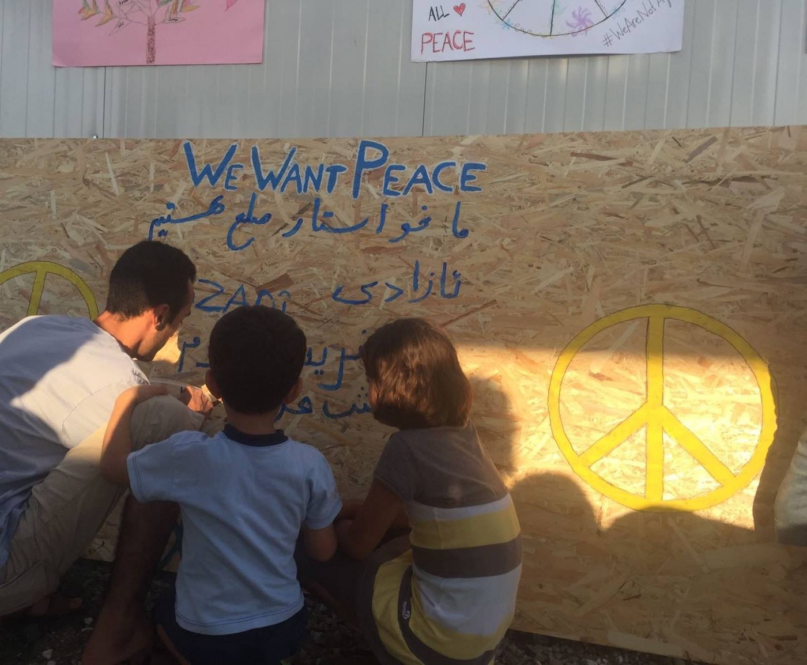
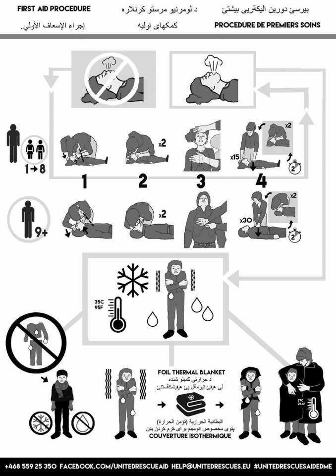
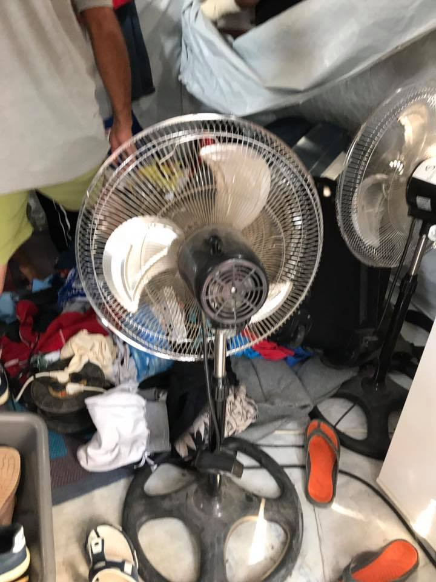
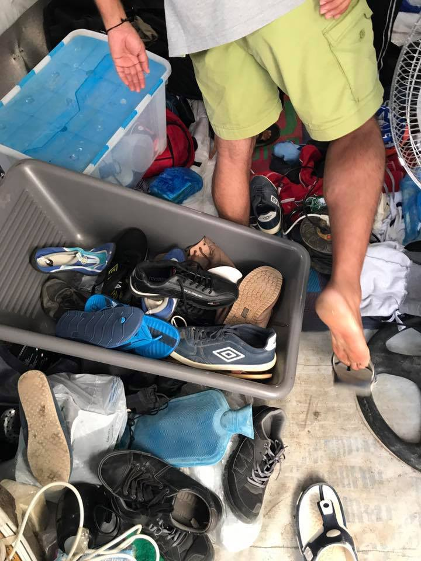

### AYS DAILY DIGEST 11/09/2017: Seeds of violence bear bad fruit…

_UN commissioner on human rights speaks out about violence against refugees, but where does action start and where do words end? // Violence on Chios as 350 police storm the camp // Protests on Samos about squalid living conditions // Increase in passage from Macedonia to Serbia // Refugees and migrants trapped in a cycle of violence in Libya // Xenophobic misinformation in Italy // More police presence and monitoring in France // Police descend and arrest refugees waiting in line for food\._

Photo Credit: We Are Here
### FEATURE: The banal bureaucracy of violence against refugees

The United Nations High Commissioner for Human Rights made a statement today addressing his continued deepening concern over flagrant abuses of [human rights around the world](http://www.ohchr.org/EN/NewsEvents/Pages/DisplayNews.aspx?NewsID=22041&LangID=E) \. He paid special attention to Libya, stating:

> I am appalled at the horrific abuses migrants face after being interceptedand returned to Libya\. Extra\-judicial killings, slavery, torture, rape, human trafficking and starvation are only some of the abuses reportedly inflicted on migrants in both official and informal detention centres in the country\. I remind all EU governments, and indeed all governments worldwide, that no human being may ever, under any circumstances, be deported to a place where he or she faces the likelihood of torture and human rights violations\.Given the prevailing impunity and lawlessness in parts of Libya, I am extremely disturbed by recent reports suggesting that armed groups are now stopping and detaining migrants trying to leave the country, possibly with the encouragement of some Member States of the EU\. The EU and its member States must ensure that any cooperation agreement with Libya fully respects the rights and dignity of migrants\. 

He also paid mention to maltreatment of refugees in Hungary and encouraged all to follow the example of the island of Tilos, Greece, which has become famous for it’s welcoming spirit\.

However, although it brings some hope to see officials breaking silence on these ongoing issues, it is hard to feel that it is not mere lip service\. If the EU can do little more than frown on the actions of the Hungarian government, how are we to expect a manifestation of political will in ensuring that “any cooperation agreement with Libya fully respects the rights and dignity of migrants\.” Indeed, the agreement that’s settled upon may, indeed, say this, but once again, these remain words, not deeds\.

The German Interior Minister opined on Tuesday that refugees who “rely on smugglers” will not be rewarded in Germany\. Potentially opening up tens of thousands more to deportation and further police violence and infringement upon their freedom\. Yet it was this violence against them — this limitation upon their rights and infringement upon their dignity that often pushes people to rely upon smugglers\. The utter perversity of a system that punishes those who do not tolerate or welcome their own humiliation for the sake of protecting the system should be clear to all by now\.

May our spines tingle cold and our faces redden with shame at how history will look back upon this chapter\.
### TURKEY

More than ten days ago near Izmir\. A bus carrying Iraqi and Syrian refugees overturned\. The refugees were heading to the starting point at the Aegean Sea to set out to the Greek islands\. The bus driver was under the influence of alcohol and the bus, then, collided with an electrical pole, resulting in the death of a Kurdish woman and injuring most passengers with fractures and serious injuries\.

Helpful guide on preventing hypothermia by United Rescue Aid
### GREECE

Statewatch highlighted some of the most disturbing aspects of the first annex to the 7th report on the implementation of the EU\-Turkey deal\.

In it, the writers called for an increased number of police officers, the possible implementation of an electronic entry and exit system to camps and the Greek authorities are considering “limiting the number of appeal steps\.” Additionally, of course, there is a trend to invest in expanding the “pre\-removal capacity” of various hotspots…aka, place to keep people “safe” until they are sent back\.

[\#REGISTRATIONS](https://www.facebook.com/hashtag/registrations?fref=gc&dti=1652972374920129&hc_location=ufi) \(Official\) 10\.9

[\#Lesvos](https://www.facebook.com/hashtag/lesbos?fref=gc&dti=1652972374920129&hc_location=ufi) 177
[\#Chios](https://www.facebook.com/hashtag/chios?source=feed_text&fref=gc&dti=1652972374920129&hc_location=ufi) 54
Others 31

Total: 262

Total numbers for Friday and Saturday: 161 \+ 141
#### Chios

In an unsettling follow up to the police actions on Saturday on Lesvos, there was a stunning and violent police action today in Souda camp on Chios\. Twenty\-three were transferred to the police station and four of these were arrested, three of them for possessing knives, one for possessing “untaxed cigarettes,” according to [Theurgia Goetia](https://medium.com/u/18d0b19d81f4) \.

According to Enough is Enough, 350 police officers stormed the camp\.

Video and photo credits: [**Mohammed R Azawi**](https://www.facebook.com/mou.vatushy?hc_ref=ARSwm_qv_8ljqlRtAkZX566Ay2GMRf5C4r8GU914hdma-HX4EPRydByCHC7ffd24hQY)

Around 53 new people arrived on Chios today and were transferred to Vial, where all will be transferred finally upon the closure of Souda, which looks imminent\.
#### Lesvos

There were around 131 new arrivals to Lesvos, according to Advocates Abroad, 40 of them were children\. Additionally, 27 were rescued near Kos\.
#### Samos

There were protests today on Samos against the horrific living conditions there, conditions which we wrote about [here](ays-special-hello-i-am-a-refugee-in-the-camp-in-samos-and-we-need-your-help-4fd34d43d12) \.
### MACEDONIA

According to Legis, the number of people who passed from Macedonia to Serbia jumped in August from 45 to 72, July and August respectively\. This is still not the sharpest increase which was from June to July, 9 to 45\. Also for August, there were no registered pushbacks\.
### SEA

Arrivals to Italy have dropped significantly in the wake of the policy change on July 16th, however a correspondent covering North Africa has grisly, uncomfortable details on the developing situation in Libya that shows there is another side to this story\.

■■■■■■■■■■■■■■ 
> **[Frédéric Bobin](https://twitter.com/FrdricBobin) @ Twitter Says:** 

> > 1/ #Libya #Migrants According to a migrant in Sabratah (phone ITW), no militia prevents migrants from leaving the coast. 

> **Tweeted at [2017-09-11 11:39:25](https://twitter.com/frdricbobin/status/907206944347316224).** 

■■■■■■■■■■■■■■ 

■■■■■■■■■■■■■■ 
> **[Frédéric Bobin](https://twitter.com/FrdricBobin) @ Twitter Says:** 

> > 2/ #Libya #Migrants . Migrant in Sabratah (phone) : « Still now, they let us go but then catch us at sea. They brought us back on shore". 

> **Tweeted at [2017-09-11 11:40:22](https://twitter.com/frdricbobin/status/907207183124877313).** 

■■■■■■■■■■■■■■ 

■■■■■■■■■■■■■■ 
> **[Frédéric Bobin](https://twitter.com/FrdricBobin) @ Twitter Says:** 

> > 3/ #Libya #Migrants. « Then they toture us and ask for more money ». 

> **Tweeted at [2017-09-11 11:41:48](https://twitter.com/frdricbobin/status/907207544967442432).** 

■■■■■■■■■■■■■■ 

■■■■■■■■■■■■■■ 
> **[Frédéric Bobin](https://twitter.com/FrdricBobin) @ Twitter Says:** 

> > 4/ #Libya #Migrants. The new situation in Sabratah means actually more extorsion against migrants. Exploitation worsens. 

> **Tweeted at [2017-09-11 11:42:36](https://twitter.com/frdricbobin/status/907207745383923712).** 

■■■■■■■■■■■■■■ 

■■■■■■■■■■■■■■ 
> **[Frédéric Bobin](https://twitter.com/FrdricBobin) @ Twitter Says:** 

> > 5/ #Libya #Migrants. Why aren’t they even prevented from leaving the beaches ? Why keeping alive the illusion they stil can do it ? 

> **Tweeted at [2017-09-11 11:43:56](https://twitter.com/frdricbobin/status/907208080701755392).** 

■■■■■■■■■■■■■■ 

■■■■■■■■■■■■■■ 
> **[Frédéric Bobin](https://twitter.com/FrdricBobin) @ Twitter Says:** 

> > 6/ #Libya #Migrants. Less arrivals in Italy doesn’t mean less departures from Sabratah. In between, more interpections and more extorsion 

> **Tweeted at [2017-09-11 11:44:54](https://twitter.com/frdricbobin/status/907208326479572992).** 

■■■■■■■■■■■■■■ 

When will policy\-makers accept the blood that is on their hands by incentivizing this sick, needless suffering\.
### ITALY

Some outlets of the Italian media have accused refugees and migrants of bringing disease to Italy, specifically malaria\. The completely false accusations surfaced after a four\-year\-old girl died of malaria who had not gone to a malaria\-prone country\. She was receiving diabetes treatment at a clinic where a family who had returned from a trip were being treated for malaria, meaning that the story is completely unfounded and has an explanation\. Sadly, these “truthy” lies catch on and are hard to expunge from the minds of people, especially those now desensitized through the vast overproduction of fake and competing news\. Read more [here](http://www.infomigrants.net/en/post/5022/italian-media-accuse-migrants-of-bringing-in-disease) \.
### FRANCE

Solidarithe posted an update on Porte de la Chappelle, which is still being kept under strict monitoring by police and other security\. Refugees are not there now, but, rather, in hiding\.

> The police and official bodies are working hard to continue the ‘out of sight — out of mind’ tactic\. But with new arrivals every day, this is slowly becoming impossible\. It is terrifying that vulnerable people who have little understanding of what to do now they have arrived in the country they wish to claim asylum in, supposedly a ‘safe place’, are having to hide and make themselves invisible only emerging at specific times for controlled and heavily policed food distributions\. People are freezing at night, lots of them are not able to find suitable shelter to sleep dry and warm\. With winter approaching this makes the situation for people even more desperate\. 

If you wish to donate to Solidarithé to help them continue their work, please go [here](http://youcaring.com/solidarithe) \. It’s sorely needed\.

Please, consider checking out this needs list assembled by a volunteer on behalf of the [Paris Refugees Ground Support team](https://www.facebook.com/PRGS.team/) \. This is a good guidance for all fall/winter\. _PLEASE START COLLECTING/MOBILIZING NOW\._ There is often a lag in the collection and delivery of these items to where many don’t show up until spring, when they are no longer needed\.

_The general needs will look a lot like this:_ 
_\*Sleep and cover\*_

_\-Blankets \(Thick and thin\)_ 
_\-Sleeping bags \(Thick and thin\)_ 
_\-Tents \(popups are the best and 1/2/3 man are ideal, but we’ll take any and all\)_ 
_\-Inflatable pillows\._ 
_\-Tarpaulins Small/Medium/Large\._

_\* \-Backpacks \(Medium\) \*_

_\*Clothing\*_

_\-Mens \(s/m\) brand new socks and underwear\._ 
_\(It would be great if we could make up small packs of just these 2 items in zip lock bags\)_

_\-Mens \(s/m\) tshirts\._ 
_\-Mens \(s/m\) tops\._ 
_\-Mens \(s/m\) jumpers/hoodies\._ 
_\-Mens Trousers/jeans/joggers_ 
_\(s/m sizes 28" to 34"\)_

_\-Mens Shoes and Boots_ 
_\(sizes 40 to 45, especially 42 and 43\)_ 
_\-Mens coats/jackets\. Preferably good winter quality\._

_\-Hats\._ 
_\-Scarves\._ 
_\- \*Gloves\* \._ 
_\-Thermal underwear longjohns/vests_ 
_\-Waterproof jackets \(s/m\)_

_\*Weather protection\*_

_\-Rain ponchos \(by the thousands\)_ 
_\-Foil/Emergency Blankets\. \( by the thousands \)_
### BELGIUM

There were over thirty arrests of people in Belgium this morning in a coordinated police operation\. As is common, the police came in the early morning, first around five to a common sleeping location\. The arrests also continued at 7, even after volunteers attempted to wake people up to warn them about the possibility\. Many items were left behind, some of them recovered\. One man was hit by a car in his successful evasion of police\. The most shameful chapter of the story comes as volunteers report that police, unsatisfied with the number of arrested, targeted a food distribution line outside of an NGO office\.

](assets/3adf6e7d48cf/1*5ZAbSWoBuqohksw-OmYA6g.jpeg)

Photo credit: [**Plateforme citoyenne de soutien aux réfugiés Bruxelles**](https://www.facebook.com/plateformerefugiesbxl/?ref=gs&hc_ref=ARTMG08JU0ENiB-mcq54QU3_H1l0u6IlqSUH9td5-l8kiSQeNj-eOWZwg5-j2MZBc_Q&fref=gs&hc_location=group)

> **_We strive to echo correct news from the ground, through collaborationand fairness, so let us know if something you read here is not right\._** 

> **_Anything you want to share — contact us on Facebook or write to:areyousyrious@gmail\.com_** 

_Converted [Medium Post](https://areyousyrious.medium.com/ays-daily-digest-11-09-2017-seeds-of-violence-bear-bad-fruit-3adf6e7d48cf) by [ZMediumToMarkdown](https://github.com/ZhgChgLi/ZMediumToMarkdown)._
