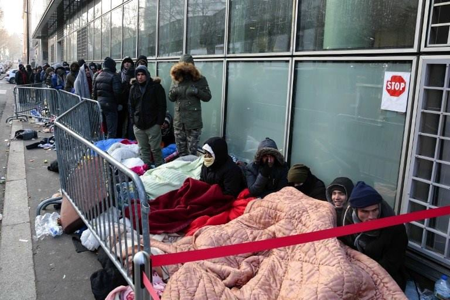
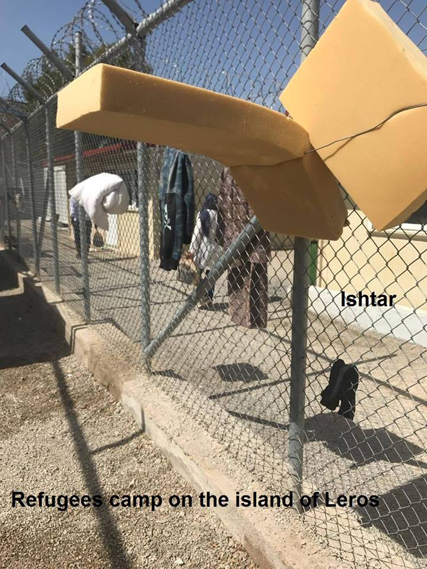
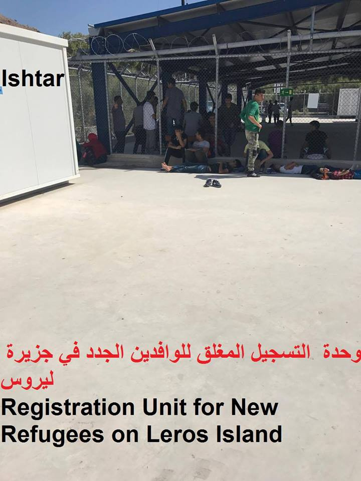
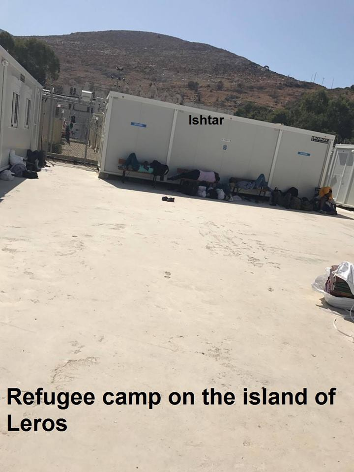
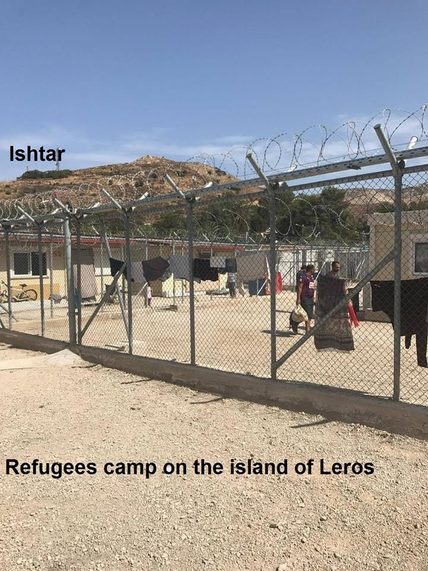
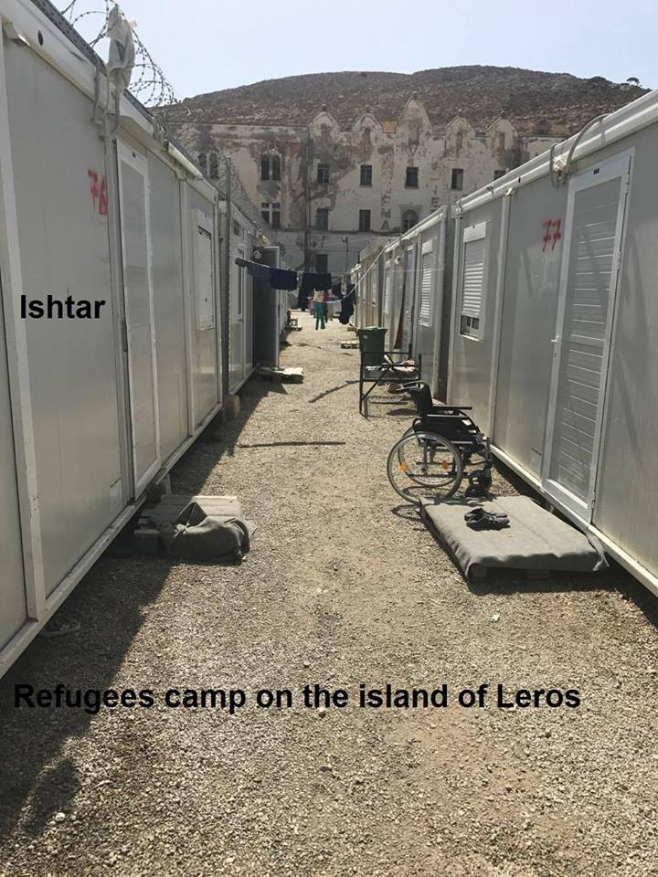
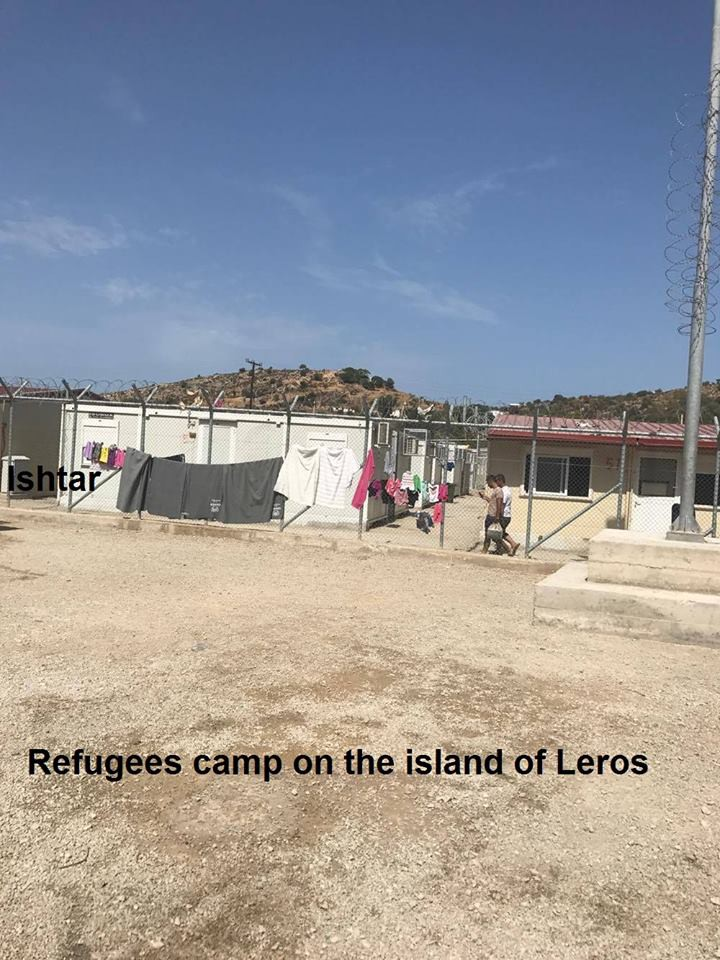
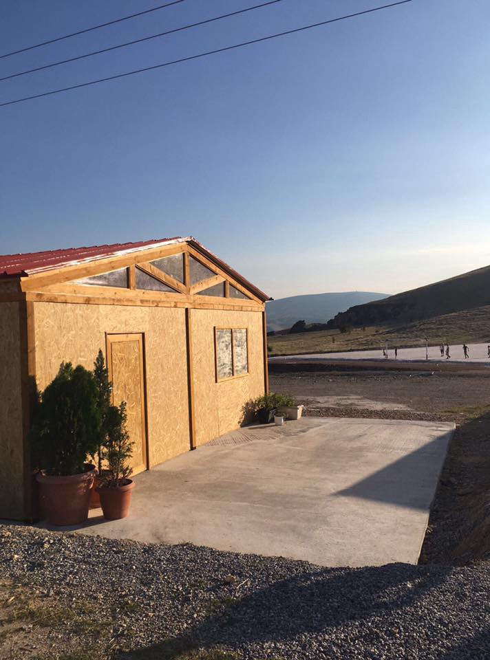
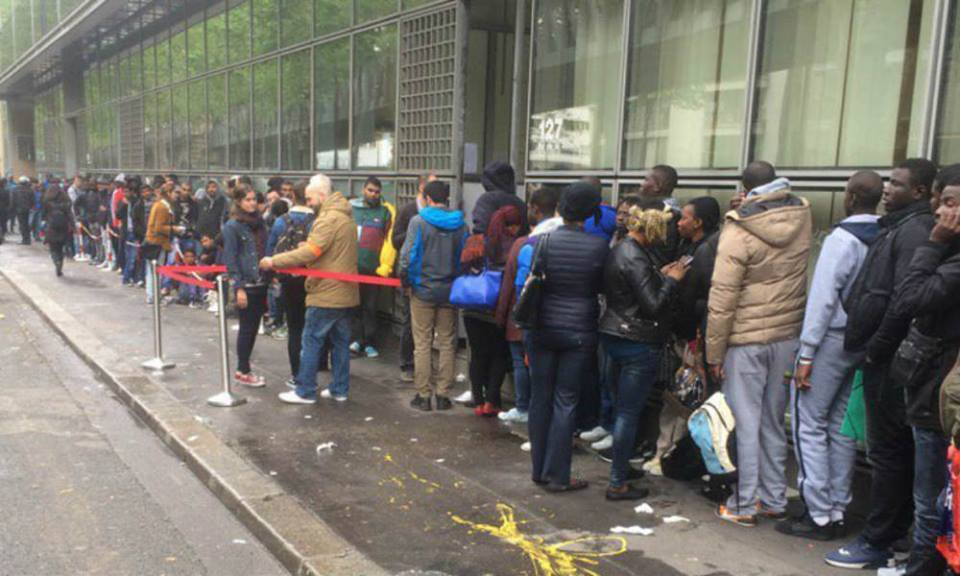

### AYS Daily Digest 20/09/17: End the illegal restriction of family reunification transfers

_Court ruling regarding family reunification / Situation on the Greek islands / Hundreds of refugee children start public primary schools in Serbia / Sleeping rough in Pordenone / Galleria Bombi in Gorizia cleared / People remain at Grande Synthe near Dunkerque / Returns of Sudanese from Belgium expected_

Paris today

A German court has decided on Monday that the family reunification transfer of a Syrian family who went to court, should take place at the latest 6 months after the date that the family reunification was approved, [Mobile Info Team for refugees in Greece](https://www.facebook.com/mobileinfoteam/) reports\. This is the first time that a court has ruled against the limitations of family reunification transfers\. In this specific case, a Syrian minor residing in Germany went to court to get the German state to transfer his mother and minor siblings from Greece before the legally allowed 6 months and won\. The German court ruled that family reunification applicants have the right to be transferred within this law\-given time period and that the German authorities have to make it possible for this to happen\. Pro Asyl, a significant German NGO who helped to build this court case is now requesting from the German Interior Ministry to finally end the illegal restriction of family reunification transfers\. More court cases are suspected to come\.

Since April of this year, the German Interior Ministry has limited family reunification transfers from Greece\. This has led to significant delays for already approved family reunification applicants\. This is against European law which states the above mentioned deadline of 6 months, [Mobile Info Team](https://www.facebook.com/mobileinfoteam/) reminds\.

[Data on unaccompanied minors in Greece](https://data2.unhcr.org/en/documents/download/59187) was released today by UNHCR\. 2,500 children and minors are estimated currently in Greece, with only 1,191 total number of places available in suitable shelters\.

> In response to an [open letter](https://www.hrw.org/news/2017/08/02/letter-minister-mouzalas-detention-unaccompanied-children-greece) from Human Rights Watch in July, Greek Minister for Migration Policy Yannis Mouzalas has [pledged](http://www.amna.gr/home/article/176511/Yp-Metanasteutikis-Politikis-Os-to-telos-tou-etous-ola-ta-asunodeuta-paidia-se-katalliles-domes) that by the end of the year not a single child would be kept in protective custody\. 

> To fulfill this pledge, Greece should use EU funding to provide suitable short\-term alternatives to detention, increase the number of places in long\-term shelters, and establish a foster family system\. Other EU countries have a responsibility to address the situation too\. They should make relocating unaccompanied children a priority, speed up family reunification, and broaden eligibility requirements for relocation so more kids can benefit\. Unaccompanied children currently in police cells in Greece cannot wait any longer, _HRW [writes](https://www.hrw.org/news/2017/09/19/police-cells-are-no-place-migrant-kids) \._ 

#### GREECE
#### Arrivals

First boat came in on Lesvos north, Korakas between 08\.00–09\.00 today with 31 people on board \(11 children, 7 woman and 13 men\) \. Second boat was rescued by HCG outside Mytilíni at 11\.00, carrying 67 people \(19 men, 17 women and 32 children\) \. The last boat had been chased by TCG in to Greek waters\. After pick up by HCG, TCG still followed them for a while\.

Number of registration is:

Chios: 42, Samos: 46, Kos: 34, Others: 8 making a total of 130\. From 1\.7\. to 19\.9 **9258 people** were registered\. This means that **during the last 81 days more people arrived than in the first half of the year** \(between 1\.1\. \-30\.6\. \) \.
#### Chios

The [Athena Centre for Women](https://www.youcaring.com/external-link.htm?target=https-#--_--_-actionfromswitzerland.ch-_-our-work-_-protection-_-athena-centre-for-women-chios-_-) is the first all women\-only space for female refugees, outside of any formal camp structures\. There, their needs can be addressed and be empowered with crucial asylum/health/legal information, psychosocial support, language classes and leisure activities\. Since its opening in July 2016, the Centre has recorded 6036 entries from almost 500 women of various nationalities\. Now they [need our help to establish an all\-women bus](https://www.youcaring.com/actionfromswitzerland-955679) that will allow them and their families to access essential services, in a safe and dignified manner, in order to make choices of their own when it comes to mental and physical health\. See more about their work and how you can contribute [here](https://www.youcaring.com/actionfromswitzerland-955679) \.
#### Samos

Riots and fighting broke out among the refugees in Samos three days ago\. The reason appears to be one refugee stealing a phone, which then escalated into a conflict collectively among the refugees\. A [video](https://www.facebook.com/groups/ROYartsaveslives/permalink/1466647543424909/?hc_location=ufi) shared from inside the camp shows the conditions people are forced to live in, making it easier to understand how tensions can rise\.
#### Leros

**“Greece Wins Europe’s Best Destination Video by the World Tourism Organization” — a headline you could see today\. Many people stuck on the Greek islands and in camps across mainland Greece wouldn’t agree\.**

TEACHERS NEEDED at [No Border School](https://www.facebook.com/noborderschool/)

German/English teachers for their collaborations with Project Elea, Khora and City Plaza are needed, also English/Greek teachers for new projects coming up\.

Requirements:
\- Minimum commitment of 4 weeks
\- Teaching qualification or relevant experience
\- Being able to adapt to collaboration and consensus procedures
#### Larissa

[The Timber Project](https://www.facebook.com/thetimberproject.org/?hc_ref=ARTcITSmh2yfwLmro8bigDbJTwiJW8lLzB67IwNRXHsYBJNLhDIg_UqWd7uPcMdq4KE) working together with [InterVolve](https://www.facebook.com/InterVolve-219418945063168/?fref=mentions) and [Help Refugees](https://www.facebook.com/HelpRefugeesUK/?fref=mentions) finished building a grocery shop in Koutsochero Camp, Larissa\!

](assets/98d318099320/1*iI2Va5BodChZxdCRsaot6Q.jpeg)

Photos by [The Timber Project](https://www.facebook.com/thetimberproject.org/?hc_ref=ARTcITSmh2yfwLmro8bigDbJTwiJW8lLzB67IwNRXHsYBJNLhDIg_UqWd7uPcMdq4KE)
#### SERBIA/HUNGARY

Early in the new school year, over 150 out of some 800 refugee/migrant children between the ages of 7 and 14 currently in Serbia, already started attending public primary schools across the country\. UNHCR continued supporting refugees, authorities, and other partners’ efforts to see this number growing\. Authorities plan for children from all 18 governmental centres to attend local public schools except those in the three Transit Centres \(TCs\) of Subotica, Kikinda and Sombor, who, waiting soon admission into Hungary, will attend classes organized in the TCs by local teachers, instead\. In securing access to education to all refugee children, Serbia shall set a positive example, as for too many refugees worldwide education still remains out of reach, UNHCR’s new global Refugee Education Report refers\. Read it in full [here](https://reliefweb.int/report/serbia/unhcr-serbia-update-11-17-sep-2017) \.

They continue to say that most of the 97 new arrivals, which UNHCR Serbia and partners encountered this week were not single men from Afghanistan or Pakistan but families from Syria and Iraq\. They collected testimonies of 61 collective pushbacks from Croatia and 66 from Hungary, with most alleging to have been denied due access to asylum procedures there\.

This week, 55 asylum seekers, mainly families from Afghanistan, Iraq and Syria were admitted into two socalled “transit zones” in Hungary\. Visiting the transit zone of Rozske, on 12 September, the UN High Commissioner for Refugees, Filippo Grandi, issued a statement, calling on Hungary to improve access for people seeking asylum and to do away with its so\-called border “transit zones”, which are in effect detention centres\.
#### ITALY
#### Pordenone

[Rete Solidale Pordenone](https://www.facebook.com/retesolidalepn/) commented on the situation in their town, where last night 42 asylum seekers with all the documents in order have slept in the street:

> It rains, it rains a lot, it’s cold\. The asylum seekers — we remark, under the protection of the Italian democratic State and its rules — wait in the street for a month on average to enter the receiving service\.
 

> The same routine proceeds, to shelter in the possible way from the rain and the cold, to get sick and end up at the hospital, to sleep on the side of the road, to test that the so praised Western democracy is not as perfect as its supporters say, to praise its superiority against the “invasors”\.
 

> We ask it once again, patiently: madam prefect, where is the dormitory project? What measures have been taken for the next “emergency cold”? The public health of who lives on the municipality land is responsibility of the city’s government\. 
 

> These are the numbers; last night 42 asylum seekers in right of entering the hub, with all the documents in order, have slept in the street and woke up by the order ‘you cannot sleep here, however you can stay since you applied for asylum in the Italian state’\!
 

> Meanwhile the level of racism in the social networks and in the squares raises regularly and uncontrolled\.
 

> The smart and respectful people, aware of the national and local laws, ask if this is a way to solve the issue of the refugees with dignity\.
 

> The solidarity people ask if this is the world where we want to live, a world denying the people their fundamental needs and a roof under which to stay\. 

#### Gorizia

Galleria Bombi in Gorizia has been cleared, but the migrants stayed there\. Without any alternative housing and the rain, last morning no asylum seeker has been pushed away from the tunnel\. Gorizia prefecture asked the Ministry of Interiors in Rome and Udine prefecture to transfer part of the migrants to the barracks Cavarzerani, but no answer has followed yet, Il Piccolo [reports](http://ilpiccolo.gelocal.it/trieste/cronaca/2017/09/20/news/gorizia-bonifica-solo-a-meta-i-migranti-non-lasciano-la-galleria-dormitorio-1.15879566) \.
 As planned, last morning the staff from cleaning agency Isontina Ambiente showed up in via Giustiniani parking lot, along with the police, mayor Rodolfo Ziberno, his vice Stefano Ceretta and the Welfare assessor Silvana Romano\. At 8\.45am they started the sanitation of the tunnel\. Last month, during the same episode, the migrants were directed elsewhere by the volunteers, but this time no association was present\. The police asked them to move, with the intervention of a mediator, but the rain complicated the operations\. Not knowing where to shelter, the asylum seekers moved from one side of the tunnel to the other, while letting the machines clean the tunnel\. Everything happened in a peaceful way, no protest\. Understanding the difficult situation, the policemen did not pretend more than necessary\. During the operation, vice\-mayor Ceretta highlighted the necessity to find alternative solutions to galleria Bombi\. “It is not human to leave them here to sleep”\. The receiving structures in the area are full\. The temporary closure of a part of dormitory Faidutti further decreased the number of available beds\. At Caritas, a problem of scabies and fleas required sanitation, which meant less places\.
#### Rome

Every evening between 19\.30 and 21 at Piazzale Maslax, people can bring: blankets, sleeping bags and \(JUST FOR MEN\) hoodies size S and M, jackets of same size — not elegant ones, hats, scarfs and neck warmers\. Please, respect timings and items\. [Baobab](http://baobabexperience.org) accepts second hand clothes, but they must be clean and in good conditions e\.g\. no holes\. They also have other local collection points managed by different volunteers \(fb contact\):
San Lorenzo: Alessandra Soro
Piazza Bologna e Tufello: Renato Ferrantini
Flaminia: Nicoletta Iommi
Montesacro e Piazza dei Navigatori: Raffaella Bracale
Togliatti Prenestina: Riccardo Farina
Primavalle battistini: Alessia Pecchioli\(dac / dritti al cuore\)
Tiburtina: Francesco Pietanza
EUR : Valentina Cofini
Castelli romani e monti prenestini: Elisa Memeo

WHAT IS NEEDED AND YOU CAN BRING TO THESE COLLECTION POINTS: blankets, sleeping bags, bed sheets, mattresses MEN’S long sleeved shirts size S and M, skinny jeans size 27–32, sport shoes 40–45, underwear and socks, sweaters \(no wool or cotton\) size S/M, bags, rucksacks, trolleys, hats, scarfs, neck warmers, jackets and winter coats size S/M \(no elegant jackets\), soap to wash clothes by hand, hygiene products, razors, hydrating creams, spray deodorants, perfumes and aftershaves, hair gel, toothbrushes, small packs of wet wipes
#### FRANCE/ITALY
#### Nice

On 19 September, taxi driver Lorenzo “Renzino” Guglielmi has been condemned to 8 months for favoring illegal immigration, but he has already come back home\. The man could avail the conditional arrest\. However, his phone was taken: the investigators hope to identify, through the contact list, the name of the Arab\-Tunisian man suspected to manage — in Vallecrosia — a wide network of clandestine from Italy to France\. According to Guglielmi, he met the man few days ago and asked him if he could transport a family to French station in Mentone\. The taxi driver was arrested while transporting the Maghrebi people without documents\. Guglielmi defended himself saying he did not know the status of these people, and few days later he came back home to Italy, Italian news [report](http://www.ilsecoloxix.it/p/imperia/2017/09/20/ASbQ5zWJ-bordighera_documenti_condannato.shtml) \.
#### FRANCE

Africans crossing the Mediterranean has become a mathematical equation in a textbook approved by the French education ministry for secondary school pupils\. After facing criticism, the book publisher Nathan, who introduced the conundrum which featured a photograph of African migrants crammed into an inflatable dinghy, has issued an formal apology, although insisted it was only acting under orders, Sputnik [reports](https://sputniknews.com/europe/201709191057522577-france-migrants-math-equation/) \.

Current situation in Paris, photos by a local volunteer
#### Dunkerque

Following the police action yesterday to clear refugees camping at Grande Synthe near to Dunkerque, this afternoon five families and approximately 100 men remained on the site, Care4Calais [updates](http://www.care4calais.co.uk) \.

> We took emergency food packs, blankets, hats, scarves and socks, and emergency blankets to provide some relief\. The fact that people immediately sat down and started eating the food clearly showed this was the right thing to do\. We were not able to give out tents as the police would immediately remove them\. 

> Representatives from the local authorities were present and they told us that, while they were aware of the five families and young children, at present they have no accommodation solutions available for them\. 

](assets/98d318099320/1*a3GzXDuTlju9mwpWTOIbBA.jpeg)

photo by [Care4Calais](https://www.facebook.com/care4calais/)
#### BELGIUM

Belgium and Sudan have entered into an agreement on the return of Sudanese who have illegally entered Belgian land, novinite [reports](http://m.novinite.com/view_news.php?id=183417) \. The deal has been strongly criticized by the Socialist Party and human rights defenders\. The media said there were 158 Sudanese detained in Brussels taken to a closed\-door migrant center, novinite adds\.

**_We strive to echo correct news from the ground through collaboration and fairness, so let us know if something you read here isn’t right\._**

**_If there’s anything you want to share, contact us on Facebook or write to: areyousyrious@gmail\.com\._**

_Converted [Medium Post](https://areyousyrious.medium.com/ays-daily-digest-20-09-17-end-the-illegal-restriction-of-family-reunification-transfers-98d318099320) by [ZMediumToMarkdown](https://github.com/ZhgChgLi/ZMediumToMarkdown)._
