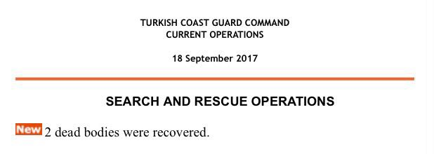

### AYS Daily Digest 21/09/17: What’s the UNHCR’s role on Lesvos?

_The meaningless answer of the UNHCR agency / More deaths in the Mediterranean than reported / Turkish and Greek Coast Guards continuously harras vessels / Joint statement of Croatian CSOs regarding the movement of the reception center / Donations needed in France and Italy / Solidarity for Sudanese in Brussels_

](assets/8442940da207/1*iNTH4PQ6cXGI6K8mQWKmuw.jpeg)

“Search for a homeland” — but who helps the people? Credits: [Art Against/Shaditoon](https://www.facebook.com/artagainstproject/photos/a.639651369417634.1073741828.639605726088865/1485025954880167/?type=3&theater&ifg=1)
### Feature: What’s the UNHCR’s role on Lesvos?

This is the question, Philippa Kempson, a local volunteer on Lesvos asked the UNHCR\. In her public letter she asked: “Is the representative’s role to assist the port police in the questioning of refugees? Is it their role to follow the instructions of the port police, even when the protection of refugees rights are not being upheld?” She further described, that she is looking to improve the collaboration between volunteers and the UNHCR and tried to find out, what exactly is the mandatory of the UN agency on the island\.

What she got as response is a long letter, not answering her questions and statements at all\. “ Every decision and action we take is aimed at helping protect uprooted people and families\. We are a non\-political humanitarian organization working in some of the most complex, sensitive, and dangerous environments around the world, in 130 countries with a dedicated staff of over 10,000”, they gave a self\-descripton, although the general role of the agency is well known among volunteers on the islands\. But even when they try to get more detailed, the statements remain vague and don’t answer the question\. “ When we first meet new arrivals, including on the shoreline once they safely disembark or when authorities bring them to Moria for registration, we provide them with information and collect important protection information\. Upon arrival in the hotspot, UNHCR provides information on rights and obligations and the asylum procedure, and offers legal counselling and representation to asylum\-seekers through partners”, the spokesperson explains\. But it’s still left unanswered, if it is their role to assist the port police with questioning the people and to follow the instructions\.

Later it is not less general stated, that they “speak to the new arrivals to determine their needs and to collect important information that assists both the refugees and migrants and our broader protection work\.” The representive continues to talk about the emergency situation back in 2015 and 2016\. Philosophizes about the “great” efforts UNHCR did the last months but also recognises: “Nonetheless, conditions in hotspots on Lesvos, Chios, and Samos have worsened in recent months as arrivals have accelerated and outpaced departures\. Overcrowding, poor conditions, and frustration at asylum assessment delays contributes to mental and physical health problems and increases the risk of violence and sexual abuse in the so\-called “hotspots”\.” What they did to fight this problems? “We have called on the Government to take robust action, deploy more national service staff, urgently reduce registration and asylum processing times, further speed up transfers to the mainland, increase security and significantly improve reception conditions\.”

In the end, no question is answered properly\. And no statement made by Philippa Kempson is being reacted\.
### Myanmar

In Myanmar some protestors tried to prevent the Red Cross to deliver aid in Rakhine State, where Rohingya are being chased by the military, Reuters [reports](http://uk.reuters.com/article/uk-myanmar-rohingya/myanmar-protesters-try-to-block-aid-shipment-to-muslim-rohingya-idUKKCN1BW0CZ) \. The protestors threw petrol bombs\. Police forces shot in the air to disperse them\.
### Greece

During they last days, several incidents have been witnessed, where the Turkish Coast Guard harrased vessels while entering Greek waters\. \( [One recent incident](http://www.keeptalkinggreece.com/2017/09/20/lesvos-turkish-coast-guard-vessels) has been made public today\. \) **This caused several injuries** , especially when they succesfully hunted down the boat\. **This practice puts the people life’s at risk intentionally** \. But also incidents are known, where the Greek Coast Guards pushed boats back to Turkish waters, that almost arrived at the shore\.

Furthermore the UNHCR and IOM seem to not report all deaths happening in the mediterranean but only the ones happening due to drownings\. During the last weeks, several incidents of dead people in the boats have been reported by the Turkish Coast Guard\. _In September alone the TCG stated, that they did find six dead bodies in the boats they intercepted\._ But neither they appear in UNHCR nor in TCG statistics\. Apparantely these humans or not even numbers for them\.

Screenshot of the report of the Turkish Coast Guard on 18\. September\.

Even though the TCG prevented more than 2500 people from departing or entering Greek territory, the number of new arrivals on the islands remains high\. On Lesbos alone 131 new arrivals have been registered yesterday, 16 on other islands\. Today volunteers counted 35 arrivals on Lesvos and 58 on Samos, both with more than 50% women and children\.

■■■■■■■■■■■■■■ 
> **[NoBorders](https://twitter.com/Refugees_Gr) @ Twitter Says:** 

> > 40 #refugeesgr trapped tonight at the island of Paximadia near Crete, as coast guard could not approach island due to weather conditions https://t.co/dqJqd5f90L 

> **Tweeted at [2017-09-21 20:43:55](https://twitter.com/refugees_gr/status/910967853632847872).** 

■■■■■■■■■■■■■■ 

On Lesvos activists protesters demonstrated against the EU\-Turkey deal and urged the local government as well as EU coordinator Maarten Verwey to close Moria\. In a letter to Migration Minister Yiannis Mouzalas, the mayor of Lesvos Spyros Galinos already [asked](http://www.ekathimerini.com/221785/article/ekathimerini/news/lesvos-mayor-calls-on-govt-to-decongest-island-as-migrant-influx-grows) for more support to cope the large number of new arrivals\. Hence also The Hope Project asks for donations\. Find their needslist [here](https://www.facebook.com/HopeProjectKempsons/posts/1954333128181143) \.

](assets/8442940da207/1*9cn05sbso1xbjF7Lg3Ix8A.jpeg)

Protest on Lesvos\. Credits: [**Lesvos Solidarity** ‏](https://twitter.com/Lesvosolidarity)

In despair of the poor living conditions and the long waiting times one resident of the Souda camp on Chios tried to jump off a wall today\. [Reportedly](https://www.facebook.com/ruhi.akhtar.7/posts/1840913835925516) his family has already been transferred to the mainland, but he has to remain seperated on the island\. The local police managed to prevent him from jumping\.

Having seen some 400 new arrivals this month, the Chios Eastern Shore Rescue Team is urgently looking for new volunteers in October\. Also short term volunteers are warmly welcome\.

### Sea

According to AFP \(via [Yahoo News](https://sg.news.yahoo.com/more-100-migrants-missing-shipwreck-off-libya-navy-103502057.html) \) more than 100 people are still missing, after rescuers found seven survivors off a shipwreck, who had remained three days at sea\.

> In a statement Jugend Rettet demands the “ the immediate release of our ship, that any charges against the organisation or crew members be dropped”\. In this statement the rescue team explains how they operate and invalidate the accusations of the Italian authories\. 

### Croatia

The Croatian CSOs Are You Syrious?\(AYS\), Centar za mirovne studije \(CMS\), Croatian Baptist Aid \(CBA\), Inicijativa Dobrodošli, Rehabilitacijski centar za stres i traumu \(RCT Zagreb\) and Liječnici svijeta \(MdM\) have released a joint statement to the announced possibility of moving the reception center Porin to the isolated location in Spacva, near the Croatian\-Serbian border\.
#### Far from sight — The CSOs’appeal against the segregatory moving of asylum seekers from Zagreb to a highway hotel at the Croatian\-Serbian border

CSOs working in the Zagreb reception center Porin, Are You Syrious?, Center for Peace Studies, CBA\- Croatian Baptist Aid \(CBA\), Welcome Initiative, RCT Zagreb and Doctors of the World \(MdM\), have sent the letter to Croatian Ministry of the Interior \(MoI\) against a segregatory plan to move the reception center to the village Spacva at the Croatian\-Serbian border\.

This option has been announced in the media, as well as at the meetings in Porin, where it was announced that about 500 people could be moved to the old, bankrupted hotel at the border, which has a capacity for less than 200 people, while the rest of the people should be moved into the containers that would be placed around the hotel\. This was announced as a plan that could be realized in the middle of winter\.

The organizations have warned the MoI about the segregatory effects of this plan, due to the lack of services by the CSOs, as well as the lack of public services — kindergartens, schools, hospitals\. The Government was reminded that children, as an especially vulnerable group, have started their schooling in Zagreb schools, as it is guaranteed by the Law and that it is not clear what is the plan on the provision of these services at the mentioned location\. Also, due to the large number of the Dublin deportees among the asylum seekers in Porin, this decision could further hurt the refugees that suffer trauma because they were forced to change their location for already several times since coming to Europe\.

It is not clear why the Croatian State would make the loss\-making investment in the total amount of about 330\.000 EUR, by buying this old hotel, while it already possesses plenty of real estate\.

The organizations are warning that this action would make the social integration process impossible and that it would have a detrimental effect to both refugees/asylum seekers and Croatian society as large\.
### Italy

As the weather is getting colder, MAM Beyond Borders and Baobab are asking for blankets and sleeping bags\.

### France

Following the evictions in Dunkirk, volunteers on the ground call for new donations\. Additionally hosts in the area are wanted, who can shelter families and women\.

Also in Calais more support is needed\. The Refugee Community Kitchen asks especially for bread to continue their distributions\.

](assets/8442940da207/1*37FfnJwK-DKZ7rD4as2zew.jpeg)

Food distributioon in Calais\. Credits: [Refugee Community Kitchen](https://www.facebook.com/refugeeCkitchen/posts/1895639743786720)
### Belgium

According to [Help Refugees](https://helprefugees.org.uk/belgian-government-deportation-deal-sudan/) and other media, Belgium has signed a new deportation deal with Sudan\. Sudan’s president Omar al Bashir has an outstanding arrest warrant issued by the International Court of Justice for crimes against humanity and genocide\.

In the following, also following police raids in the parks, locals in Brussels started hosting especially people from Sudan, to prevent them from arrests and deportation\. **Last night 87 people were offered a safe place** as a result of the call\.

](assets/8442940da207/1*egPE28qVLCjMywsrxdV4ug.jpeg)

Volunteers organizing shelter for the homeless people\. Credits: [Plateforme citoyenne de soutien aux réfugiés Bruxelles](https://www.facebook.com/plateformerefugiesbxl/?hc_ref=ARQ6TEa3DRm500I_ligBHlPRhY1lwSIgHCYLZ5f1y3YopHQvrNWFkv9gTMsw0dc0zJU)
### Germany

The Berlin alliance against deportations is rallying for new protests in the capital city of Germany\.

### UK

In Birmingham the Unofficial Women and Children’s Centre asks for supplies to run the activities\.

### Norway

A woman, who has been deported from Norway to Iran, had been lashed 80 times, Iran Human Rights [reports](https://www.facebook.com/HelpRefugeesUK/photos/a.123267671367248.1073741830.111893659171316/492258141134864/?type=3&theater&ifg=1) \.

> Leila Bayat and three of her friends were arrested in 2007 and sentenced branch 3 of the 21th district Prosecution Office of Tehran to 80 lashes for drinking alcoholic beverages\. They were released on bail of 7 million Tomans \(about 1800 USD\) and tried to change the sentence for two and a half years\. Being disappointed, Leila together with her 5\-year\-old son sought asylum in Norway where they were denied asylum several times by the authorities of The Norwegian Directorate of Immigration\. 

Her asylum was denied, because authorties did not approve her documents\.
### General

According to a new IOM report, 38 percent of the interviews children, who arrive in Italy, state, that they were forced to work or perform activities against their will\. 97 percent of these cases happened in Libya\.

> **_We strive to echo correct news from the ground, through collaborationand fairness, so let us know if something you read here is not right\._** 

> **_Anything you want to share — contact us on Facebook or write to:areyousyrious@gmail\.com_** 

_Converted [Medium Post](https://areyousyrious.medium.com/ays-daily-digest-21-09-17-whats-the-unhcr-s-role-on-lesvos-8442940da207) by [ZMediumToMarkdown](https://github.com/ZhgChgLi/ZMediumToMarkdown)._
