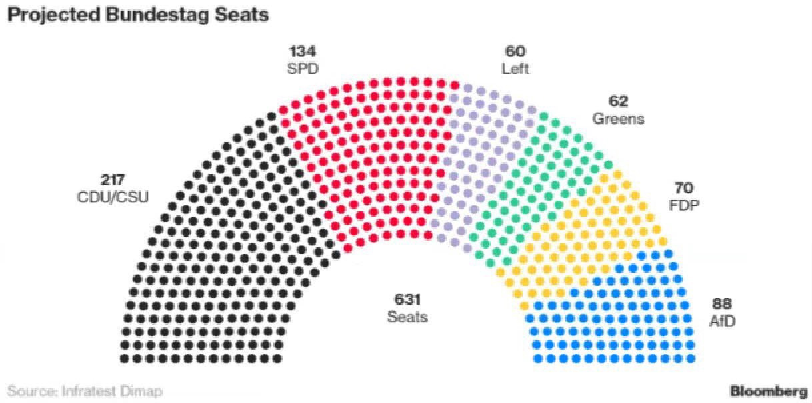
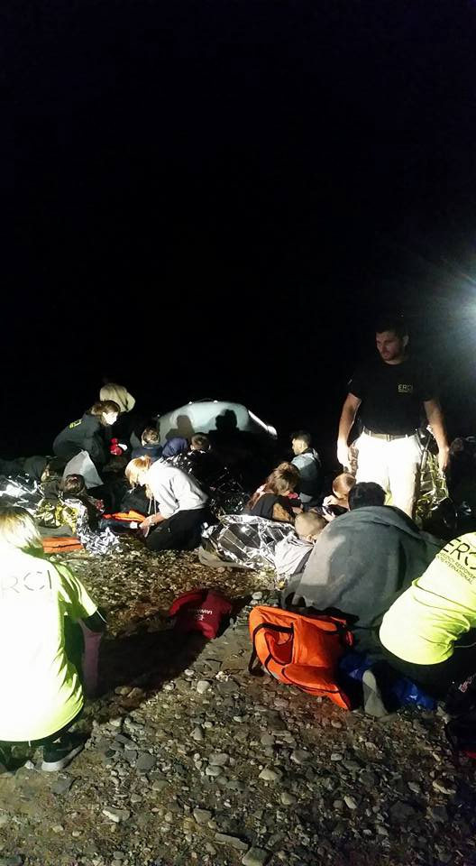
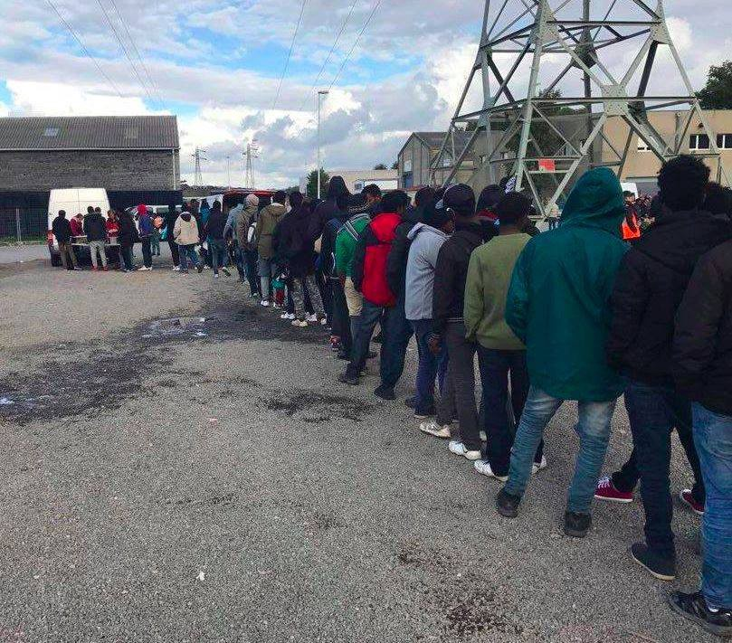
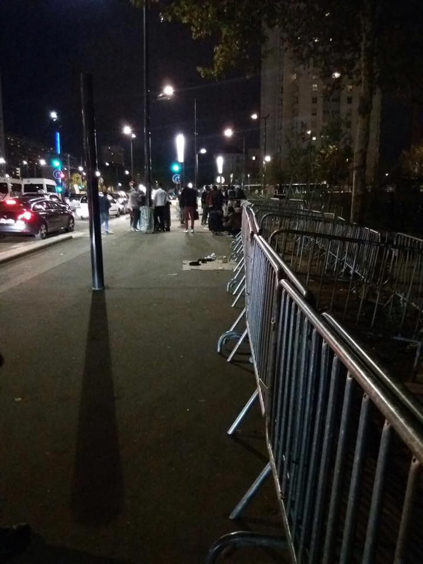
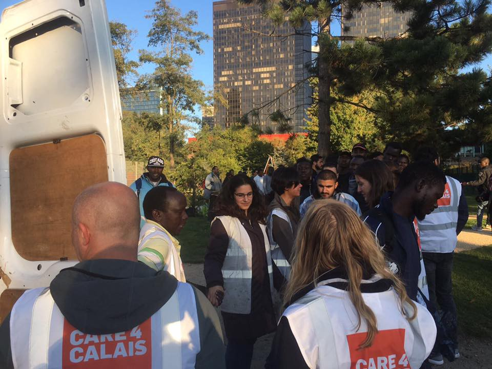

### AYS DAILY DIGEST 24/9/2017: Over 80 percent of Germans oppose far right

_Protests all over Germany after the ultra right\-wing party with almost 13 percent votes in the elections // Constant game with numbers in Greece // Locals on islands helping where the governments and big NGOs don’t // Call to Croatian government to act in accordance with the laws and provide protection for asylum seekers // Desperate calls for help from France and Belgium_

](assets/4292d9ad552/1*GrNfSovBOo5odXtFFqKqEA.jpeg)

Photo [**@** aradio\_berlin](https://twitter.com/aradio_berlin)
### Feature

**“Say it loud, say it clear, refugees are welcome here\!”** This message was chanted all over Germany tonight as hundreds of thousands of people went on the streets to say that they will act against racism and fascism\.

What provoked these protests are elections results that brought the populist radical\-right Alternative for Democracy \(AfD\) party to the Bundestag, the German parliament\. It is the first time since the early days of postwar Germany that a far\-right party will be represented, and they will most likely have more than 80 deputies\.

With over 12 percent votes, they are now the third biggest party in Bundestag\.

Leipzig

■■■■■■■■■■■■■■ 
> **[Modelamong #StandingWithUkraine 😷💉💉💉😷](https://twitter.com/Modelamong) @ Twitter Says:** 

> > Da kommt man aus dem Neuen Rathaus in #Leipzig und es schallen einem lautstarke #Noafd und #nonazis Rufe entgegen. #le2409 #dankeLeipzig https://t.co/MepNUwVgjC 

> **Tweeted at [2017-09-24 19:54:19](https://twitter.com/modelamong/status/912042533643005952).** 

■■■■■■■■■■■■■■ 

Munich

■■■■■■■■■■■■■■ 
> **[No Pasaran](https://twitter.com/No_Pasaran_Muc) @ Twitter Says:** 

> > Protest gegen Afd wahlparty #münchen
Adalbertstr 33 jetzt
# muc2409 #btw2017 #noafd https://t.co/Xqzw1J0vjG 

> **Tweeted at [2017-09-24 18:59:38](https://twitter.com/no_pasaran_muc/status/912028769946390529).** 

■■■■■■■■■■■■■■ 

Berlin

Over the last couple of years, AfD built its profile as the anti\-migrant party, opposing strongly Angela Merkel policy of letting over one million refugees into the country\. AfD wants a “zero immigration” policy\. They also want to close the German border to stop what they view as “unregulated mass migration\.” They will try to stop family reunification, and to push for deportations, as well as reform the current asylum law to ensure a smaller number of people are granted asylum\.

Many AfD members openly describe migrants as a potential threat to the security or stability of Germany\.

What is interesting is that the most support AfD did not get in the area where there are many migrants and refugees, but opposite\. I Germany, people who arrived and seek protection status are distributed across 16 federal states on the basis of income and population levels, so that the poorer and less populous east gets fewer asylum seekers than the West\. AfD gained most of its votes in the east of the country\.

[Asked by the DW](http://www.dw.com/en/afd-cdu-spd-where-do-german-parties-stand-on-refugees-asylum-and-immigration/a-40610988) why an anti\-immigrant party does so well in a region with so few migrants, Ulrike Seemann\-Katz, chair of the Mecklenburg\-West Pomerania Refugee Council, answer: _“Psychologically, it’s very easy to explain\. Human beings are afraid of what they don’t know, and what people don’t know here are refugees\.”_

However, [an analysis is showing](https://www.theguardian.com/commentisfree/2017/sep/24/germany-elections-afd-europe-immigration-merkel-radical-right?utm_term=Autofeed&CMP=fb_cif#link_time=1506280297) that AfD does not really have real support from citizens, and that 60 percent of their voters voted “against all other parties” and only 34 percent voted for them out of conviction\.

Most important — over 8o percent of Germans did not vote for AfD\.
### Greece

Meanwhile, people are still arriving at EU, many of them hoping to go to Germany\.

[Volunteers are reporting](https://www.facebook.com/boatreportlesvos/?hc_ref=ARRDIgG8il_9Dt-nWomu5_qY_7ovKhVUEGGr0_o_YLB9r-_XW5OubKG9qAZcGbgwWcU&fref=nf) about one boat that landed in the morning at the south of \#Lesvos, in \#Fara, carrying approximately 20 people\. Locals from that area took care of people bringing them to their homes\.

Photo by Boat Report Lesvos\.

Islands are bursting with people\. In Samos, hills around the overcrowded camp are full with tents\. While inside the camp the number of people goes over 3000, outside it is probably over 200 people staying, in tents or improvised shelters\.

It is not much better on Kos\. People are sleeping in the entrance of the camp\. While same landed at Kos, others were brought here from Crete and Rhodes\. Among new arrivals to all islands are again many people from Syria and Iraq\.

[Solidarity Initiative Rethymno](https://www.facebook.com/groups/PAMPIRAIKI/permalink/528664970810945/?hc_location=ufi) , a city of approximately 40,000 on the island of Crete, are reporting about 40 arrivals, so far\. They all came on Friday morning after a difficult rescue operation\. Most of the people on the boat were from Iraq and few from Iran\. They were trying to reach Italy\.

_“Everyone was in bad shape, extremely mauled, without feeding the last few days…The Refugees, until the process of their documents is completed, are being held in the area of which is obviously not suitable to host so many people for several the days… In a tourist area such as Rethymno, which can and hosts daily thousands of visitors, it is outrageous that there are no structures suitable to accommodate 40 people\.”_

Fortunately, people in this city responded providing what they can for the group\.

As announced before, NGOs are slowly leaving islands, while most of the services are taken over by Greek organizations financed by the government\. UNHCR is still present all over Greece, but it is hard to fully understand at this point what is their role\. And the winter is coming\.

The situation on the islands prompted workers at Greece’s reception and identification centers \(RICs\) — “hot spots” — to write to the Migration Minister Yiannis Mouzalas\.

They warned about shortages in medical personnel following the government’s decision to terminate cooperation with humanitarian organizations and pass on responsibility for recruitment to the Health Ministry\. They give the example of Kos where since mid\-summer there is only one nurse for a population of 850 people\. They also warn about the high number of psychological disorders, as well as pregnant women who do not have treatment better than anybody else\.

The issue is expected to be discussed at an emergency government meeting chaired by Prime Minister Alexis Tsirpas this week\. As local media are reporting, that island mayors could be invited to this meeting\.

The possibility is that the creation of more pre\-departure facilities for migrants for deportation to Turkey could be proposed by the Ministry slated, but also the construction of additional reception centers to ease pressure on the islands\.

According to the official figures, 13,042 people are currently accommodated on the islands, but unofficial figures are much higher going up to 15\.000 or even more in some cases\.

[Volunteers are warning](https://www.facebook.com/aris.vlahopoulos?fref=gs&hc_location=group_dialog) about this discrepancy in numbers on the example of Lesvos\.

> “Officially the government had 5908 people on the island on 21st September\. Since then till today 23rd September 18\.48 LT we had 278 arrivals more\. Other sources were giving around 6200 people on 21st September\. This is confusing for everyone, however, based on our knowledge of the criteria that officials use to count we estimate about 7500 people stranded on the island today\. 

> The bottom line is that we receiving about 700 people per week while the government is sending about 200 to the mainland on the same period\. Moria with the official capacity of 1800 people has today around 4500\.”

This all may end up in total disaster, and so far, nobody has any kind of plan\. It is already much colder on islands\.

People are coming over the land border, too\. Police claim that a total of 168 Syrian refugees have crossed over the border with Turkey\. They also noticed that the all the people in this group were families and that smuggler were not involved in the crossing\.
### Croatia

Children asylum seekers of the first grade of elementary school in Croatia don’t have organized preparatory Croatian lessons due to the Ministry’s late reaction to the matter\. AYS hopes the official decision of the Ministry of Education, granting them the right to these classes, will arrive so that the school can organize Croatian classes as soon as possible\.

AYS thinks it is important the children are placed in classes according to their age and they should be provided professional or other support, so as to overcome the difference in knowledge shown during the testing\. Three teenagers are enrolled in high schools\.

We also welcome the inclusion of children in the preschool system for many benefits: socialization, integration, language learning\.

During the past 3 months, 18 school children from Syria, Iraq, and Afghanistan left Croatia\. Their departure is a result of the policies of the Croatian Government — waiting for too long for the response to the asylum demands, a process that often lasts for over a year, or negative answers\. Most of those families were pushed back from Germany or Austria, according to the Dublin agreement\. After having learned the language of those countries and going to school there, they continued waiting in Croatia for their answer and, they have lost almost 2 years of their lives\.

Faced with the European welcome and the practice of the Ministry of Interior and the Croatian intelligence service, who claim them to be a threat to the national security, a part of them returned to the war\-torn countries or to Turkey\.

AYS has previously warned about and written reports about the policies of rejection and this time we want to stress out that it is these policies that deprive the children of a chance for a normal life and their right to education\.

From this week onwards, MDM is back to Porin, the reception center in Zagreb\. Their engagement covers a part of the specialist health protection, general practitioner, a pediatrician and a gynecologist, for the coming two months\. The asylum seekers can still use the services of the doctors at the Health center in Dugave, but only for emergencies\.

Therefore, we call the Ministry of Health to urgently take on the matter of health security for the asylum seekers, so asylum seekers have the same protection as the other citizens and foreigners in Croatia\.

We also expect that the Ministry makes sure the Law that grants asylum seekers free emergency healthcare is upheld as we’ve received a copy of a receipt from the Clinical center in Split for a service that was given to a 13\-year\-old child, charging 360 kunas \(around 48 Euros\) \. Instead of sending the receipt to the Ministry, they sent it to the 13\-year old child staying in Porin \(even after our volunteers had reminded them of the procedure and the rights of the asylum seekers\) \.

AYS will continue to warn about this issue until the asylum seekers experience full respect of the rights entitled to them \(including visits to the specialists, diagnostics, treatments for acute and chronic diseases and the right to medication from the Croatian Health Institute list\) \.
### France

[Refugee Community Kitchen in Calais](https://www.facebook.com/HelpRefugeesUK/posts/493768214317190) needs your help to buy bread\. Over the last few days, they served over 1000 portions of a hearty Shorba \(Soup\) and fresh bread for lunch\. It is getting colder there, and they need to be able to continue doing this\.

If you have any ideas or connections in the bread world, email [refugeecommunitykitchen@gmail\.com](mailto:refugeecommunitykitchen@gmail.com)

In Paris, volunteer groups are reporting about more police violence and difficult living conditions\.

_“Hundreds are living on the streets with few toilets and nothing but the most basic running water\. The police and CRS are a constant, intimidating presence\. Those lucky enough to have tents can’t put them up till late at night because they will be confiscated\. Most sleep in side streets or near the bubble with little more than the clothes on their backs and maybe a blanket\.”_

**_Please continue to support those helping in Paris\._**

[According to the available reports](https://amp.lepoint.fr/2159217) , there are around 30 mini camps in Paris, that are constantly on the move because of police evictions\. Some people walk 4–5 km a day just to find a place to sleep\.
### Belgium

This weekend in Brussels, [Care4Calais](https://www.facebook.com/care4calais/posts/1676278382405112) ’ volunteers distributed goodie bags and sleeping bags to more than 100 homeless refugees, including many young people\.

_“Mostly Sudanese, they formed an orderly queue whilst joking and chatting with the team\. A good sense of humor seems as important for surviving life on the streets as a sleeping bag\. The goodie bags contained nuts, dried fruits, tinned fish, cereal bars, water, new socks and woolly hats\.”_

They desperately need more donations to continue doing this\. If you can help please go to [www\.care4calais\.org/donate](http://www.care4calais.org/donate)

> **_We strive to echo correct news from the ground, through collaborationand fairness, so let us know if something you read here is not right\._** 

> **_Anything you want to share — contact us on Facebook or write to:areyousyrious@gmail\.com_** 

_Converted [Medium Post](https://areyousyrious.medium.com/ays-daily-digest-24-9-2017-over-80-percent-of-germans-oppose-far-right-4292d9ad552) by [ZMediumToMarkdown](https://github.com/ZhgChgLi/ZMediumToMarkdown)._
