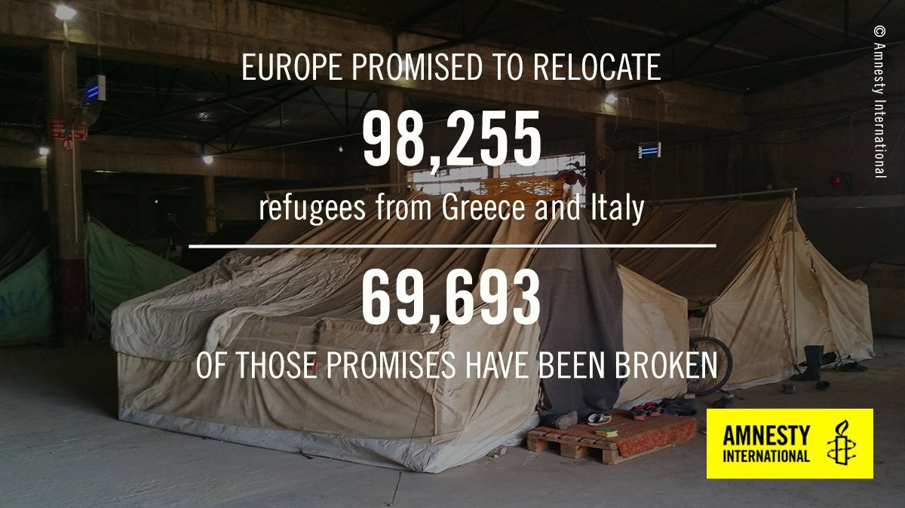
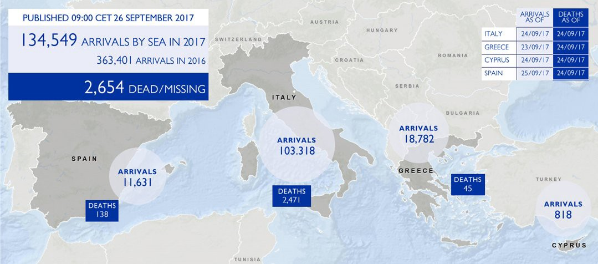
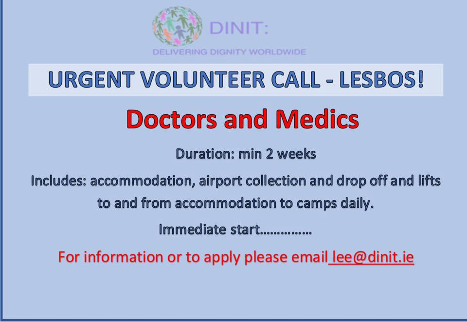

### AYS Daily Digest 26/09/2017: Another date marks failed policies
#### New report on detention and violence in Greece // Shameful failure on relocation // Rescuers again threatened by Libya but stood firm // Suicide attempt on Kos // Arrivals continue in Greece // Doctors urgently needed on Lesvos // Children missing in Switzerland // Donations needed in France // UN report on mistreatment and killing of refugees // and more…

 rescued 200 people from the sea and refused giving then in to Libya](assets/45cc66ace4c3/1*ubYEU0bK3-Vd6qOEjduJtA.jpeg)

Today alone, [**LIFELINE**](https://www.facebook.com/seenotrettung/?hc_ref=ARSJs0fvEMmi2G9X46IJlpBfvK2cTJJT6KBpHChRNHY7NF74C9dqGNt5liVC13nMUDU&fref=nf) rescued 200 people from the sea and refused giving then in to Libya
### Feature

The difficult conditions endured by refugees scattered all over Greece have been exposed for a long time by different channels and organisations, although this information never really reached the vast majority of the European population, nor, probably, has it reached many of the politicians who make decisions about the thousands of lives that have to exist in such poor conditions\. Today another report was published by the [European Committee on the Prevention of Torture \(CPT\)](http://www.coe.int/en/web/cpt/-/report-to-the-greek-government-on-the-visits-to-greece-carried-out-by-the-european-committee-for-the-prevention-of-torture-and-inhuman-or-degrading-tr) denouncing once more the situation in the “hotspots” on the Aegean islands\. It is particularly critical of the continued immigration detention of unaccompanied children\.

The CPT delegation visited Greece in April and July 2016 in order to examine the conditions of refugees and immigrants staying in hotspots on the islands following the implementation of the EU\-Turkey agreement and the state of detention of foreign children and adults in Athens and Thessaloniki\. During the visits to Moria, Lesvos, and VIAL of Chios, the Council of Europe Committee found overcrowding in reception and identification centers coupled with high levels of violence among residents, inadequate provision of basic health care, problems with the quality of drinking water and food, inadequate assistance to vulnerable groups and inadequate legal support\. Some members of the Commission also received individual complaints from unaccompanied children in Moria about ill\-treatment and violence by police officers\. The report also refers to the **“continued and regular” detention of hundreds of unaccompanied children for long periods** with poor living conditions and inadequate care, for example in in the special facilities at Amygdaleza and Petrou Rallis\. While acknowledging the efforts of the Greek authorities to find additional accommodation, the Commission considers that the authorities should reconsider their approach to the “protective detention” of unaccompanied children and take the necessary steps to end it\. It also asks that the detention of parents with children in police stations be terminated\.

> “The placement of unaccompanied children, many of whom have experienced traumatic travels and experiences, in these detention facilities for many weeks or months is difficult to understand” 

For adult prisoners, it reports that it has received reliable allegations of physical abuse of refugees by police officers in special detention facilities in Thessaloniki and Petros Rallis and calls for stringent measures to combat mistreatment\. Furthermore, the Commission is disappointed at the very inadequate conditions of detention in most of the police stations it visited, such as the living conditions in the police station of **Drapetsona with a “dungeon”, conditions “that can be considered inhuman and degrading and pose a risk to public health “\.**

Complaints were also received by the CPT about physical abuse of persons suspected of criminal offences, including minors\. The report also points out that decisive action is needed “to **address the widespread and deeply rooted problem of police abuse** and to promote a fundamentally different approach to police research methods”\. This requires rigorous recruitment procedures, improved vocational training and the introduction of online police interviews\. For detainees, they request access to a lawyer and a doctor, while information on their rights must be provided in a language they understand\.

The response of the Greek authorities to the Council of Europe in March 2017 was that the reception procedures are being conducted in accordance with respect for human dignity and are in harmony with the European and international commitments of the country\. They note that staff are required to handle difficult and sensitive affairs, trafficking, torture and all kinds of human exploitation, and are responsible for identifying vulnerable people and ensuring that the appropriate procedure is followed for them\. Regarding the overcrowding of hotspots, they point out that concerted efforts have been made by all involved to mitigate the phenomenon, including by transferring people from the reception centres and identifying vulnerable cases\. With respect to the allegations of mistreatment of aliens by police officers in Moria, Chios and Petrou Rallis, the competent police departments are conducting a preliminary administrative inquiry to establish whether disciplinary offences have been committed\. A similar investigation was also carried out for Thessaloniki, but there the general police director closed the case, as no evidence was found to prove any administrative offence\.

We still need to see if this new report will bring some kind of action from the European and Greek institutions to really improve the system and stop vulnerable people, especially children, having to go through this institutional mistreatment\. Nevertheless the European Union, despite having bodies to investigate and report this and other situations, is very happy with the results of the agreement with Turkey and insists on the detention centre policy as a deterrent factor\. \. a strategy that has been proven to fail over and over again\.

Today, 26th September, was also the day when the two\-year period for relocation of refugees from Italy and Greece was supposed to end\. By today, other European countries should have fulfilled at least their small quota of transfers\. But that wasn’t to be, and by today less than a third of the almost 100,000 refugees who were supposed to have found a new life in peace were allowed to do so, according to [Amnesty International](https://www.amnesty.org/en/latest/news/2017/09/eu-countries-have-fulfilled-less-than-a-third-of-their-asylum-relocation-promises/?utm_source=ECRE+Newsletters&utm_campaign=d428160a1d-EMAIL_CAMPAIGN_2017_09_26&utm_medium=email&utm_term=0_3ec9497afd-d428160a1d-420527945) \. The organisation urges all countries that committed to this target to speed up their efforts to make good on their promises or be taken to court\.

### Sea

[**LIFELINE**](https://www.facebook.com/seenotrettung/?hc_ref=ARTtX1p5_I87686EhyHAkkPsd9LU2dvMDMHBGsZbiFP8jHgDz80TqSn5X0GKlZ7iImQ&fref=nf) **,** a German NGO rescuing refugees in the Mediterranean has issued a worrying report saying that the Libyan coast guard fired shots and boarded their ship today, demanding that the migrants on board be handed over to them, said Axel Steier, a spokesman for the German\-based NGO\.

> “We told them we don’t return migrants to Libya” 

The group refused to let the refugees go back to Libya and in the end the coast guard gave up\. You can read their full report in German [here](https://www.facebook.com/StopTheDying/posts/278904022627186) and you can also support the group saving lives on this [link](http://www.mission-lifeline.de/de/spenden) \.

](assets/45cc66ace4c3/1*R8bSEDseV8brFyO0r7goCQ.jpeg)

Photo by [**LIFELINE**](https://www.facebook.com/seenotrettung/?hc_ref=ARSSNYTfzqNX4u3TRpJsfSm9DC9NxbeIX8pj9piTUG36kxTNs8XQeMS5-BYg0dIU7CA)

Reuters also reports that the Libyan coast guard spokesman in Tripoli declined to comment and Italy’s coast guard, which coordinates rescues, did not respond to repeated telephone calls\.

This is yet another incident caused by the Libyan coast guard, financed, trained and equipped by Italy, that has been trying to decrease the smuggling by sea, although despite the recent decline in departures, **almost 1,000 migrants were rescued on Tuesday** \. Save the Children’s Vos Hestia ship picked up some 750 people in six different rescues, a spokeswoman said, and the Lifeline had more than 200 on board\. SOS Mediterranee’s Aquarius ship picked up 20 Libyans on Monday\.

IOM has published another update on the arrivals and fatalities this year:

### Greece

It has been a stressful day on the Greek islands, especially on Kos where today a young man threatened to hang himself due to the lack of medical personnel following the government’s decision to terminate cooperation with humanitarian organizations and pass on responsibility for recruitment to the Health Ministry\. On Kos since mid\-summer there has been only one nurse for a population of 850 people\.

It has been another busy day for arrivals and volunteers report that a boat arrived at **Samos** with 43 refugees, another boat reached **Farmakosini** with 31 people on board who were transfered to Leros, and two boats arrived on **Chios,** the first with 50 people on board \(25 men, 14 women and 11 children\) and the second with 40 people on board\.

The Turkish Coast Guard also published their numbers saying they have stopped 3 boats on Sunday, the last one with 52 ppl and 2 boats intercepted yesterday\. A total of 537 people have been caught since Friday\.

](assets/45cc66ace4c3/1*eiJ4cfi5DrF96EFCLgVZkQ.jpeg)

Photo by [\#TurkishCoastGuard](https://twitter.com/hashtag/TurkishCoastGuard?src=hash)

[Chios Eastern Shore Response Team](https://www.facebook.com/groups/421759534684819/?ref=group_header) also reported that all the people from the latest boats have been sleeping out night and day with only sleeping bags and blankets, not even a tent\. In the meanwhile in the Children’s house they receive a huge amount of families to provide showers for their children, hygiene products, a healthy snack, and a safe, calm place for parents and children to interact\. About 40 to 50 children come to the center EVERY DAY\. More then 150 families are coming every week\.
From June the children’s house facilitated 324 families\. 
The Vial camp does not give clothes except to some individuals, but not for all\. The team started giving jackets to mothers before they leave the center\. 
The center opens at 10:30am and closes after 6:00pm, non stop\.

> WE NEED YOUR SUPPORT MORE THAN EVER\. \. The Children’s House is the ONLY place on the island these families can come to receive the care they need\. 
 

> We need EMERGENCY supplies:
 

> Shampoo and shower gel for babies and children 
 

> Biscuits 
 

> Cereal bars for children 
 

> Fresh fruits 
 

> Juices 
 

> Powder milk for babies \(we give it only to mothers who are not breastfeeding\) \.
 

> Regular milk for children 
 

> Wipes 
 

> Diapers size 1 and 2
 

> Underwear for 1 to 5 years old 
 

> Joggers from 1 to 13 years old\. 
 

> Winter shoes\. 

> In 2 weeks from now we will not have any stock left\. 

Yesterday’s registrations according to the Greek authorities remain obviously high and were:

Lesbos 87
Leros 31
Total: 118

So far 4093 refugees arrived this month on the Greek islands, bringing the total for this year up to 19,117\.

[**Help Refugees**](https://www.facebook.com/HelpRefugeesUK/?hc_ref=ARRiC4HQxr2e04nsI0LRKp5U-II_-oLLkyEkZDDGpt_cNmopHPRavXJ6I9qwnThWa98) has also been following the new surge of arrivals this summer and concludes that there was a 264% increase in arrivals this month on Lesvos\. A total of 2,178 people have arrived on Lesvos in September, over half of whom are minors\. At least 13,300 people are now stuck on the Aegean islands\. People are forced to cram into flimsy tents, and babies are sleeping on the floor in Europe\. You can help them prepare for the winter by donating [here](http://bit.ly/HelpRefugeesDonate) \.

The Greek asylum services have published a table where they show that in the second quarter of 2017 the highest rate of registered first\-time applicants was in Greece\.

](assets/45cc66ace4c3/1*LjUR_xhENn16oZ79hC6D_Q.jpeg)

Picture by [**Greek Asylum Service‏**](https://twitter.com/GreekAsylum)

On **Samos** the situation is no better and yesterday at dinner time refugees refused to eat the food because of its bad quality\.

> Refugees found that dinner was bad, smelly, rotten\. It has not been eaten\. And then refugees left food on the ground as in the photo\. 

](assets/45cc66ace4c3/1*JQjvUBubNMQoFZNYNOalNQ.jpeg)

Photo by ‎ [**عشتار للهجرة واللجو**](https://www.facebook.com/%D8%B9%D8%B4%D8%AA%D8%A7%D8%B1-%D9%84%D9%84%D9%87%D8%AC%D8%B1%D8%A9-%D9%88%D8%A7%D9%84%D9%84%D8%AC%D9%88%D8%A1-687993924641223/?hc_ref=ARSrjimQmd1aXkXbboiobD_3B4Crk7Ph9Sr2jAYxXprEG4ULDbcz_oM_bXVFgcf_Vr8)

According to volunteers, this is a recurrent problem on the island which hosts almost 3000 refugees\.

On this island there is still a lack of volunteers and Samos Volunteers, a group working to provide psychosocial support to refugees in the RIC is urgently looking for a Greek teacher\. If you have any knowledge or experience teaching Greek as a foreign language and are able to commit to at least four weeks, please contact the group at Admin@samosvolunteers\.org

The weather is changing and on the Island of **Lesvos** it has been raining\.

This is just another warning of what is coming and everyone should remember how bad last winter was on the islands and get prepared in time\. There are still many refugees living in tents, especially now that so many new arrivals are piling up on the island\.

There’s an urgent need for doctors on the island and DINIT is looking for new volunteers\. If you can help please contact them on lee@dinit\.ie\.

### Black Sea

The total death toll in the September 22 sinking of a boat carrying migrants heading to Europe in the Black Sea, off the Turkish province of Kocaeli, rose to 24 after the body of another woman was found by search\-and\-rescue teams on September 24, according to the Turkish coast guard\. They also stated that between August 13 and September 9, the coast guard rescued 834 migrants in seven different incidents and 10 human traffickers were detained by the police\.
### Switzerland

[The Local](https://www.thelocal.ch/20170926/hundreds-of-young-asylum-seekers-choose-to-disappear-in-switzerland) reports today that more than 500 underage asylum seekers went missing in Switzerland in 2016, a huge rise on the previous year’s tally of 94, according to official statistics reported by RTS\. In total 539 young refugees went missing in 2016 — a figure that includes 81 who were aged over 18 but who are counted as minors because they claimed asylum when they were under 18\.

> Reporting practices vary from canton to canton, meaning young migrants are not always reported missing as non\-migrant children would be adding that this discrimination was “shocking” adds Valentina Darbellay of Swiss child aid agency” 

This applies not only to young refugees and last September the SEM confirmed that in the previous three months between 20 and 40 percent of asylum seekers had fled reception centres after claiming asylum and are thought to be heading for Germany\.
### France

[**Refugee Info Bus**](https://www.facebook.com/RefugeeInfoBus/?ref=gs&hc_ref=ARQ8auBhUG3_-f338I74pZkdL9a6aB1XeB4061WQCe6xCYp7PGsolyd9Wqu0vwBv9G4&fref=gs&hc_location=group) has published today a new update from Calais and according to them, a week after the eviction of Grande\-Synthe, in Dunkirk, 250 people have already returned\. The huge deployment of police and buses last Tuesday morning has had little long\-term effect, with some people who were taken as far as the Spanish border already returning to makeshift camps in the woods of Grande\-Synthe\.

A police officer has been accused of slapping a migrant in Coquelles detention centre\. The prosecutor has argued that he should serve six months in prison and he risks losing his job\. Judgement will not be delivered until 23rd November\.

According to the statistics, in 2016, France transferred 1,293 people under the Dublin Agreement to other countries in Europe and 1,257 people were transferred to France from other European countries under the Dublin Agreement\. In short, thousands of euros have been spent on detention centres and deportation flights, and thousands of lives have been disrupted, without any effect on the number of people seeking asylum in France anyway\. These stats are correct as of 08/09/2017 and you can compare them clicking [here](http://appsso.eurostat.ec.europa.eu/nui/show.do?dataset=migr_dubto&lang=fr) and [here](http://appsso.eurostat.ec.europa.eu/nui/show.do?dataset=migr_dubti&lang=fr) \.

[**Calais Action**](https://www.facebook.com/calaisaction/?hc_ref=ARRxx1RElPYEDilALreSn-9X_m9pNq5y0kl6xIne1ScyIur3TYzmjPiu0AqsaxGXYcU&fref=nf) is launching an urgent appeal for donations for Paris since in recent weeks the situation has deteriorated, with homeless refugees and their belongings lining the streets with nowhere to go\.

> We are also receiving reports that police are tear gassing and taking away sleeping bags from adults and children, leaving them with nothing\. The warehouses don’t have the resources to wash ruined sleeping bags and donations are running low\. 

> Recent activity has seen the population of approx\. 1,500 refugees disperse from Port de la Chapelle, following police activity which has seen children pepper sprayed and families’ possessions seized\. 

> This makes the refugees harder to reach but their basic needs remain the same: shelter, sanitation, food and clothing\. 

> The items urgently needed are: 

> Sleeping bags \(for adults and children\) 
 

> Blankets
 

> Tarp
 

> Tents
 

> Baby wipes
 

> Phones & Smartphones with Chargers
 

> SIM Cards 3G \(with min 10€ credit\)
 

> Baby diapers size 6
 

> Shampoo 

If you have donations and can take them to France please contact calaisdonations@gmail\.com to arrange\.
If you have items to donate and don’t know where to take them you can also contact the group and they will put you in touch with a local collection point\. 
[Care4Calais](https://www.facebook.com/care4calais/?fref=mentions) and [L’auberge des migrants international](https://www.facebook.com/laubergedesmigrantsinternational/?fref=mentions) are continually updating their needs list, so their websites are a good place to start\. 
Post on [Calais — People to People Solidarity — Action From UK](https://www.facebook.com/CalaisPeopletoPeopleSolidarityActionFromUK/?fref=mentions) from UK to link to people who are also collecting / travelling\. Finally you can donate to their page [here](https://mydonate.bt.com/events/parisaction) \.

](assets/45cc66ace4c3/1*CgKL0N6QVNe0n91I80Oirg.jpeg)

Refugees “camp” by the asylum offices in Paris, queuing for days to apply — Photo by [**Care4Calais**](https://www.facebook.com/care4calais/?hc_ref=ARST5rjj37p7TEKrbAk9PqkiuPiPYBLjGZrU7n7AtotjKa5-TNG9hMKWnWJ5b4dwEyY)
### General

The UN published recently a report of the Special Rapporteur of the Human Rights Council on extrajudicial, summary or arbitrary executions\.

The report presents evidence that suggests multiple failures on the part of states to respect and protect refugees’ and migrants’ right to life, such as unlawful killings, including through the excessive use of force and as a result of deterrence policies and practices which increase the risk of death\. Other violations of the right to life result from policies of extraterritoriality amounting to aiding and assisting in the arbitrary deprivation of life, and from the failure to prevent preventable and foreseeable deaths, as well as the limited number of investigations into these unlawful deaths\. The report also presents best practices in search and rescue operations and for the dignified treatment of the dead, but points out that states do not implement them as they should, and fail to resource them adequately\.

> The equal protection of all lives, regardless of migration status, is a central underpinning of the entire international human rights system: it must be upheld in the context of the movement of people and **must form the foundation of all governmental and intergovernmental policies\.** 

You can read the full report [here](http://www.statewatch.org/news/2017/sep/un-report-unlawful-refugees-and-migrants.pdf) \.

> **_We strive to echo correct news from the ground through collaboration and fairness, so let us know if something you read here isn’t right\._** 

> **_If there’s anything you want to share, contact us on Facebook or write to: areyousyrious@gmail\.com\._** 

_Converted [Medium Post](https://areyousyrious.medium.com/ays-daily-digest-26-09-2017-another-date-marks-failed-policies-45cc66ace4c3) by [ZMediumToMarkdown](https://github.com/ZhgChgLi/ZMediumToMarkdown)._
