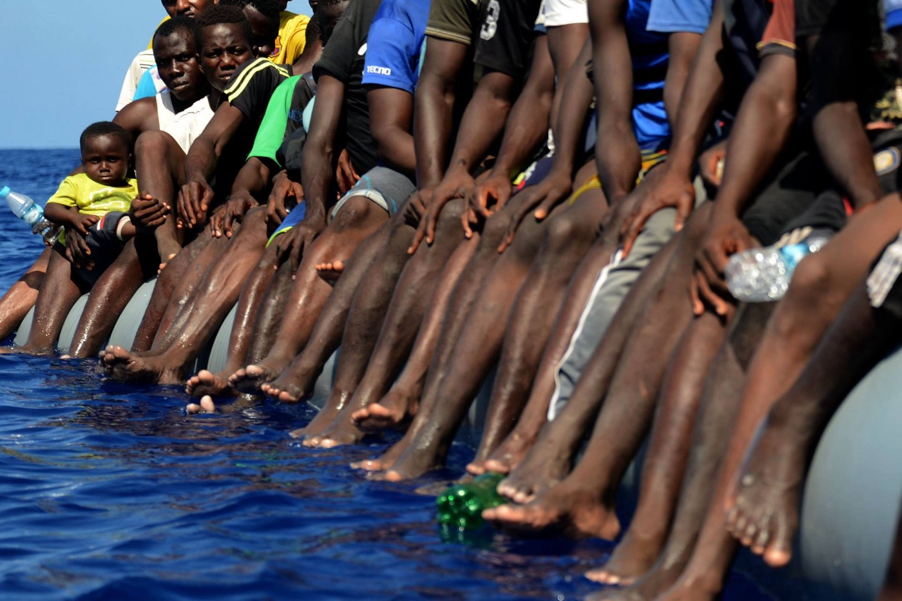
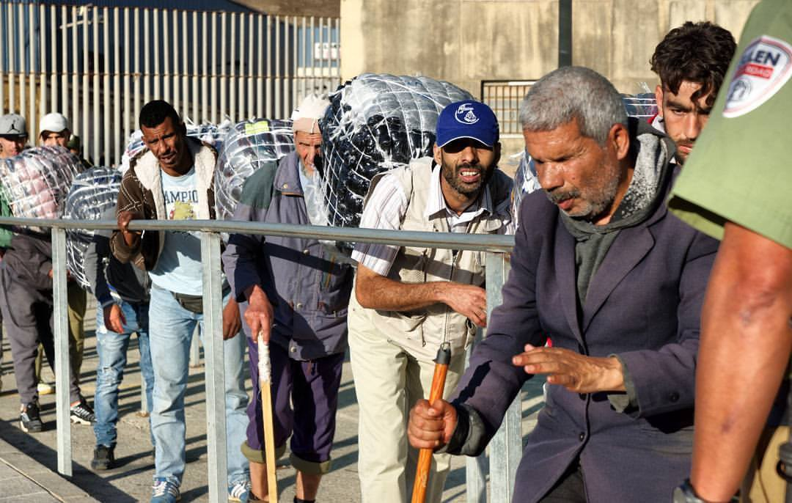

### AYS 28/09/2017: 9\-year old girl from Syria died after boat accident in Greece

_Four people in hospital, and 15 in detention on Rhodes after surviving shipwreck // Among refugees who arrived to Turkey from Iraq 40 percent are children // over 20 percent of UNHCR accommodation still empty // Story from Spain — Morocco border // Government in France plans to change the law so “administrative detention” can be up to 90 days // Human rights activist sentenced in Switzerland // Raid in Porin center in Zagreb_

Gabriel Tizon\.
### Feature

Early morning on Thursday, a vessel of the European border agency Frontex, picked up six people from the sea near the small southeastern island of Kastellorizo\. Among them a 9 years old girl who was taken to the hospital, but did not make it\. She died on European Union soil\.

Her mother is still in the hospital, and her 23\-year\-old brother, who is blind, is in detention on Rhodes\. The family was trying to reach EU, hoping to find refuge from the war\-torn Aleppo\.

After Frontex found this group, Greek authorities launched a search and rescue operation with patrol boats and a helicopter, finding another 20 people who had managed to swim to a rocky coast on the island\. Four are in the hospital, others in detention in Rhodes\.

The badly constructed boat came from the Turkish coast\.

It is hard, almost impossible, to say anything\. What we are almost certain is that this little girl, as many others, and her family were dreaming about peace and safety in EU\. The EU chooses to close the border in the front of their dreams\.
### Turkey

According to the UNHCR data, there is still over 3 million Syrians in Turkey, and they still represent the biggest group of refugees in this country\. Nevertheless, during August among those who were registered are mostly people from Afghanistan — 44 percent\. A number of people who are arriving from Iraq are also rising, and among them 40 percent are children\.

### Greece

Despite bad weather, a number of people who are arriving at Greek islands are still in hundreds\. Today, 122 people arrived at Rhodes, and 49 to Lesvos\.

All the islands are overcrowded, and there is hardly any place in camps\. It is not a much better situation in Athens\. where people are arriving daily from islands\. Unfortunately, many of them — even though transferred legally sometimes because of their vulnerability — are without basic care or accommodation\. Once again, there are many homeless people on the streets of Athens, including an unknown number of unaccompanied minors\.

At the same time, over 20 percent of the UNHCR accommodation — on islands and on the mainland — remains empty\. Slow bureaucratic procedures and not very clear criteria are making the process of accommodating people very slow, and ineffective\. One of the reasons for this may be in the fact that the organizations considered there is no state of emergency on the mainland\. Through the closed windows of air conditions offices, everything looks better\.

Another problem on islands is that there is not enough medical care for people who are packed in camps\. Section C in Moria, as one example, now houses around 200 unaccompanied minors, including some pregnant girls, and they are unattended after 17\.00\.

■■■■■■■■■■■■■■ 
> **[Lesvos Solidarity](https://twitter.com/Lesvosolidarity) @ Twitter Says:** 

> > Section C in #moria now houses around 200 unaccompanied minors, incl pregnant girls. They are unattended after 17.00. #Refugeesgr #lesvos 

> **Tweeted at [2017-09-28 16:05:36](https://twitter.com/lesvosolidarity/status/913434527430782976).** 

■■■■■■■■■■■■■■ 

Previously, workers at Greece’s reception and identification centers \(RICs\) — “hot spots” — warned in a letter the Migration Minister Yiannis Mouzalas about shortages in medical personnel following the government’s decision to terminate cooperation with humanitarian organizations and pass on responsibility for recruitment to the Health Ministry\.

Talking about the UN refugee agency — UNHCR — it is still hard to understand the way they understand their purpose in this world\. Today we found out that they have decided not to coordinate winterization process this year, with the explanation that now all the responsibility is on government\.

They will not take part in the process, engage in needs assessment, or infrastructure in sites\.

However, the last year they were involved, but the results were very poor and thousands of people were left out in the open, sleeping in tents, on the shores, under the snow\.

[The University of the People](https://www.uopeople.edu) is offering free courses to Syrians who have graduated high school and have refugee status\.

Those who want to continue their studies either by starting a university course or continuing with one that was left unfinished are entitled to free courses\.

The courses are taught in English, but if someone does not command the language, they can attend a 10\-week \(or as long as it takes\) free English language program\.

Those who are interested should contact Mrs\. Margarita Sianou at [mcsianou@gmail\.com](mailto:mcsianou@gmail.com) by 15th October\.

Some good news from camp Moria — next week the school in camp will start\.

“There are a lot of children in the camp that doesn’t have a lot to do\. Many of them have never been to school\. It is therefore extra important that they can attend classes in this way\. “

[You can help this school work with donations](http://www.bootvluchteling.nl/en/donate) \. For 20 euros, you can give a child one month of good medical and psychosocial care\.
### Croatia

An unnanounced raid occured today in Porin camp in Zagreb\. Authorities have conficsated electriral devices from refugees rediding on the first floor of the camp\. Ministry of Interior, who is in charge of the camp, won’t allow bringing TV’s, refridgerators or electrical stoves to the camp, claiming the electrical grid in Porin is too weak for such devices\.

While it is true that electrical problems persist in the camp, where entire sections of the building are loosing power, sometimes for several days, we can only condemn confiscation of personal belongings of refugees, who’ve already stretched their budgets to buy refridgerators, stoves and other necessities\. It must be noted that lack of cooked meals during weekends, but also chronical lack of meals suited for people with specific health difficulties, leave them no other option but to cook for themselves and their families\. Refridgerators are also used to store medicine and children’s food in the camp\.

Ministry of Interior has promised to establish communal cooking space several times in the past, but it never actually happened, so people rely on their own means to provide food for their families\. Regular meals are served in the camp, but people complain they are too dull and often not enough for their needs\. This adds to other infrastructural problems such as lack of washing space \(only one washing machine is provided for 500 residents, with fixed temperature of 30 degrees celsius, which is not nearly enough to desinfect clothes\) \.

The raid occured in the midst of talks about renovating the entire Porin camp, which will probably include relocation of residents to other, possibly distant location\. Our volunteers are being approached by people who are frightened of being sent to remote location of Spacva, close to Serbian border, which was unofficially announced through the media\.

Today’s raid brought new frustration and insecurity to Porin, where living conditions need significant improvement\. Stripping people of their belongings is not the way to repair anything\.

AYS will address this issue at the morning coordination meeting in the camp and will keep you updated\.
### Spain

Our friends from the [1976km](https://web.facebook.com/1976km/) are the border crossing Ceuta, Spain, and Morocco and this is their first report:

_“While down in the Spanish city of Ceuta \(African side of Gibraltar\) reporting on a renewed surge of refugee crossings, we stumbled upon a VERY disturbing story\._

_An illegal network operating on both sides of the border is taking advantage of a special arrangement that allows residents of Tetouan, Morocco to cross into Ceuta and return with whatever they can carry duty\-free\._

_The authorities on both sides of the frontera turn a literal blind eye to this tax\-free movement of goods to the point where elderly, blind, severely handicapped and even crippled people are being treated as pack animals in exchange for a few Euros a day\. Somewhere between 2–4,000 Moroccans willfully participate in this cross\-border trade each day, and one woman we spoke with has been doing it since 1984\._

Photo by 1976km

_A recent protest by legal business owners temporarily shut down this illegal flow of goods, but the sad reality is that even at less than 10€ a day, this is the best option to feed their families\.”_
### Hungary

Reports about violent pushback are coming again from the Serbian\-Hungarian border\.

On Friday the 22nd, people were pushed back and beaten with dog bite wounds\. [See more reports](http://freshresponse.org/category/testimonials/) about violence on this EU border made by the Fresh Response team\.
### France

Police violence in Paris against refugees continues\. A volunteer publishes the video showing police removing refugees, and putting their tents and sleeping bags to the dumpster\. Being afraid, refugees do not react\.

But, people will always come back\. Not because they want, but they do not have a choice\.

[The media are reporting](http://france3-regions.francetvinfo.fr/hauts-de-france/pas-calais/grande-synthe/grande-synthe-retour-migrants-eternel-recommencement-associations-1336025.html) that to the makeshift camp in Puythouck in Grande\-Synthe, which was evacuated about the week ago, about 400 refugees have returned already\.

On Sept 19, 560 people have been evacuated by buses to centers of reception and orientation\. It was the 19th operation eviction since spring\.

Among those who are back at this place are people from Iraq, Afghanistan, Pakistan and Sudan, a single men\.

“They can evacuate them as often as they want, they’ll be back each time, as long as there is no real reception here,” said a spokesperson of Medicins du Monde\.

[Meanwhile, the government plans to change the law](http://www.lemonde.fr/.../une-loi-envisage-d-allonger-la...) so “administrative detention” can be up to 90 days \(right now it’s 45 days\), e\.g\. after a negative decision on the asylum claim before deportation, especially for Dublin cases\.

A demonstration is planned for tomorrow afternoon in Paris\.

Help is needed for those who are trying to help to all the people on the streets\.

[Refugee community kitchen](https://www.facebook.com/refugeeCkitchen/posts/189349377400137) asking for donations\. They cook about 
2500 portions a day, and spend €80/£100 a day on gas\.

[Even £5 a month makes a huge difference\!](https://mydonate.bt.com/donation/start.html?charity=147727)

[People in Motion](https://www.facebook.com/peopleinmotion15/posts/730059000510569) group, with help from other groups and individuals, was able to purchase 700 desperately needed Sleeping Bags and 118 pop\-up tents\.

The first load of sleeping bags has arrived at the Care4Calais Warehouse\. However, more is needed — sleeping bags, blankets, pop\-up tents, as well as other items\. Please, keep donating aid items and please keep coming along to their sorting on a Saturday & Wednesday each week\.
### Belgium

Some volunteers in Belgium are complaining about police violence against them in Brussels\.

[According to the media report](http://www.7sur7.be/7s7/fr/3007/Bruxelles/article/detail/3271400/2017/09/28/Un-benevole-du-parc-Maximilien-porte-plainte-pour-violences-policieres.dhtml) , one volunteer failed a complaint against one police officer\. While policemen claims volunteer did not cooperate and refused to identify himself, he says that policemen thought he was filming with his cell phone and have violently shoved him against a car, also confiscated his pictures\. Later, the volunteer said, he was put on the floor and beaten in his back and head\.
### Switzerland

The court has confirmed the verdict against Lisa Bosia Mirra, deputy and human right activist, who was convicted to a fine of 8000 CHF for “facilitating illegal immigration”, on multiple occasions\.

She was found guilty in April this year of “violating the Swiss law on foreigners” after stopped by border guards in September 2016 while transporting four migrants of African origin in a van from Italy to Switzerland\. The prosecution estimated that she helped to at least nine people between August and September 2016\.

Lisa is the founder of a refugee support group Firdaus that provides meals to migrants congregating at the Swiss\-Italian border and documents violations of their rights\.

[Amnesty International has reported about the case](https://asile.ch/.../amnesty-international-condamnation.../) and strongly condemns the court’s decision\.

> **_We strive to echo correct news from the ground through collaboration and fairness, so let us know if something you read here isn’t right\._** 

> **_If there’s anything you want to share, contact us on Facebook or write to: areyousyrious@gmail\.com\._** 

_Converted [Medium Post](https://areyousyrious.medium.com/ays-28-09-2017-9-years-old-girl-from-syria-died-after-boat-accident-in-greece-a79d5ba64dee) by [ZMediumToMarkdown](https://github.com/ZhgChgLi/ZMediumToMarkdown)._
