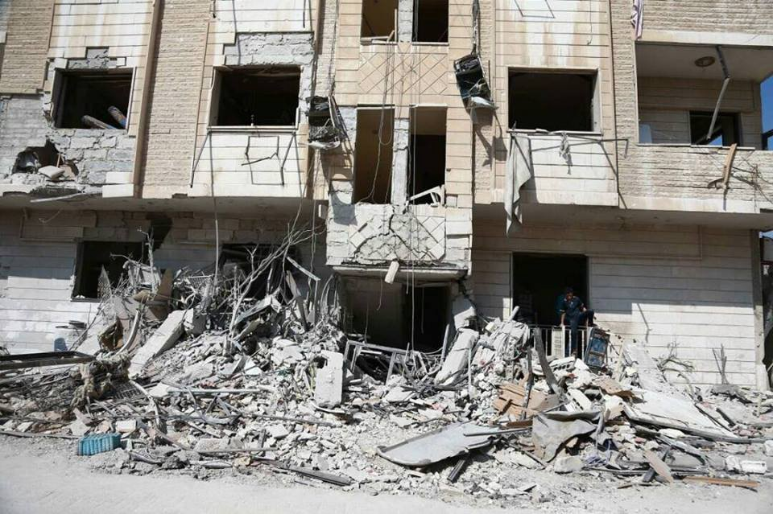
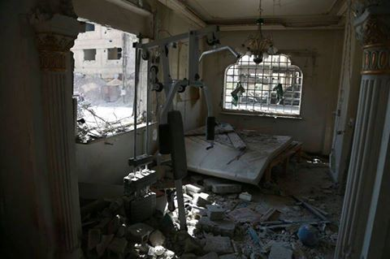
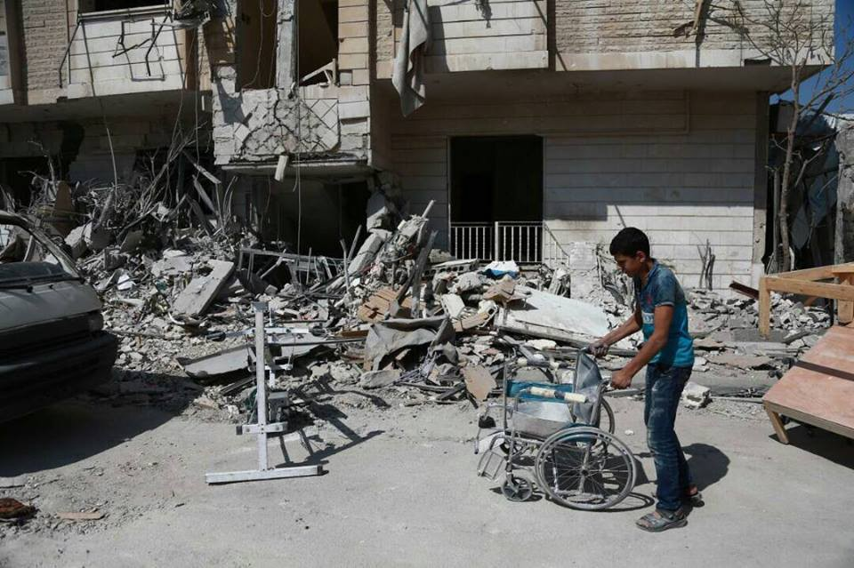

### AYS Daily Digest 27/09/17: New plan to resettle at least 50,000 refugees

_At least 50,000 new resettlements planned / Italy launches National Plan for integration of refugees / Two refugees from Burkina Faso die on Moroccan\-Spanish border / Situation in centres, along borders and in transit zones in Hungary / Physical rehabilitation centre targeted and completely destroyed in East Ghouta, Syria / And more news…_

 \. Patients seeking care are \#NotATarget\. \(Photo by Abdulmonam Eassa/Syrian American Medical Society\)](assets/138287dc2c73/1*JWy3WdAznQ8Y6K6gfijiGA.jpeg)

The Physical Rehabilitation Centre for Spinal Cord Injuries was targeted and completely destroyed in an aerial attack carried out today in Syria\. Health workers are [\#NotATarget](https://www.facebook.com/hashtag/notatarget?source=feed_text&story_id=1472001566182973) \. Patients seeking care are \#NotATarget\. \(Photo by Abdulmonam Eassa/Syrian American Medical Society\)
### FEATURE: At least 50,000 new resettlement places planned

_“The Commission is recommending a new EU resettlement scheme to bring at least 50,000 of the most vulnerable persons in need of internatio­nal protection to Europe over the next two years\.”_

The two\-year period for relocation of refugees from Italy and Greece was supposed to end [yesterday](ays-daily-digest-26-09-2017-another-date-marks-failed-policies-45cc66ace4c3) \. Instead, less than a third of the approximately 100,000 refugees who were supposed to have found a new life in peace were allowed to do so, according to [Amnesty](https://www.amnesty.org/en/latest/news/2017/09/eu-countries-have-fulfilled-less-than-a-third-of-their-asylum-relocation-promises/?utm_source=ECRE+Newsletters&utm_campaign=d428160a1d-EMAIL_CAMPAIGN_2017_09_26&utm_medium=email&utm_term=0_3ec9497afd-d428160a1d-420527945) \. EU member and associated states now have until the end of December 2017 to carry out the remaining registered relocations\.

The UN Migration Director General William Lacy Swing [urged](http://www.iom.int/news/un-migration-director-general-calls-continuity-full-participation-eu-relocation-programme) the EU and its Member States to continue the relocation programme in uninterrupted, improved form and called for “a sustainable, mandatory future relocation system that unites EU Member States in solidarity and shows that the EU acts effectively together\.”

He highlighted a few important points towards improving the system\. First, the lack of **full solidarity and responsibility sharing among EU states** that has weakened the credibility of the relocation system\. Secondly, eligibility criteria that would have allowed **other vulnerable categories** to be included, foremost **Afghan asylum seekers** , most of whom are children, unaccompanied children and families with children, many of whom exploited during the journey\. Thirdly, improved matching of beneficiaries with member states of relocation much earlier in the procedure would **reduce secondary movements\.** Family networks should have been better maintained\.

UNHCR also called for relocation continuity\. “Until the Dublin reform is adopted and a more permanent model put in place, the need for such responsibility\-sharing mechanisms remains acute,” Pascale Moreau, Director of UNHCR’s Europe Bureau [said](http://www.unhcr.org/59ca64354.html) \.

Find updated statistics on EU relocations [**here**](http://migration.iom.int/europe) \.

The EU unveiled a new plan today to resettle at least 50,000 refugees, with increased focus on resettling vulnerable persons from North Africa and the Horn of Africa, notably Libya, Egypt, Niger, Sudan, Chad and Ethiopia\. Migration Commissioner Dimitris Avramopoulos [noted](https://twitter.com/Avramopoulos/status/912991186209697792?ref_src=twsrc%5Etfw&ref_url=http%3A%2F%2Fwww.keeptalkinggreece.com%2F2017%2F09%2F27%2Feu-refugees-north-africa%2F) , on the other hand, that it’s important to ensure that those not permitted to stay are returned to their home countries more quickly\. “The Return Department will be significantly reinforced within the European Border and Coast Guard to ensure the Agency can implement a truly proactive return management approach and drive and coordinate the EU\-wide management of returns” stands in the statement\.

Find the full European Commission statement [**here**](http://europa.eu/rapid/press-release_IP-17-3406_en.htm) \.
#### SYRIA

Yesterday in East Ghouta, at 5pm local time, a Physical Rehabilitation Center for Spinal Cord Injuries was targeted and completely destroyed in an aerial attack carried out by the Government of Syria and its allies, Syrian American Medical Society [reports](https://www.facebook.com/SyrianAmericanMedicalSociety/posts/1472001566182973) \.

The Director of the Rehabilitation department, as well as two patients, were killed in the attack\. The center is now out of service\. This tragic loss happened against the backdrop of East Ghouta’s crippling, four year long siege, they write\.

Photos by Abdulmonam Eassa/Syrian American Medical Society
#### SEA

Lifeline posted a statement on yesterday’s attack by the Libyan coast guard during their boat’s first rescue operation in the Mediterranean, which we [covered](https://medium.com/@AreYouSyrious/ays-daily-digest-26-09-2017-another-date-marks-failed-policies-45cc66ace4c) in the previous digest\. The LCG attacked the ship by firing shots and entering the ship without the consent of their captain, trying to force them to hand over the rescued people to take them back to Libya\.

> Our crew refused to surrender the rescued people to the LCG not only because of the moral obligation but also because of the non\-refoulement principle, which is a principle of international law prohibiting the repatriation of persons in countries where they are threatened with torture or other serious human rights violations, which is the case in Libya\. This basic principle of humanitarian treatment is systematically ignored by the European Union who funds the LGC\. Luckily, the attackers left the area after intense discussions and both the crew and the rescued people aboard the Lifeline are fine and in good condition\. 

> However, this case clearly shows that the Libyan coast guard has repeatedly hindered rescue operations and the carrying out of humanitarian aid, threatened the lives of the crew on board as well as of the migrants and tried to defend the arbitrary expansion of their territory\. The criminal and life\-threatening acts of the Libyan coast guard are still financially supported by the European Union and our government\. 

Libyan Coast Guard reacted by [saying](https://www.yahoo.com/news/libya-threatens-seize-ngo-migrant-rescue-boats-181650891.html) how “this time we avoided an escalation” but in the future they won’t hasitate to “seize the boats of NGOs that do not respect Libya’s sovereignty\.”

We are waiting for reactions from Brussels and Berlin and will do all we can to ensure that the responsible persons are held accountable while ensuring the saving of human lives in the Mediterranean, Lifeline concluded\.

](assets/138287dc2c73/1*hwZGmEDm4mAuAkitMv5s_A.jpeg)

30 miles from the island of Sicily, many hours of sailing off the coast of Libya, we have just located these 2 fragile boats with 20 people, impregnated with salt and a terrible fear\. Governments should know that there are no sufficiently high or dangerous borders, when fleeing from slavery, persecution or war\. Just the promise to know that on the other side there is a safe place matters\. The risk of dying on the journey is assumed\. — [Proactiva Open Arms](https://www.facebook.com/proactivaservice/)

■■■■■■■■■■■■■■ 
> **[Taha Jawashi](https://twitter.com/tahajawashi) @ Twitter Says:** 

> > Libyan coastguards rescued 205 migrants sailing in bad weather.
#libya #migrants #coastguards #EU #immigration https://t.co/LDMbmp3EIs 

> **Tweeted at [2017-09-27 20:46:25](https://twitter.com/tahajawashi/status/913142809766633474).** 

■■■■■■■■■■■■■■ 

#### GREECE

With the hot and difficult summer coming to an end and with the memory of last winters horrors, many peole are worried because absolutely nothing has changed, the rain has come and winter is knocking on the door\. Action is needed\.

■■■■■■■■■■■■■■ 
> **[City Plaza Squat](https://twitter.com/sol2refugees) @ Twitter Says:** 

> > #Greek #HotSpot: MoriaDetention center today. Rain &amp; people still in tents! Where it goes 700 million dollar funded 4 the #RefugeesCrises https://t.co/vTF5Qe7nYA 

> **Tweeted at [2017-09-26 19:03:04](https://twitter.com/sol2refugees/status/912754413349023749).** 

■■■■■■■■■■■■■■ 

#### Samos

ARSIS attacked at meeting

On 25 September, in Paleokastro, Samos, ARSIS employees were victims of an unprovoked attack that included the use of verbal and physical violence\. The incident occurred at the meeting of the Local Council of Paleokastro Samos\. ARSIS employees came to inform the council about the housing program being implemented in cooperation with the UN High Commissioner for Refugees\.

> ARSIS recognizes the very difficult situation faced by the inhabitants of the border islands\. We believe that the local societies of the border islands have shown a great deal of practical solidarity with thousands of our fellow human beings, refugees who have fled to our country by war, or persecution in their countries of origin\. We know that any extreme reactions come from small groups that trigger tension with risk and inaccuracy\.
 

> …
 

>  The refugee housing program, which is being maintained by our organization in cooperation with UNHCR, has a positive and auxiliary function for both refugees and the local community\. 

Find the statement \(in Greek\) [here](http://arsis.gr/deltio-typou-apenanti-sti-via-protassoume-ti-synyparxi/) \.
#### Greek high schools to host special classes for refugees ages 15 to 18

Reception classes are core\-curriculum classes designed for children who are learning Greek as a foreign language\. Students focus on Greek language and mathematics, refugee\.info [writes](http://blog.refugee.info/high-school-reception-classes/) \. You can enroll by **Friday, September 29\.** 
See more on how to enroll [**here**](http://blog.refugee.info/high-school-reception-classes/) \.
#### Medics — register with the Greek medical authorities

If you are volunteering as a medic outside of an organisation, ensure that you are registered with the Greek medical authorities\. Forms are available [here](https://drive.google.com/drive/folders/0B5eHzYChsokiN2ctb05ac3pkNUU) \.
#### Arrivals

One boat landed on Lesvos north, Korakas with 37 people\. Two boats came to port Chios with 53 people each, first with 28 children, 9 women and 16 men, second with18 children, 13 women and 22 men\. One boat with 36 people was intercepted yesterday by HCG\.

Numbers of new registrations:
 Chios: 50
Samos: 43
Leros: 40 \(Farmakonisi\)
Others: 19 \(Kastelorizo\)
Total: 152
#### ITALY

At the core of the National Plan for the integration of refugees launched by the Italian Government, involving 74,853 migrants, is guaranteeing housing, work, health service and mandatory education for the migrants, but only if they respect the laws and the culture of the country\.

Minister of Interiors Marco Minniti stated: “We have worked on a strategy of sustainable integration, with a presence of foreigners equally spread on the national territory”\. Once the foreigners are entitled with the status of refugees, they will be able to accede the list to obtain housing and work\. The European Union has provided 100 million euro funding for the Plan, Italian TGCom24 [reports](http://www.tgcom24.mediaset.it/politica/migranti-il-piano-del-governo-casa-e-lavoro-ai-profughi-ma-devono-rispettare-leggi-e-valori-_3097239-201702a.shtml) \. The other resources will be coming from those European funds dedicated to assistance and receiving of the foreigners\. So far, the activity of integration was in the hands of the Regions’ and the local entities’ management\. Over 196,000 people are already part of the national receiving system, almost all applying for asylum\. In Italy there also 18,486 unaccompanied minors\.

According to the Plan, “learning Italian represents a right and a duty”\. For this reason, “an initial test to define the level and the best teaching method” has been established, so to make language courses mandatory\. 
In terms of housing, there should also be some Government support with accommodation and allocation\. An economic support for the rent is also foreseen when needed\.

The document introducing the Plan states that “the goal for the next two years is that the people entitled with protection can accede the resources offered by the territorial welfare system, aware of the housing emergency involving poor Italian citizens\. Among other priorities of the Plan is to actively promote dialogue among religions\.
#### Sardinia

In the last 72 hours, 232 migrants have crossed an unusual route from Algeria to Sardinia\. The people landing on the islands are one eighth of the total of 1,600 who landed in the same period in 2016\.

On Tuesday 26 September, 183 Algerians reached Sardinia, while in the night other 49 arrived\. In particular, a small boat carrying 17 people left from Algeria has landed on the shores between Cala Sapone and Sant’Antioco; another carried 12 people, including a child, to Porto Pino\. Other 20 have reached the harbor of Sant’Antioco stopping exactly in front of the station of the aero\-naval station\. They have since been transferred to the receiving centre in Monastir, Corriete [reports](http://www.corriere.it/cronache/17_settembre_27/migranti-strani-sbarchi-sardegna-dall-algeria-232-arrivi-72-ore-4b224c9e-a357-11e7-a066-220c02125bda.shtml) \.

Sardinia governor Francesco Pigliary wrote to Minister of the Interior Marco Minniti saying it is in his opinion necessary to multiply the efforts to stop the migrants’ passage from Algeria as soon as possible\. He continued to ask for concrete measures that the Government intends to deploy to urgently stop arrivals and strengthen the presence of the police in the landing areas\.
#### SPAIN

Two refugees from Burkina Faso died while trying to cross the Moroccan\-Spanish border, between Melilla and Morocco, after being tear gassed by Moroccan security forces on Saturday night near Beni Ensar, [according to](https://elfarodemelilla.es/2017/09/25/mueren-2-migrantes-gaseados-marruecos-al-tratar-pasar-melilla-segun-una-ong/) El Faro de Melilla\. The information was confirmed yesterday by Spanish journalist Helena Maleno, a specialist on migration issues\. She also reported that four other men had to be taken to the hospital for medical assistance\.

The journalist said that they were young men, many of whom could be minors\. However, the information has not yet been confirmed\. The other four migrants were allowed to leave the hospital\.
#### Ceuta \( border with Morocco\)

14 men and 1 woman from Guinea\-Bissau reached the shore of Ceuta this past evening\. According to photojournalist Antonio Sempere, a Ceuta native, they came by boat from Morocco, most likely eastern coast just south of Ceuta\. After initial check all were in good health and taken to the official C\.E\.T\.I camp in Ceuta\.
#### HUNGARY

Systematic pushbacks to Serbia, and more recently to Romania, continue\. The fence area has developed into a militarized zone of pushbacks and detention, MigSzol [write](https://www.migszol.com/blog/asylum-system-in-hungary-dismantled-as-elections-approach-migszol-update) \. On March 8th, the much criticized law on detention for all asylum seekers was passed in Hungary\. The first of the two forms of detention is asylum detention, for those who ask for asylum in Hungary\. There are four of this type currently\. The other type of detention is the Alien Police detention centers, commonly referred to as or immigration detention, for those who are caught and considered by Hungarian law as residing in the country “illegally”\. There are three of this type\. Read MigSzol’s full report on the situation in the centres, on the borders and transit zones [here](https://www.migszol.com/blog/asylum-system-in-hungary-dismantled-as-elections-approach-migszol-update) \.

■■■■■■■■■■■■■■ 
> **[MSF Sea](https://twitter.com/MSF_Sea) @ Twitter Says:** 

> > “As soon as they caught us they pulled out their sticks and started beating us. Then they let the dogs on us and took our shoes.” 1/4 https://t.co/EBoqcmPi3j 

> **Tweeted at [2017-09-27 14:49:01](https://twitter.com/msf_sea/status/913052866503479297).** 

■■■■■■■■■■■■■■ 

■■■■■■■■■■■■■■ 
> **[MSF Sea](https://twitter.com/MSF_Sea) @ Twitter Says:** 

> > “My head was bleeding from the 1st blow. When he [Hungarian police] shone a light on me he saw the blood but he still let the dogs out.”2/4 https://t.co/3QlqQToo42 

> **Tweeted at [2017-09-27 14:50:54](https://twitter.com/msf_sea/status/913053340958904321).** 

■■■■■■■■■■■■■■ 

#### FRANCE

Donations are needed for approaching colder weather\. [Solidarithé](https://www.facebook.com/solidarithe/) and [Paris Refugee Ground Support](https://www.facebook.com/PRGS.team/) are describing the current situation on the streets of Paris right now\. If you can volunteer or have aid to donate please message these organizations working on the ground\.

#### UK
#### London
#### **Storage/transfer needed\!**

10000s of mini dental kits, ideal for Calais, Dunkirk, Paris, Brussels, Italy, Patras, Chios, Lesvos\. \.
If you have either a storage space in London area or are willing to drive the packages where they are needed, please contact [Rando](https://www.facebook.com/rando.wagner?hc_ref=ARRsq6F8Y5VSZKH6gFno8fGEzLPem1kgeB2aGxB9mjFCztmMogpc_5ZwrITd6_ot2t0&fref=nf) \.

> **_We strive to echo correct news from the ground through collaboration and fairness, so let us know if something you read here isn’t right\._** 

> **_If there’s anything you want to share, contact us on Facebook or write to: areyousyrious@gmail\.com\._** 

_Converted [Medium Post](https://areyousyrious.medium.com/ays-daily-digest-27-09-2017-new-plan-to-resettle-at-least-50-000-refugees-138287dc2c73) by [ZMediumToMarkdown](https://github.com/ZhgChgLi/ZMediumToMarkdown)._
