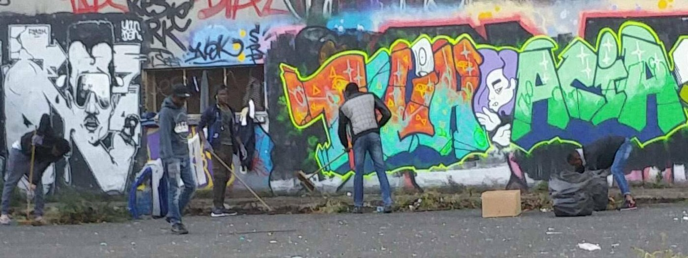
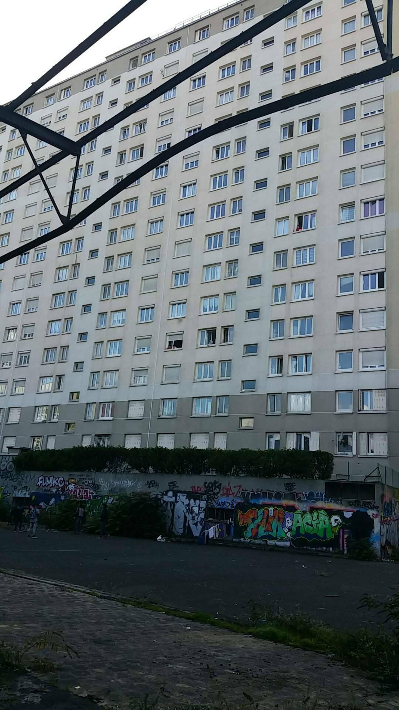
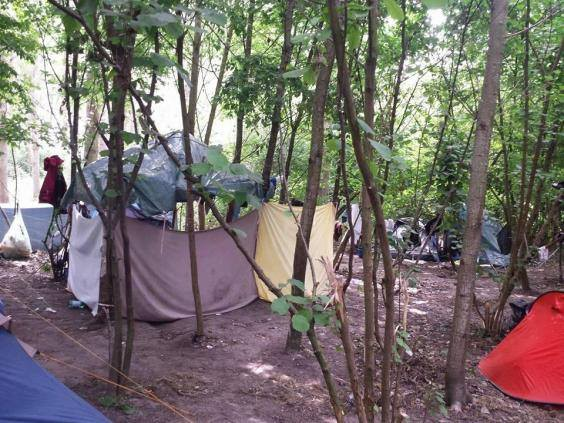

### AYS Daily Digest 01/10/17 : Relocation two years later: no solidarity in the EU

_EU relocation plans two years later / Appalling conditions persist on Lesvos / Calls for donations in France / And more news…_

 \)](assets/95a127c6db56/1*NKelOzQcBxZTovAzsolCGg.jpeg)

Lesvos, September 2017 “ The winter is already here and Moria is full of tents again like last year\.” \(Photo: [Aris Vlahopoulos](https://www.facebook.com/aris.vlahopoulos) \)
#### FEATURE

In September 2015, the EU agreed on a two\-year plan to relocate asylum\-seekers from Greece and Italy to other EU Member States\.

Under this plan, 66,400 asylum\-seekers were foreseen to be relocated from Greece, and 39,600 from Italy\. 
Nationalities that have at least a 75 per cent recognition rate at first instance across the EU \(based on the latest Eurostat quarterly statistics\) are eligible for relocation\. Other people who happen to be from a “wrong” country are left to risk lives in the cracks of the already poorly set up system and to give often all they have, including their safety, into the hands of the fastest growing criminal network in Europe, smuggling\.

Although far from a perfect or even fit solution, the idea of relocation is basically the only way to safely move elsewhere in Europe for thousands of people trapped in terrible conditions, many for up to two years now\.

In total, up until now only 29,401 people were relocated\.
20,323 persons were relocated from Greece \(30% of the aimed number\) and only 9,078 from Italy \(making a 23% of the foreseen number of people to be relocated from the country\) \.
Apart from the ineffective system, unsuccessful project and lack of solidarity from most of the EU member states, it should be noted that Austria took no people in from Greece, while Poland and Hungary completely rejected the foreseen number of people they were supposed to take in, 6,182 and 1,294, respectively\.

Malta is the only country who fulfilled their part\.

These poor results and the fact that the two years planned for the program have passed should not become a reason to slowly abandon the obligation and signed commitment to provide safety for an embarrassingly small number of people \(especially comparing to some of the poor countries who took upon themselves the biggest burden of welcoming\) \. This must be a priority and the bad results should serve as an initial impulse for the EU member states to finally ACT\.

> As well as allowing them to carry on with their lives in safety and dignity, making these people eligible would relieve pressure and improve conditions on the Greek islands, which have deteriorated as arrivals have risen over the summer months\. — _Amnesty International_ 

](assets/95a127c6db56/1*ooeRNEMYOj8-8AXwNhzuqQ.png)

Infographics [here](https://data2.unhcr.org/en/documents/download/60076)
#### SEA

](assets/95a127c6db56/1*TTaybin-MJAn-c1-KsK-Bg.png)

by [**Euro\-Mediterranean Human Rights Monitor**](https://www.facebook.com/EuroMedHR/?ref=gs&fref=gs&hc_location=group_dialog)
#### GREECE
### New arrivals

Two boats arrived to Chios, the first one with 59 on board \(18 children, 12 women and 29 men\) and the second one carried 65 people \(29 children, 18 women and 20 men\) \. People who landed on Oinousses today were transported to Chios port\.

A boat that arrived to Limnos reportedly had 54 people on board\.

17 people arrived to Rhodes yesterday morning\. One boat carrying 6 children, 16 women and 6 men was pushed back by the Turkish coast guard this morning\.
### Lesvos
#### _“Member States shall ensure that material reception conditions provide an adequate standard of living…”_

It has become clear to everyone by now that eception conditions under the Common European Asylum Procedure are being systematically violated in Lesvos\. The number of people stranded on this island varies from one official source to another, with some informal estimates reaching up to a number of 7,500 people believed to be on the island, whether in camps, prison or some other facility or private lodging\.

“ **Living conditions in Moria camp have become unbearable** over the past month as a dramatic [increase](https://www.theguardian.com/world/2017/sep/29/surge-in-migration-to-greece-fuels-misery-in-refugee-camps?CMP=share_btn_fb) in arrivals coincides with a deterioration in the weather and inadequate provision of food, shelter, healthcare and hygiene”, Legal centre Lesvos [September report](http://www.legalcentrelesbos.org/2017/09/30/september-report-on-rights-violations-and-resistance-in-lesvos/) states, speaking of the inhumane and dangerous conditions in Moria, a camp that is now over double its capacity: at least 4,831 people live there\.

](assets/95a127c6db56/1*mSyExmznc5a2i_vahpvXCg.jpeg)

Photo: [Aris Vlahopoulos](https://www.facebook.com/aris.vlahopoulos)

> \(…\)summer camping tents are crammed into every available space in Moria to accommodate new arrivals, that there are up to 20 people housed in containers meant for 5, that access to water gets cut off for days at a time, that there is no access to healthcare, that there are particularly vulnerable individuals — heavily pregnant women, people in wheelchairs, survivors of sexual, psychological, physical violence and torture, unaccompanied minors and pregnant minors — among those living in conditions unfit for human habitation; that there is widespread despair and mounting unrest\. 

Read their updates for more information, photos and updates on the situation on some of the most pressing issues on Lesvos\.

During the writing of this we’ve received messages from volunteers on the island who are preparing to receive another group arriving by boat on the coast of the island\.

■■■■■■■■■■■■■■ 
> **[Daphne Tolis](https://twitter.com/daphnetoli) @ Twitter Says:** 

> > The Greek gov't is exploring the possibility of “floating” accommodation centres to decongest the overcrowded refugee camps on the islands. 

> **Tweeted at [2017-10-01 19:41:33](https://twitter.com/daphnetoli/status/914576036096077828).** 

■■■■■■■■■■■■■■ 

#### SERBIA

UNHCR [update](https://data2.unhcr.org/en/documents/details/60086) for July and August dated September 29 notes that the number of asylum seekers and refugees present in the country constantly dropped down\. At the end of August, some 82% of residents in 18 governmental centres were from: Afghanistan \(66%\), Iraq \(11%\) and Syria \(5%\) \. Another 9% were from Pakistan and 10% from other countries\. 
43% were children, 14% adult women and 43% adult men\.
An increasing number of reports of violent incidents affecting refugees/migrants caused concern\.

> 579 Registered intentions to seek asylum in Serbia 

> 48% of registered refugees and migrants were minors 

> 13 Applications for asylum 

> 2 Persons granted refugee status 

> 0 Persons granted subsidiary protection 

#### FRANCE
### A call for help

> This is a simple but effective way you can help\.
 

> Very basic medical supplies are needed urgently in northern france\. We all know how awful a sore throat, eye infection or fever can be\. Imagine that while you are living \(hiding\) in a forest\. 
 

> If you can send me any of these things, just one packet, it will help one person: 

> \- Strepsils
 

> \- Eye/ear drops
 

> \- Iodine
 

> \- Scabies cream
 

> \- Ibuprofen gel
 

> \- Fungal cream
 

> \- anti acid tablets
 

> \- vaporub
 

> \- oblas oil
 

> \- sudocrem
 

> \- vitamines
 

> \- emergency blankets
 

> \- lip sore cream
 

> \- athletes filth cream
 

> \- steripods \(saline\) 

Contact [Sarah](https://www.facebook.com/sarah.fenbydixon.1?fref=gs&hc_ref=ARRDSwAr9i2nkQ9_vQa7xgI9LWDfh4g7B1lEDdhBxXglXzeSAkM4AxNjM19hFBjGPQY&dti=1006253006128240&hc_location=group) for details\.
### Paris

[Paris Refugee Ground Support](https://www.facebook.com/PRGS.team/) team visited one of the places where people stay in Paris, sleeping rough, in the midst of cramped chunks of junk and things they use during the night as shelters and protection\. 
The scenery represents the current surrounding for thousands in European cities\.

The area was cleaned up by the people currently staying in the area and sleeping on the concrete\. \. \(Photos: PRGS\)
### Calais

[Volunteers](https://www.facebook.com/humanaidgreece/) write after a visit to the area:

> The situation there remains unchanged\. Between Calais and Dunkirk there are approximately 1,100 people, a large proportion of which unaccompanied minors, living in the most appalling destitution: no shelter, no food, no latrines or showers, no medical help\. They are depending on the NGOs on site for each meal or piece of clothing\. With the winter coming their situation is getting direst and tiredness and hopelessness are exacerbating tensions between the communities\.
 

> Since the destruction of the camps, Calais and Dunkirk are not attracting lots of media anymore and the world is forgetting about them\. The NGOs there are doing an heroic work but they are lacking money, supplies and volunteers\. 

 \)](assets/95a127c6db56/1*dtp6F3evUbzdwAH1Shg2-Q.jpeg)

\(Photos by [Human Aid in Greece](https://www.facebook.com/humanaidgreece/) \)

> **_We strive to echo correct news from the ground through collaboration and fairness, so let us know if something you read here isn’t right\._** 

> **_If there’s anything you want to share, contact us on Facebook or write to: areyousyrious@gmail\.com\._** 

_Converted [Medium Post](https://areyousyrious.medium.com/ays-daily-digest-01-10-17-relocation-2-years-later-no-solidarity-in-the-eu-95a127c6db56) by [ZMediumToMarkdown](https://github.com/ZhgChgLi/ZMediumToMarkdown)._
