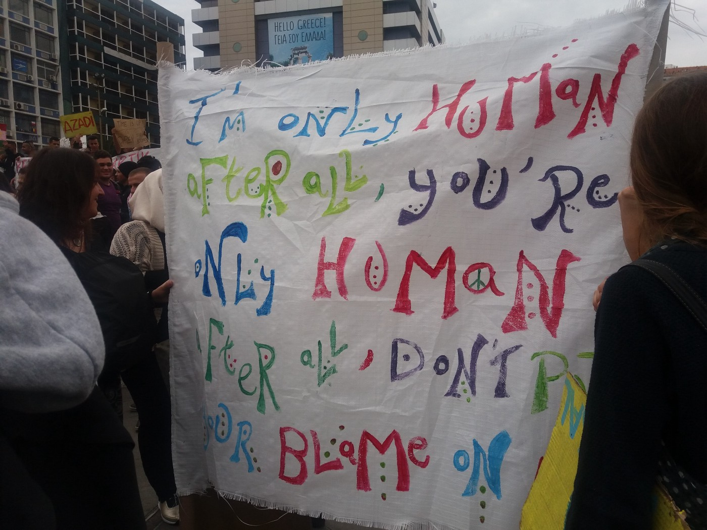
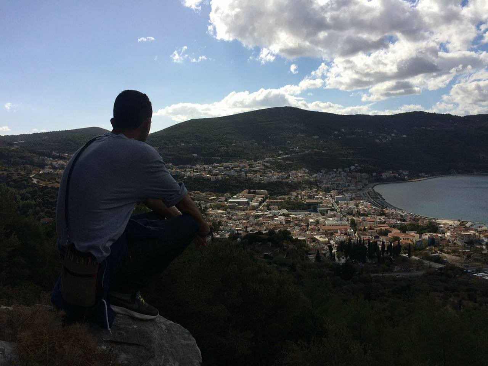
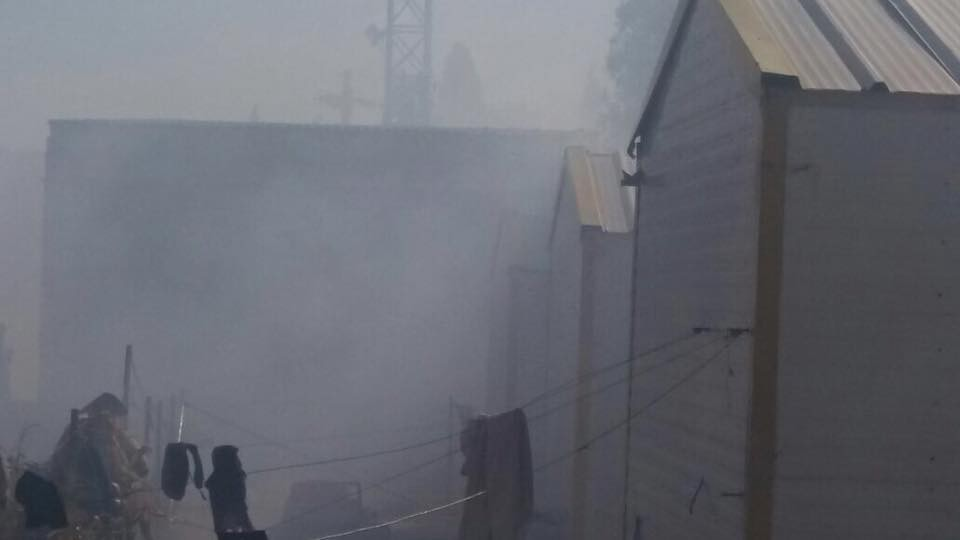
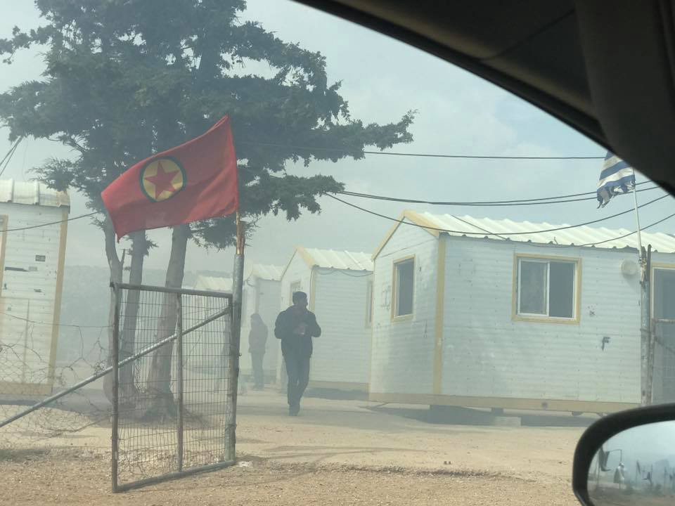
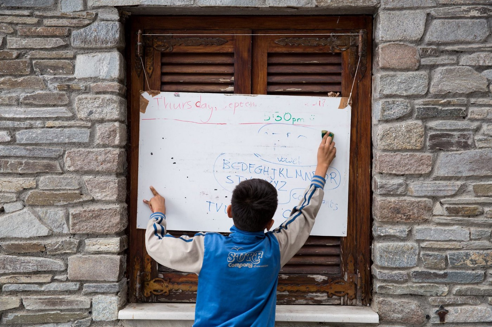
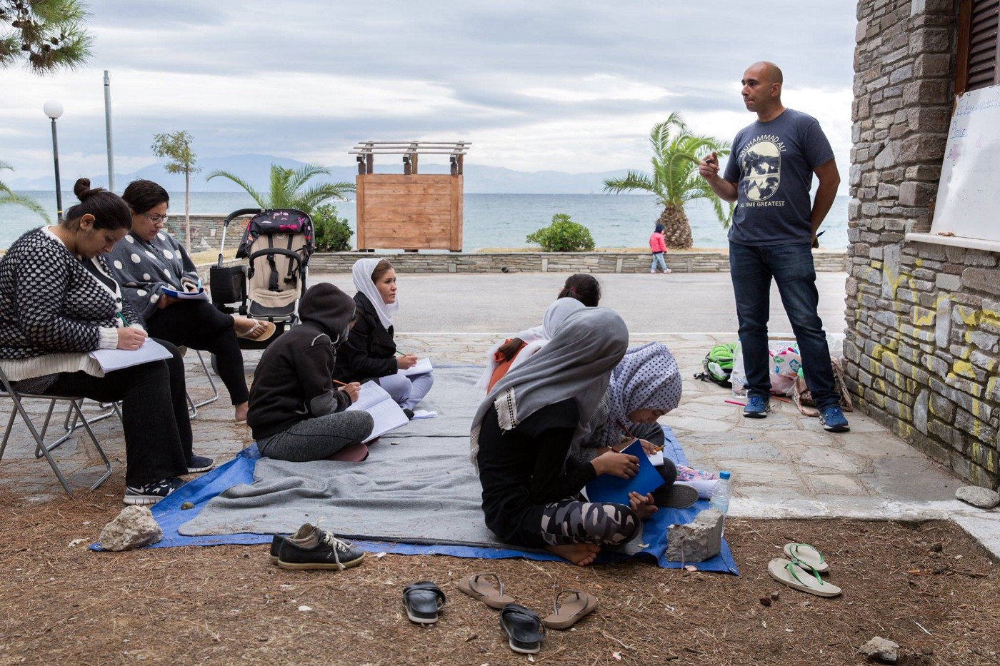
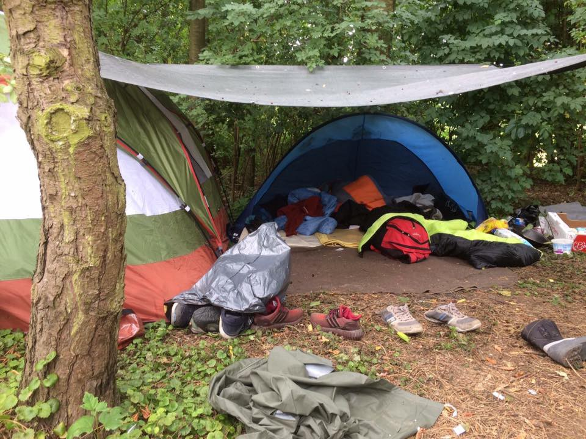
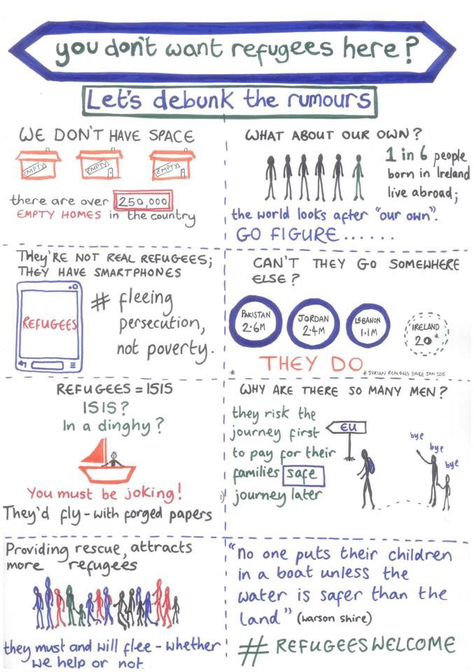

### AYS DAILY DIGEST 2/10/2017: How the EU\-Turkey deal destroys dreams

_At the island of Samos AYS spoke with one of the two people whose case was rejected at the Supreme Court and they are at risk of being forcibly returned to Turkey\. Like all of us, he has dreams and hopes, but unlike many, he still believes that the EU is the Promised Land where human rights are priority // And more reports about dreadful situation for refugees from Europe in this digest_

Athens, protest, Septemebr 30\. Photo by AYS\.
### Feature

_“I came from Idlib, Syria\. I finished my high school 10 years ago, but I couldn’t go to the college because I was working with my father on his farm\. Then, the war started and we have to leave\. I escaped from the war and destruction in my country\. I was hoping to be able to live the rest of my life in peace\._

_My first step toward that dream was Turkey\. What I saw there, was not peace\. I witnessed violence, fatigue, and fear\. I find it very dangerous, the country where one has to be very careful what you say or do in public\._

_After three weeks, I could not stay there living in such state of oppression and fear, and I decided to try to go to the European Union\. It was the long and difficult journey, but for me at that moment it was a journey toward a Promised Land\. I was told that EU is the place where law and human rights prevail, and where all the people are safe\._

_My first, and so far the only, encounter with the EU is Samos Island, Greece\. I am here for already 16 months waiting for my identity papers\. I applied two times for asylum and was rejected\. I appealed and appealed\. Finally, my appeal got to the Supreme Court, but I have rejected again\. And now, I’m waiting for their decision to be implemented and I deported back to Turkey\. I know that some people who were deported, or came back after not finding ways to stay in EU, are now — forcefully back in Syria, some even recruited by different armies\. They are fighting because neither EU or Turkey offered them protection\._

Photo AYS\.

_My lawyer tells me that I have the right to apply to the European Court of Human Rights\. And I will do that\. But, while waiting for that decision, I will have to hide\. After the last decision by the court, I became — again — illegal\. And that is because I want to do everything legally\. Many people are finding different ways to leave this island and country\. I do not want that\. They told me the EU is the land of law and human rights\. I want to see that\._

_For now, I have to hide again until the suspension order for my deportation is issued\. Before, while waiting for second instance decision, I was also hiding\. For seven months I was not able to go out to the street or talk to anyone, or even go to the hospital when I was sick\.”_

This is the story of one of the two Syrians who are at risk of being forcibly returned to Turkey after Greece’s highest administrative court rejected their final appeals against earlier rulings declaring their asylum claims inadmissible\.

The decision issued by the court in Greece is putting not only life or these two people who are directly concerned by the court decision in danger but represents a very problematic precedent for future for all asylum\-seekers\. The latest decision permits to Greek authorities to send back to Turkey thousands of people who arrived in this country after the EU\-Turkey deal\. Some of them are in detention, some are waiting for the decision since they arrived, mostly stranded on one of the overcrowded islands\.

In their reaction to the latest Court decision, [Amnesty International mentioned](https://www.amnesty.org/en/latest/news/2017/09/greece-court-decisions-pave-way-for-first-forcible-returns-of-asylum-seekers-under-eu-turkey-deal/?utm_source=facebook&utm_medium=article&utm_term&utm_campaign=social) the possibility of unlawful returns from Turkey to Syria, saying that “refugees and asylum\-seekers are at greater risk of being returned to their countries of origin since the start of last year’s state of emergency”\.

According to many reports from Turkey, refugees from Syria in this country are living in precariat conditions\. Some are not able to obtain the document that will permit them freedom of movement or legal work, some are used as a cheap labor force, while some live in the total margin of the society not being able to continue with their lives\. The are numerous proof that children often have to work in order for the family to earn some money\.

Additionally, last December, the UN Refugee Agency said that “it has faced obstacles to monitoring the situation of Syrians returned to Turkey from Greece as it has not been granted unhindered access to pre\-removal centers in Turkey where Syrian returnees from Greece are transferred\.”

[One more organization recently published their findings](http://www.kpsrl.org/browse/browse-item/t/uncovering-the-direct-and-indirect-consequences-of-the-eu-turkey-deal#.Wc5XPixZXSx.facebook) of “direct and indirect consequence” of the EU\-Turkey deal\. Under this deal, every person arriving irregularly to Greece — including asylum\-seekers — has to be returned to Turkey\. To fulfill this deal, the EU promised the Turkish government €6 billion in aid from and liberation of the visa regime\.

Nevertheless, the last report concluded that “the situation for Syrians in Turkey is so dire that 19 out of 193 readmitted Syrians chose to return to Syria, where after the evolution of the conflict their lives are now again at risk”\.

Turkey is the country that received the higher number of refugees from Syria — over 3 million\. But, most of them got only temporary protection\.

“My dream is to be a Nurse, or maybe Engineer\. But after all I went through, I am afraid will dead before any of my dreams is fulfilled,” our interlocutor told us couple while getting ready to go into hiding again where he will have to spend who knows how long time, while waiting to see a “Promised Land of law and human rights”\.
### Jordan

[Human Rights Watch issued the new report](https://www.hrw.org/news/2017/10/02/witness-syrians-thrust-back-war) with statements of people from Syria who have been summarily deported from Jordan back to war/torn country\.

“Jordan’s government says refugees are being sent back to protect national security,” report claims\.
### Algeria

Media are reporting that the Algerian Coast Guard arrested 2\.630 people in their atempt to reach Europe since the beginning of this year\. Many of them have been detained, facing imprisonment and financial penalty\. Nevertheless, a number of those who are succeeding in leaving the country is unknown, and according to different sources is increasing due to growing economic crisis in the country\.
### Libya

[Reuters reports](https://www.reuters.com/article/us-europe-migrants-libya/u-n-aims-to-open-libyan-transit-center-early-next-year-senior-official-idUSKCN1C4276) that the U\.N\. refugee agency is seeking to open a refugee transit center in Tripoli early next year to resettle or evacuate as many as 5,000 of the most vulnerable refugees out of Libya each year\.

“We hope to have the \(written\) authorization soon,” Roberto Mignone, the UNHCR’s representative in Libya, told Reuters in Rome\. The U\.N\. \-backed Tripoli government has already approved the project verbally, he said\.

At the same time when this news is published, the head of the Lybian National Army — who is visiting Rome — [told to Italian media](https://www.libyaherald.com/2017/09/30/hafter-willing-to-help-stop-illegal-migrants-but-wants-helicopters-and-drones-to-prevent-incursions-in-south/) that they can stop migrants and refugees traveling to Europe if they have needed military equipment\.

“For the control of borders in South, I can provide manpower, but Europeans must send aid: drones, helicopters, night vision goggles, vehicles”, he said in an interview with Italian national daily Corriere della Sera\.
### Greece

Today, one boat with 71 people arrived at overcrowded Lesvos\. A 27\-year old person, supposedly smugler, was arrested\.

Late night, a boat carrying at least 75 people was located close to the town of Pylos in Peloponnese\.

More people are arriving every day, and most of them are being placed in tents\. Night, but also days, are getting colder in Greece and it does not look like any winterization efforts have been made even this year\.

Volunteers, again, are the first one to help in Levsos and all other islands\.

In Chios, the extension of Vial camp started today with the placement of new tents around the registration area\.

The capacity of Vial is 900–1000 and the people staying there at the moment are — officially — 1\.389\.

People in the nearby town are against this extension, as volunteers are reporting, and they announced that they will try to stop it\.

Volunteers alarmed us today about the fire near makeshift camp Lavrio 2\. The camp is situated close to the illegal dump that got caught in a huge fire which produced toxic fumes\. All the people were evacuated, but only after the reaction of the group of volunteers\.

Photo by Ruhi Loren Akhtar\.

In this camp, there are around 100 people, including newborn babies\. Nobody but groups of independent volunteers are helping them for weeks now\. UNHCR so far did not show any signs of concern for the situation they are living in\.

After the fire today, some of the residences was brought to the hospital, while the rest return to their containers\. The toxic fumes are still rising from the nearby dump\.

[No Border Kitchen Lesvos](https://www.facebook.com/NBKLesvos/?hc_ref=ARRkTRElkIQDLQhs63nFcOAtkIBGFKqVLea1vtlA762nLq6WQgVqT8Sn854IvpqIJBU&fref=nf) issued another statement today on “28 reasons for arbitrary detention”\. In the statement, NBKL claims that the Greek government introduced a new way to arbitrarily detain even more people in Moria\.

“For several months the government has been detaining people of certain nationalities with very low acceptance rates based solely on their citizenship\. The most targeted groups were people from Pakistan, Algeria, Morocco, and Bangladesh\. Although this is illegal regarding EU law as it is clearly discrimination based on a person nationality and leads to a lot of racial profiling, it has been used by the government to force people to apply for asylum instead of traveling on, to get rid of “troublemakers”, to coerce people to sign for so\-called “voluntary return” with IOM and to make sure that as many people as possible get negative decisions on their admissibility interviews and thus can be deported back to Turkey\.”

Read the statement from their FB page for more details\.
### Support needed

[Northern Light Aid volunteers](https://www.facebook.com/groups/548152002019043/) need support to sustain their English classes in the Kavala camp\.

“Winter is coming, the weather is getting colder and our once sunny beach “classroom” is now often cloudy and rainy\. Because of this, we need to move our classes indoors, to keep our students warm and dry\. However, in order to do this, we need your support to be able to rent a new space to hold our English classes\! If you would like to be a part of this project and keep our classes going, please consider making a donation today\!”

Photo Northern Light Aid\.

[Mosaico House](https://www.facebook.com/helpfromgreece/..) is looking for volunteers for the month of October, November, And December\. The organization provides shelter for refugee women and children\. Volunteers are asked to commit to at least 2 weeks, more is always welcome\.

For more, visit their FB pages\.

**WARNING** 
**Please, spread the word**

**Warning sirens will go off at 11 am on Tuesday, October 3, all over Greece\. This is part of the nationwide civil defense exercise “Parmenion”\. The sirens will sound intermittent and at differing sound levels for 60 seconds, until 11:05 am when an uninterrupted siren will sound for another 60 seconds\.**
### France

Our friend, and longtime volunteer, [Danika Jurisic](https://www.facebook.com/profile.php?id=100009499466124) visited French Riviera, Côte d’Azur, these days\. But, as she writes in her latest FB post, “not because of their \(in\)famous beaches and luxury, I wanted to visit a group of refugees housed in a center close to St Tropez\. “

“They are living in a place of luxury, surrounded by storages of companies who are selling swimming pools, luxury cars, \-well anything that is glamorous and high\-tech\. You might think that living in such place where people are really rich is a blessing and that they might in a way benefit from\. But that is the world they are completely isolated from\. There is not a single support group around I could find or contact\. A complete absence of volunteers is scary\. They are given 42 euros per week for all their needs — food, toiletries, transportation…\. that is 6 euros per day\. They gather in groups, walk several km to the cheap supermarket \( artisanal shops that are dominating the area are not an option\) and they put their money together to buy the basic — vegetables and potatoes that must last for a week\. They keep some money for the bread, that is usually half of their every meal\.”

Read her post to find out more, and if you can, help\.

Police are still harassing people in Dunkirk\. Now there are around 200 people, and families, in the area living in inhuman conditions and they need help\.

**](assets/f8c6056902e0/1*FHJeXJE7p245HoOht9hHww.jpeg)

**Photo by [Joram Melissant](https://www.facebook.com/joram.melissant?hc_ref=ARRjrM9K0pkGFCtBMKdmeHnuHgxWqbDB-3crEj_KkbnfT13BYhDCwZnxtgBHp2RVlF4)**

Get in touch with [local volunteers](https://www.facebook.com/joram.melissant/posts/1890138957666184) if you can help

It is not much better in Calais\. People who are there need war clothes and shoes\.

Some of the local groups have banded together for the largest UK intra\-group collaboration since the eviction … raising £20k for approx 1,000 waterproof boots\.

They are fundraising via Donate4Refugees, and the boots will be bought on behalf of all the groups by Chorleywood for Refugees\. The boots will be given out to refugees in France and Belgium by L’Auberge/Help Refugees and Care4Calais\.

Groups so far include Chorleywood 4 Refugees, Calais People to People Solidarity, Cambridge Convoy Refugee Action Group \(CamCRAG\), Friends of Refugees for Bedfordshire, Herts for Refugees, Marlow Refugee Action Group, Side by Side Refugees and Together100\.

[Get in touch if you can help](https://www.facebook.com/groups/CalaisMigrantSolidarityActionFromUK/permalink/1655191624555578/) \.

Ireland Welcome Refugees group on FB published an interesting and useful [explainer](https://www.facebook.com/Refugeesarewlcome/) \.

> **_We strive to echo correct news from the ground through collaboration and fairness, so let us know if something you read here isn’t right\._** 

> **_If there’s anything you want to share, contact us on Facebook or write to: areyousyrious@gmail\.com\._** 

_Converted [Medium Post](https://areyousyrious.medium.com/ays-daily-digest-2-10-2017-how-the-eu-turkey-deal-destroys-dreams-f8c6056902e0) by [ZMediumToMarkdown](https://github.com/ZhgChgLi/ZMediumToMarkdown)._
