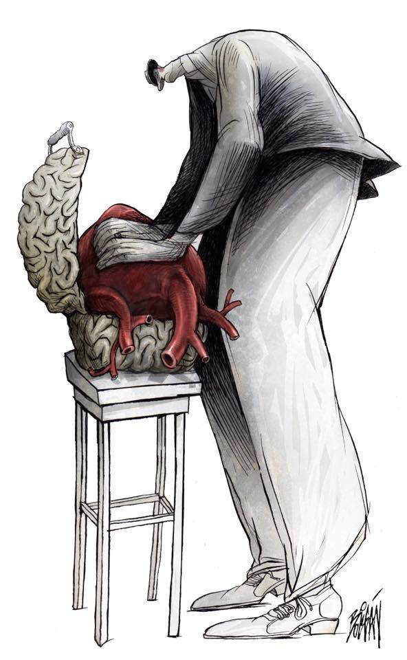
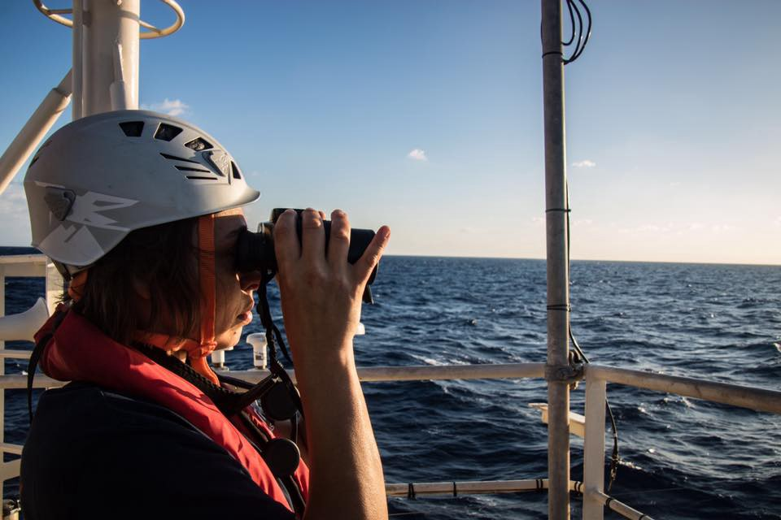
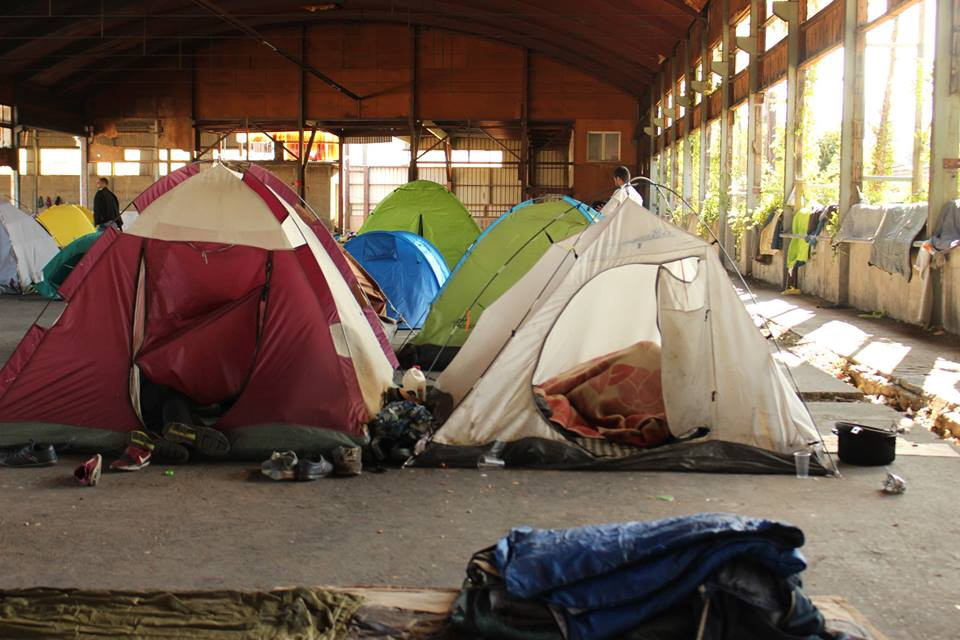
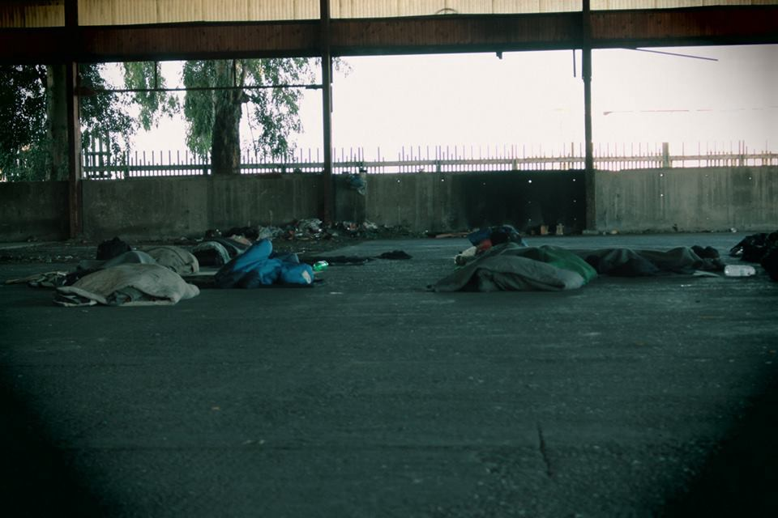
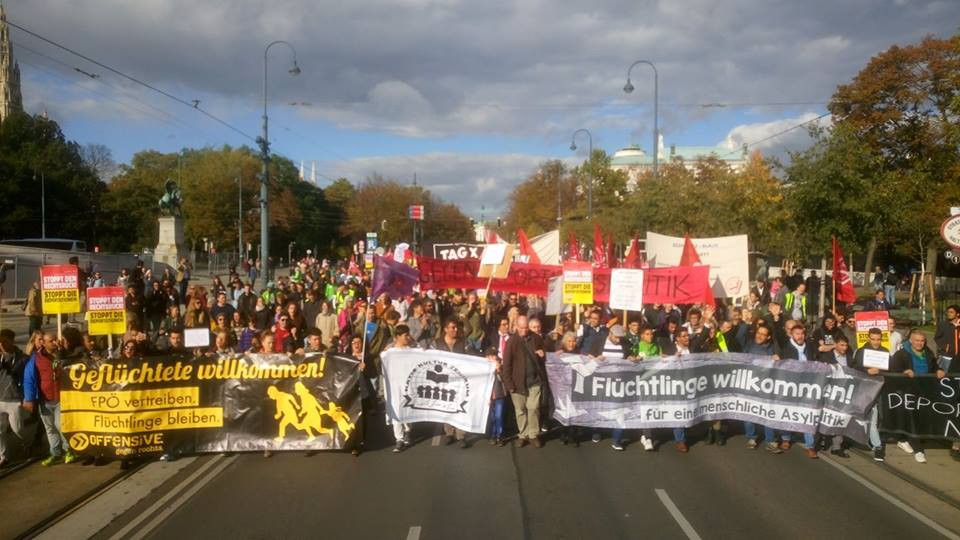

### AYS Daily Digest 07/10/2017 — Humans helping humans

SAR Operation in the Mediterranean despite bad weather /// Five New Hotspots to be built on Greek islands /// Fascist attack in Mainland Greece /// Worsening condition in Hungary “Transit Zones” /// Demonstration in Vienna…

The Immigrant by Boligàn \(Art Against\)

**Humans helping Humans**

Every night for the past three weeks [HÉBERGEMENT PLATEFORME CITOYENNE](https://web.facebook.com/groups/140794776533345/) has been matching local people with homeless refugees in Brussels\. So far they have been able to find accommodation for about 100 refugees who were sleeping rough in the parks and at the train station in the city\. All the accommodation organizing happens over Facebook\. Then in the evening, a group of volunteers waits for refugees and families near the train station so they can try to find a good match between the hosts and their guest\(s\) \.

One of the coordinators of the initiative stated:

> We are happy to see that all kinds of people are offering a bedroom: rich, poor, young, old… Some people do not hesitate and transform their living room into a campground \(last night I hosted 6 guys myself with only a sofa\-bed in the living room\) 

Most of the people who are supporting the initiative and the people they have hosted are not part of any organization\. They are ‘just humans helping humans’\. Some families are also taking part by helping their guests and guiding them to organizations able to provide administrative/legal/medical assistance\. Most accommodations are short term but some families host people for several days and many host families keep contact with the people they have hosted after they leave\.

> The refugees we help are not claiming asylum in Belgium but trying to make it to the UK \(the majority of them\) \. This explains why they are all homeless and not taken care of by the Belgian organizations\. Most of them come from Calais and Dunkirk\. We try to inform them about their rights and the possibilities they have to claim asylum in Belgium… But most of them still dream of the UK… 

The group is encouraging people in other countries/cities to start hosting projects\.

> We are happy to say that no major problems have been encountered so far\. It is all a matter of trust on both sides\. The main concerns \(for the refugees and their host families\) would be: food \(Muslim refugees being served non\-halal food\); or a man being hosted by a single European woman \(not always ‘logical’ in the eyes of a Muslim person\) \. The language barrier is also a cause of \(often hilarious\) misunderstandings\. 

There are currently only ten volunteers working to make this happen\. The group is happy to offer advice to anyone who would like to start a similar solidarity initiative in their own town or city\.

**Sea**

Lifeline

Lifeline and Moonbird are patrolling the Mediterranean

Bad weather set to get worse\. MSF report 2\-metres\-high waves\.

■■■■■■■■■■■■■■ 
> **[MSF Sea](https://twitter.com/MSF_Sea) @ Twitter Says:** 

> > The #Aquarius is in pretty rough weather with waves over 2 metres. Conditions set to get worse in the evening https://t.co/m3qtZ7Zjou 

> **Tweeted at [2017-10-07 11:42:03](https://twitter.com/msf_sea/status/916629693566279680).** 

■■■■■■■■■■■■■■ 

Even though the weather is rough and crossings are not likely there are SAR missions on the lookout\.

■■■■■■■■■■■■■■ 
> **[SOS MEDITERRANEE France](https://twitter.com/SOSMedFrance) @ Twitter Says:** 

> > UPDATE L'#Aquarius reste en veille constante malgré la détérioration des conditions météo en Méditerranée rendant les traversées improbables https://t.co/Aos5dxLAuc 

> **Tweeted at [2017-10-07 07:59:25](https://twitter.com/sosmedfrance/status/916573662999924736).** 

■■■■■■■■■■■■■■ 

**Greece**

**Arrivals**

One boat arrived at Samos today carrying 59 people: 15 men, 22 women and 22 children\.

■■■■■■■■■■■■■■ 
> **[ERCI](https://twitter.com/ERCIntl) @ Twitter Says:** 

> > #NEWS : First refugee boat to Lesvos this morning was picked up by HCG, it was carrying 33 people. #Refugeecrisis #Lesvos 

> **Tweeted at [2017-10-07 07:24:18](https://twitter.com/ercintl/status/916564825743986688).** 

■■■■■■■■■■■■■■ 

A second boat arrived at Lesvos carrying 40 people: 10 men, nine women and 21 children\.

**Islands**

■■■■■■■■■■■■■■ 
> **[Chios Monitor](https://twitter.com/ChiosMonitor) @ Twitter Says:** 

> > Accountability is key: there is NO excuse for the failure to prepare camps for winter. Negligence costs #refugees their lives. #RefugeesGR [twitter.com/ekathimerini/s…](https://twitter.com/ekathimerini/status/916308888030294017) 

> **Tweeted at [2017-10-07 17:54:12](https://twitter.com/chiosmonitor/status/916723347484041216).** 

■■■■■■■■■■■■■■ 

8\.1 million euros will be invested in five new hotspots to be built on Chios, Lesvos, Samos, Leros and Kos according to [local media](http://www.politischios.gr/politiki/81-ek-eyro-gia-nea-hotspot-se-hio-lesbo-samo-lero-kai-ko) \. The Ministry of Migration Policy apparently wants to create 8,500 “hospitality places” in the Eastern Aegean islands\. Local people are concerned that this will lead to people being trapped long\-term on the islands and would prefer a quick transfer process to the mainland\. The funds have been pledged up to 31 December 2022\. Yet the additional spaces they will offer would be filled instantly if they were to house all of the people currently in the over\-capacity camps\.

**Mainland**

Fascist attack on agricultural laborers

[KEERFA](http://www.antiracismfascism.org/index.php/2015-07-16-09-37-48/item/2258-dolofoniki-epithesi-ton-neonazi-sti-gorytsa-aspropyrgou-kata-metanaston-ergaton-gis) has published a condemnation of today’s murderous assault by five members of neo\-Nazi group Goritsa Aspropyrgos on farm laborers Safak Mahmud and Vakas Hussein while the two men were at work\. The attackers screamed racist abuse during the assault and have been seen by local groups attacking people at anti\-fascist events\. Yet, the attackers have still not been prosecuted\.

> We call on the unions, the left, the municipal movements, the solidarity movements to condemn the pogroms of the fascists and demand that the police refuse to tolerate their action and their presence\. 

[Refugee Info Bus](https://web.facebook.com/RefugeeInfoBus/posts/2030637327171685?hc_location=ufi) reports on the situation in Patras where many people are sleeping without tents\.

Patras \(Refugee Info Bus\)

> There were around 70 tents inside the building, although there were more than 300 refugees living there, so people were sleeping out in the open\. Poor sanitation and lack of protection from the elements mean that disease was rife\. 

> A young man was stabbed, but the ambulance didn’t come, the police arrived and took the victim away three hours after he was attacked\. Our team heard repeated stories of violence as well as police brutality\. 

> As the borders tighten around Greece and resources are strained further, people are taking greater risks to escape a country that doesn’t have the economic stability to enable refugees to find work, contribute to the economy and realize their basic rights to a roof over their head\. 

City Plaza wants to make soup in the cold months ahead but to do it they need bowls and spoons\.

Khora Community Centre is looking for German teachers who can commit to at least four weeks\. For more info email them at [khora\.education@gmail\.com](mailto:khora.education@gmail.com)

**Hungary**

The situation in Hungary is not improving\. In the atmosphere of fear and intimidation, with growing border violence in the transit zones, stories like the one that follows arise often\. According to [local media](http://index.hu/mindekozben/poszt/2017/10/05/ocsenyi_videonk_angolul_is_the_villagers_were_so_horrified_of_the_refugees_that_they_even_banished_their_mayor/) residents in a small village called Őcsény have been harassing a motel owner who invited some refugees to stay for a few days\. In a video published with the article local people say that they have never met any refugees and only know about them through the media, which has been running a government\-sponsored hate campaign\.

> The people who would have stayed at the motel were women and children who had been given legal asylum status by the Hungarian authorities\. After the incident, Prime Minister Viktor Orbán defended the illegal actions of the locals\. 

**Austria**

Demonstration in Vienna

 \)](assets/8bdaffc5ee9d/1*W7zyT5_gwJKXZ598AvFLJw.jpeg)

Vienna \( [Plattform für eine menschliche Asylpolitik](https://www.facebook.com/menschliche.asylpolitik/) \)

There was a demonstration in Vienna today against racism sexism and cuts to social services\. Reports on attendance vary — 2500 according to organizers, 400 according to police sources\.

**France**

A squat housing 60 people was cleared out in Montreuil yesterday and about 20 people, including two pregnant woman and children, now have nowhere to go\. Volunteers managed to find temporary accommodation for them for at least one night\. Blankets and warm clothes are needed, as well as a place for them to stay the next night\. Contact [People to People Solidarity](https://web.facebook.com/groups/P2PParis/permalink/1489539561132913/) if you can help\.

[Care4Calais](http://us13.campaign-archive2.com/?e&u=565b6e25c58b205e3d775361c&id=92635be21c) need volunteers and donations to prepare for the coming winter\.
### AYS needs your help\!

Please speak your mind and fill out this survey so we can understand better what news is needed and how\! Find the survey [here](https://goo.gl/forms/MfkXERqvkHeqWHfo1) \!

> **_We strive to echo correct news from the ground through collaboration and fairness, so let us know if something you read here isn’t right\._** 

> **_If there’s anything you want to share, contact us on Facebook or write to: areyousyrious@gmail\.com\._** 

_Converted [Medium Post](https://areyousyrious.medium.com/ays-daily-digest-07-10-2017-humans-helping-humans-8bdaffc5ee9d) by [ZMediumToMarkdown](https://github.com/ZhgChgLi/ZMediumToMarkdown)._
