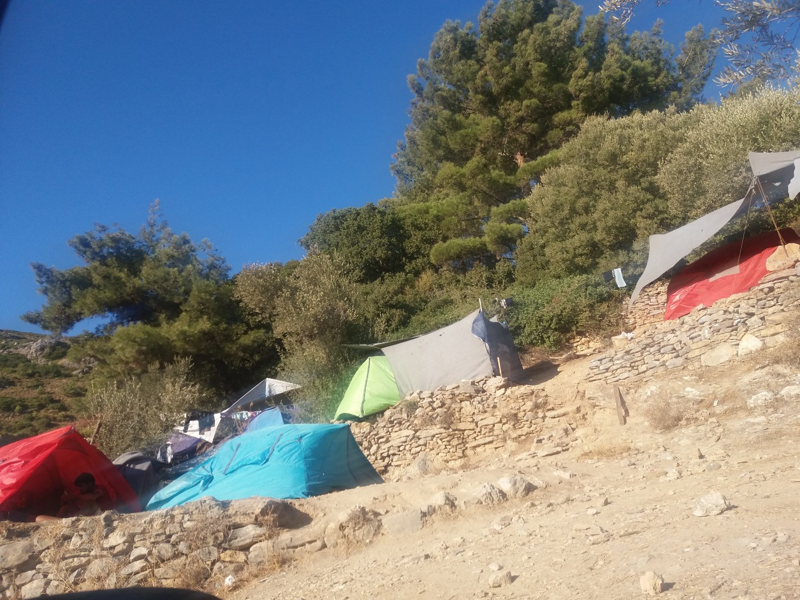
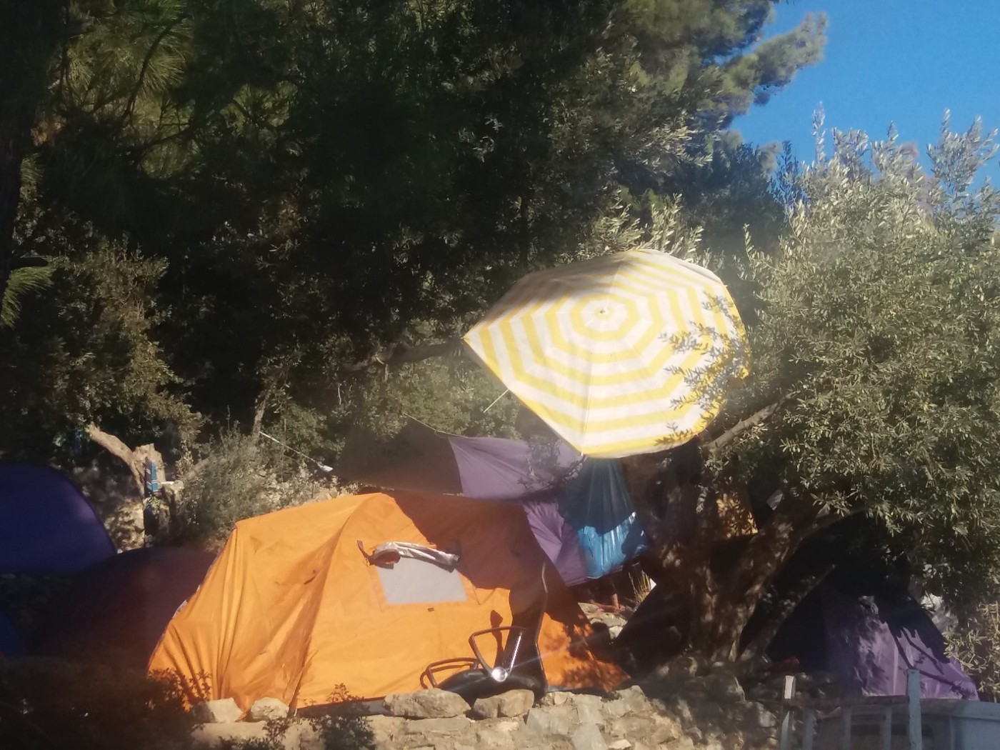
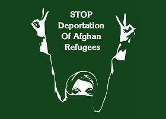
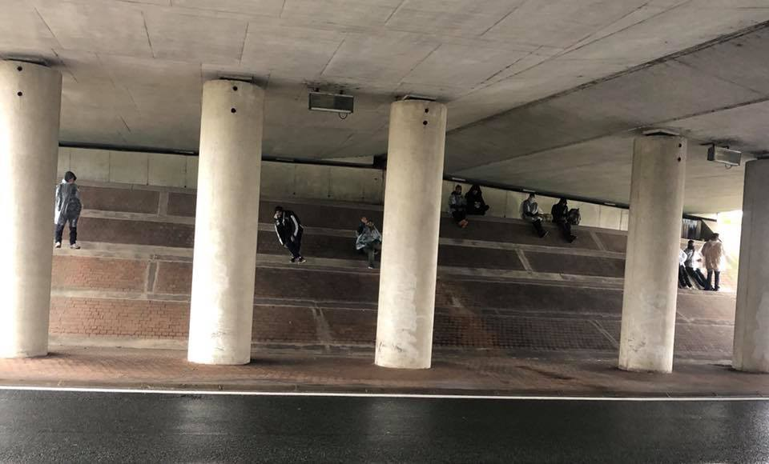

### AYS DAILY DIGEST 8/10/2017: Another child died in Greece in less than one month

_Tragedy on Lesvos // Greek lawyers are fighting a decision to keep people on the islands before their applications are reviewed // Progressive Movement of Women of Samos issues demands //Deportations announced from Sweden and Austria_

### Feature

Today, a 5\-year\-old Syrian girl died inside Moria camp at Lesvos\. There is no official confirmation of the causes of deaths, but life in the unbearable conditions of Moria camp contributed without any doubt\.

According to the available info, the girl had a serious health problem, and her family arrived in Europe hoping to get help\.

The girl and her family arrived at Lesvos on October 3rd\.

This is the second child that died over the last couple of weeks in Greece\. [The first case is from September 28](ays-28-09-2017-9-years-old-girl-from-syria-died-after-boat-accident-in-greece-a79d5ba64dee) , when 9\-year\-old Syrian girl died after the shipwreck near the small southeastern island of Kastellorizo\.

Last year during the winter, six refugees lost their lives in Lesvos alone\. In total, 13 people died on islands last winter\. Due to current conditions on islands, many are afraid what this winter could bring\. All of the islands are overcrowded and living conditions are less than basic\.

This is video from Moria:

Just as a reminder, Human Rights Watch representative who visited Moria this week, [compared it to the concentration camp in her address to the Greek Parliament](http://greece.greekreporter.com/2017/10/06/migrant-camp-in-lesvos-a-concentration-camp-says-human-rights-watch/) \.

_“No one deserves to be treated the way people at Moria are,”_ said Emina Cerimovic from HRW, pointing to overcrowding as one of the biggest problems facing in the camps on the Greek islands\.

_“Many of the camp’s residents are forced to live in tents with just a few blankets that serve as a mattress and cushion, women are extremely vulnerable to sexual harassment, and there are no showering facilities for residents with mobility problems,”_ the HRW envoys told MPs\.

Neither HRW or any other NGO’s are aware of any plans Greek government has to resolve this situation\. The only information that exists is about the 8\.1 million Euros that will be invested by EU in new Hot Spots on Lesvos, Chios, Samos, Leros, and Kos\.
#### Sea

According to the [IOM](http://migration.iom.int/europe/) , the UN Migration Agency, 139,763 migrants, and refugees entered Europe by sea so far this year\. Over the same period last year, 312,153 people arrived by sea\. This week alone, there have been 2,826 new arrivals to Italy and 665 to Greece\.

Worldwide, Missing Migrants Project has recorded 4,526 migrant victims in 2017, compared with 5,670 at this point last year\.
### Greece

[According to the local media](http://www.amna.gr/en/article/192655/December-hearing-by-Council-of-State-on-appeal-calling-for-migrants-to-be-transferred-out-from-Aegean-islands) reports, on December 5th, the Council of State will hear an appeal filed by bar associations of lawyers on the islands of Mytilini, Chios, Samos, and Kos, who oppose a decision to keep migrants and refugees on the islands before their applications are reviewed\.

Their intention is to prove that the prolonged detention of people on the islands is not justified by the EU — Turkey deal and that the government has pushed this decision on the director of the Asylum Service, rather than having the immigration minister decide\.

_“We believe that refugees and migrants who enter Greece through the Greek islands can be transferred to the rest of Greece while their asylum application is reviewed,”_ the Samos bar association president, George Kollaros, told a Chios newspaper\.

[The Woman’s Association at Samos issued a statement](https://www.ikariaki.gr/%ce%b1%ce%bd%ce%b1%ce%ba%ce%bf.../) pointing out to the situation in the overcrowded camp and saying that the situation is especially serious for children\.

Make\-shifft shelters in Samos\. Photo AYS

_“Apart from the fact that many have been traumatized by the conditions of war in which they have lived, the encroachment at a center, often without their family, the lack of organized systematic education, and the lack of employment and entertainment poses serious risks to the future and their development,”_ the statement reads\.

They stress that _“long\-term encapsulation in inappropriate conditions, let alone crowding in facilities that are destined for a much smaller number of people, creates problems and poses risks\. However, in investigating such matters, blame is often cast on refugees and immigrants themselves, the victims, not the perpetrators\. Wrath and indignation must turn to the truly guilty, which is the EU policy and government and NATO\.”_

As women in the Progressive Movement of Women of Samos they demand:

> Immediate release of refugees and migrants to continue their journey to their countries of destination 

> Decent places and conditions of temporary residence exclusively for the reception and registration of refugees and immigrants\. 

> Particular care for unaccompanied minors, families with children, pregnant women, etc\. They should not be detained in hotspots and detention centers 

> To make all necessary recruitment of permanent staff of all specialties in the CWC for the full coverage of refugees and immigrants in health care, psychological support, legal advice, 

> Ensure the participation of school age and preschool children in the educational process, under the responsibility of the state and without the involvement of NGOs, by ensuring all the necessary conditions \(recruitment of educational and support staff, vaccinations, etc\. \) \. 

### HELP NEEDED

Lesvos

House of Humanity is “a safe space for refugees to access the humanitarian aid needed to survive their journey in a way that restores dignity”\. They provide a free supermarket featuring food, hygiene goods, and baby supplies\. [To continue functioning, they need help](https://www.launchgood.com/project/house_of_humanity_20__humanitarian_aid__psycosocial_therapy_center_for_refugees_in_lesvos_greece#!/) \.
#### CALLS FOR VOLUNTEERS

In the first five days of October, MoChara team assisted 141 people\. They call on every potential volunteer to come and join them\. For more information, write to them\. [More info here](http://www.refugeerescue.co.uk/land-crew/) \.

“The [No Border School](https://www.facebook.com/noborderschool/) is an educational collective that provides free language classes in Athens\. We believe that we are all both students and teachers who can learn from one another\. We believe in the value of education as a force that empowers and brings people together and seen directly the positive impact on the communities we work with\. [No Border School](http://www.noborderschool.com/contact-us/) relies on the ongoing hard work and enthusiasm of the teachers in our collective\. In order to keep doing this amazing work, in order to keep supporting people… we need more volunteers\. We need volunteer English and German teachers now for locations in Athens\.”
### Italy

According to the information from the Italian Ministry of the Interior, so far this year 106,889 people arrived to the country by sea\. It is 23\.26 percent less than last year in the same period\.
### Macedonia

In the period from 28 September to 4 October, 30 people arrived in Macedonia\. This represents 400% increase from the previous period \(6 registered arrivals, from 21 September to 27 September\) \.
### Serbia

[The European Commission announced](http://europa.eu/rapid/press-release_IP-17-3730_en.htm) an additional €4 million in humanitarian aid for Serbia\. The money should be directed toward food distribution in camp, the protection of the most vulnerable affected populations in particular during the upcoming winter and education\-related activities\.

So far, €25 million was provided for the provision of emergency assistance \(food, water, hygiene, essential items, health, and protection\) at transit and reception points, including borders and waiting areas\.

A total of more than €80 million has been provided to the country in EU migration related funding since 2015\.

Yet, the condition in many of the camps around Serbia is hard to describe, and extremely inhumane\.

As of mid\-September, over 4,000 refugees and asylum\-seekers have been registered in Serbia\.
### Hungary

IOM reports that from 28 September to 4 October, 105 new arrivals were registered in Hungary, which is an increase of 88 percent from the week before \(56 registered arrivals, from 21 September to 27 September\) \.
### Austria\-Sweden

[Refugee Protest Camp Vienna](http://www.facebook.com/RefugeeCampVienna/posts/1599409350111652) warns about the new deportation are announced from Austria\. According to local activists, there will be a charter deportation flight from Austria and Sweden to Afghanistan on October 10th\. Arrival in Kabul on Oct\. 11th\. However, the information that this will be a mass deportation on a chartered plane has now been confirmed\.

Volunteers from Vienna are also reporting about police raids all over the country looking for people from Afghanistan\.

The warning is coming from Sweden, too\. [Local media published](http://www.gp.se/nyheter/sverige/deras-pojke-ska-utvisas-1.4707740) a story about one of the boys and his Swedish family\. A couple of weeks ago they celebrated his 16th birthday in detention at one of the institutions where people scheduled for deportation are put if there is a chance that they may otherwise “disappear” before the plane takes off\.

Everyone can write to the airplane company and ask them not to take part in the deportation\! The company is hired by the Migration Agency and the deportation is scheduled from Landvetter airport in south Sweden on Tuesday the 10 October\.

The flight number is PVG 6221\.

The companies email is [communication@privilegestyle\.com](mailto:communication@privilegestyle.com) \.

### France

New report about the situation in Calais by Care4Calais

_“Yesterday, Calais was cold, windswept and raining\. People were huddling under bridges to get out of the rain and shivering from the cold\. We gave out 41 pairs of walking boots, together with winter coats, hoodies, sleeping bags, and joggers\._

_One lady, in particular, was really cold and shivering as she was totally soaked to the skin — she was blue and shaking\. Marie, a lovely volunteer, brought her back and searched through our stock to find a good waterproof coat and a change of clothes down to her soaking wet underwear\.”_

Photo Care4Calais\.

A donation of £20 buys some warm dry walking boots, or last years winter coat will be well used out here\. [Go to Care4Calais donate page](http://www.care4calais.org/donate) if you can help\.

[Auberge des Migrants](https://www.facebook.com/LAuberge-des-Migrants-358496450338/) launched an appeal for donations \(money and goods\) and volunteers\.
### Germany

Out of almost 5,000 refugees in Greece, who got permission to join their relatives already living in Germany according to Dublin procedure, only 322 \(6,5%\) have actually moved to Germany\.

The reason for this low percentage, according to German Ministers of an interior, were coordination problems with Greece and a lack of facilities in Germany\.

[A politician of the party “Die Linke”](https://www.neues-deutschland.de/artikel/1066099.bundesregierung-verzoegert-offenbar-familiennachzug.html) , who brought this to the attention of the public, said, that at least Germany and Greece should allow those persons to move to Germany on their own accords\.
### AYS needs your help\!

Please speak your mind and fill out this survey so we can better understand what news is needed and how\! Find the survey [here](https://goo.gl/forms/MfkXERqvkHeqWHfo1) \!

> **_We strive to echo correct news from the ground through collaboration and fairness\._** 

> **_Every effort has been made to credit organizations and individuals with regard to the supply of information, video, and photo material \(in cases where the source wanted to be accredited\) \. Please notify us regarding corrections\._** 

> **_If there’s anything you want to share or comment, contact us through Facebook or write to: areyousyrious@gmail\.com_** 

_Converted [Medium Post](https://areyousyrious.medium.com/ays-daily-digest-8-10-2017-another-child-died-in-greece-in-less-than-one-month-e3d08ec5b9df) by [ZMediumToMarkdown](https://github.com/ZhgChgLi/ZMediumToMarkdown)._
