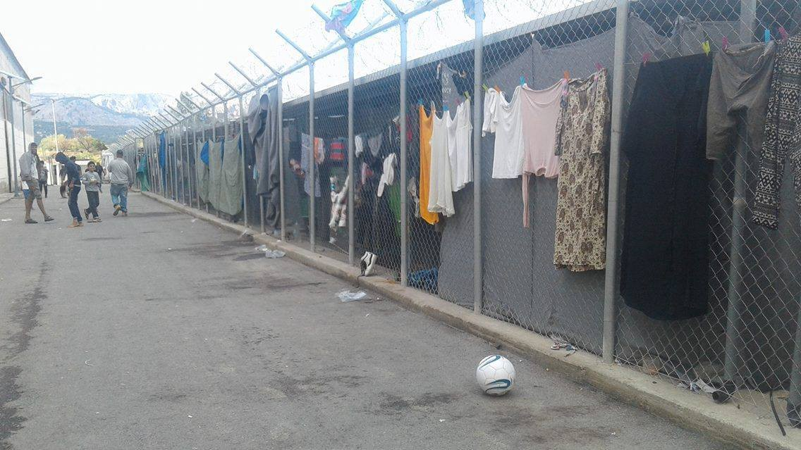
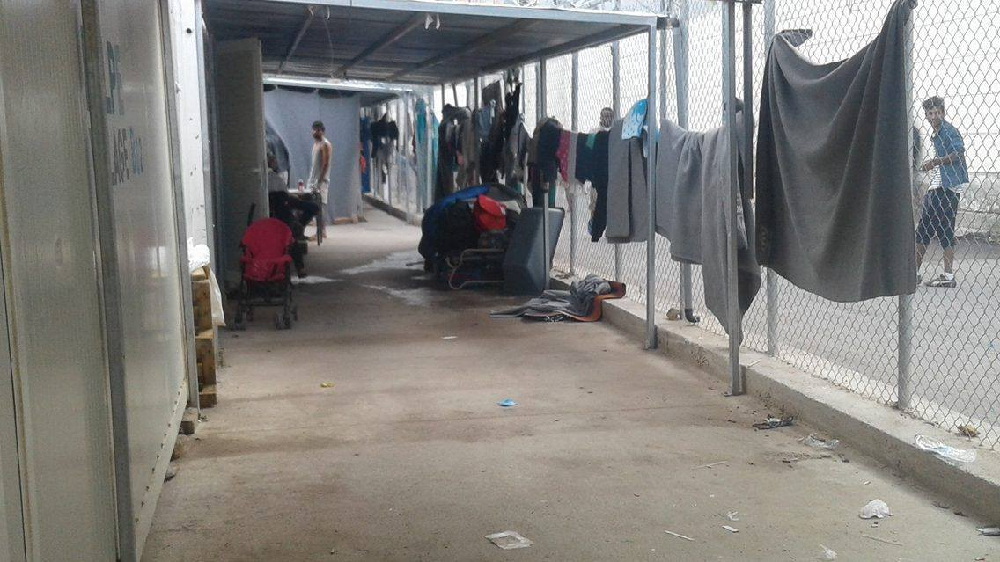
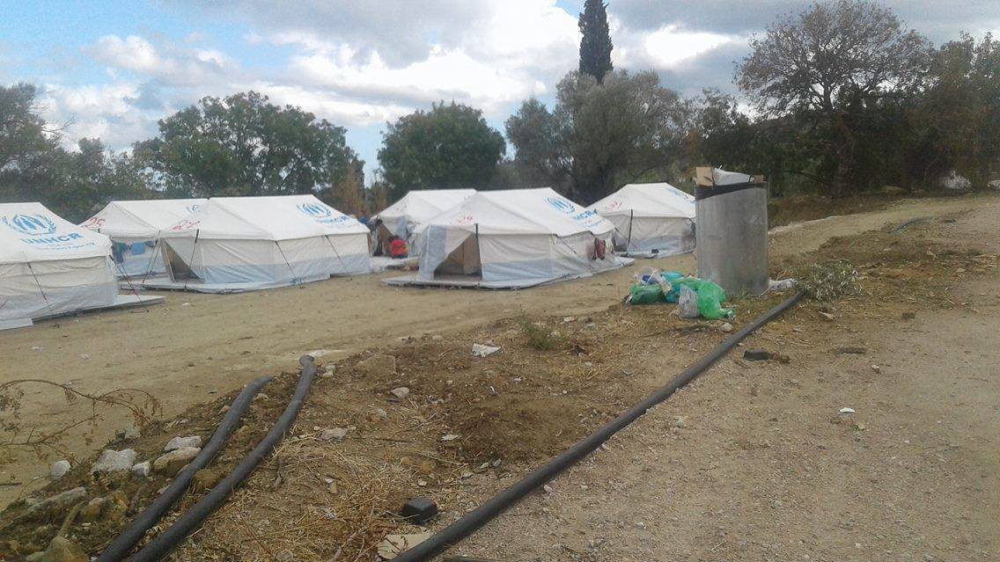
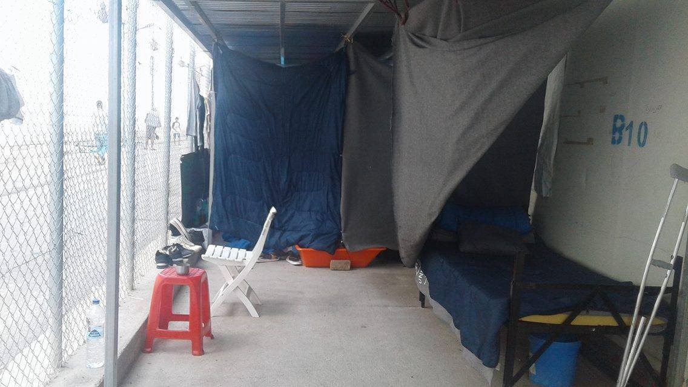
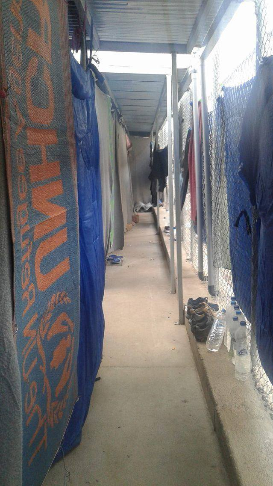
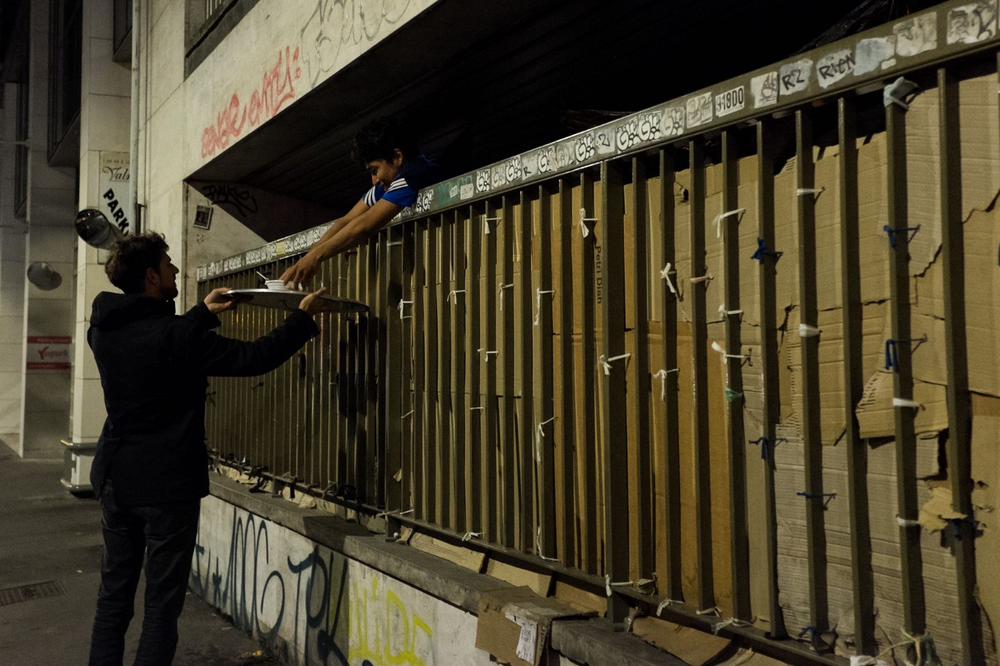
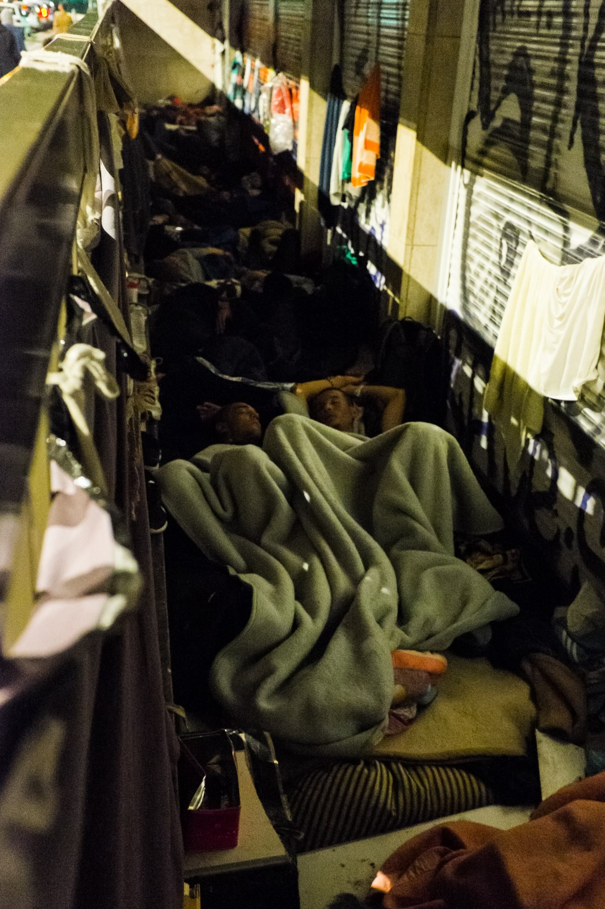
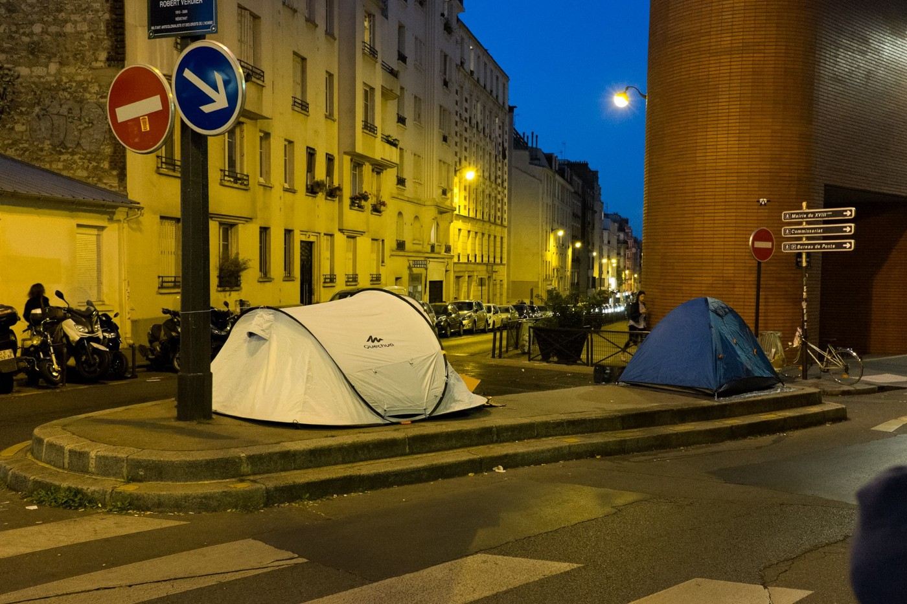
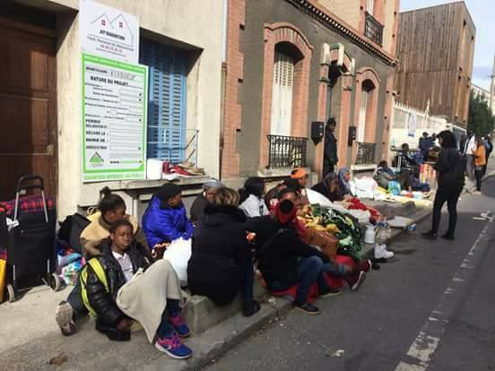
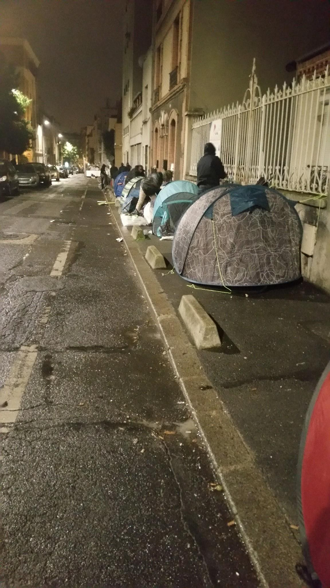

### AYS Daily Digest 17/10/17: November 1 brings hard restrictions for refugees in Austria
#### Difficult situation on the Greek islands finally moves the officials to relocate people to mainland — too slow / Horrible state of the Vial camp ahead of winter / volunteers and aid needed in Greece, Serbia, France / current situation in Croatia / restrictions and hard conditions to be imposed upon refugees in Austria

Vial, Photo: عشتار للهجرة واللجوء
#### FEATURE

Continuing yesterday’s story on the significance for refugees of the newly formed political structure in Austria, we’d like to put attention to the announced restrictive measures that are in plan to be put forth from November on, as compiled by the colleagues from [Border Crossing Spielfeld](https://www.facebook.com/RefugeesSpielfeld/?hc_ref=ARTJoXuMsQM6OMevpSe-ofhmcrI9lurjc2qFy03ME-RPOLhvmolCb2y2cQmRdXuhw9k&fref=nf) :

**No primary care after negative decisions** 
**Failure to actively get involved in leaving the country can lead to fines and imprisonment**

> Persons getting a negative decision on their application to be admitted to an asylum procedure in Austria and at the same time are not granted a suspension, will lose their right to primary care \(this includes food, money, living quarters and medical care\) \. Such care can only be granted after a negative decision if the person\(s\) actively work towards their departure from Austria\. Such active involvement includes making an effort to get travel papers from their country of origin and also showing up at the repatriation advice meeting \(VMÖ\) \. Non\-compliance can lead to a fine of 100 to 1000 Euros and eventually up to 4 weeks of coercive detention\. 

**Pre\-deportation detention — coercive detention — fines**

> As mentioned above, asylum seekers who have been denied must now actively participate in getting their travel papers\. If people actively hinder the authorities in this, they can be detained up to 4 weeks, but later also detained\. Those not detained may be ordered to move to special federal camps to facilitate their deportation when the time comes \(let us not forget that the majority of people do not leave voluntarily\) \. Existing social contacts and networks — be it with family or Austrian friends, schools, non\-urgency medical treatments etc\) are not taken into consideration\. 
 

> Pre\-deportation detention can also be ordered if travel documents, even by a third transit country, are not provided in time\. Under certain circumstances, detention can be prolonged up to 18 months \(even minors can be detained up to 4 months\) \. 
 

> Refusing to leave the country can lead to a 5000–15000 Euro fine, or if payment cannot be made up to 6 weeks in prison\. The same applies to people already deported who illegally re\-enter Austria, in case of repeated offence 6 weeks imprisonment will be imposed\. 

#### IRAQ

[")](https://www.facebook.com/msf.english/videos/10154842229592385/)

#### LIBYA

■■■■■■■■■■■■■■ 
> **[DTM IOM](https://twitter.com/DTM_IOM) @ Twitter Says:** 

> > #Libya Latest emergency response summary. +14,000 migrants affected in aftermath of conflict in #Sabratha [libya.iom.int](http://libya.iom.int) @[IOM_Libya](https://twitter.com/IOM_Libya) https://t.co/qAwmH1G2MQ 

> **Tweeted at [2017-10-16 22:52:35](https://twitter.com/dtm_iom/status/920059927699193856).** 

■■■■■■■■■■■■■■ 

#### SEA

■■■■■■■■■■■■■■ 
> **[MSF Sea](https://twitter.com/MSF_Sea) @ Twitter Says:** 

> > #Aquarius has just taken 111 people on board - including 10 women and two kids. They were rescued earlier today by an Italian naval vessel https://t.co/8ouyaa5CP5 

> **Tweeted at [2017-10-17 17:13:40](https://twitter.com/msf_sea/status/920337024418242563).** 

■■■■■■■■■■■■■■ 

■■■■■■■■■■■■■■ 
> **[MSF Sea](https://twitter.com/MSF_Sea) @ Twitter Says:** 

> > So far this month, 25 boats have arrived on #Lesvos carrying 1188 #people including 472 kids. The Eastern Med route is certainly not closed. https://t.co/t9R7sHGlru 

> **Tweeted at [2017-10-17 13:09:50](https://twitter.com/msf_sea/status/920275664397316096).** 

■■■■■■■■■■■■■■ 

#### GREECE
#### Arrivals and registration

One boat was picked up by Frontex at the North coast of Lesvos carrying 34 people\.

71 people were officially registered today: 35 on Lesvos and 36 on Samos\.
### Chios

_Vial camp ahead of winter conditions\. \._

Photos: عشتار للهجرة واللجوء

Today was one of the busiest days at the Children’s house on Chios\. 
Here is what the volunteers write:

> At the Vial military refugee camp we are told that no\-one is receiving diapers \(more then 2 per day\) \.Nobady provides baby milk clothes or hygiene products \.This creating huge pressure on the Childrens House but we need to help all these lovely families who are trying to survive in very hard conditions\.We give out what we have but we need donations to buy these supplies urgently as we are running out\.We have also been giving mothers a warm winter coat as it can be cold at night in the mountains where Vial is located\. \(…\)
 

> Last year at some NGO’s were giving some basic but this year nobady\. For this reasons our plans and our projects changing and we will continue to help as long as we can but we will try to cover the most urgent needs\. 

### Lesvos

_Photo reports and tweets of the current situation_

■■■■■■■■■■■■■■ 
> **[Giorgos Kosmopoulos](https://twitter.com/GiorgosKosmop) @ Twitter Says:** 

> > The miserable conditions faced by #Refugeesgr in #Lesvos are not a thing of the past but a daily reality. Move people of the islands now https://t.co/eBeJc2fTQT 

> **Tweeted at [2017-10-17 11:48:29](https://twitter.com/giorgoskosmop/status/920255190766321664).** 

■■■■■■■■■■■■■■ 

■■■■■■■■■■■■■■ 
> **[RSA](https://twitter.com/rspaegean) @ Twitter Says:** 

> > Greek gov has initiated transfer operation from overcrowded hot-spots, mostly #Lesvos and #Samos. Many hundreds will be moved to mainland https://t.co/CpY1kY3B7Y 

> **Tweeted at [2017-10-17 10:15:43](https://twitter.com/rspaegean/status/920231844167200768).** 

■■■■■■■■■■■■■■ 

■■■■■■■■■■■■■■ 
> **[Fotini Rantsiou](https://twitter.com/FotiniRantsiou) @ Twitter Says:** 

> > The number of #Refugeesgr transferred @[UNHCRGreece](https://twitter.com/UNHCRGreece) tragically small compared to arrivals and stranded on islands, many without restriction [twitter.com/unhcrgreece/st…](https://twitter.com/unhcrgreece/status/920219330515816449) 

> **Tweeted at [2017-10-17 11:36:33](https://twitter.com/fotinirantsiou/status/920252187778961409).** 

■■■■■■■■■■■■■■ 

■■■■■■■■■■■■■■ 
> **[Lighthouse Relief](https://twitter.com/LighthouseRR) @ Twitter Says:** 

> > The situation for refugees arriving in #Lesvos remains dire - help us make a difference with @[GlobalGiving](https://twitter.com/GlobalGiving): [globalgiving.org/projects/light…](https://www.globalgiving.org/projects/lighthouse-relief/) https://t.co/TRJ1H7f0yG 

> **Tweeted at [2017-10-17 10:29:59](https://twitter.com/lighthouserr/status/920235436324335616).** 

■■■■■■■■■■■■■■ 

### Samos

400 family are in transfer to kavala from Samos \(finally\) \. All pregnant women will be among those who will be transferred in this group\. The camp accommodates now around 350 people and volunteers are saying that the situation is considerably good\. People live in different buildings/warehouses inside the camp\. During the last winter, warehouse with tents was transformed into apartments/studios\. However, it is not clear where people from Samos will go since there is no place for 400 people in existing accommodation\. It does not mean that the situation in Samos is getting any better\. Still overcrowded, with many people sleeping in pop\-up tents outside\.
### Help prepare for winter

METAdrasi is looking for warm jackets for unaccompanied children in Greece\.
If you can bring one or more jackets, in excellent condition, for boys and girls aged 12–17, is kindly asked to bring them \(jackets only, please\! \) to one of METAdrasi’s offices:

Athens \(Tavros\):
25 Martiou 7, 1th floor, near “Kallithea” train station
Monday to Friday 09:00–17:00
Tel: 214 100 8700

Thessaloniki:
Vilara 7, Monday to Friday 10:00–18:00
Tel: 2310 501151
### Translators needed

[InterVolve](https://www.facebook.com/InterVolve-219418945063168/?fref=mentions) urgently needs for Arabic, Sorani, and Kurmanji speakers to join them in Greece\. They need help with interpretation and translation, as well as support in their adult learning programme, community involvement and integration, and to facilitate women’s and children’s activities and distributions\. To apply, please [**go here**](https://docs.google.com/…/1FAIpQLSeGWY9BEeoT48Y3VS…/viewform) \.
### Looking for heaters

Refugees and volunteers are hoping to find individuals, organisations, charities or groups that would be able to fund 20 electric heaters and 10 electric cookers for a camp on the outskirts of Athens\.

> The camp is one hour away from Athens and very remote which can be problematic for the people\. 
 

> The people are in containers and it is becoming increasingly cold so people are struggling\.
 

> The camp hosts 22–25 families at a time, up to 100 people with half the population made up of young children\. There is no NGO’s or ministry support here, it is self organised by residents and we independent volunteers help and do what we can\. 

Please contact [Ruhi](https://www.facebook.com/ruhi.akhtar.7?hc_ref=ARThpOOUK36Xo3VM_k34267LpMVx0T_Y80eI8Pu3We83RIVxGqcJsdEcBHGkIgEh3JY) if you can help out and contribute\.
#### SERBIA
### JRS looking for volunteers

JRS is looking for students willing to join their team and volunteer with the most vulnerable refugee children, unaccompanied minors under the age of 14\. They would be helping the children’s inclusion in the system of formal education and they would hold workshops few times a week\.
Fluency in English is needed and knowledge of another foreign language is a plus, as is the previous experience with children and team spirit\. For more information and applying, please contact: office@jrsserbia\.rs
### Info Park Survey: Why more refugees are going back to Greece?

“Tired of waiting to see any progress in their asylum\-seeking process, including the so\-called Hungarian list, more and more refugees and migrants in Serbia are trying to return to Greece where they hope to find better living conditions and stand a better chance of reaching Western Europe\.”

If you returned to Greece from Serbia, you can share with them your opinions and thoughts in the comments of [this post](https://www.facebook.com/infoparkserbia/posts/1452570228130570?hc_location=ufi) \.
#### CROATIA

There are about 400 asylum seekers currently in Croatian reception centre system, according to the Ministry of interior\. 
17 more deportations have been done lately, resulting in 17 people being pushed back to Croatia, and 3 more are announced\. 
Many unclear issues arise in welcoming and integration, as well as health care of the asylum seekers staying in Porin Reception centre in Zagreb, as the MDM team is formally in the system and in Porin until the end of this month\. The RC team will be assisting with the health issues, with no available doctors in the team, though\. All emergencies are still directed to the ER and to contact the security officers at the facility \(who are not health workers and have no such colleagues present\) \. We hope this problem will be properly addressed and solved in the shortest time period, including the transparency and thorough approach with treating children who potentially might have scabies or any other similar disease that needs serious approach and awareness, not only by the health workers, as some organizations have insinuated, but also by the child’s family\.
#### HUNGARY

“A new trial beginning at the end of this month is the glimmer of hope for a family torn apart by an overzealous prosecutor, acting along the lines of the government’s political messages, which incriminated Ahmed from day one, alleging he was a member of an organized terrorist group forcing the entry of “illegal immigrants” into Hungary\. None of these claims were accepted by the appeals court\.”

> Join [the demonstration](https://www.facebook.com/events/370927790005151/?acontext=%7B%22ref%22%3A%223%22%2C%22ref_newsfeed_story_type%22%3A%22regular%22%2C%22action_history%22%3A%22null%22%7D) in front of the Hungarian Embassy in Vienna on the 27th of October at 11 a\.m\. 

If you can, please help with your donation to relieve some of the financial burden of his family members, to cover lawyer expenses, [MigSzol Csoport](https://www.facebook.com/migszolcsoport/?ref=gs&hc_ref=ARTTOCO30pL181W3CAOY1nYl-VvrzFKMTmznCgkhppYZq3SYONebJSV9UWaaFOAQbZg&fref=gs&hc_location=group) calls\.
#### FRANCE
### Paris

_Since our last visit to Paris last winter the situation hasn’t improved\. It has even become worse\. More people sleep in the streets and are being harassed more frequently by police,_ [Rastplatz](https://www.facebook.com/rastplatz/?ref=gs&hc_ref=ARRn3GZ2ADPBkTCak99j4kJGzI0t2T-TviqamnDyT27fzX3lo1GH_8HfFQT-RFyv0EE&fref=gs&hc_location=group) team reports\.

](assets/119df9001564/1*MObL5vO15g0npM5fI2fXag.jpeg)

Photos: [Rastplatz](https://www.facebook.com/rastplatz/?ref=gs&hc_ref=ARRn3GZ2ADPBkTCak99j4kJGzI0t2T-TviqamnDyT27fzX3lo1GH_8HfFQT-RFyv0EE&fref=gs&hc_location=group)

> Minors are exposed to prostitution, and there is little or no way to control this\. Utopia 56 running big parts of the so called “Humanitarian Center” will end its engagement because of systematic misdirection and discrimination of refugees\. Also because of “torture\-like” practices of repression against refugees in the streets\. 

„ In addition, police repression around the centre has grown more acute\. These past weeks, the police have been waking up the migrants every two hours to make them leave\. This is torture\. Utopia 56 aspires to humanitarian centres that respect the law and where the migrants are truly welcomed\. It’s not the case\.“ — [Utopia56](https://l.facebook.com/l.php?u=http%3A%2F%2Fwww.utopia56.com%2Fen%2Factualite%2Futopia-56-is-leaving-the-paris-humanitarian-center&h=ATO5y2xjK93FiMLrQ0NJAFYh8VkO2v2uFfc0YMLkNRsiCdeVivXUZizWGJrjLHkRoYtBCWX70iSABHCgsJcf8nVzeu5UcXVFn27VbroLUtvaibPklEDNuT5adHwOZUNXui77YfBSvIzXuVmQ_6INQw-GDXw_YHggBnYz8AHo_YgFg8egk3NMXhX0IZRTbSz2EQMW1dmCn4MsEQrezeCE1cY_tiXsnhVJ3Npsa7wSnkzcpP5UWMw8BO23RbKw0RUdH4LPDKjDNI8nps3yHsdY24Uvgg)

Photos: Paris Refugee Ground Support

> **_We strive to echo correct news from the ground through collaboration and fairness\._** 

> **_Every effort has been made to credit organizations and individuals with regard to the supply of information, video, and photo material \(in cases where the source wanted to be accredited\) \. Please notify us regarding corrections\._** 

> **_If there’s anything you want to share or comment, contact us through Facebook or write to: areyousyrious@gmail\.com_** 

_Converted [Medium Post](https://areyousyrious.medium.com/ays-daily-digest-17-10-17-november-1-brings-hard-restrictions-for-refugees-in-austria-119df9001564) by [ZMediumToMarkdown](https://github.com/ZhgChgLi/ZMediumToMarkdown)._
