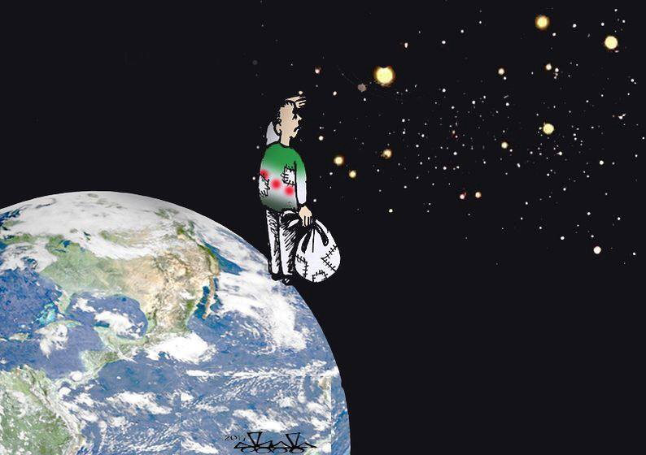
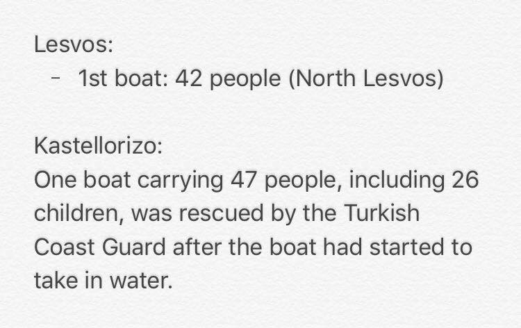
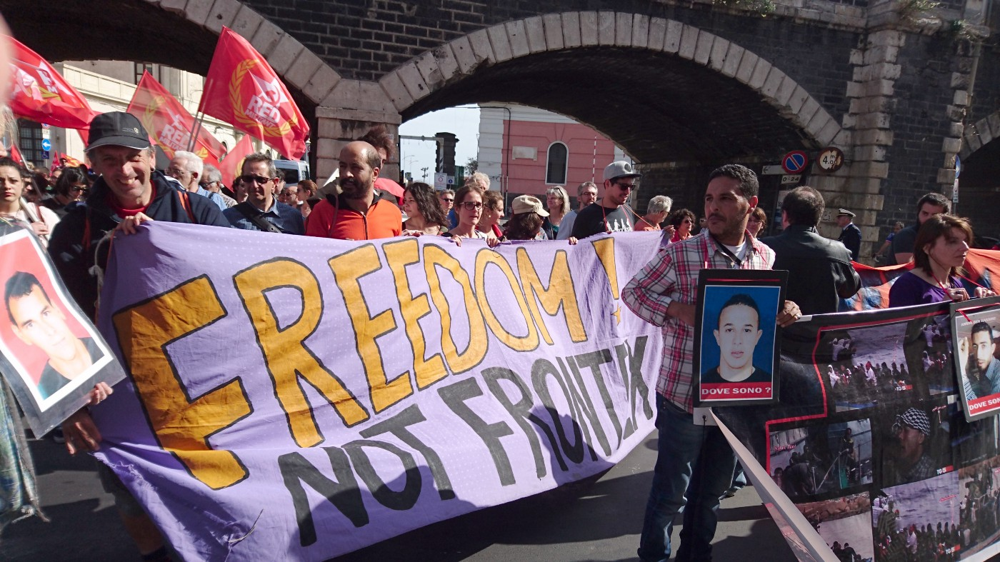
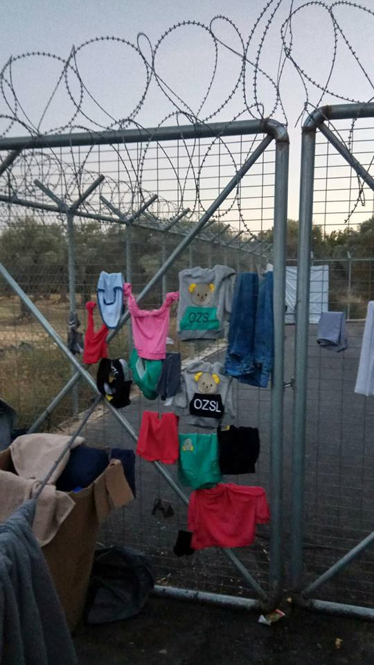
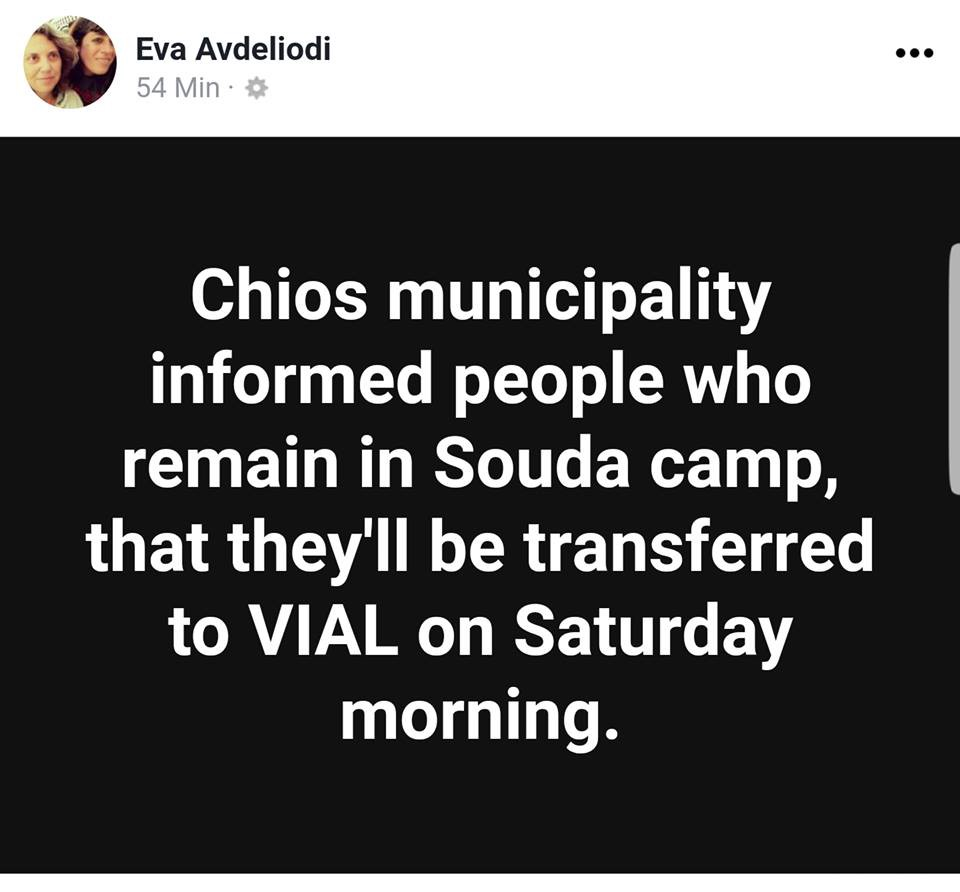
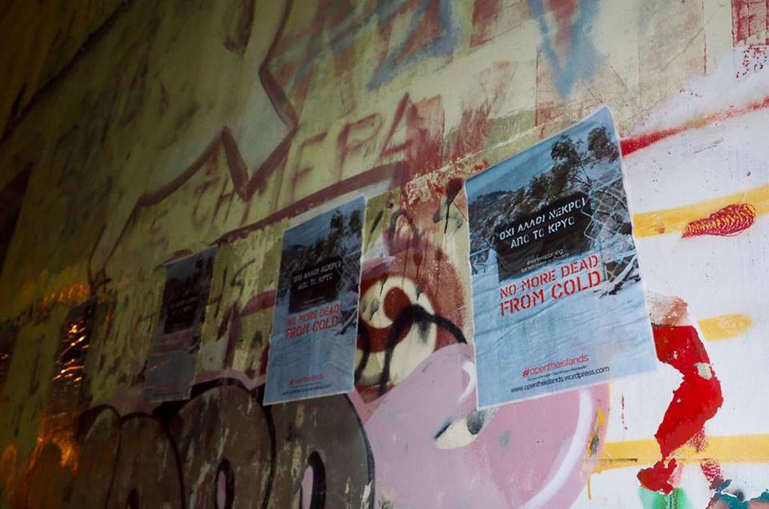
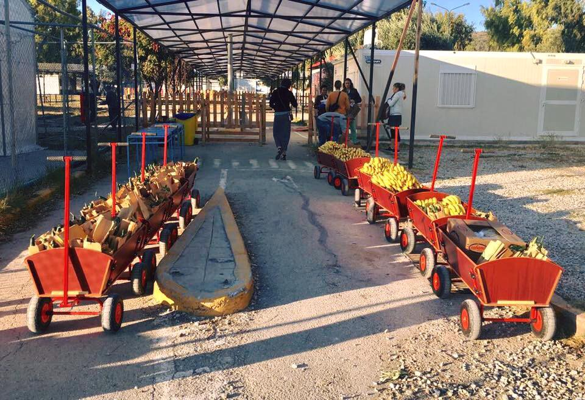
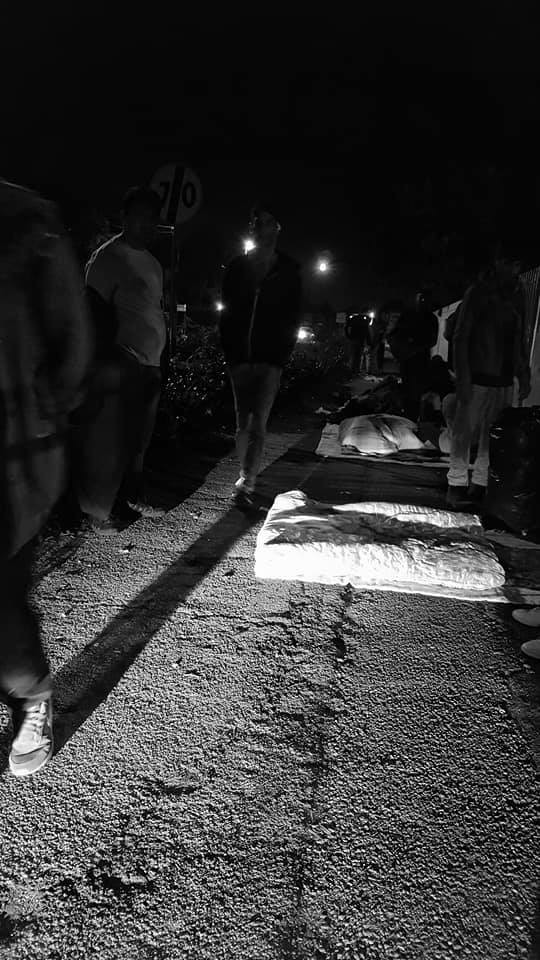
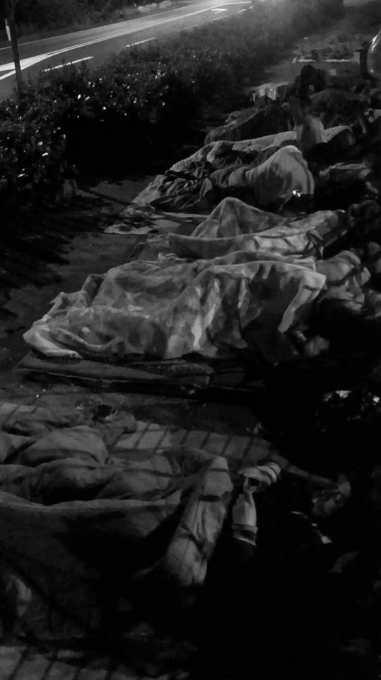
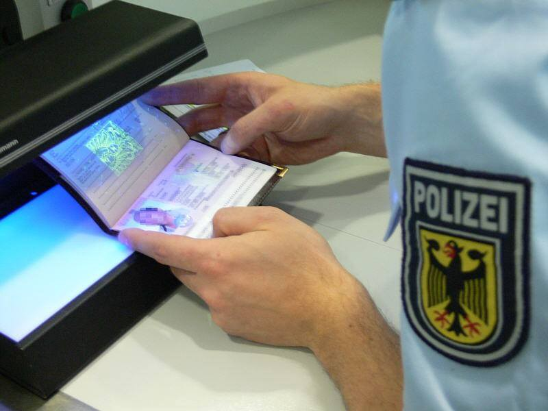

### AYS Daily Digest 18/10/2017 Fortress Europe closes the gates

Update from the Greek Islands and the campaign \#opentheborders /// 111 people rescued yesterday off the Libyan coast /// People sleeping rough in Pordenone /// Refugees on hunger strike in Denmark /// Germany to increase border controls on flights from Greece

Migrant from heart by Hassan Bleibel \(Art against\)
#### Fortress Europe closes the gates

[Statewatch report](http://www.statewatch.org/news/2017/oct/eu-migrant-smuggling-action.htm) that ‘migrant smuggling’ has been put to the top of EU crime priorities, as a restricted document which shows the extent of police operations, has been exposed\. The prevention of ‘immigrants with no legal rights’ \(there is no mention of refugees\) arriving in the EU has been placed as more important than fighting terrorism and online child pornography\. The next cycle covers 2018 to 2021 and the document contains details of their planned actions\. Some of the most concerning points are contained below\.

The document continues the discourse of criminalising migration and by extension impedes the movement of those seeking asylum\. It also clearly states the desire to increase the militarisation of Europe’s borders\.

> OA 2\.6 Operational Action PEGASUS focused on tackling the facilitated irregular migration within air border domain\. 

While at the same time encroaching further into the personal lives of individuals\.

> OA 4\.1 Marriages of convenience: Share data with Europol of cases where there is suspicion of marriage of convenience with OC involvement 

And continuing Europe’s involvement with states known to be perpetrating human rights abuses on a mass scale\.

> OA 5\.1 Network of liaison officers in Libya 

> OA 5\.1 Turkey Organised Immigration Crime Working Group \(TOICWG\) \. Development in capability and capacity of Turkey Organised Immigration Crime Working Group 

The action of crossing a border is itself suggested to be a criminal act\.

> OA 5\.5 Africa Frontex Intelligence Community \(AFIC\) development: The AFIC is a platform for joint analyses and common knowledge sharing with respect to border security, irregular trans\-border movement of people, trans\-border criminality\. 

Which will have consequences for all people who cross borders regardless of the documents they carry\.

> OA 6\.4 Intelligence gathering capacity building at the borders\. 

An infringement on one person’s freedom of movement sets a precedent for further violations of human rights for all and as EU countries continue to strengthen Europe’s internal borders this will and does have repercussions for EU citizens as well\.
#### **Arrivals**

\(Erik Gerhardsson\)

In addition, one boat arrived on Leros today carrying 58 people\.

**Sea**

■■■■■■■■■■■■■■ 
> **[SOS MEDITERRANEE ITA](https://twitter.com/SOSMedItalia) @ Twitter Says:** 

> > #Aquarius domani a Messina: 111 persone a bordo. Svizzera si unisce al network SOS MEDITERRANEE ▶[bit.ly/2l05kHq](http://bit.ly/2l05kHq)  #TogetherForRescue https://t.co/98bF2CIb5b 

> **Tweeted at [2017-10-18 19:47:43](https://twitter.com/sosmeditalia/status/920738179459756040).** 

■■■■■■■■■■■■■■ 

Sos Méditerranée’s Aquarius will disembark 111 people tomorrow in Messina \(Sicily\) rescued yesterday by the Italian Navy\. Among them women, children and several people who were stranded in Libya for months\.

Switzerland will soon join the SOS Méditerranée team in the Mediterranean\.
#### We Sail\!

Maydayterraneo have left for their third volunteer mission to the international waters between Libya and Italy\. To support them or to become a member of their crew look [here](https://www.migranodearena.org/es/reto/15691/may-day-mediterraneo-proemaid--smh/) \.

\(alarmphone\.org\)

Alarm Phone have a released a report, [Developments in the Central Mediterranean over the past two years](https://alarmphone.org/en/2017/10/18/developments-in-the-central-mediterranean-over-the-past-two-years/) , detailing the development of refugee movement and the institutional/governmental mismanagement of this situation since 2015\.

> Most sea crossings by refugees trying to reach Europe take place on the route between Libya and Italy\. Refugees are forced to board overcrowded boats that are not suitable for use at sea, making this route the deadliest\. Without the NGO search and rescue boats \(SAR\-NGOs\) the number of deaths would be far higher because the capacities of the official coast guards are insufficient\. Until recently, the Italian coast guard deliberately stayed away from the Libyan coast and EU forces of Frontex and the military operation EUNAVFOR Med focus their efforts exclusively on reducing the number of crossings by fighting smugglers\. There is no unified Libyan coast guard, only multiple, autonomous formations, of which some even operate as smugglers\. 

#### **Greece**

**Islands**

Vial camp, Chios \(No Borders\)

Chios Solidarity call for an end to the shame which is Vial Camp\! For the full article in Greek go [here](http://www.aplotaria.gr/vial-aisxos/) \. For translation in English go to [No Borders](https://web.facebook.com/nobordersnetwork/posts/1539077302826823?hc_location=ufi) \. They site a lack of sanitation and electricity, inadequate medical care and legal support, overcrowding, unsuitable shelter and a lack of proper care for the children housed there\. As the NGOs have pulled out the promised Government support has not been put in place\.

> The government must now liberate the refugees from Chios and close the shame called VIAL\. The relevant ministries must immediately provide medical assistance and comprehensive legal assistance to the people who “stored” in the VIAL, inside and outside the miserable place, so that they do not see a human eye\. 

> One third of the detained refugees in the Hotspots of the islands are children\. 

> The authorities in VIAL, UNHCR, every competent body must now take measures to make the conditions in VIAL as human only as it exists, otherwise the winter will cost human lives\. 

**Lesvos**

\#opentheislands \(Lesvos Solidarity — Pikpa\)

Pikpa Camp report that around 90 solidarity groups and organisations are now calling to \#opentheislands as winter approaches for refugees in Greece\! Join the movement: [https://opentheislands\.wordpress\.com/](https://opentheislands.wordpress.com/)

No Border Kitchen needs support to continue with their food boxes, cooking and solidarity work\. If you can help there’s more info [here](https://web.facebook.com/NBKLesvos/posts/1022970181176104?hc_location=ufi) \.

Kara Tepe, Lesvos \(Because we carry\)

[Because We Carry](https://web.facebook.com/Becausewecarry/photos/a.391631064368840.1073741828.391316364400310/675973925934551/?type=3&hc_location=ufi) have been giving out breakfasts and welcome packs to new arrivals in Kara Tepe on Lesvos but they are asking for [donations](http://www.becausewecarry.org/en/donate-now/) to continue\.

**Samos**

Samos SOS are calling for an open meeting of residents of Samos on the 22/10/17 at 10\.30am in Pythagoras Square to discuss the problems that residents and refugees are both facing\.

**Mainland**

According to [local media](http://www.ekathimerini.com/222548/article/ekathimerini/news/234-refugees-relocate-from-athens-to-lyon) 234 refugees have been relocated today, from Athens to Lyon, France\. Of those relocated 190 individuals were from Syria, 27 were from Iraq, and 11 were from Palestinian\. So far 22,000 asylum seekers have been relocated from Greece to other European nations and another 5,000 cases are pending\.

Media also [report](http://www.ekathimerini.com/222545/article/ekathimerini/news/greece-to-take-back-dublin-case-by-end-october) that Greece is expected to accept back the first asylum seeker since the reinstatement of the so\-called Dublin Regulation which requires people to make their claim for asylum in their country of entry into Europe\. It is believed that the person will be returned from Germany\. Since 2011 Dublin returns to Greece have been suspended after two judgments by the European Court of Human Rights \(ECHR\) and the Court of Justice of the European Union \(CJEU\) which identified “systemic deficiencies” in the Greek asylum system\. What do they believe has changed?

UNHCR r [eport](https://data2.unhcr.org/en/documents/details/60327) in their weekly accommodation update that between their own accommodation and those that are managed by partner organisations they are only at 88\.4% capacity which equates to at least 2000 empty beds\.

[One Stop](http://steps.org.gr/en/one-stop/) work in solidarity every Wednesday and Sunday afternoon at synAthina, to create a space for anyone that wants to have access to free services and activities that should be given to everyone — first aid, laundry, showers, haircuts, warm food, music, games with the kids, legal advice, supply of important information about human rights\.

City Plaza, who currently house around 400 refugees, 170 of whom are babies and children, have published a new [needs list](http://solidarity2refugees.gr/lista-genikon-anagkon-city-plaza-list-general-needs/) \.

Call out by “Solidarity Farms” of the refugees at Kapareli for people to help in the olive harvest\.

> The olive oil that will be produced will be used to cover the needs of refugees living in squats, apartments, etc\. and social kitchens that cook for local and immigrant homeless and unemployed in Athens\. 

For more info go [here](https://web.facebook.com/groups/AthensVolunteersInformation/permalink/1222965601169068/) \.

[Asylum Links EU](https://web.facebook.com/asylumlinkseu/?fref=gs&hc_location=group) needs ONLINE VOLUNTEER ACTIVISTS for Case Work and Advocacy, to answer questions from refugees and asylum seekers in Europe\. They urgently need volunteers living in Greece\.

> If you have at least 2 hours per week for roughly the next 6 weeks and you are living in Greece, Please Join us, Thank you\! 

Drop in the Ocean need volunteers in Nea Kavala, Northern Greece\. They need support running their freeshop, with distribution of dry food, fresh bread and vegetables, with warehouse work, the laundry service and the flea market\. If you can stay 10 days or more and are above the age of 25, then you can contact them [here](https://www.drapenihavet.no/en/home/) \.

Soul Food Kitchen also need volunteers\. They have a jazzy video [here](https://web.facebook.com/teamphiloxenia/videos/1982667945314254/?hc_location=ufi) \.
#### **Italy**

Pordenone \(photos by Sandra Uselli\)

People on the ground [report](https://web.facebook.com/groups/1834254390190027/permalink/1977368179211980/) that around 60 refugees are sleeping outside in Pordenone, exposed to all weather and often asked to move on by the police\. The wait to be housed in the local ‘hub’ is on average 6 weeks\. There is only one meal a day, provided by the red cross, but it is a 4\.5 kilometre walk\. There is only one medical check offered each week\. People are also arriving from Northern Europe and the Balkans after receiving a rejection\. Further support is needed\.

If you can help, please see the ‘DONAZIONI RICHIESTE\-SUPPLIES NEEDED’ file on the [ITALY — REFUGEE CRISIS DATABASE](https://web.facebook.com/groups/1834254390190027/permalink/1977368179211980/) facebook page\.
#### **Serbia**

**UNHCR report August/September:**

The total observed arrivals increased to 654 in September from 351 in August, with arrivals of unaccompanied/separated children decreasing to 26 in September from 39 in August\. The total occupancy in government centres remained the same at 3,900\. The total \(known\) presence of refugees/migrants/asylum\-seekers dropped to 4,250 from 4,300\.

On the 15th of October, 4,275 new refugees, asylum\-seekers and migrants were counted in Serbia, of which 3,855 were housed in 18 governmental centres\.

> During the week, the authorities closed all remaining temporary emergency shelters \(rub\-halls and tents\) in the TCs of Adasevci, Principovac, Sombor and Kikinda, and relocated all men and boys who had been accommodated therein into more solid long\-term shelters\. Additionally, they transferred some 50 unaccompanied and separated boys, who had been accommodated in Adasevci TC, to Krnjaca Asylum Centre \(AC\) and 112 men and boys who were camping outside centres near Sid to the Presevo Reception Centre \(RC\) \. UNHCR and partners continued assisting high numbers of 244 newly arrived asylum\-seekers \(compared to 272 last week\) \. Sample profiling of a group of 118 new arrivals in Belgrade, showed that 40% were women and children and 60% men, that most fled Iraq \(29%\) or Afghanistan \(24%\) only one\-three weeks ago and reached Serbia through Bulgaria \(59%\) and/or fYR Macedonia \(35%\) \. UNHCR and partners collected testimonies of 104 collective expulsions from Romania, 98 from Hungary and 73 from Croatia, with many alleging to have been denied due access to asylum procedures there and some maltreatment by authorities of these EUMS\. 

#### **Germany**

[Local media](http://www.migazin.de/2017/10/17/verwaltungsgerichtshof-afghanischer-ex-soldat-fluechtling/) report that a German regional court has granted asylum to an Afghan ex\-soldier, thus revoking the findings of a local court\.

The judge granted protection to the man, stating that the claimant could not be expected to take up residence in Kabul with his wife and two young children due to labour\-market, his social network and the safety issues in the province\.

If you are in Germany and have a court case going, you should give this article to your lawyer as the ruling can be used as a precedence\.

[ECADA](https://web.facebook.com/ecada2017/) have expressed their support of the judges ruling\.

> We would like to express our deep respect and gratitude to this judge for being able and willing to assess a situation independently from political will and propaganda\. 

> Herzlichen Dank\! 

According to the [Mobile Info Team](https://web.facebook.com/mobileinfoteam/photos/a.1800063030222418.1073741830.1796286800600041/2048947152000670/?type=3&hc_location=ufi) Germany will increase border controls for flights from Greece until May 2018\.
#### **Belgium**

_Serve the city Brussels_ make and serve breakfast every Monday and Tuesday at Parc Maximilien\. From 6:30am till 8am they provide coffee, tea, some pastries and warm conversations\. If you can help out contact them through their [facebook page](https://www.facebook.com/stcbrussels/posts/1485166384910014) \.

They are also linked with [HÉBERGEMENT PLATEFORME CITOYENNE](https://www.facebook.com/groups/140794776533345/?fref=mentions) who support locals to host refugees at home\. Join their group if you are able to participate\.
#### **France**

[FAST \(First Aid Support Team\)](https://www.facebook.com/groups/FirstAidSupportTeam/permalink/1986147294998444/?hc_location=ufi) are working in Calais and Dunkirk and need medical supplies — Ibuprofen gel, Olbas oil, strepsils, ear drops, anti\-histamines, antacid tablets, lip sore cream, vitamins, Lemsip, saline pods \(10ml\), betadine, athlete’s foot / daktarin / miconazol cream, scabies cream, cotton balls, compression bandages, steristrips\.

> Keep helping the people in Calais and Dunkirk\! 

> If you want to help us by donating please pm Joram Melissant for shipping information and stock keeping\. 

[CalAid](http://calaid.co.uk/) are in need of volunteers\. They are looking for both project managers and general volunteers for their work in Greece\. Email: info@calaid\.co\.uk

Locker room for migrants \(Solidarity St\. Bernard of the Chapel, 12 rue Saint\-Bruno, 75018 Paris / corner rue Saint\-Luc\) have an emergency call for the following items — shampoo, shower gel, soap, toothpaste, toothbrushes, razors, shaving cream, deodorant, body cream, soap for linen, razors and shaving cream, handkerchiefs, women’s sanitary products, diapers for children, socks, boxers, T\-shirts, pants size 38–40, basquettes, shoes size 40–45, trousers 38–46, shorts, belts, backpacks, sleeping bags, winter jackets, chemines and T\-shirts s and m, caps, new women’s underwear, notebooks and pens\.

> Thank you all for your solidarity\! \! \! 

> To deposit donations go to the Locker Room on Wednesday from 15 pm to 18 pm and Saturday and Sunday from 9 pm to 15 pm\. 

#### **Denmark**

There are currently 28 refugees on hunger strike which began on October 11th outside the controversial Deportation Centre Kærshovedgård\. All the hunger strikers have had their asylum rejected but for individual reasons they can also not be deported\. They are trapped in prison\-like conditions in Denmark with no clear end date or process\. The strikers and their demands have the support of a broad range of organisations, amongst them The Danish Helsinki Komitee for Human Rights and Amnesty International\.

> “We’re striking because we don’t know how long we’ll have to stay here\. When someone is given a sentence for a crime, they know when they will get out, but we don’t know for how long we’ll have to stay here, and we haven’t even done anything criminal\.” 

> _Hunger Striker at Kærshovedgaard”_ 

A [press release](https://gatorna.info/threads/aalborg-denmark-hunger-strike-at-the-deportation-c-959/) has been issued on behalf of the hunger strikers, signed by the Network for Contact Persons for Rejected Asylum Seekers at Kærshovedgård, Trampoline House, Welcome To Denmark, The Bridge Radio, Stay Human\-Aalborg, Solidarity Project Aarhus, Black Lives Matter Denmark and Freedom of Movements\.

> “Close the camp\! We are humans, just like you\!“ 

#### **General**

UNICEF have released a new report — [Refugee and Migrant Crisis in Europe: Regional Humanitarian Situation Report \#25](https://reliefweb.int/report/greece/unicef-refugee-and-migrant-crisis-europe-regional-humanitarian-situation-report-25) , July — September 2017\.

> Situation in Numbers 

> 138,360 \# of arrivals in Europe through Italy, Greece, Spain and Bulgaria in January\-September 2017 \(UNHCR, 9 October 2017\) 

> 1 in 6 of all arrivals in January\-September 2017 are children \(UNHCR, 9 October 2017\) 

> 116,790 \# of child asylum\-seekers in Europe between January and August 2017 \(Eurostat, 9 October 2017\) 

> 20,850 \# of estimated stranded children in Greece, Bulgaria, the former Yugoslav Republic of Macedonia, Serbia, Croatia and Slovenia in September 2017 \(UNICEF, 13 October 2017\) 

> 7,774 \# of children relocated from Greece and Italy under the EU relocation scheme by mid\-September 2017–6,972 from Greece and 802 from Italy\. \(IOM, Italian MoI, 18 September 2017\) 

They also report that, since the decrease in numbers of people arriving by sea to Italy, potentially new migration routes have appeared through the Western Mediterranean\. 8,558 refugees and migrants, of which about 8 per cent were children, took this route between June and August 2017\. Nearly 500 refugees and migrants, many of whom were children, arrived from Turkey to Romania through the Black Sea, in just a few weeks, at the end of the summer of 2017\.

> **_We strive to echo correct news from the ground through collaboration and fairness, so let us know if something you read here isn’t right\._** 

> **_If there’s anything you want to share, contact us on Facebook or write to: areyousyrious@gmail\.com\._** 

_Converted [Medium Post](https://areyousyrious.medium.com/ays-daily-digest-18-10-2017-fortress-europe-closes-the-gates-8c4c70d7dcfc) by [ZMediumToMarkdown](https://github.com/ZhgChgLi/ZMediumToMarkdown)._
