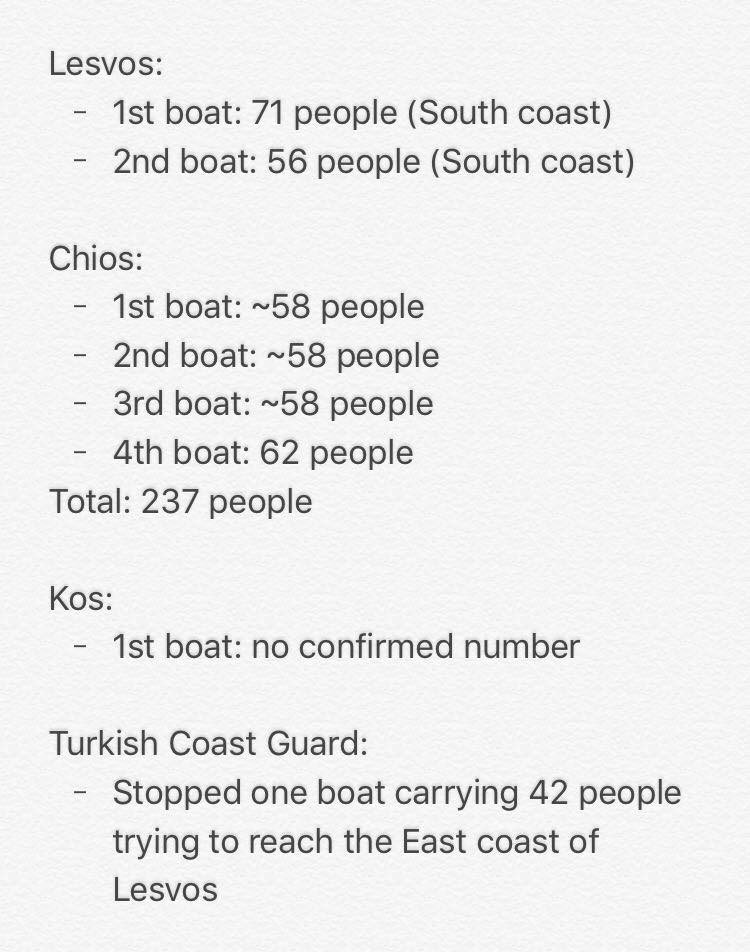
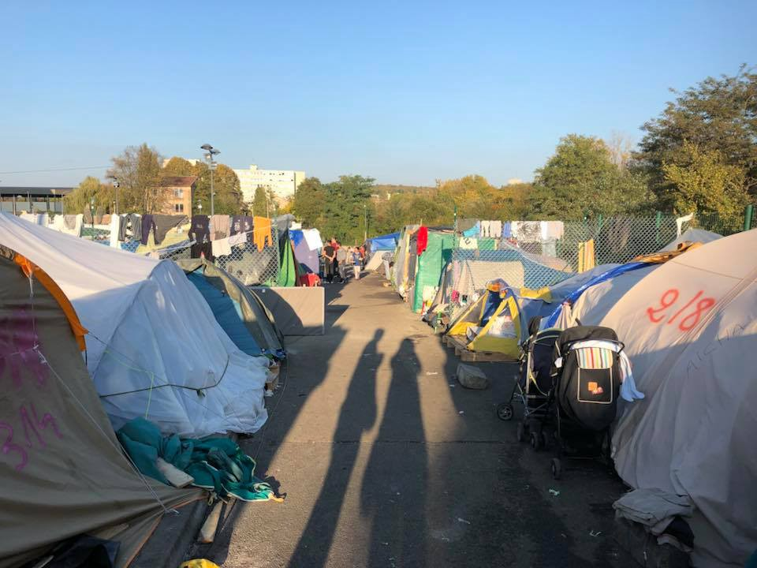
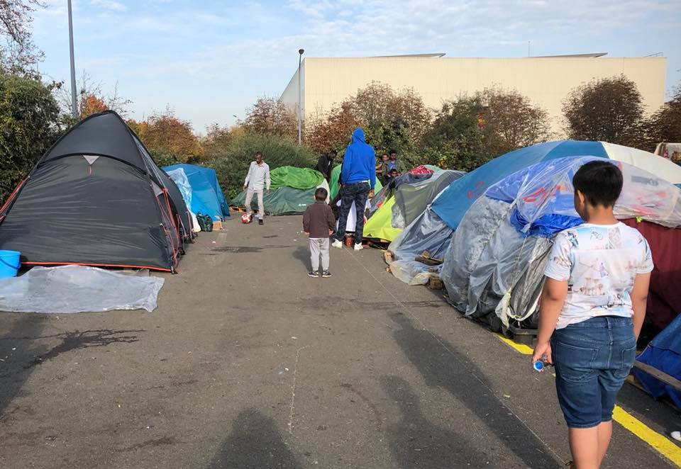
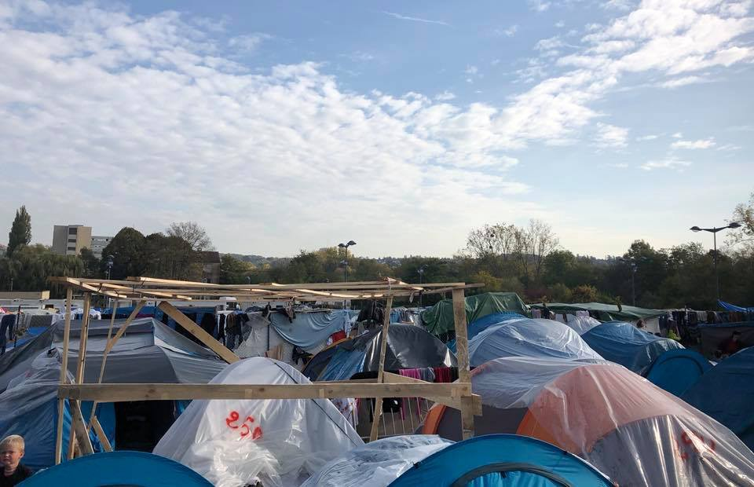

### AYS Daily Digest 19/10/17: Proposal for a new Dublin regulation

_New asylum policy proposal passed to the EU Council / Efforts to close the sea route from Libya / Sunken boat found in the Mediterranean / Seven boat arrivals to the Greek islands / Dunkirk area camp evicted / And more news…_

**“** Only today 237 refugees arrived on 4 rubber boats to Chios\! The “Hot Spot” Vial has no capacity anymore and the people are facing an inhumane treatment\. Either they remain on the streets or in very poor tents while the winter season is coming soon\! **”** — Refugee Law Clinics Abroad in Chios
#### FEATURE: Proposal for a new Dublin regulation

The European Parliament’s Committee on Civil Liberties \(LIBE\) adopted by a large majority the [Wikström report](http://alde.eu/en/news/860-reform-of-eu-asylum-system-wikstrom-proposes-permanent-relocation-system-based-on-fairness-and-solidarity/) on the reform of the EU asylum system today and passed its proposals for a new Dublin Regulation to the Parliament\. “Maintaining the status quo is no longer an option: we simply have to accept that the current system does not work” [stated](http://www.europarl.europa.eu/the-president/en/newsroom/speech-by-the-president-of-the-european-parliament-antonio-tajani-to-the-european-council-meeting-on-19-october-2017) EP President Antonio Tajani, deeming the Dublin Regulation system “unfair and ineffective”\.

The key principles of the draft report are that all member states must participate and share responsibility, reducing the disproportionate burden on “frontline” member states, improving security measures, registering all asylum seekers upon arrival and faster procedures on both asylum and returns\.

The new proposal asks for the first countries of arrival no longer to be automatically responsible for the asylum seekers\. Instead, the assignment of responsibility would be based on “genuine links” to a member state, such as family, prior residence or studies [EP’s press release](http://www.europarl.europa.eu/news/en/press-room/20171016IPR86161/all-eu-countries-must-take-their-fair-share-of-asylum-seekers) reads\. In order to disburden countries that are first on the line of new arrivals, mainly Greece and Italy, asylum seekers would be assigned to an EU member state based on a permanent and automatic resettlement mechanism\. Furthermore, for the first time the family bonds are considered, with a stretch of the concept of family \(siblings and adult sons living with the parents\) and the concept of significant bond is introduced as well\. This means that if a person has attended a school in a country, or he/she has had previous stays in that country, then this person can actually ask to be shifted there\. Finally, the sponsor system is introduced\. Access to EU funds could possibly be restricted to countries who wouldn’t oblige\.

Gianfranco Schiavone, expert of the asylum European law and vice president of Asgi [mentioned](https://www.internazionale.it/bloc-notes/annalisa-camilli/2017/10/19/amp/migranti-regolamento-di-dublino-riforma) some negative elements, related to minors\. “This new approach foresees that the minors would also be subject to this sharing, not considering the first place the minor has reached: the risk is to move them from one country to another, while the Court of Justice reminded us that the minors’ movements should be limited as much as possible”\.

The proposal has now been passed to the EU Council, but it is still far from coming into practice\. The plenary will now be asked to formally confirm the decision by the Committee to enter into negotiations during its November session in Strasbourg\. Find more in detail on the EU asylum policy [here](http://www.europarl.europa.eu/pdfs/news/expert/background/20171019BKG86403/20171019BKG86403_en.pdf) \.
#### Efforts to close the Central Mediterranean route

European Council president Donald Tusk agreed to offer Italy more help with Libya in shutting down the migrant sea route by stepping up financial contributions to a special fund for northern Africa, EU Observer [reports](https://euobserver.com/migration/139553) \. Flows from Libya have reduced by some 70 percent since last year, but the route across the Mediterranean is also far more deadly\. IOM estimates at least one in 50 die in the attempt, compared to one in 90 one year ago, as the EU\-trained Libyan coastguard become more aggressive in their tactics against NGO rescue boats, Observer writes\.
### SEA

A sunken boat was found in the Mediterranean, judging by size around 100 people could have drowned\. So far blue fuel containers and personal clothes have been found but no bodies or life jackets, [MISSION LIFELINE](https://twitter.com/SEENOTRETTUNG) wrote\. Their search is still ongoing in cooperation with Italian authorities\.

Photos by Rebecca Kupfner
### GREECE

A group of 234 refugees boarded a charter flight from Athens to Lyon, France on Wednesday as part of the European Union’s relocation program, while dozens more migrants, deemed to belong to vulnerable groups, were transferred by ferry from the islands of the Aegean to mainland Greece, ekathimerini [writes](http://www.ekathimerini.com/222576/article/ekathimerini/news/refugees-relocated-others-go-to-mainland) \. Atotal of 22,000 asylum seekers have been relocated from Greece to other European nations over the past year and a half, mainly France and Germany, while another 5,000 resettlements are pending\.

Authorities have started transferring members of vulnerable groups, such as unaccompanied minors, pregnant women and the elderly, to reception facilities on the mainland in a bid to ease pressure on overcrowded centers on the islands\. On Tuesday night a ferry brought 107 people to Piraeus from the islands and yesterday morning another 67 were moved to Kavala\. Authorities plan to move 2,000 people to the mainland in the coming week, 1,000 of whom from Lesvos, ekathimerini [writes](http://www.ekathimerini.com/222576/article/ekathimerini/news/refugees-relocated-others-go-to-mainland) \.

Epanomi shelter will officially close on 15\.11\.17, UNHCR has informed the community accordingly\. From this week on, every Friday 50 people will be moved to urban accommodation in Northern Greece, Athens and Crete\.
#### Aegean islands

7 boats arrived to the Greek islands so far today\. 4 of them arrived on Chios with 236 people\.

The only available accommodation, if they are lucky, are tents outside the Vial hotspot, with no electricity, no heat, no running water, no protection from the elements, from snakes or insects \(two scorpion bites recorded so far\) or from antagonistic residents of the nearby village that have held anti\-refugee protests before, local source writes\. Bus service into town is dramatically reduced, leaving them cut off from resources and services\. Occupants of the last boat, 64 people, will spend the night at the port hut\.

In Kara Tepe, the ISO boxes, which do have heaters, cannot use the heaters because the substation can’t supply enough electricity\. Fire broke out very close to a camp on Samos today, luckily no one was hurt\.

Tensions rise in overcapacitated reception centers as dozens continue to land daily\. A total of 438 people arrived on the islands aboard smuggling boats from Turkey in the first three days of the week, with another 175 people arriving on the islet of Oinousses yesterday morning\. They were transferred to a center on Chios which is very cramped with 1,600 people living in facilities designed to host 850\. On Samos, a reception center designed to host 700 people is now accommodating 2,850, ekathimerini [writes](http://www.ekathimerini.com/222613/article/ekathimerini/news/tensions-rise-on-aegean-islands-as-migrants-continue-to-arrive) \.

Today’s arrivals
### ITALY
#### Rome

Piazzale Maslax, Saturday, 21\.10\. at 12\.30h

This Saturday Baobab Experience will meet in the square with the migrants of the humanitarian spot of Piazzale Maslax\. They will walk the city centre streets, touching base in symbolic places like Piazza Indipendenza and Piazza Vittorio, ending with joining the national manifestation against racism at 14\.30h at Piazza della Repubblica\. Follow the event [here](https://www.facebook.com/events/281944142306771??ti=ia) \.

On 21 October in Rovereto \(TN\), the construction of the structure Hospital\(ity\) will take place, a project within the campaign Overthefortress and promoted by Collettivo Mamadou in Bolzano, Brave New Alps in Rovereto and Area 527 in Venice\. Hospital\(ity\) is not just a structure, but a symbol of a migrant architecture, mixed, bottom\-up, the condensation of daily fights, antiracism and freedom, Melting Pot [writes](http://www.meltingpot.org/Hospital-ity-una-struttura-polifunzionale-per-il-ghetto-di.html#.WekOMVuCy01) \. The structure, once completed with the support of the volunteers, will be transported to Rosarno \(RC\) and incepted in one of the many ghettos inhabited by the African agricultural workers\. It will turn into a school spot and health spot, with the support of some associations already working in the field\. Contact Collettivo Mamadou if you wish to participate \[collettivomamadou@gmail\.com or through their [facebook](https://www.facebook.com/Collettivo-Mamadou-1711634685756321/) page\] \.
#### Gorizia

Report by Umino on the current situation in the north of Italy:

### FRANCE
#### Dunkirk/Grande\-Synthe

Early this morning the French authorities evicted the camp at Grande Synthe in the Dunkirk area\. The families were once again driven out and intimidated into boarding buses headed to an unknown destination\. Small makeshift camps like that pictured were forcibly vacated, with people then being denied access to recover their belongings, Mobile Refugee Support writes\. The last time people where moved near the border with Spain to make their way back\.
#### Metz

Care4Calais report from a camp at Metz, France, near the border with Germany\. There are currently around 400 refugees living there, including a great many families, they [write](https://www.facebook.com/care4calais/photos/pcb.1699050490127901/1699049156794701/?type=3&theater) \. The living conditions are similar to the Calais jungle just before it closed\. Most people are in tents, with pallets often used to keep these off the ground\. Many people have cooking facilities and there are limited shared showers and toilets available\. Nearly everyone they spoke to was hoping to claim asylum in France\. There is a pervasive rumor that the camp is to be cleared around mid November\. It seems that this has happened before, but that it re\-emerges in the same way that the Dunkirk camp seems to, they added\.

](assets/b849e4788988/1*B38x56au4bmzL-41JMemjQ.jpeg)

Photos from [Care4Calais](https://www.facebook.com/care4calais/)
### SWEDEN

By the end of September a young boy committed suicide after a decision about deportation back to Afghanistan\. The Migration Agency today said that they regret the decision and admitted that it was wrong, Swedish paper Dagens Nyheter [writes](https://www.dn.se/nyheter/sverige/migrationsverket-efter-sjalvmord-bedomningen-var-fel/) \. The mentioned case was about two brothers, 15 and 18 years old, whereas the older one that committed suicide was almost blind\. In the previous decision the court ruled that the younger brother, a minor, could be deported and referred to his older brother as someone that could take care of him after the return\. Regardless of the fact that the younger brother due to his older brothers bad eye sight took care of him instead of the other way around\.

Fredrik Beijer, head of legal issues \(“rättschef”\) at the agency said that their process is such that a decision should be able to be reevaluated and changed, but in this specific case there unfortunately wasn’t enough time\. After the older brothers suicide the younger one was granted permanent residency since there was no one left to take care of him in Afghanistan\. Fredrik Beijer also says that it was wrong of them to judge the older brother as enough and capable to care for the minor\.

> **_We strive to echo correct news from the ground through collaboration and fairness, so let us know if something you read here isn’t right\._** 

> **_If there’s anything you want to share, contact us on Facebook or write to: areyousyrious@gmail\.com\._** 

_Converted [Medium Post](https://areyousyrious.medium.com/ays-daily-digest-19-10-2017-proposal-for-a-new-dublin-regulation-b849e4788988) by [ZMediumToMarkdown](https://github.com/ZhgChgLi/ZMediumToMarkdown)._
