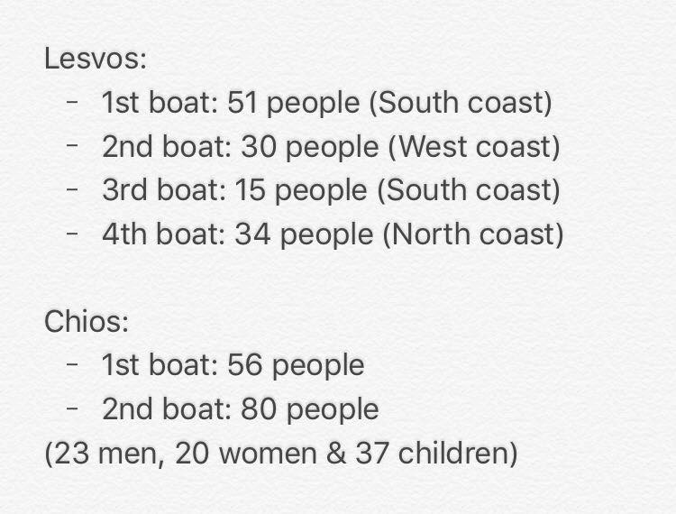
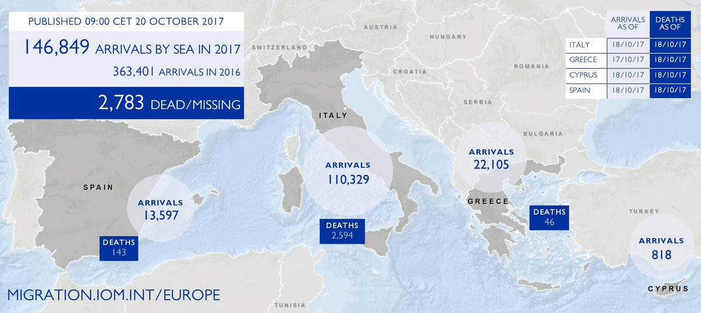

### AYS Daily Digest 20/10/2017: High tension on Greek islands\. \. continues

Refugees sleeping at the ports again // Protests on Lesvos and Chios // Volunteers needed on the islands // UNHCR failed refugees on trial // Almost 900 refugees reach Italy in 4 days // France speeding up deportations // Many on the streets in Paris // EU wants more money for borders // and more

](assets/764af48ba44/1*iJDu1rf205TI75abmx2UAA.jpeg)

Picture by [**Art Against**](https://www.facebook.com/artagainstproject/?hc_ref=ARTKTi3R5lcOijpIfHxolno1nNChQhQVf9agyo5zcmOTJv4hYvJjO-YhxwCcu2-RDgs&fref=nf)
### Feature

The last few months since the summer started have seen a new surge of arrivals on the Greek islands which has only worsened the situation since there is really no preparation for the increasing numbers apart from some transfers to the mainland\. Today, we saw again a huge number of arrivals, mainly on Chios where in the last 48 hours around 400 people arrived\. Lesvos has also seen many arrivals today and already high tensions have escalated further\. On both islands there were protests today that turned violent on occasion, a common situation that has been happening for too long\.

Continuing the trend of high numbers of arrivals, today Chios saw two boats arriving, the first with 56 people and the second with 80 \(23 men, 20 women and 37 children\), making 136 in total\. In the last two days, more that 400 refugees have arrived on the island, and with the all the space taken already there is little option for the newcomers other than trying to find a place around the premises of VIAL or somewhere else on the street\. Volunteers report that there are so many refugees on the island now that more than 100 will have to sleep at the port, a situation that has not been seen since shortly after the EU\-Turkey agreement came into force\.

](assets/764af48ba44/1*C-BADYRwBsaFqASIHaqqpw.jpeg)

New arrivals on Chios — [**FEOX rescue team**](https://www.facebook.com/FEOX-rescue-team-1584119558539350/?hc_ref=ART9DLbbYM4W4vu0ElAXteYzfwNjkip5UfVxqK3B36hcw2hIt68aZNP4suzt7tYrvK0)

> VIAL can not afford an extra charge\. The boats began to unload hundreds of refugees, and Chios was called upon to resume spring conditions in 2016 when, as a last resort, refugees and immigrants were kept in the guarded\-area dock areas of the capital’s harbor\. They even proceeded to block the harbor, hindering the mooring of ships, in protest at their conditions of residence\. 

> Since yesterday evening in the port and in the area around the Port Authority, refugees — mainly mothers with babies and children — have begun to flood the harbor\. From yesterday to today, in different places on the island \(Inousses — Grida — Agia Ermioni\), a total of 377 immigrants and refugees have disembarked\. This figure cannot be absorbed by the already expanded VIAL\. and if there are no direct promotional procedures on the mainland, the island is at risk of new suffocation conditions\. 

> “It is quite clear that the refugees are regulated exclusively by Turkey,” said the port guards, referring to the newly arrived refugees\. The political leadership of the site, having allowed the problem to swell in line with the weather, and at risk of being reputed as a co\-owner with the government and UNHCR, puts its hopes on government initiatives announced on Monday by the Political Council, with credible sources to reassure that the government, at the highest level, is beginning to understand the problem that is being created on the islands and may announce initiatives to relieve it\. 

The [Greek reporter](http://greece.greekreporter.com/2017/10/20/port-of-greek-island-of-chios-becomes-makeshift-migrant-camp-photos/) also writes about the situation at the main port of the island comparing it to what it used to be like last year when the route was officially open\.

The high tensions on VIAL, the hotspot on the island, also led to a protest around the compound\.

On Lesvos, the situation escalated even more and riots erupted in Moria, resulting in the evacuation of NGO personnel\. It was a tense night in Moria and there are reports of people gathering around EASO offices and fights between Syrians and Afghans during the night\.

 ‎**](assets/764af48ba44/1*s9UonzvWxqFC1amyY9S9LA.jpeg)

Photo by **‎ [Mehdi Shams](https://www.facebook.com/profile.php?id=100009192213736&hc_ref=ARQLBIG-AIcEjc4HIdvQ7hZqodAbikRFIMyKHBvF6gHs4XHvMTrGzqP_3uEbmpgGP9k&fref=nf) ‎**

This morning, unfortunately, an Iraqi man was reported dead after having a heart attack but this has not been confirmed as being related to the riots\. There are, however, reports of many others being injured during the day\. This situation has dragged on for too long on the island and the new surge of arrivals this summer has only made it worse\. Despite the government’s efforts to relieve the pressure there by transferring some people to the mainland, the level of arrivals is still making the numbers rise and the conditions can only deteriorate\. Reportedly, the asylum services haven’t been working on the site for days and the announced decongestion of the island is taking too long\. At the moment there are thousands of refugees waiting for the blue stamp that allows them to travel on to Athens\.

There are hundreds of refugees, including women and children, in the fields around Moria\. According to official data, 5,500 refugees and immigrants are staying in the camp while the infrastructure can support only 2,500 people\.

The situation is explosive not only in Moria but also on the whole of Lesvos, where people are currently trapped waiting for the asylum applications they have submitted to be processed\. There are now more than 7\.5 thousand people, a record number since the signing of the EU\-Turkey agreement in March 2016\. During the visit of Immigration official Miltiadis Klapas and Andreas Gougoulis to Moria on Wednesday it was decided that by the end of October 1,500 people should leave the island\. Over the past few days, approximately 300 people have been transferred from Moria\. The first destination for people leaving Moria is Attica, and from there the rest of Greece\.

The situation in Moria is expected to be better when a large part of the camp currently occupied by the asylum service is emptied after the service moves to another building\. The building infrastructure of the asylum service is expected to house more than 500 people\.

At the beginning of the month and after nine days of on\-site evaluation, representatives of Human Rights Watch appeared in the Greek Parliament and described Moria’s hell\.

> “It’s the worst I’ve seen and I’ve been through war” 

> “Moria is a concentration camp\. A camp with a crowd of thousands of people\. What we saw in Moria is an urgent situation\. It’s the worst I’ve ever seen and I’ve had a war,” said researcher Emina Tserimovits \(who has also been a refugee herself\), capturing what she experienced in the hotspot of Mytilene\. 

> The report spoke of everyday fights, inappropriate scenes with flooding as soon as it started to rain, inadequate heating, lack of water and battles among young children for a bottle, as well as showers with unbearable conditions due to the stench of urine and faeces\. 

> In particular, Mrs\. Tserimovic stressed that there is no water in Moria and people have access to water only three times a day for 30–40 minutes\. 

> “There is no hot water\. We saw the water and little children, four years of age and up, running barefoot on the rocky ground with bottles in their hands trying to fill them up and fight for the water with 4,000 other people\.” 

> “We had a meeting with a counselor of the Minister for Immigration Policy and eventually met with a gentleman who could not give us an answer about the government’s plans for the winter, and the UNHCR told us that the government was responsible for it,” said Eva Kosse \. 

> She also argued that “European officials are losing their heads and are not interested in these people” 

It seems that there are some signs of will to transfer refugees to the mainland and make the islands, at least Lesvos, less congested, but with so many arrivals this move might ultimately not be enough\. Either way, we will soon know if there is actually a new policy to protect refugees in Greece or if everything will stay just as it was\.
### Turkey

A new report describes the conditions refugees face when they are sent back to Turkey\. The report, based on the information gathered, highlights several problematic examples of serious human rights violations in Turkey\. For example, migrants in detention in Turkey find it difficult, in practice, to access international protection\. Most detainees are subject to infringements of procedural rights, which might lead to violations of the principle of non\-refoulement\. Research also underlines that readmitted Syrian and non\-Syrian nationals are subject to arbitrary detention, while recent changes in asylum legislation in Turkey put asylum seekers at risk of deportation to their country of origin without juridical review, which effectively undermines the international protection mechanism\. You can read the full report [here](https://www.law.ox.ac.uk/research-subject-groups/centre-criminology/centreborder-criminologies/blog/2017/10/returned-and-lost) \.
### Greece

Today it has been a very complicated day on the Greek islands, as reported above, with so many refugees continuing to arrive\. The breakdown of the arrivals for today is:

The registrations for today published by the government, which correspond generally to the previous day’s arrivals, are:

Lesvos: 127 → more than 8200 this year and 1400 this month
Chios: 237
Kos 1
Total: 365

Transfers to the mainland \(total\): 54 \(the day before 246\)

There are reports also of 20 refugees being sent back to Turkey today\.

](assets/764af48ba44/1*I9b43amIyQeFLuaY6P3K6A.png)

[**Help Refugees**](https://www.facebook.com/HelpRefugeesUK/)

Today the Greek prime minister, Alexis Tsipras, proposed five measures to the other European leaders to reduce the levels of arrivals in Europe \(Greece\) \. He was speaking of the recent increase in refugee flows in the Aegean and he stressed the need to strengthen the EU\-Turkey deal with five additional measures that will address the problem in a comprehensive manner, the Greek Reporter tells:
1. A European mechanism for resettlement of refugees from third countries to the EU with the operation of central asylum services in third countries\.
2. A European mechanism for returns of refugees to countries of origin or transit\.
3. A funding mechanism for refugees in Turkey and examining possibilities of strengthening it\.
4. Implementation of the readmission agreement signed by Turkey\.
5. A long\-term plan to improve living conditions in countries such as Iraq, Afghanistan, Pakistan and Bangladesh\.

All of them apart from the last, although insufficient, are based on repressive measures and promote detention of refugees in real terms\. They have also proven not to work very well for lack of resources or because they depend too much on volatile politics\.

Due to the situation on the islands, an increasing amount of work is needed to support refugees there, so various groups are already asking for help to be able to cope and continue to give a good response and to be able to help refugees when they arrive in Greece\.

[Chios Eastern Shore Response Team — CESRT](https://www.facebook.com/chiosesrt/?ref=gs&fref=gs&dti=228469170832717&hc_location=group) needs volunteers to support landings, distribution, the warehouse, the Children’s House and all other activities\. If you can volunteer for 14 days or more please contact CESRT via their fb page\.

[FEOX rescue team](https://www.facebook.com/FEOX-rescue-team-1584119558539350/) is another group helping on Chios and they also need more volunteers:

**RSA** \(Refugee Support Aegean\) has issued a statement saying that UNHCR failed to stand up for refugees’ rights during what they call the EU\-Turkey deal judgment\.

On 22 September 2017, the Council of State ruled against applications by two Syrian male asylum\-seekers challenging the negative decisions by one of Greece’s Asylum Appeals Committees that considered Turkey a ‘safe third country’ for them\. According to this organisation, the result of the trial was highly influenced by two letters from UNHCR that were used as key evidence showing that Turkey fulfilled criteria of a safe third country\. A letter issued later on recognises, however, that the agency does not have access to asylum\-seekers returned to Turkey under the deal and cannot verify or monitor their status and treatment by Turkish authorities in the majority of concerned cases\. The trial ended with the rejection of the appeal and the ruling that the two refugees involved should be sent back to Turkey\. The full report can be read [here](http://rsaegean.org/legal-note-unhcr-has-failed-to-stand-up-for-refugee-rights-during-crucial-eu-turkey-deal-judgement/) \.
### Sea

Thirty\-four illegal migrants were intercepted by the Portuguese navy’s Viana do Castelo when they made the sea crossing between Tunisia and Italy\.

“The vessel had on board 32 Tunisians and two Algerians, all men,” the Navy said in a statement explaining that the Portuguese navy’s patrol vessel is involved in the Triton operation, coordinated by the European agency FRONTEX\. The Portuguese ship accompanied the migrant vessel to Italian territorial waters, and the migrants refused aid when questioned by the commander of the ship\.

About yesterday’s search action after a sunken rubber boat was found, the news aren’t good and the search action was terminated at nightfall since nothing was found\. Around 100 refugees were thought to be on board the small boat\.
### Hungary

Hungarian Free Press reports that locals assaulted and threatened to murder a mayor who promised to welcome refugees in a Roma village\. He suggested that he would welcome those refugee children who were not allowed to vacation in the village of Őcsény a few weeks ago\. For a long time he has been working within his community to improve the citizens’ quality of life but in this shameful case it seems that not everyone is seen as having the same right to be supported\. You can read the full article [here](http://hungarianfreepress.com/2017/10/19/locals-assault-and-threaten-to-murder-mayor-who-promised-to-welcome-refugees-in-roma-village/) \.
### Italy

Over 845 Tunisian migrants including 93 minors arrived in the migrant reception centre on Lampedusa from October 10–14\. The Tunisian secretary of state of immigration and Tunisians abroad, Adel Jarboui, has also said that the centre currently hosts 751 Tunisians, 733 men and 18 women\.
### France

The refugee situation in Paris is far from being under control and the state’s approach to these people only seems to get more callous\. There is a call for a protest on 21 October, at 14:00 at Porte de la Chapelle to call for basic rights for refugees as human beings\. You can find more details on the facebook event page [here](https://www.facebook.com/events/1682902018449939/?fref=gc&dti=1652972374920129&hc_location=ufi) \.

Paris has, at the moment, many refugees on the streets as [**Paris Refugee Ground Support**](https://www.facebook.com/PRGS.team/?hc_ref=ARTbDS6I_mLgll1go1ezEM12C1xj25k8go9xxeynsqOlTjZm7ikotPwnjpPd8MLmGBo) report once again from the ground\.

> Since the last evacuation of the camps in August, a hardening of policy towards refugees in Paris has been clear\. Unlike in previous evacuations, armed police continue to pace the streets, moving on refugees before volunteers or any of the Parisian support groups even have a chance to offer them advice, scaring off all but the bravest of men, minors and families\. 

> Macron has repeatedly said he will clear the streets by the end of the year\. He also told police chiefs that France would become more like Germany, by which he meant the process of expelling them from France would be speeded up\. At first we weren’t sure how this would work\. Now we see it in action\. 

> Just under 100 people disappeared 4 nights ago\. 

> Just under 80 people disappeared 3 nights ago 

> 120 last night 

> We were stopped and “controlled” by 5 undercover police 2 nights ago, van and body searched\.
 

> Police are now starting to Id check every soul on the streets at night
 

> No papers, you’re taken 

> At the beginning of October a second centre was opened on the outskirts of Paris and appointments for the centre in Porte de la Chappelle were stopped\. 

> Instead, vans pick a spot and clear all the men from it\. The men who are picked up are taken to the centre in Porte de la Chappelle where we have heard they are processed — sometimes in as little as 3 days\.
 

> They arrive, are given an appointment at the police station, told if their fingerprints are already on the Eurodac system or not\. 

> Those who have been fingerprinted in another country \(Dublin\) and those who have not \(normale\) so are allowed to claim asylum here, are as far as we have been able to tell split up and sent to different centres\. 
 

> Macron has also announced that the Dublin process will be accelerated\. Meaning that if the country where they are Dublin doesn’t respond it will be taken as a tacit agreement to take them back\. We have seen a number of men with papers ‘requesting’ they return to Bulgaria — \(where they were chased by the militia and their dogs and were forced to live in trees\. \)
 

> Meanwhile part of the increased police budget is clearly being spent on ensuring no new camp springs up in the places where the people have been cleared away, with repeated police visits in those spots throughout the night every night\. The people are left confused as they have no obvious place to go to try to find a bed but aren’t allowed to sleep on the street\. Instead they have to second guess where the police vans will come\. If they guess wrong they are kicked awake at 4 or 5 to start a new day searching for a place to sleep, their tents are broken and their bedding thrown away\. We expect the capturing of people to intensify over the next 2 months as macron has said “no\-one will be on the streets instead they will be in state run institutions by the end of the year” 

> Given the paucity of food, the lack of sanitation, the continual dispersements, tensions are rising\. Mental health issues are becoming more and more evident with deeper cigarette burns, more frequent cuts on the mens’ arms\. 

> Alcohol abuse and lost tempers have become a routine feature of our night distributions\. In the day we are approached by desperate people who don’t know where they should sleep or where to get food\. 
 

> The nights are getting colder and we have too few blankets to ensure these people have some warmth in those precious few hours they find sleep\. 

### Germany

Deportations are scheduled for Tuesday, 24 October from Leipzig/Halle Airport \(LEJ\) with destination Kabul\. The exact time of day is not yet known\. At this point it is not clear from which federal states persons will be deported and if people from Saxonia are in danger of being deported\.

> > Stay calm and composed\. If you fear being in danger of deportation yourself, contact the following asylum counseling:
 

> Asylum counseling in Saxonia: 

> [www\.saechsischer\-fluechtlingsrat\.de/…/lokale\-asylberatungss…](http://www.saechsischer-fluechtlingsrat.de/de/lokale-asylberatungsstellen) 

> > If you have information about people who might have been taken into police custody or detention pending deportation, please inform us: 

> E\-Mail: protest\-lej@systemli\.org 

### Netherlands

A total of 4,400 people applied for asylum in the Netherlands in the third quarter of this year, and 2,300 people joined family members that already have residence in the country, [Statistics Netherlands reports](https://nltimes.nl/2017/10/19/new-asylum-requests-top-family-reunification-applications-first-time-year) \. This is the first time since the third quarter of 2016 that the number of new asylum requests is higher than family reunification applications\.
### Norway

[Amnesty International](https://www.amnesty.org/en/get-involved/take-action/tell-norway-stop-returning-people-to-afghanistan/?utm_source=FBPAGE-IS&utm_medium=social&utm_content=1120002081&utm_campaign=I+Welcome) is promoting a protest against the deportation of an Afghan student from Norway\. Thousands of students in Norway are doing everything they can to protect their fellow student Taibeh from being deported to Afghanistan\.

> Join them and defend all Afghan asylum seekers at risk of deportation from Norway\. 

### EU

Speaking to the press after the first round of talks at the EU summit on Thursday, Commission President Jean\-Claude Juncker warned that EU action was “reaching its limits” due to insufficient financing\. The Union has agreed to “help” African countries with 3\.1bn euros but so far member states have only committed 175 m which the president considers far from being enough\. Unfortunately this money is, in reality, being used to strengthen border control and improve migration management, which is the real immediate concern of the European countries\. This is not only shameful but also a waste since it has been proven over and over again that repressive measures do not work in the long term and only cause pain to the people migrating\.

Another proof of this mentality and subsequent approach was Donald Tusk’s statement saying “We have a real chance of closing the Central Mediterranean route,” after 28 EU leaders meeting in Brussels discussed migration, stressing the need to lower the number of arrivals from Africa going through the Mediterranean to Italy\.

EU executive European Commission told the group they needed to immediately chip in an extra 225 million euros for migration\-related projects in Africa due to run this year and early next year\.

In the real world what happens is what IOM publishes regularly on the graphs and the last one puts the number of arrivals to Europe this year ay almost 150 thousand\.

> **_We strive to echo correct news from the ground through collaboration and fairness, so let us know if something you read here isn’t right\._** 

> **_If there’s anything you want to share, contact us on Facebook or write to: areyousyrious@gmail\.com\._** 

_Converted [Medium Post](https://areyousyrious.medium.com/ays-daily-digest-20-10-2017-high-tension-on-greek-islands-continues-764af48ba44) by [ZMediumToMarkdown](https://github.com/ZhgChgLi/ZMediumToMarkdown)._
