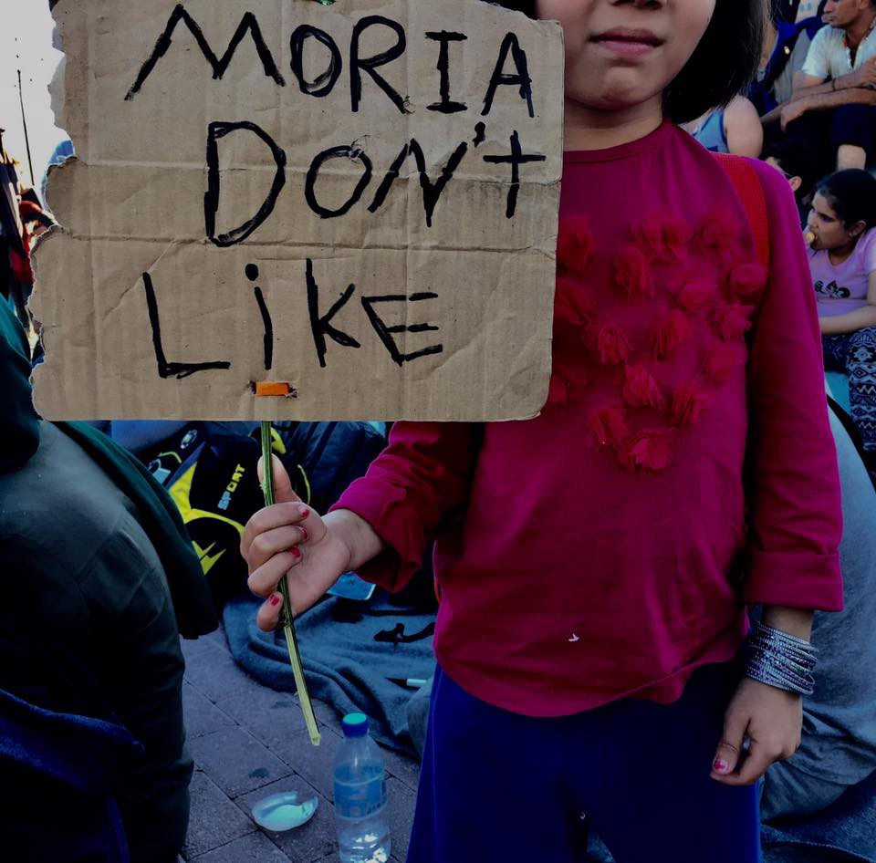
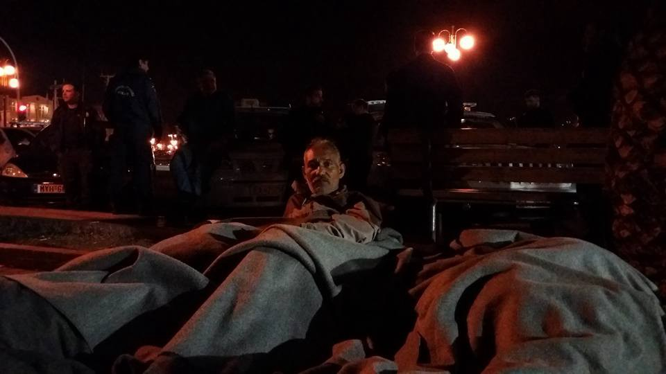
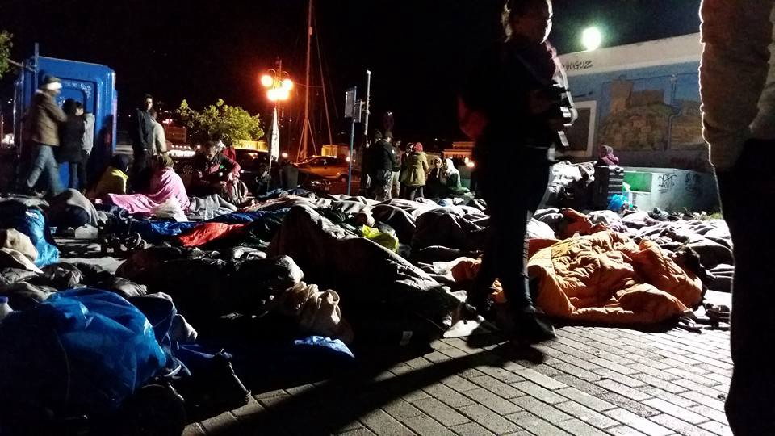
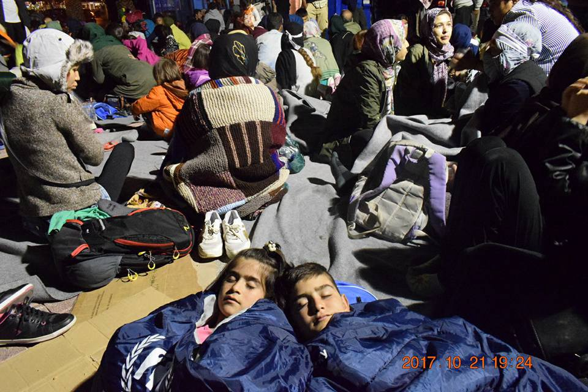
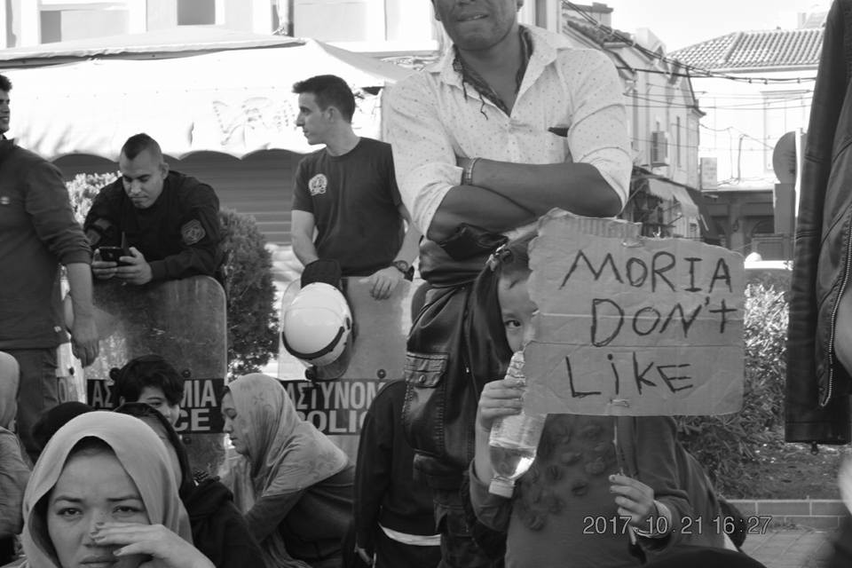
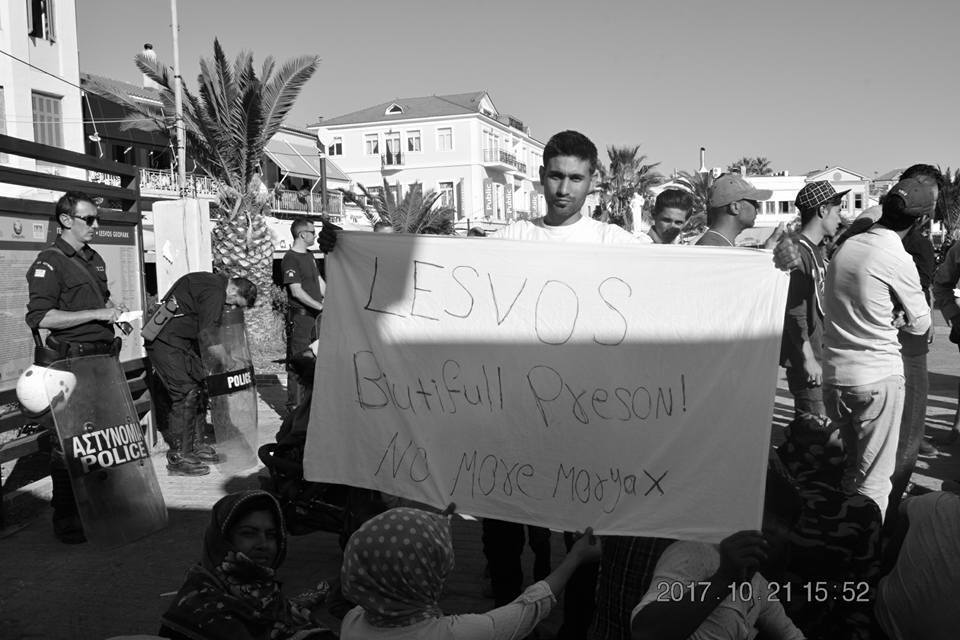
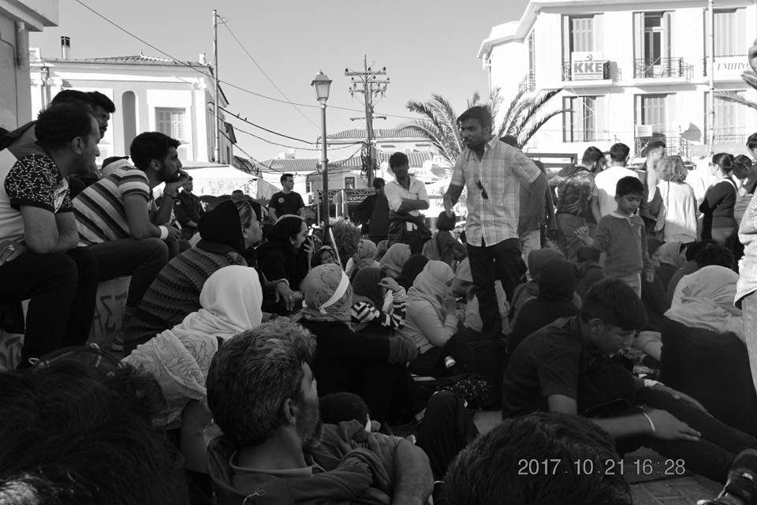
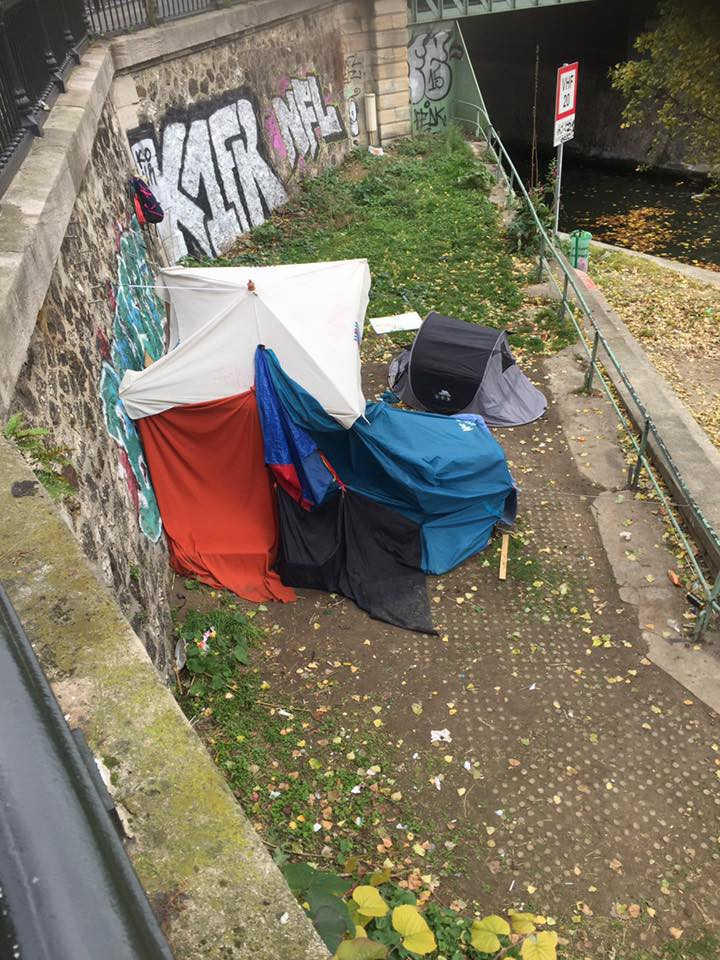

### AYS DAILY DIGEST 21/10/2017: Increased level of depression, anxiety disorders and post\-traumatic stress among child refugees due to negligence

_Urgent measures needed to protect children // 400,000 asylum applications submitted throughout Europe in 2017 // 138,300 people came by sea to Europe this year // Merkel proposes to the EU to cut pre\-accession funds to Turkey // Protests on Lesvos continue // The situation in Serbian limbo // Hungarian government limits work of the Hungarian Helsinki Committee // and much more from the Europe we live in today_

Photo by Lesvos Solidairty — Pikpa\.
### Feature

The most vulnerable category among refugees and migrants are children, especially those who are forced to travel alone\. This October, in Greece alone, there were about 2,950 registered unaccompanied children from various countries\. Some of them were lucky to find accommodation in shelters across the country, but too many are on their own in the streets\. In order to survive, these children are exposed to all sorts of violence, including sexual\.

There are only 1,114 beds available in 49 shelters, meaning that 1,822 are wait\-listed for shelters\. The current plans are that four new shelters should open soon, but only for 60 kids\.

Most of the children come from Pakistan and Afghanistan, and many are among the new arrivals to islands where they face dreadful conditions in overcrowded camps or makeshift shelters where they are forced to stay due to the lack of accommodations\.

The Greek government, with the support of UNICEF, has [issued a report](https://reliefweb.int/sites/reliefweb.int/files/resources/FINAL_MHPSS%20EXEC%20SUM%202017_EN%20-%2017%20OCT%2017.pdf) stating that shelter personnel report how many of the children struggle with **_“stress or anger related to uncertainness or fears about their future, related feelings of hopelessness, as well as loneliness due to separation from family and community_** ”\.

The situation in Greece is contributing significantly to the stress minors are exposed to\. Long delays in asylum procedures are leaving these children in a _“state of limbo”_ due to an uncertain future\. Additionally, **_“contradictory information about asylum procedures, and absence of an individual \(e\.g\. guardian\) to advise and provide them with continuous support through their stay in Greece; stress related to cohabitation with up to 30 other UAC \[unaccompanied alien children\] in shelters; limited opportunities to exercise autonomy \(e\.g\. absence of pocket money\); limited opportunities to access suitable education or vocational training; and in some cases discrimination”_** , is what makes this kids extremely vulnerable\.

Nevertheless, aside from the UN presence in the field, as well as that of many other major NGOs, too little serious effort is being made to improve this situation\. The result of this negligence is an increased level of depression, anxiety disorders and post\-traumatic stress among children\.

The report recommends that additional effort is needed _“to expand the delivery of targeted mental health services”_ for the children who are traveling alone\. Nevertheless, the report stresses that **_“equal attention should be given to providing services to children accompanied by their families who also suffer from increased rates of mental health problems and whose access to appropriate and intensive mental health services is also quite limited and fragmented\.”_**

[Here you can find some key figures about unaccompanied children left in limbo in Greece](https://reliefweb.int/sites/reliefweb.int/files/resources/EKKA%20dashboard%2015-10-2017.pdf) \.
### General

According to Eurostat data, from the beginning of this year to the end of September, over **_400,000 asylum applications were submitted throughout the Europe_** \.

At the end of June 2017, there were over **_958,000 pending applications_** \.

Most of the applications are in **_Germany \(122,800\), Italy \(83,100\), France \(50,800\), Greece \(27,100\)_** and the **_United Kingdom \(18,800\)_** , and among the applicants, the most people come from Syria, Afghanistan, and Iraq\.

While people are still arriving in Europe, the relocation process from the most affected countries is still very slow\. So far, according to the European Commission, **_29,698 people have been relocated from Greece and Italy, while the plan was 66,400_** \.

The EU leaders are not happy with the EU\-Turkey deal, and they feel that Turkey should be punished for not doing its part\. [German Chancellor Angela Merkel proposed at the meeting in Brussels](https://euobserver.com/foreign/139561) that the EU should cut pre\-accession funds to Turkey\. Merkel also stressed that the EU should keep paying to improve the lives of the mostly Syrian refugees living in Turkish camps\. _“We should stand by this obligation because these funds go to help refugees, who are in part living under very difficult conditions,”_ she said\.

Part of the EU\-Turkey deal is the obligation to allocate €6 billion to humanitarian agencies in Turkey to help improve living conditions for the refugees, but mostly to stop them from going to Greece\. Merkel noticed that the EU pledged a _“full commitment to our cooperation with Turkey on migration”_ , but noted that the numbers of people coming from Turkey to the Greek islands had shown “recent increases,” despite the bilateral accord\.
### Turkey

During September, according to the Turkish authorities, the Coast Guard **_intercepted or rescued 3,408 people_** , contributing to a **_total of 15,471 in 2017 of persons_** mostly headed to Greece\.

At the same time, the number of refugees, migrants, and asylum seekers registered in Turkey stood at over **_3\.5 million_** \. The biggest number are people from Syria — 3\.2 million under temporary protection in Turkey\.

### Sea

According to the available data, from the beginning of the year to the end of September, **_138,300 people came by sea to Europe_** \(Greece, Italy, Spain, and Cyprus\) \. **_Among the new arrivals, 18 percent were children_** \.

During the same period, an estimated 2,655 people have died or gone missing while trying to reach Europe by sea\.
### Greece

A relatively quiet day on the islands\. Only one boat was picked up carrying 18 people\. The boat was rescued off the coast of the island Symi, near Rhodes\.

The UN reports that i **_n September the number of refugees and migrants arriving by sea reached its highest levels since March 2016 with 4,900 people_** registered\. So far this year, 20,000 people arrived in Greece\. Most of them are from Syria and Iraq\.

In addition to the sea arrivals, an estimated 3,300 people have arrived at the Evros Greek\-Turkish land border\.

The new arrivals find themselves in unbearable conditions on the islands, including Lesvos, where people are protesting for the second day\. After yesterday’s riots, around 100 people — mostly from Afghanistan — left the overcrowded area of Moria camp and spend a day and night on the main square in Mytilini, including many families with children\.

Photo by Arash Hampay\.

People refused to go back to Moria camp, saying that they fear for their safety and demand to be accommodated in better conditions\. Among those who are participating in these protests are mostly new arrivals, but also some people who have been stranded on the island for almost 2 years\.

Our friends from No Border Kitchen in Lesvos send us stories of those who are protesting\. Among them is a family from Afghanistan with a one\-year\-old baby\. They arrived on Lesvos 25 days ago and are forced to sleep in a tent\. The baby has been running a fever for three days but is sleeping on the ground\.

Another story is of a family of four that has been living in a tent with three other families for over a month\. They were not given a mattress or enough blankets\. Their mother needs medical help, but doctors in Lesvos concluded that this is not an emergency even though she came with documents saying she needs surgery\.

All of them, alongside others, slept last night out in the open on the main square of Mytilini\.

Photo by Arash Hampay\.

Moria camp has a capacity for 2,000 people but is hosting around 5,500\.

Until the end of October, children who are 5 years old can register for Greek kindergartens\.

_“All children who were born in 2012 are expected to enroll in their nearest kindergarten\. There won’t be any special reception classes — your child will attend regular classes alongside Greek children\. The Greek Ministry of Education encourages all families to register their kindergarten\-aged children in schools near where they live\. Your child should attend even if you are waiting for Relocation or Family Reunification to another country\. Enrolling won’t affect if and when you can leave Greece\.”_

[See here for more info](http://blog.refugee.info/public-kindergarten-greece/) on how to enroll children, and how to complain if a child is not accepted\.

[Northern Lights Aid](http://facebook.com/northernlightsaid) needs your help to continue supporting babies and pregnant women in Kavala\!

There are a significant number of babies under the age of three as well as pregnant women expected to give birth during the winter currently living in the Kavala Asimicopoulou camp\. Northern Lights Aid provides these vulnerable groups with hygiene support, in order to help families welcome their little ones into an environment that is as hospitable as possible\. However, baby products are very expensive and pose a heavy financial burden on these families\.

_“We need your support to sustain our projects\. Together we can make a difference\! Currently, the main need is for nappies, but your donations can also help us buy strollers, cribs, formula, hygiene products, wet wipes and so on, in order to create our baby packages, which we distribute regularly\.”_

For more information, or to become a supporter, find them on [their website](http://world.northernlightsaid.org) or contact at [info@northernlightsaid\.org](mailto:info@northernlightsaid.org) \.

[The Athena Centre for Women on Chios](https://actionfromswitzerland.ch/our-work/protection/athena-centre-for-women-chios/faqs/) , a project run by Action, a Zürich\-based NGO from Switzerland, is [looking for female volunteers](http://greecevol.info/task.list.php?ID=643) to work at our Athena Centre for Women on Chios from December\.
### Serbia

[The Mixed Migration Platform](http://mixedmigrationplatform.org/review/life-in-limbo/) conducted a study on the situation of refugees and migrants stranded in Serbia due to the EU closed\-borders policy, concluding that most of the people could not even imagine staying there for another six months\. _“They are determined to continue to countries where they have meaningful links and are reluctant to invest in their current situation until they arrive, especially as they do not know how long they will wait,”_ the research finds out\.

Among other findings, one of the facts with a negative impact on the conditions for people in Serbia — but also in other countries — is _“limited access to trusted information about options for onward movement, which further exacerbates their sense of insecurity”_ \.

In Serbia, legal options for onward movement are limited, while for those who qualify, the waits are long\.

_“Most participants hoped that their name would be called from a waiting list by Hungarian authorities, allowing them a formal channel through which to cross the border\. Limited information about this transit process, including who will qualify and how long it may take, is pushing people towards smuggling, trafficking, and other dangerous alternatives\.”_

However, living for a very long time in the countries where they are stuck, with no way to earn money, has forced many people to find their way to earn some or borrow\. Borrowing money increases their indebtedness, and many do not see the day or the way they will repay the debt\.

> _“People’s lack of investment in their present situation is likely to make future integration more difficult\. As limbo continues, depression and other health problems are worsening, time out of work, school or training is lengthening, and family relationships are becoming increasingly strained\. In some cases, short\-term thinking is preventing people from accessing critical healthcare and legal processes such as divorcing an abusive partner or securing citizenship for their children\. All these factors will increase the burden on services in receiving states in the longer term\.”_ 

Finally, the report concludes that many of people who participated in the study are showing signs of psychological distress\.

_“When asked where they saw themselves in a year’s time, the most common answers were: “I don’t know” and “it depends on God’s will”\. Other answers gave an indication of the extent of people’s hopelessness and depression: one Afghan man who was acting as a community leader and appeared very motivated in the rest of his interview simply replied “it’s all black”, while a young Afghan woman, who had been a victim of gender\-based violence, replied “I’ll probably be dead”\.”_
### Bulgaria

According to a report by bulgaria\.bordermonitoring\.eu, the Defense Minister of Bulgaria, Krassimir Karakachanov, [stated that ladders had been used to climb the fence at the Bulgarian\-Turkish border](http://bulgaria.bordermonitoring.eu/2017/10/21/traces-of-migration-flow-at-the-bulgarian-turkish-border/) \. A couple of days before, the media published photos showing a large hole underneath the fence\. It was also discovered that even though the Bulgarian parliament voted in 2016 to use the army to protect the borders, this option has been used only intermittently\.

At the same time, the UNHCR issued data showing that until the end of August this year, 17,067 people were intercepted at the Turkish\-Greek and the Turkish\-Bulgarian land borders\.

For more information, read the full report [here](http://bulgaria.bordermonitoring.eu/2017/10/21/traces-of-migration-flow-at-the-bulgarian-turkish-border/) \.
### Hungary

Authorities have terminated cooperation agreements with the [Hungarian Helsinki Committee](http://www.helsinki.hu/en/authorities-terminated-cooperation-agreements-with-the-hhc/) , ending their access to police detention, prisons, and immigration detention\.

_“The HHC can no longer monitor human rights in closed institutions, even though NGOs’ access to police, prison and immigration detention reduces the risk of torture and ill\-treatment and contributes to improving detention conditions\.”_
### Italy

As of 30 September, according to UNHCR data, over 104,800 refugees and migrants had arrived in Italy, including over 13,500 unaccompanied and separated children\. Most of those who arrived are Nigerians, Guineans, Bangladeshis, Ivorians, and Malians\.

The situation in Gorizia is becoming worse with more people in the streets every day\. Currently, 104 people are sleeping rough in a tunnel\. The [Umino group](https://www.facebook.com/umino.org/posts/1260682534036817) is serving them tea and food in the morning and in the evening\.

**_“The number of homeless people is breaking records\. The weather forecast predicts rain and falling temperatures\.”_**

A local TV crew went to the tunnel and recorded very shocking scenes and stories of the life of mostly very young people\. [Video \(in Italian\)](ttps://youmedia.fanpage.it/video/aa/WecPduSw8MNDOGXLh)

In Pordenone, they are urgently in need of sleeping bags\. It is cold at night and their blankets are getting wet because of the fog and the damp\. Get in touch with local volunteers, or go there to help them, if you can\.
### Spain

As of the end of September, 17,400 people have arrived in Spain by land and sea, as UNHCR data show\. Over 70 percent of the arrivals in Spain this year came by sea but the number of arrivals via the land borders has also increased 35 percent compared to the same period last year\.
### France

[Volunteers with the People to People Solidarity group in Paris are reporting](https://www.gofundme.com/4dwnptc) that the situation in the streets where hundreds of people have been left to live is getting worse\.

_“People scattered everywhere, huddled under blankets, waiting hopefully for food donations, some in tents\. Today I joined a demonstration supporting refugees and it was heartwarming to see how many Parisians want to welcome these people\. But the political situation is getting worse\. Police are rounding people up; many have ‘disappeared’ this week\. The police violence continues unabated\.”_

 **‎**](assets/e6d863bb3206/1*I8LBu0vlP858DXtCtPKLDQ.jpeg)

Photos by [**Sarah Fenby\-dixon**](https://www.facebook.com/sarah.fenbydixon.1?fref=gs&hc_ref=ARQuE1JOyMRzZsWz-As0h7J0ELJ-Yi-cLItNLh0WfpTSFZw6UbQ0On5SsB6U_zcFnds&dti=1006253006128240&hc_location=group) **‎**

Please continue to support volunteers in the field who are helping to refugees and migrants in Paris
### Germany

Another group of people will be deported to Afghanistan on 24th of October from LEJ airport Leipzig/Halle\.

Therefore, [“Zendegi — Keine Abschiebung nach Afghanistan“, a campaign against all deportations to Afghanistan](http://www.facebook.com/afghanistanzendegi) , in cooperation with political activists and politicians who fight for refugee rights, decided to organize a protest in the city center of Leipzig in Saxony against the deportations\.

_“We — Zendegi campaign activists — are aware that a protest or a demonstration are not enough for us to stop deportations\. But we know that if any changes are to happen, we must raise our voices and find a way to open this dialogue in the German society\.”_

The campaign is calling you to join them in an anti\-deportation protest on October 21st at 2 pm \.

For more information on the action and program, please [check out the Facebook page of the campaign](http://www.facebook.com/afghanistanzendegi) \.

> **_We strive to echo correct news from the ground through collaboration and fairness, so let us know if something you read here isn’t right\._** 

> **_If there’s anything you want to share, contact us on Facebook or write to: areyousyrious@gmail\.com\._** 

_Converted [Medium Post](https://areyousyrious.medium.com/ays-daily-digest-21-10-2017-increased-level-of-depression-anxiety-disorders-and-post-traumatic-e6d863bb3206) by [ZMediumToMarkdown](https://github.com/ZhgChgLi/ZMediumToMarkdown)._
