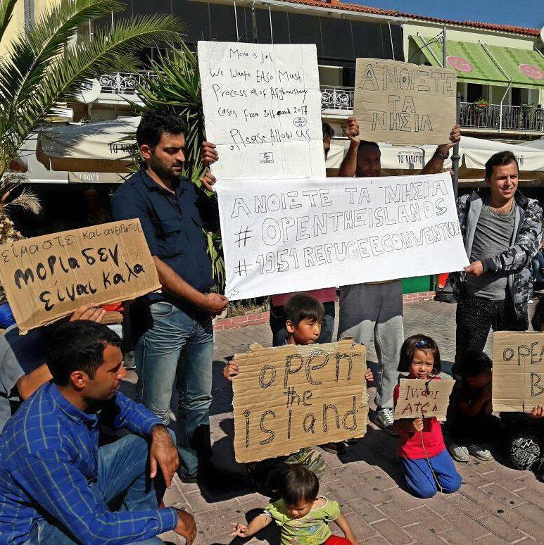

### AYS Daily Digest 22/10/17: \#OpenTheIslands

Second day of protests by refugees in Lesvos\. They refuse to live in the overcrowded Moria camp and demand that freedom of movement be granted\. Photo Credit: Legal Centre Lesbos
#### Feature

The Chios Eastern Shore Response Team, which has been operating on this island for quite some time, [put out a post](https://www.facebook.com/groups/421759534684819/permalink/699663996894370/) criticizing UNHCR for their underwhelming support on Chios\.

CESRT has been asking UNHCR for assistance in receiving blankets and water for new arrivals, only to be told that they were only responsible for blankets within the Vial camp\. Even within Vial however the UNHCR is unable to provide for many people’s basic needs, with over 200 people left without any form of shelter within the camp\.

This one anecdote encapsulates the scale of the disorder that continues to reign on the islands\. In addition to the unsuitability of the infrastructure for coping with the numbers of people who remain trapped, refugees are from the first moment of arrival thrust into navigating a bureaucratic hellscape\.

Organizations operating on the islands lack the capacity to deal with the numbers of people who land there\. Authorities meanwhile have shown themselves unwilling to work towards a solution for the situation\. They neither increase the allocation of scarce resources, nor do they allow for a streamlined process to take place which would allow the hotspots to be used for their original purpose: as emergency registration centers where refugees can expect to stay for only a short period of time before being transferred to the mainland\.

](assets/b76ab47cf9f0/1*kivSmumSncrbIGn4Lw0FvQ.jpeg)

The tents and shelters outside Vial, Chios\. Photo by [**Chios Eastern Shore Response Team — Info Point**](https://www.facebook.com/groups/421759534684819/permalink/699663996894370/)

With winter approaching, the repercussions for such failures are expected to become much more serious\. Just today there was a controversy relating to the unsuitability of tents for coping with the expected rainfall on Lesvos and Chios\. And that is of course still speaking of those who are lucky enough to have even a basic tent or tarp over their heads\.

As mentioned above, hundreds in Vial, under the jurisdiction of the UNHCR, do not even have the most basic form of shelter at their disposal\! To see such senseless neglect while a plain solution is clearly visible for all to see truly is enough to drive one mad\. But this just goes to reinforce the fact that at the end of the day, it is not about seeing, but rather, about desiring to do\.
#### Greece
### Numbers

Lesvos: 34 people arrived today
Chios: 29 people arrived today
### Lesvos

The protest in Lesvos, where the rain is expected on Monday, continues for the second day in a row\. Group of people is still in the main sqaure in Mitiline demanding for better accomodation and faster asylum process\. So far, the authorities done little to nothing to respons their demands\.

[Aris Vlahopoulos](https://www.facebook.com/aris.vlahopoulos?fref=gs&hc_ref=ARRVuGcE0gH1AucxgaSH_lRIwbt6JamnvyFOJGmbMmZR_Qyp9hRhsnrBeRo3ZS_idxo&hc_location=group) reports from Lesvos stating that volunteers are estimating the real number of people who are curently stranded on this island could be between 8 and 8,200\. Officially, it is around 7,200, which is still far over Moria capacity\.

](assets/b76ab47cf9f0/1*_P4DPwCgsCNeqD1NVR6qBg.jpeg)

Photo by [**Legal Centre Lesbos**](https://www.facebook.com/LesvosLegal/?hc_ref=ARSjNdOjr2RqVr8AW3KQf_MshNgLow1UmuAxAQwtYjqnYDX2D1VC4kHqLp4ughvMCw8)

“Most of the grassroots organisations together with refugees are working tirelessly to cover the needs, but unfortunately this is not really helping\. The people are frustrated, angry, living in unsafe conditions and that causes unrest, riots and demonstrations which causes children sleeping on the streets\. This has to be stopped\. The EU has to take responsibility, the police , the coast guard, the authorities and the big organisations has to take responsibilities\. The situation is becoming so ridiculous that Municipalities, UNHCR, and big organisations are asking for basic items, like blankets from grassroot organisations\.”
### Instructions for enrolling in school

Refugee\.info has put together a number of guides to help refugee children to enroll in school\.

Kindergarten \(5 years\) [https://goo\.gl/TfFJBk](https://goo.gl/TfFJBk) 
Primary up to high school \(6 to 15\): [https://goo\.gl/gsx4AY](https://l.facebook.com/l.php?u=https%3A%2F%2Fgoo.gl%2Fgsx4AY&h=ATNehxAgBe4nda7DmhkI0amYiEJzPs8nsBMQF7F6PSWrZG01rx1nXrtBZWKq_AclWexV5nv5FzSO63GmGDTaIXTG4qL5xWD5otaa07vIL68nCMCP_EHiM-oWNVV9fNcF-nbp5LMutGQwLdSKOMyWmbTq4vQZGnX3vyLMKl7xOwSn-JxWdBMd_ImxiHY4eXBsS8aIXT2AFRX5e4KImRvcz8n3Dy0j4CEtut2x1E_jXmAH6pAc_jj8s1_mAsoURlokJT5-CB3t_bNfJsxZLvJtHJs) 
High School \(15 to 18\): [https://goo\.gl/SqxozE](https://goo.gl/SqxozE) 
Zone of educational priorities: [https://goo\.gl/x5uzY3](https://goo.gl/x5uzY3)
### Truckshop is seeking donations\!

The organization, which furnishes refugees with clothing, is asking that those in a position to do so donate to the organization\. They need to raise 1,500 euros by the end of the month to cover the next installment of rent\. They say that in the last 5 months, over 2,000 people have come to them for necessities\. You can donate through the link below\.

#### Italy

Around 60 people are sleeping in the streets in Pordenone\. Pictures from the streets in Italy are shocking, showing people hiding under plastic foils to protect themselves from the rain and bad weather\. Volunteers in this area need help for their work with homeless refugees and migrants\.

**](assets/b76ab47cf9f0/1*FEsokSex5nD0vN6tYUAWrg.jpeg)

**Photo by [Lorena Fornasir](https://www.facebook.com/lorena.fornasir?fref=gs&hc_ref=ARRzmdhK1X9SjF66uDvSeu0b96sGyHZ4bFRHu-R8WrnAqt27t2xJNzIjI07lVu-N8h0&hc_location=group)**

The situation is worsening with the bad weather in Gorizia\. Volunteer Sandra Uselli compile available info from the are posting on [FB page for the Italian volunteer](https://m.facebook.com/groups/1834254390190027?view=permalink&id=1979342375681227) that 70–90 people are sleep rough in Gorizia within the Bombi Gallery, and more are coming every day\.

The situation is not much better in existing shelters\.

“The people hosted in the CARA in Gradisca d’Isonzo don’t get the pocket money, get a change of clothes \(a jumpsuit\) every 3 months and low quality food \(pasta without the dressing, sometimes expired and with some plastic inside\) \. The ones hosted in the Caritas dormitory don’t get other official help except for the daytime refectory managed by the Capuchins Friars\. Other volunteers distribute what they can in the evening at the Bombi gallery\.”

If you can help, [visit this FB page for more details\.](https://m.facebook.com/groups/1834254390190027?view=permalink&id=1979342375681227)

Group are calling for protest in Milan on Monday\. The aim is to demand from the authorities to explain their policies behind the movements of migrants from the CAS Montello\. [Check their FB](https://www.facebook.com/events/100986213998900??ti=ia) to joing the protest or show your support\.
### Study shows that immigrants responsible for 9 percent of Italian gross GDP

A recent report by the Fondazione Leone Moresss found that in 2016, the 2\.4 million employed Italian immigrants created 130 billion Euros of value for the economy, constituting 8\.9% of the gross GDP of the nation\. Immigrants have contributed 11\.5 billion euros to social security and have paid 7\.2 billion euros in income tax\.
#### Romania
### 500 refugees jailed in Romania for “border transgression”

[500 Kurdish refugees have been in jail](http://www.rudaw.net/english/world/18102017#sthash.exQe4XdX.gbpl) for about a month, with sentences to last for five months\. They are being kept in Horia prison after being arrested aboard Romanian buses\. Soran Hama Rasheed, one of the imprisoned, claims that each of them had been held in solitary confinement for a period of 20 days\. Prisoners complain of the poor quality of food that they are being given and they are reportedly being held in their cells for 20 hours per day\.
#### Austria
### Report looks at refugees’ perceptions of Austria

270 refugees were interviewed in July and August by NGOs affiliated with the Mixed Migration Platform to assess their perceptions to their new country\. Now, [the report](https://reliefweb.int/sites/reliefweb.int/files/resources/Ground-Truth_Survey_report-Austria_excluding_Vienna_10_2017.pdf) based on those findings has been released\. Vienna has been excluded from this study, but most of the regions of Austria have been included\. The majority of those surveyed reported that while it can be difficult to find information about available services, most feel that their needs are mostly being met, and that the majority feel welcome and safe in Austria\.
#### Denmark
### Residents of Danish deportation center continue their hunger strike

A group of 28 residents of the Kærshovedgård Departure Center have been staging a hunger strike for the last 8 days\. [Kamran Mohammadi told The Local](https://www.thelocal.dk/20171021/rejected-asylum-seekers-at-denmark-deportation-centre-hunger-strike-in-bid-to-bring-attention-to-intolerable-circumstances) that conditions in the center are dehumanizing\. “We respect the rules but we feel as though we have committed a crime\. It creates a bad atmosphere,” he said\. Mohammadi had been living in Denmark since 2008, and he says that he is unable to return to his native Iran without fearing for his safety because of his background as a political dissident\. Others are trapped in limbo as they are stateless, or because their home country does not have return protocols with Denmark\.
#### France
### France to perform investigations of refugee child minors’ age

French PM Edouard Philippe has said that the state will perform evaluations of arriving unaccompanied child minors to confirm that they are indeed minors\. The state will also expand the availability of emergency housing to such children\. This year, it is expected that more than 25,000 unaccompanied child minors will have made their way to France, a sharp increase from 4,000 in 2010\.
### Utopia 56 to hold information session on Tuesday October 24

Utopia 56, an organization quite active in helping refugees in northern France to get housing, in particular unaccompanied child minors, will be holding an information session on Tuesday in Lille\. The meeting will take place at Café Citoyen at 7 Place du Vieux Marché aux Chevaux\. For more information, please contact them on their website [www\.utopia56\.com,](http://www.utopia56.com,) or by sending an email to hebergementcitoyen@utopia56\.com\.
### Refugee Community Kitchen is holding a fundraiser

Refugee Community Kitchen serves roughly 2,500 hot meals per day\. They claim to have served over 1\.5 million meals during their period of activity, and their services are greatly valued by those whom they serve\. Unfortunately however, they are running very low on funds, and they would really appreciate any help that you may give them\. You may donate to them by following the below link\.

### Fundraiser to buy waterproof footwear for refugees in Calais

Donate 4 Refugees has started a fundraiser to buy waterproof boots for refugees stranded in Northern France\. As winter approaches, this will be an absolute necessity for people who have no homes\. In addition to temperature\-related risks such as hypothermia, having constantly moist feet can cause conditions such as trench foot, several cases of which were documented in the summer\. The campaign aims to raise £20,000 and has made it about halfway to their goal, raising £8,500 thus far\.

### Mobile Refugee Support launches website

The team provides mobile aid, “consolidation and support to refugees and displaced peoples”\. They are currently based and operating in northern France\. Check [MRS web site](https://www.mobilerefugeesupport.org/about-us) for information about the situation in this region\.

**_We strive to echo correct news from the ground through collaboration and fairness, so let us know if something you read here isn’t right\._**

> **_If there’s anything you want to share, contact us on Facebook or write to: areyousyrious@gmail\.com\._** 

_Converted [Medium Post](https://areyousyrious.medium.com/ays-daily-digest-22-10-17-opentheislands-b76ab47cf9f0) by [ZMediumToMarkdown](https://github.com/ZhgChgLi/ZMediumToMarkdown)._
