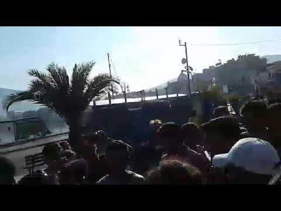
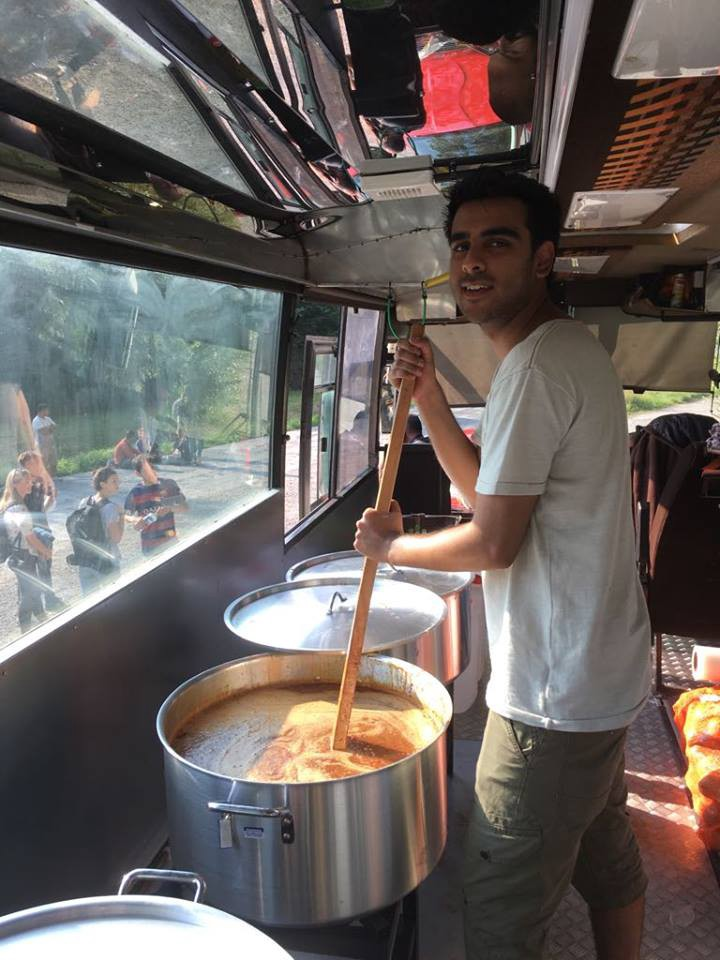
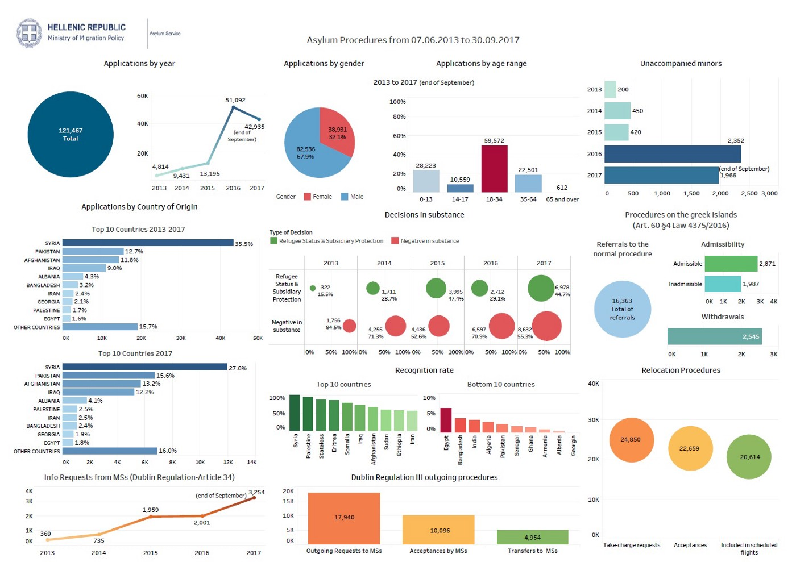

### AYS Daily Digest 24/10/17: Appeal from rescue teams for change
#### Protests continue on Lesvos // Conditions worsen on the islands with rain // Protest against deportations in Leipzig // One year after the “Jungle” // Belgium forbidden to deport to Sudan?

 \.](assets/b0738120d204/1*WDf4yvOv-RELaUJozYeRzA.png)

Photo by [Σιωπή Σημαίνει Συνενοχή](https://www.facebook.com/siopi.simenei.synenoxi/?hc_ref=ARSV_Csiu5KicxjAXgOL2iW40KOPL5j_YypUTVRgL0Qq57L44yWPhmPGtZbCrI2rRG8) \.
### Feature

The group [Sea\-Watch](https://sea-watch.org/seenotrettungsorganisationen-fordern-richtungswechsel-in-der-fluechtlingspolitik/) has made an appeal to the future German government for a fundamental change in refugee policies that can provide a solution for the people trying to reach Europe\. They ask for the government to take decisive action against violations of human rights and to support the life\-saving work of the civilian sea troopers\.

These activists hope that Germany, with all its power in the European Union, can end the support of the Libyan coast guard by the EU and its member states\. In support of this position, the activitst point to the as longstanding violations of international maritime law and humanitarian international law by the Libyan forces\.

> As the largest EU Member State, Germany is not only responsible for the inadequate response to a thousandfold death of refugees in the Mediterranean but also for the dangerous action of the EU\-trained and financed Libyan coast guard\. In the course of several incidents involving the Libyan coast guard in international waters, the lives and well\-being of refugees and rescuers have been severely compromised in recent months\. Many dead were to be lamented\! 

The group demands that cooperation with the Libyan authorities must be based on compliance with the rule of law, international human rights standards such as the non\-refoulement bid and international maritime law such as the “place of safety”\. As long as these laws are ignored, as the Libyan coast guard continues bring refugees back to Libya against their will, these activists demand that the Libyan coast guard be immediately stopped by financial means and training\. In addition, violence against refugees and rescuers must be publicly condemned\.

Libya, but also the neighboring Maghreb countries, are not such a “place of safety” and the return of refugees to these countries is irresponsible from a humanitarian point of view and should not be an option considering the widespread corruption and the violence caused by various armed groups in the area\.

These stories continue to arrive to Europe with the refugees that make it and they none of them are good stories\. It’s in the politicians hands to make real change and materialize the human rights they defend on camera\.
### Greece

During the last week, 700 people were transferred from islands to mainlands, but even this large number is far from enough\. All the people are sent to existing camps, and later on they have right to apply for the accommodation\. Currently there is only 3,000 places left in camps, while the UNHCR accommodation is finally full\. It is not clear where people who are now on the islands will go and what will happen in the near future\. People who are working in the field are noticing a total lack of coordination with existing NGOs, UNHCR and the government\. This week the government asked for help from the UNHCR, something they could have done before, while the UNHCR also should have taken more steps to accomadate for the number of people currently present in Greece, and to anticipate new arrivals\. It has been reported that 2,000 people will be voluntarily transferred from the islands Samos and Lesvos to the mainland with in the next 10 to 15 days but according to some sources, the contingency plan for emergency decongestion was designed to be activated when the islands population reached 7,000 people\. As per today the official number is 1,4426\.
#### Lesvos

The protests continue for the 5th day on the island since a group of Afghan and Iranian refugees have decided to leave Moria due to unliveable conditions and violence\. Children faced the rain and police today rather than staying in the camp and many have been sleeping outside to point out the terrible conditions of the camp\. Violent outbreaks are common and once again refugees are demanding better treatment\. Despite countless protests, the fact that codnitions have remained largely the same on the island should be a source of shame for EU authorities\.

](assets/b0738120d204/1*VqJTCEYQ3n2PB6RNLILGww.jpeg)

Photo by [**Legal Centre Lesbos‏**](https://twitter.com/lesboslegal)

Today the well known activist [**Arash Hampay**](https://www.facebook.com/arashampay?hc_ref=ARSavSOjULTNlp1AOAqY-inBjF7ww5H0SQNWApedDFpnJLLuvphHU4GUWHQKe15wvi4) gives us also an update on the situation and about the protesters:

> Today is the fifth day of the protest of refugees from Moria\. When the refugees started protesting on the first day, the police tried to prevent them from reaching the city using any means they could, including blocking the road and threatening refugees with arrest\. The refugees continued their struggle through all those obstacles and they finally reached the city centre\. 
 

> The first night that the refugees occupied Sapfous square, all of those in power appeared; the Police, The head of Moria, the head of Kara Tepe\. They came as they had done before\. “Go back to the camp,” they said\. “We shall act in accordance to your demands”, they said\. But the refugees have already experienced the empty promises of the authorities\. The refugees did not let themselves be lured by their false promises\. They did everything they could to silence the voices of the protesting refugees\. Beside the ill\-treatment of the heads of the camps and the police, even representatives of the hospital and emergency services in Mytilini acted in a an immoral and callous manner\. One example was when some children and one woman got sick\. We called the ambulance\. “Tell them to take a taxi and then come to the hospital” they responded\. There was another situation when an ambulance was needed because some women and children who had become ill\. “Talk to the police” they said\. “We only come by the command of the police” they said\. When one woman and a child left the hospital at around 2 am, they had walk all the way back to the location of the protests in the middle of the night\. 
 

> Today the police gave us an ultimatum of 10 minutes to leave the square, in a very threatening way\. When we declined, the police threatened that they would arrest me first and then every one else at the square\. We did not leave the square and they could not arrest us as we are committing no crime\. Around one hundred refugees have stayed continuously at the square during these last days\. They have protested\. They have demanded justice\. They have demanded a fair treatment\. But they have not been received in a dignified way\. The police, the Greek government and the UNHCR have not had any positive reactions\. They do not seem to be willing to look into the eyes of these vulnerable people, these heroic refugees\. I am a representative and one of the protesting refugees\. We demand that you will follow your own laws\. We demand that you will treat refugees in accordance with dignity and morals\. We demand that you will see us as your fellow human beings\. I will be more clear: We demand that we will be released from this big and beautiful prison of Lesvos Island\. We want to go to another country where vulnerable refugees are accepted\. I hope that not only those in power but also the beloved people of Greece and Europe will open their eyes and see all those women, children, those victims of war, who have been spending five days on the street\. Look\! Look into our eyes\! 

](assets/b0738120d204/1*RKHZXn2GLcOd1KU4gn59_A.jpeg)

Photo from the protest by [**Arash Hampay**](https://www.facebook.com/arashampay?hc_ref=ARSavSOjULTNlp1AOAqY-inBjF7ww5H0SQNWApedDFpnJLLuvphHU4GUWHQKe15wvi4)

This video, also from the site, shows the frustration of refugees on the island\.

In these difficult times, a lot of help is needed and the Kitchen Bus is looking for volunteers to help feeding refugees on Lesvos\. The bus is able to produce thousands of hot meals per day and the group needs funds urgently to continue their task\.

25 Euros can feed a refugee for a month\.
100 Euros can feed a refugee family for a month\.
OR donate just 1 Euro it will feed a refugee for a day\.

Online donations by PayPal, credit card or transfer into their bank account following this [link](https://standbymelesvos.org/donating/) \.

Photo by Shafique Azam

Another group, [**Dråpen i Havet**](https://www.facebook.com/drapenihavet/?hc_ref=ARSCjkDpiZEm20ctjtOgpUD0oo61KV8Dlo19vnyEixdg37QwQAKgikD7lD2Dnv8DNmA) **,** is also working on the island and is in need of volunteers\. Their work consists of patrolling the coast and sending alerts when boats are spotted on their way in\. They also assist with landings\. In addition, they’re preparing blankets, clothes and shoes for distribution at arrivals\. Their resources are also available for other organizations on the island that need assistance\.

](assets/b0738120d204/1*JTGfsQSB77KYJ2XHGHrgmw.jpeg)

Photo by [**Dråpen i Havet**](https://www.facebook.com/drapenihavet/?hc_ref=ARSCjkDpiZEm20ctjtOgpUD0oo61KV8Dlo19vnyEixdg37QwQAKgikD7lD2Dnv8DNmA)

Desired arrival days for volunteers are:

October 25th
October 30th
November 4th
November 9th
November 14th

Another big problem caused by this crisis is metal health issues and MSF has reported that only on Lesvos, the team has has treated 6 or 7 people a week following suicide attempts, self harm, and psychotic episodes\. Considering that MSF is not even able to deal with many mental health issues, nor do they catch every single suicide attemt or self harm episode, this should be a scary figure for Greek and European officials\.
#### Chios

[**Refugee Info Bus**](https://www.facebook.com/RefugeeInfoBus/?hc_ref=ARQgiBsC3Wv6wvgd1QFZ9pvznInmAfCe3FOcc58Ueou3gmbdH8KZXmD06508at2Xrdk) is on the island where many refugees have been arriving recently\. Now that Souda camp has closed, people are forced into the increasingly unsafe, unsanitary conditions of Vial Camp\. Here, very few NGO’s are allowed to enter and because of overcrowding, the new arrivals are now forced into tents without electricity, or are simply sleeping out in the open, as winter in Greece is beginning to rear its head\.

](assets/b0738120d204/1*ZxkVhMgFy4D1x3Q2VlCovg.jpeg)

photo by [**Refugee Info Bus**](https://www.facebook.com/RefugeeInfoBus/?hc_ref=ARQgiBsC3Wv6wvgd1QFZ9pvznInmAfCe3FOcc58Ueou3gmbdH8KZXmD06508at2Xrdk)

](assets/b0738120d204/1*6dw-A-zm2-Dax0krq5OEoA.jpeg)

Photo by [**Refugee Info Bus**](https://www.facebook.com/RefugeeInfoBus/?hc_ref=ARQgiBsC3Wv6wvgd1QFZ9pvznInmAfCe3FOcc58Ueou3gmbdH8KZXmD06508at2Xrdk)

](assets/b0738120d204/1*T95m0X5YPstQrHt9AO3YmQ.jpeg)

Photo by [**Εφημερίδα Πολίτης**](https://www.facebook.com/Politischios.gr/?hc_ref=ARQf1PpNsPgsmKgYGTZVgyIlr1409Y1ogP8rpYnVLjGu02BVChqRz5dA7Q2WGIrxnyE)

Cold, starving and wet is the fundamental codnition of many refugees trapped on the island of Chios\. Most of the guys who went for breakfast to The Hero Centre this morning slept in the park in the rain last night\. They can’t even get an sub\-par temporary tent at Vial\. For the refugees of Chios, there is no shelter, no food, no money, and no country to protect them\.

](assets/b0738120d204/1*2qRxQXai6Wo3178mii8FuA.jpeg)

photo by [**The Hero Centre — Chios**](https://www.facebook.com/theherocentre/)
#### Samos

The latest spike in migrant arrivals in Greece has caught the government off guard, with critics saying it has no plan of action as the situation has become reminiscent of the crisis at the end of 2015, when thousands of people flooded into the country\. Without a concrete plan, government officials are reportedly hoping for bad weather to save the day and limit arrivals\.

And the bad weather has arrived, but far from alleviating the crisis, it just made the conditions for those living inside and out of the camp worse, as many tents are now unfit to sleep in\. History is repeating itself and it hasn’t been that long ago when we saw winter come and turn a difficult situation into hell\. Seasonal changes shouldn’t be that difficult to predict, and the failure of the UNHCR and Greek authorities to plan for something as obvious as weather changes only demonstrates their incompetence\.

So many people on Samos that have been camping outside had to face the rain and this was the result\.

](assets/b0738120d204/1*klbMtMpLK6DM7LCG8jvMWA.jpeg)

Photo by [**MSF Sea**](https://twitter.com/MSF_Sea)

](assets/b0738120d204/1*2US7lFKVg_FGdjWmwvVhqg.jpeg)

Photo by [**MSF Sea**](https://twitter.com/MSF_Sea)

](assets/b0738120d204/1*Sjomy61SWsBSvDx6olc99A.jpeg)

Photo by [**Samos Volunteers**](https://www.facebook.com/samosvolunteers/?hc_ref=ARQmgV8BdsOZRCEE13zf5Fu8PXikidHoVy81IaLdqDHW3-Xeb_2_1CqtC3N3ksnNuaI)

The first day of heavy rain on Samos has been devastating, the hundreds of people still living in pop\-up tents have been directly exposed to the rain and cold, their homes left drenched and muddy\. Families have no safe or dry place to sleep and people’s health is being put at risk every day\. [**Samos Volunteers**](https://www.facebook.com/samosvolunteers/?hc_ref=ARQmgV8BdsOZRCEE13zf5Fu8PXikidHoVy81IaLdqDHW3-Xeb_2_1CqtC3N3ksnNuaI) distributed vinyl ponchos and thick plastic bags for people to keep themselves and their belongings dry, but it only makes a small difference in an impossible situation\.

With the bad weather arriving, volunteers are asking for donations urgently to help keep refugees warm\. The main needs at them moment are:
1. thermal underwear \(women, men, children\)
2\. waterproof boots \(women, men, children\)
3\. waterproof gloves \(women, men, children\)
4\. socks \(women, men, children\)
5\. tracksuits \(women, men, children\)
6\. leggings \(women\)
7\. sanitary pads
8\. baby diapers \(1–5\)

Please get in touch on the [link](https://www.facebook.com/Ti.Ram.Tam?fref=gs&hc_ref=ARQYV6PPMaXR63442HS47y_E7xhy35mJPLieU-8b5qQOIQH_UNn9Gk6fb_u1_Xquscc&hc_location=group) to donate\.
#### Mainland

There has been news recently about some camps closing in the future and we can now make a few updates on this front\. Elfesina camp should have been closed down on the 22th of October, Trikala Atlantic will be closed on 27th, Oinofyta on 10th of November and Derveni on 17th\. People will be moved hopefully to apartments, but more likely to other camps that are constructed as permanent places\. There is the possibility to turn Malakasa camp into a permanent settlement and this is also being discussed\.

The Greek asylum services have published a useful and informative infographic that shows statistics on how many people have sought asylum in Greece between 2013 and 2017\. [**Refugee Info Bus**](https://www.facebook.com/RefugeeInfoBus/?hc_ref=ARTpYdrQb-fbxyMAlPsAsi1Y2X6b_A723siUjy0cjq0JbPXOCveOPOURdCI7uqY44-Q&fref=nf) **has** analyzed the graph and it shows that an impressive 4,594 people have left Greece to be reunited with family elsewhere in Europe, however, it also shows that 10,096 people have been accepted for family reunifications, and 17,040 people have made family reunion requests\. This means that many people are still waiting to hear from other European countries on important decisions about their future\.

**Docmobile** is looking for qualified doctors \(GP, emergency doctors, pediatricians\) to work in different places in Greece, where they provide free medical care for refugees\. Dentists are also needed for the thousands of refugees on Lesbos, with no access to dental care\. If you have relevant training or background please consider joining the team\. Contact them [here](http://greecevol.info/task.list.php?ID=609) \.
### Macedonia

Legis has published its quarterly report stating that around 82 refugees were supported during the period between June and September\. Since the new arrivals fluctuate on a daily basis, the field officers established communications with almost each newly arrived person in the camp Tabanovce\. The southern border camp Gevgelija remains closed and with only 11 residents\. At this moment, only 14 people reside in Tabanovce in total, while 2 new arrivals are reported\. The numbers fluctuate on a daily basis, as well as their time of stay in this transit\-center\. Usually people, who reached the center, transited from the Southern border and would remain for 2–3 days depending on their medical needs and request for asylum\. Accoridng to the report, there have been no new asylum applications submitted, although available in both transit\-centers\. The lack of applications for asylum is not surprising, given Hungary’s overwhelmingly hostile attitude towards refugees\. You can read the full report [here](http://legis.mk/news/2401/quarterly-report-june-sep-15-2017-help-on-the-route) \.
### Germany

Today another deportation to Afghanistan was scheduled from Leipzig\-Halle\. At least the case of one deportee will be reviewed by BAMF since some comedians wrote an open letter, demanding to stop the deportation of this specific man, Reza\.

Reza wasn’t considered as threat for the national security and didn’t commit any crime\. Further he helped to authorities to confirm his identity\. Therefore he should not be included in the deportations\. He was taken into detention last week\.

Also in Leipzig airport, approximately 120 people demonstrated at Leipzig / Halle airport \(Germany\) this morning against deportations to Afghanistan\. The demonstration was preceded by a protest camp on Augustusplatz, Leipzig, lasting for four days\.

](assets/b0738120d204/1*ZO715NCmZ4CiI493Ubqzxg.jpeg)

Photo by [Enough is Enough](https://enoughisenough14.org/2017/10/24/protests-in-leipzig-this-deportation-is-ignorant-its-murderous/)
### France

A year has passed since the demolition of the “Jungle” at Calais and today [**Help Refugees**](https://www.facebook.com/HelpRefugeesUK/?hc_ref=ARQrHMaw0V-q2JAqPsD_Hx1kCAjRUvGG9d6UYwKyfYpHjAA4BTRrgbqTCYxVqbMhzkI&fref=nf) reviews that event and summarizes what happened and points out the flaws of that intervention that left many people, including many children, behind\. Many of them had the right to travel to the UK being minors and having family there, but the government keeps ignoring just as they ignored their plight while the Jungle was still standing\.

Volunteers in Northern France are asking people at home to write to their MPs and remind them of their legal obligation to protect vulnerable child refugees\.

](assets/b0738120d204/1*4NABSr0WUCQmZGf3WbBrdA.png)

Photo by [**Help Refugees**](https://www.facebook.com/HelpRefugeesUK/?hc_ref=ARTdxfsM8IEQ-JOiG4Yv4BQgNx7Nuaw0SZV8FiGBocWgM-msmixAQvEwsFadNEhS1Ew&fref=nf)

[FAST \(First Aid Support Team\)](https://www.facebook.com/groups/FirstAidSupportTeam/?hc_ref=ARTG0SbEMGb2SMGW6X578Y6RiP-4urAKj2GgbxGK87z7vhSwr-HJCAiXGkdKTqao5yQ) is asking for sanitary items for refugees in the north of France:

> As we made a plan together wit care 4 calais and other NGO’s for scabies treatments for the dunkirk area we need your help\. 

> Our doctors will help people with scabies by diagnosing and providing medications\. 

> Care 4 Calais will make boxes with new clothing for the people\. 

> And last but sertanly not least we are going to work together with a team that will bring over showers to dunkirk\. 

> This way people will get a complete treatment and will finally get rid of scabies in the Camp\. 

You can support them in the link [here\.](https://www.gofundme.com/refugee-first-aid-team)

Today there is another good initiative in Dunkirk, [Myles Bancroft](https://www.facebook.com/myles.bancroft?fref=mentions) and **‎ [Thomas Gilbert](https://www.facebook.com/thomas.gilbert.169?hc_ref=ARREYMGSGa_mzMxWZ0AiJcd6inTU7XVLDE5ciHjWRKLYyXeNPkb0-tpMSAXSTaCKumc&fref=nf) ‎** have been doing a litter pick of the camp\. They are asking for help of anyone on the ground to keep the area clean\. The rubbish is starting to pile up in the abandoned camps throughout the woods and rats are breeding\.

**](assets/b0738120d204/1*uwvu6KH0hSi6TwZA0PtHtg.jpeg)

Photo by **‎ [Thomas Gilbert](https://www.facebook.com/thomas.gilbert.169?hc_ref=ARREYMGSGa_mzMxWZ0AiJcd6inTU7XVLDE5ciHjWRKLYyXeNPkb0-tpMSAXSTaCKumc&fref=nf)**

The area that has already been cleaned has been really appreciated by the residents and they have noticed that there has been less littering in those areas so if you want to participate, please get in touch with them\.
### Belgium

A Belgian court ordered the government to stop the deportation of around two\-dozen Sudanese refugees on the 9th of October, following an uproar over Belgium’s invitation to officials from Khartoum to identify them\. Sudanese officials visited Belgium last month to help identify the migrants, prompting the League of Human Rights \(LDH\) to accuse Brussels of collaborating with “one of the worst dictatorships” in the world\. The LDH also said there were “serious grounds” to believe that the deportation of the migrants to Sudan would expose them to mistreatment by the government in Khartoum\. The court banned the government from deporting the Sudanese to Sudan or to any other European country although the government said it would challenge this rule\.

Now there are some disturbing new coming more recently and an article was published on the 20th saying that the government is still trying to deport Sudanese people\. Its called, **a voluntary return … forced?**

> While he had just obtained a favorable court decision, Mohammad, a Sudanese prisoner in a closed center in Belgium, signed an agreement for a voluntary return\. In a language he does not understand and without the presence of a lawyer\. Incomprehensible for the League of Human Rights who denounces a mock of consent\. 

> Mohammad has been held for nearly two months at the closed center Caricole \(Steenokkerzeel\) \. Described as fragile, suffering very badly this long incarceration, he withdrew his asylum application after learning that Belgium would collaborate with Sudan\. He will be visited by the officials of the official Khartoum delegation\. Wanting to leave the center, he filed a motion for release\. The House of the Brussels Criminal Court had to rule on his case this week, Tuesday, October 17, but, problem, the Aliens Office intended to put it on a plane to Sudan as soon as … Friday 13 October\. 

The article, in French, can be found [here](http://m.levif.be/actualite/belgique/asile-et-soudan-un-retour-volontaire-force/article-normal-742231.html) \.

If these cases should be investigated and if confirmed the court should expose the case and prosecute the government but first of all order the return of the deported refugee to Belgium\.

> **_We strive to echo correct news from the ground through collaboration and fairness, so let us know if something you read here isn’t right\._** 

> **_If there’s anything you want to share, contact us on Facebook or write to: areyousyrious@gmail\.com\._** 

_Converted [Medium Post](https://areyousyrious.medium.com/ays-daily-digest-24-10-17-appeal-from-rescue-teams-for-change-b0738120d204) by [ZMediumToMarkdown](https://github.com/ZhgChgLi/ZMediumToMarkdown)._
