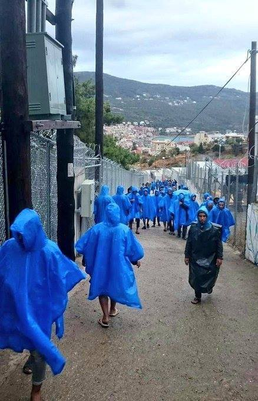
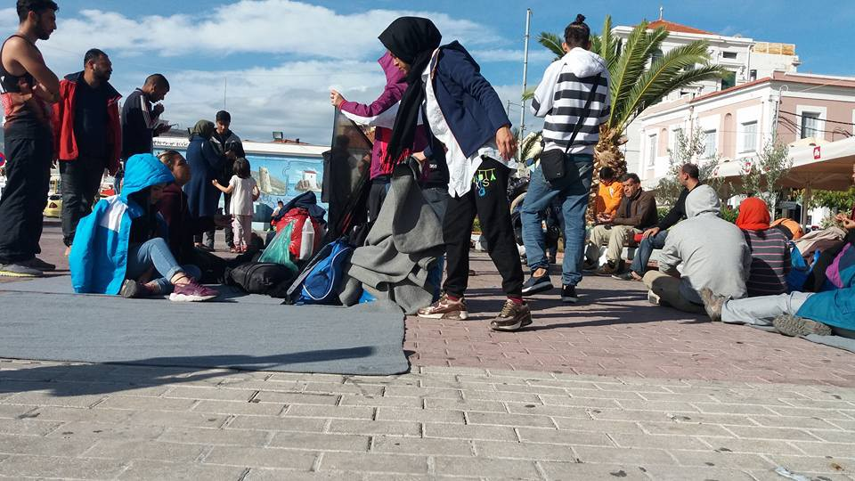
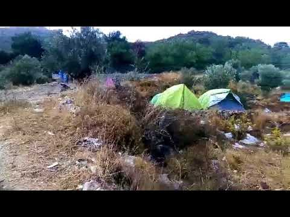
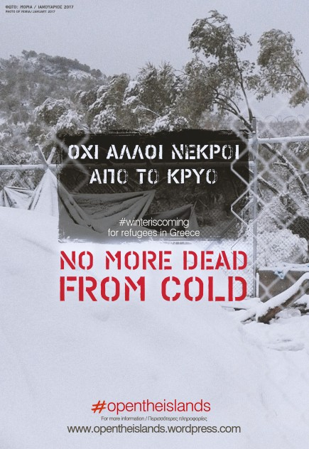
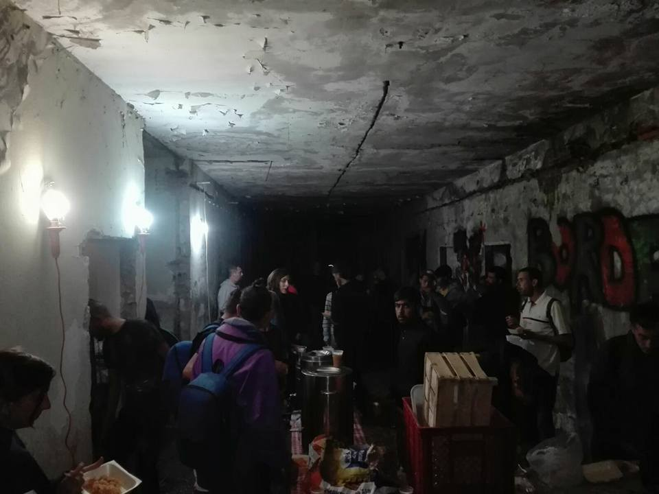
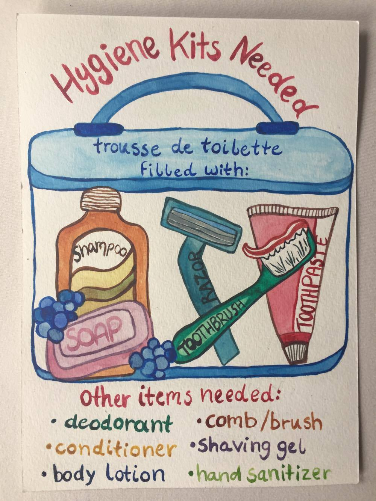
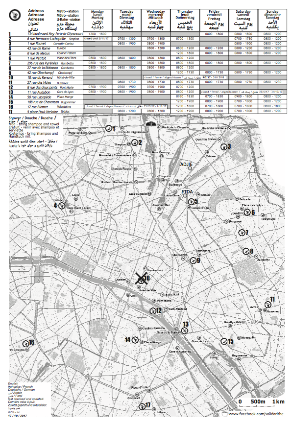
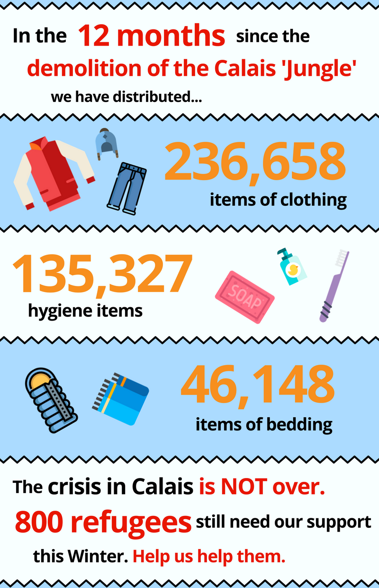

### AYS Daily Digest 25/10/17: Police in Calais used extensive force

_Police in Calais routinely used chemical sprays on people and children in the Jungle / Police in Paris continue with intimidation / Number of people in the streets of Paris and in Calais is growing every day / No more space in Moria prison / Vial on the verge of cholera / Most of the people currently in Serbia are from Iraq / And more news…_

Samos\. Photo No Borders\. \#opentheislands
### \#OpenTheIslands — no more dead from cold\!
### Feature

The French administration and security forces concluded an investigation indicating that there is “ **convincing evidence** ” that police used violence against people and children in the Jungle, Calais\.

[Human Rights Watch quotes the report](https://www.hrw.org/news/2017/10/24/france-inquiry-finds-police-abused-migrants-calais) reminding that the investigation was initiated in response to their report\. The investigation confirmed — what HRW and volunteers from the field claimed \- that the police used not only violence but also that they “ **routinely used chemical sprays on migrants, including children, while they were sleeping and in other circumstances in which they posed no threat, and regularly sprayed or confiscated sleeping bags, blankets, and clothing, apparently to press them to leave the area\.** ”

Investigations found that most of the abuses were committed by the French riot police \(Compagnies Républicaines de Sécurité, CRS\) \. The report also noticed that some volunteers were prevented from food distribution and that people living in the Jungle were deprived of drinking water and showers\.

While this report was presented to the public in Paris, volunteers in the field encountered similar patterns in police attitude\. [Sarah Fenby Dixon](https://www.facebook.com/sarah.fenbydixon.1?hc_ref=ARQJvna2BNaJRoSa0jN4dnxb2ggzDsOAUa9LAgj31oiWihfmzFIIauB6tgjSKO965Sw) writes on her Facebook page that, while the number of people in the streets increases every day, police force them to run and hide\.

](assets/148039b47155/1*09BiFCfmi1lT21hbKc8jbg.jpeg)

Paris\. Phoot by [**Sarah Fenby\-dixon**](https://www.facebook.com/sarah.fenbydixon.1?hc_ref=ARTQ1ihV_ypZg0EZH7CE2Ec4cKBqgq4omTOWqA3VG060ryIPzrjdtUeg5sonuzWsZyw)

> “Things are really awful\. It was bad last year but at least most people were in particular places and volunteers knew where people were\. There was even a sense of community, sometimes even singing and dancing\. Now, because of constant hounding by police, people are scattered and huddled in any doorway or space they can find, surrounded by rats and filth\. Thanks to PRGS most have blankets but that’s all\. Some don’t have coats or even shoes, they are in sandals\. There are no hygiene facilities\. 

> It’s hard to overestimate the psychological impact of this on these people who have already suffered so much trauma\. On top of this is the constant anxiety of navigating the French asylum system which seems inconsistent at best and stacked against those seeking safety\.” 

[Harts for refugees](https://www.facebook.com/groups/hertsforrefugees/permalink/1456651127765917/) group also noticed the increase in numbers of people on the streets\. The group delivers blankets to Paris Refugee Ground Support\.

People in Paris need help\. [Please, consider helping](https://www.gofundme.com/4dwnptc) , if you can\.

We hope that another investigation by the authorities will be conducted to examine police conduct in Paris, too\.
### Greece

It has been 6 days since the beginning of the protest in Mytilini, Lesvos and many people are still sleeping out in the open in the main square\.

Photo by Arash Humpay\.

So far, little to no response from the authorities came\. Today, after being offered only 10 minutes to meet somebody from the authorities, protesters declined\. Following the decline, the police threatened to arrest everybody, but there were no grounds for arrests and nobody was removed from the square\.

Transfer of people to the mainland is still very slow\. So far no more than 700 people were allowed to leave the island, while over 7000 people \(according to some estimates possibly even over 8000\) are currently placed in an overcrowded camp\.

Nevertheless, based on leaked documents from one of the coordination meetings between the authorities, UNHCR, and groups present on Lesvos, there is a possibility that the asylum process could be sped up soon\. So far there is agreement that vulnerable people will be allowed to have their first asylum interview on the mainland\. This means they will get an asylum card with no restriction of movement immediately after the registration process is over\.

If implemented, this could be a significant improvement, but still, too many people will be stuck on the island\.

However, more trouble is possible since at this co\-ordination meeting those present were informed that: “according to Moria Aliens Department, since 11 October, all Syrian single men will be detained in the PROKEKA area upon arrival, following relevant recommendation for the continuation of their detention by RAO, until the completion of the asylum procedure\. Their detention will continue until their claims have been examined by the asylum office\. Their vulnerability assessment is prioritized, and if they are found to be vulnerable they are not detained\.”

It is not clear why this decision was made\.

Horror like conditions on islands are getting even worse\. The rain that started yesterday turned the area around some camps into a muddy or swampy area\.

This is the video we recived from residents of the camp in Samos:

At the same time, MSF report that for months on Lesvos, they have treated 6 or 7 people a week following suicide attempts, self\-harm or psychotic episodes\.

From the Vial camp on Chios, there are alarming reports about the possibility of cholera due to the living conditions there\. [Some claim that the cause could be](http://www.politischios.gr/.../sta-prothyra-tis-holeras-i...) that waste water from the interior of the hotspot ends up among the new tents, from there to the cultivated fields and finally to the main road that leads to the central entrance of Vial\.

■■■■■■■■■■■■■■ 
> **[Եհҽմɾցíɑ_ցօҽԵíɑ ⛧](https://twitter.com/Theurgia_Goetia) @ Twitter Says:** 

> > Waste water+shit form a stream between the tents in VIAL "extension" #Chios #refugeesgr #opentheislands https://t.co/jWUexebrit 

> **Tweeted at [2017-10-24 17:52:11](https://twitter.com/theurgia_goetia/status/922883432446820353).** 

■■■■■■■■■■■■■■ 

■■■■■■■■■■■■■■ 
> **[RSA](https://twitter.com/rspaegean) @ Twitter Says:** 

> > Heavy rain since yesterday in the Aegean islands has already transformed hot-spots into swamps. This is #Moria. #Refugeesgr #opentheislands https://t.co/SfwEJWJcmC 

> **Tweeted at [2017-10-25 09:43:11](https://twitter.com/rspaegean/status/923122760146092033).** 

■■■■■■■■■■■■■■ 

\#opentheislands

And that is not the only problem for people on Chios\. People in the camp do not have enough tents and blankets\. The UNHCR promissed the tents and blankets will arrive at the end of this week\. They are waiting\.

Meanwhile, hundreds are on the streets and have not even tent\.

While people are struggling sleeping outside on the island, part of the available UNHCR accommodation remains free\. According to the last UNHCR report, over 95 percent of accommodation on the island, and over 86 percent on the mainland is occupaed\.

[Red Cross offers](https://hrcurbanarea.blogspot.ba/p/accompaniments.html?spref=fb) a team of 8 interpreters \(Arabic, Farsi, Turkish, Sohrani, English and French\) for accompanying people and facilitating access to other health services in the urban area of Athens\.

The Accompaniment Service can be offered either physically or on\-call\. For more on this service, see [here](https://hrcurbanarea.blogspot.ba/p/accompaniments.html?spref=fb) \.
#### Help needed

[Because we Carry](https://www.facebook.com/Becausewecarry/posts/678574292341181) team on Lesvos requests donations of strollers and other necessities\.

[ART Angels Relief Team](https://www.facebook.com/ARTBridgesMusicTeam/?ref=br_rs) in the framework of ART BRIDGES — ΓΕΦΥΡΕΣ ΤΕΧΝΗΣ call for volunteers from November\. To apply please send a mail to [artangelsreliefteam@gmail\.com](mailto:artangelsreliefteam@gmail.com) with a brief summary of your motivation / why you are interested, etc\. The minimum commitment is 12 days\.

[Khora Center](http://www.khora-athens.org/khora-blog/2017/10/24/call-out-for-volunteers) in Athens needs electricians, plumbers, carpenters, builders, or anybody who can help with building and maintenance work “to start immediately”\.

**The Mobile Info Team issued a guide with tips for the asylum interview\.** Take a look at their latest post and read their tips\.

### Serbia

Over 100 people found a shelter in abandoned buildings around the Šid area\. The scenes from Šid are similar to what we have witnessed last year in Belgrade barracks\. Volunteers in the field have been able to construct wood stoves with recycled materials so that people can use them\.

Photo by No Name Kitchen\.

According to the latest official data, currently there are 4,258 registered refugees, asylum\-seekers and migrants in Serbia, of which 3,743 are housed in 18 governmental centers\. Last week, 167 new arrivals were registered\. Currently, the people stuck in Serbia are mostly those coming from Iraq \(38%\), many Yazidi and Kurd, followed by Pakistan \(25%\), and Afghanistan \(19%\) \.
### Bulgaria

According to [the official figures](http://www.novinite.com/articles/184598/5800+Refugees+Attempted+to+Enter+Bulgaria+Illegally+in+2017) , over 5800 people have attempted to cross the Bulgarian border since the beginning of the year\. At the moment, about 1/5 of the capacity of the refugee centers in Bulgaria are occupied, which is approximately 1000 people\.
### Germany

[Public broadcaster ZDF reported](https://www.zdf.de/politik/frontal-21/fluechtlinge-zur-prostitution-gezwungen-100.html) that security workers at Berlin’s refugee accommodation centers are pushing young people into prostitution\.

According to sources this media quotes, security employees were even pimping out minors as part of a prostitution ring\.

The guards targeted young, male refugees for the high prices they earned when selling their bodies\. One guard told the broadcaster he earns €20 \($24\) for each prostitution referral\.

Despite protests and disapproval by the public, 14 rejected Afghan asylum seekers [were expelled from Germany](https://www.thelocal.de/20171025/14-afghans-expelled-from-germany-amid-angry-protests) \. They were deported by plane from Leipzig and already arrived in Kabul\. Interior ministry spokeswoman Annegret Korff told reporters that 11 of the deportees had criminal records for acts including manslaughter, causing grievous bodily harm, sexual abuse of children, fraud and theft, while the others had refused to cooperate in establishing their identity\.

At the same time, [one person will have to be brought back from Afghanistan](http://m.swp.de/.../fluechtlinge_-gericht-ordnet...) \. Apparently, Hasmatullah F\. who is 23\-years old was first sent to Bulgaria, the country where his fingerprints were taken, and then deported to Afghanistan\. Now, the administrative court Sigmaringen \(Baden\-Württemberg\) ordered that the federal bureau has to bring him back to Germany\.

Hasmatullah F\. claimed that while back in Bulgaria he was held in a small cell, beaten up by the police, and forced to sign a voluntarily return to Afghanistan paper\.

Now, he has to be brought back from Afghanistan where he is in hiding\. His lawyer, Markus Niedworok, is optimistic saying that “When deportations to Afghanistan are possible, returns must be possible, too, when there is a will\.”

Germany resumed deportations of rejected asylum seekers from Afghanistan last month after suspending the process when a devastating truck bomb hit Kabul in May\.
### France

[Solidarithé](https://www.facebook.com/solidarithe/?hc_ref=ARSVCj5N4kA6WPGRxmpi1zIziFtw21yVV8v_QCedGKMCFLqB2c_p0HPhZ2WI7X4NW9s) put together maps of showers in Paris available to people sleeping on the streets\!

Their maps are going into the Hygiene Packs that Sciences Po Refugee Help puts together and distribute\.They are also collecting clean boxers, socks, and gloves\.

> “If you can provide any of the items in the visual above please please do get in touch\! \! \! Your donation will make a difference to both the physical and mental wellbeing of people facing the cold on the streets of Paris\.” 

The crisis in Calais is not over\. We are facing a harsh winter where refugees here are more exposed than ever before\. Please help us help them by [donating here](http://bit.ly/calaisdunkirkfunds) \.

Alternatively, please send sleeping bags, thermal gloves, small and medium waterproof men’s jackets and men’s joggers \(email [calaisdonations@gmail\.com](mailto:calaisdonations@gmail.com) \), or [order them for us through Leisure Fayre](https://www.leisurefayre.com/section.…/86100/1/help_refugees) \.
### Sweden

[The Migration Agency won’t manage to fulfill the promise](https://www.dn.se/nyheter/sverige/migrationsverket-klarar-inte-loftet-om-ensamkommande-barn/) they recently gave to unaccompanied minors — that everyone who came in 2015 and 2016 should be given answers by the end of 2017\.

The Migration Minister Hélene Fritzon said in several interviews that this is one of the most urgent and important issues to sort out and do on time, but now it’s clear that this won’t become reality\. In August she said she had been given a serious promise from Mikael Ribbenvik and that he said this should be done by the end of 2017 since the unaccompanied minors are suffering from the limbo\-like circumstances they are living in\.

According to staff, not mentioned by name, the authority is under severe pressure and tries to find out alternative solutions to be able to reach the goal of 80\.000 processed cases\.

Currently, the Migration Agency has 43\.724 open cases that shall be tried again, and 8000 that will be prolonged\. Up until September, 44\.000 cases were decided on, whereas 5000 of them were related to unaccompanied minors\.

> **_We strive to echo correct news from the ground through collaboration and fairness, so let us know if something you read here isn’t right\._** 

> **_If there’s anything you want to share, contact us on Facebook or write to: areyousyrious@gmail\.com\._** 

_Converted [Medium Post](https://areyousyrious.medium.com/ays-daily-digest-25-10-2017-police-in-calais-used-extensive-force-148039b47155) by [ZMediumToMarkdown](https://github.com/ZhgChgLi/ZMediumToMarkdown)._
