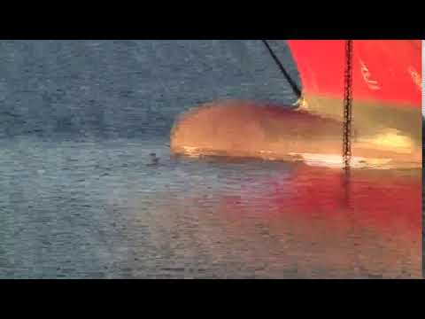

### AYS Daily Digest 27/10/17: Lawyers want to challenge the EU\-Turkey deal in front of the ECHR

_They argue that the judges should overturn the Greek court decision / Only one third of unaccompanied minors receives appropiate shelter / Arrivals still surpass transfers to mainland / Hungary terminates cooperation agreements with Helsinki Committee / Bad conditions in Northern France_

](assets/2e3cc56fe98f/1*CKc1YPpg1mjlgKDATG-rOQ.jpeg)

A result of the EU\-Turkey deal: the hotspots on the islands, here Vial on Chios\. Credits: [Ab\. Ali Darwish/RSA](https://twitter.com/rspaegean/status/923625324960722945)
### Feature: Lawyers want to challenge the EU\-Turkey deal in front of the ECHR

As reported, the Council of State, the Supreme Administrative Court of Greece, ruled that Turkey can be considered a safe country for refugees\. The decision was far from unanimous, as twelve of the judges voted against this judgement — 13 voted in favour\. The [Mobile Info Team](https://www.mobileinfoteam.org/blog/2017/10/25/appeal-against-decision-that-turkey-is-a-safe-country-for-refugees-in-front-of-european-court?format=amp) reports that lawyers from different organisations now want to challenge this ruling before the European Court of Human Rights \(ECHR\) \. They also want to apply for interim measures for the currently 15 detained Syrians in the hotspots on the Eastern Aegean islands

](assets/2e3cc56fe98f/1*-RzmUVNVV6F_h9tCMbr73Q.jpeg)

Residents of the Vial hotspots on Chios\. Credits: [Giorgos Moutafis](https://www.facebook.com/photo.php?fbid=10214518078407167&set=pcb.10214518096127610&type=3&theater&ifg=1)

Experts were critical because the Council of State did not refer the case to the European Court of Justice \(ECJ\) to get a definition of a “safe third country” under European law\. Lawyers of [Refugee Support Aegean](http://rsaegean.org/greek-court-opens-door-for-forcible-returns-of-asylum-seekers-back-to-turkey/) , who were representing one of the two Syrians at the trial, observed at the time that the court ignored the impact of the political crisis on protection seekers in Turkey: “It has ignored the amendments introduced to Turkey’s Law on Foreigners and International Protection under the post\-coup state of emergency that significantly increased the risk of refoulement”\. Additionally, the number of asylum seekers with Turkish nationality increased massively after the coup\. In Germany they now account for the third largest group\.

To date, no Syrian has been forcibly returned under the EU\-Turkey deal\. Still, 1696 people \(580 in 2017\) were not given protection in Greece and had to go back to Turkey\. From there, many have been deported to their country of origin\. Some Syrians who voluntarily went back from Greece to Turkey, seeing no prospects there, preferred going back to Syria to trying to find appropiate refuge in another country\.
### Turkey

A group of more than 100 people has been seized by Turkish police forces near Edirne, the Bulgarian National Television reports \(via [Novonite](http://www.novinite.com/articles/184694/110+Illegal+Migrants+were+Detained+near+Edirne) \) \. This happened at the border triangle of Turkey, Greece and Bulgaria\. They were handed over to migration authorities in Edirne\.

In the Aegean region the Turkish Coast Guard apprehended three boats, some 120 people, preventing them from entering Greek waters\.
### Greece

In a new [report](https://www.unicef.org/media/media_101396.html) , UNICEF warns that only one third of the 3,000 unaccompanied minors in Greece have received appropiate shelter\. The others are “waiting for a place in a shelter, living in open sites, reception centres, or are otherwise stranded on the islands or in de facto detention centres\. Some of these children are even living on the streets, and the approaching winter is adding to the risk”\. On the islands, some of the facilities are twice over their capacity\.
#### Islands

Meanwhile, the arrivals on the islands remain higher than the transfers to the mainland\. Yesterday 122 people were registered on Lesvos, 18 on Samos, making a total of 140\. In October so far some 2,400 people were able to leave the islands — more than 3,600 were registered\.

](assets/2e3cc56fe98f/1*NFx1PSTwGUoxVS63f-sPlA.jpeg)

The number of residents on the islands is still far over the capacities\. Credits: [City Plaza Squat](https://twitter.com/sol2refugees/status/923969230831345665)
#### Lesvos

According to volunteer information, two boats arrived on South Lesvos today, carrying 76 and 60 people\.

Following another week of protests in Mytilini, some of the protesters [have started](https://www.facebook.com/arashampay/posts/538744179805006?hc_location=ufi) a hunger strike today\. They demand to be accepted as refugees or get the right to leave the islands\.

Danish volunteers are asking for donations to send a truck full of aid to Lesvos\. They need to raise 2500€ for this purpose\.

Also, Movement on the Ground is trying to improve the conditions for the new arrivals on Lesvos\. They are raising funds to provide 250 mattresses and covers to people in need\. More info can be found on [Needshub](http://www.needshub.org/index.php/en/other-items/31-all-other-items/96-mattresses-and-mattresses-cove) \.
#### Mainland
#### Patras

In Patras three people have been injured after they were stabbed by a group of assailants wearing hoods\. According to the [Patras Times](http://patrastimes.gr/home-page-slider/%CF%80%CE%AC%CF%84%CF%81%CE%B1-%CE%BC%CE%B1%CF%87%CE%B1%CE%B9%CF%81%CF%8E%CE%BC%CE%B1%CF%84%CE%B1-%CF%83%CF%84%CE%B7%CE%BD-%CE%B1%CE%B2%CE%B5%CE%BE-%CE%AD%CE%BD%CE%B1%CF%82-%CE%B2%CE%B1%CF%81%CE%B9/) , the attackers came by car to an abandoned factory, where the people resided, and started attacking them\. While two had slight injuries, one had to be transported to hospital in serious condition\. The police is investigating the case\. It is assumed that the perpetrators were not racists\. Reportedly they were human traffickers trying to prevent people from smuggling themselves onto ferries\.

[Tempo24](http://tempo24.news/eidisi/150264/patra-kolympontas-proseggizoyn-ta-ploia-metanastes-to-kykloma-poy-lymainetai-tin) \(via [Keep Talking Greece](http://www.keeptalkinggreece.com/2017/10/27/patras-migrants-swim/#.WfMU0q9iHds.facebook) \), a Greek local media, additionally reports that recently people have been seen jumping into the sea, trying to swim to the ferry to Italy and then enter it by climbing the anchor chains or using the hanging ropes\. In the case reported by the media, a sailor forced them to swim back to the shore\.

#### Thessaloniki

Please be aware and inform your friends that tomorrow \(28/10\) a military parade will be held in the streets of Thessaloniki\. This means that shops are closed and tanks will be around as well as military airplanes\. Buses will run on the normal Saturday schedule\.

### Hungary

The Hungarian Helsinki Committee announced that Hungarian national authorities have terminated four cooperation agreements with the organization\. This means they cannot continue their monitoring in “police detention facilities, penitentiary institutions, immigration jails, asylum jails, reception centres for asylum seekers and the Border Guards’ immigration detention facilities”\.

Volunteers further launched a new fundraiser, to support one of the Röszke 11 victims\. They are trying to [raise](https://www.generosity.com/fundraising/justice-for-ahmed-fundraising-for-defense-lawyer) 18\.000$ for the trial\.
### Italy

The content of an elementary school book, “Diventa Protagonista” \(Become a Protagonist\), caused an outcry in Italy, Ansa reports \(via [InfoMigrants](http://www.infomigrants.net/en/post/5818/controversy-in-italy-for-racist-phrases-in-school-book?ref=tw_i) \) \. Critics say that it simplifies and discriminates migrants, refugees and foreigners\. The Italian Education Minister Valeria Fedele also reacted to this and said she would ask the Italian Publishers’ Association to make a review of the criticized passage, which reads:

> “The presence of foreigners, above all from Asian and North African countries, has increased\. Many are hosted in refugee assistance centers and are illegals, which means their stay in Italy isn’t authorized by the law\. In our cities migrants often live in precarious conditions: they can’t find a job, not even humble or heavy, nor decent housing\. That’s why their integration is difficult: for economic and social reasons, residents often consider them a threat to their own well\-being and show intolerance towards them”\. 

#### Liguria

In Liguria the first training courses have begun for volunteers who want to take care of unaccompanied minors, Ansa reports \(via [InfoMigrants](http://www.infomigrants.net/en/post/5825/training-begins-for-guardians-of-unaccompanied-minors) \) \. The call for applicants was opened in May and is still open\. The first 70 volunteers have already been chosen and have taken the lessons\. The volunteers were divided into three different groups of 20–25 people each\. The courses were held over three days and took 15 hours\.
#### Milan

Meltingpot has released a new report on the reception system for asylum seekers in Milan and its province\. Even though the number of structures has increased, they still have many shortcomings, such as no guarantee for language schooling, long stays in reception centers or a lack of organisation\.

The blog [sicilimigranti](http://siciliamigranti.blogspot.de/2017/10/le-difficolta-dellaccoglienza-nel.html?spref=fb&m=1) comes to similar conclusions, saying that the business of new cooperatives is favoured instead of promoting an effective reception system\.

#### Gorizia

Volunteers have started increasing their support to people in need in Gorizia during the last weeks\. At the moment, winter jackets size S are most needed\.

### France

The conditions for people in Calais and Dunkirk remain tough\. The recent rainfalls have caused muddy soil and the temperatures are dropping\. Care4Calais reports about new police interventions, taking sleeping bags and slashing up tents\. Just [two days ago](ays-daily-digest-25-10-2017-police-in-calais-used-extensive-force-148039b47155) , Human Rights Watch released a report on police violence in the region\.

■■■■■■■■■■■■■■ 
> **[Care4Calais](https://twitter.com/Care4Calais) @ Twitter Says:** 

> > Dunkirk was wet &amp; muddy. It rained most of the day, &amp; was tough for #refugees. Police been in again &amp; taken sleeping bags &amp; slashed up tents https://t.co/1MTtyyBji3 

> **Tweeted at [2017-10-27 09:30:16](https://twitter.com/care4calais/status/923844285178482694).** 

■■■■■■■■■■■■■■ 

At the train station of Calais, volunteers also witnessed new racial police controls, that take place there since several months\.

> **_We strive to echo correct news from the ground through collaboration and fairness, so let us know if something you read here isn’t right\._** 

> **_If there’s anything you want to share, contact us on Facebook or write to: areyousyrious@gmail\.com\._** 

_Converted [Medium Post](https://areyousyrious.medium.com/ays-daily-digest-27-10-17-lawyers-want-to-challenge-the-eu-turkey-deal-in-front-of-the-echr-2e3cc56fe98f) by [ZMediumToMarkdown](https://github.com/ZhgChgLi/ZMediumToMarkdown)._
