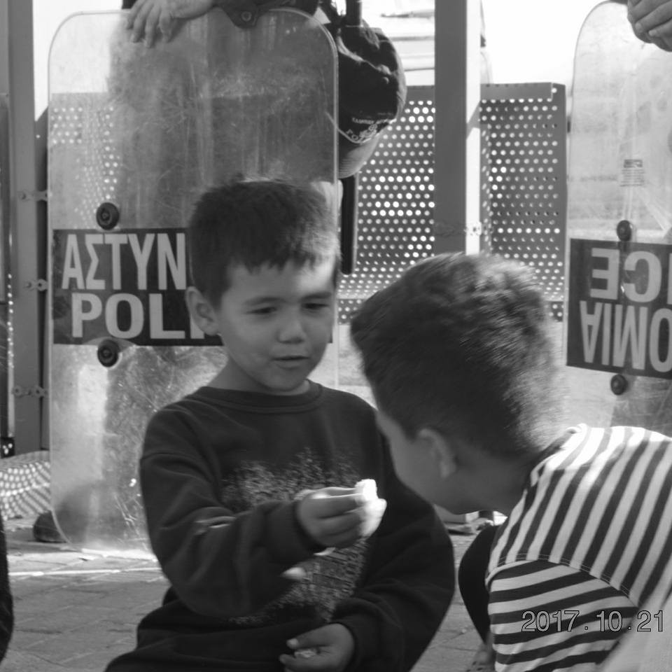
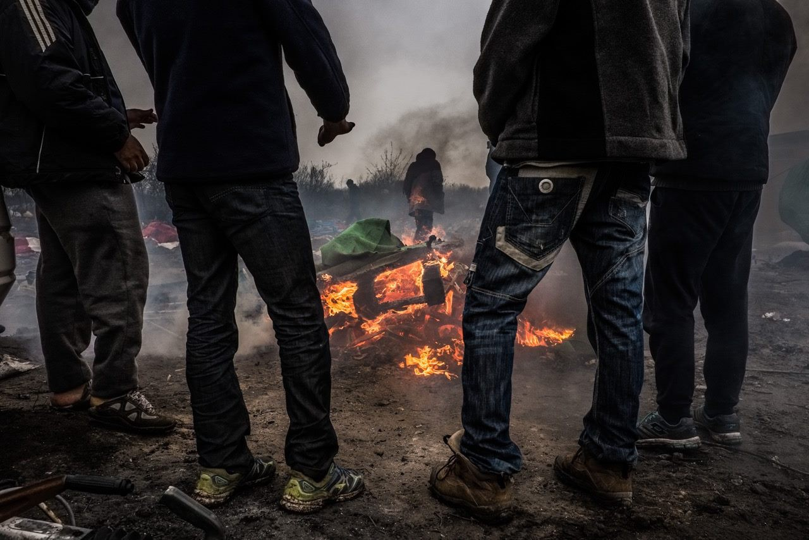

### AYS Daily Digest 30/10/17: Ahmed H\. Faces False Charges in Hungary

The Retrial of Ahmed H\. / Waiting for Family Reunification in Greece / Turkish Coast Guard intercepts boats / Language classes and services in Athens / Urgent Needs and hunger strike on Lesvos / Germany increases number of reunifications / Police abuse in Calais

](assets/d89403681468/1*lH5oG0pSzGR1hKocL4KHCw.jpeg)

Ahmad H\. on trial in Hungary\. Photo Credit: [Aron Demeter](https://twitter.com/demeteraaron)

The [retrial of the Ahmed H](https://budapestbeacon.com/retrial-ahmed-h-begins-szeged/) \., a father and Syrian refugee who has been charged with acts of terorism by the Hungarian government, began today\. Ahmed was involved in protests at the Serbian\-Hungarian border following its closure by Hungarian authorities in September 2015\. Ahmed was one of 11 who were arrested when a group of hundreds of refugees attempted to cross the border\. Ahmed was using a megaphone to communicate between police and refugees, however police have accused him of inciting violence\. These allegations have beeen absuredly trumped up into accusations of “terrorism” by the authorities\. The case will resume on Wednesday or Thursday of this week\. This case has been criticized by international human groups such as Amnesty International and Human Rights Watch for using Ahmed’s case as a threat to refugees trying to cross into Hungary, and to silence those demanding their rights and shining a light on abuses\.

Reporters at the trial highlighted the unreliable testimony of police officers making accusations against Ahmed\.

■■■■■■■■■■■■■■ 
> **[Todor Gardos](https://twitter.com/TodorGardos) @ Twitter Says:** 

> > We listen to police testimonies. Many of those accuse #AhmedH sketchily. He "maybe" and "probably" said "something"
How is that terrorism? 

> **Tweeted at [2017-10-30 12:58:26](https://twitter.com/todorgardos/status/924983835418390529).** 

■■■■■■■■■■■■■■ 

### Sea

On 28 October, the Turkish Coast Guard intercepted a boat carrying 109 refugees\. They were deported back to Turkey\.

The Turkish Coast Guard rescued a boat carrying over 30 party who were headed to Lesvos on the night of the 29th\. The engine in the boat had stopped working in th emiddle of the sea, while the boat was still in Turkish waters\.
### Greece
#### Mainland

[City Plaza](https://www.facebook.com/sol2refugeesen/) is forwarding a call for protest by refugee activists in Greece\. The protest will be at Syntagma Square in Athens on Wednesday 1st November, 11am\. The protest is focused on the issue of family reunification, and on the more than 4,000 refugees who have been accepted for family reunification in Germany, yet have not been allowed to move to the country\. As the collective statement points out, many of these refugees have been waiting for more than six months since their acceptance for reunification\. In addition to the drawn out waiting period for reunification, refugees are asked to pay for the plane tickets to Germany themselves, which is beyond the means of many trapped in Greece\. The protesters are demanding the immediate scheduling of flights to Germany for those who have been accepted, and for the EU to cover the cost of the flights\. From their statement:

> We are more than 4,000 refugees awaiting our transfer to Germany — most of us families who have been waiting already more than 18 months in Greece under deplorable conditions\. 

> We have escaped from war\-torn countries like Syria, Iraq and Afghanistan to find security and peace near our beloved\. 

> Many of us have received the acceptance from Germany more than 6 months ago, passing the maximum deadline for the transfer defined by European law, due to an unofficial and illegal deal between Germany and Greece\. 

> We have been promised many things\. We have heard these promises many times\. We are too tired to listen, too tired to wait, too tired to hope\. We just want to know now when we will go to our families\. And we want to be treated all equally without any discrimination\. 

 \.](assets/d89403681468/1*ycbNbd8UGOPsiMapY9EIZw.jpeg)

Photo Credit: [Refugee Accommodation Space at City Plaza](https://www.facebook.com/sol2refugeesen/) \.

You can read the full statement [here](https://www.facebook.com/sol2refugeesen/photos/a.1569641766661494.1073741828.1568287556796915/1783236455302023/?type=3&theater) \.

According to [Greek outlets](http://www.ekathimerini.com/222808/article/ekathimerini/news/greek-pm-under-fire-over-migrants) , the Greek Migration Policy Minister Yiannis Mouzalas, who was reported on last week for his appointment to the position of Human Rights Commissioner of Greece, has come under attack by the left wing SYRIZA party\. Mouzalas has been blamed for failing to prepare the hotspots on the Aegean Islands for the coming winter\. The Prime Minister of Greece, Alexis Tsiparis, has also been been criticized for not taking in funds from the EU and international NGO’s to provide for refugees in Greece\.

Refugee Info Bus is starting a series of videos providing legal advice for refugees and migrants living in Athens\. The first video is on the process for fast track family reunification\. Link [here](https://www.facebook.com/RefugeeInfoBus/videos/2039724409596310/?hc_ref=ARToV8Wdr766nnpdnwzluSGNTXdF_5FeZwQzPzfEZQHXv1UEglzP6p_HwkL1ymJRaFg) \. Advocates Abroad is also offering free legal advice for refugees and migrants via skype\. Link [here](https://www.facebook.com/events/279784275857181/) \.

The SolidarityNow group is offering free French lessons to refugees \(and anyone else interested\) at the Diadromes Center in Athens\. More information and location [here](https://www.facebook.com/kerrie.moor/posts/10155761088749544)

The Generation 2\.0 organisation is offering a variety of services for refugees in Athens, including information and preparation help for those applying for Greek citizenship\. They are also offering free Greek courses in Eleftherias Square\. Information [here](https://www.facebook.com/kerrie.moor/posts/10155761561984544) \.
#### Islands

The [Chios Eastern Shore Response Team](https://www.facebook.com/chiosesrt/) continues to share horrifying stories form the Vial camp on the island\. Last night, a doctor from the SMH Rescue team went to visit an 8 month pregnant woman, who had been left to sleep on the bare ground in a tent in the camp alongside her young daughter\. The fact that the most vulnerable people are left in such inhumane conditions is another sad reflection of the lack of action from the UNHCR and Greek government and authorities to alleviate the crises on the islands\.

](assets/d89403681468/1*aj0IUDT8sWwjDuN2dTqQAA.jpeg)

Photo Credit: [**Esther Medina Turienzo**](https://www.facebook.com/esther.medinaturienzo?fref=gs&hc_location=group_dialog)

The [Because We Carry](https://www.facebook.com/Becausewecarry/) group has an urgent need for milk and diapers for babies on Lesvos\. With larger NGO’s and the UNHCR failing to provide the necessities on a regular basis, the volunteer group is struggling to assist refugees on the island\. The group has [reported](https://www.facebook.com/Becausewecarry/photos/a.391631064368840.1073741828.391316364400310/680430295488914/?type=3&theater) that approximately half of new arrivals on Lesvos in the past weeks have been children, and over 60% of the residents of the Kara Tepe camp are under 18\.

> There’s too little \[food and milk for infants\] \. That’s so pathetic\. I don’t know if you are familiar with the sound of a baby suffering from hunger, but it goes through marrow and bone\. 

> Welcome to Europe\! 

> We hope that the problem will be picked up by a larger ngo, because these products are extremely expensive and not to be maintained\. Milk and diapers aren’t something you do for a while and then stop\.
 

> But as long as there is not enough, BWC will help wherever possible\. 

You can support the group [here](http://www.becausewecarry.org/en/donate-now/) \.

The protestors in Sappho Square on Lesvos are entering their 10th day today\. Those in the square are calling attention to the unjust detention of refugees on the Aegean Islands, and the inhumane conditions in the camps\. Multiple protestors have been engaging in a hunger strike for the past few days, and today according to the activist Arash Hampay, three of them had to be taken to the hospital for medical treatment\.

](assets/d89403681468/1*VSnUa2pMn2TRQLzz7DuZgA.jpeg)

Hunger strikers from Sappho Square\. Photo Credit: [**Arash Hampay**](https://www.facebook.com/arashampay?hc_ref=ARSC_z3zuAqlbVGhQwQCznRVfKKFgKSvwll3S6SABJihN6Yhx_NcUcbcRzHnc9XdIKs)

In a statement today, Hampay related a story from this past Saturday’s “Oxi Day” celebration on Lesvos, a Greek holiday celebreating the country’s rejection of fascism in the fourties\.

> While the men, women, and children refugees were protesting, everyone else was celebrating the rejection of nazism, without paying any attention to them\. 
 

> I wish this occasion celebrating the rejection of Nazism was in fact celebrating a reality\. Unfortunately, the reality is that a sick child has been sleeping in the Square, exposed to the cold, the rain, hunger and sickness\. Save us, they shout\. Give us refuge, they shout\. It is fascist ideology that blinds you from their suffering, and inhibits you from saving them\. 

Oxi Day on Lesvos\. Photo Credit: Arash Hampay

There were approximately 30 new arrivals on Lesvos today\.

The [Mosaik Support Center](https://www.facebook.com/mosaiksupportcenter/) on Lesvos is opening registration for their courses on 1 November\. You can see the course list [here](https://www.facebook.com/mosaiksupportcenter/posts/1453582868088895) \.
### Germany

According to the [Refugee Info](https://www.facebook.com/refugee.info/) outlet, Germany has lessened their restrictions on the number of people accepted each month through family reunification\. While this may come as welcome news to those planning protests in Athens, we will have to see whether this promise is actually followed through on\. There have certainly been enough examples of broken promises in the past to cast doubt on the outcome of this change\.

While the previous policy in Germany was to accept 70 people a month through family reunification, it has been announced that 400 people will be accepted in November\. Despite this positive development, 400 additional reunifications will not be enough to alleviate the more than 4,000 refugees trapped in Greece who are awaiting their promised relocation\. Furthermore, there are still not free flights arranged for refugees, although these are being promised soon\. Refugee Info [reports](https://www.facebook.com/refugee.info/posts/1561135133946628) :

> We are overjoyed for the many people who have been waiting a very long time to join family in Germany\. Unfortunately, there are still no free Family Reunification flights\. The Asylum Service said it hasn’t yet signed a contract with the new travel agency that will arrange free flights\. It expects to sign the contract soon\. After that, the free flights will resume\. However, you still have to wait for the Asylum Service to book your tickets for you\. 

### France

The [Refugee Rights Data Project](http://refugeerights.org.uk) released their report “ [Twelve Months On](http://refugeerights.org.uk/wp-content/uploads/2017/10/RRDP_TwelveMonthsOn.pdf) ,” which describes the situation for refugees stuck in Northern France a year after the destruction of the infamous Jungle camp\. The report concludes that without support, the refugees in Northern France have ended up in “an unsuitable and precarious situation\.”

](assets/d89403681468/1*cwq46_ELt-Ua_2_UhbLVUQ.jpeg)

Photo Credit: [Care4Calais](https://www.facebook.com/care4calais/)

The report confirms widespread police abuse, which has long been reported by refugees and volunteers on the ground\. According to data from the report, police violence in the area has increased in the last year\.

> The level of police violence appears to have intensified since RRDP’s research during the time of the Calais camp and in April 2017, with respondents’ overall perception of the police treatment having worsened steadily\. As corroborated by many of the police brutality cases reported to the RRDP research team, the use of force by the police appears to have been disproportionate and indiscriminate \(e\.g\. breaking of limbs, pushing people off lorries resulting in severe physical injuries, and deploying police dogs without muzzles\) \. 

Children are afforded few protections by authorities in the area, and the report found that they were highly vulnerable to exploitation and abuse, particularly by the police\.

> It appears as though little, if anything, has been done to address the situation of the several hundred children circulating in the area since our last research in Calais in April 2017\. The authorities and police seem to be making no distinction between unaccompanied minors and adults in their treatment and approach; the child protection failure unfolding in the area is striking\. Children as young as 12\-years of age are sleeping rough in the forests around Calais, risking their lives by jumping on lorries or resorting to smugglers or traffickers in order to reach the UK\. 

The [Humans for Rights Network](https://www.facebook.com/humansforrights/posts/1802573313109382) in France [reported today](https://www.facebook.com/humansforrights/posts/1802573313109382) that they have been coducting similar research into police violence in Calais, and that the release of this report one week ago has not resulted in any changes on the ground\.

Photo Credit: Humans for Rights Network

Given these deplorable conditions, the authors of the report are calling for both French and English authorities to commit to providing humane, long\-term solutions to this crisis\. They are calling upon the French to provide more funding to construct toilets, showers, and shelters in Calais\. They are also calling upon the French state to adress police violence, and to take responsibility for unprotected minors in Northern France\. On the English side, the authors are calling for the implemetation of the “Dubs” agreeement, to relocate children and grant family reunification in the UK\. Until the UK commits to providing safe and legal routes for refugees in Northern France, refugees will continue to live in dangerous conditions there\.

Help Refugees is looking for volunteers in Calais and elsewhere across Europe this winter, information [here](https://helprefugees.org/volunteer/) \.

**_We strive to echo correct news from the ground through collaboration and fairness\._**

**_Every effort has been made to credit organizations and individuals with regard to the supply of information, video, and photo material \(in cases where the source wanted to be accredited\) \. Please notify us regarding corrections\._**

**_If there’s anything you want to share or comment, contact us through Facebook or write to: areyousyrious@gmail\.com_**

_Converted [Medium Post](https://areyousyrious.medium.com/ays-daily-digest-30-10-17-d89403681468) by [ZMediumToMarkdown](https://github.com/ZhgChgLi/ZMediumToMarkdown)._
