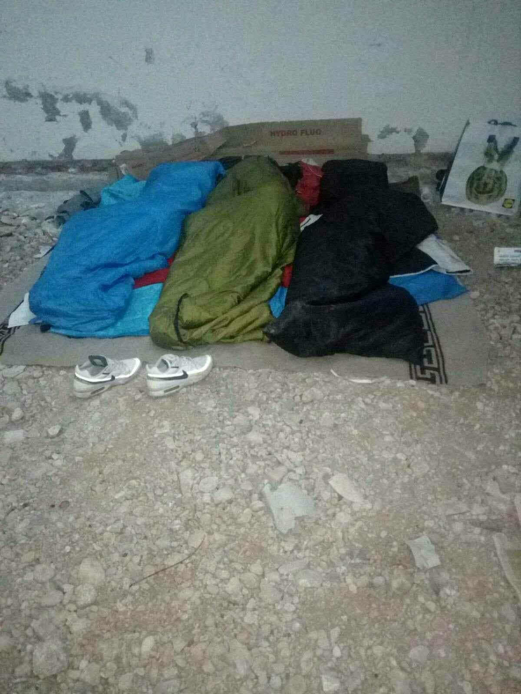
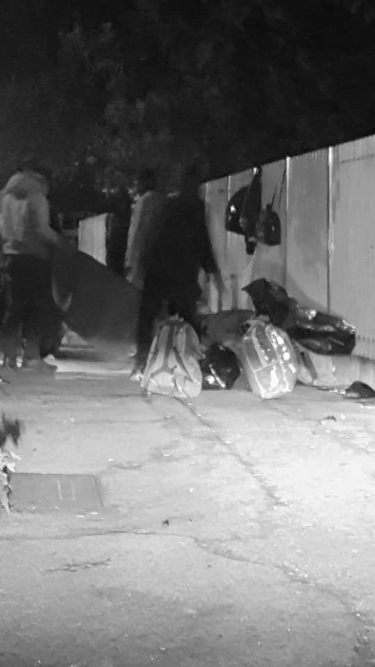
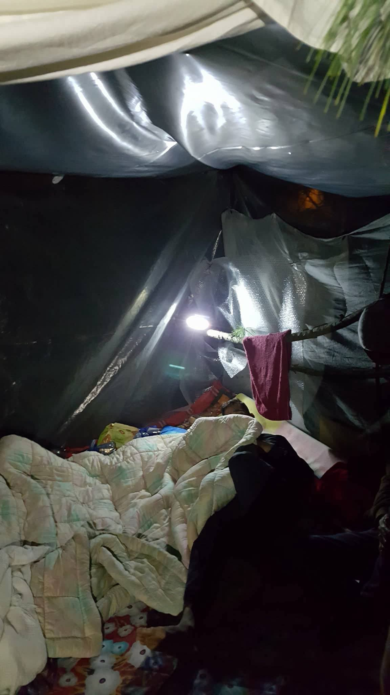
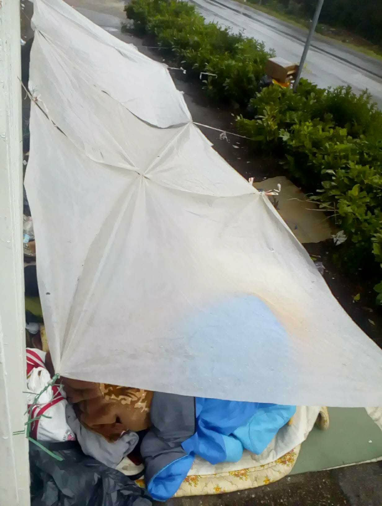
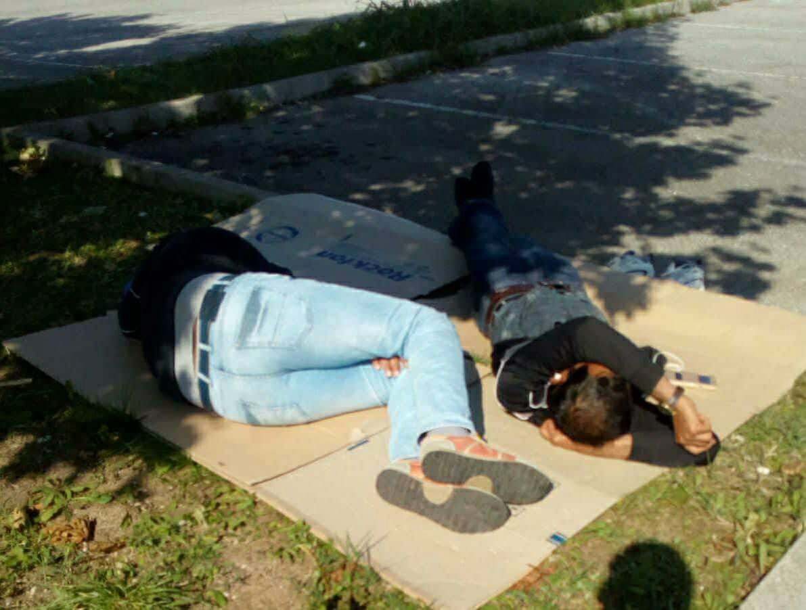
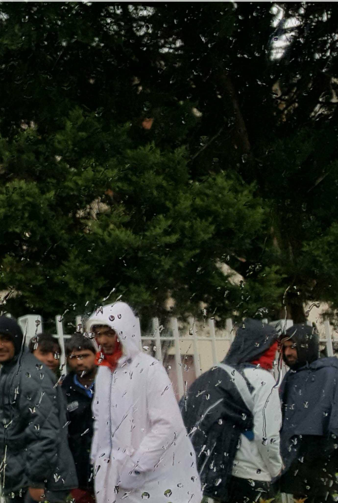

### AYS SPECIAL: Case of Pordenone

_Three years ago, people in Pordenone area in Italy noticed increase in number of people arriving from the Balkans and heading toward northern Europe\. Since than, local volunteers Lorena Fornasir and Gian Andrea Franchi are collecting data on treatment and issues people who are going this way are facing up until now\._

**2014/2015: First arrivals**

Arrivals from the Balkan route started back in the summer of 2014, simultaneously with arrivals of African asylum seekers in the territory due to the national relocation program of migrants from the Southern reception centres\.

Between summer and winter of the same year, the emergency broke out due to the lack of preparation of the reception system\. Refugees, supported by a wide network of local volunteers, lived in a makeshift camp inside the park of San Valentino, evacuated afterwards by the municipality\. Migrants then moved to and slept precariously under a church’s arcade, caught in between the hostility of the church and the support of the sympathetic citizens\. Meanwhile, new co\-operatives were created, but they could just partially take care of the new arrivals\. An average of 25 asylum seekers per night kept sleeping rough while waiting to be accepted into one of the CAS\.

**2015/2016: “Genovesi” case**

Towards the end of 2016, after the last clearance of the church’s arcade, between 40 and 60 refugees were moved and “hosted” inside a big industrial warehouse, managed by a co\-operative\. The reception inside the CAS was not sufficient and therefore it happened that buses from Gorizia, already full of people, stopped in Pordenone to collect more migrants and to take them to an unknown destination\.

Here worth mentioning is the “genovesi” case\. Around 15 young men, in Pordenone since 6 months and who were already attending Italian classes, were taken to Belpiano \(Genova\), inside a structure under investigation and 4 hours away from the closest town\. Isolated and disconnected, they decided to go back to Pordenone and for at least 3 nights they occupy the square in front of the Prefettura, asking to be received by the local community\. Instead, their permit was revoked\.

After that they lived and slept in the streets until spring 2016, when the local authorities agreed to host them in 2 small tents inside a backyard of an abandoned school\.

With the new elections and the establishment of the right\-wing town council, the “camp” was dismantled on the 29th September 2016\. So these group of young men found themselves on the street again, together with the constant new arrivals\. They were, consequently, divided, 6 of them hosted by a co\-operative, 5 of them hosted by local volunteers and the rest left to take care of themselves\. The case of the “genovesi” closes for good in the spring of 2017, when the co\-operative decides the emergency is over and there is no need for their presence anymore\.

**2016/2017: From the Bronx to the street**

From autumn 2016, an average of 40–60 asylum seekers \(with peaks of 80\) had managed to find shelter in the so called “Bronx,” a semi\-covered parking lot in the city centre\.

On the 20th April 2017, 70 migrants were evacuated with a great presence of police officers, local police staff, Carabinieri and Guardia di Finanza \(finance police\) \. Those 70 people were mainly asylum seekers awaiting to complete the procedure for their asylum claims\. From then on, asylum seekers, all identified at the Questura, are living on the streets, waiting to obtain a place inside the Caserma Monti, the local hub\. They sleep in the ditch in front of the Caserma, in the most dangerous, squalid and hidden garage or basement\.

The procedure they have to face is a long one, consisting of these steps:
1. _register their asylum request at the Questura_
2. _the Questura gives the asylum seeker a paper with an identification number that authorises him to go to the Caserma Monti for the medical check_
3. _the medical check is done once a week and is managed by the local health agency, that with their personnel guarantees the vaccinations\. During summer or national holidays it can happen that the personnel is absent, the doctor is there but not the vaccines or viceversa, so the medical checks are cancelled and postponed\. So that determines a prolonged waiting time for the asylum seeker, who, without, the medical check cannot enter the Caserma Monti, remaining on the streets for a longer period\. Usually, after 20–25 days, the asylum seeker can do the check and get the vaccines\. Some asylum seeker, affected by important pathologies or particularly vulnerable, doesn’t catch the attention of the medical personnel because of the quantity of work, concentred in a few hours_
4. _after the medical checks, the asylum seeker is given a health card with which he can go to the Questura again to be fingerprinted_
5. _since the beginning of the year, the Questura has set a \(rather time wasting\) procedure: the fingerprints are taken in 2 steps: first the index fingerprint and then, after another appointment, those of the entire hand_
6. _the Questura gives the asylum seeker a document with the date for the interview and the C3 module \(to finalise the asylum claim\) to be completed and returned_
7. _with this document, the migrant can theoretically access the hub \(Monti\) but he needs to wait until the list reaches his identification number_
8. _if the hub is full \(72 places available at the Monti\), the waiting time on the street is prolonged_

The time span to complete these steps varies between a month and a month and a half, during which the migrants sleep in the street, with an average of 60 people/night and daily arrivals of 6 people, from the Balkan route or pushed back mainly from Germany, France and Austria\.

Vulnerable people or people with pathologies, documented by the A&E, with significant or suspected diseases \(suspected TB cases\), don’t have any particular treatment\. Often they are left by themselves unless activists take care of them\. By doing so, however, they are replacing the public Institutions and Services, covering a serious failure of the public entity\.

The current administration, represented by Mayor Alessandro Ciriani, on October 3rd, 2017, publicly stated to be authorised to use public funding, destined to refugees, to strengthen local police actions to “disturb” the “misfit”, i\.e\. refugees\.

As a consequence, since months and months, there has been in force a harassing practice carried on by the local authorities to guarantee security and the “decorum of public places”, so refugees are continually evicted — both day and night; even a simple backpack on the lawn is a synonym of a “bivouac” situation\.

Following this logic, blankets and sleeping bags donated by MSF are confiscated and, despite pursuing all the bureaucratic routes, it is impossible to having them returned\.

The year can be divided into some phases\.

Between January and February, the “emergency\-cold” was declared, therefore refugees were hosted in some parishes, only for the night and always with a volunteer around\. Every three nights they had to be moved to another church in order to avoid the charge of “hospitality” at the Questura \(with continuous moving around of blankets\) \.

The Red Cross \(CRI\) secured the evening meal and in June, with the end of the school and the start of the summer recreational activities, it continued the distribution inside its headquarters, in a room used as storage and ambulance garage\.

At the same time, in agreement with the social cooperatives accredited for managing the CAS, the CRI attempted to open a dormitory, finding, however, the strong opposition of the municipality, which, in fact, blocked the initiative\.

By October 10th, the Red Cross canteen has been moved 4\.5 km away from the city centre, not far from the hub Monti\. Since then, refugees have to walk more than 4 km, to go and come back, along a busy road, if they want to eat\.

In September, around 40 young men sought shelter for the night in a formal abandoned industrial warehouse, a place that look much more like a dump\.

Being unable to intervene directly, as it was private property, the Mayor issued an order to the owner for the “securing” of the building\. This led to the total closure of the warehouse and the impossibility for anyone to access it\. In addition, the simultaneous presence of private guards called “Rangers” 24 hours a day, ensured the complete control of the movements of refugees around that area and the impossibility to find a night shelter\.

At the moment, in front of the hub \(Caserma Monti\), about 15–20 refugees sleep in the streets every night, while between 30 and 40 young men find a place to sleep in the fields or in sleazy and dangerous places in different parts of the city\. The ones who try to find refuge in the city’s central part, called Bronx \(large semi\-covered parking lot under a large public offices’ complex\), are persecuted by the police, who seize blankets and hunt down the immigrants\.

Alongside this reality, another dramatic, less visible situation is present, the one of the “fuori progetto” and some migrants who received the deportation order\.

At least 12 people sleep and eat in an old, crumbling and dangerous cotton mill, tolerated by the police\. These are former asylum seekers with a regular permit but without any possibility of housing and/or work, or people waiting for a renewal of their permit that they will never receive because they don’t have residency, or simply people kicked out of the CAS for futile reasons\.

Another small group of 3–4 people, usually _fuori progetto_ \(migrants who find themselves outside the reception system\) or awaiting the renewal of their residence permit, sleep occasionally in a container managed by the parish of Vallenoncello, 4 km from Pordenone\.

Regarding the issue of documents by the Questura \(residence permit and renewal\), refugees who can not prove to have legal residence in the city are in fact stuck in a wearying wait that lasts for months, trapped in the paradox of a non\-receivable renewal right\.

This is a very serious problem that is sometimes fuelled by the failure to comply with the regulations by municipalities and managing entities, who deny residence even to those who would be entitled to it as accepted in the system; or involving the refugee who works illegally and lives by those who are not in the position to grant him residence\.

Volunteers, activists of the Rete Solidale, Catholic volunteers belonging to some parishes, in limited numbers, are present with supporting actions, at the same time as CRI\.

DANDOLO CASE

Last but not least, it is worth mentioning what happened inside the CAS of Dandolo\.

Inside an isolated house in the uranium\-polluted countryside, about 20 refugees were living, invaded by mice\. The animals deposited their excrement in flour and rice, ran through the beds, came out of pipes\.

Two local volunteers, two private citizens, activating all the possibilities to collaborate with the administrative bodies, in vain, had to fill up five reports to the Procura \(Tribunale di Pordenone\) before some measures were taken\.

Despite the high risk for health and the possibility of contracting leptospirosis, they had to wait three months and, finally, in March 2017, the Prefettura ordered the closure of the facility and the transfer of refugees\.

FINAL CONSIDERATIONS

Bearing in mind the continuous evacuations from all the places where refugees find shelter, the seizure of blankets and sleeping bags, the harassing practice supported by regular decrees, the purely persecutory attitude of the municipality seems to be obvious, for no purpose other than, to build consensus by spreading hostility towards refugees\.

It is the policy of push backs, rejections, violations of laws currently in force \(DLGS\.142 / 2015\), of violated rights in terms of health and access to treatments, of the overturning of law in favour of actions of contrast and disturbance \(see the mayor’s claims above\) against 50/60 asylum seekers who have the right to stay in the country and receive the means to survive \(and who should get into the Caserma Monti in reasonable times and should not stay more than a month sleeping in the streets, harassed by the authorities\) \.

It is interesting to note that the more we create laws, the more inclined we are to see a prevalence of behaviours violating those laws\. Especially considering the various executives, central and local, that is, in perspective, the prevalence of the executive against the legislative\.

It is the current drift towards an authoritarian democracy, a masked fascism, which takes place at a center level with figures such as minister Minniti and at a peripheral level with figures like mayor Ciriani\.

**_\(Photo and text by Lorena Fornasir, translation from Italian Cristina Guglielmini \)_**

> **_We strive to echo correct news from the ground through collaboration and fairness, so let us know if something you read here isn’t right\._** 

> **_If there’s anything you want to share, contact us on Facebook or write to: areyousyrious@gmail\.com\._** 

_Converted [Medium Post](https://medium.com/are-you-syrious/ays-special-case-of-pordenone-c3a70d404b7d) by [ZMediumToMarkdown](https://github.com/ZhgChgLi/ZMediumToMarkdown)._
