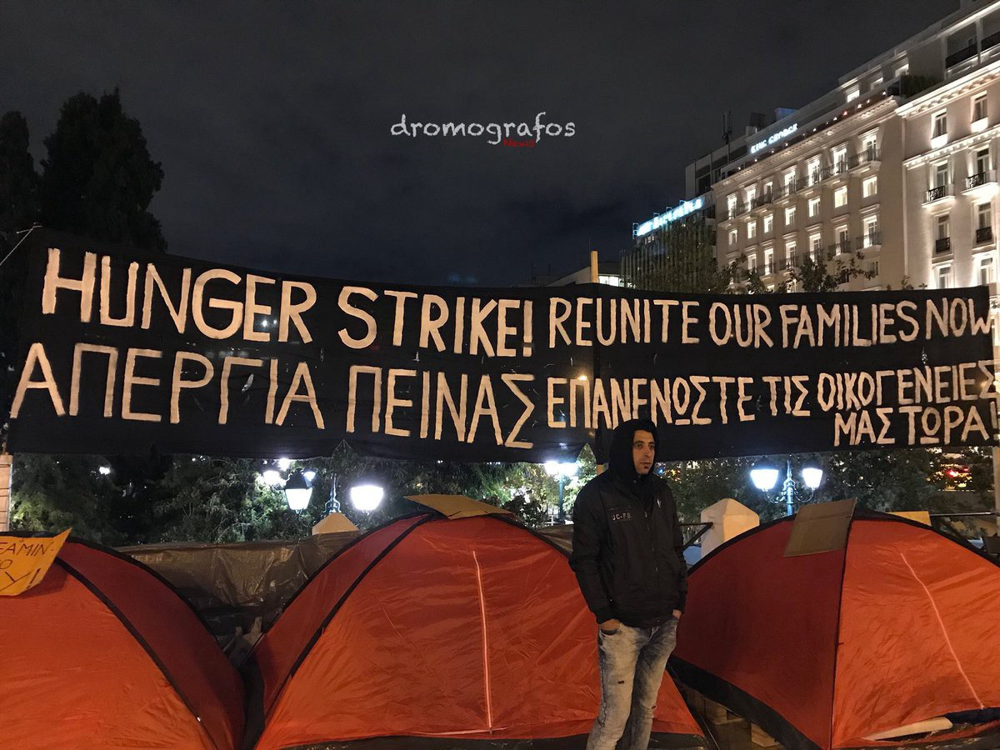
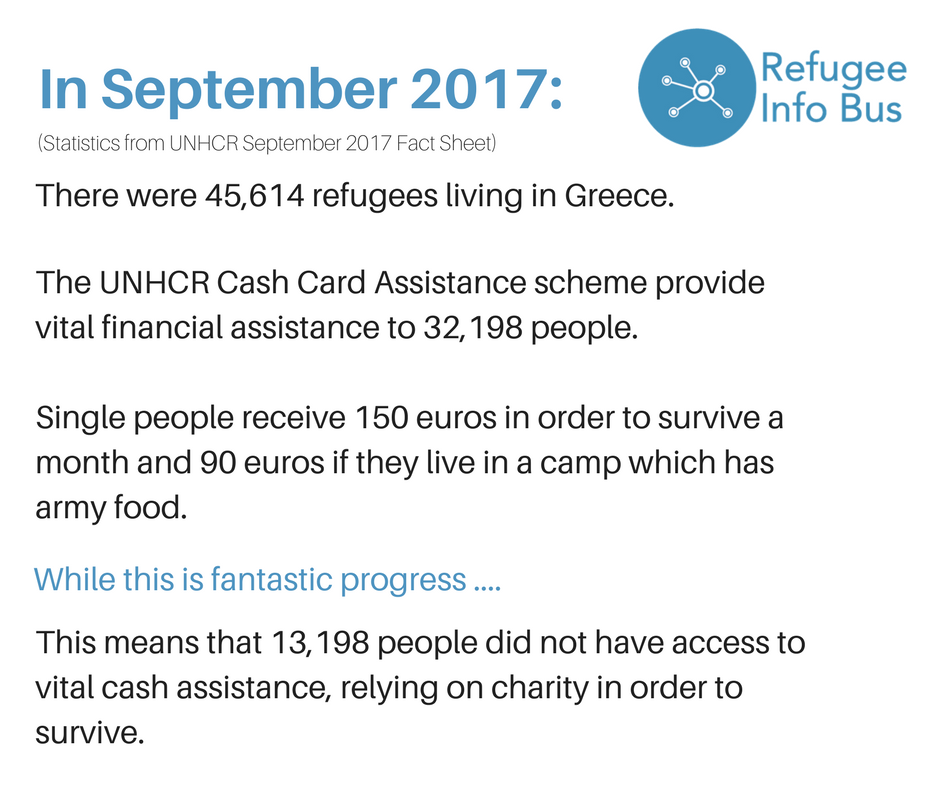
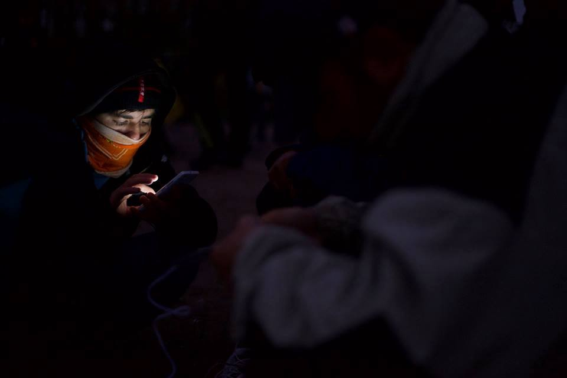

### AYS Daily Digest 01/11/17: Hunger strike — Take us to our families\!

900 people rescued at sea // 5 on hunger strike hospitalized, more join // Thousands still without cash cards in Greece // Claims of fast track deportations to Turkey // Germany slowing down asylum processes // Arrivals to Italy dropped 70% // Volunteers needed for winter // and more

### Feature

Another protest started today, this time in the heart of Athens, in front of the parliament at Syntagma square to demand the reunification of families, in particular to Germany\. The protesters started a hunger strike, another one, to put pressure on the asylum services to speed up the extremely slow process and give them a long waited solution\.

It was widely reported today that a group of mainly Syrian women and children who have been stranded in Greece placed tents at 11am in front of the Greek parliament to protest against delays in reuniting with relatives in Germany\. Some of the refugees have been in Greece for over a year\. With the reports last May that Greece and Germany informally agreed to slow down refugee reunification \(this is denied by Greece\), it is understandable that levels of stress among refugees take them to extreme measures like a hunger strike, already seen over and over again throughout Greece and beyond\. At this moment there is also a hunger strike happening in Lesvos to protest against the terrible conditions refugees have to endure on the island\.

](assets/f91142e70ff0/1*4Dtc6HtnpGZe3htf8BzlSg.jpeg)

Picture by [**dromografos News‏**](https://twitter.com/dromografosNews)

The government has defended itself saying that the reunification efforts are speeding up and increased 27% this year compared with last year\. Migration Minister Yannis Mouzalas also said that refugees whose applications have been accepted will eventually go to Germany even if there are delays\. He also denied that refugees had to pay for their flights\. In theory this is true and everyone is entitled to have free travel for reunification\. However according to our sources and as reported by AYS previously \(read it [here](slow-reunification-process-leaves-family-separated-for-a-long-time-185e5835e73d) \), many refugees end up paying for their reunification flights to speed up the process, as the government often takes longer than the 6 months given to complete the process\. On top of this, there is only one travel agency allowed to sell tickets to refugees for this purpose, Himalaya Travel, which is very expensive\. Once again, the ones with resources can dodge the failings of the system while the most vulnerable get left behind\.

The protesters demand their fundamental right to family reunification and a dignified life, which means basically what law tells us to provide\. Other specific demands include:

1\. The Greek and German governments to respect the legal limit of 6 months to reunify families from the DATE OF ACCEPTANCE;
2\. The Greek and German authorities to charter flights immediately for all who have waited for more than 6 months;
3\. The Greek authorities to pay for their flights as provided by law\.

](assets/f91142e70ff0/1*B7AVrJbE1D_4VKKcXPqCkA.jpeg)

Photo by [**Refugee Accommodation and Solidarity Space City Plaza**](https://www.facebook.com/sol2refugeesen/?hc_ref=ARRjaoRaqZzWQ12BJsEczsyjsYPk1Jx0_je37EgfT0GE7mmsXSM9HDGs3N-Mf8khTsg)

City Plaza posted a call for solidarity about this initiative:

> CALL FOR SOLIDARITY
 

> 7pm today Wednesday solidarity assembly\!
 

> 11am tomorrow Thursday press conference\! 

> We are 11 mothers and fathers, wives and husbands who start a hunger strike on November 1st 2017 in the centre of Athens\.
 

> We struggle for our all right to family unity and a dignified life in freedom and peace\. 

> We are only a few among thousands of refugee families who wait in Greece to reunite with their beloved in Germany and other countries in the EU\. 

> We are in Greece since more than 1 ½ years and have suffered from the inhuman living conditions in the tent camps and hot\-spots\. 

> Currently, more than 4,500 people in Greece are waiting to travel to Germany and 1,500 of them have their acceptance already since more than 6 months\. Some others have been even rejected to join their families from the beginning and others still struggle right now for their right to go\. 

> We invite you, our sisters and brothers, to join our struggle and show your solidarity through your presence\. Lets join hands and stand together\! 

> For our right to be a family\!
 

> For equal rights and against any form of discrimination\!
 

> For the right to live in freedom and peace\!
 

> For freedom of movement\! For the right to stay\!
 

> No borders\! No prisons\! No deportations\! 

](assets/f91142e70ff0/1*P0BQwGa08JTTR36kWyaBow.jpeg)

Photo by [**Gabrielle Tan**](https://www.facebook.com/gabrielle.tan?hc_ref=ARRDUM6rnn3Xqeo3Rx4ujIacCxIougnDR7Ik12aj1y5Dqk-O5S8NCCWsTNYTTEwlggs)
### Sea

It was a very intense day today in the Mediterranean\. Unfortunately 7 bodies were discovered in a boat adrift off Libya while around 900 refugees were rescued, the Italian coast guard said as reported by Reuters\.

[**SOS MEDITERRANEE GER‏**](https://twitter.com/SOSMedGermany) has made various updates of the difficult situations throughout the day and reported that after a day of rescuing 3 rubber boats, [SOSMedGermany](https://twitter.com/SOSMedGermany) and [MSF\_Sea](https://twitter.com/MSF_Sea) teams welcomed more than 500 people who are now safe\. The second rescue they had to do was very difficult and turned critical with dozens of people jumping into the water before life jackets were distributed\.

](assets/f91142e70ff0/1*QXcrK6i5IX_hQMEpuO8FrA.jpeg)

Photo by [**SOS MEDITERRANEE GER‏**](https://twitter.com/SOSMedGermany)

> “Unfortunately under such circumstances it is impossible to be certain that everyone has been recovered” 

](assets/f91142e70ff0/1*CHlDoVzSod_3PIM_X4QkUQ.jpeg)

Photo by [**MSF Sea**](https://twitter.com/MSF_Sea)

[**MSF Sea**](https://twitter.com/MSF_Sea) also reported about today’s operations and how a medical team performed CPR on one man who was successfully revived then moved by an Italian Navy helicopter\.
### Greece

The hunger strike continues on Lesvos and is now on its 14th day in Sapfous, Mytelini\. Five female refugees, four of whom are minors have joined the other protesters\. Sadly 5 of the refugees, that have gone all these days without food, had to be transferred to hospital to receive treatment as reported by the activist [**Arash Hampay‏**](https://twitter.com/AHampay) **\.**

](assets/f91142e70ff0/1*BngJINMP_xiP0lT1D3vdAA.jpeg)

Photo by [**arash hampay‏**](https://twitter.com/AHampay)
#### Islands

According to the reports of volunteers on the ground, there were 139 arrivals today on Lesvos:
- First boat with 25 people in the north coast
- Second boat with 54 people in the south coast
- Third boat with 60 people in the south coast

Many people continue to arrive in Greece daily congesting the islands\. The Greek government is considering emergency measures to house refugees confined to Greek islands over the winter months\. Mouzalas said today that the government is considering emergency measures to house migrants and refugees confined to Greek islands over the winter months\. These measures were put in place last year when the extremely cold weather and snow fall put many refugees in life threatening conditions but had a limited effect as there are almost 8000 thousand people stranded on Lesvos alone\.

There are reports of fast track deportations from the Greek islands to Turkey targeting north African and Asian refugees, as reported by [HarekAct](http://harekact.bordermonitoring.eu/2017/11/01/racist-and-illegal-fast-track-deportations-target-north-african-and-asian-refugees-in-greece/) \. As reported, refugees from so\-called “undesirable” countries are being jailed upon arrival to the Greek islands, before being put through a summary fast\-track asylum procedure and returned to detention in Turkey within a matter of weeks\. They are reportedly being denied access to lawyers or doctors at the notorious Section B detention centre on Lesvos\. As stated by [Advocates Abroad](https://advocatesabroad.org/) , the fast\-track programme formally known as the “Pilot Project” is a “racist policy” which is “exclusionary and illegal\. Period\.”

Volunteers are needed on Lesvos to join a team of lawyers, the minimum time required is 3 weeks but expenses are covered\. If you have the skills please get in touch [here](https://twitter.com/MarianaGkliati/status/925724266733162496) \.
#### Mainland

Asylum service workers have today started a 2 day strike to demand a permanent job and the payment of their wages for September as reported by eKathimerini\. Workers have warned they may escalate strike action which can further disrupt the processes for thousands of refugees in the country\.

[**Refugee Info Bus**](https://www.facebook.com/RefugeeInfoBus/) has been researching the cash card cover for refugees in Greece and worked out that many still don’t have access to this basic support provided by UNHCR\.

You can consult the official data [here](http://data2.unhcr.org/en/situations/mediterranean/location/5179) \.

Volunteers are still needed on mainland Greece and [**We Are Here — Community Centre**](https://www.facebook.com/WeAreHereCentre/?hc_ref=ARQKwoVzpWwTr5_LC1NpTssnPM46pdDjeFgc_AgwrCMj0CzLmF3tsxOgxF6tWnL83oU) is in need of people to come and join their team of volunteers in Nea Kavala refuee camp in Northern Greece\. The situation has largely fallen out of the news and grassroots groups across Greece are facing a fall in volunteer numbers for the upcoming months so if you can, please get in touch with them\. They do a range of educational and recreational activities for adults and children — English classes, sports, arts and crafts, a library, a space, cooking, dance, and music\.

](assets/f91142e70ff0/1*cX-2leFzG4Om1tCb6DIX4A.jpeg)

Photo by [**We Are Here — Community Centre**](https://www.facebook.com/WeAreHereCentre/?hc_ref=ARRqmrteKi5z-rO7xAzVz1rJI92we45QbdoinFPSB47YB6xdzv16IFgc9GUKRi5UDWU)

In Athens, the project ONE STOP is at synAthina, Athinas Street, 55 every Wednesday and Sunday afternoon\. They create a small corner open to anyone that wants to have access to free services and activities that should be available to everyone\. First aid, laundry, showers, haircuts, warm food, music, games with the kids, legal advice and important information about human rights shape the effort of this initiative to bring people closer\. Please follow the [link](http://steps.org.gr/en/one-stop/) for more information\.
### Serbia

[**Help\-Na**](https://www.facebook.com/HelpNa/) reports on the situation in northern Serbia around the border with Hungary where the situation of the refugees is desperate\. Without food, without adequate clothing to cope with the low temperatures at night, with the winter coming, living in the open and hidden in the forest without tents, without a place to shelter or to rest from the inhumane trip which has become the arrival in Europe\.
The NGO [**Humanity Wings**](https://www.facebook.com/hwmaresme/?hc_ref=ARSfWyNkLRVlPNX5W28Z6fLpCiJe_0Z8miNmShRfnXfN78spISBV3UxEoQW0HeDd4X0&fref=nf) appeals for volunteers and donations needed to cope with the harsh situation that several hundred refugees are living in\. Please consider helping\.
### Germany

German authorities have been taking far longer to process asylum requests compared to the beginning of the year, according to German daily _Nüremberger Nachrichten_ \. Citing an internal document from the Federal Office for Migration and Refugees \(BAMF\), the newspaper said on Tuesday that the number of cases processed per month fell from 50,000 in the first months of 2017 to between 15,000 and 18,000 in recent months\. Almost 52,000 older applications were still unprocessed by the end of September with some of those applications stemming from 2015\. Authorities had earlier said they wanted to process all applications that were started in 2016 before May 2017\.
### Malta

Malta has won praise for meeting its commitments as part of the EU’s refugee relocation program but many say the country is not doing enough to support the new arrivals\.

[The fate of refugees in Malta | DW English](http://www.youtube.com/watch?v=WN4MUddVpRU)
### Italy

Refugee arrivals in Italy have dropped nearly 70 percent since summer as a deal with Libya blocked boats and would\-be asylum seekers are using other routes into Europe\. Nearly 150,000 refugees have crossed the Mediterranean so far this year, but the number landing in Italy is down by 30 percent compared to last year, and has plunged a whopping 69 percent since July, Italy’s interior ministry said this week\.

Arrivals in Spain, meanwhile, have more than tripled, with over 14,000 arrivals this year compared to 12 months ago\.

The route to Italy was largely closed down at the end of June by a controversial deal Rome made with Libyan authorities, tribal leaders and, according to Libyan sources refuted by Rome, human traffickers\. The UN’s refugee agency said last month it had found and rescued more than 14,500 people held by traffickers in appalling conditions in and around the Libyan coastal city of Sabratha\. This city has become famous for being the main port for human trafficking in Libya and where countless militias operate and fight each other for this profitable market\.

In other news from Italy, it was reported also today that Italian police found **227 migrant workers trapped in forced labour conditions** in Sicily\. Eight arrests have been made and legal proceedings launched against 33 farming companies across the island\. As reported, there is widespread forced labour and sexual exploitation of Romanian women employed as seasonal agricultural workers in Ragusa, one of Italy’s largest vegetable producing regions\. You can read the full report [here](https://www.theguardian.com/global-development/2017/oct/31/terrible-conditions-police-uncover-abuse-and-exploitation-on-farms-in-sicily) \.
### France

[**Mobile Refugee Support**](https://www.facebook.com/MobileRefugeeSupport/?hc_ref=ARQQoiaA8JWjjQEnVZU0cFzT2v9Z4MWy34vW-HEJUBgD2MdLr2_BAKFtNOfupdHTSWY) reports from the north of France where winter is slowly but surely arriving and conditions are deteriorating for the hundreds of refugees living in those areas\.

> The harshness of the approaching winter months is already beginning to be felt in the Calais and Grand\-Synthe camps\. Abiding by our schedule that we have maintained since early June, our distributions and time spent on\-site with our generator are being enveloped in pitch darkness\. The difficulties faced while working are only exaggerated in the dark, and it becomes difficult to distribute fairly and maintain everyone’s security when they leave their phones at the generator\. 

### UK

[**Help Refugees**](https://www.facebook.com/HelpRefugeesUK/?ref=gs&hc_ref=ARTdyOt3TaKKS82FgrbxZrkHzw56ZmKFonNz5wA3dttkyoQrvjwM0HpZmLOLPPMrfSA&fref=gs&hc_location=group) reminds us there is a debate in parliament tomorrow on child refugees in Calais and across Europe and urge people from the UK to write to their MPs to tell them to attend the debate and stand up for the rights of refugee children\. To do so please follow the link [here](https://helprefugees.org/dubs-amendment-write-mp/) \.

> **_We strive to echo correct news from the ground through collaboration and fairness, so let us know if something you read here isn’t right\._** 

> **_If there’s anything you want to share, contact us on Facebook or write to: areyousyrious@gmail\.com\._** 

_Converted [Medium Post](https://areyousyrious.medium.com/ays-daily-digest-01-11-17-hunger-strike-take-us-to-our-families-f91142e70ff0) by [ZMediumToMarkdown](https://github.com/ZhgChgLi/ZMediumToMarkdown)._
