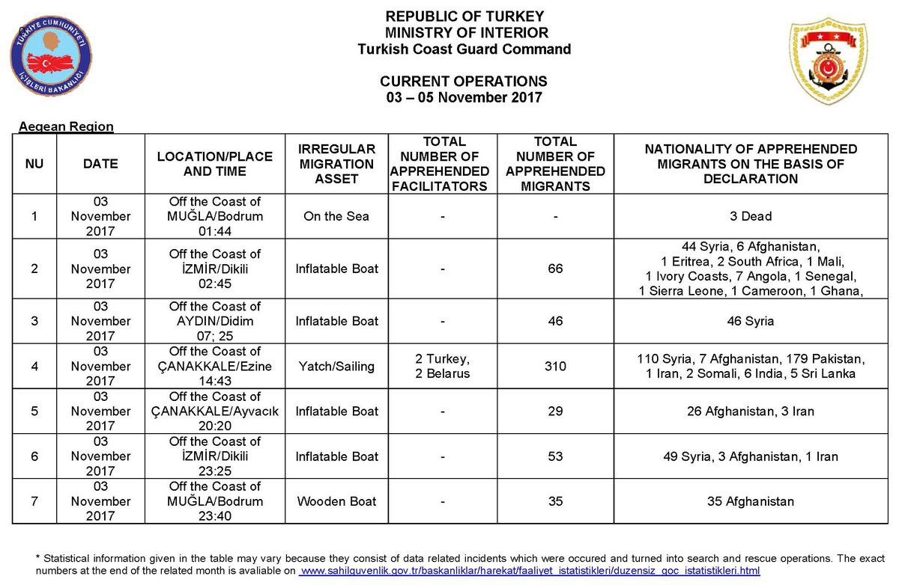
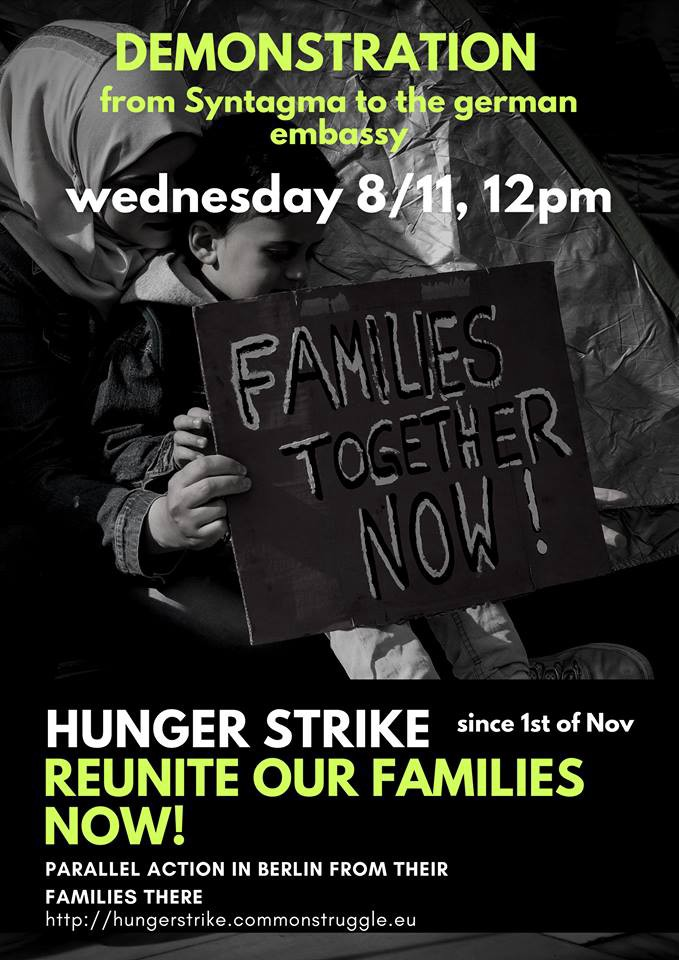
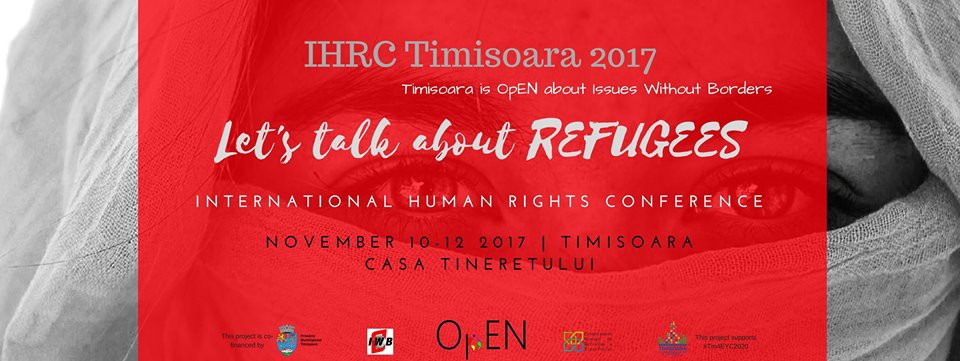
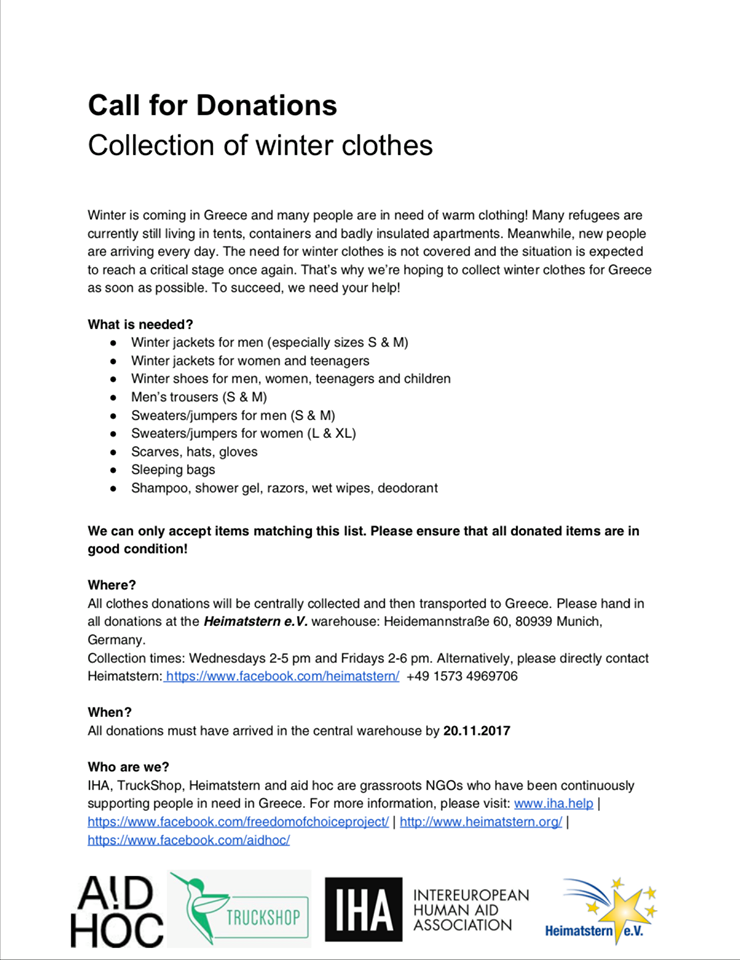
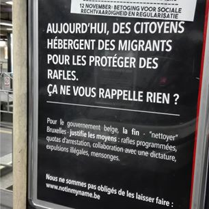

### AYS Daily Digest 7/11/17: Solidarity will beat hate\!

Hunger strikes continue // Call for new protests // Sea\-Watch issues statement about Libyan coast guard // More rescues at sea // Call for help in Germany // 1,000 refugees freezing on the streets of Paris // and more

](assets/908a6f714a41/1*D0kLPy9l0vhBzjgcrkGc1Q.jpeg)

Photo by [**Art Against**](https://www.facebook.com/artagainstproject/)
### Feature

The Greek Supreme Court prosecutor Xeni Dimitriou ordered today an investigation into last week’s attack by unidentified racist vandals on the home of an 11\-year\-old Afghan boy in the Athens suburb of Dafni\. The boy, Amir, had been chosen to carry the Greek flag at an Ochi Day \(No Day\) parade that commemorates the 1940 anniversary of Greece’s refusal to ally with the Axis powers in World War II\. However, he was not allowed to carry the flag and instead carried the school’s sign\.

A previously unknown group calling itself Krypteia on Monday claimed responsibility for the attack and an anonymous caller told the Iefimerida website that the group will “fight until the last illegal immigrant has gone” and “will use violence, mercilessly\.”

After what happened Greece’s Prime minister received the boy and his mother who wrote an open letter to him exposing what are really their concerns that are common to thousands of other refugees in Greece, asking for help to reunite her family\. The letter was published by the Greek Forum of Refugees and can be read [here](http://refugees.gr/press-release-mother-amir-writes-letter-prime-minister-concern-us/) \.

> Solidarity is our weapon\! 

The racist attacks need to be fought not with violence, but with justice, and increse the solidarity between everyone to show the attackers that intolerance will never win\. Today, that was exactly what happened, and more than 400 people gathered in Athens at a demo in solidarity with 11 year old Amir from Afghanistan\.

](assets/908a6f714a41/1*QCxQ5WOZN-FfdgLiKksnXw.jpeg)

Photo by [**NoBorders**](https://www.facebook.com/nobordersnetwork/)

> Amir’s family has been divided between Germany, Lesvos and Athens, for 1,5 years by politics and borders\. 

### Sea

Today, 67 refugees have been rescued off the coast of Tunisia after their boat began to sink, Tunisian authorities have announced\. The Ministry of Defense has said also that the rescue operation took place about 80 kilometers off the coast of Sfax \(Tunisian port city in the northeast\), adding that the rescued were all Tunisians — 50 men, 6 women and 11 children \. He also said that all of them have been transferred to a naval base in Sfax and handed over to the National Guard, without further details, according to the Tunisian news agency\.

Also today, [**SALVAMENTO MARÍTIMO**](https://twitter.com/salvamentogob) has managed to rescue 93 people from 2 boats, one with 37 and the other with 56, close to Alboran, a small island between Morocco and Spain and will be transferred to Motril, in mainland Spain\.

After yesterdays incident that caused the death of 5 refugees when the Libyan coast guard interfered in the rescue attempt being done by Sea\-Watch in international waters, this group has published a clarification \(that you can read [here](https://sea-watch.org/en/clarification-on-the-incident-of-november-6th/) in full\) of what happened since the Libyan coast guard has been trying to cast the blame to them\.

> An Italian navy helicopter, a French warship and the Sea\-Watch 3 were coordinating effectively via marine radio channel 16\. According to the protocol for such situations, the ship best equipped for the rescue operation takes over the ‘On\-Scene Command’, so the French warship and the helicopter acknowledged Sea\-Watch 3 as such and tried to take the necessary steps to coordinate and carry out the rescue together calmly\. 

> However, a patrol vessel of the Libyan Coast Guard was not willing to respond to radio calls, both from Sea\-Watch 3 and the military units present to help coordinate the rescue\. Instead, the Libyan patrol boat closed in at high speed — even though it is not an appropriate vessel to take people out of the water compared with the other assets on the scene, due to its shape and equipment\. The Libyan coast guards did indeed take out people from the water, but mainly, people climbed onto the Libyan Coast Guard vessel themselves in fear of their lives without assistance by the coast guards\. The Libyans’ aggressive and uncoordinated behaviour caused more stress and chaos than relief\. When the Libyan Coast Guards started to beat and threaten people on their vessel, some tried to jump back into the water\. Instead of calming the situation down, Libyan Coast Guards even threw potatoes and lifebuoys at the Sea\-Watch rescue boats that were deployed to take people out of the water\. 

In the meanwhile, the Libyan coast guard said it would hold a press conference tomorrow about the incident\.

Let’s not forget that the Libyan coast guard is financed by Italy following an agreement between the governments to reduce sea crossings to Europe\. After this incident it’s clear that the European governments have to reassess their cooperation with the Libyan authorities, investigating what is happening with real will to act and make sure these violations stop\. It’s everyone’s duty\.
### Turkey

Between the 3rd and the 5th of November, the Turkish coast guard intercepted more than 500 people trying to reach Greece\. They also detained 4 smugglers and recovered 3 dead bodies from the sea\.

### Greece

Today, Lesvos Mayor Spyros Galinos strongly criticized the government for not living up to its promises to ease crowded conditions at accommodation centers sheltering asylum seekers on eastern Aegean islands, saying **nothing has been done,** reports Ekathimerini\. Also, the Lesvos municipal council expressed its opposition to talk about the creation of a new accommodation center to deal with overcrowding\. It called for the immediate decongestion of all existing centers, with the transfer of some asylum seekers to the mainland which would ensure respectable living conditions\.

> “opposed to the effort to turn Lesvos from an island of humanity and solidarity into a prison for thousands of people\.” 

Unfortunately Lesvos, like the other hotspot islands have been turned into prisons for too long and with the continuous arrivals and insufficient transfers to mainland, the situation tends to get worse, especially with the winter arriving so quickly\.

As reported by [**SMH‏**](https://twitter.com/smhumanitario) volunteers, it was very cold on Chios, 8 degrees at dawn, when **24 refugees** arrived, 14 men, 4 women and 6 children\.

On Lesvos there were reported **57 arrivals** on the south shore\.

The **official registrations** today on the islands were:

Lesvos 56 \(33 transfers to mainland\)
Chios 0 \(2\)
Samos 45 \(59\)
Kos 0 \(11\)
Others 7 \(0\)
Total 108 \(105\)

On Lesvos the hunger strike continues and is now on the 20th day\. Some protesters who are in very bad shape have been sent to the hospital\.

 ‎](assets/908a6f714a41/1*T-v0F18Ky0SC6v1XzkRxSA.jpeg)

Photo by [**Arash Hampay**](https://www.facebook.com/arashampay) ‎

Also today, the activist [**Arash Hampay**](https://www.facebook.com/arashampay) ‎ announced that he is joining the protest and beginning a hunger strike too, as he did before\. This is his statement:

> This is an announcement of the start of my “hunger strike” in solidarity with the male and female refugee hungerstrikers\. About forty sheltered people who have taken refuge in the European Union are left in the cold air, without food and heating, twenty\-four hours a day in the city of Mitlyini\.
 

> Five women have struggled through the seventh day of their hunger strike, and neither the Greek Government nor the United Nations, nor the European Union nor the parliamentarians have shown any response to this human tragedy\!
 

> As a human being who is witnessing the lack of human dignity, I cannot be indifferent, indifferent to the infant child who wanders around the streets twenty\-four hours a day in cold weather, indifferent to eventually risking the deaths of these female hunger strikers\. 

> Getting their right to freedom is irrelevant to the EU doctors and ambulances in emergency times who refuse to aid a hungry woman who is sitting in the cold\! 

> I feel indifferent to the threats of the police, instead of providing security to the refugees they harass them, I feel indifferent to all the fascist and inhumane reactions that I have seen so far\!
 

> I know that this hunger strike for me, which has not been a long time since the end of my forty\-one\-day strike, is very dangerous, but more dangerous is this silence and tragedy that happens in front of my eyes\.
 

> With this unlimited hunger strike, I have a message for the government and the police, the United Nations and the European Union and parliamentarians, the message is that your behavior with the affected people is more ridiculous, more dirty and inhumane than the behaviors of dictatorial regimes like Iran and Saudi Arabia\.
 

> My message is that you are no longer allowed to remain silent about your atrocities, the human trade and crushing human dignity\. My message is that I will continue to strike food until the day you end this human disaster in the city of Mytilini\. 

](assets/908a6f714a41/1*nelUfr6ug_V2cK65B-YQzQ.jpeg)

Photo by [**Arash Hampay**](https://www.facebook.com/arashampay)

**People** living packed against each other, for months, without any prospects of getting out of that situation and even facing deportation that in many cases will lead to prosecution by their governments or simply just the return to a war zone cause often **People** to completely loose hope in life\.

In a day of bad news, we also get reports of a lawyer who was brutally attacked by 20 members of the Golden Dawn outside the court that sees the same party members accused of further aggressions\. She is called Eugenia Kouniaki, is a Greek lawyer and defends refugees\.

](assets/908a6f714a41/1*i1gROrR6uO1ipfncr7EsYQ.png)

Photo by [**Saverio Tommasi**](https://www.facebook.com/SaveTommasi/)
#### Mainland

In the capital, where another extreme situation sparked an hunger strike, people continue to demand the unification with their families in Germany\. It is day 7 of the protest that took 7 men and 7 women to stop eating, demanding their rights to be fulfilled… and today the Greek asylum services finally answered but not to everyone\.

Today the asylum service has informed two of the hunger strikers that their tickets were issued and they can travel to Germany\. The two women decided to continue the protest and the hunger strike until the struggle of the refugees for family reunification is justified\. For some people solidarity is more than a slogan\.

](assets/908a6f714a41/1*Ny_7UlIJ8izqPLw6PGVKBw.jpeg)

Photo by [**Απεργία Πείνας Προσφύγων/Hunger Strike: “Reunite us with our families now”**](https://www.facebook.com/hungerstrike4familyreunification/?hc_ref=ARSF-QJG1C-I1Bt3_T9AEeGXHV3bK-GVpA8w5qNJGR02SybKdI1N6q5qLmY627H3ZX8&fref=nf)

](assets/908a6f714a41/1*5exEiiAKZ_QXvBp2KlQ6Uw.jpeg)

Photo by [**Απεργία Πείνας Προσφύγων/Hunger Strike: “Reunite us with our families now”**](https://www.facebook.com/hungerstrike4familyreunification/?hc_ref=ARSF-QJG1C-I1Bt3_T9AEeGXHV3bK-GVpA8w5qNJGR02SybKdI1N6q5qLmY627H3ZX8&fref=nf)

There was also a call today for another demonstration, in front of the German embassy, tomorrow at 12 pm\.

> They are calling on all of us to be at Syntagma on Wednesday 8 November at 12\.00, when we will march towards the German embassy, one week after the beginning of the hunger strike, as a show of support to their struggle\. 

> **Their relatives in Berlin will be protesting at the same time\.** 

> Victory to the hunger strikers\! 
 

> Schedule flights for reunifications immediately\! 
 

> Family reunification for refugees now\! 

In another subject, [**InterVolve**](https://www.facebook.com/InterVolve-219418945063168/?hc_ref=ARQSN6HeRtQEm1N4RPYCwrZHX5W43NyThLQ-VWS-RUTa5B83OE0_7SK7ObpI2Blvb4w) denounced today how children in Koutsochero camp haven’t had the opportunity to start school this year, unlike many refugee children across Greece, although having received asylum in the country\. Also, the the regular children’s and youth programs on site have also been temporarily suspended, meaning that for the last month InterVolve has been providing the only structured daily activities for the children here, who number around 200\.

In better news, on the 31st of October, it was announced that the U\.S\. Embassy in Greece will once again provide refugees with scholarships to take college courses\. The next course will start in the spring and if you are interested or know anyone interested, please follow the [link](http://blog.refugee.info/college-scholarships-greece-spring-semester/) to apply\. The deadline for applications is **November 24** , and the selection process has already started\.
### Serbia

UNHCR has published an update regarding the last week of October and first of november \(30th till the 5th\) and states that there were **4,585 new refugees** , asylum\-seekers and migrants in Serbia, of which 4,102 were accommodated in the 18 government centres\. According to these officials, on 31 Oct authorities transported to Presevo Reception Centre 188 refugees and migrants who had been sleeping rough in the northern area around Sombor\. UNHCR and partners assisted 208 newly arrived asylum seekers\. 32 % of all arrivals were minors/children\. Most had left Pakistan \(36%\), Iraq \(34%\), or Afghanistan \(10%\), between one week and one year ago\. More than half had traveled through Turkey, Greece and Macedonia and about 40% via Turkey and Bulgaria\.

Also according to these records, in October, 734 individuals registered intentions to seek asylum in Serbia\. 48% were made by men, 14% by women and 38% were registered for children\. Most applications were made by citizens of Iraq \(36%\), Afghanistan \(21%\), Pakistan \(20%\), Syria \(3%\), and other nationalities \(20%\) \. One person was granted refugee status and nine persons were granted subsidiary protection, making a total of 13 positive first\-instance decisions by the Asylum Office in 2017\.
### Romania

A conference will take place in Tamisoara aiming at bringing together university and high school, lecturers and NGOs representatives, journalists and youth workers closer to the Human Rights field\.
This first edition of IHRC Timisoara has as main topic the REFUGEES\.
11 European young experts in fields related to REFUGEES will hold 8 presentations \(followed by Q&A sessions\) and 9 dynamic workshops, for the first time in Timisoara\.

### Germany

There has been an **urgent appeal for donations** in that can be dropped off in several cities around the country\.

The places you can take the donations to and the contacts are the following on the list:

Berlin : [Nora Bröhan](https://www.facebook.com/nora.brohan?fref=gs&hc_location=group) / [Kristina Strübing](https://www.facebook.com/kristina.strubing?fref=gs&hc_location=group) 
deadline: 17\.11\.

Marburg: Mo\. \-Fr\. 16–19, Biegenstraße 29, contact: kleidersammlung\-marburg@mail\.de
deadline: 17\.11\.

Münster: Mo\. \-Th\. 12–16, Baracke, contact: [Helena Elz](https://www.facebook.com/helena.elzraimbault?fref=gs&hc_location=group) , 
deadline: 15\.11\.

Offenbach: Mo\. \-Fr\. 9:00–17:30, Fr\. 9:00\- 16:00, contact: 069 83 83 46 51 / [Andreas Bender](https://www.facebook.com/andreasbender1977?fref=gs&hc_location=group) , 
deadline: 16\.11\.

München: We\. 14:00–17:00 and Fr\. 14:00–18:00, Heidemannstraße 60, contact: [Heimatstern e\.V\.](https://www.facebook.com/heimatstern/?ref=gs&fref=gs&hc_location=group) / \+49 1573 4969706, 
deadline: 20\.11\.

Altenstadt / Schongau: Drop off on appointment\.
Contact: [The Protec Bros](https://www.facebook.com/theprotecbros/?ref=gs&fref=gs&hc_location=group) / 01578 7311824 / theprotecbros@posteo\.eu
NO DEADLINE\!

Nürnberg/Feucht: We\. 16–20, Schwarzwasserstraße 5 
90537 Feucht, contact: Paul Kretschmer, 0152 03714293

Also there is another **URGENT APPEAL** from **Leipzig** there’s the need to move the biggest donation collection & distro center so they are asking for anyone around to give a hand to empty it\. They have experience in sending donations to the Balkans but anyone who needs donations please get in touch\. Christoph \+4916094860456 \(Whatsapp\) \.

As mentioned before, there will be a demonstration in Berlin tomorrow in support of the protesters doing the hunger strike in Athens\.

](assets/908a6f714a41/1*tE6iJmJEaAlAHTc0fcYoDw.jpeg)

Photo by [**dromografos Int** ‏](https://twitter.com/dromografosInt)
### France

The situation in Paris is becoming desperate as around 1,000 refugees have to sleep on the streets of the city\. [**Paris Refugee Ground Support**](https://www.facebook.com/PRGS.team/?ref=gs&hc_ref=ARRlrPioY76S1-RuPJhqz1UkBVLjTu-aeg53lRg0RViGt6LZpKAHMCC-eQPESS9itlI&fref=gs&hc_location=group) are doing what they can to help but they also need our contributions to be able to operate\.

> \* \* \*Zero degrees\* \* \* 

> 960 people found tonight\. 

> We’ve gone through half our winter stock in two nights\. 

> We need life saving, quality blankets, sleeping bags and anything warm that is going to keep the people from freezing on the ground in the street\. 

](assets/908a6f714a41/1*I9y34rawdmJADEh-npDO4Q.jpeg)

Photo by [**Paris Refugee Ground Support**](https://www.facebook.com/PRGS.team/?ref=gs&hc_ref=ARRlrPioY76S1-RuPJhqz1UkBVLjTu-aeg53lRg0RViGt6LZpKAHMCC-eQPESS9itlI&fref=gs&hc_location=group)

](assets/908a6f714a41/1*Oph-L79J1I4LqtEaWIVjuw.jpeg)

Photo by [**Paris Refugee Ground Support**](https://www.facebook.com/PRGS.team/?ref=gs&hc_ref=ARRlrPioY76S1-RuPJhqz1UkBVLjTu-aeg53lRg0RViGt6LZpKAHMCC-eQPESS9itlI&fref=gs&hc_location=group)

Please consider donating to their page [here](https://www.gofundme.com/4dwnptc) \. Every little help is needed\.
### Belgium

The [**Plateforme citoyenne de soutien aux réfugiés Bruxelles**](https://www.facebook.com/plateformerefugiesbxl/?hc_ref=ARTNu3KIUfa-g91R3ofTVEp1CDe4cSygguTpmQH9pg6zmr7_xCReA_n5bmLz6lFIc5M&fref=nf) issued today a worrying statement claiming Facebook deleted their post with the images of the action this morning and prevents the sharing of the post through other pages\.

Their post was about their actions to inform the public about the situation of refugees in Belgium and how the state has been acting towards them\. As it follows:

On the night of Monday, November 6 to Tuesday, November 7, 300 citizens have diverted thousands of advertising spaces and placed 2,100 posters in subway stations, shelters and train stations in the country to denounce the current anti\-migration policy by the Belgian government \(notably in Liège, Leuven, Ghent, Namur, Brussels, Charleroi, La Louvière, Vervier and Mons\) \. This morning, 7,000 door hangers were also distributed on public transport, with the aim of drawing attention to the the government’s “humane but firm” policy that has only one objective: to remove migrants by expelling them or making them invisible\.

> **_We strive to echo correct news from the ground through collaboration and fairness\._** 

> **_Every effort has been made to credit organizations and individuals with regard to the supply of information, video, and photo material \(in cases where the source wanted to be accredited\) \. Please notify us regarding corrections\._** 

> **_If there’s anything you want to share or comment, contact us through Facebook or write to: areyousyrious@gmail\.com_** 

_Converted [Medium Post](https://areyousyrious.medium.com/ays-daily-digest-7-11-17-solidarity-will-beat-hate-908a6f714a41) by [ZMediumToMarkdown](https://github.com/ZhgChgLi/ZMediumToMarkdown)._
