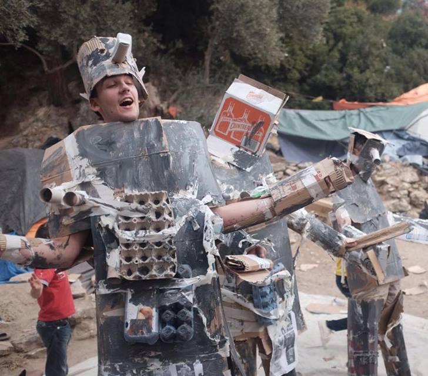
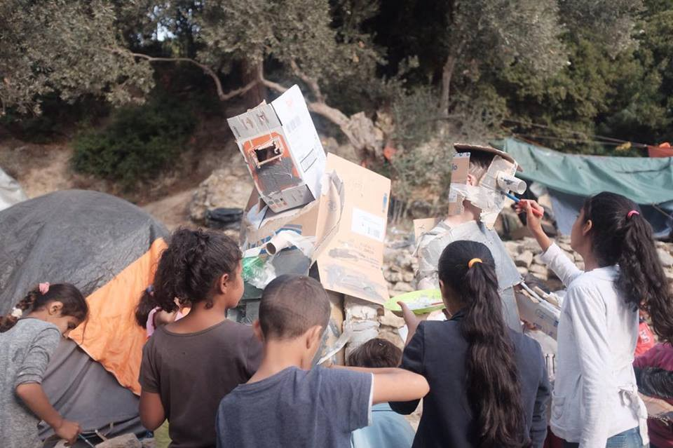
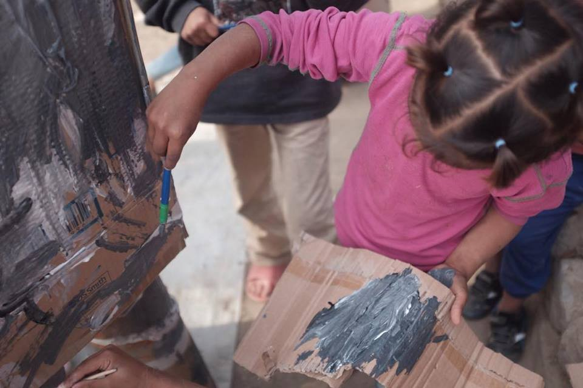
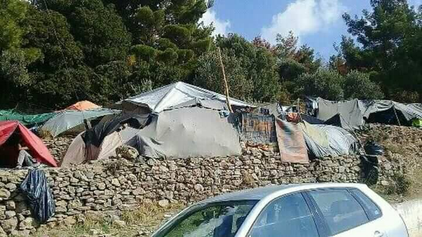
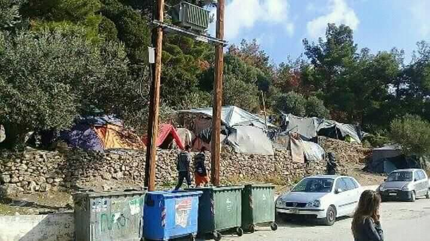

### AYS Daily Digest 09/11/17: Winterization needed on Greek Islands

_Conditions in Samos camp in photos / Updates from the hunger strikes in Athens and Mitilene / More incidents with the Libyan coast guard / Updates from Gorizia and Pordenone / NGOs compared to terrorists in Hungary / And more news…_
### FEATURE: Samos camp in photos

Yesterday, the kids from Samos camp used cardboard boxes, tape, and whole a lot of paint to transform a few [lucky volunteers](https://web.facebook.com/samosvolunteers/) into robots\.

\(Photos by Samos Volunteers\)

This happens in an island where more than 900 children are still living in the constantly growing camp, too often in terrible conditions\.

■■■■■■■■■■■■■■ 
> **[Natasha Tsangarides](https://twitter.com/tsanga10) @ Twitter Says:** 

> > No security, no doors, smashed windows on #refugee kids' containers in #Samos camp. Lack of blankets, NFIs, no hot water for past week. https://t.co/7W5HncgO3e 

> **Tweeted at [2017-11-09 13:08:17](https://twitter.com/tsanga10/status/928610191431688192).** 

■■■■■■■■■■■■■■ 

By mid\-October, the camp was hosting over 3,000 people\. Now, after around 500 were transferred to the mainland, there remain 2,400 people in a camp with a maximum capacity of 700\.

Samos today\.

In September, Bogdan Andrei, coordinator of Samos Volunteers, called for immediate action to ease living conditions in the camp:

> This is the worst camp situation I have encountered on Samos in the past two years\. When the rain starts, hundreds of people will be flooded out of their tents and left without a place to sleep\. No actor present on the island currently has the ability to effectively assist those in need\. 

The first rains came:

Winterization of the camp is essential to avoid the deterioration of health conditions, but so far it has been left in the hands of volunteers and the same refugees, with no provision from the government or administration\.

EU parliamentarians representing the Progressive Alliance of Socialists and Democrats [have raised concerns](http://greece.greekreporter.com/2017/11/09/eu-parliamentarians-warn-refugees-may-die-on-greek-islands/) about the absence of planning with regards to the winterization of camps and hotspots in the Greek islands\.

> Many are still sleeping in light tents designed for summer weather, without sleeping bags, on thin mats or even on the ground\. EU governments need to immediately stop sending back refugees to Greece under the Dublin mechanism; which is creating further strain on the Greek asylum system\. If we do not act and refugees die from the cold, as they did last year, then their blood will be on our hands\. 

■■■■■■■■■■■■■■ 
> **[Natasha Tsangarides](https://twitter.com/tsanga10) @ Twitter Says:** 

> > Millions spent in #greece for #refugeesGr but still living in inhumane conditions, many in tents. https://t.co/h77oDQa0Py 

> **Tweeted at [2017-11-09 13:09:36](https://twitter.com/tsanga10/status/928610524916482048).** 

■■■■■■■■■■■■■■ 

Episodes of racist violence are becoming increasingly common in Samos, with Enough is Enough publishing details of one of the most recent [accounts](https://enoughisenough14.org/2017/11/09/samos-police-arrested-the-refugee-victims-of-hate-crime-instead-of-the-perpetrators/) \. Last week, two Iraqi refugees, one 17– and one 20–year\-old, were reportedly assaulted by a group of men who beat them while threatening them with a rifle\. Despite some of the perpetrators being recognized and the two refugees going to the police to denounce them, the police arrested the refugees instead\.

One of the alleged perpetrators “had filed a lawsuit against the refugees claiming that the two men, along with another six people, had gone to his pig farm near the city centre, killed a pig, and caused damages, although it is widely known that Muslims don’t eat pork and no other attack against refugees was reported on that day\.”

> The stance of the local police is particularly problematic since the incidents of racist violence and hate speech on the island are proliferating, with the coordinated effort between far\-right and xenophobic centres to instigate racist hatred, by exploiting the ignorance and worry of many citizens around the management of the refugee issue\. Recently, the president of the Mytiline Community G\. Eleftheroglou, cast threats at a public gathering and during a popular radio show that ”blood will be spilled” and ”rifles might be used” in case refugees moved to the village, according to a report by the Network Documenting Racist Violence\. 

### **GENERAL**
#### The asylum lottery?

The ECRE \(European Council on Refugees and Exiles\) published a table with the rejection rate of international protection applications in different EU countries\.

■■■■■■■■■■■■■■ 
> **[ECRE](https://twitter.com/ecre) @ Twitter Says:** 

> > Asylum lottery? 82.4 per cent of all first instance decisions on applications for international protection in Poland are rejected - Switzerland rejects 22.2 per cent of all applicants. #AIDA, first three quarters 2017 https://t.co/uXnarXUNVc 

> **Tweeted at [2017-11-09 11:34:41](https://twitter.com/ecre/status/928586636144848897).** 

■■■■■■■■■■■■■■ 

### **SEA**
#### **Sea\-Eye rescues 12 people off Libyan SRR zone**

This morning the Sea\-Eye vessel [rescued](http://sea-eye.org/sea-eye-rettet-zwoelf-menschen/) 12 people six miles off of the Libyan SRR zone, including two children and one woman\.
#### **More incidents with the Libyan Coast Guard**

Following the incident reported in last days digest, SeaWatch published new details on the reckless behaviour on the part of the Libyan Coast Guard\.

■■■■■■■■■■■■■■ 
> **[Sea-Watch](https://twitter.com/seawatchcrew) @ Twitter Says:** 

> > @[Frontex](https://twitter.com/Frontex) @[eu_eeas](https://twitter.com/eu_eeas) @[RegSprecher](https://twitter.com/RegSprecher) @[UNHCRLibya](https://twitter.com/UNHCRLibya) @[guardiacostiera](https://twitter.com/guardiacostiera) @[[CoastGuardLIBYA](https://twitter.com/CoastGuardLIBYA)](https://twitter.com/[CoastGuardLIBYA](https://twitter.com/CoastGuardLIBYA)) @[MSF_Sea](https://twitter.com/MSF_Sea) #SeaWatch photo, video and VHF material proves reckless behavior of @[[CoastGuardLIBYA](https://twitter.com/CoastGuardLIBYA)](https://twitter.com/[CoastGuardLIBYA](https://twitter.com/CoastGuardLIBYA)) during the rescue on Nov 6. Find all evidence here: [sea-watch.org/en/update-evid…](https://sea-watch.org/en/update-evidence-for-reckless-behavior-of-libyan-coast-guards/) https://t.co/UhSQquBNZA 

> **Tweeted at [2017-11-09 11:20:15](https://twitter.com/seawatchcrew/status/928583004221526017).** 

■■■■■■■■■■■■■■ 

Between 20 to 40 people are still missing, according to [MSF](https://twitter.com/MSF_Sea/status/928599180033101825) \.

A second episode, “a show of force” by the Libyan Coast Guard, was reported by German [media](http://www.n-tv.de/politik/Wie-Libyer-eine-deutsche-Fregatte-bedraengen-article20123012.html) : a Libyan coast guard speed boat hassled a German frigate \( _Mecklenburg Vorpommern_ , part of EU mission Sophia\) \. Aiming towards an empty dinghy, the Libyan boat came very close—on collision course—to the German frigate and another small German speed boat belonging to _Mecklenburg Vorpommern\._ The Libyan coast guard vessel did not react to warnings via radio\. At the end of the incident, the Libyan boat reacted, turned around, and fired shots—not directly at the German frigate—but in the water behind it\. Libya’s actions were unprofessional and a provocation, said a spokesman\. Supposedly, this was meant a “show of force” to test the coast guard’s limits\.

This only increases the political tensions related to the EU’s training and support of the Libyan coast guard to protect its borders\.
#### Two people drowned in the Gibraltar Strait

■■■■■■■■■■■■■■ 
> **[Helena Maleno Garzón](https://twitter.com/HelenaMaleno) @ Twitter Says:** 

> > ‼️Dos nuevas víctimas de un naufragio en el Estrecho aparecen en una playa de Tánger. Diallo de 23 años y otro joven aún sin identificar #FronteraSur #DEP 

> **Tweeted at [2017-11-09 14:46:36](https://twitter.com/helenamaleno/status/928634934692073472).** 

■■■■■■■■■■■■■■ 

### **LIBYA**
#### Voluntary returns?

More than 10,000 people detained in Libyan detention centres accepted to return to their home country this year through the IOM scheme for voluntary returns, media [report](http://weblog.iom.int/migrants-abandon-dream-new-life-fly-home) \.

■■■■■■■■■■■■■■ 
> **[Jeff Crisp](https://twitter.com/JFCrisp) @ Twitter Says:** 

> > According to UNHCR, 'voluntary' repatriation requires "an absence of any physical, psychological or material pressure" to return. Are such conditions met in Libyan detention centres? https://t.co/F7ZRdyNsZE 

> **Tweeted at [2017-11-09 10:16:40](https://twitter.com/jfcrisp/status/928567002930798594).** 

■■■■■■■■■■■■■■ 

### **IRAQI KURDISTAN**
#### Ruhi Loren calls for donations

Please click [here](https://www.facebook.com/groups/PeopletoPeopleSolidaritySouthernSEEurope/permalink/730377983826537/?hc_location=ufi) to read the post in full and find out more ways you can help\.

> \*Hygiene products needed\* \* 

> Our friends and families in the Bablo Wild camp in Kurdistan, Northern Iraq are desperately wanting hygiene products for the whole camp\. There is 40 families\. We have a trusted friend over there who will buy, distribute and get photos if we send funds over\. 
 

>  I’m all out and have no funds at all and fundraising is poor for all my projects\. This is a camp I visited and it really called to my heart\. They have no official support there and rely on independent volunteer support and there isn’t that many of us around especially post referendum\. 
 

>  If you want photos/videos of the camp from my time there let me know\. 
 

>  If anyone can help fund this I’d be most grateful\. Please get in contact\. 

> Ruhi 

> You can also donate on PayPal: ruhiloren@gmail\.com 
 

>  Or [https://mydonate\.bt\.com/fundraisers/humanitariancrisiseurope](https://mydonate.bt.com/fundraisers/humanitariancrisiseurope) 

### **TURKEY**
#### Turkish border authorities arrest 575 asylum seekers

Local media [report](http://www.novinite.com/articles/185057/Turkey+Detained+more+than+500+Illegal+Migrants+who+were+Heading+for+Bulgaria+and+Greece) that 575 asylum seekers were arrested by the Turkish border authorities\. Some were hiding in the villages of Orhanie, Sarakapanar, and Bosnokoy, not far from the Bulgarian border\. The other group was hiding in Uzunkopru, Ipsala, and Meric, in the immediate vicinity of the Greek border\. All the detainees, from Morocco, Pakistan, Egypt, Syria, Afghanistan, and Myanmar, have been handed over to the migration authorities in the city of Edirne\.
### **GREECE**
#### New arrivals

One boat arrived to North Lesvos, first report says it was carrying 46 people\.

A speedboat dropped off 12 people on Inousses island this morning and the people were later transported to Chios\.
#### ECHO100PLUS needs donations

Help [ECHO100PLUS](https://chuffed.org/project/let-their-voices-echo) support refugees in their communication, education, and integration programs with English, Greek, German, Italian, and French classes\.

Together we can let their voices ECHO\!

Read more [here](https://chuffed.org/project/let-their-voices-echo)
#### The Refugee Children’s Centre is looking for volunteers

> \* \* \*Volunteers Needed for New Project in Greece\* \* \* 

> We are looking for two lovely Children’s Activities Coordinators for a new project, to start immediately\. The Coordinators will be responsible for planning and delivering a broad programme of activities to children living in a camp in Greece\. 

> The residents are Yazidi refugees, mainly from Sinjar in Iraq\. In 2015 ISIS committed genocide and multiple crimes against humanity and war crimes against the Yazidis, thousands of whom were held captive and subjected to unimaginable horrors\. An entire community, tens of thousands of people, became refugees as ISIS drove them from their homelands\. Many Yazidi’s were granted asylum in Germany and most of the families in this camp are awaiting family reunification\. 

> Housed in mobile accommodation units in a military operated refugee camp, the living conditions are stable\. However, due to changes in EU funding, Save the Children withdrew their vital psychosocial support programme at the end of the summer and have yet to be replaced\. There are 145 children currently living in the camp desperately needing access to education, recreation and psychosocial support\. 

> Operating from two tents on a plot of land adjacent to the camp, Lifting Hands International offer a programme of non\-formal education and recreation/psychosocial support\. Refugee Children’s Centres will be working alongside LHI to help deliver activities to the children while they await resettlement or a place at a local school\. 

Read more [here](https://web.facebook.com/refugeechildrenscentres/) and [here](https://refugeechildrenscentres.org/contact-us.html) \.
### GREEK MAINLAND
#### Athens refugees hunger strike, day nine

14 refugees in Athens are in their ninth day of a hunger strike, drawing attention to the cause of family reunification\.

■■■■■■■■■■■■■■ 
> **[Olivier Drot](https://twitter.com/OlivDrot) @ Twitter Says:** 

> > #day9 of #refugeesgr #hungerstrike in #Athens, #Greece.

#syntagma 1 hour ago.

#reuniteusnow #reunitefamiliesnow
#refugeeswelcome https://t.co/C2RiAFFm9c 

> **Tweeted at [2017-11-09 10:12:46](https://twitter.com/olivdrot/status/928566022843617281).** 

■■■■■■■■■■■■■■ 

During yesterday’s demonstration, the German Embassy discriminated against female refugees, accepting only male representatives inside its premises\.

■■■■■■■■■■■■■■ 
> **[Liana Spyropoulou](https://twitter.com/LSpyropoulou) @ Twitter Says:** 

> > The German Embassy in Athens doesn’t accept FEMALE refugees inside. They told the refugees who are demonstrating outside that only 3 MEN can enter, no women 😡 https://t.co/WWZaFgqUp6 

> **Tweeted at [2017-11-08 11:21:41](https://twitter.com/lspyropoulou/status/928220977951117313).** 

■■■■■■■■■■■■■■ 

According to local media, [Greece is hiring 155 new staff](http://www.e-dimosio.gr/dimosio/123690/155-proslipsis-sta-kentra-kratisis-allodapon/) \(administrative, doctors, IT, interpreters\) to reinforce its 10 detention centres operating countrywide\.
### **LESVOS**
#### **Latest numbers**

[Refugee Support Aegean](https://twitter.com/rspaegean/status/928658426523213829) report that 7,873 refugees are currently living on Lesvos: 6,115 in Moria, including about 1,000 children, 1,088 in Kara Tepe camp, and 670 in alternative shelters\.
#### **Updates from Sappho Square hunger strikers**

Arash Hampay [published](https://web.facebook.com/groups/446386565554391/permalink/750332728493105/?hc_location=ufi) an update from day 22 of protest in Sappho Square, in Mitilene\.

> The Condition & Spirit of Protesters: 

> Considering the difficulty of occupying Sappho Square — the cold nights, rain, absence of heating equipment, threats by fascist elements in Lesbos, police threats, police physical violence, and legally unjustified arrests of protestors, including a minor — the spirit of the protesters is unbreakable as this protest concerns their safety and their families’ safety, as well as their fundamental human rights\. The protesters gain their strengths from the belief in the strength and hope in the solidarity of the people and not the state which is complicit in the injustices imposed on refugees on European soil: 

> \#opentheislands 

> \#solidarityhungerstrikers 

#### **Transforming Lesvos into a concentration camp**

Media [report](http://greece.greekreporter.com/2017/11/08/lesvos-and-chios-municipalities-turn-against-deputy-migration-minister/) that Lesvos municipal council is denouncing a lack of political will for the decongestion of the islands\. In reaction to policies that have tended to “transform Lesvos into a concentration camp,” the council is refusing the government’s plans for the construction of new hotspots on the islands and is calling on Migration Policy Minister Yiannis Mouzalas to stay true to his original commitments\.

■■■■■■■■■■■■■■ 
> **[City Plaza Squat](https://twitter.com/sol2refugees) @ Twitter Says:** 

> > The condition inside #HotSpot #moria in #Lesvos is not only putting the life of #refugees in danger, it’s strongly insulting the human dignity & #human being! #OpenTheIslands https://t.co/eAlnZAzlHq 

> **Tweeted at [2017-11-09 12:07:18](https://twitter.com/sol2refugees/status/928594844339056641).** 

■■■■■■■■■■■■■■ 

#### **October Report on Rights’ Violations and Resistance**

■■■■■■■■■■■■■■ 
> **[Legal Centre Lesvos](https://twitter.com/lesboslegal) @ Twitter Says:** 

> > October Report on Rights Violations and Resistance in #Lesvos. In face of worsening conditions for #refugeesgr and continued human rights violations, #Lesvosresists.
[legalcentrelesbos.org/2017/11/09/oct…](http://www.legalcentrelesbos.org/2017/11/09/october-report-on-rights-violations-and-resistance-in-lesvos/) https://t.co/xskUyYjuTR 

> **Tweeted at [2017-11-09 11:11:44](https://twitter.com/lesboslegal/status/928580861297090560).** 

■■■■■■■■■■■■■■ 

### **CHIOS**
#### Chios municipality to sue the migration minister

Chios is [considering](http://greece.greekreporter.com/2017/11/08/lesvos-and-chios-municipalities-turn-against-deputy-migration-minister/) to proceed with legal actions against Minister Mounzalas regarding the non\-observance of certain terms of the VIAL site concession contract and the unacceptable living conditions of the hospitality structures\. The municipality will seek the evacuation of the camp and the restitution of the property\.
### **ITALY**
#### **Growth in international protection applications**

Infomigrants [reports](http://www.infomigrants.net/en/post/5995/international-protection-requests-in-italy-up-44-percent-in-2017?ref=tw_i) that as of July 2017, international protection applications were up 44% from last year’s figures, currently standing at 77,449\.

A report on international protection in Italy published by the Association of Italian Municipalities \(ANCI\) and Catholic charity Caritas shows that before July, 41,379 applications were reviewed:

4\.3 out of 10 were approved \(refugee status: 9%; subsidiary protection: 9\.8%; permit for humanitarian reasons: 24\.5%\)

The majority of those receiving international protection status were women, children, and the elderly\.

51\.7% of the applications were denied, with the figure increasing to 60% for African migrants\.

There were 5,800 repatriations in 2016 out of a total of just over 41,000 undocumented migrants, up 300 from 5,500 repatriations in 2015\.
#### Updates from Gorizia and Pordenone

On the northeastern border the situation for hundreds of refugees is only going to get worse with the low temperatures\.

In Gorizia, refugees are camped in the _Galleria Bombi_ , a road tunnel on the outskirts of towns\.

■■■■■■■■■■■■■■ 
> **[Ivan Grozny](https://twitter.com/IvanGrozny3) @ Twitter Says:** 

> > Galleria Bombi, Gorizia. 
A.D. 2017 #Refugees https://t.co/roEKGaAICv 

> **Tweeted at [2017-11-08 18:32:30](https://twitter.com/ivangrozny3/status/928329397567967233).** 

■■■■■■■■■■■■■■ 

According to [Ivan Grozny](https://twitter.com/IvanGrozny3) , racists from CasaPound threatened an Italian volunteer because she was helping refugees\.

■■■■■■■■■■■■■■ 
> **[Ivan Grozny](https://twitter.com/IvanGrozny3) @ Twitter Says:** 

> > Per stare doppiamente sull'attualità, i conigli di @[distefanoTW](https://twitter.com/distefanoTW) a Gorizia hanno minacciato una signora di 70 anni che aiuta i profughi, "perché prima gli italiani"... 
Roba da vigliacchi ignoranti. 
Roba da gente che vale niente. https://t.co/3ugTM5bGlx 

> **Tweeted at [2017-11-09 13:37:31](https://twitter.com/ivangrozny3/status/928617548635103232).** 

■■■■■■■■■■■■■■ 

In Pordenone too, people are sleeping rough\.

 \(Photo by [Lorena Fornasir](https://web.facebook.com/lorena.fornasir?hc_ref=ARQ60dqEMpW5T7DXm4L2CO6UYyEKbNiXnNiR4puH7xC64z6W9YHbeisqqVAu8Jck754) \)](assets/2b19a004ae85/1*hnYWmfFlBVQz8hu0gwz3Nw.jpeg)

[Rete Solidale Pordenone](https://web.facebook.com/retesolidalepn/) \(Photo by [Lorena Fornasir](https://web.facebook.com/lorena.fornasir?hc_ref=ARQ60dqEMpW5T7DXm4L2CO6UYyEKbNiXnNiR4puH7xC64z6W9YHbeisqqVAu8Jck754) \)

As in Rome, administrations are refusing to install basic services such as toilets or running water “because they will attract more migrants\.”

■■■■■■■■■■■■■■ 
> **[Baobab Experience](https://twitter.com/BaobabExp) @ Twitter Says:** 

> > Wow! Ma allora è una risposta standard! Perché è la stessa che l'assessorato alle politiche sociali di Roma ha dato a noi! [twitter.com/IvanGrozny3/st…](https://twitter.com/IvanGrozny3/status/928336651071512576) 

> **Tweeted at [2017-11-09 15:52:18](https://twitter.com/baobabexp/status/928651467652726784).** 

■■■■■■■■■■■■■■ 

#### Call for donations

A group of volunteers from Zaragoza are asking for donations to reach 360€ to cover the costs of a mission to Ventimiglia with a van full of winter supplies for people living on the streets\. At the moment, around 400 people are living in Ventimiglia where they are trying to cross the border into France\. It is getting colder and they need all possible help to make their winters a little bit less painful\.

Follow the link [here](https://www.youcaring.com/humansinneedventimiglia-1003286) to find our more about how you can help\!
### **SERBIA**
#### **Appeal from Tutin Camp**

From [Tutinska Inicijativa Mladih](https://web.facebook.com/tutinskainicijativamladih/posts/497173477320082) :

 \)](assets/2b19a004ae85/1*kVS9YEhScbqJzBFd0W9Fqw.jpeg)

Tutin Camp \(Photo by [Tutinska Inicijativa Mladih](https://web.facebook.com/tutinskainicijativamladih/posts/497173477320082) \)

> \#APPEAL 

> We call to the state and all institutions in charge of migrants to respond urgently\.
 

>  
 

>  We believe that the degradating way in which migrants and asylum seekers are getting food, and their living conditions are inhuman\.
 

>  
 

>  The temperature in the Tutin is now between 0 and 10 degrees and we don’t think any of us would be comfortable eating outside\.
 

>  
 

>  We invite the Tutin Council, the Government, international and domestic Ngos that deal with human rights protection to protect the rights of migrants\. 

### **HUNGARY**
#### **NGOs = ISIS**

In the latest of a long series of attacks against migrants and humanitarian organizations, the pro\-government magazine Figyelő published a cover equating NGOs with terrorists\.

■■■■■■■■■■■■■■ 
> **[Balazs Csekö](https://twitter.com/balazscseko) @ Twitter Says:** 

> > #Hungary "Fighters are coming to Europe" - Cover of Govt-friendly #Figyelő identifies NGO's with terrorists: @[hhc_helsinki](https://twitter.com/hhc_helsinki) #MigrationAid pic: @[444hu](https://twitter.com/444hu) #migration https://t.co/6gvk8IczAz 

> **Tweeted at [2017-11-09 09:04:09](https://twitter.com/balazscseko/status/928548756269740032).** 

■■■■■■■■■■■■■■ 

■■■■■■■■■■■■■■ 
> **[Amnesty Hungary](https://twitter.com/AmnestyHungary) @ Twitter Says:** 

> > This is simply unbelievable...a pro-gov weekly equates @[hhc_helsinki](https://twitter.com/hhc_helsinki) and @[migrationaidorg](https://twitter.com/migrationaidorg) with terrorists. We would like to say this is a "new low" but used it way to many times. [twitter.com/hhc_helsinki/s…](https://twitter.com/hhc_helsinki/status/928552393343733760) 

> **Tweeted at [2017-11-09 11:47:36](https://twitter.com/amnestyhungary/status/928589886944436224).** 

■■■■■■■■■■■■■■ 

### **GERMANY**
#### **Old wall, new borders**

](assets/2b19a004ae85/1*_hBfCibzFdrfaYJ3bQQTTA.jpeg)

[Stop the dying](https://twitter.com/StopTheDying)

On November 9th, 1989 the inner border of Germany was opened after 44 years\. Today, the German newspaper Der Tagespiegel published a list of 33,293 names of refugees who died trying to reach Fortress Europe\.

#### **BumF and Unicef criticise Germany for hindering family reunifications**

Germany’s Federal Association for Unaccompanied Minor Refugees \(BumF\) and Unicef published a [fact sheet](http://www.b-umf.de/images/Hintergrundpapier_Familiennachzug_Final.pdf) entitled “Children need their families: simplifying family reunifications” highlighting the importance of reuniting unaccompanied minors with their families\. The document criticises the government for establishing too many bureaucratic and political hurdles curtailing family reunifications\.

The document advocates family reunifications as the obvious solution to thousands of unaccompanied minors who have come to Germany as refugees\. Such reunifications are becoming increasingly difficult to realize, with laws currently placing a two\-year hold on most cases of family reunification — even when minors are involved\.

> Refugee children too are first and foremost children\. It is in the best interest of these children, who are in the greatest need of protection, to allow their closest relatives to join them\. 

Read more [here](http://www.infomigrants.net/en/post/6006/unicef-chastizes-germany-for-preventing-family-reunifications-for-minors) \.
### **FRANCE**
#### Call for donations

With weather getting tougher, [Refugee Community Kitchen](https://web.facebook.com/groups/RefugeeCommunityKitchen/permalink/1581255268608637/) are calling for help:

> If anyone has fundraising ideas and tools, is thinking of getting their community involved, or has connections to high profile people who care, please contact us at [refugeecommunitykitchen\.com\.](http://refugeecommunitykitchen.com/) 

> Please help us help thousands of souls make it through the winter by sharing and giving what you can \-> [bit\.ly/rckdonate](https://l.facebook.com/l.php?u=http%3A%2F%2Fbit.ly%2Frckdonate&h=ATOVLFbiAWKLCSZTTZsAB0QBdYiRllzBKQMSbXadjt65LkcfKv671x8SMGozMwmt2uRlgKd5oMYIOuY7XKQFvKIHghhh_94V7DhMowBhS_DDDr6wJORc_RH3FBQOcqBsF3K7ACst91xt7xU1ARHvZ3OBE-ls2lyJbLPe3k_1iyPZJzaN0YBk24Ot55DMG0tgDkK4jo0L4ZrGUubst0ufpvKY_Q51kc3LaO_aFsrcN1p-2Iz0-AdBU87-auXJOViv) 

> **_We strive to echo correct news from the ground through collaboration and fairness\._** 

> **_Every effort has been made to credit organizations and individuals with regard to the supply of information, video, and photo material \(in cases where the source wanted to be accredited\) \. Please notify us regarding corrections\._** 

> **_If there’s anything you want to share or comment, contact us through Facebook or write to: areyousyrious@gmail\.com_** 

_Converted [Medium Post](https://areyousyrious.medium.com/ays-daily-digest-9-11-2017-winterisation-needed-on-greek-islands-2b19a004ae85) by [ZMediumToMarkdown](https://github.com/ZhgChgLi/ZMediumToMarkdown)._
