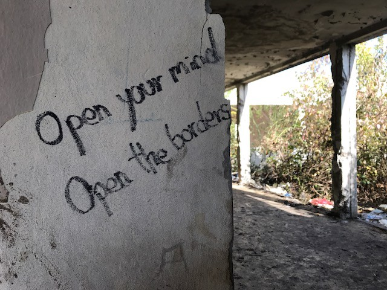
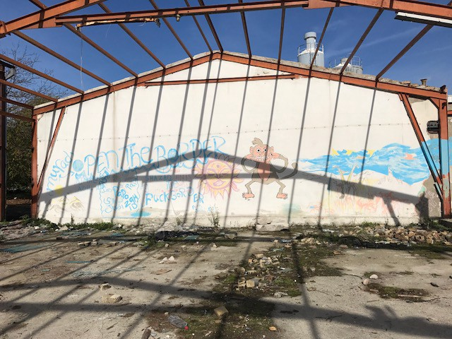
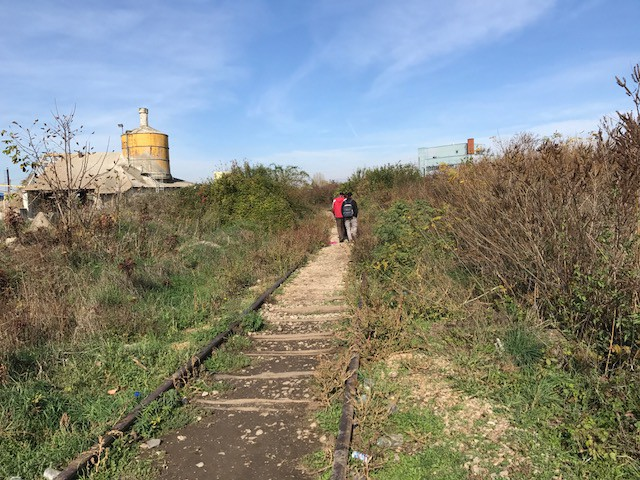
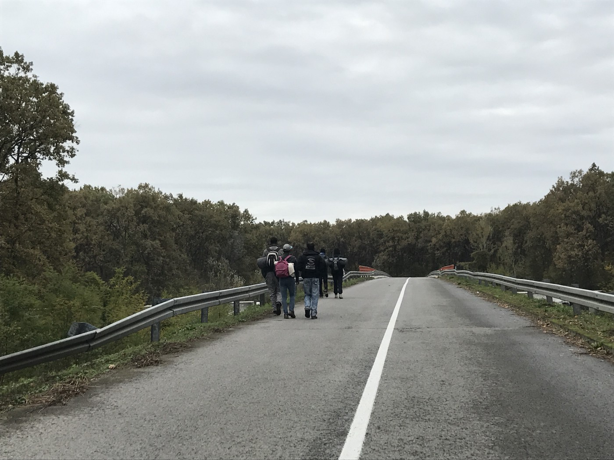
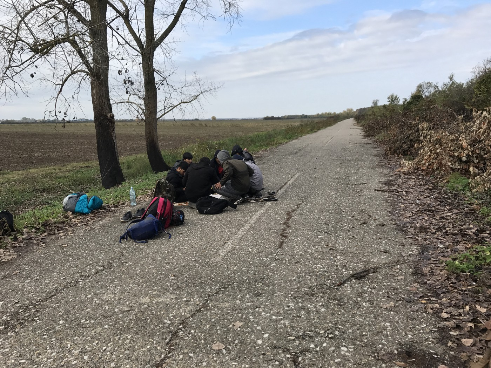
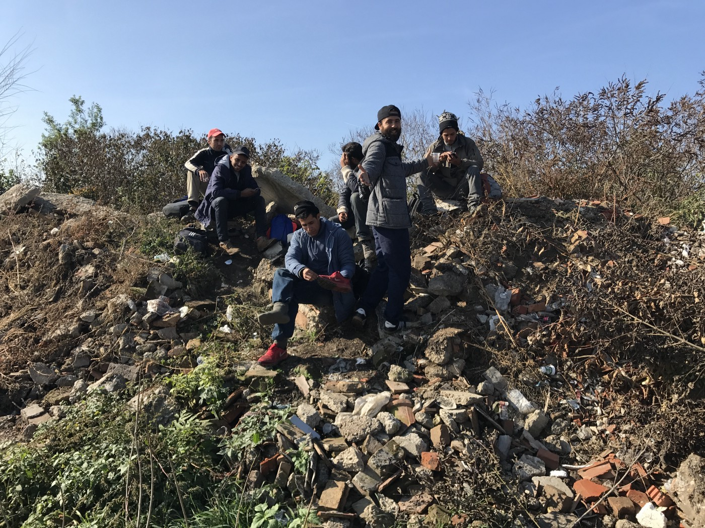
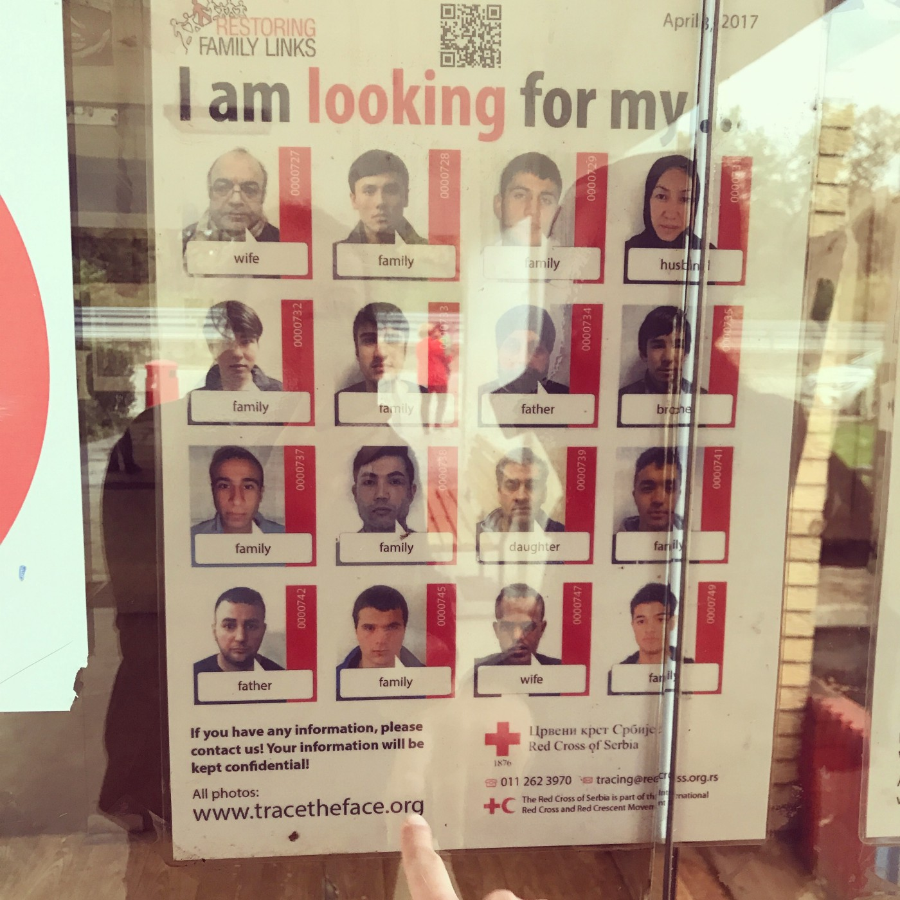
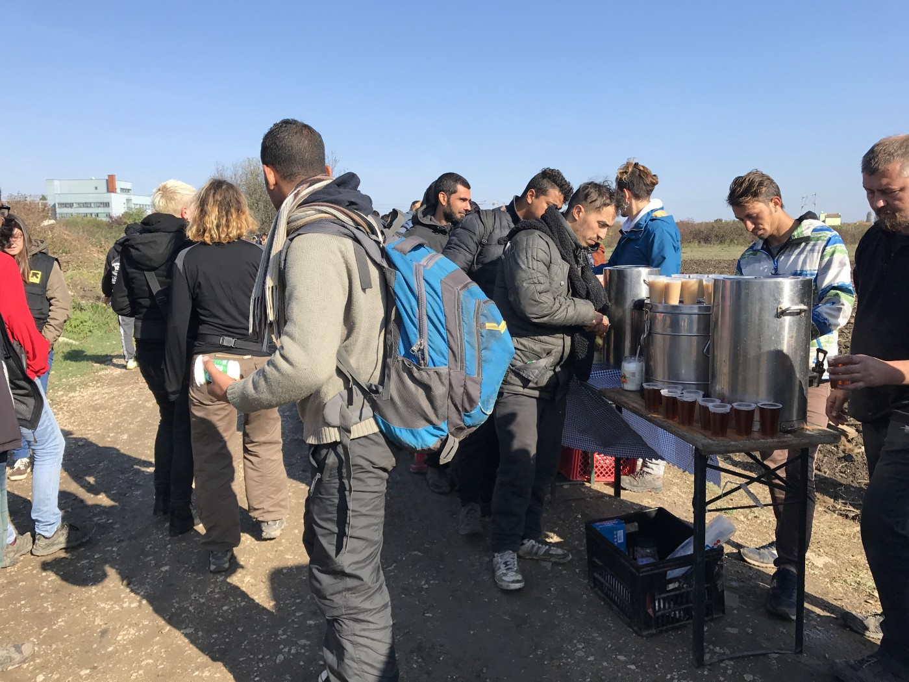
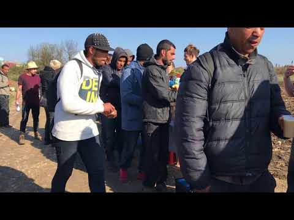

### AYS PHOTO SPECIAL: Life at the EU border

_Hundreds of people in Serbia are living in abandoned buildings\. Some of them are in Šid, the town at the border with Croatia, where from they are trying to enter the EU\. In order to prevent them from continue their journey, Croatian border police uses violence and push back people\. The only help so far comes from volunteers in the region_

In one of the abandoned building in Šid area people, including kids as young as 12, are living\.

People hope to cross the borders and to be able to continue dreaming their dreams\.

Many people who are trapped in Serbia are children who have not seen their family for over a year\.

Perilous journey toward freedom\.

Everyday they start walking, hoping to get away from the Balkans\.

They do not know how long the trip will last or there they will end at the end of the day\.

But they still have a dream of Europe as a safe place\.

Nobody knows how many people went missing on this perilous journey\.

Back in Šid, volunteers provide food and hot tea everyday for people who are living in the nearby forest and abandoned buildings\.

**_\(All photos by Mitra Nazar, Šid\. \)_**

> **_We strive to echo correct news from the ground through collaboration and fairness, so let us know if something you read here isn’t right\._** 

> **_If there’s anything you want to share, contact us on Facebook or write to: areyousyrious@gmail\.com\._** 

_Converted [Medium Post](https://medium.com/are-you-syrious/ays-photo-special-life-at-the-eu-border-fc448162c10e) by [ZMediumToMarkdown](https://github.com/ZhgChgLi/ZMediumToMarkdown)._
