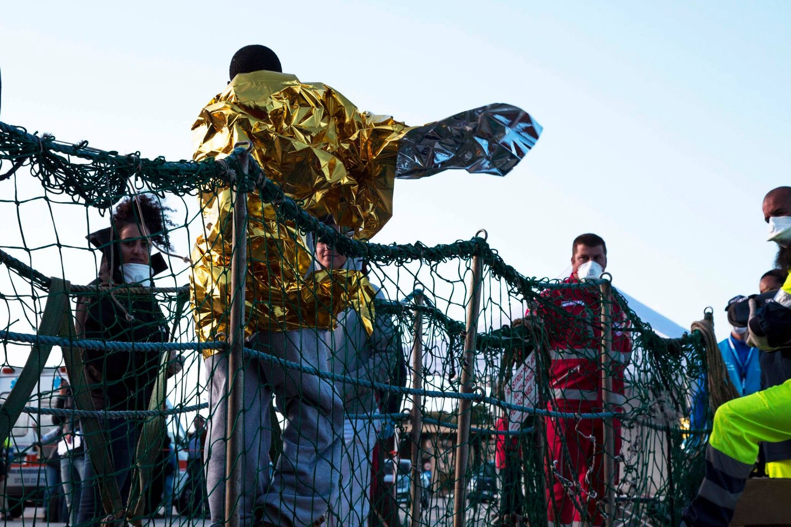
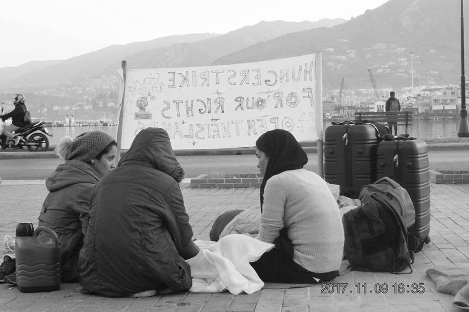
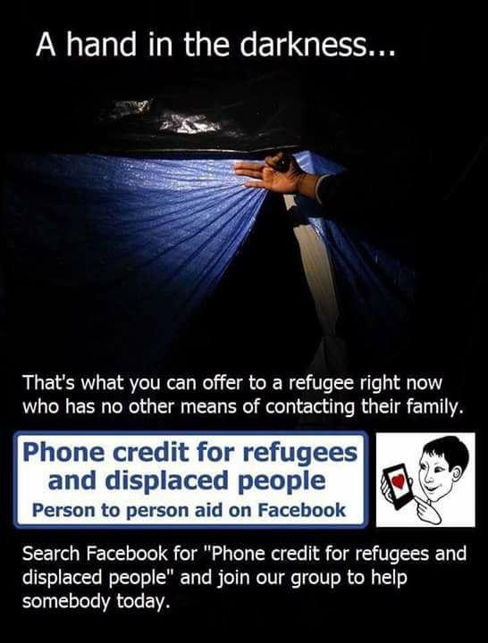

### AYS Daily Digest 13/11/17: Rescue Group Calls Upon UNHCR to Investigate Turkish Coast Guard Brutality

_//Sea\-Watch releases footage/ /Hunger strike and police brutality on Lesvos//Press conference for strikers in Athens//Alleged trafficker shot//Classes in Athens//Sleeping rough in Serbia//Refugees Captured in Bulgaria//Deportation stopped in Slovenia//and more…_

Photo Credit: Sea\-Watch
### Sea
#### Feature

The [Sea\-Watch](https://sea-watch.org/en/) rescue organization is calling on UNHCR Greece to investigate the Turkish Coast Guard \(TCG\) for an incident that occurred on the 10th of this month\. The Greek Coast Guard reported to the volunteer rescue team that the TCG seized refugees outside of their territorial waters, and even more outrageously, rammed and shot at the dinghy carrying the refugees\. These claims were backed up by the refugees who were not taken by the TCG\. One of the members of the Refugee Rescue team that assisted the Greek Coast Guard reported what he saw that night:

> At 3\.47 am, we launched our rescue boat\. On location, a member of the coast guard greeted us and said: ‘What the Turkish did was horrendous\. They are like animals, there was no reason for their brutality\.’ I saw that two refugees indeed had injuries to their faces\. 

> After talking to several refugees we understood what had happened\. Apparently, the Turkish Coast Guards approached the refugees’ dinghy, started shooting in the air and then rammed them\. Soon, one of the Turkish Coast Guards himself used a hand gun to fire into the water around the dinghy\. 

> When the Greek Coast Guards arrived, they asked the Turkish Coast Guard to stop shooting and return to Turkish waters\. At this moment, 17 refugees jumped out of the dinghy and started to swim towards the Greek ship\. The Turkish Coast Guards tried to apprehend them and it seems like they were using a stick or something similar as several refugees had quite substantial cuts in their faces\. The Turkish Coast Guards loaded the remaining people who could not swim, mainly women and children, on their boat and returned them to Turkey\. 

> I witnessed how stressed the Greek Coast Guards were about the incident\. It’s just atrocious that Turkish authorities would do something like this\. We call on the European Union to stop cooperating with Turkey as long as practices like these continue\. 

Sea\-Watch released the [complete footage](https://www.facebook.com/seawatchprojekt/videos/1945788685639203/) of their encounter with the Libyan Coast Guard \(LCG\) last week on 6 November, in which the reckless actions of the LCG caused three deaths\. The footage confirms the account of the Sea\-Watch crew, and further proves that the LCG is in violation of international and maritime law\. In the film, you can see the LCG beating refugees and forcing them onto their vessel\.

A ship was intercepted off the coast of [Crotone, Italy](http://www.ansa.it/calabria/notizie/2017/11/13/intercettato-veliero-con-58-migranti_3704026e-b456-43c9-a4e5-c2286dd6256e.html) carrying 58 refugees from Iraqi Kurdistan\.

 \.](assets/c28e5f536310/1*ps_tpTQ4l_zeVOvWYHYcuQ.jpeg)

The Aquarius rescue ship\. Photo Credit: [SOS MEDITERANNEE France](https://www.facebook.com/sosmedfrance/) \.

The French sea rescue organization SOS MEDITERRANEE announced today that the departure of the large MSF vessel “Aquarius” has been postponed due to dangerous weather conditions in the Mediterranean\. However, there teams are continuing to prepare for their missions and will leave port as soon as they are able\. If a vessel as large as the Aquarius is unsafe because of the weather, one can only imagine the risk of those who are departing for Europe in overcrowded rubber dinghies\.
### GREECE
#### Islands

Today is the twenty fifth consecutive day of hunger striking for those who are protesting in Sappho Square on the island of Lesvos\. They are protesting the inhumane and unsafe conditions in the Moria camp on the island\. Today those who have been protesting put out a call for a [march on the 20th](https://www.facebook.com/events/190376544856311/) of November, starting at Sappho Square, to show solidarity and put pressure on the authorities\.

Strikers in Sappho Square\. Photo Credit: Arash Hampay

> We call to you to create a historical day, when we call for justice together\. We request you to walk with us and call with us to demand the freedom of those who do not have refuge\. 

The activist Arash Hampay recently [shared](https://www.facebook.com/groups/1652972374920129/) a disturbing, yet sadly familiar, story from Lesvos this week\.

> One of the Iranian refugees living in Lesvos, Ali Akbar Farsi, who is 17 years old, said that he was arrested on the street by Police without any charges, beaten while handcuffed in the police station, and repeatedly beaten in this humiliating state and eventually released\.
 

> This fascist behavior of police and European governments towards migrants is unfortunately happening every day on the Lesvos Island and the city of Mitylini, without anyone being able to ask the police for protection\!
 

> We scream loudly that we do not have safety in Greece … 

This report of police brutality will not come as a surprise to many who are familiar with the situation on the Greek islands\. Refugees living in the hotspots have little legal recourse or protection, and police officers are chronically underpaid and undertrained\. With these conditions, police brutality should come as no surprise\. Most of the stories of police violence will never see the light of day, as those who are abused have few means to make their voices heard\. Hampay’s story shows just one of the reasons why those in Sappho Square are protesting\.

The [Dirty Girls of Lesvos Island](https://www.facebook.com/dirtygirlslesvos/) is a grassroots organization which focuses on one simple but very important service: they wash the clothes and blankets of refugees living on Lesvos, most of whom have no access to washing facilities\. They have recently joined forces with a team of Czech volunteers who are working in Serbia\. For only three euros, you can ensure that they keep someone in clean clothes and blankets for a month\! You can support their work [here](https://www.facebook.com/dirtygirlslesvos/photos/a.563279673830537.1073741826.563268907164947/953440411481126/?type=3&theater) \.

■■■■■■■■■■■■■■ 
> **[Natasha Tsangarides](https://twitter.com/tsanga10) @ Twitter Says:** 

> > Heavy rain in #Greece today. Thinking of the '000s #refugeesGr stuck in flimsy tents. Unacceptable. Winter is coming. OPEN THE ISLANDS. https://t.co/P4BcheeFMu 

> **Tweeted at [2017-11-13 13:45:26](https://twitter.com/tsanga10/status/930069093646061568).** 

■■■■■■■■■■■■■■ 

#### Mainland

Those who are hunger striking in Syntagma Square in Athens are now on their 14th day\. As has been reported earlier this week, they are protesting the extreme delays in their family reunifications, which have already been granted\. The strikers have announced their intention to hold a press conference on [14 November](https://www.facebook.com/events/168256843763476/) to bring more attention to this issue\. From the striker’s statement:

](assets/c28e5f536310/1*e3azXG_KCrAsTvwgZ5GeKQ.jpeg)

Protestors in Syntagma Square\. Photo Credit: [Greek Forum of Refugees](https://www.facebook.com/Greekforumofrefugees/)

> On Tuesday 14 November 2017, the 14 refugees hunger strikers, completing 14 day of strike, during which demonstrations were carried out in Greece and Germany, have met with the Greek and German authorities and a large part of society has Sensitive to the issue of family reunification and policies, they will hold a press conference in order to inform the future of their struggle and its continuation\. 

> The Press Conference will take place at the hunger strike site at the square at 12 noon\. In Case of bad weather, there will be protection from the rain\. 

> The support of all of us is necessary\. 

An [alleged trafficker was shot](https://www.apnews.com/2ff20a10251d4b78abede0fe6e5161d5) by police in Thessaloniki while transporting 10 Pakistani refugees inside of his van\. Police say that they attempted to pull the driver over, and a chase ensued when he ignored them\. The van overturned, and have alleged that the driver tried to attack them after the crash\. The refugees inside the van were injured during the crash, but all of them are expected to live, as is the alleged trafficker\.

The Mobile Info Team is beginning a new project to help refugees gain access to social services in Athens, as well as to provide crucial information regarding transportation and accommodation in the city\. You can learn more by visiting them in person, or by contacting the group through their WhatsApp\. Follow the link [here](https://www.facebook.com/profile.php?id=1652972374920129) \.

Kitab World Education is starting a new round of free English and Greek courses for refugees living in Athens\. To find out more and sign up, please email info@kitabngo\.org, or simply message their [facebook page](https://www.facebook.com/kitabworldeducation/?hc_ref=ARSYunH-ck2EEJ0XLg6Bdn5Wp0dHsO9oOs03qk8jJsM7dz00LkdrkLwxG_ZjxPSJduk&fref=gs&hc_location=group) \.

The Mosaico House in Athens recently updated their schedule of language courses\. To learn more about the group, and sign up for their classes, click [here](https://www.facebook.com/helpfromgreece/photos/a.1308513619197507.1073741828.1284433871605482/1474584749257059/?type=3&theater) \.
### SERBIA

A recent [report from Serbia](https://www.balkaninsight.com/en/article/refugees-shunning-official-centres-face-serbia-s-grim-winter-11-09-2017) highlighted the risks that the many refugees living outside of asylum centers face\. Many asylum seekers prefer to live outside of the camps because they want to be close to bus and train stations so that they can leave the country quickly if need be\. A recent statement by MSF concerning this situation listed other reasons that asylum seekers are choosing to live on their own, and often on the streets, rather than in the centers:

> New arrivals have to wait several days before they can get registered to access the camps\. Some nationalities are granted less chance to access asylum rights; some fear being sent to camps where there are restrictions on movement; some fear being sent to camps in southern border areas, where there have been cases of unlawful expulsion to Bulgaria and Macedonia; others prefer being near EU borders\. 

The lack of accommodation and dropping temperatures are not the only hardship that refugees outside of the asylum centers face\. Serbia’s Ministry of Labour banned distribution to refugees living outside of the centers last year, making the lives of refugees living in the country even harder\.

According the NGO Crisis Response and Policy Center \(CPRC\), there are approximately 4,600 refugees currently living in Serbia\. However, with so many refugees in the country remaining unreported and steering clear of the registration centers, this number is hard to verify\. While CPRC claims that the number of refugees in Serbia has remained relatively stable in the past months, MSF has reported seeing a sharp increase in the number of new arrivals in the past month\. While new arrivals to Serbia are typically around 180 a month, MSF estimates that there have been over 500 in the past month\.
### BULGARIA

[30 refugees](http://www.novinite.com/articles/185103/The+Authorities+Captured+a+Group+of+Migrants+at+Central+Station+-+Sofia) were captured yesterday trying to board a freight train in the capital, Sofia\. Among the group were 15 women and 9 children\.
### SLOVENIA

Slovenian authorities announced their intention this week to deport a 45 year old Syrian refugee named Ahmad Shamieh to Croatia\. Ahmad had been living in the country for over two years, and had fully learned the language, coming to consider Slovenia his “second home”\. Over 1,000 Slovenian citizens signed a petition protesting his deportation, and called upon their MPs to stop it\. Following this outcry, the Slovenian Prime Minister intervened on Monday, and called upon the Ministry of the Interior to stop the deportation\. Many refugees are deported unjustly from the EU, and pushed back to other countries with no regard for the lives they are rebuilding\. Ahmad’s story is a welcome reminder of how citizens can work together to protect refugees living in their country\.
### ITALY

The number of new arrivals in Italy has dropped approximately 30% as compared to this time last year, according to statistics from the Italian Ministry of the Interior\. This decrease is widely understood to have resulted from the aggressive tactics of the EU\-country funded Libyan Coast Guard \(LCG\) \. Despite the fact that the LCG consistently violates human rights and maritime laws in their pursuit and detention of refugees, the Italian government has ignored these abuses and continues to support the LCG\.

Admiral Moreno of the Italian Navy [recently admitted](https://politica.elpais.com/politica/2017/11/10/actualidad/1510327324_811067.html) that there “is some coordination” between the Italian Navy and the LCG\. Attempting to defend the collaboration between the Italian government and the dictatorial Libyan regime, Moreno claimed “I have no evidence that they are not respecting them \[international and maritime laws\], although obviously there is still a lot of work to be done”\. Moreno’s acknowledgement that there is much work undermines the claim that the LCG is respecting international law\. Admiral Moreno warns that the route to Italy is becoming “increasingly suicidal”\. Yet as Italy continues to cooperate with the violent LCG, which caused at least three deaths last week, can we not say that this route is becoming increasingly homicidal as well?

Most municipalities [in Italy](https://www.ilfattoquotidiano.it/2017/11/12/migranti-accoglienza-nei-comuni-sprar-il-progetto-migliore-per-lintegrazione-ma-lo-sceglie-1-comune-su-8-e-solo-al-sud/3940287/) have not been doing their fair share of accommodating and relocating refugees within the country\. While each municipality is required to accept a certain number of refugees, as of the most recent data available this year, only 1,017 out of 7,978 municipalities have signed up for this system and accepted their share of refugees\. The problem of relocating refugees has been a problem especially in the North of Italy, where an even greater of regions are refusing to do their part\. For more on the Italian Protection System for Asylum Seekers and Refugees \(SPRAR\) system, you can see [AYS’s report](ays-daily-digest-28-6-17-they-decide-the-others-die-277e82b42baa) from June 29 of this year\.

A solidarity musical march has been planned for [Sunday 19 November](https://www.facebook.com/retesolidalepn/posts/1982875068659976) in Piazzetta Cavour in Pordenone\. The march is to protest the condition refugees in the area are being forced to I've in, and to draw attention to the large number of refugees who are sleeping rough on the streets\. As the weather gets colder, it will become even more dangerous for those sleeping outside, and activists and volunteers are trying to create solutions to this issue before human lives become endangered again\. The event will begin at 11h\.

The [Phone Credit for Refugees and Displaced People](https://www.facebook.com/credit4refugees/) organization has recently put out a call for donations, reminding us of the importance one phone call can have for someone who is separated from their family\. For many refugees living in Europe, phones are not merely a distraction, but a vital lifeline to friends and family, and a way to access resources and information\. While this organization is partly based in Italy, they do important work throughout Europe\. You can support them [here](https://www.facebook.com/credit4refugees/) \.
### NORWAY

Thousands of students in Norway are standing in solidarity with one of their classmates who is facing deportation\. Taibeh Abbasi is a young woman from Afghanistan who is in her third year of high school, and is dreaming of one day studying to become a doctor\. Like thousands of Afghani refugees in Norway and throughout Europe, Taibeh is now facing threats of deportation due to the EU’s ridiculous categorization of Afghanistan as a “safe country”\. Tibet’s classmates, and thousands of other Norwegians are calling upon their government to accept Afghani refugees, and to stop endangering their lives\. You can see their petition here\.
### GENERAL

The European Asylum Support Office has prepared a toolkit for refugees in Europe that gives information on the asylum processes throughout Europe\. This guide has been translated into 19 languages, access it [here](https://www.facebook.com/InfoMigrants/posts/1347822272006221) \.

> **_We strive to echo correct news from the ground through collaboration and fairness\._** 

> **_If there’s anything you want to share or comment, contact us through Facebook or write to: areyousyrious@gmail\.com_** 

_Converted [Medium Post](https://areyousyrious.medium.com/ays-daily-digest-13-11-17-rescue-group-calls-upon-unhcr-to-investigate-turkish-coast-guard-c28e5f536310) by [ZMediumToMarkdown](https://github.com/ZhgChgLi/ZMediumToMarkdown)._
