### AYS SPECIAL: Australians want refugees safely resettled — it’s the government that doesn’t\.

AYS volunteers are in Australia and report about refugees on Manus and Nauru explaining history of the camps, problems and what can be done to help\.

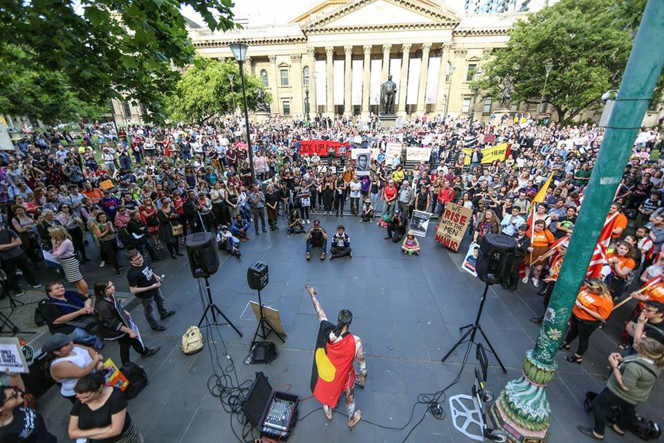

By Refugee Action Collective Victoria\.

> As a traditional custodian and owner of this land that we now call Australia, I ask the Australian Government — Who gave YOU the right to decide who is and who is not welcome here? This is our land and we welcome everyone\! We welcome the refugees on Manus and Nauru and we are telling you to BRING THEM HERE\! This mob gathered here today, our mob promises that we’ll take care of them, the whole lot of them\. Won’t we? 

The speaker paused for a moment\.

> **‘I DIDN’T HEAR YOU\! DON’T WE PROMISE TO TAKE CARE OF THEM?\!’** 

The crowd erupted in a piercingly affirmative cheer, ‘YES\!’

For the last week, [snap protests](http://www.theage.com.au/victoria/thousands-rally-in-melbourne-in-support-of-manus-island-asylum-seekers-20171104-gzevx0.html) against the Australian Government’s policy concerning Asylum Seekers have taken the country by storm\.

Hashtag frenzies that were once riddled in fear such as **\#stoptheboats** and **\#wearefull** have over the last five years changed to ones bound in unity and compassion like **\#bringthemhere** and **\#letthemstay** \.

Australians are joining together in protest against recent horrific acts against refugees detained in Manus Island’s offshore detention centre\. Many want the refugees being detained in these offshore detention centres to be resettled and safe\. The battle at hand is convincing government to do it\.

**What is happening on Manus?**

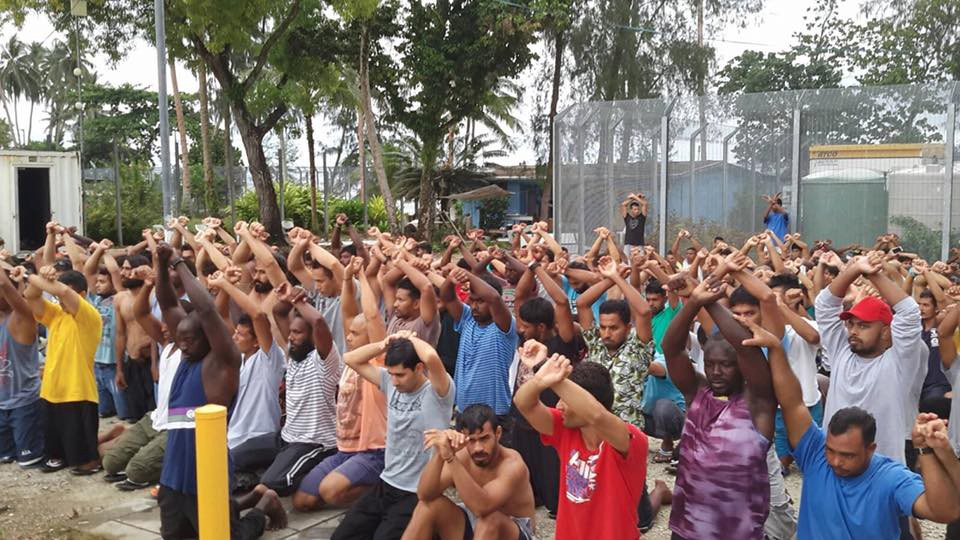

By Refugee Action Collective Victoria\.

Currently, a humanitarian crisis is unfolding in one such offshore detention centre on Manu Island\.

For many years, the Australian government has attempted to handball their responsibility toward refugees to nations that do not have the means to provide the support, or the safety, required by this large group of vulnerable persons; a group of persons that Australia is responsible for under International Law\. Vessels carrying asylum seekers predominantly from Afghanistan, Iran and Sri Lanka continue to be intercepted and sent to detention centres created on Nauru and Manus Island, Papau New Guinea\. Here, close to 2000 refugees have been detained, many for close to five years without any progress being made on their claims\. Thousands have endured violence, neglect and years in limbo that has been catastrophic to their mental health and wellbeing\.

On October 31, the Australian government continued their streak of irresponsibility by withdrawing their support for one such detention centre in Manus Island, Papua New Guinea\. This centre was established in 2012 and is deemed as the safest place for refugees on the island, by those who have been detained there\.

Their fears of personal safety on Manus is in no way unwarranted\. There have been [numerous reports](https://www.theguardian.com/australia-news/2016/aug/14/manus-island-photos-show-aftermath-of-violent-attack-afghan-refugees) of extreme violence against refugees by the local populations of Papua New Guinea\. Last month [Human Rights Watch released a report stating](https://www.hrw.org/news/2017/10/25/australia/png-refugees-face-unchecked-violence) that groups of young locals, often intoxicated and armed with various weapons, have frequently assaulted and robbed refugees on Manus Island\. In three serious attacks since June this year, some refugees had required emergency medical attention in Australia\.

Victim of one of the attacks\. By Behrous Boochani\.

_“We have experienced riots, been shot at and assaulted, treated sometimes worse than animals and on many occasions beaten in front of Australian security guards,”_ said Imran Mohammed, a Manus detainee\.

One man, Reza Barati, was killed by PNG locals in 2014\. In a horror situation on Good Friday this year, PNG military opened gun fire within the detention centre in a fit of intoxicated rage, injuring 9 people\. _“I was so scared, I’ve been scared since the day I arrived,”_ revealed another detainee\.

Many refugees now refuse to leave the centre out of fear for their safety, only leaving for brief periods and traveling in groups\. A Rohingyan man detained on the island has become too scared to leave the facility at all in the last months\. _“I am so fearful every time I come to town, I just can’t wait to get back to the centre\. Many of my friends have been beaten, they have been robbed, they have been assaulted\. There is no one here to protect us,”_ he said\.

Anticipating the government’s said closure of the detention centre, the men joined together [in daily peaceful protests that have now surpassed their hundredth day](http://www.radionz.co.nz/international/pacific-news/343354/100-days-of-protest-on-manus-island) \. However, their attempts to draw attention have been futile in persuading the government to take any reasonable action\.

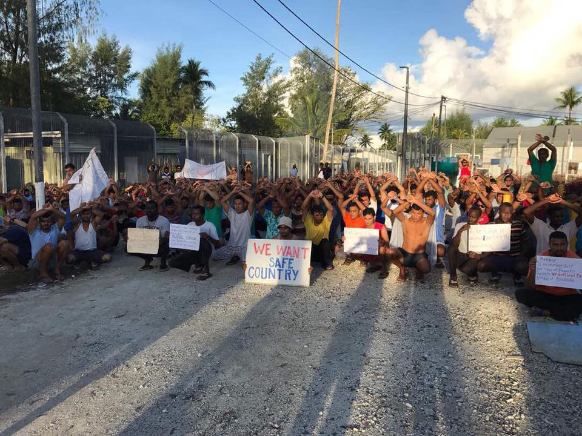

By Refugee Action Collective Victoria\.

The Australian government continues to ignore and dismiss their concerns\. Their only response is that the men have the option to return to their country of origin, be permanently resettled in PNG, or move to an unfinished and unsecure detention centre in the town of Lonrengau\.

A Manus detainee [Mansour Shoushtari, referred to](https://www.greenleft.org.au/content/voices-manus-we-will-never-move-another-prison) Lorengau as ‘the only town on Manus where the local people don’t want any stranger to live on their land\.’ The PNG authorities also [released a statement](http://www.sbs.com.au/news/article/2017/10/27/png-police-warn-refugee-and-worker-safety-not-guaranteed-manus-shutdown) saying they cannot guarantee the refugees safety in Lorengau\. All three options proposed leave the men in a more dangerous situation than at present\.

Nonetheless, the government continues its streak of mercilessness\.

On October 31, water, electricity, food and medicine were withdrawn from the old detention centre in an attempt to force the men out, leaving over six hundred persons abandoned\. In response, the PNG government has stated clearly that they [will not take responsibility for anyone that refuses](https://www.swissinfo.ch/eng/png-says-australia-responsible-for-hundreds-of-asylum-seekers-when-detention-camp-closes/43634706) to settle in PNG, arguing they are the obligation of the Australia\.

Refugees very clearly do not want to settle there, for serious fears of security\. _“We don’t want to live in PNG\. We have declared it many times\. Local people don’t want us, it is very clear,”_ [said Mansour Shoustari,](https://www.greenleft.org.au/content/voices-manus-we-will-never-move-another-prison) another Manus detainee\.

This in turn resulted in the [detainees barricading themselves within the old centre](http://www.news.com.au/national/politics/refugees-on-manus-island-fear-for-their-lives-as-the-closing-detention-centre-is-looted-by-locals/news-story/43dde06099d45d2d075cd518b18c67b4) , peacefully refusing to be transferred despite rapidly deteriorating conditions\.

Behrouz Boochani, a journalist and detainee has in [a recent article published by The Guardian](https://amp.theguardian.com/commentisfree/2017/nov/13/all-we-want-is-freedom-not-another-prison-camp) pointed out that the central reason for their resistance is unlawful imprisonment\. He states that _“for more than four years the refugees of Manus prison have been detained for no reason, incarcerated without committing any crime\. During these years lives have been destroyed and many families torn apart… The peaceful protest by refugees is not because we want to remain in this prison\. We are resisting because we want freedom in a safe environment\. The core concern is freedom … only freedom…and it is this point that is always forgotten or ignored\.”_

Since the barricade began, men have been without water for nearly two weeks and have been forced to dig in search for it\. A lack of medicine has placed people in a grave position, especially in light of the fact that over two thirds of detainees on Manus are reliant on mood stabilizing medication\.

Recently, a class of graduating doctors in Australia [wrote an open letter](https://www.buzzfeed.com/aliceworkman/we-are-watching?utm_term=.ccXJy6aGlR#.mibgyl9845) to the government decrying their actions on Manus as “willful neglect”\.

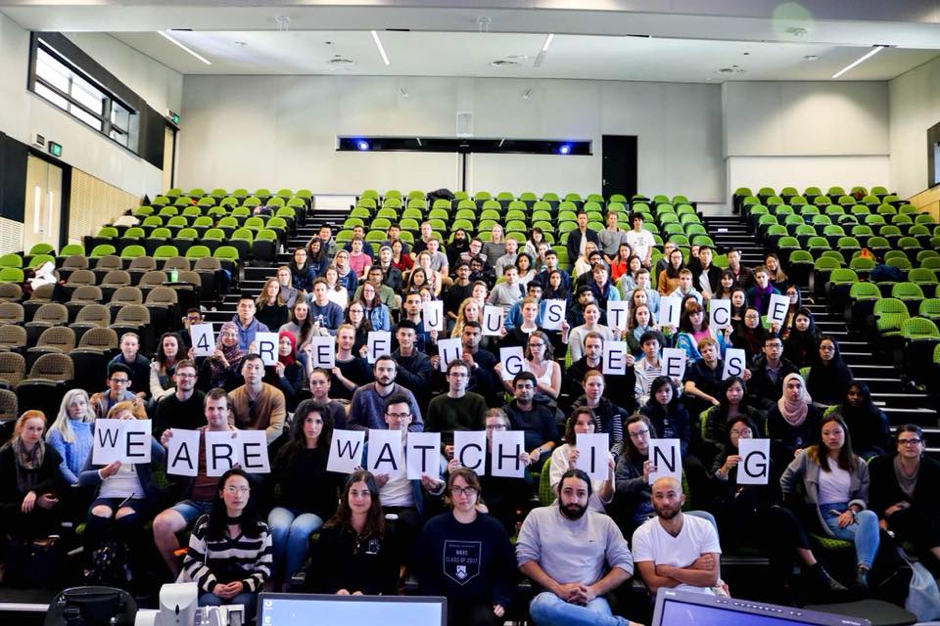

By Whistleblowers, Activists and Citizens Alliance\.

The detainees last week attempted to [file a lawsuit saying](http://www.sbs.com.au/news/article/2017/11/07/png-court-rejects-application-restore-food-water-and-power-manus-detention-centre) that the actions on October 31 amounted to a breach of their constitutionally protected human rights\.

And it’s not just ordinary people who are supporting these claims, but large international bodies too\. The United Nations came out with a [clear message to the government\.](http://www.abc.net.au/news/2017-11-03/manus-island-un-calls-on-australia-to-end-centre-stand-off/9117996) _“We call on the Australian Government, the party who interned this men in the first place to immediately provide protection, food, water and other basic services\. Their fears should be respected…we urge the men to be transferred to Australia,”_ they stated\.

However, this too has been futile in causing any reasonable action by Australian leaders\. In recent days, the PNG Navy has moved in to forcibly remove the men, with many of them continuing to resist the transfer\. _“Police and immigration came in again\. They are destroying our shelters in Delta\. They destroyed the rubbish bins where we have been collecting water too,”_ revealed Behrouz Boochani, a Manus detainee on Twitter\.

By Walid Zazai

The government’s irresponsibility and inaction is causing the already tense relationship between the refugees and locals to worsen, many anticipating that this could turn into another violent standoff\.

The men on Manus often refer to themselves as ‘the forgotten men’ — stateless and outside of the protection of the law\. It is extremely concerning that a country such as Australia has inflicted this fate upon both refugees and the local people of Manus and Nauru\.

**How did we get to this point?**

Australia’s refugee policy has not always been so heartless\. Increased ‘toughness’ in policy began in 2001 when the Government and affiliated media agencies, propagated racialized hysteria surrounding “boat people”, who “had to be stopped” from overwhelming the country\. This public frenzy worked to blind Australians to the reality of what was being signed off and executed in their name; the torture and imprisonment of refugees using tax payers’ money\.

The hysteria gave the government enough of a head\-start to establish its offshore detention policy **_“the Pacific Solution,”_** the true nature of which Australian people and the international community were purposefully and forcefully kept in the dark about\.

**_The Pacific Solution_** is the policy for a series of practices set up to transport asylum seekers that had either arrived on Australian shores, or were in the process of attempting to do so, to nearby low\-income island nations in the Pacific Ocean\. Whilst The Pacific Solution ceased in 2007, its influence on policy\-making has been long\-lasting with subsequent governments on both sides of the political coin [\. Even the EU has drawn inspiration from the policy\.](https://theconversation.com/european-leaders-taking-cues-from-australia-on-asylum-seeker-policies-66336)

At the time that the policy was coming to fruition, the ‘boat people’ were never referred to as asylum seekers, despite being some of the world’s most vulnerable people who risked their lives and the lives of their families to seek protection from Australia\. During this premeditated frenzy, they were referred to as ‘illegals’ and the most darkly comical of all ‘queue jumpers’\. A term so tactical and manipulative it tested one of most noble values as Australian’s: the right to ‘a fair go\.’

Yet what was established on these Islands was something so hostile and unimaginable that the government knew they had to actively and seriously work on keeping it a secret\.

The offshore detention centres were banned to all media and hidden away from the eyes of the Australian public\. They forced workers in the centre to sign nondisclosure clauses in contracts, and even passed a Federal Law that would persecute any whistle\-blowers for speaking out on what was happening in Australia’s offshore prison camps\.

Notably, Australia is a country that prides itself on free speech, but it appears that this only holds true when it doesn’t negatively impact those who are in power\.

**Australians are becoming more open minded, why isn’t our government?**

This was made visibly clear in this years “ [voluntary postal survey](https://www.thedailybeast.com/australias-messed-up-public-vote-on-same-sex-marriage) ” on gay marriage orchestrated by the Government that cost 122 million dollars\. The UN again shamed the Government, [declaring Australia’s voluntary postal](http://www.news.com.au/national/politics/un-human-rights-commission-slams-australia-on-refugees-policy-amid-manus-island-saga/news-story/2c70b77369adeedcfe970dfce87c161a) survey on gay marriage as “not an acceptable decision\-making method”\.

Results of the postal survey are due to be released next week, but early signs indicate that it will be a ‘yes’ for same sex marriage\. Whilst debate around the actual content of the vote has been divisive, Australians on both sides have lamented the cost of the survey\.

The government’s asylum seeker policies have also had a heavy burden on tax papers\. The cost of detaining a single asylum seeker on Manus or Nauru is 260,400 euros per year, which equates to over 650 euros per day\. Financial assistance provided for unemployed persons in Australia is 23\.50 euros per day\. Incredibly, it is 28 times more expensive to keep people in offshore detention than it is to bring them into the community and provide them with financial assistance\.

However, the policy is not just a waste of tax payer money\. It’s a breach of human rights that draws a strong correlation to historic Australian policies we all hoped were never to be repeated\. These policies that saw the slaughter and incarceration of the native Aboriginal peoples, the original owners and custodians of Australian land for over eighty thousand years, before the first white man ever stepped foot onto it\.

To put things into perspective — for people who are not so in tune with Australian history — this country has only existed for just over two hundred years\. Indigenous Australians have lived on this continent four hundred times as long\. Probably longer\. If you weren’t aware of this, you shouldn’t worry too much; Australian children are still not taught anywhere near enough about the history of Indigenous Australia at school\.

These past inhumane policies that were at the time considered lawful include the ‘White Australia Policy,’ a policy designed to ensure immigration to Australia was as Anglo\-Saxon as possible, and the ‘Stolen Generation’ policy, under which thousands of indigenous children were removed from their families and placed with white households in an attempt to erase them of their culture\.

RISE, an organisation initiated and run purely by ex\-detainees and Asylum seekers, has set up a campaign called [**Sanction Australia** \.](http://riserefugee.org/sanctionaustralia/) The campaign states that _“Australia should be excluded in participating in international humanitarian and human rights until mandatory detention and refoulement of asylum seekers is abolished in this country, and the obligatory international rights and protections that Australia has agreed to, in regards to refugees, are implemented, and adhered to domestically\.”_

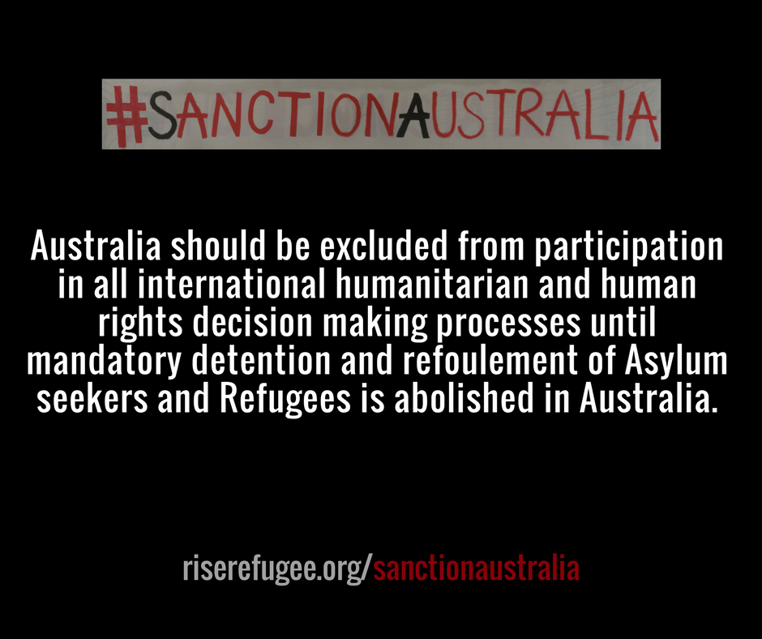

**We are speaking out**

It was as a consequence of the [‘Nauru Files’](https://www.theguardian.com/news/series/nauru-files) released by the Guardian in August 2016, that the dark and shameful inner workings of Australia’s offshore detention centres were exposed\. The Nauru files comprised of 2,000 leaked reports that for the first time revealed the scale of abuse, sexual assault and self\-harm inflicted on residents there\. Most alarmingly, allegations involving children made up more than 50 percent of the 2,000 leaked reports\. Since the release of the Nauru Files, the Australian Government’s treatment of asylum seekers has drawn widespread criticism\.

Even the campaign launched by previous governments to ‘stop the boats’ which argued that toughness in policy was the only way to prevent deaths at sea is now also largely questioned\. What once seemed to be a reasonable argument for the offshore detention policy, has been overshadowed by the exposure of the cruel and life\-threatening treatment of refugees on Manus and Nauru\.

The recent events on Manus that have caused a horrifying humanitarian emergency only exemplify this fact\. The question being asked is ‘what is the point of stopping deaths at sea, just to cause deaths to occur on land?’

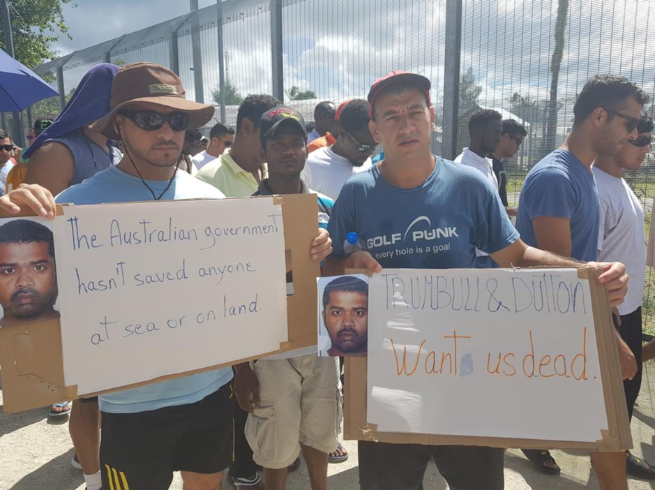

By Refugee Action Colletive Victoria\.

In Australia the policy is being spoken out about and protested against, and the international community is invited to raise their voice too\. Australian voices are becoming louder and angrier\. And the protests are becoming more and more disruptive as Australians realize the rights that have not only been taken away from the innocent men, woman and children who have been detained for nearly five years in these government run prisons, but their own right to having a voice that is heard and listened to as citizens of a democratic country\.

The Australian Council of Trade Unions, Australia’s peak body for unions which represents around 1\.8 million workers and their families, came out with a [statement of solidarity](https://www.actu.org.au/actu-media/media-releases/2017/end-manus-crisis-now) with the men on Manus\. _“The ACTU joins the millions of disgusted and appalled Australians who stand with the men on Manus, and the families on Nauru\. Evacuate them now\.”_

Some inspiration that things won’t be like this in Australia for too much longer can be gained from the young community that has been especially vocal and angry, both about the gay marriage postal survey and the government’s treatment of asylum seekers on Manus and Nauru\. [Last week alone saw](https://www.theguardian.com/australia-news/2017/nov/13/australian-activists-vow-to-press-on-with-pro-refugee-manus-protests) Australians climbing the Sydney Opera House, blocking a busy train line with a car, disrupting the ‘Melbourne Cup’ a huge yearly event and barricading the doors of Border Force, refusing entry or exit of workers\.

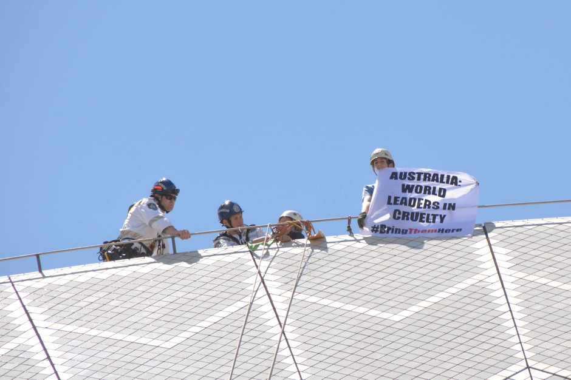

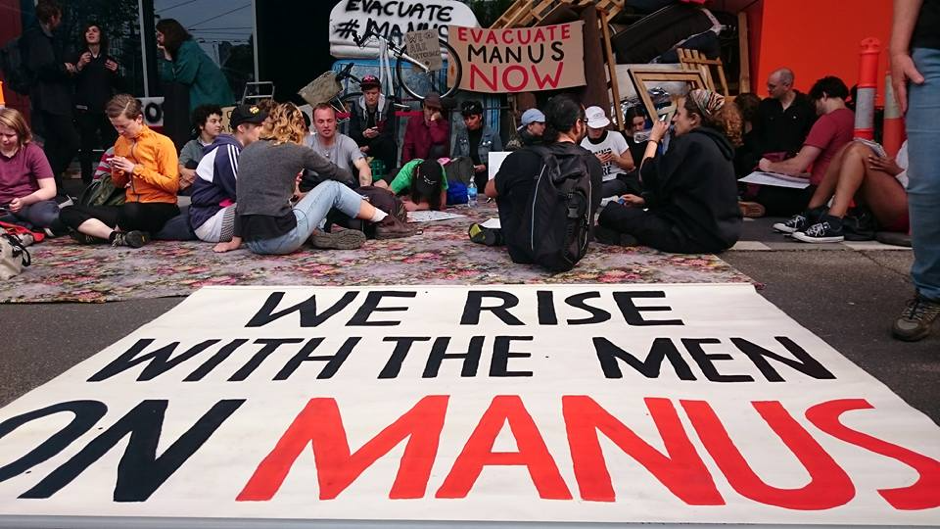

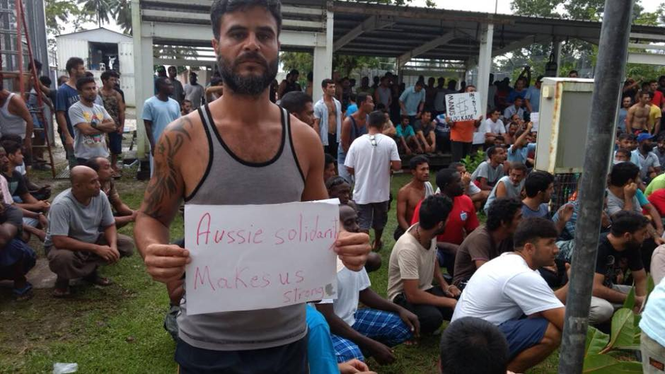

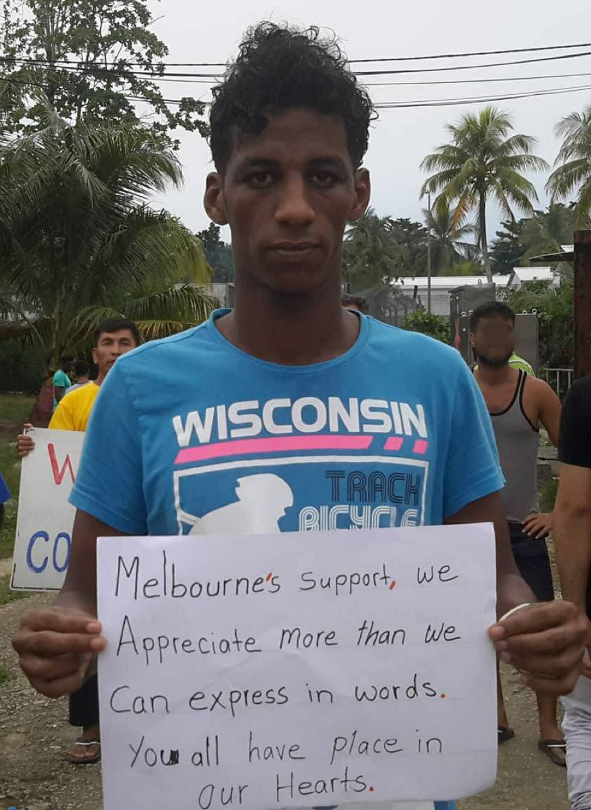

By Whistleblowers, Activists and Citizens Alliance

These and many other protests have attempted to bring attention to the situation of those on Manus and show their solidarity with the men\. All protests have demanded the Government to evacuate Manus and Nauru immediately\. It is only reasonable to expect this sort of activism to increase in disruptiveness and scale so long as the government continues to ignore the wishes of a growing percentage of the Australian public\.

**Is there hope for the Asylum Seekers in Australia’s offshore Detention Centres?**

The current government is defying all logic in their search for a solution and response to the crisis\. There are small glimpses of hope for resettlement but whenever they come they seem to be transient and short lasting, with refugees now opting to ‘believe it when they see it\.’

In late April 2016, the government refused an offer from New Zealand to resettle 150 detainees from Manus and Nauru annually\. This was despite a [poll conducted by Save The Childre](https://www.savethechildren.org.au/about-us/media-and-publications/media-releases/media-release-archive/years/2016/new-national-poll-reveals-australians-want-stalemate-on-nauru-and-manus-island-to-end-and-for-malcolm-turnbull-to-act-urgently-to-re) n which concluded that 75 percent of liberal voters think that the Prime Minister Malcolm Turnbull should accept New Zealand’s offer to resettle refugees\.

New Zealand’s new Prime Minister Jacinda Arden met with Malcolm Turnball this month, again announcing that New Zealand’s offer stands\. _“I see the human face of this and I see the need and the role New Zealand needs to play\. I think it’s clear that we don’t see what’s happening there as acceptable, that’s why the offer’s there,”_ she said\.

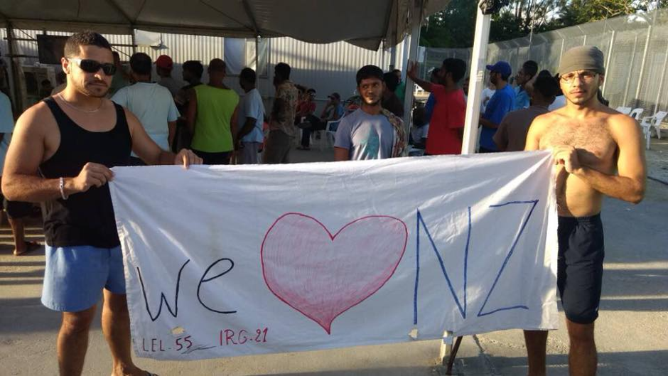

By Refugee Action Collective Victoria

However, the offer was again rejected on basis of an agreement made with the United States during the Obama Administration which claimed that America would resettle 2,000 refugees from Australia’s offshore centres\.

With Trump now in office, the deal underwent some internal modifications\. America announced they would abide by the deal \(to some extent\) and will over an undetermined amount of time resettle an undetermined number of refugees, with a focus being placed on woman and children\. Trump notoriously [called the deal with Australia ‘stupid’](http://www.abc.net.au/news/2017-08-04/donald-trump-told-malcolm-turnbull-refugee-deal-was-stupid/8773368) , and the possibility remains that he might torpedo it entirely\.

As a consequence, this deal is an unreliable solution and it does not account for the men currently stuck on Manus Island\. So far only fifty refugees have been resettled in the United States and it remains unclear when and whether more will follow\.

A group of refugee activists from the Refugee Action Collective believe the most reliable long\-term hope for a solution is convincing the change on the asylum seeker policy\.
### **What can be done:**

> A growing percentage of the Australian public are raising their voices demanding that action is taken immediately to deal with the self\-created humanitarian crisis’ on Manus and Nauru\. Accepting New Zealand’s offer is a logical first step towards fulfilling this duty\. 

> You can raise your voice too by [emailing Australian Foreign Minister Julie Bishop](https://www.juliebishop.com.au/connect-with-julie/enquiries/) and demand that the Australian Government evacuate everyone on Manus and Nauru and accept New Zealand’s offer of resettlement\. 

**_\(By Manja Petrovska\)_**

> **_We strive to echo correct news from the ground through collaboration and fairness\._** 

> **_If there’s anything you want to share or comment, contact us through Facebook or write to: areyousyrious@gmail\.com_** 

_Converted [Medium Post](https://areyousyrious.medium.com/ays-special-australians-want-refugees-safely-resettled-its-the-government-that-doesn-t-83ee06d17cfe) by [ZMediumToMarkdown](https://github.com/ZhgChgLi/ZMediumToMarkdown)._
