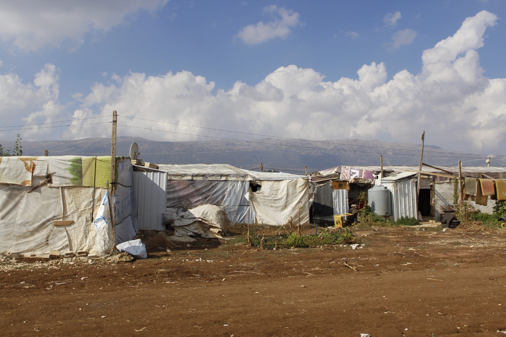
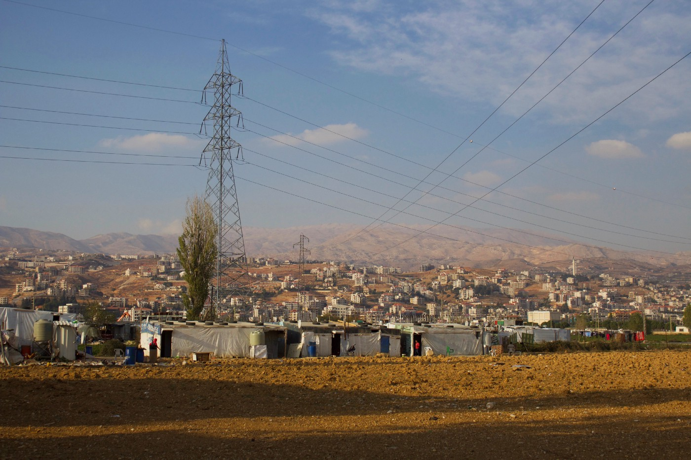
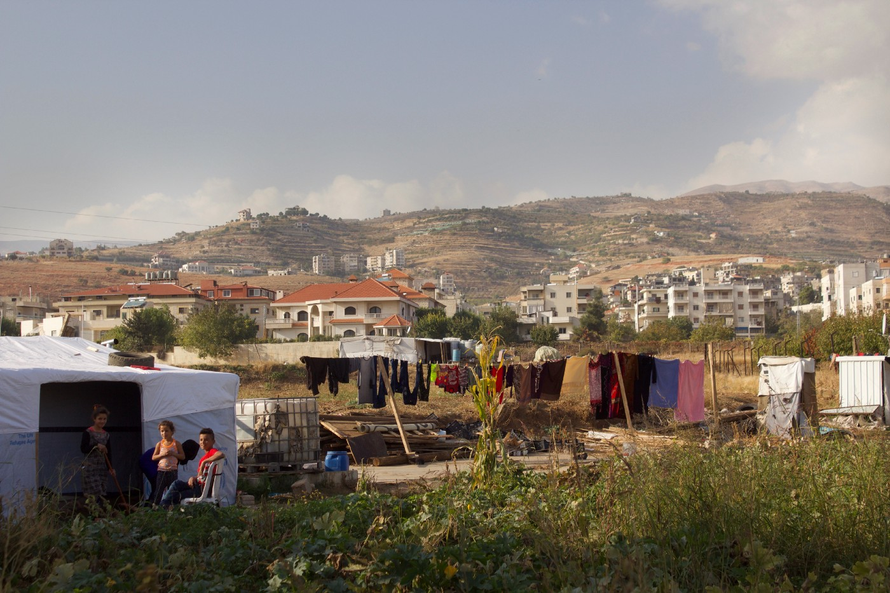
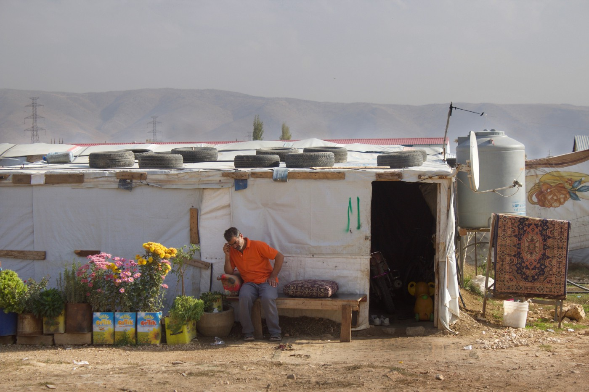
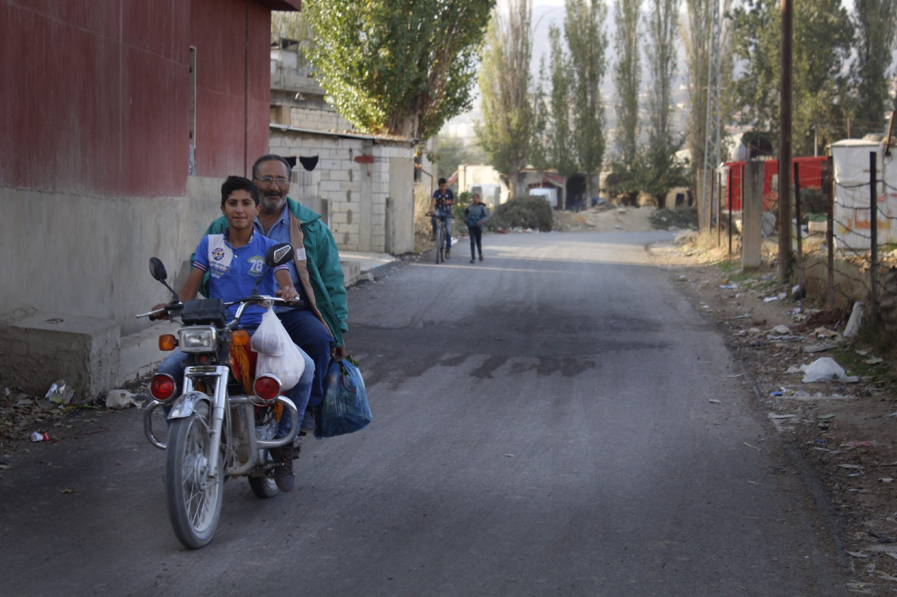
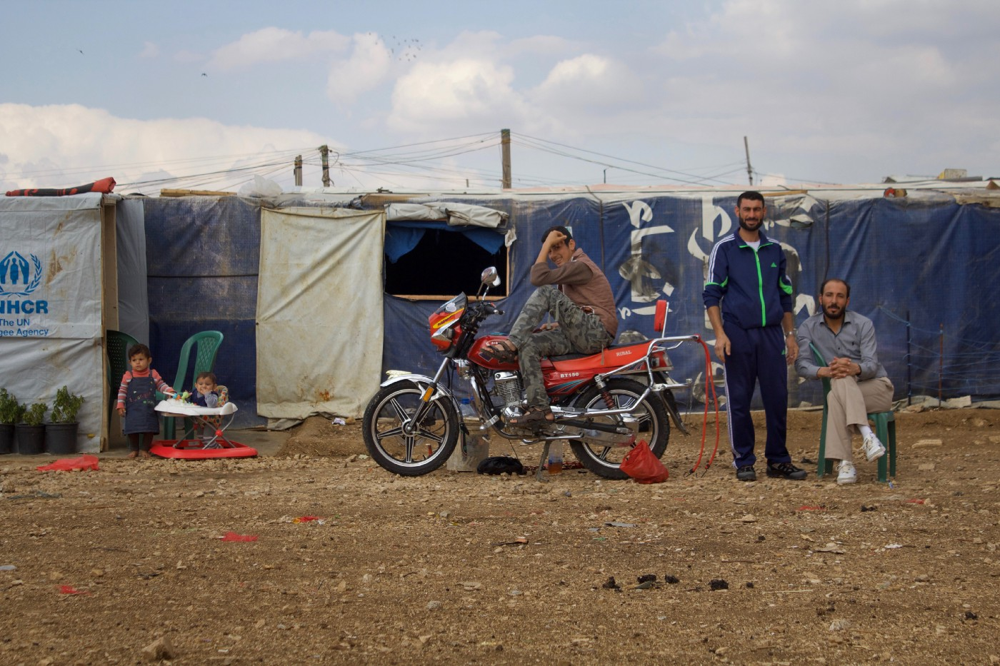
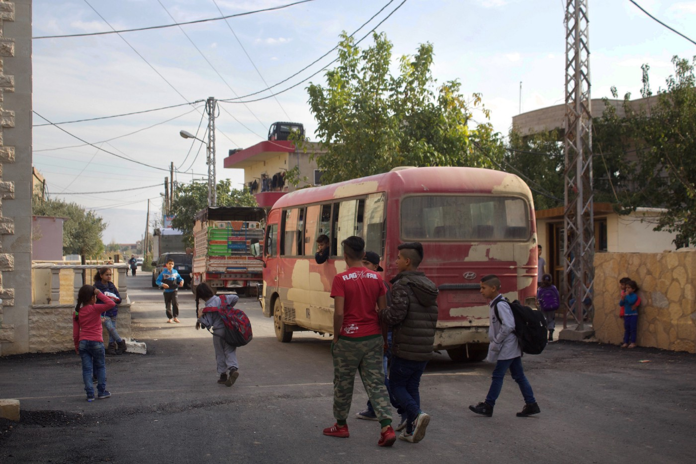
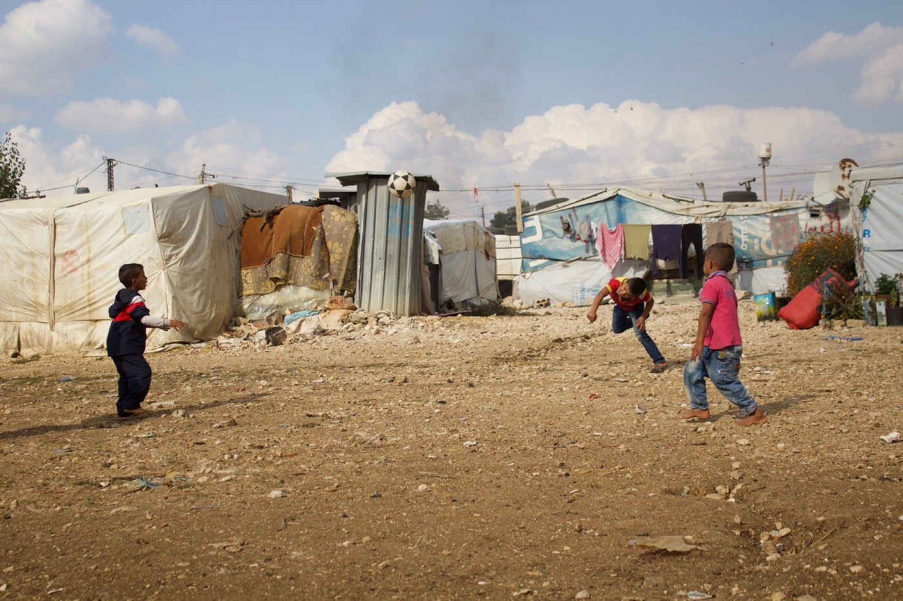

### AYS Special: Pieces of the everyday life in Beqaa valley

_In the Beqaa valley, a beautiful place located between the high mountains in the northeast of Lebanon, the refugee population per capita is one of the biggest worldwide\. Regardless of that, there is no official camps in the country\. The chances to integrate into the Lebanese society are few since Syrians \(and Palestinians\) aren’t allowed to neither have qualified jobs nor own any property\. The situation creates a limbo for people that are stuck here — trapped between several layers of excluding policy’s\. Here are some stories from and about the valley\._

Almost two years ago a staff member from the UNHCR said that _“the biggest and worst crises always seems to happen in the most beautiful environments\.”_ This was on the border between Macedonia and Greece, looking through the barbed wire fence towards the over\-crowded Idomeni\. It was a terrible place, but surrounded by the most amazing nature\. If the barracks in Belgrade proved his thesis wrong, since few things there could be described as incredibly beautiful even with the best of intensions, sunny days in Beqaa confirms it\.

Photo: AYS

One of the biggest contrasts between Beqaa and Europe is that the situation in Lebanon is much more continuous\. People are stuck\. In a very simplistic way, it’s possible to say that whereas the Syrian middle class had money enough to travel to Europe only to be stuck in situations and processes they never expected, the already less fortunate before the war now lives in settlements and camps in Lebanon, Jordan and Turkey\.

The crisis here is not considered to be that emergent any more\. The international community is looking the other way\. Even though emergency response not always is necessary, people suffers from the long\-term displacement in many ways\. Lack of money, education and access to healthcare are some of them that all leads to a situation no one will benefit from in the long run\.

With no official refugee camps, no equal rights and no chances of getting asylum, but the possibility to live — or exist — on Lebanese soil, the shattered Lebanese authorities pretends as nothing\. They are more or less doing nothing, neither helping nor forcing people to leave their territory\. The tone has become harder though\. While Hassan Nsralla, Hezbollah’s front figure, recently said that his party would support the governments decision either way around, [President Michel Aoun](https://www.reuters.com/article/us-lebanon-politics-refugees/syrian-refugees-should-return-to-calmer-areas-lebanon-president-idUSKBN1CL1EW) has declared that Lebanon can not handle the situation as it is much longer\. According to him, parts of Syria is safe\.

At the same time, humanitarian organisations such as the UNFPA confirms that they can not support a decision saying that people should be returned before the situation is more stabilised\. Meanwhile, MSF recently reported about the terrible situation in Arsal, which more or less forced people back\.

With Fortress Europe in the north, the limbo is a well\-established fact for roughly 1,5 to 2 million people in Lebanon — stuck between several layers of excluding policy’s\. And people are also still arriving\. When ISIS strongholds falls and with them the siege people are leaving\. Everything at the same time as the rest of the world focus on the possibilities to return people back to Syria\. The situation in Beqaa is almost as complicated as the war in Syria\. Everyone has their own reasons for fleeing, returning or staying\.

Photo: AYS

Regardless of politics, the everyday life is ongoing in Beqaa\. Since the war in Syria started Lebanese villages has been through a period of change as well\. They have grown and changed shape when informal settlements has been growing in and on fields around them\. Whereas it at some places have been done peacefully, the big influx of refugees from Syria has increased tensions in other locations\.

Bad living conditions, lack of education and high unemployment rates leads to social issues such as various forms of criminality, violence and problems with drugs or alcohol\. Just as in any other low\-income neighbourhood where people do their best in order to cope with the circumstances given\. Although, the majority of the small, self\-built houses in the Beqaa valley are well kept with beautiful Persian carpets on the concrete or muddy floors, colourful pillows and mattresses along the walls

Photo: AYS

Photo: AYS

> “Do you want coffee?” 

Many Syrian men work either with farming or construction\. 
When the winter and colder weather comes, many of them will be unemployed\. A lot of women are also working\. Families are often working for their landlord in order to pay the rent or at least decrease the cost, which could be described as a form of modern slavery\. Everyone is responsible for their own housing, since there are no camps\. Hence the term “informal settlements\.”

Syrians are cheaper work force than Lebanese, which triggers the salaries in a downwards spiral\. One Syrian lady, whose husband one day went to the local supermarket and then never came back, is cleaning several shift in schools in order to financially support herself and her three young children\. Her monthly wage is about 100 US dollars\. 70 percent of the 500 000 people in Beqaa lives below the poverty line, of whom 50 percent are counted as “extremely poor\.”

 ’s mobile rock\. Photo: AYS](assets/2bad528e8522/1*yq-9GitxJOk-1H5PgEOyJw.jpeg)

Youths are hanging out and practice climbing at [ClimbAID](https://www.facebook.com/ClimbAID/) ’s mobile rock\. Photo: AYS

 , school bus on a field nearby a settlement\. Photo: AYS](assets/2bad528e8522/1*RIUj1sJvYAB7Byt1zsCfvA.jpeg)

Kids are playing around [Salam LADC سلام](https://www.facebook.com/salam.ladc/) , school bus on a field nearby a settlement\. Photo: AYS

Volunteer organisations are working everyday to provide education, health\-support and many other services in several settlements\. But since there are approximately 4000 in total, it is impossible for each organisation to keep track of them all\. One of the organisations active in the region is [Salam LADC سلام](https://www.facebook.com/salam.ladc/) , , who runs different long term projects\. Many of the projects are focused on the wellbeing and livelihood for refugee children and vulnerable Lebanese children\. Another one is [ClimbAID](https://www.facebook.com/ClimbAID/) , who have been running climbing sessions several times a week in a number of settlements with their mobile climbing wall since August\.

Many children are now going to school but lack of places has created a situation where Lebanese children are going to school in the morning and mainly Syrian children in the afternoons or evenings\. The schoolbus is taking them back and forth\. Teachers are sometimes working double shifts in order to provide education for everyone\. Many have also missed out on a couple of years of education\.

Photo: AYS

Photo: AYS

> “Which team is your favourite? Barcelona or Madrid?” 

The war in Syria has been ongoing for more than six years\. Many children have never been in the country that was supposed to be their country of origin\. _UNICEF_ , among other humanitarian groups, has been warning for what will happen with all the children born during the war\. A lot of kids are born without citizenship, and the parents has to register them with UNHCR before they are one years old\. But, in order to do so they have to be in Lebanon legally, which means that they have to pay a fee to the UNHCR\. Not everyone has enough money for that\.

Photo:AYS

Today, tomorrow and the day after that politicians will try and solve the “refugee crisis” by several agreements, deals and decisions that people affected of them have very little impact on or knowledge about\. At the same time life will continue here\. It is rarely as obvious how far away from each other political solutions and reality is as in the Beqaa Valley 2017\.

By: Hanna Strid
#### Help needed as cold winter is coming to Beqaa soon\!

[**Salam LADC سلام**](https://www.facebook.com/salam.ladc/?ref=br_rs) is [fundraising](https://www.generosity.com/…/winterizat…) in order to keep more people, mainly families with young children, warm during the upcoming winter months\. Please consider donating if you can\. Small amounts of money will make a big difference on the ground\.

Follow [this link](https://www.generosity.com/…/winterizat…) for more information\.

> See our previous report from Lebanon: 

[**Precarious living conditions for millions of refugees in Lebanon**](ays-special-precarious-living-conditions-for-millions-of-refugees-in-lebanon-81f8845b6a9a) **\.**

> **_We strive to echo correct news from the ground through collaboration and fairness, so let us know if something you read here isn’t right\._** 

> **_If there’s anything you want to share, contact us on Facebook or write to: areyousyrious@gmail\.com\._** 

_Converted [Medium Post](https://medium.com/are-you-syrious/ays-special-pieces-of-the-everyday-life-in-beqaa-valley-2bad528e8522) by [ZMediumToMarkdown](https://github.com/ZhgChgLi/ZMediumToMarkdown)._
