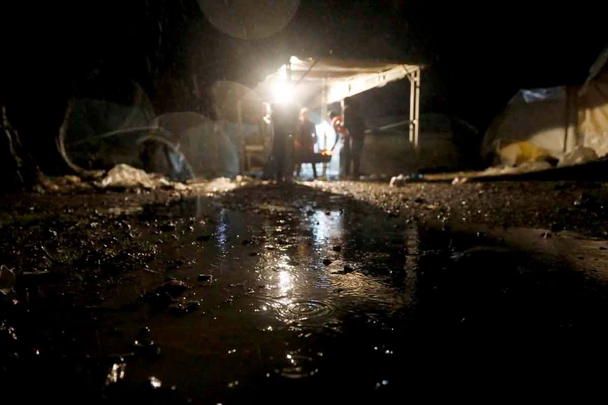
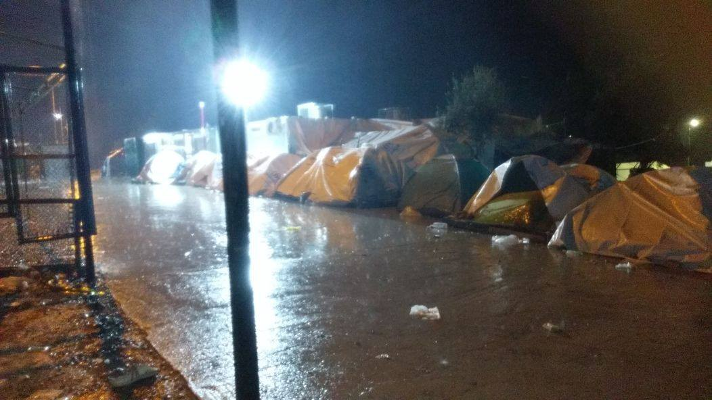
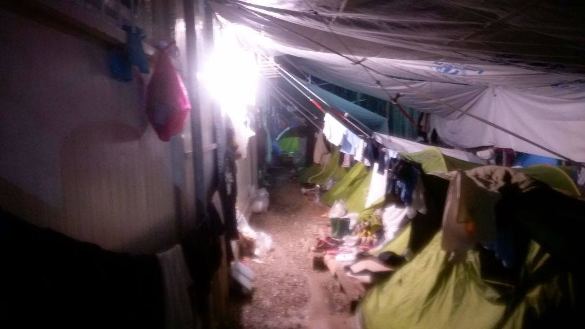
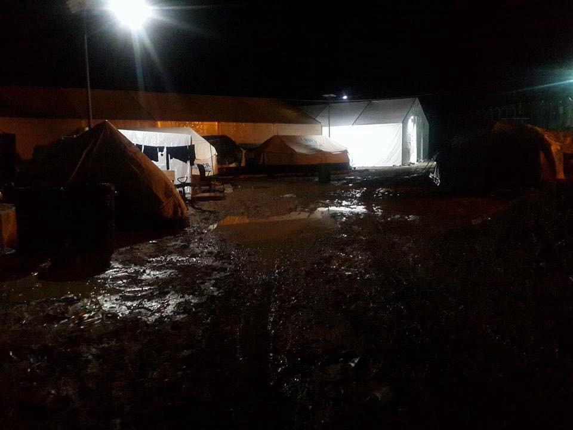
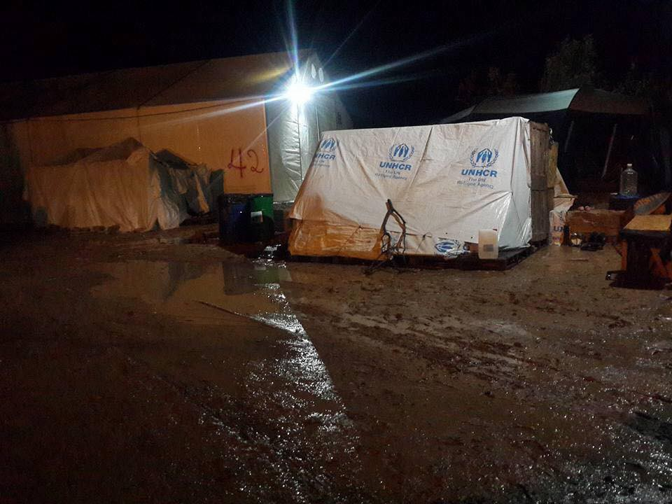
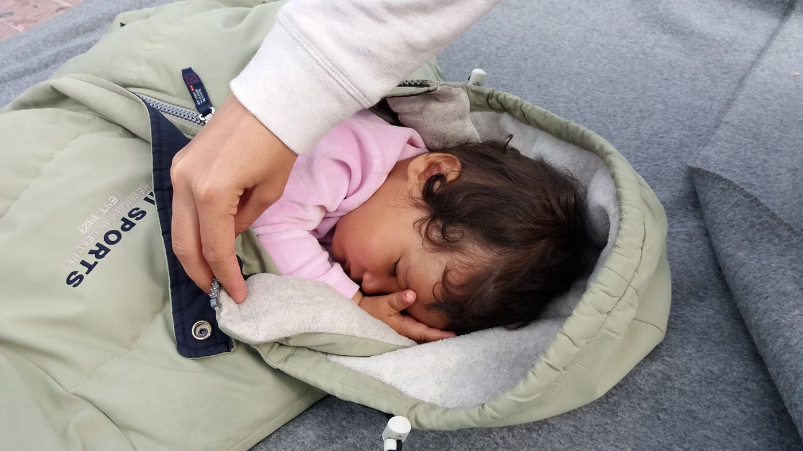
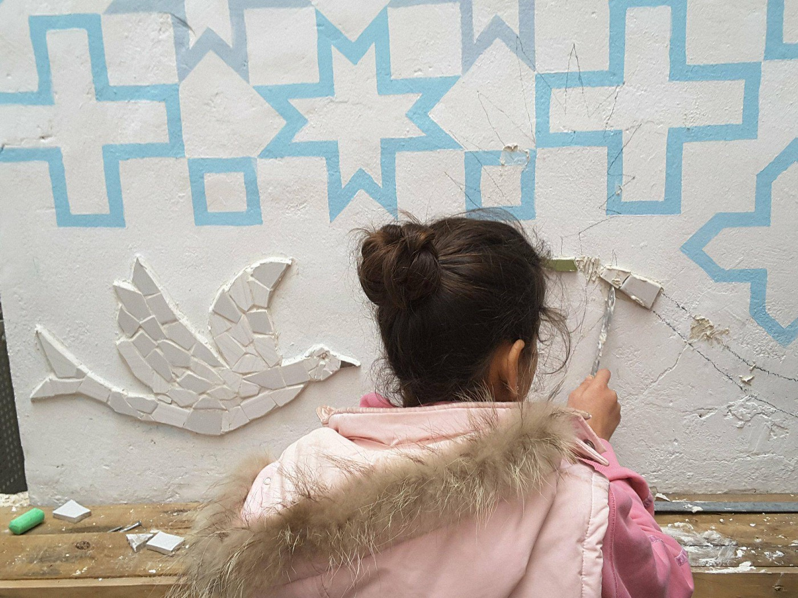
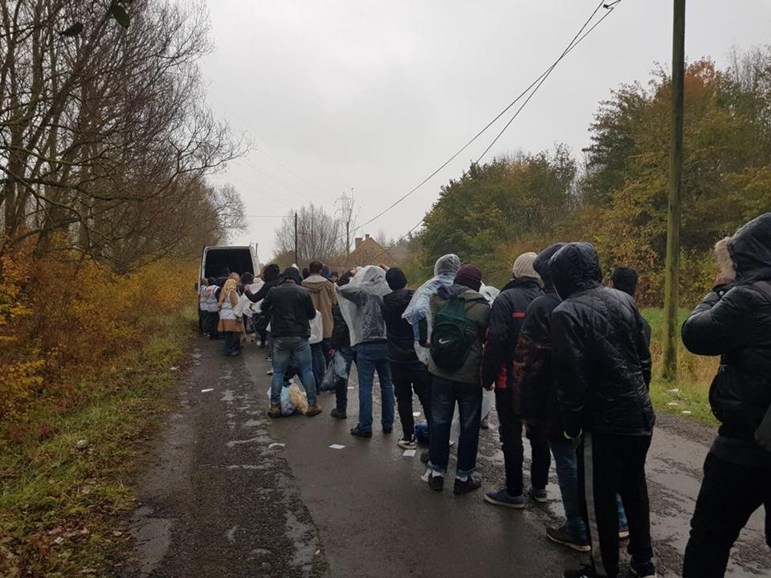
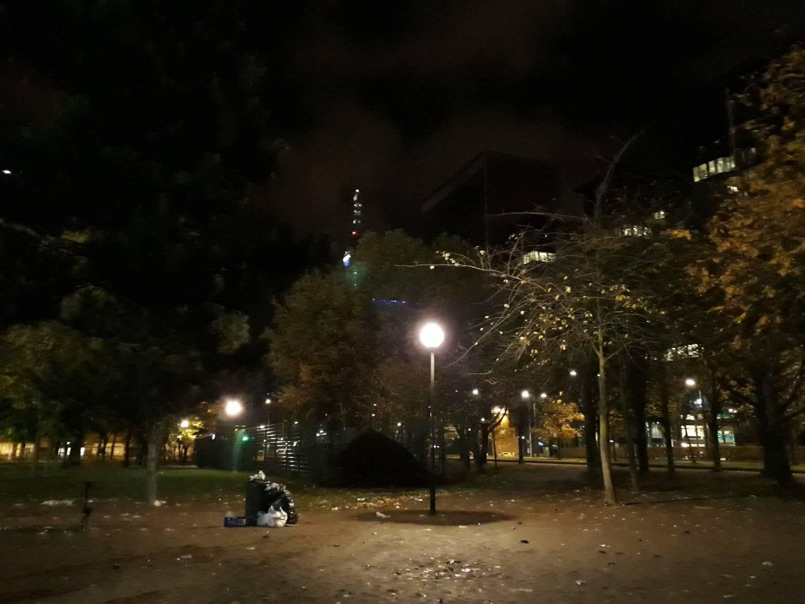
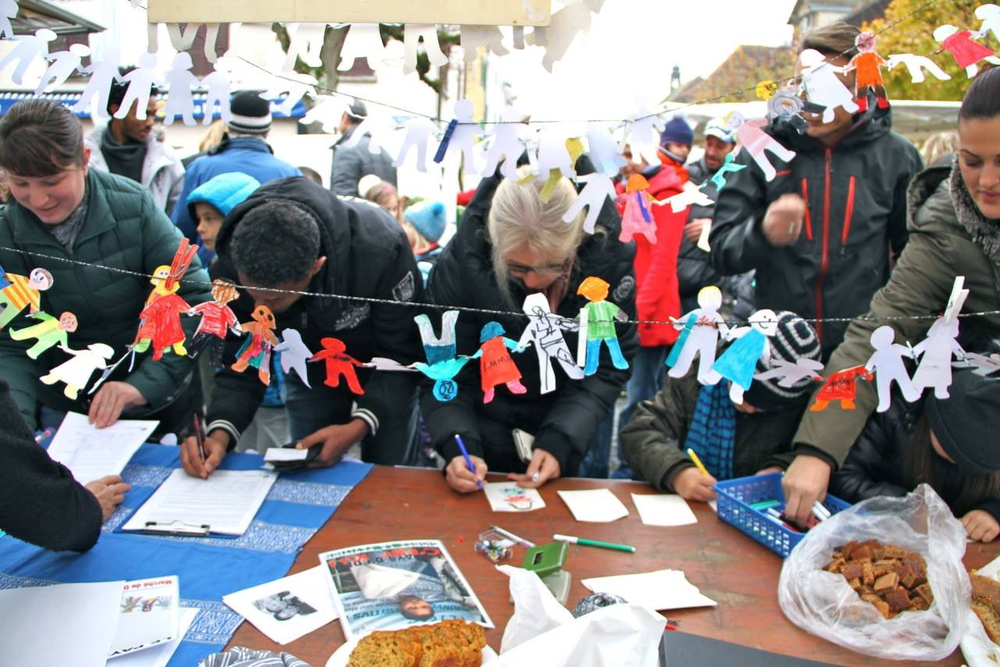

### AYS DAILY DIGEST 18/11/2017: Who will take responsibility for the death of an 11\-year\-old boy in Austria?

_European policies are killing children, again // People stranded on Greek islands are begging for help, as well as their hosts // Over 1000 people in the streets of Paris desperately needs help // Solidarity still exists in Europe — no people left to sleep outside in Brussels_

 \.](assets/ec8349cbfbc/1*BevJB2rSN4u7enSPjrd-lw.jpeg)

Children are left in unbearable conditions, with minimum care, all over Europe\. This is a child who lives in camp on Lesvos\. Photo by [Giorgos Moutafis](https://www.facebook.com/giorgos.moutafis.5) \.
### Feature

Five days after his death in a Viennese hospital, the media learn of the boy, an 11\-year\-old from Afghanistan, who committed suicide in a refugee camp\. Apparently, the authorities are investigating the case, but it is not clear why the public do not have more information about it\.

According to the media reports, the boy lived in a center in Baden, south of the capital, and was taking care of six siblings after his 23\-year\-old brother left, probably in hopes of finding a better life for them all\.

Austrian public broadcaster Oe1 reported that state officials were aware of the difficult situation but did not react in time\. Those in charge are responding to these accusations by saying they had noticed “nothing unusual”\. Does this imply that in Austria it is normal for 11\-year old children to be taking care of their family ?

It is difficult, impossible, to comment on the suicide of the 11\-year\-old child\. It is even less possible to understand how human rights just died in Europe, almost over night\.

While leaders in EU still have the courage to be critical of other leaders around the world, they are leaving children and people who are seeking help to live under unbearable conditions\.

How many children have to die for EU leaders finally to start acting at least humane? Even one child is one too many\.
### General

The ECRE and ELENA networks have [published a new legal note](https://www.ecre.org/ecre-elena-legal-note-on-access-to-legal-aid-in-europe/) on asylum applicants’ limited access to legal aid in Europe\. They report a very worrying trend of unavailability of access to legal aid\.

They highlight that access to quality legal aid is an irreplaceable feature of a fair asylum system and is crucial for safeguarding the fundamental human rights of those seeking asylum\. Access to quality legal aid protects asylum seekers against erroneous decisions and arbitrariness\.

They also claim that access to legal aid early on in the procedures may also reduce financial costs by the potential reduction of appeal rates\.

The European Parliament has started talks on changing the Dublin System in a bid to ensure that asylum seekers are fairly shared among EU member states\. The country of entry is no longer responsible for processing asylum applications\. They threaten that those who do not accept their fair share of responsibility for hosting asylum seekers may lose their EU funds\.
### Turkey

According to the latest [UNHCR](https://reliefweb.int/sites/reliefweb.int/files/resources/UNHCRTurkey-KeyFactsandFigures-October2017Snapshot_0.pdf) data, there are over 3\.6 million refugees—most of them \(3\.2 million\) from Syria—currently in Turkey\.

Of this number, 344,645 people have been registered since the 31 October 2017\.

After Syria, the greatest number, 44 percent, are coming from Afghanistan, 42 percent from Iraq, 10 percent from Iran\.

### Libya

In Libya authorities have launched an investigation into slave auctions following the release of a [CNN report](http://edition.cnn.com/2017/11/14/africa/libya-migrant-auctions/index.html) , but also several reports by different human rights organizations\. Part of the work involves assessing whether the auction locations are under the control of the Government of National Accord in Tripoli\.

Othman Belbeisi, the Chief of Mission at the International Organization for Migration \(IOM\) released a statement on Twitter welcoming an investigation into the slave auctions, hoping it will cover all the abuse and violence against migrants in Libya\. He also highlights that to be able to stop the smuggler networks, there needs to be an increase in political, economic and security stability in the country\.

So far, most of the international organizations and institutions condemn what is happening in Libya, but not much has been done to stop or prevent it\. The governments in Europe are still not capable of realizing how damaging their agreements with Tripoli are, and that due to that, we all are being pushed back to the times of human slavery\.

Some in Paris tried to raise their voices against the slavery in Libya, but instead of using their force against human traffickers, the police in this city decided to use it against people who are fighting for basic human freedoms\. Many of refugees and migrants who are left to stay on the streets of this city went through Libya and they can tell horror stories about their experience\. But, will anybody listen?

■■■■■■■■■■■■■■ 
> **[Persona @ubique@mastodon.social](https://twitter.com/PersonalEscrito) @ Twitter Says:** 

> > #Paris, #France: Police crackdown on protesters on #ChampsElysees during an unauthorized protest against slavery in #Libye. Video: @[ClementLanot](https://twitter.com/ClementLanot) https://t.co/Ic1DfhSvlm 

> **Tweeted at [2017-11-18 22:02:38](https://twitter.com/personalescrito/status/932006156654055424).** 

■■■■■■■■■■■■■■ 

### Sea

And people are still trying to cross the sea to Europe\. It is dangerous and almost impossible\.

■■■■■■■■■■■■■■ 
> **[MSF Sea](https://twitter.com/MSF_Sea) @ Twitter Says:** 

> > #Aquarius is in choppy seas with waves up to 2 metres. With conidtions like these rescues can become critical within minutes https://t.co/QFnJDo0RvT 

> **Tweeted at [2017-11-18 10:44:13](https://twitter.com/msf_sea/status/931835429468418048).** 

■■■■■■■■■■■■■■ 

Rescuers need help to continue helping save people from the sea\.

■■■■■■■■■■■■■■ 
> **[MISSION LIFELINE](https://twitter.com/SEENOTRETTUNG) @ Twitter Says:** 

> > MISSION LIFELINE saved several hundred people. Now we need your help more than ever. Please donate now! [betterplace.org/en/projects/46…](https://www.betterplace.org/en/projects/46977-mission-lifeline-search-and-rescue) https://t.co/diSiy7m6RE 

> **Tweeted at [2017-11-18 16:03:44](https://twitter.com/seenotrettung/status/931915835836370945).** 

■■■■■■■■■■■■■■ 

### Greece

Two boats arrived in Lesvos during the night\. One landed in the South — 51 people\. The second was picked up off the coast of Palios in the North East — 63 people\.

One boat carrying approximately 30 people also arrived in Kos yesterday\.

Torrential rains have hit Greece over the last week causing flash flooding in many areas, and the forecast predicts more rain in the coming days on the Greek islands\. These are some of the images coming from islands today\.

Lesvos

Chios

For months now, volunteers, locals, and refugees on the islands are pleading with the international community and the Greek government to bring attention to the situation on the islands which is only becoming more critical as the temperatures drop over the winter\.

Moria Hotspot on Lesvos is currently three times over capacity\. This has resulted in 3,000 people \(40 percent of them children\) needing to sleep in summer tents, many of which are not waterproof\. This has left thousands of people with no place to go to stay warm and dry\.

Last winter seven people died on this hotspot from the cold and the conditions have only worsened\. Fears are running high about the troubles this winter will bring\.

■■■■■■■■■■■■■■ 
> **[MSF Sea](https://twitter.com/MSF_Sea) @ Twitter Says:** 

> > Yesterday it rained in #Lesvos and ~3000 children, women and men stuck in #Moria had nothing but these flimsy tents to keep warm and dry. Well done #Europe. Now #opentheislands. https://t.co/Q8EcuaP42x 

> **Tweeted at [2017-11-18 11:50:43](https://twitter.com/msf_sea/status/931852165903200256).** 

■■■■■■■■■■■■■■ 

The local municipality of Lesvos has called for a general strike on November 20 in a bid to lift the ‘geographical exclusion’ policy so that refugees can be relocated to accommodations on the mainland, many of which are not full\. They say that the increase in new arrivals has peaked in the last months and this has resulted in serious overcrowding in understaffed camps, worsening the living conditions for the refugees and it is testing the patience of the local communities\.

In a public statement, the local authorities are requesting the government and the EU to stop the policy “that has transformed the island of Lesvos and the islands of the North and South East Aegean into prisons\.”

Meanwhile, the protest in the centre of Mytiline continues, reaching it’s 31st day\. So too, does the hunger strike\.

Among those who are staying on the main square in Mytiline are children\. There is not enough space for their families to stay in safe and warm places\. Photo Arash Hampay\.

Taking into consideration the views of all the parties on Lesvos, it is time to **\#opentheislands\.**

On Chios similar problems are being faced with overcrowding and the lack of appropriate shelters\. Many refugees on the hotspot Vial are refusing to eat the food served, claiming it was not cooked\.

Volunteers are needed at [Khora](https://www.facebook.com/KhoraAthens/?ref=br_rs) to facilitate child support in their community centre in Athens\. Ideally, the potential facilitators are people with experience in childcare and a commitment to creating a fun, positive, and safe environment for children and their families\. Positions can be full\-time or part\-time and ideal availability is 3–6 months\.

Looking for someone who can start any time from now on\. If this sounds like you, get in touch with Helen and Christa at nelgillespie@yahoo\.co\.uk & [christastengardgreen@gmail\.com](mailto:christastengardgreen@gmail.com) \.

Another group operating in Athens, [Dentists 4 All](https://www.facebook.com/dentists4all/) , are looking for a professional dentist to volunteer with their team\.
### Italy

There have been 30 percent fewer sea arrivals in Italy in 2017 than there were in 2016\.

Monthly arrivals have slowed even more since July 2017\. In the month of October 2017 only 5,979 persons reached Italy by sea, compared to the 27,384 refugees who arrived in October 2016\.

In 2017 arrivals have originated from Nigeria \(16 percent\), Guinea \(8 percent\), Côte d’Ivoire \(8 percent\), Bangladesh \(8 percent\), Mali \(6 percent\), Sudan \(5 percent\), Senegal \(5 percent\), Eritrea \(5 percent\), the Gambia \(5 percent\), and Morocco \(5 percent\) \.

A [March for dignity and rights](http://www.meltingpot.org/The-march-for-dignity-and-rights-a-photo-story-by-Carmen.html?var_mode=calcul#.WhEr1LT1X-Y) has also shaken up the current system of Italian reception centers\. Many refugees have joined together to protest the isolation they face in Italy due to the internal borders created inside the territories\. These borders dictate where refugees are allowed to live, separating them from the rest of society and causing what has been described as ‘ghettos\.’ Refugees have mobilized and exited the Cona reception centre, calling for its closure and for a dignified reception\.
### Spain

Spanish authorities claim they have saved around 500 refugees who attempted to cross the Mediterranean Sea from Africa\. Tens of thousands of refugees and migrants try to cross each year and thousands drown in the attempt\. A Spanish representative from the region of Murcia, Francisco Bernabe, says that refugees were pulled off 44 different boats that came from Algeria\.
### France

In Paris the conditions are becoming more critical for around 1000 refugees who are sleeping rough on the streets as winter approaches\. Volunteers are there to help, but more help is needed all the time since the numbers of new arrivals are rising, and the conditions are getting worse\.

The same is true of Calais and Dunkirk\.

Photo by Care4Calais\.

Care4Calais, thanks to the generosity of people who are donating, continues to distribute help in Dunkirk and Calais\.

> “Refugees stood in line, many without the most basic of clothing items, to obtain a donation to help them bear the winter and the cold\. We shared that very human moment in the most dignified way possible; but they have been humiliated by European governments\. 

> They stood in the rain and wind while we carried out the distribution, fed up with the situation they are in, but still with hope in their eyes that better days may come\. Yes, our clothes were soaked and the cold set in, in all honesty, it was tough — but we stood with the refugees who were waiting for a coat, a pair of shoes, or a jumper and their trials are inestimable\. The only difference between us and them is a piece of paper which says where we reside\.” 

To volunteer or donate go to [www\.care4calais\.org](https://l.facebook.com/l.php?u=http%3A%2F%2Fwww.care4calais.org%2F&h=ATN9lGS3gqQ-_6_vhFGwWLOT2jcH4YTyi-X2BZVXR6cBKVqoJZv8g6aP2otTH44CxdNZn4hT8UHRBh68V618j3ilEzUvIexv6pdtfIDAsynZzmxAEqX9qmPbIl7DHh7tQ0P1Q1qEG-9qfwysRTSbFuG-gV4YIoBdRDNzP7smcYOblik1ZEY_UMYB3jyrPZESKjTBGAIk-igzP_4EDeDsjebc-kRdq7keVWop_v5ZqAJr6X0MQinrjAv5lx-ENi_mUQF4AcwEObwX7weGC-Spkfi3g5GYL9051kygVC5buBYxB1I)

In [a report](http://www.msf.org/en/article/france-critical-situation-refugees-and-migrants-stuck-paris-streets-winter-approaches) released by Medicins du Monde \(MDM\) and Medecins Sans Frontieres \(MSF\) they claim that refugees are forced to hide from police if they want to get any sleep at night and are more often than not without shelter or any form of protection from the cold\.

> “In the middle of the night the police wake us up and make us move\. Each time we ask them ‘Move on, but where to? Where can we go?’ Every time they tell us ‘I don’t know, just leave’”\. Ibrahim, who is forced to live in the streets of Paris, told researchers, “I don’t have any other option but to claim asylum here\. In Sudan there is only death\.” 

MSF and MDM also claim access to health care and services is becoming more difficult for refugees\. Through assessment their medical teams have determined that the health of refugees is declining as the weather grows colder\.

No access to basic services and proper shelter is to blame for this and they are calling for immediate and unconditional access to humane shelter for refugees and migrants, as well as the end of police harassment\.

According [to a report published yesterday,](https://www.franceculture.fr/emissions/le-magazine-de-la-redaction/quand-les-mineurs-africains-sont-abandonnes-dans-la-montagne) minor refugees trying to cross the border from Italy to France in the Briançon area are being turned back to Italy, and left alone in the mountains, sometimes at sub\-zero temperatures, with no equipment for the harsh environment\. A local helping the refugees said that some are in poor condition after crossing the borders\. There has been freezing, hypothermia lesions, there were amputations\. A small hut has been equipped with blankets by locals, so that refugees can warm up and rest\. Some get lost in the mountains and walk for hours\. This year, 1500 refugees have come via this route, 60 percent of them unaccompanied minors\.
### Belgium

People in Brussels do not want to let their leaders be the face of their country and cities\. For months now, hundreds of people have been coming out every day and night to offer shelter to migrants and refugees who otherwise would have to stay out in the open\. Last night, as many nights before, nobody slept in the park or streets of Brussels\.

Humanity and solidarity\. It is simple\.

Join wonderful people in the group [HÉBERGEMENT PLATEFORME CITOYENNE](https://www.facebook.com/groups/hebergementplateformecitoyenne/?ref=group_header) \. You can help\. Or do the same in your city, wherever you are\.
### Norway

The government in this country has [voted in favour of a proposal](http://www.meltingpot.org/The-march-for-dignity-and-rights-a-photo-story-by-Carmen.html?var_mode=calcul#.WhEr1LT1X-Y) for rule changes which would require certain asylum cases concerning minors to be reassessed\. Over half of the Parliament, 66 percent, voted in support\.

The proposal’s acceptance means that all cases of unaccompanied minors since 1 October 2017 are to be reassessed\. This includes the ‘October Children’ who arrived from Afghanistan in 2015 and are now facing deportation because they have reached the age of 18\. The proposal changed the way in which minors’ asylum cases are assessed by putting more emphasis on the ‘vulnerability’ of this group\.
### Switzerland

A demonstration was held in Switzerland for the rights of two refugees, Eden and her son Nahom, from Eritrea\. The mother and son risk being sent back to Italy where they received refugee status in 2006, despite having lived in Switzerland and made a life there over the last six years\.

### UK

The unofficial Women and Children’s Centre is looking for a volunteer face painter and magician/clown/entertainer for the children for their Christmas Party on 23 December from 4–7 in Birmingham\. If interested please email meena\.enquiries@gmail\.com

**_We strive to echo correct news from the ground through collaboration and fairness\._**

**_Every effort has been made to credit organizations and individuals with regard to the supply of information, video, and photo material \(in cases where the source wanted to be accredited\) \. Please notify us regarding corrections\._**

**_If there’s anything you want to share or comment, contact us through Facebook or write to: areyousyrious@gmail\.com_**

_Converted [Medium Post](https://areyousyrious.medium.com/ays-daily-digest-19-11-2017-who-will-take-responsibility-for-death-of-a-11-year-old-boy-in-austria-ec8349cbfbc) by [ZMediumToMarkdown](https://github.com/ZhgChgLi/ZMediumToMarkdown)._
