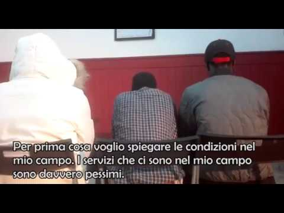
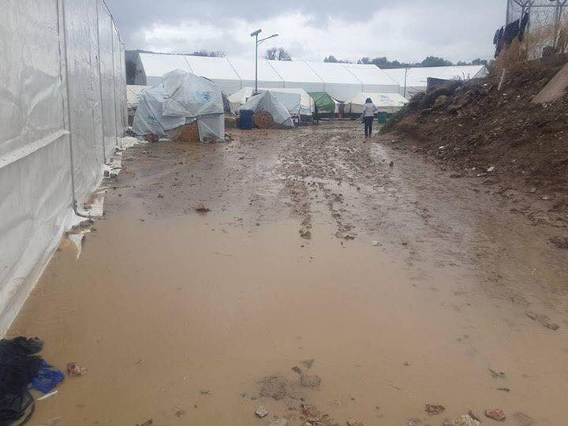
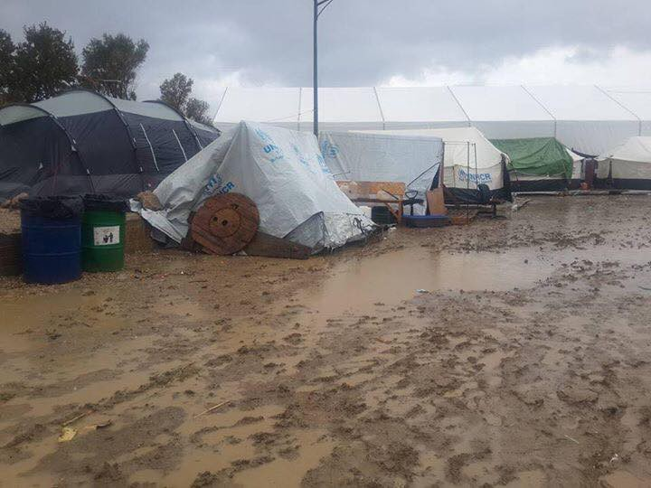
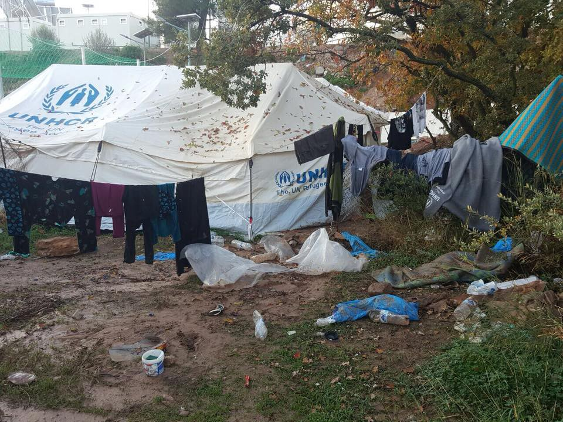

### AYS Daily Digest 21/11/2017 Brutality in Italian reception centres

**Updates from the Greek islands /// Threats to hunger strikers in Mytilene /// Ex Olympic Village in Turin evicted /// Updates from the second march from Cona to Venice /// Deportation to Afghanistan halted in Sweden**

 \(photo by [MSF\_Sea](https://twitter.com/msf_sea/status/932926078313746433) \)](assets/2de4e4aaa72b/1*Wq3BLVefnKzrLk3VRnH6kw.jpeg)

21 November 2017: Twenty days in miserable Moria and these people don’t even have a pair of warm, winter socks\. [**\#OpenTheIslands**](https://twitter.com/hashtag/OpenTheIslands?src=hash) \(photo by [MSF\_Sea](https://twitter.com/msf_sea/status/932926078313746433) \)
#### **Feature: Brutality in Italian reception centres**

On the 10th November, in the CAS \(Centri di Accoglienza Straordaria \) of Gricignano \(near Caserta, Southern Italy\), a 19 year old man, known as Bobb, from Gambia was beaten and shot by one of the members of the co\-operative _La Vela_ that manages the CAS\.

He is now in the hospital in a serious but stable condition\.

While the shooter and the other managers of the Centre immediately began to spread a version of events justifying the shooting as self\-defence, friends of the victim and other refugees living in the CAS were not listened to and had to go to the [ex\-OPG Occupato — Je So Pazzo](https://web.facebook.com/exopgjesopazzo/) , a squatted social centre in Naples to find people who would take them seriously\.

The [testimony](http://jesopazzo.org/index.php/blog/542-una-storia-nera) reveals the brutality of the episode, but also the horrible conditions in which refugees are forced to live in the centre, common to many other CAS of the country\. Especially in the South, but not only, CAS are plagued by the systematic infiltration of organised crime groups, becoming at the same time places of seclusion and isolation, nodes of wider exploitation networks and money\-making machines\.

In the centre in Gricignano, closed since Sunday, there lived between 160 and 170 asylum seekers\.

Hot water was only rarely available\. The school of Italian was non\-existent\.

As the law states that every CAS needs to have a health centre, the managers “put a bed and a chair in a basement and started to ‘visit’ people, prescribing everyone painkillers and antibiotics”, even this stopped soon after\.

“Meds are finished”; “The doctor is coming tomorrow” were the answers when someone was ill\.

The pocket\-money of 2,50 € was given only occasionally, for the last time in September 2017\. Mould and insects were reportedly found in the food offered by the centre on multiple occasions\.

In order to save money some of the refugees were living in the centre’s bathrooms, with beds put in place of the WC\.

Bobb was among them\.

This was not the first incident he had endured\. During the spring he was run over while on his bike\. Dismissed from the hospital, he went back to the centre, where all his requests for medical attention were ignored\. In the summer he worked in one of the many farms of the area, and was exploited for 10 to 12 hours a day for 15€\. When he asked for better conditions he was beaten up with a glass bottle\. He returned to the centre with a wound on his head but no doctor visited him, no one took him to the hospital\.

After difficult months he decided to go back in Gambia\. Asking for information about voluntary returns, “the employees gave him a leaflet and then ignored him”\.

On the night of the 10th Bobb started a protest, trying to leave the centre\. A fire broke out, but it was soon extinguished\. In the following minutes, according to the testimonies of the asylum seekers in the centre, one of the members of the cooperative arrived and, pointing a gun at him, ordered Bobb to go back into the centre\. He refused and in response was first beaten with the butt of the gun and then shot two times in the face\.

> This is Bobb’s story, a black life, a life of abuses, violence and racism in a state that keeps acting as if nothing is happening\. 

**General**
#### \#Againstfingerprints

As part of the campaign \#Againstfingerprints, [Watch the Med — Alarm Phone](https://web.facebook.com/watchthemed.alarmphone) is producing a series of videos in different languages to inform travellers about fingerprinting in transit:

This is in Tigrinya:

Look at the video in [Sudanese](https://web.facebook.com/watchthemed.alarmphone/videos/2012585879015645/?hc_location=ufi) and [Amharic](https://web.facebook.com/watchthemed.alarmphone/videos/2012560262351540/?hc_location=ufi) \.

More languages to come\.

**Sea**
#### 41 people rescued

This morning \(21\.11\.17\) [Mission Lifeline](http://m.sz-online.de/nachrichten/lifeline-rettet-familien-aus-seenot-3822673.html) saved 10 children and 31 adults off the Libyan coast\.
#### Weather Warning

■■■■■■■■■■■■■■ 
> **[MSF Sea](https://twitter.com/MSF_Sea) @ Twitter Says:** 

> > Worsening winter conditions on #Mediterranean with #MSF team onboard #Aquarius expecting bigger waves, stronger winds and lower temperatures. https://t.co/T1062XDBp5 

> **Tweeted at [2017-11-21 12:53:55](https://twitter.com/msf_sea/status/932955230521749504).** 

■■■■■■■■■■■■■■ 

**Greece**

**Islands**
#### REGISTRATIONS \(Official\) 20\.11\.17

Lesvos: 40

17\.11\.17 to 20\.11\.17 a total of 333 people were registered on the islands

Total number for November — 2428
#### TRANSFERS

17\.11\.17 to 20\.11\.17–153

**Lesvos**
#### Threats and risk of eviction for hunger strikers in Mytilene

Today hunger strikers in Mytilene feared eviction but managed to negotiate with the authorities so that they can continue their fight for basic human rights\.

■■■■■■■■■■■■■■ 
> **[Giorgos Christides](https://twitter.com/g_christides) @ Twitter Says:** 

> > Hunger striking #refugees start evacuating #Lesvos central square after warning they will be arrested https://t.co/z1Rzp7Oz7s 

> **Tweeted at [2017-11-21 13:56:36](https://twitter.com/g_christides/status/932971007807315970).** 

■■■■■■■■■■■■■■ 

■■■■■■■■■■■■■■ 
> **[Arash Hampay](https://twitter.com/ahampay) @ Twitter Says:** 

> > Today some fascist people and also some owners of cafe and shops in Mytilini who have problems with our protest came They wanted to force us to leave our place but in the end,the  police chief,the mayor and the chief justice came and we negotiated with each other
#opentheislands https://t.co/tw2ed8L5jl 

> **Tweeted at [2017-11-21 17:24:00](https://twitter.com/ahampay/status/933023202602778625).** 

■■■■■■■■■■■■■■ 

#### Appeal for family trapped in Moria

> A young family from Afghanistan with two little kids, age 3 and 4 years old are living in Moria camp, in a summer tent in a mud area with lots of humidity\. The woman is 6 months pregnant and they need to move to a more safe and dry area or to another camp\. 

> They need blankets, warm clothes and shoes for the all family, any org or volunteers can help them? Please\! 

Contact [Luz Carmona](https://web.facebook.com/marialuz.carmonaguerra/posts/10215227224582149?hc_location=ufi) for further information\.

Refugees 4 Refugees produced a short video about their work in Moria\.

You can watch it [here\.](https://web.facebook.com/Refugee4Refugees/videos/vb.311889605821388/569648683378811/?type=2&theater)

**Samos**

The situation on Samos is continuing to deteriorate and people have had enough\.

■■■■■■■■■■■■■■ 
> **[RefuAid](https://twitter.com/refuaid) @ Twitter Says:** 

> > Rene is a student on the RefuAid language program in Samos, after fleeing Cameroon in fear of his life he's found himself stranded in Greece with no news on his asylum claim. https://t.co/Tgn8OjAEql 

> **Tweeted at [2017-11-21 12:19:15](https://twitter.com/refuaid/status/932946509745844224).** 

■■■■■■■■■■■■■■ 

■■■■■■■■■■■■■■ 
> **[MSF Sea](https://twitter.com/MSF_Sea) @ Twitter Says:** 

> > #Vanthy "Reception Centre" is waterfront property after storms hit #Samos yesterday. Somewhere between 1,704 and 2,137 cold, wet, vulnerable #people are living here in facilities meant for just 920. Seriously, this is too much #OpenTheIslands. https://t.co/GDIbTeSckp 

> **Tweeted at [2017-11-21 12:52:49](https://twitter.com/msf_sea/status/932954957065670656).** 

■■■■■■■■■■■■■■ 

**Chios**
#### World Children’s Day

Despite the terrible conditions on Chios some of the children at BAAS primary school managed to enjoy World Children’s Day on Monday\.

](assets/2de4e4aaa72b/1*cKiRPxTjovNkT9AqL5B98g.jpeg)

Photo by [BAAS Primary School](https://medium.com/chios-voices/refugee-celebrations-of-world-childrens-day-2017-12fde43cf8c2)
#### [Volunteer Report](https://web.facebook.com/laura.ridley.334/posts/10159777006625226?hc_location=ufi) and Photos from Vial

Vial camp \(photos by Laura Ridley\)

Vial was originally intended for 800 people but now of 2300 are living there, with many families in camping tents\.

> The Greek government have received millions of Euros in order to improve conditions and ‘winterise’ the camps\. Where has it gone? Your guess is as good as mine\. 

> The ground on which the tents are situated has turned to mud\. The chemical toilets overflow into this mud\. On Monday night the wind was so strong it blew the tents down and people were left without shelter\. 

Vial camp \(photo by Laura Ridley\)

> How will this end? How will the government and the UNHCR be held to account for their failure to acknowledge or address the enormous failings in Vial and other camps in Greece? 

> Once again I must pay tribute to the tenacity of the volunteers I worked with on Chios and the strength and courage of the refugees forced to stay in Vial\. Could you survive? I’m not sure I could\. 

We wholeheartedly echo her statement\. People cannot be expected to live like this\.
#### Mainland
#### Parenting Class for children with special needs\.

Today \(22\.11\.17\) at 12pm there is a parenting class for children with special need at [Hestia Hellas](https://web.facebook.com/events/239931896549492/) , Charilaou Trikoupi, 5, 106 78 Athens\.
#### Coding School

The [Social Hackers Academy](http://socialhackersacademy.org) are offering courses to people interested in becoming web developers\. They are based in Central Athens\. The course lasts for 6 months \(part\-time\) and you need to be able to be there for all of it\. The classes are five hours long, once a week, in either the evening or at the weekend\. For more info look [here](http://socialhackersacademy.org/coding-school/) \.
#### New Freeshop

Koutsochero camp have a new freeshop set up by [InterVolve](https://intervolvegr.com/) with the support of [Help Refugees](https://web.facebook.com/HelpRefugeesUK/posts/523997311294280?hc_location=ufi) \. People at the camp will be able to choose what they want including fruit, vegetables, dry foods, hygiene items, and winter clothing items\.
#### [Drop in the Ocean](https://web.facebook.com/drapenihavet/) need volunteers in Skaramangas Camp

In December they need 1 person to take on the task of sewing room leader as well as English and German teachers\. You must be min 25 years old and able to stay for min 4 weeks\. Please email them at frivillig@drapenihavet\.no if you have any questions, or check out their website [www\.drapenihavet\.no](http://www.drapenihavet.no)
#### Donation from [CalAid](https://web.facebook.com/JoinCalAid/posts/925690754247738:0?hc_location=ufi)

CalAid are beginning to focus on providing eye care to refugees and are passing on their donations of clothes, shoes and hygiene products to projects in Greece but they need some help\.

> HELP US GET IT THERE\! 

> We need volunteers and we need money to process and prepare the stock for shipping\. Email info@calaid\.co\.uk to volunteer and donate via bit\.ly/XmasPalletGift 

> If your organisation in Greece needs Non\-Food Items email Becky@calaid\.co\.uk 

#### Stricter Passport checks in Germany for planes coming from Greece

[Media report](http://www.keeptalkinggreece.com/2017/11/21/germany-schengen-greece-airports/#.WhQhqd_-Yjc.facebook) that Greek people are increasingly upset about the additional controls they have to undergo when they arrive at German airports\. Germany claims that approximately 1,000 non\-Greeks have arrive in German airports in 2017 without the proper travel documents\. As a result, on the 12th of November, they essentially suspended Schengen regulations for flights arriving from Greece and will continue with additional passport controls until May 2018\.

As we reported earlier in the week, on Monday the European Union adopted new rules that will require border guards to register the entry, exit and refusal of entry information of non\-EU nationals crossing the external borders of the Schengen passport\-free area from 2020\.

**Italy**
#### Eviction of the Ex\- Olympic Village in Turin

On Monday Turin’s authorities evicted refugees living in the basements of the ex\- Olympic Village, built for the Winter Olympics 2006 and occupied since 2013\.

■■■■■■■■■■■■■■ 
> **[Tgr Rai Piemonte](https://twitter.com/TgrRaiPiemonte) @ Twitter Says:** 

> > Le prime immagini dello sgombero dell'ex Moi di Torino. @[TgrRai](https://twitter.com/TgrRai) https://t.co/n02i49hFPp 

> **Tweeted at [2017-11-20 08:26:14](https://twitter.com/tgrpiemonte/status/932525481118838784).** 

■■■■■■■■■■■■■■ 

The operation, lead by the Red Cross and local authorities, is part of a project financed by the San Paolo banking group to clear the site entirely between now and 2020, on the condition that the last remaining refugees are offered housing, training opportunities and help finding jobs, media [report](https://www.thelocal.it/20171120/turin-evicts-asylum-seekers-former-olympic-village) \.

[Il Comitato di Solidarietà Migranti e Rifugiati](https://web.facebook.com/exmoirifugiati/) \(Solidarity committee of migrants and refugees\) demanded not to end this project with an eviction but with an actual chance in favour of the autonomy of people\. They also demanded not to transform it in a simple displacement of the people living in the Moi, distributed in new time\-limited accommodations\.

> Despite the harshness of life here in the basements, some of the inhabitants preferred staying rather than having to deal with the precariousness and the uncertainty of the housing offer proposed\. 

> Their resistance is indicative of a process that, however the official declarations, in not shared or agreed upon\. 

#### Updates from the march from Cona to Venice

The second group of asylum seekers who left Cona centre on the 20th of November \(after the first marched from Cona to Venice last week\) reached Padua yesterday, where they met the Prefect of the town\. They obtained to be hosted in a school in the surrounding area \(Rubano\) for the night\. Today they will start walking again towards Venice to meet the Prefect of the city there\. The local municipality of Padua accepted to cover the expenses of the travel to Mestre, where most probably the meeting will take place\.

During the day around 250 people reached the 53 asylum seekers bringing food and blankets\.

If you are around Padua, you can help or bring donations [here](https://web.facebook.com/events/2002083396736649/)
#### BAOBAB EXPERIENCE NEEDS DONATIONS

Baobab Experience is asking for donation to buy tents, sleeping bags and rucksacks to prepare their camp in Rome for the winter\. They need 10\.000 euros by the 30th November\.

Support them [here](https://growish.com/59ad44df7fd05fa6198b4587) \!
#### [SOLIDARITEA](https://web.facebook.com/refugeesolidaritea/) in Ventimiglia

**Germany**
#### Call for protest in Berlin

A series of solidarity groups: _“Corasol — Contre le racisme — Show Solidarity” \+ “Initiative gegen das EU\-Grenzregime in Afrika” \+ “borderline\-europe” — “Menschenrechte ohne Grenzen e\.V\.”_ launched a demonstration for November 24 against the externalisation of the EU border and of HotSpots in Northern and Central Africa\.

](assets/2de4e4aaa72b/1*-DHFtmRmRzS44B06hLJ8yg.png)

[http://corasol\.blogsport\.de/](http://corasol.blogsport.de/)
#### Draft for complains against delayed family reunification

German website Asyl\.net published a draft document for official complains in case of delayed family reunifications between Greece and Germany\. Read more and download it [here](http://www.asyl.net/index.php?id=424&no_cache=1&tx_ttnews[tt_news]=59718&cHash=bbfdc2c0f8fe0b07a750d320536aae88) \(in German\)

**France**
#### France to take African refugees evacuated from Lybia

Media [report](http://m.france24.com/en/20171120-france-will-take-refugees-rescued-libya-who-need-protection) that France will take the 25 African refugees who were evacuated from Libya to Nigher by the UNHCR on the 11th Novemeber, a\. They are Eritreans, Ethiopians and Sudanese, including 15 women and four children\.

They should arrive in France, with other 47 refugees already living in Niger “at the latest in January”\.
#### Words are no longer enough: Refugees living on the streets in Paris

On July 27, French president Emmanuel Macron declared that no refugee would still be homeless by the end of the year\.

> With the arrival of winter, words are no longer enough: migrants urgently need shelter and new reception centers are needed as soon as possible \(F\. Sivignon, Médecins du Monde\) 

A joint [statement](http://www.msf.org/en/article/france-critical-situation-refugees-and-migrants-stuck-paris-streets-winter-approaches) by _Médecins du Monde_ and _Médecins sans Frontières_ reports that as of November, with temperatures dropping low and winter approaching, around 1,000 refugees and migrants are still sleeping rough on the streets of Paris\.

They are mainly scattered across the north\-east of the city and in the borough of Seine\-Saint\-Denis\. The situation grew worse for migrants after August 18, 2017, following the demolition of camps in the Porte de la Chapelle area in the city’s northern parts\. Over 2,700 people had been housed there and migrants have since been regularly cleared out by authorities\.

> Rain and the police are making it impossible to stay here\. Rain forces us to crowd together under bridges, but once we have settled into a place, the police come and move us\. 

> Since I left Sudan, the police have followed me constantly on the journey\. I did not think that the treatment would be the same in France\. We do not know where to sleep here\. As soon as we sit down somewhere, the police come and tell us to move\. They wake us up in the middle of the night and make us get up\. Sometimes we ask them where can we go, but every time they say ‘I don’t know, just get out of here’\. I have no other choice than to request asylum here\. There is only death in Sudan\.” _\(I\., from Sudan\)_ 

**UK**
#### Advice on asylum interviews in the UK

Right to Remain have published an article with advice for completing asylum interviews in the UK\. Read it in full [here](http://www.righttoremain.org.uk/legal/since-its-your-story-just-tell-it-how-it-is-advice-on-preparing-for-the-substantive-asylum-interview/) \.

**Sweden**
#### Deportation to Afghanistan Stopped

One deportation to Afghanistan was halted last minute on Monday 20th\.

> **_We strive to echo correct news from the ground through collaboration and fairness, so let us know if something you read here isn’t right\._** 

> **_If there’s anything you want to share, contact us on Facebook or write to: areyousyrious@gmail\.com\._** 

_Converted [Medium Post](https://areyousyrious.medium.com/ays-daily-digest-21-11-2017-brutality-in-italian-reception-centres-2de4e4aaa72b) by [ZMediumToMarkdown](https://github.com/ZhgChgLi/ZMediumToMarkdown)._
