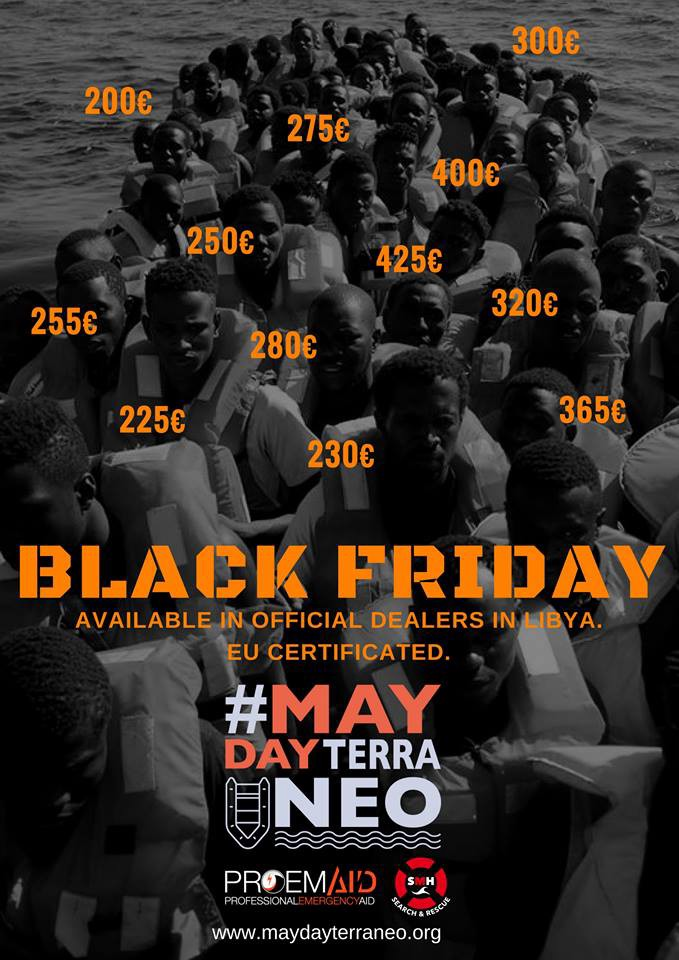
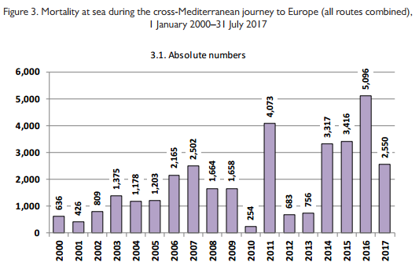
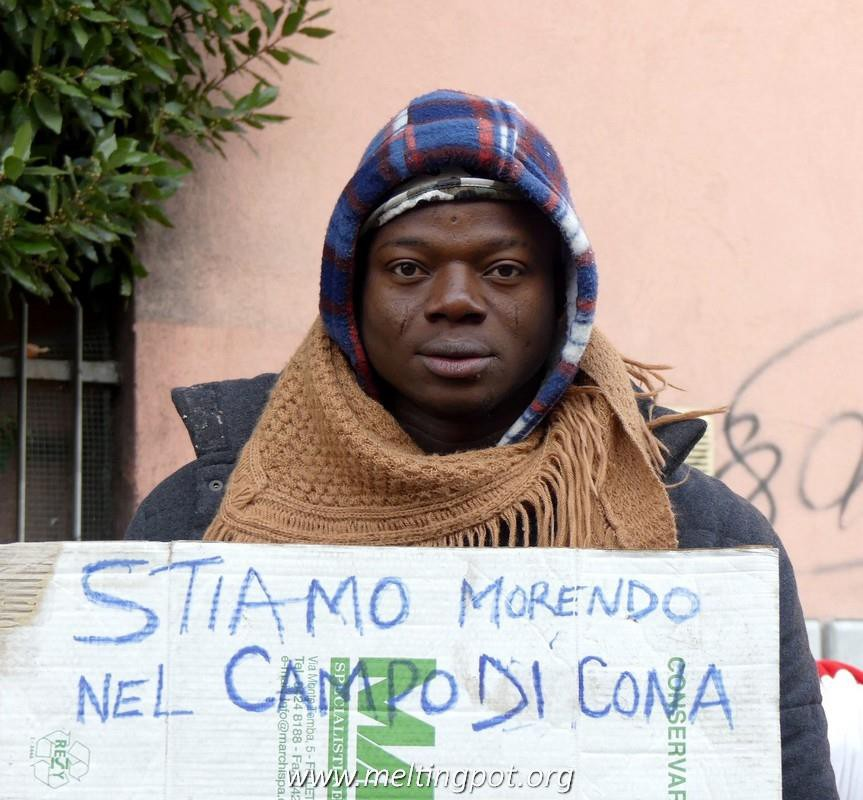

### AYS Daily Digest 24/11/2017 The world’s deadliest border

**Reports of violence in Libya /// Incidents at sea in the Mediterranean /// Italy in breach of International laws /// Call for demonstration in Mytilene /// Overcrowding in Moria /// Galleria Bombi closed in Gorizia /// Bitter end for protesters from Cona /// Call for demonstration in Denmark /// Info and updates from: Libya, Greece, Italy, Croatia, Serbia, Romania, France and Denmark**

#### The Mediterranean is the world’s deadliest border

IOM published a report covering irregular trans\-Mediterranean migration to Europe along various routes from the 1970s to now\.

> More than 2\.5 million migrants have crossed the Mediterranean in an unauthorized fashion since the 1970s\. Irregular sea journeys started rising in those years in response to the introduction of visa requirements for people who until then had been exempted — most of them temporary labour migrants from North Africa and Turkey — by Western States grappling with rising levels of unemployment during the 1973 oil crisis 

](assets/6b5c5715d1b9/1*8oGXZanbfrS9-cclbqx6WQ.png)

Table from [_Four Decades of Cross\-Mediterranean Undocumented Migration to Europe_](https://publications.iom.int/system/files/pdf/four_decades_of_cross_mediterranean.pdf)

Contrary to much reporting and political discussion IOM state that although the number of deaths may have decreased this year there is a higher likelihood, with the EU\-Turkey deal and Italian\-Libyan agreement in place, that an individual travelling the Mediterranean routes will die\.

](assets/6b5c5715d1b9/1*P7byA4bc9eSJ6jqyEDmM1w.png)

Graphs from [_Four Decades of Cross\-Mediterranean Undocumented Migration to Europe_](https://publications.iom.int/system/files/pdf/four_decades_of_cross_mediterranean.pdf)

> The highest number of fatalities \(5,096\) was recorded in 2016, when the short and relatively less dangerous route from Turkey to Greece was shut following the European Union–Turkey statement\. 

Policies that aim to shut down the routes that are safer and known, are deemed to fail in preventing people from attempting the crossing\. They also cause more deaths, while opening up longer and more dangerous routes\.

> Stopping migration and eradicating deaths at sea may therefore be partly conflicting objectives\. 

The report also condemns the EU/Italian agreement with Libya\.

> By contrast with Turkey, in Libya, the State failure and proliferation of militias give the smuggling business free rein to operate\. Making a deal with factions ruling over part of Libya’s territory, or with militias, or directly with the smugglers, would not only bring disgrace to European States abdicating their founding principles and closing their eyes on people knocking at their door from one of the most dangerous places on Earth, but also bring no guarantee that boats will not continue to depart from just a few kilometres away\. 

Between January 2000 and June 2017, 33,761 migrants were reported to have died or gone missing in the Mediterranean during their journeys, making it the most lethal border in the world\.

**Libya**
#### Somebody finally says something sensible about Libya…

■■■■■■■■■■■■■■ 
> **[MSF Sea](https://twitter.com/MSF_Sea) @ Twitter Says:** 

> > African Union President Alpha Conde: “In Libya there is no government, so #EU cannot ask that country to detain refugees (...) when it doesn’t have the means to do so” [reut.rs/2jM9dzz](https://reut.rs/2jM9dzz) 

> **Tweeted at [2017-11-24 08:51:38](https://twitter.com/msf_sea/status/933981425157668864).** 

■■■■■■■■■■■■■■ 

**Women rescued at sea report on their treatment in Libya**

■■■■■■■■■■■■■■ 
> **[Sea-Watch](https://twitter.com/seawatchcrew) @ Twitter Says:** 

> > “I suffered a lot, look at my body” “They searched me for money, the pressed my breasts, they entered my privates” says one of our guests. https://t.co/iLyK6Y26Tt 

> **Tweeted at [2017-11-24 17:37:12](https://twitter.com/seawatchcrew/status/934113685521432576).** 

■■■■■■■■■■■■■■ 

■■■■■■■■■■■■■■ 
> **[Sea-Watch](https://twitter.com/seawatchcrew) @ Twitter Says:** 

> > Another Woman explains “They beat me for 5 days. they cut me with a knife because of my Tattoo” The torture and violence needs to stop, Refugees need to be granted #SafePassage now! https://t.co/NoOYi3b0F2 

> **Tweeted at [2017-11-24 17:43:16](https://twitter.com/seawatchcrew/status/934115211312844800).** 

■■■■■■■■■■■■■■ 

**Sea**
#### Mediterranean Sea

There have been two worrying incidents today\. Firstly, the SOS Mediterranee rescue ship Aquarius was told by MRCC Rome to stand by as the Libyan Coastguard & Navy coordinated and intercepted 3 rubber boats in distress in international waters\. They report that military aircraft were on scene monitoring the situation\. It is believed that refugees and migrants trying to escape Libya have been returned\. This is likely a breach of International Law\.

Secondly, the Lifeline boat was approached by a military vessel and asked to stand down due to a naval exercise in the area\.

MSF highlight the dangers of arguing with the Libyan Coastguard\.

■■■■■■■■■■■■■■ 
> **[MSF Sea](https://twitter.com/MSF_Sea) @ Twitter Says:** 

> > Safety of our crew is paramount. We are not armed. We operate under assumption that all entities claiming to be Libyan Coastguard are armed. It would be highly dangerous for #Aquarius to attempt a rescue in these circumstances if not requested to do so. [twitter.com/monkib0y/statu…](https://twitter.com/monkib0y/status/934022715358490624) 

> **Tweeted at [2017-11-24 13:01:09](https://twitter.com/msf_sea/status/934044214446448643).** 

■■■■■■■■■■■■■■ 

#### Italy in breach of International Law

On the same day that the EU awards [€40 million](https://twitter.com/avramopoulos/status/934073865453621253) to Italy as emergency funding for migration policies, an [article](https://www.newsdeeply.com/refugees/community/2017/11/24/the-case-for-italys-complicity-in-libya-push-backs) is published setting out the legal grounds of Italy being in breach of several international conventions on refoulement — _the forced return of people to places where their lives or freedom would be threatened or where they would face a risk of torture\._

Their actions at sea today are a clear example of this\. People seeking safety, and in view of a rescue ship, being forced to return to a place in which their lives will be at risk and their freedom taken from them\.
#### [Sea Eye](https://web.facebook.com/seaeyeorg/posts/1264088680363693?hc_location=ufi)

Today the crew of the Sea Fox rescued 76 people from the Libyan coast, including 13 women and 17 children\. Among the survivors, there was also a heavily pregnant woman\. They were then transferred to the Italian coast guard and are now on their way to Italy\.

Since April 2016 Sea Eye have rescued 13,284 people\.

Both ships will now be taken out of the water over winter for essential maintenance\.

**Greece**
#### Arrivals

](assets/6b5c5715d1b9/1*CyhJhaNx6jNzQf0Or33VEA.jpeg)

[Eric Gerhardsson](https://web.facebook.com/erik.gerhardsson.7?hc_ref=ARRAUtHpQgVnrDFuuIG9mWtE1RYpOMNqLkgrzB4-32B9YImtNIAh081QJw3VCzwFt1E)
#### Mainland

Prime Minister Tsipras has told a [French newspaper](http://www.lefigaro.fr/international/2017/11/23/01003-20171123ARTFIG00238-tsiprasl-europe-ne-peut-etre-un-forum-o-berlin-impose-ses-decisions.php) he is “proud” of the living conditions of refugees on the Greek mainland\. He believes that the 60,000 refugees on the mainland have access to medical care and education\. Maybe he has forgotten about [Derveni Camp](http://rsaegean.org/winter-threat-looms-over-the-forgotten-refugees-in-derveni-camp/) were many still live in tents and find it difficult to access health care even though this is one of the reception camps for vulnerable cases being brought over from the islands\.

He also defended the EU\-Turkey deal which has been widely condemned by human rights groups including Amnesty International and Human Rights Watch who believe it is contributing to suicide and self\-harm\. A [report](http://www.independent.co.uk/news/world/europe/refugees-chios-suicide-greece-rights-data-project-report-migrant-crisis-a7761931.html) earlier this year discovered that 1 in 3 refugees living on Chios had witnessed a suicide\.

This week 20 human rights groups sent a letter to the Greek government calling for immediate action to improve conditions and tomorrow there will be a protest on Lesvos \(details below\) \.

It seems Tsipras has been wrongly informed\.
#### [Refugee Info Bus](https://web.facebook.com/RefugeeInfoBus/posts/2051400578428693?hc_location=ufi) Update on travel to Germany

> Himalayan travel are not taking any new bookings to travel to Germany for the next 10 days\. This is because they have been so busy over the past month catching up on the backlog of people who were travelling\. They will start again booking tickets for people to travel to Germany in ten days\. 

**Lesvos**
#### Call for Demonstration

Lesvos Coordination Movement for the Support of Refugee and Immigrants have called a demonstration on Saturday November 25th at 12:00 at Sappho Square, Mytilene\.

> You are all invited to join the protest in support of the Sappho Square Refugees\. 

> Their just fight has been taking place on site at Sappho Square for over a month now and is a direct result of the inhumane living conditions that the government of SYRIZA\-ANEL have been imposing on over 8000 refugees and immigrants that are currently trapped on Lesvos island\. 

> Their life is in fact a living hell and they have every right to demand the opening of the borders so that they may continue their journey to their initially intended destinations\. They state that they are refugees and not criminals and that they are only fighting for their self\-evident right to freely leave this island\. 

> Their struggle for life and liberty comes up against the wall of anti\-refugee policies of the EU and of the Greek government, as well as the EU\-Turkey deal that have resulted in the entrapment of thousands of refugees on the eastern Aegean islands\. 

> \[…\] We are organizing a protest on Saturday the 25th of November at noon at Sappho Square to fight for the following: 

> • Immediate satisfaction of all demands of the protesting refugees of Sappho Square 

> • The shutdown of Moria detention centre 

> • Cancellation of EU\-Turkey deal 

> • Truly humane living conditions for all refugees and immigrants 

> • Granting of all travel and identification documents necessary for the refugees freedom of movement 

> • Stop all deportations to Turkey 

> • Stop all imperialist interventions in Asia and Africa that continue to beget thousands of refugees\. 

> • To stop any and all anti\-refugee and anti\-immigrant policy of the EU 

> **\#opentheislands** 

Read the full call [here](https://web.facebook.com/groups/OasisRhodes/permalink/1834081290216968/?hc_location=ufi) \.
#### Overcrowding in Moria

**Italy**
#### Inhumane policies in Gorizia and Pordenone

](assets/6b5c5715d1b9/1*EndsppUsnZLgb1LQ-wQZwQ.png)

Picture by [Forum Gorizia](http://forumgoriziablog.it/2017/11/cronache-di-un-black-friday-non-qualunque.html)

\[ [Photo black friday](http://forumgoriziablog.it/2017/11/cronache-di-un-black-friday-non-qualunque.html) \]

Italian director of Amnesty International Italia, Gianni Ruffini, [denounced](https://www.amnesty.it/deterrenza-verso-accoglienza-amnesty-international-italia-politiche-disumane-delle-autorita-locali-pordenone-gorizia/) the inhumane policies of the authorities in Pordernone and Gorizia, where dozens of asylum seekers live in makeshift shelters, supported by the solidarity of many individuals and associations but at the same time victims of the _dissuasive measures_ of the local institutions\.

In Gorizia authorities shut down the galleria Bombi\. Between Thursday night and Friday all the people sleeping there were evacuated\.

Information is unclear regarding their destination; media [report](https://ilmanifesto.it/gorizia-galleria-bombi-chiusa-dal-sindaco-migranti-deportati-nei-cara/) that they have been transferred to the CARAs \(reception centres\) of the area for one night, to be transferred again to other regions of the country\.

Local Caritas — with the support of MSF Italia — will open a [temporary shelter](http://www.gorizia.chiesacattolica.it/wp-content/uploads/2017/11/Dichiarazione-dellArcidiocesi-una-tenda-al-Contavalle.pdf) in the Contavalle park: an heated marquee that will have a capacity of 60 people and will be active for three months\.

In Pordenone, while the mayor [responded](https://twitter.com/IvanGrozny3/status/934172367621935109) to Amnesty repeating that opening a reception centre in town would attract more asylum seekers, two men that were sleeping rough had been admitted in the local hospital with chest pain and risk of pneumonia\.
#### Updates from the march from Cona

We are dying in Cona camp

As reported [yesterday](ays-daily-digest-23-11-17-some-rescued-in-the-sea-while-others-die-on-the-land-3272d3191f77) the meeting with the vice prefect ended with the explicit threat to the protesters of being excluded from the reception system in case they refused to go back in the hub of Cona\.

After hours of pressure the group of protesters accepted to go back to Cona in exchange of 100 monthly transferrals from Cona and the access of the centre to private social NGOs\.

**Demonstration at the Libyan embassy in Rome**

On Friday a demonstration was held in front of the Libyan embassy against slavery and criminal deals\.

**Croatia**

After the [tragic death](https://medium.com/@AreYouSyrious/ays-daily-digest-22-11-2017-another-child-another-victim-of-this-fortress-europe-d7cf88505efd?source=user_profile---------2----------------) of 8 yr old Madina on the Serbo\-Croatian border, her brother Rashid gave AYS a statement:

> We were walking through Croatia for about two hours when the police caught us and said we had to go back to Serbia\. We were 8 people on that night, Nov 20/21\. \. It was dark and we were tired\. My mother asked if they can let us spend the night, because we were travelling with my two baby brothers one 3 years old, the other 1 year 6 months old\. 

> The police said took us to the train tracks and there was no light\. No one said anything about the train, no one warned us\. We didn’t know\. We were walking and suddenly we heard the sound of the train\. We all jumped aside — all, except Madina\. 

> The train stopped, and in the light, I saw her lying with her face downwards\. I went to her, raised her head and saw blood\. I picked her up and took her in my hands\. 

> The police came and I sat in the police car with Madina, while the rest of the family was outside\. I don’t know if she was dead or alive, but I think that she was dead\. After some time, the ambulance came and they took Madina\. We wanted to go, my mother especially, but they didn’t let us\. They did not tell us where they took her at first\. 

> Then my mother went asking: Where is my baby? And we wanted to go to Zagreb to wait for news about Madina\. The police told us that Madina was taken to Belgrade hospital and we decided to go to Belgrade\. 

> But when we arrived in Belgrade, we asked again, and they said that Madina was not there\. 

> _\- Rashid \(15\), Madina’s brother_ 

**Serbia**
#### Data on arrivals in October

Praxis published a [report](http://www.praxis.org.rs/index.php/en/praxis-in-action/migration/item/1253-praxis-protection-monitoring-report-on-migration-october-2017) on migration in the country in October\. The numbers show an increase in arrivals from September: in October the organisation assisted 1274 newly arrived asylum seekers \(901 adults and 373 children, including 188 unaccompanied and separated children\), while in September they helped 956 people\.

Out of the total of 1274:
- 447 \(35\.1%\) came from Iraq\.
- 397 \(31\.2%\) came from Pakistan, which is a significantly higher percentage than in the previous period\.
- 213 \(16\.7%\) came from Afghanistan\.
- 126 \(9\.9%\) came from Iran, which is also a significant increase compared to the previous period in which they supported 26 Iranian asylum seekers, mainly due to the changes in VISA requirements for Iranian citizens\.
- 22 \(1\.7%\) came from Syria\.
- 5 \(0\.4%\) came from Algeria\.
- A total of 64 asylum seekers \(5\.0%\) came from other countries: Bangladesh, India, Palestine, Libya, Somalia, Sri Lanka, Nigeria, Tunisia, Mali, Myanmar and Turkey\.

**Romania**

**France**
#### Donations URGENTLY needed in Calais

From a volunteer:

The situation is critical in Calais, with at least 800 people hiding in the bush, lots of minors\. The youngest is 13 years old\. Police violence is frequent, including pepper spraying people in the face when they are sleeping, and destroying every shelter and blanket they find\.

Everything is in scarce supply\.

Read the full post [here](https://web.facebook.com/chiara.lauvergnac/posts/10155358865109092) , the list of what’s needed and how to donate\.
#### [Refugee language initiative](https://web.facebook.com/TheRefugeeLanguageInitiative/) is looking for volunteers

> We are currently seeking a volunteer coordinator; the role involves establishing and maintaining relationships with various refugee aid organisations throughout France, liasing between the RLI and local agents, and providing practical support to RLI volunteers during their placements\. 

> Candidates will have good command of the English and French languages, great IT skills, extensive local knowledge and a passion for helping those less fortunate\. 

> If you can help: please send your CV and a cover letter to [emma@refugeelanguageinitiative\.org](mailto:emma@refugeelanguageinitiative.org) 

**Denmark**

\#IngersAnsvar — Stop the lethal deportations\!

[Call to Demonstration](https://web.facebook.com/events/155042821892463/) on the 28th of November, 5pm, Israel’s Square, Copenhagen

W2DK are calling for a response to the death of the 34\-year\-old man from Algeria who died on Wednesday as a result of deportation practices\.

> The man was exposed to an extremely violent treatment aboard an AirFrance aircraft at Kastrup Airport\. Eyewitnesses described the police’s use of force as “tough” and “extremely harsh”\. 

> This is not the first time we witness that the Danish authorities have put a human life at risk by forced deportation\. Just over a year ago, one tried to deport a man to Afghanistan\. Even though the man had swallowed a razor blade in a desperate attempt to stop the deportation, he was forced wearing a straight\-jacket with fixation of hands, arms, legs, knees and ankles as well as a helmet and tucked in a seat with a strap\. The episode made the Afghan Deputy Ministers to make a sharp criticism and denied that Afghanistan would receive more rejected asylum seekers before Denmark changed its practice\. It did not happen, so it was only a matter of time before it would cost a human life\. 

> We will hold Integration Minister Inger Støjberg personally responsible for the people who die during a forced deportation\. She is responsible for those who die during transport and for those who lose their life after a deportation — we have also seen more examples of the latter\. Inger Støjberg is responsible for the current rules that the police enforce and have repeatedly emphasized that the rules should be as tough as possible\. She is ultimately responsible for the inhumane refugee and asylum policy and this regime has now taken another human life\! 

> We demand an immediate stop of all deportations until Inger Støjberg personally guarantees that no rejected asylum seekers lose their lives during transport or in the country of destination\. 

> We demand that Denmark begin to protect the lives that we are required to protect\. 

> We will march from Israel’s Square to the Ministry of Integration, where a memorial ceremony will be held for the deceased man from Algeria\. 

> **_We strive to echo correct news from the ground through collaboration and fairness, so let us know if something you read here isn’t right\._** 

> **_If there’s anything you want to share, contact us on Facebook or write to: areyousyrious@gmail\.com\._** 

_Converted [Medium Post](https://areyousyrious.medium.com/ays-daily-digest-24-11-2017-the-worlds-deadliest-border-6b5c5715d1b9) by [ZMediumToMarkdown](https://github.com/ZhgChgLi/ZMediumToMarkdown)._
