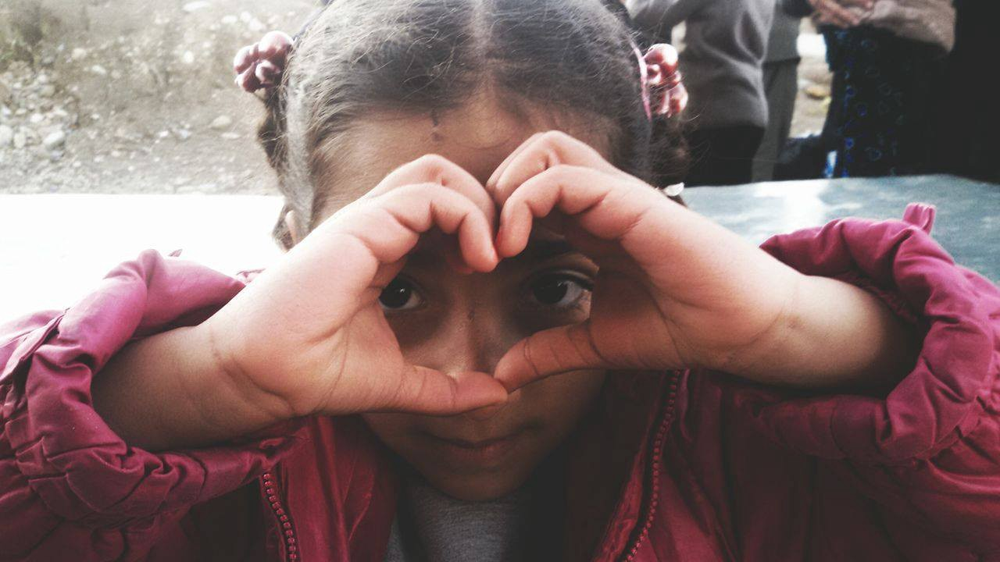
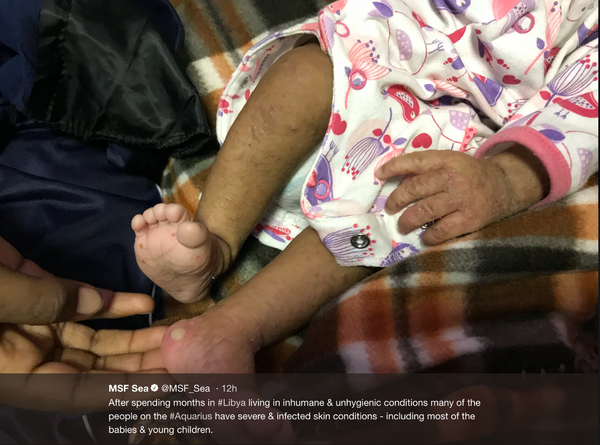
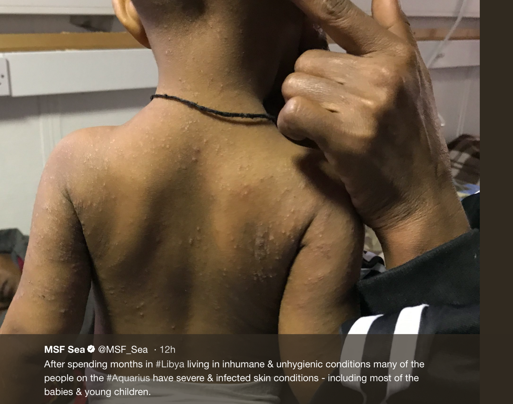
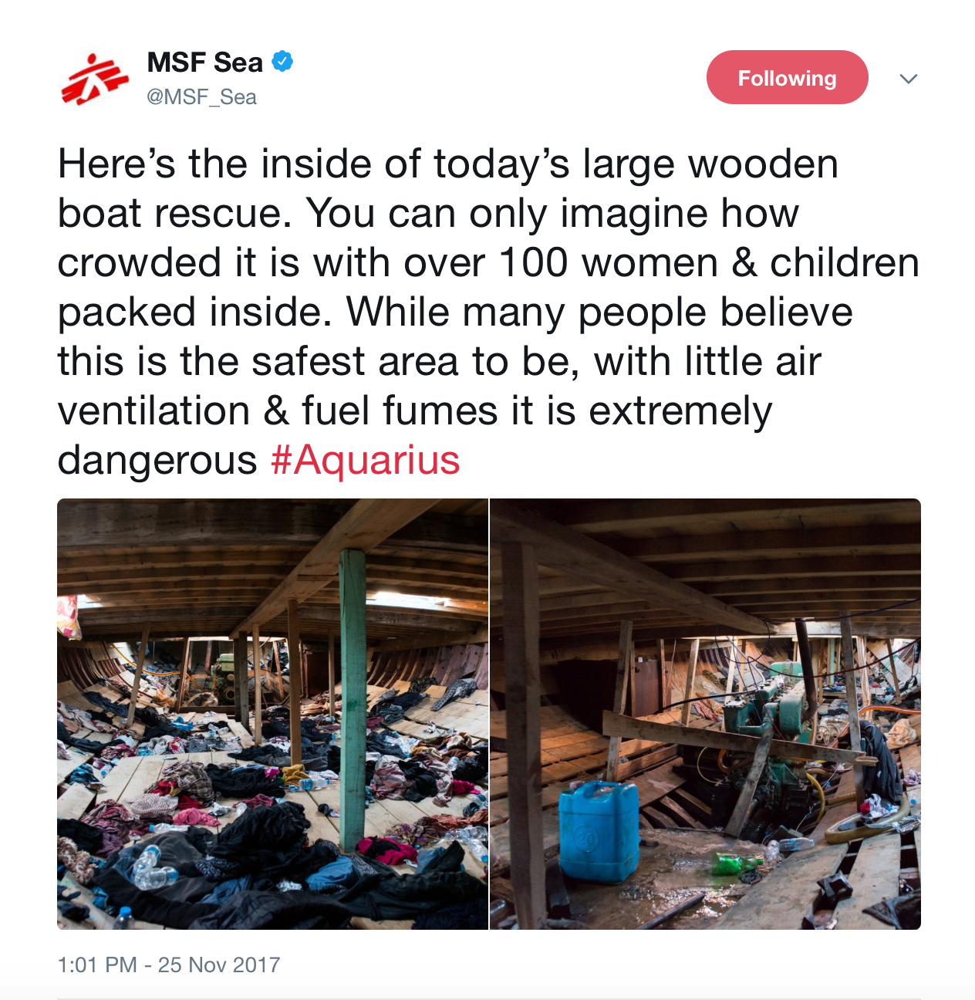
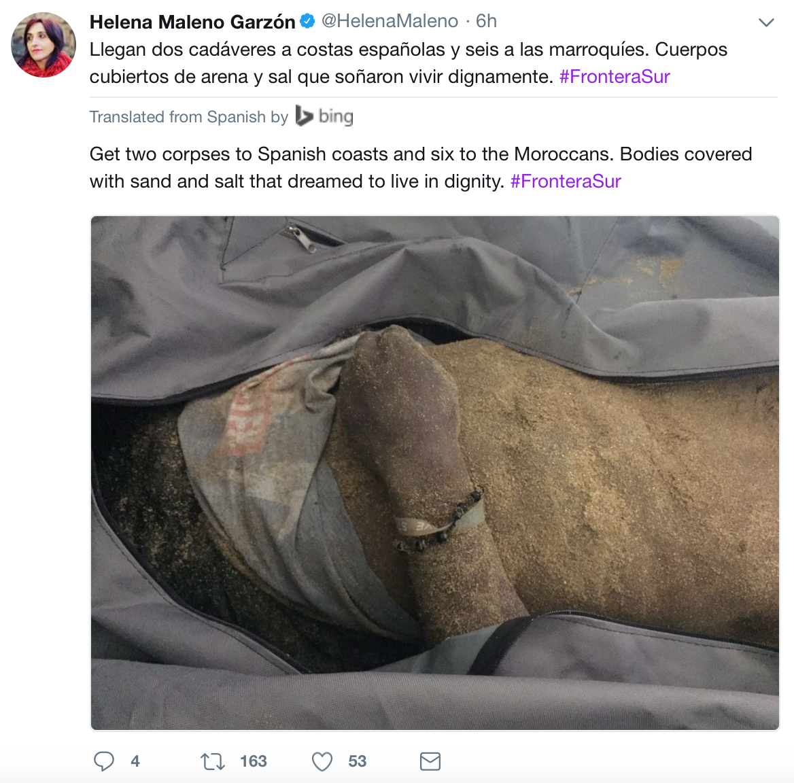
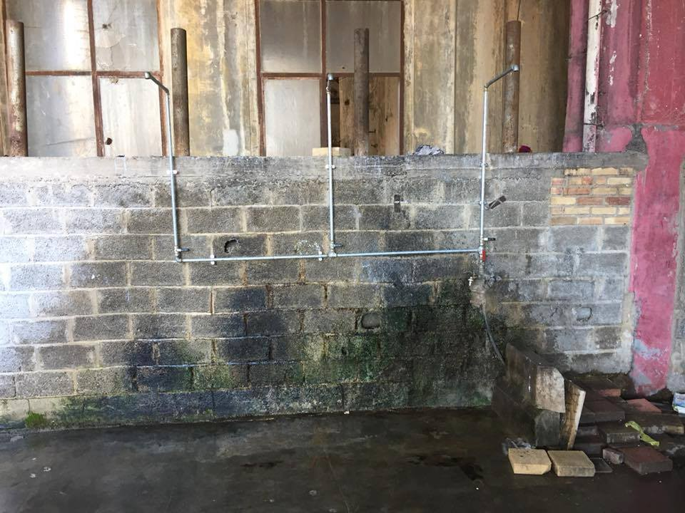
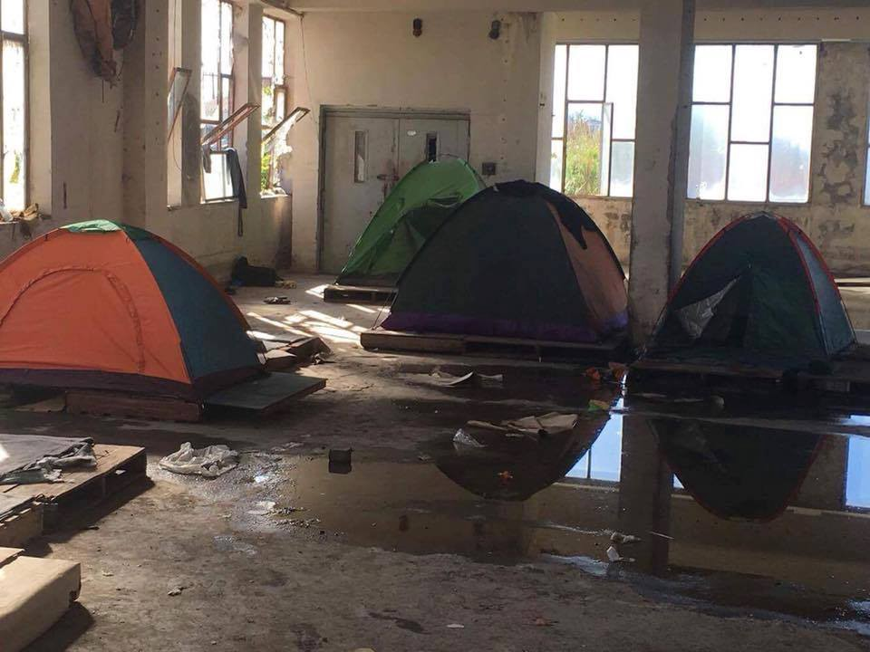
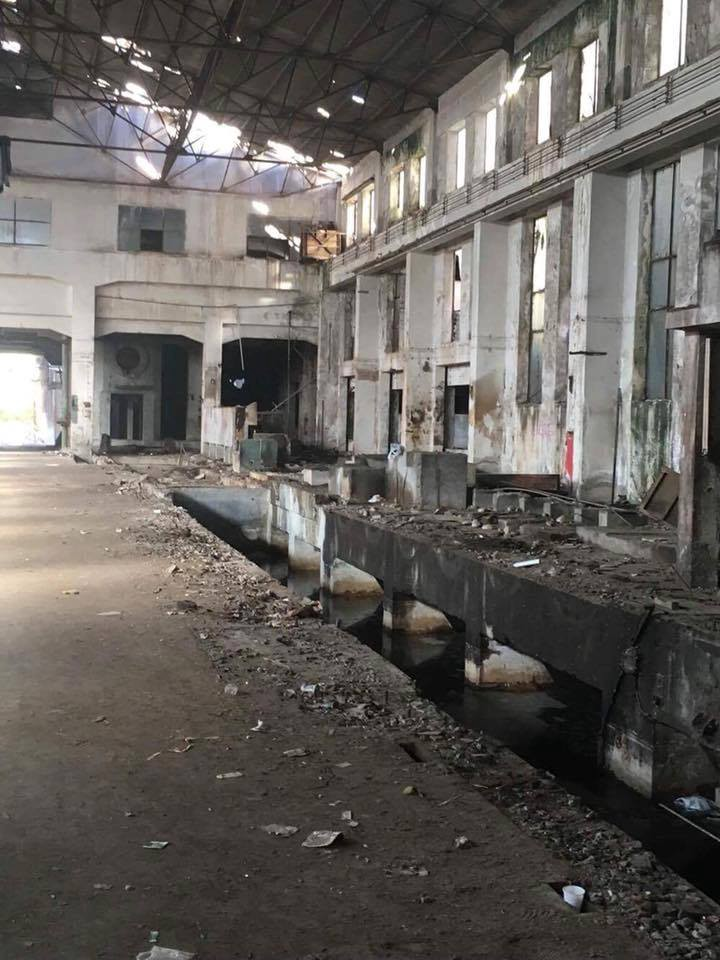
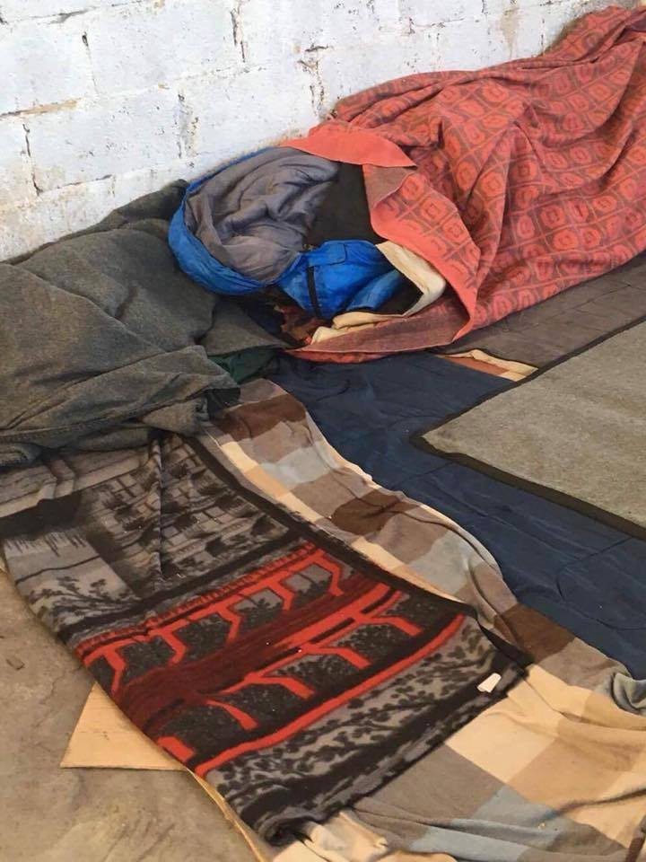
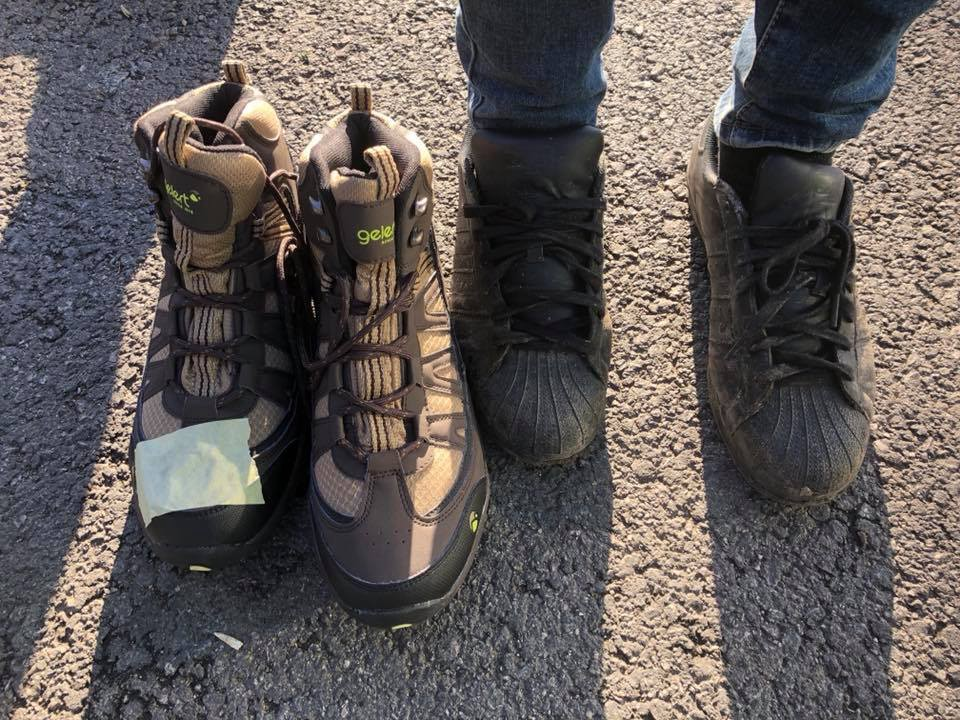

### AYS DAILY DIGEST 26/11/2017: Those that are rescued in the Mediterranean show visible scars of sickness and violence\.

Testimonies from Libya // Visible scars on people rescued on the boats coming from Libya // Another dramatic week of rescue operations on the sea// The war in Syrian continues taking lifes of civilians // Number of refugees attempting to cross from Libya to Italy by sea has decreased since July // And more from Turkey, Greece, Italy, Sweden…

Chios, Greece November 2017\. Vial camp, Chios\. People including many children live under terrible and dangerous conditions during low freezing temperatures, trapped in between closed borders\. Photo by Vasiliki Antoniou
### **Feature:**

Rescue operations of this weekend by the Aquarius give deep and devastating insight into the situations faced by refugees attempting to escape from Libya to Italy\.

The Aquarius team rescued 421 persons from a dangerous wooden ship and spent a long day on Sunday preparing to disembark the survivors in Catania, Sicily\. On board of the vessel rescued were over 170 women and girls from Eritrea who have escaped horrific violence and torture\.

‘Today they are safe for the first time in a long time\.’ — MSF SEA

[MSF SEA has reported](https://twitter.com/MSF_Sea) that almost all survivors rescued needed medical treatment which once again puts focus on the horrific state of events occurring currently in Libya\. Many of the rescued have visible scars of violence and show signs of malnutrition, dehydration extreme fatigue and infection\.

After months spent in Libya living in inhumane and unhygienic conditions, many survivors also has severe and infected skin conditions — including nearly all of the young children and babies\.

One survivor rescued by the Aquarius, a 3 year old Eritrean boy was evacuated for emergency medical care after suffering several seizures\. The MSF medical team did all what they could for the boy while on board, but the case was complex and required advanced paediatric care\. The young boy was evacuated with the coordination with Guardjacostiera to Siracusa\. This three year old boy is yet another example of a life that could very easily have been lost without the rescue teams\.

A [report released about the rescues this weekend](http://sosmediterranee.org/dramatic-week-in-the-mediterranean-more-than-800-people-rescued-by-sos-mediterranee-whilst-crew-witnesses-interceptions-at-sea-by-the-libyan-coast-guard/?lang=en) included a statement by Nicola Stalla, SOS MEDITERRANEE’S SAR\-coordinator described this particular rescue in a statement:

“ _The wooden boat was so overloaded that it was very unstable\. A single moment of panic on board would have been enough to capsize the boat, leaving no chance for the people crammed inside\. It was thanks to the team’s professionalism and favourable weather conditions that the worst was avoided_ \.”

In additions of visible scars on people rescued traveling from Libya, survivors also provided detailed descriptions of what they have endured\. A 26\-year old Eritrean male told SOS MEDITERRANEE volunteers:

“ _We were all in the same prison in Sabratha\. Because of the war there, we were separated into groups of 20 people, put on pick\-ups, and transferred to Bani Walid about a month ago\. We were then crammed into another prison where we spent about a month\. Yesterday \(the day before the rescue, ed\. \), we were transferred to another place, on a beach where we had to wait under the scorching sun, without any water or food\. The boat left Libya around 6 am,_ ” said a 26\-year\-old Eritrean to SOS MEDITERRANEE volunteers\.

“ _In the prisons, we were beaten with electric wires\. Libyans show no humanity\. The whole group, we all belonged to the same man ‘the boss’\. 600 other people belonged to another boss\. We do not pay the same price for the crossing\. Some paid $ 1,000, but another told me he paid $ 6,000,_ ” added the same witness\.

MSF Sea also released a tweet that young men on board of the Aquarius have claimed that many women were raped on their journey through Sudan and then again in Libya\. Death, rape and suffering are all direct results of unsafe routes to claiming asylum\. When will this be acknowledged? When will human rights be returned to those seeking asylum?

The team of the Aquarius described how difficult it is for their team to witness boats carrying refugees in distress, but not being able to react\. On Friday morning the Aquarius spotted two boats in distress East of Tripoli, but they were ordered to remain on ‘standby’ by Italian authorities who told them that the two operations were assigned to the Libyan Coast Guard and Navy\. The Aquarius offered their assistance to the Libyan Coast Guard, but their help was declined\.

“ _We spotted a rubber boat, which, given the weather conditions and the general condition of the boat, could break and sink any minute\. We remained on standby, ready to intervene\. During the four hours of standby the weather conditions deteriorated, further increasing the risk of shipwreck\. We were ready to launch our rescue operation at any time_ ,” said Nicola Stalla\.
 
 “ _This dramatic event is extremely hard time for our teams to witness; they are forced to observe, helpless, as operations result in people being returned to Libya, a place that the survivors have consistently describes a hell\. This is something that we have consistently denounced since the beginning of our mission in the Mediterranean\._
### Sea

It has been a busy and dramatic week of rescue operations on the Seas, and this weekend was no less demanding\.

The Spanish Rescue Vessel, Guardarmar Polimnia rescued 106 persons\. [However two dead bodies have reportedly washed up on Spanish Coast and 6 dead bodies have washed up on Moroccan coast](https://twitter.com/helenamaleno/status/934891459911790593) \.

The lifeline returned to Malta with [262 people rescued\.](https://www.facebook.com/DDBalkanKonvoi/photos/a.875422145874550.1073741828.874538332629598/1458804544202971/?type=3&theater)

31 people who died at sea and were pulled out by Libyan Red Crescent workers and Libyan navy officers arrived in Tripoli yesterday, among them were two women and three children\.
### Syria

Activists have declared that [dozens of civilians have been killed in air strikes and artillery shelling in Syria\.](http://www.aljazeera.com/news/2017/11/dozens-civilians-killed-syria-air-strikes-171126174857574.html) The air raids were targeting Eastern Ghouta district outside of the capital city of Damascus as the Syrian Government continues to increase military pressure on rebel\-controlled areas\.

At least 23 people have died\. In the past two weeks over 100 people have been killed in attacks on Eastern Ghouta according to the Syrian Observatory\.
### Libya

In a different situation, the [Libyan Coast Guard has apologised](http://www.spiegel.de/politik/ausland/mittelmeer-libyen-entschuldigt-sich-fuer-drohung-gegen-bundeswehr-a-1180308.html) to German Patrol Boats for unprofessional behaviour during an incident that occurred where they harassed a German Military Vessel in the Mediterranean\. The incident was referred to as ‘dangerous provocation’ and ‘aggressive manoeuvres’ towards the EU ship\.

The Libyan Coast Guard has promised that such actions will not be repeated near ships of the EU mission operating for Sophia\. However, the question remains… As Sea\-Watch has rightfully asked… When will the Libyan coastguard apologise to the human lives trying to cross the Mediterranean in search of safety?
### Turkey

A Report by the UNHCR reveal that the number of refugees attempting to cross from Libya to Italy by sea has decreased since July last year after the agreement made between Libya to withhold migration towards Italy\.

The closure of this route has lead for desperate asylum seekers to search for new ways into the EU\. Thus although numbers of people leaving from Libya have decreased in this time, the number of arrivals by sea to Italy from Tunisia, Turkey and Algeria have in fact increased\. [Over 3000 people have arrived in Italy from Turkey according to this report](http://harekact.bordermonitoring.eu/2017/11/26/new-route-of-migrants-more-than-3-thousand-people-went-to-italy-by-crossing-from-turkey/) \.
### Greece

The situation on Lesvos remains critical as winter crawls closer and closer\.

Sea Watch is urging people who are stressed about the situation on Lesvos, and especially in Moria Hotspot which remains three times over it’s capacity, to write a letter to the European Commission expressing their concern\.

If you want to join and try to do something about the situation on Lesvos and the people Freezing in Camp Moria? Please follow [this link](http://letterforlesbos.tfwb.eu/) \!

**\#opentheislands**

[CK TeamRefugees](https://www.gofundme.com/ckteamrefugees?pc=fb_u_g&rcid=r01-151164551863-9b30647b601a4ba7) is calling for donations to buy real life jackets after the discovery of 3 children’s bodies that had washed on shore of beaches they used to patrol\. They are making efforts to raise awareness of the production of fake life jackets — and they need help to keep providing real life jackets for Children who are crossing the Aegean in a bid to stop more children dying at sea\.

[Docmobile](https://www.facebook.com/docmobile.org/) has descibed Patras as an inhumane habitat for living\. People are stuck in this small port town in between Thessaloniki and Athens, without protection or help\. ‘Some people consider themselves lucky simply for having a tent\.’

Photo Docmobile

Docmobile confirms that bed linin in is in short supply and that fresh clothing, and adequate hygiene is unattainable\. They also say that infections and scabies are present within the population who is sleeping on cold hard concrete floors\. [Docmobile is asking for donations](https://paypal.me/medicalhelp) to continue supplying much needed medical care to those in Patras and to address the serious need of shoes and warm clothing as winter approaches\.

[Lifting Hands International](https://www.facebook.com/liftinghandsinternational/) has put a call out for English and German teachers to join their team in Northern Greece from December onwards\. As a part of their team, you will involved in providing classes for Yazidi refugees of all ages\.

They are looking for someone who is over 21, able to stay at least one month\.

Clashes erupted in Athens on Sunday when a group of football supporters attacked a group of Pakistanis who held a march celebrating prophet Muhammad’s birthday\.

■■■■■■■■■■■■■■ 
> **[Epoca Libera](https://twitter.com/epocalibera) @ Twitter Says:** 

> > Clashes erupt in #Athens when #PAOK hooligans attack Pakistanis holding a march celebrating prophet Muhammad's birthday #Greece https://t.co/iQZWKzOuLq 

> **Tweeted at [2017-11-26 14:21:02](https://twitter.com/epocalibera/status/934789095145996288).** 

■■■■■■■■■■■■■■ 

The group who initiated the attack is affiliated with PAOK but suspicions have been raised as to whether the attack, due to its fascistic nature, was coordinated by Golden Dawn

Also in Athens, [En Red SOS Refugiados](https://www.facebook.com/sosrefugiados/) is asking for help to restock their supply of children’s milk reserves and fresh food\. Your contribution, however small, will help hundreds of families through @sosrefugiados to take care of their children\.

[Refugee info bus](https://www.facebook.com/RefugeeInfoBus/) has in the last few months has begun producing a series of informational videos that aim to dispel rumours, shed light on confusing legal systems and government legislation, and to address frequently asked questions and encountered problems\.

They are now working in collaboration with [Generation outside of Afghanistan](https://www.facebook.com/Generation-Outside-of-Afghanistan-425707990960672/) , who advocate for the rights of Afghan refugees, in Greece, and elsewhere in Europe and will soon being producing videos in Farsi\.
### Italy

In Italy a [video has been released](https://www.facebook.com/ivangroznycompasso/videos/1550150798398842/) of refugees sleeping rough on the streets of Pordenone\. It contains interviews with refugees, journalists and volunteers and provides needed insight into the situation, especially as winter verges closer and closer\.
### France

[UTOPIA 56](https://fr.ulule.com/utopia-56/) fundraiser has reached half it’s targets in only two weeks\. It will continue for another 22 days with the project Keep the kids warm, in order to move teens off the streets\. If they reach their goal, \(27600€\) by mid\-December, two paid positions will be funded for 6 months to develop the citizen accommodation network and get 80 teenagers out of the streets\.

Care4Calais continues their fundraising campaign to buy and distribute brand new walking boots to refugees in Calais\.

“Walking boots are especially important at this time of year when the whether is cold and wet\. Foot infections at this time of year are ripe amongst populations of refugees\. Refugees still have to walk miles every day to get to distributions, find new places to sleep and sometimes hide from the police\.”

Photo by Care4Calais

They now want now is to distribute more walking boots in Brussels, Caen and Paris\. To help, please visit their fundraising page [here](https://mydonate.bt.com/events/boots1000/448709) \.

[Five refugees were wounded in France on Saturday](https://www.reuters.com/article/us-europe-migrants-calais/five-migrants-wounded-as-shots-fired-in-calais-brawl-idUSKBN1DP0P8) when shots were fired during a brawl in the outskirts of Calais near the local Secours Catholique charity\. It is believed that gunshots were fired between two groups of Afghan’s in the late afternoon\. Police sources have commented saying that they believe the incident occurred as a result of dispute between smugglers\. Three of those involved received injuries that were being treated in Calais hospital\. A fourth person that was injured more seriously was transferred to another hospital in Lille\. Another was treated on the scene\.

Organisations working in Calais estimate that around 700 asylum seekers are still in Calais, while authorities suggest the number is closer to 500\.

[Calais community Kitchen](https://www.facebook.com/refugeeCkitchen/videos/1965906193426741/?hc_location=ufi) has built a new kitchen with the help of continued support and the work of dedicated volunteers from Refugee Community Kitchen\.
### Sweden

Yesterday there were a peaceful demonstration against the slave trade market in Libya in the city of Uppsala, around 90 kilometers north of the capital Stockholm\. During the demonstration the protestors were attacked by the Nordic Resistance Movement \(Nordisk Motståndsrörelse, NMR\) \. NMR is a neo\-nazi group well know for being extreme and violent\. Around 20 people from NMR came to the protest where the counterparts had attained a legal permit to demonstrate\. They tried to take one of the signs they held up, and a fight broke out\. Two people from NMR abused one of the protesters that tried to get the sign back\.

The protestors changed their location, and went to another part of Uppsala\. Despite this another altercation occurred where three cars pulled up all affiliated with NMR and attacked demonstrators for removing a sign they had put up\. The abused was taken to hospital\. At this point, no one has been taken into custody for the crimes\.

In the city Huddiksvall there was a similar incident where NMR was involved, fortunately this one was less violent\.

> **We strive to echo correct news from the ground through collaboration and fairness\.** 

> **If there’s anything you want to share or comment, contact us through Facebook or write to: areyousyrious@gmail\.com** 

_Converted [Medium Post](https://areyousyrious.medium.com/ays-daily-digest-26-11-2017-those-that-are-rescued-in-the-mediterranean-show-visible-scars-of-4c708c27b) by [ZMediumToMarkdown](https://github.com/ZhgChgLi/ZMediumToMarkdown)._
