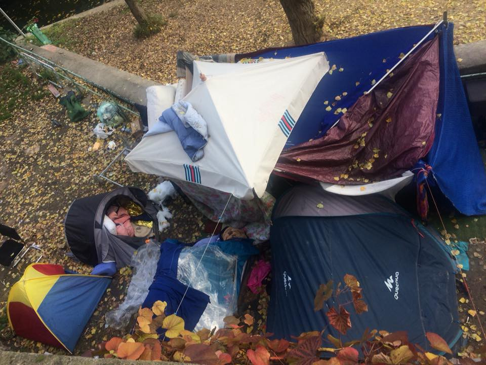

### AYS Daily Digest 27/11/17: Libyan Slave Trade is an Open Secret

_Sea Rescues//Fights on Lesbos and Occupation of SYRIZA building//Volunteers needed in Greece//Harrowing film from Croatia//Support needed in Calais//Sleeping rough and need for legal support in Paris//Protest in Italy// and more…_

The back of a migrant who had been tortured in Libya\. This was among many images received by the Observer in the past week, many of which they decided not to publish because they were too graphic\.
### FEATURE

Amnesty International issued a timely [condemnation of EU cooperation](http://www.amnesty.eu/en/news/press-releases/all/eu-africa-summit-footage-of-slave-auction-shows-human-cost-of-inexcusable-migration-deals-1086/#.Why2ZK2ZPq2) with Libyan authorities, just ahead of the 5th annual summit between EU and African Union \(AU\) authorities\. John Dalhuisen, a Regional European Director at Amnesty, explained how the organization has been following and reporting on Libyan abuses for years\. The illegal actions of the Libyan authorities are an open secret which the EU chooses to ignore\. According to Dalhuisen,

> For years, we have documented how refugees and migrants stuck in Libya are exposed to arbitrary detention, torture, killings, rape, extortion and exploitation\. 

> EU migration policy has increasingly prioritised preventing refugees and migrants from reaching Europe, in the full knowledge that doing so is facilitating the abuse of hundreds of thousands of women, men and children who are trapped en route\. 

> By funding, equipping and instructing Libyan authorities responsible for serious human rights violations against refugees and migrants, EU countries, and Italy in particular, have become complicit in their abuse\. 

In further corroboration of the horror stories coming out of Libya, the France 24 service The Observers [released a report today](http://observers.france24.com/en/20171127-migrant-slaves-libya-kidnapped-sold-prison) from a Guinean man who had been detained in Libya in 2016\. While he left the country come months ago, his story reveals that conditions in the country have not improved since one year ago, as many migrants are still suffering similar fates\. From his testimony:

> On our way to the prison, two of my friends tried to escape\. One of them succeeded, and he’s now living in Germany\. The other one was recaptured\. I watched as he was tied to a post in front of me, and then tortured by being electrocuted and beaten \[this type of torture seems to be the most common, according to other eyewitnesses\. Torturers put live electric cables against the victim’s skin, or wrap them around their legs or arms\] \. He died in agony in front of me\. His corpse wasn’t moved for three days\. Then the guards told us to leave his body on the side of the road\. 

### SEA

The MSF vessel Aquarius took over 400 people ashore safely who were rescued in the Mediterranean yesterday\.

■■■■■■■■■■■■■■ 
> **[MSF Sea](https://twitter.com/MSF_Sea) @ Twitter Says:** 

> > We have just finished disembarkation of all 400+ rescued people on board, including our youngest person on board, a now 5-day-old baby. Photos: Fabian Mondl https://t.co/niTi8tlPTc 

> **Tweeted at [2017-11-27 13:30:28](https://twitter.com/msf_sea/status/935138757011001344).** 

■■■■■■■■■■■■■■ 

Today an associate director for Human Rights Watch highlighted the outrageous actions of EU vessels, which co\-ordinate with the Libyan Coast Guard which abuses and kills refugees, and takes them back to hellish conditions\.

■■■■■■■■■■■■■■ 
> **[Gerry Simpson](https://twitter.com/GerrySimpsonHRW) @ Twitter Says:** 

> > EU is telling Libyan coastguards where to intercept refugees &amp; migrants in international waters and take them back to abuse in Libya while nearby EU aircraft &amp; boats stand by and watch @[theintercept](https://twitter.com/theintercept) [bit.ly/2AfnpoZ](http://bit.ly/2AfnpoZ) https://t.co/ZHXfnZ4Byy 

> **Tweeted at [2017-11-27 10:12:12](https://twitter.com/gerrysimpsonhrw/status/935088863667736576).** 

■■■■■■■■■■■■■■ 

### GREECE
#### Islands

One boat with 18 people arrived on the southern shore of Lesbos today\.

 \.](assets/2fcda716a413/1*0NQ9naNcGJCOnBgi-9NH5g.jpeg)

Moria camp, Lesbos\. Photo Credit: [NoBorders](https://www.facebook.com/nobordersnetwork/) \.

The Ekathamerini outlet [reported this week](http://www.ekathimerini.com/223625/article/ekathimerini/news/one-dead-in-altercation-among-afghan-migrants-on-lesvos) that a clash between Afghani refugees on the island of Lesbos left one person dead\. The fight allegedly occured outside of a house near the Moria camp which a group of Afghani refugees had been renting\.

 \.](assets/2fcda716a413/1*6K5z3HL0uO8K4-5-0e8w0w.jpeg)

A tour of Moria camp, Monday 27 November 2017\. Pouring rain throughout the day\. More than 7000 people in Moria now\. Capacity is around 2500\. Thousands of women, men and children in flimsy tents\. Photo Credit: [Lesvos Solidarity Pikpa](https://www.facebook.com/pikpalesvos/?hc_ref=ARQa7MZq6-hgeW1vzhpbP4yVrwxC0cfQUugqEMe8qMnG64dV9DFqWXr2AdsNQpcooaA) \.

Elsewhere on Lesbos, a group of protesting refugees have occupied the SYRIZA party building on the island\. The building was occupied after protesting refugees who were occupied a local square were met with many threats by the police and citizens, and physically attacked on multiple occasions\. The activist Arash Hampay put out a statement today explaining the occupation\.

> This protest is not an attempt to demand any sort of privilege over other refugees, but solely because we do not feel nor are we safe\.
 

> The unacceptable conditions of accommodation, the miserable nutrition provided, the absence of decent and appropriate medical care, the vengeful deprivation of water supply for drinking as well as hygiene due to the participation in mobilizing for protests, the constant police oppression inside Moria, and the violent conflicts erupting between different nationalities which are cultivated by the administration of the camp itself compose the framework of the aggressive imprisonment perpetuated in that environment\. 

> All the above are connected to the EU policies which continuously produce wars that create in turn migration flows, while simultaneously denies free and safe passage of the victims of these wars\. These policies include the EU\-Turkey deal which was singed by the SYRIZA\-ANEL government of Greece\. 

The Refugee Education Chios group is looking for teacher volunteers to support their efforts, to join for a minimum of four weeks\. From their statement today:

> We are the the largest voluntary run education service for children and youth stuck on Chios Island, Greece\. At the most basic level, we fulfill a fundamental right of children — to access education\. In Chios, children are continually denied access to the formal education system run by the Greek Government and there are no immediate plans to integrate the children arriving into Europe into the local education system\. 

> We currently have around 250 children and youth aged between 6 and 22 years old attending our school and youth centre every week\. 

Contact at nicholas@baas\-schweiz\.ch\.
### Mainland

[This week](http://www.keeptalkinggreece.com/2017/11/27/50682/#.Whvx1EiQAFE.facebook) the General Commission of the Greek Administrative Courts wrote an open [letter](http://www.ddikastes.gr/?q=node/2268) to the Ministers of Justice and Migration Policy and Directors of the Asylum Service and the Appeals Authority\. This letter was encouraging the government to do more to accelerate the processing of asylum applications\. While this may at first seem like a good\-faith attempt to decongest the islands, the proposals would likely be harmful to many refugees living in Greece\. For example, among other recommendations, it suggests removing protections for persons suffering from PTSD\.

The Greek Forum of Migrants and the African Network in Greece today put out a call for protest in Syntagma Square, Athens, on December 2 at 3pm\. The protest will be against the abuse and enslavement of refugees and migrants in Libya\. From today’s statement:

> We as the African Network in Greece and as the Greek Forum of Migrants strongly condemn the horrible violations of human rights that African migrants suffer in Libya\. 

> More than 20,000 Africans, including women and children, have been arrested and are now in detention under extremely poor conditions\. 

> The inhumane condition of African migrants who ended up in Libya, trying to reach the southern border of Italy, is just one of the results of the European Union’s irresponsible migration policy, and its members, particularly Italy\. 

> Khora Community Center is looking for volunteer female English teachers for our women’s classes\! We offer all levels of language from ABC´s to C1 fluency\. We take teachers with little or lots of experience, no certificate required\. We provide teachers with teaching resources and educational support\. We need teachers to teach at Khora for at least 4 weeks, the longer the better\! \! We are based in central Athens, close to Exarcheia\. 
 

> Looking forward to hearing from you\! Please send an email to khora\.education@gmail\.com\! 

The Armutel Center at Platia Viktorias 10–12 in Athens will be offering courses for new mothers this week on infant feeding\. There will be talks in Farsi, Arabic, English, and French\. More information [here](https://www.facebook.com/AmurtelHellasforRefugeeMothersandBabies/posts/536018403420040) \.
### CROATIA

The Balkan based organization [Rigardu](https://www.facebook.com/rigardu/) e\.V\. today released a [video](https://www.facebook.com/rigardu/videos/1762752630691280/?hc_location=ufi) shot by a refugee who was hiding under a truck in an attempt to pass through Croatia\.

The person who shot the footage said that it was very cold throughout the trip\. The shots shows him barely hanging onto the truck while the road flies below\. This film should be a reminder of the extremely dangerous measures people are being forced to take in order to find safe haven in the EU\. No one should have to cling to the bottom of a truck or cross the ocean in a rubber boat just to find safety\!

These risky border crossings are the direct result of strict border policies — as the border is more and more heavily policed, people are forced to take desperate routes\.
### FRANCE

Life is still hard for refugees in Calais\. Faced with the constant threat of police harassment and violence, and amid dropping temperatures, volunteers on the ground are scrambling to provide for people’s most basic needs\. [Care4Calais](https://www.facebook.com/care4calais/) released a [statement](https://www.facebook.com/care4calais/posts/1739201212779495) today detailing conditions on the ground:

](assets/2fcda716a413/1*-J5QfmFYyFV14Yhr6uUqRg.jpeg)

Photo Credit: [Care4Calais](https://www.facebook.com/care4calais/)

> Today, Calais is horrific\. We woke up to strong wind and heavy rain and everyone was soaked by the time they got to work\. Strong sea winds have the warehouse leaking in ten places and doors banging\. 

> But what about the refugees? They live outside with no protection from these elements and many are painfully ill equipped; it’s freezing outside\. 

> We took supplies out this morning but we just don’t have enough\. Saying ‘no — we don’t have’ to people under these conditions is simply heartbreaking\. 

Please help the volunteers at Care4Calais say ‘no’ to one fewer person tomorrow\! They are in dire need of winter coats, tents, and boots\. You can support their work [here](http://care4calais.org/donate/) \.

Amidst many outrageous instances of police brutality in Northern France, we have one story of justice being served\. According to [Refugee Info Bus](https://www.facebook.com/RefugeeInfoBus/posts/2052759921626092) , a French police officer was just sentenced to six months in prison after slapping a refugee in the face\. The verdict only came after a court clerk who witnessed the incident testified against the officer — the highly unusual circumstances of this case gives some indication of how hard it is for police officers to be held accountable for their crimes against refugees\. A slap in the face is hardly the worst thing refugees in Calais have suffered; a two month old report from Human Rights Watch revealed that out of 61 refugees who had been interviewed, [55 had been pepper sprayed](https://www.thelocal.fr/20171124/french-policeman-jailed-for-six-months-for-smacking-migrant) in the last week \.

A video was released this week on the situation of refugees in Paris, especially in regard to the difficulties of accessing legal information and aid there\.

With a lack of accurate information getting out to asylum seekers, many are denied their fair shot at an asylum hearing, and cannot access social services\. As one long term Parisian volunteer, Deborah Hyde, explained, “Legal support is essential here as a high percentage of applicants have already been refused in another country or at the very least had their fingerprints taken within Europe’s borders\. Increasingly people only find us after it’s too late to appeal\. As deportations pick up pace and politicians edge ever closer to inking an agreement on Dublin IV this lack of information could mean many men will be denied refuge here\.”

The volunteer group [La Cuisine des Migrants](https://www.facebook.com/lacuisinedesmigrant/?hc_ref=ARRXG7oe5aDQrOwHG_5lyiMx6eRrUs7bMEWQTLHxqNUakumGzkQHGea4k4F6A19KpUQ&fref=nf) put out a [statement today](https://www.facebook.com/lacuisinedesmigrant/posts/2135820743098624) condemning the mayor of the 18th arrondissement, for his tone\-deaf statement regarding setting up “orderly” distributions through the proper channels\. The statement not only ignored the long\-standing work of the volunteers, but also implied that the authorities are somehow better suited for distributing aid, when they have long failed to do so\.

A volunteer in paris recently shared a story of her efforts to get food and clothing to a group of minors sleeping rough in a park\. Her story encapsulates many of the issues refugees in the city face:

Refugees living in park in Paris\. Photo Credit: Danika Jurisic

> You can see on their faces for how long they have been on the street, there are bruises, dark circles, fatigue lines, and lack of something in their eyes\. Happiness, hope, childhood, it is all obliterated, suppressed by the reality of their lives\. They need parents, love, school, home, and they can’t even get a pair of shoes\. 
 

> 90% of those who apply as minors for asylum in Paris are refused\. Majority of them are boys ages 15–17\. They are left without any options — no housing, food, education, while they are dealing with administrative side of asylum seeking\. 

To find out where and how to help refugees in Paris, click [here](https://www.gofundme.com/ParisWinterRefugeeCamps) \.

The volunteer organization [Rastplatz](https://www.facebook.com/rastplatz/) recently released a [video](https://m.facebook.com/story.php?story_fbid=546828755664590&id=134599573554179&hc_location=ufi) describing the deteriorating conditions in Calais since the destruction of the infamous Jungle camp\.

The Rastplatz team is gearing up for another round of aid and distribution on the streets of Paris — you can support them [here](https://www.facebook.com/rastplatz/) \.
### ITALY

At the Libyan embassy in Rome yesterday, a large crowd of migrants and refugees gathered to protest the brutal treatment of refugees in Libya, including the practice of selling refugees into slavery\. One of the protestors, Yacoub Diarra, a representative of the association Ira Mauritania in Italy, explained the reasons for his protest: “I am here because I suffered tortures and the prison in my country, so I am a militant fighting against slavery\. At the moment there are five of my friends in prison, our leader Birham Dah Abeid has been jailed three times, and Mauritania is only three hours from Italy, not that far”\.
### GERMANY

The InfoMigrants outlet released a [report today](http://www.infomigrants.net/en/post/6268/finding-a-place-to-live-a-near-impossible-endeavour-for-refugees) on the extreme difficulties refugees in Germany face in finding housing\. As many refugees from the country have relayed, there is frequently discrimination involved in this issue, where landlords are far more likely to rent to a German person than a refugee\.

However, the problem is only compounded by the fact that there is a shortage of one million houses across Germany\. As the report states, finding accommodation has become a full time job for many refugees in the country\. In the absence of legitimate housing, many refugees are forced to chase rentals through the black market, where they are often overcharged and even robbed\.

Furthermore, thousands of refugees across the country are forced to live homeless, or from shelter to shelter while they wait for a flat\.
### NETHERLANDS

A group of activists are lobbying the government to stop the deportation of a young college student named Haroon\. Due to the EU’s absurd and inhumane policy of declaring Afghanistan a “safe third country”, thousands of Afghani refugees across Europe are being threatened with deportation\.

From the petition statement: “This needs to stop now\! Haroon has two younger brothers who are just children and we are sending them into a war zone\. It is not just Haroon that is at risk as our governments and the Afghanistan governments insist that Afghanistan is safe to return to\. Many people in Europe face deportation back to countries our governments have been complicit in making unsafe\!” You can see the petition to support Haroon [here](https://www.change.org/p/ind-21-days-to-deportation-lets-stop-it/nftexp/ex35/v3/837691911?recruiter=837691911&utm_source=share_petition&utm_medium=facebook&utm_term=psf_combo_share_initial.combo_new_control_progress_111417fake2&utm_content=ex35%3Av3%3Frecruiter%3D837691911&utm_campaign=psf_combo_share_initial.combo_new_control_progress_110217winners) \.

> **We strive to echo correct news from the ground through collaboration and fairness\.** 

> **If there’s anything you want to share or comment, contact us through Facebook or write to: areyousyrious@gmail\.com** 

_Converted [Medium Post](https://areyousyrious.medium.com/ays-daily-digest-27-11-17-libyan-slave-trade-is-an-open-secret-2fcda716a413) by [ZMediumToMarkdown](https://github.com/ZhgChgLi/ZMediumToMarkdown)._
