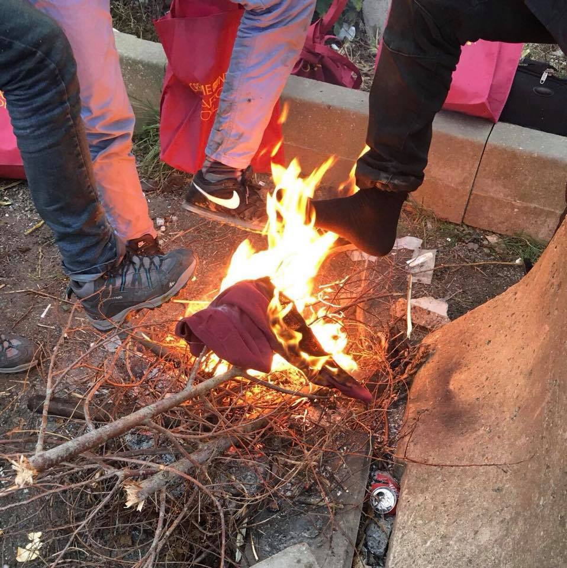

### AYS Daily Digest 30/11/2017: Vulnerable asylum seekers moved from Lesvos

_EU, UN and African Union agree to an emergency plan to repatriate stranded refugees in Libya//Temperatures drop in Calais//New humanitarian corridor opens in Italy_

](assets/ae945182fdba/1*WJ3vvPDqVXVq93QdAqXWlg.png)

Photo by [Together for Better Days](https://www.facebook.com/betterdays.ngo/)
#### Feature
### Vulnerable asylum seekers moved from Lesvos

[Ekathimerini](http://www.ekathimerini.com/223739/article/ekathimerini/news/greece-moves-hundreds-of-asylum-seekers-from-lesvos-to-mainland) reports Greek authorities on Thursday said they have moved more than 250 vulnerable asylum seekers to the mainland in an effort to ease overcrowding\. Minister Yiannis Mouzalas told the Athens\-Macedonian News Agency \(ANA\) that the effort will “intensify” in the coming days\. The agency says the Greek government plans to transfer about 3,000 people from Lesvos to the mainland by December 10, while similar actions will also be taken for other islands\.

As of November 30, the hotspots on Lesvos, Chios, Samos, Leros, and Kos are almost 7,200 over capacity: 12,744 people in facilities with a capacity of just 5,576\.

[Al Jazeera](http://www.aljazeera.com/news/2017/11/greeces-lesbos-guantanamo-bay-europe-refugees-171129134253661.html) reports the mayor of Lesbos has accused the Greek government of wanting to turn the island into a “Guantanamo Bay of Europe” for refugees, while another [article](http://www.aljazeera.com/news/2017/11/refugees-held-lesbos-resort-self-harm-leave-island-171130123058202.html) says the conditions are so harsh that some refugees say they are willing to hurt themselves in the hope of being removed from the camp\.

Together for Better Days says:

> Moria makes a mockery of us all\. Refugees arrive on our shores, relieved having finally reached a place where their rights will be respected, throwing their hands to heaven with joy or kissing our sacred soil in respect\. They soon find themselves in Moria where they are forced to live in squalid conditions\. Thus the harsh reality of Europe reveals itself\. 

On the 9th of December, the [Greek Forum of Refugees](https://www.facebook.com/events/1800899346874416/) plans a protest in Athens in favour of opening the islands and accelerating family reunifications\. Meanwhile, Human Rights Watch and eleven other groups have started a [campaign](https://www.hrw.org/news/2017/12/01/greece-move-asylum-seekers-safety-winter-hits) to end the containment of asylum seekers and \#opentheislands\. They are counting down so that no asylum seekers are left out in the cold by Dec 21\. On Lesvos itself, the occupation of Syriza’s headquarters continues\.
#### Libya

**Officials announced the EU, UN and African Union agreed to an emergency plan to dismantle human smuggling networks and repatriate stranded refugees in Libya** \. _The Times_ says the emergency plan will see the number of flights repatriating migrants from Libya almost double, after the African Union called for the immediate evacuation of 3,800 migrants who it said were being held in inhumane conditions at detention centres\. The African Union also warned however that there are total estimates of “400,000 to 700,000 African migrants in Libya”\. _Liberation_ notes that, to discourage departures, proactive communication aimed at youth will be put in place\.

**The [New York Times](https://www.nytimes.com/2017/11/30/world/africa/slave-market-libya-european-migrants.html) accuses the EU of offering a ‘notably muted’ response to the plight of refugees** auctioned off at Libyan slave markets\. It quotes the Centre for European Reform’s John Springford as saying “the tragic and morally unjustifiable thing about this is that European Union policy is certainly a part of why this is happening”\. A Human Rights Watch researcher claimed that the EU’s policy “is looking an awful lot like complicity” in the exploitation of migrants\.

**Many commentators note that reports of kidnapping, extortion, forced labour and even slavery have been coming for years now\.** [MSF](https://msf.exposure.co/human-suffering) for example has frequently written about the hellish conditions in Libyan detention centres\.

[**Mediapart**](https://www.mediapart.fr/journal/international/281117/le-diabolique-projet-de-l-europe-pour-bloquer-les-demandeurs-d-asile-hors-de-ses-frontieres-0) **has obtained the latest version of a EU regulation that would allow asylum seekers to be sent back to “safe third countries”\.** It says the concept of “safe third country” is broadened and could eventually affect a country like Libya if certain regions are stabilised\.
#### Italy
### New humanitarian corridor opens

[Internazionale](https://www.internazionale.it/bloc-notes/annalisa-camilli/2017/11/30/corridoi-umanitari-etiopia) says 25 refugees have arrived at the Fiumicino airport this morning through the new humanitarian corridor opened by the Sant’Egidio Community together with CEI, Caritas Italiana and Migrantes Foundation\. The refugees lived in refugee camps of Ethiopia and come from South Sudan, Eritrea and Somalia, with a third of them being children\. The new humanitarian corridor is open to vulnerable refugees from the Horn of Africa and will eventually affect 500 people\.
### Skinheads interrupt “Como Senza Frontiere” meeting

[La Provincia](http://www.laprovinciadicomo.it/stories/como-citta/como-irruzione-dei-naziskin-alla-riunione-sui-migranti_1262757_11/) reports that on Tuesday, around 15 skinheads interrupted a public assembly organized by the members of Como Senza Frontiere and tried to intimidate the public\.
### Emergency situation in Valsuva

The Monginevro pass between Italy and France is now closed due to the snow but refugees continue to cross\. [Repubblica](http://torino.repubblica.it/cronaca/2017/11/29/news/emergenza_profughi_in_valsusa_le_ferrovie_chiudono_due_stazioni-182490059/) calls it an emergency situation and Trenitalia has set up a room in the Bardonecchia train station where police can host refugees\. However it’s not enough, as the real problems arise in the mountains\. Last week, a 19\-year\-old boy from Ivory Coast was rescued while trying to cross the pass with only slippers on, risking hypothermia\.
#### Sea
### Missing boat still not found

The Spanish coast guard still has not found the missing boat with 34 people that disappeared off the coast of Morocco\. Six survivors were brought to the Mohamed V hospital in Tanger\. 11 people from another boat were rescued by the Spanish coastguard and brought to the port of Algeciras\. Spanish ports warn that a storm with significant waves is expected on Friday in the Mediterranean\.
#### Bulgaria
### Drop in detention of migrants

[Sofia Globe](http://sofiaglobe.com/2017/11/30/illegal-migration-in-bulgaria-sharply-down-in-2017-interior-minister/) reports a total of 2,678 people have been detained in Bulgaria for illegal migration between January 1 and October 31, a drop of 84\.5% compared to the same period last year\. Of those taken into custody in the first 10 months of 2017, a total of 656 have been held trying to cross the border into the country, 406 seeking to exit and 1616 people within the country\.
#### Portugal
### Saman Ali granted international protection

For three days, Saman Ali, a Yazidi man from Iraq had been on hunger strike in protest of the delay in granting international protection as we wrote about [two days ago](ays-daily-digest-28-11-2017-the-authorities-will-be-responsible-for-my-death-6cbe62ab240a) \. [Expresso](http://expresso.sapo.pt/sociedade/2017-11-29-Saman-Ali-yazidi-ja-tem-estatuto-de-refugiado-em-Portugal) now says he has been granted refugee status, which is followed by the issuance of a residence permit in the national territory, valid for five years\.
#### France
### Temperatures drop in Calais

It’s snowing in Calais and Help Refugees says it will be making emergency orders of survival blankets, handwarmers, ponchos and other winter items to prevent hypothermia\.

You can help them by donating [here](https://mydonate.bt.com/fundr…/calaisdunkirk-refugee-support$) or [bringing physical donations to the warehouse](https://helprefugees.org/donate-goods/) \. Help Refugees also says that almost 20 grassroots refugee support groups in the UK came together last weekend and delivered 400 waterproof boots\. It hopes to [distribute another 600](https://mydonate.bt.com/events/boots1000) before temperatures drop even more\. Care4Calais says people are putting their feet into flames to warm up and says around 700 young people are currently sleeping rough in the Calais area\. The group is also looking for [donations](http://www.care4calais.org/donate) \.

It also snowed in Paris where hundreds of refugees are still sleeping in the streets\. This morning, police and city employees apparently threw the belongings of refugees into waste trucks\.

](assets/ae945182fdba/0*qrvck2RT3qlWjZSp.jpg)

[Samuel Hanryon](https://twitter.com/Sam_hanryon/status/936534010280411136)
#### General

As we are aproaching 16 days of activism, the [Action from Switzerland](https://www.facebook.com/actionfromswitzerland/) puts out statement on vulnerability of female refugees saying that women and girls are exposed “to particular challenges related to their gender, their roles and their position in society\. They are less likely than men and boys to be able to exercise their rights\.”

](assets/ae945182fdba/1*czctijA0u2o4QuTBfb2QjQ.jpeg)

Photo credit: [A Polaroid for a Refugee](https://www.facebook.com/DelSartoGiovanna/)

They say that “specific actions in favour of women and girls are crucial”, and they insist that all future discussions on asylum and resettlement in Europe “MUST have a stronger gender dimension, ensuring that the specific needs and experiences of women and girls are carefully addressed, particularly in relation to gender\-based violence\.”

> **_We strive to echo correct news from the ground through collaboration and fairness, so let us know if something you read here isn’t right\._** 

> **_If there’s anything you want to share, contact us on Facebook or write to: areyousyrious@gmail\.com\._** 

_Converted [Medium Post](https://areyousyrious.medium.com/ays-daily-digest-30-11-2017-vulnerable-asylum-seekers-moved-from-lesvos-ae945182fdba) by [ZMediumToMarkdown](https://github.com/ZhgChgLi/ZMediumToMarkdown)._
