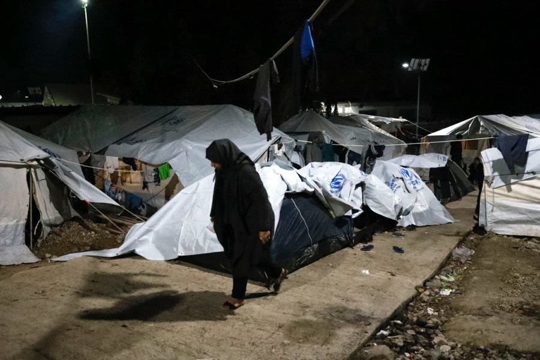
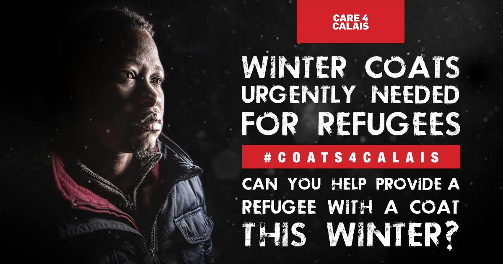
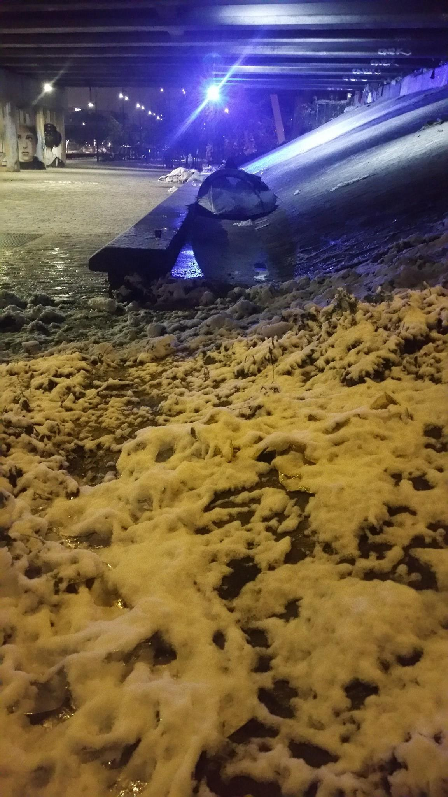
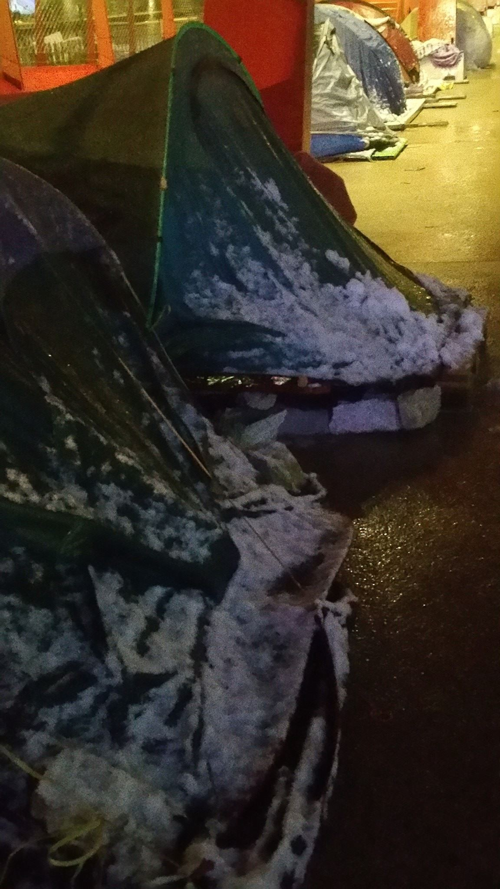
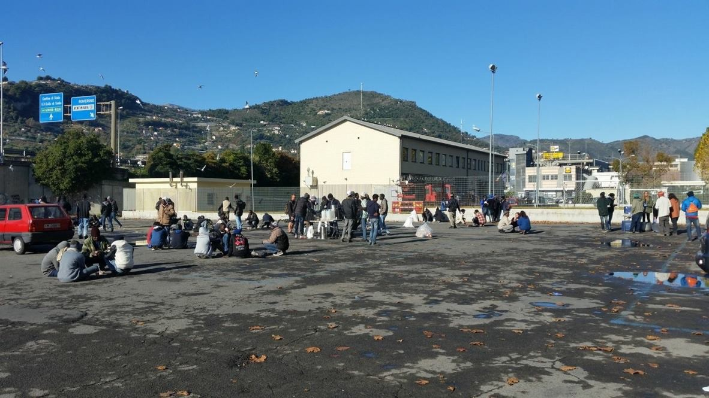
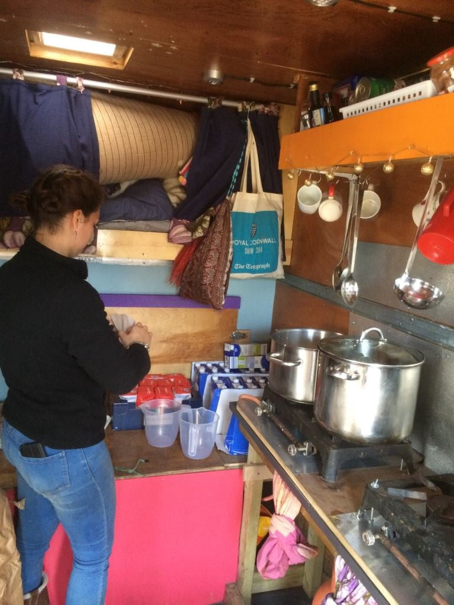
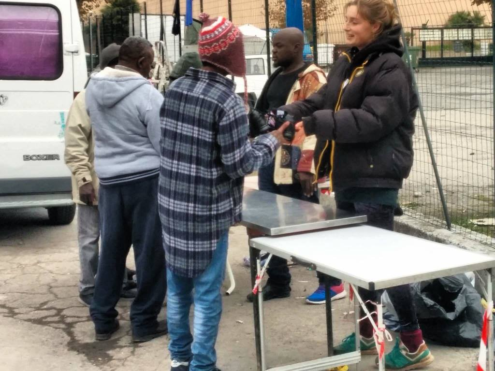

### AYS DAILY DIGEST 1/12/2017: The winter is here — It is time to act\!

_Help urgently needed in Greece, France, Belgium, Serbia… all over Europe // Stormy weather at the Mediterranean and Greece // Serbian government warns foreign volunteers in Sid // Action day to end slavery in Libya_

](assets/9510a393f80e/1*c318p7sFxlZWlCrCkyPXrw.jpeg)

[@Mizerias90](https://twitter.com/Mizerias90)
### Feature

Some parts of Europe are already covered with snow\. In others, it is rainy and very cold\. In these conditions, thousands of people are on the move, trying to reach a place where they will feel safe\.

Unfortunately, too many of them are forced to stay out in the open, using makeshift shelters, while almost the only help they get comes from volunteers and locals\. For all of these groups, help is needed to continue helping people who are abandoned by the institutions and big NGOs, and left in the streets of European cities\.

The situation is not good in Greece, but also in Serbia, Italy, Spain, France, Croatia…

On the islands, even though the Greek government has finally started slowly to move people to the mainland, existing camps are still overcrowded and people are forced to stay in tents, with sometimes limited access to water or electricity\.

[Human Rights Watch](https://www.hrw.org/opentheislands) , as a part of the \#opentheislands campaign, sent out the message that nobody should be forced to sleep in the cold this winter\.

“It is time Greek Prime Minister Alexis Tsipras ended the inhumane containment of asylum seekers on the Greek Islands\. Target [Greek Prime Minister on Facebook](https://www.facebook.com/tsiprasalexis/) and paste the following message as a comment into his latest post:

> It’s time for Greece to protect asylum\-seekers trapped on Greek islands\. Declare an end to the containment policy on the islands and allow people to move to mainland Greece\. 

The campaign demands that the Greek government and European Union leaders should act now, before the onset of winter, to end Greece’s “containment policy”\.

> “This will be the second winter asylum seekers have had to spend in unsuitable facilities on the islands since the EU\-Turkey Deal went into effect in March 2016\. Last winter, three men died on Lesbos in the six days between January 24 and 30\. Although there is still no official statement on the cause of these deaths, they have been attributed to carbon monoxide poisoning from makeshift heating devices that refugees have been using to warm their freezing tents\. In late 2016, a blast likely caused by a cooking gas container killed a Kurdish woman and her young grandchild, also sleeping in a tent in Lesbos\.” 

Help if you can\!

**_Greece:_**

On Tuesday and Wednesday, the temperature will be 3 degrees in Athens\. Currently, there are about 3000 people staying in the streets of this city\. This is [the need list](https://needslist.co/hopecafe) made by groups operating in Athens\.

[We Are Here — Community Centre](https://www.facebook.com/WeAreHereCentre/?hc_ref=ARS_DW3Sm6UUTk1spCBk0xpgPyM_L_b9VChG55--vLOedX-YpZ1QM2560OhgfPQNCPs&fref=nf) also needs help\.

> After eighteen months of being here, and supported only through individual donations, we have learned to make a little go a long way\. But with the crisis showing no signs of disappearing, we don’t expect the need for our services to go away anytime soon\. This means we continue to need your help to fund the work we do here\. So please [consider sharing your Christmas spirit](https://www.gofundme.com/weareherecentre) with the people of Nea Kavala\. 

[Khora center](https://www.facebook.com/KhoraAthens/) , reopened after renovation, needs blankets

If anyone is able to donate some blankets please bring them along to Khora \(Askilipiou 80\), or if you have any information about ways to get blankets, please contact them on their FB page\.

**_Serbia_**

[Rigardu team](https://www.facebook.com/rigardu/) provides mobile showers, drinking water, mobile phone charging stations and distributing of hygiene articles to people in Serbia, and they need your help\.

> “The desperate situation of the people stranded in Serbia has not improved since we took up our work in February 2017\. As EU member states are increasingly sealing off their borders, no improvement is in sight in the near future\. We will, therefore, continue with our work and urgently need your support\! 

> If you can, [please make a donation](https://www.betterplace.org/en/projects/58785-humanitarian-support-for-people-on-the-run) \. It can make a difference\!” 

**_France_**

[L’Auberge des Migrants](https://www.facebook.com/LAuberge-des-Migrants-358496450338/) are in Calais where winter has already arrived\. There are snow and icy rain, and police are still harassing people who are sleeping out in the open\.

> “No way to sleep normally, police continue to track refugees day and night and remove, as they try to install them, tents, blankets, duvets, when it’s not their personal stuff\. These weather conditions and harassment make migrants increasingly ready to take maximum risks to leave these living conditions and reach England\. The channel passage is still possible, but it is becoming more complicated day by day: the service stations are installing more and more new barbed wire lines, the cars are setting up dams\. 

> But blocking the border increases the power of the smugglers: they become unavoidable to have a chance to cross the border\. They increase their tariffs, and try to encourage their customers in our distributions, to the detriment of others…” 

The group continues to distribute help and offers services for all in need\.

They need support to continue working\. There are several ways:
Donate to the [hostel of migrants](http://www.laubergedesmigrants.fr/fr/faire-un-don/) , [support their distributions](http://www.laubergedesmigrants.fr/fr/faire-un-don/soutenir-un-projet/5e-distributions-de-vetements/) , help them [buy warm clothes](http://www.laubergedesmigrants.fr/fr/faire-un-don/soutenir-un-projet/mauvaises-conditions-meteo-calais/) , [organize or participate](http://www.laubergedesmigrants.fr/fr/dons-materiels/) in a material support collection →

Calais, snow has made things even worse than they were\.

[FAST \(First Aid Support Team\)](https://www.facebook.com/groups/www.fast.eu/about/) in Dunkirk needs medicines, blankets, bandages… See their FB for the complete list\. The most important, [they need medications for scabies](https://mydonate.bt.com/fundraisers/firstaidsupportteam) \.

[Care4Calais](https://www.facebook.com/care4calais/) supports people in Northern France, where temperatures are rapidly dropping\.

> “There are minors as young as 13, and they have no access to clean clothes, water or shelter\. So this holiday season our goal is to provide each and every one of these refugees with a warm winter coat\. To do this we URGENTLY need your help\. We are asking each of you to look in your cupboards for a winter coat that you no longer wear\.” 

To donate your coat to the nearest donation point [see here](https://goo.gl/ULD9dG) \. If you can’t give a coat, simply [visit](https://goo.gl/scNsbD) and buy a coat for a refugee for £25\.

Let’s keep people warm this winter\!

[La Cusine des Migrants](https://www.lepotcommun.fr/pot/wigl23p3) distributes around 300 meals per day in Paris\. It has no money left on its crowdfunding site and needs funds to buy food, plastic cutlery, and bread\.

Paris today\. Photo Refugee Ground Support Team\.

**_Belgium_**

People in Brussels are still hosting migrants who are in their city and do not have accommodation\. But they also [need help to continue helping to increase the number of people](https://www.facebook.com/events/1504496349642975/) \. They need coats, gloves, scarfs, sweaters\.

Or you can just join them and host somebody\.

If you cannot donate, you can go out on the streets all over Europe and help people who are in need\. Like people in Paris and Brussels, you can open your home for refugees who are left sleeping out in the open\. You can demand changes from your governments, you can protest, you can talk about this issue or just share calls for donations with other people\.

We are the change\. Act today\.
### Sea

According to the IOM, six people were rescued off Morocco late on Thursday, but another 28 people who were on their boat are still missing,

So far this year, 174 people have already died on the route between North Africa and Spain while the number of people arriving in Spain reached 19,668 by Nov\. 29\.
### Greece

Today, one boat arrived on Samos with 46 people who will almost certainly be left outside the already overcrowded camp, forced to sleep in pop\-up tents or shelters they will build themselves\.

Disturbing news from Rhodes where Ahmed Satouf, member of the [Oasis group, was arrested on Thursday](https://www.facebook.com/groups/OasisRhodes/permalink/1836858103272620/?hc_location=ufi) because he got the 2nd refusal of asylum\. He is now in Rhodes Prison and he is going to be deported to Turkey\.

Oasis calls for action because Turkey is a very dangerous country for him\.

[The Mobile Info Team](https://www.facebook.com/mobileinfoteam/) answer questions about asylum rights for LGBTQ people who suffered persecution in their home countries\.

> “In 2011 the European Union enacted a law stating that persecution based on a person’s sexual orientation or gender identity is a valid ground to be granted asylum\. This means that for example men who are attracted by men, women who are attracted by women or people who have relationships with both genders and were persecuted for this preference, can be granted asylum in Europe\.” 

They have also compiled an [info sheet about rights of LGBT](https://www.mobileinfoteam.org/info-sheets) \(gay, lesbian, bi\- or transsexual\) refugees\.
### Serbia

[Centar za zaštitu i pomoć tražiocima azila](http://www.apc-cza.org/sr-YU/component/content/article/8-vesti/1281-cucic-i-durovic-oprecno-o-prihvatnim-centrima-u-sidu.html) \(Center for help and the protection of asylum seekers\) in Serbia, issued a report on their website about a visit by the head of the Commissariat for refugees and migrants, a state institution, to one of the existing camps in Serbia\.

Vladimir Cucić confirmed that the government is aware of the number of people sleeping rough in the Šid area, saying that most of the people who are there are “refusing to be placed in one of the existing camps”\. He also said, according to this organization, that the government is aware of the existence of _“different foreign international organizations who are helping people in Šid, providing them with living conditions in those illegal accommodation places”_ \. Apparently, Cucić told these groups that they should think about what they are doing over the next 7 days\.

_“If they want to continue helping people like they used to do in Horgos or Belgrade near the bus station, it is the worst possible way\. If they want to assist in moving these people to the center, it is OK\. If not, they are not needed here”_ , Cucić said\.

Apparently, he also asked a group from Spain if _“150 Serbs came to Madrid or Sevilla illegally, and if somebody provided them with the possibility to live in the city center, do you think the Spanish authorities would tolerate that? Why do you think we should? Fit into the system\!”_

Nevertheless, the director of the Center, Radoš Đurović, claims that the situation in Šid is not as portrayed by the authorities\. According to him, people are not being accepted in the center in Šid due to lack of capacity\. According to him, there are around 200 people in the Šid area, and some of them are families, while around 20 percent are unaccompanied minors\.

_“They sleep close to the border, in the fields and in the forest, or abandoned factories around the city\. They are cold, hungry, inadequately clothed, sick, and in a dire physical and psychological condition\. Despair and stress are evident\.”_

[Refugee Aid Serbia](https://www.facebook.com/refugeeaidserbia/) needs volunteers to help with a distribution in Belgrade next Wednesday, 6th of December, at 15 o’clock\. They are also looking for people to help with the preparation of the distribution, on Tuesday 5th of December, at 13 o’clock\.

If you are interested in helping out, please contact [anke\.heyerick\.ras@gmail\.com](mailto:anke.heyerick.ras@gmail.com) \.

The same group is organizing the second edition of Shoebox project, in collaboration with different schools and organizations destined to refugee children around Serbia\. You can get involved, too\. Visit their FB page for more details\.
### France

Another report by girls from [SolidariTea](https://www.facebook.com/refugeesolidaritea/posts/1205636736204747) \.

Ventimiglia area

> “It’s getting frosty in the mornings here — waking up after the fire has burnt down in the truck is bad enough, let alone waking freezing cold, under a motorway bridge, an only halfway through your mammoth journey to safety in Europe\. The cold is slowly creeping its way in… 

> … Every evening we are taking blankets and jackets to distribution \(provided by the organization we are working alongside at the moment\) and everyone is asking for gloves and hats for the long nights\. People travel four kilometers along a very dangerous road from the camp on the outskirts of town to reach the distribution to fill up on nutritious food and lots of hot, sweet, milky tea… 

> There remain about 150 people sleeping under the bridge despite frequent evictions and deportations to camps further south… 

> … There is an evening meal of delicious, nutritious hot food and breakfast provided six times per week\. 

> We hope in the coming days we will be able to give some calorie\-filled, lunchtime food along with the tea\.” 

### UK

Refugee Rights Data Project reminds us about the [latest report presented by the Independent Chief Inspector of Borders and Immigration](https://goo.gl/jfK7Du) on the Home Office’s asylum intake and casework process\.

According to this report, the Home Office is struggling to keep on top of asylum claims\.
### General

IOM, the UN Migration Agency, reports that 164,654 migrants and refugees entered Europe by sea in 2017 through 19 November, with just over 70 percent arriving in Italy and the remainder divided between Greece, Cyprus, and Spain\.

Some 15,507 men, women, and children have entered Greece by sea from waters of the Eastern Mediterranean since 1 August\. Through 25 November, the total number of sea arrivals to Greek territory is 26,915\.
### EU

The slave auctions in Libya that have provoked international outrage are partly a result of policies put in place by the EU, the director of France’s Doctors Without Borders wrote Thursday in an op\-ed for Le Monde, and [Politico translated it into English](https://www.politico.eu/article/libya-slaves-eu-partly-at-fault-for-deplorable-conditions-for-migrants-says-ngo/) \.

Refugee Accommodation and Solidarity Space City Plaza is organizing an [action day across Europe: Stop Europe Funding Slavery in Libya — Stop Wars Against Migrants](https://www.facebook.com/sol2refugeesen/posts/1795833944042274) on December 18\.

If you want to participate, get in touch with them 
[solidarity2refugees@gmail\.com](mailto:solidarity2refugees@gmail.com)

> “In Libya, every day migrants are imprisoned in private detention centers, tortured and sold as slaves\. They suffer extreme exploitation and violence\. 

> Europe is funding the expansion of these detention centers\. Meanwhile, by implementing the Malta agreement, Europe is training and technically supplying the Libyan “coastguard” to carry out illegal refoulements that they call “rescue operations”\. 

We join in solidarity in the call for the immediate cessation of the funding of the Libyan torturers\.

End slavery and detention in Libya\.

Free passage, healthcare, and protection to all the victims of torture and trafficking\.

> **We strive to echo correct news from the ground through collaboration and fairness\.** 

> **If there’s anything you want to share or comment, contact us through Facebook or write to: areyousyrious@gmail\.com** 

_Converted [Medium Post](https://areyousyrious.medium.com/ays-daily-digest-1-12-2017-the-winter-is-here-it-is-time-to-act-9510a393f80e) by [ZMediumToMarkdown](https://github.com/ZhgChgLi/ZMediumToMarkdown)._
