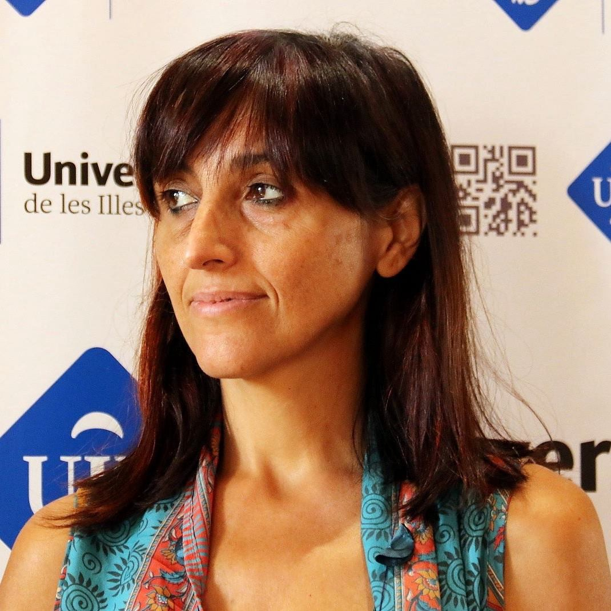

### AYS DAILY DIGEST 4/12/17: Syrian Man Attempts the Sea Crossing Alone

//Rescues at Sea//attacks on press in Greece//Illegal arrests on Lesbos//Donation needs in Athens//Activist faces bogus charges in Morocco//Sleeping rough in France//German pilots resist deportations\!//and more\. \. \.

](assets/768f7b6d701d/1*-EwaeeE52UjL713xoHJATA.jpeg)

A night rescue in the Mediterranean\. Photo Credit: [SMH](https://www.facebook.com/smhumanitario/)
### SEA

An Italian outlet reported today that a 30 year old Syrian man named Sami Naser attempted the crossing from Tripoli to Lampedusa on his own\. He was rescued by a Spanish vessel, who were shocked to see someone attempting the dangerous journey alone\. Sami told the volunteers who rescued him that he had no choice but to flee Libya\. He had been working as a nurse outside of Tripoli in a state of semi\-slavery for months, with all his wages being stolen\. Sami wanted to leave the country before he fell into the hands of kindappers who would likely torture and ransom him\. Sami explained: “In Libya there is a hunt for Syrians, they are convinced that we are full of money, as soon as they find you they kidnap you to extort money from you\. I could not take it anymore, with what little I had left I bought this rubber boat from a friend in Tripoli and I left: either live or die”\. Sami knew that his small rubber dinghy would never make it all the way to Lampedusa, so he was praying to be found by a rescue vessel en route\. Although Sami knew there was a high chance he would not be found and die at sea, he said it would be “a greater risk to stay in Libya\.”

Sami’s story exposes the disgusting lie peddled by EU authorities that rescue missions in the Mediterranean serve as a “pull” factor drawing refugees towards Europe\. For Sami and countless others like him, there is nothing in Libya but torture, ensalvement, and death, and so they will take the journey no matter the risks\.

The team that rescued Sami believes he had been on the water for two days and nights before they found him\.

A vessel from the rescue organization SMH saved 30 people in the Mediterranean today\.

■■■■■■■■■■■■■■ 
> **[SALVAMENTO MARÍTIMO](https://twitter.com/salvamentogob) @ Twitter Says:** 

> > Imagen del rescate de la patera con 30 personas por la Guardamar Polimnia. https://t.co/Jy1A8zwgKZ 

> **Tweeted at [2017-12-04 17:06:07](https://twitter.com/salvamentogob/status/937729741813055489).** 

■■■■■■■■■■■■■■ 

The MSF vessel Aquarius embarked on another rescue mission today\.

■■■■■■■■■■■■■■ 
> **[MSF Sea](https://twitter.com/MSF_Sea) @ Twitter Says:** 

> > #Aquarius leaving Catania port this morning. A full day of drills ahead before reaching int'l waters. https://t.co/AacB8ccGZj 

> **Tweeted at [2017-12-04 07:37:34](https://twitter.com/msf_sea/status/937586660488904704).** 

■■■■■■■■■■■■■■ 

### TURKEY

The Kapilar organization, in central Izmir, is offering open hours on mondays for migrants and refugees to learn more about services available to them\. More information [here](https://www.facebook.com/izmirkapilar/photos/a.1682272942038267.1073741835.1665403690391859/1930075573924668/?type=3&theater) \.
### GREECE
#### Islands

There were 17 new arrivals to the island of Chios early this morning\. Given the unacceptable conditions in Vial camp on the island, it is likely that their hardships are far from over\.

■■■■■■■■■■■■■■ 
> **[RSA](https://twitter.com/rspaegean) @ Twitter Says:** 

> > #Chios Vial refugee camp, situation deteriorating and vulnerable still living under deplorable conditions without accommodation 
photo Ali Darwish https://t.co/lCEnIjicPo 

> **Tweeted at [2017-12-03 22:39:10](https://twitter.com/rspaegean/status/937451170683080706).** 

■■■■■■■■■■■■■■ 

Today the journalist and photographer Patrick Strickland released some images from the Moria camp on Lesvos showing the despicable conditions there\. Strickland also [reported](https://twitter.com/p_strickland_/status/937206508391141378) being harassed by police outside of the Moria camp today, another blatant attempt to intimidate and push away journalists\.

ECRI put out a call for support for there work in Moria today\. You can donate [here](https://ercimed.causevox.com) \.

The activist Arash Hampay reported today that tonight 30 refugees from the Moria camp on Lesbos went to protest in the town square\. All of them were arrested shortly thereafter\. Hampay [wrote](https://www.facebook.com/photo.php?fbid=555105734835517&set=a.543629595983131.1073741843.100010082855510&type=3&theater) , “We need legal advice because we can expect the [\#police](https://www.facebook.com/hashtag/police) to act in an illegal manner\. This was evident in the way in which they treated my brother — threatening to [\#deport](https://www.facebook.com/hashtag/deport) him\!”

](assets/768f7b6d701d/1*b9SJ3fHw8jlUv_0inInZ2g.jpeg)

Police illegally detaining refugees, 4/12/17, Lesbos\. Photo Credit: [No Borders Kitchen](https://www.facebook.com/NBKLesvos/)

Other volunteers have corroborated Hampay’s account, although some others claimed the total number of refugees arrested was 27\. As of this evening, only 8 have been released from their illegal detention\. [According to](https://www.facebook.com/NBKLesvos/photos/a.722870371186088.1073741830.689281511211641/1047272742079181/?type=3&theater) the [No Borders Kitchen Lesvos](https://www.facebook.com/NBKLesvos/) group: “The police accuses \[the protestors\] of having had tents and therefore illegally camping\. We know that this is not true, there was no tents on saphous square\. Most of them also have valid papers, as far as we know\. It seems that their detention is purly repression attempting to stop anyone from raising their voices against the unbearable conditions on Lesbos\.”

The [Hope Project](https://www.facebook.com/HopeProjectKempsons/) on Lesbos has almost finished repairs on their warehouse to make it better suited as a distribution site\. You can find out more about their efforts and donate [here](https://mydonate.bt.com/fundraisers/thehopeproject) \.

The [NoBorders](https://www.facebook.com/nobordersnetwork/) network has put out a call for solidarity for a young Syrian facing deportation on the island of Rhodes\. From their statement:

](assets/768f7b6d701d/1*fFWLdnYno9WwYGov9z1Kag.png)

Ahmet Satuff\. Photo Credit: [NoBorders](https://www.facebook.com/nobordersnetwork/)

> 19\-year\-old Ahmet Satuff remains detained at Mandraki police station in Rhodes\. 
 

> [OASIS — Rhodes Solidarity Group](https://www.facebook.com/groups/OasisRhodes/) denounces the arrest of the young Syrian and calls for support of friends and solidarity so we can stop his deportation\.
 

> Ahmet Sathuf is alone in Rhodes as his mother and his three brothers managed to reunite in Germany with his father and sister in September\. Since then he continued sports and artistic activities while attending Greek lessons and offering volunteer assistance to other refugees\.
 

> In October, Ahmet Satuff was written in the 2nd General Lyceum of Rhodes and attends the second grade classes\. At the same time, he continues Greek language courses at the University of Aegean He made great progress and significant steps in socialization\. 

#### Mainland

Volunteers in Athens are preparing for a distribution tomorrow night in Syntagma Square, Athens\. They will be passing out blankets, hot tea and soup from 11:30 at night until the following dawn\. Information [here](http://steps.org.gr/en/the-steps/housing/) \.

The Ellinikon Warehouse in Athens is one of the main warehouses for distributing aid to refugees across Greece\. The warehouse is currently in dire need of many items, including food, clothing, and bedding\. To send donations to them and see the list of needs, click [here](https://www.facebook.com/groups/PAMPIRAIKI/permalink/558906624453446/?hc_location=ufi) \.

The [Mobile Info Team for refugees in Greece](https://www.facebook.com/mobileinfoteam/?hc_ref=ARQjvU-2Nq6m9gJ9oWqlAZB-VZI-Rw9RHSwU5hQHi37a3Y4FMQp5K9v3lqCkW8qGVsQ&fref=nf) put out a [report](https://www.facebook.com/mobileinfoteam/posts/2076040922624626:0?hc_location=ufi) today in Arabic and English answering questions on the process of being fingerprinted in the EU, and how the fingerprints will be used\.

The [Refugee Info Bus](https://www.facebook.com/RefugeeInfoBus/) team put out an Arabic language video today on accessing social services for refugees\. Watch it [here](https://www.facebook.com/RefugeeInfoBus/videos/2055420541360030/?hc_location=ufi) \.
### ITALY

Activists and volunteers on the ground in the Pordenone area continue to report unacceptable conditions for refugees there\. While the right and left wing parties continue their asinine debates over who is a “real” refugee, the real questions are being ignored\. As a [Pordenone solidarity organization](https://www.facebook.com/retesolidalepn/?hc_ref=ARSeZrFkApEbYaBnBAvlXkWxBdIGkVfAQ6k-KQzlSzyPRUKArynChUZ7GzNbDX8nDSk&fref=nf) put it: “The real issues here are: why are they on the streets, forced to sleep in the fields? Why do they not even have a place for their primary needs, to bathe, drink and eat?”

The Solidarity movement casts blame on the mayor of Pordenone and the local government for failing to address these issues\. Their failure to respond to the situation has already led to [one death in the area](https://www.facebook.com/retesolidalepn/posts/1992733291007487) , and considering dropping temperatures, there will likely be more fatalities if those in power do not act soon\. As the solidarity group noted, “Both institutions \[the office of the mayor and local governmental bodies\] have extensive powers of intervention, and can avoid situations of human and social degradation, and of real danger to the lives of those involved\. **We must ensure IMMEDIATELY a warm and safe place for people on the move\.”**

The mayor, police chief, and religious leaders in Como [announced](https://ecoinformazioni.wordpress.com/2017/12/04/emergenza-freddo-nuovi-posti-letto-al-centro-cardinal-ferrari/) they were making 40 additional beds available for refugees in the city in heated tents\. While everyone deserves stable housing and not to live in a tent, this is the kind of emergency action that will become increaisngly necessary throughout Europe this winter\. The decision to place the tents in the city was followed by a great deal of foolish hand\-wringing about “security”, as if it is those who are fleeing wars and persecution and sleeping rough are a threat, rather than threatened themselves\. Despite the many inadequacies of this decision, we can only hope that other Italian municipalities will be following the lead in creating additional emergency accomodation\.
### SPAIN

The Spanish journalist and human rights defender Helena Maleno Garzon has been requested to appear before a Moroccan court \(her country of residence\) \. While the charges against her are forthcoming, the international human rights organization [FIDH has surmised](https://www.fidh.org/en/issues/human-rights-defenders/shrinking-space-for-civil-society/defendingmaleno?var_mode=calcul) from the court documents that she is being charged with involvement in human trafficking\. This charge appears to stem from the fact that, because of her long standing work as an advocate, she is a frequent point of contact for refugees crossing the Mediterranean\. In particular, she has been called by many refugees requiring emergency rescue at sea\.

Photo from Helena Garzon’s facebook\.

To charge people like Helena, who have been commited to protecting the lives of refugees for years, with human trafficking is the height of cynicism\. These charges are an attempt to bully and silence other human rights defenders who have been calling attention to refugee issues\. As [FIDH reports](https://www.fidh.org/en/issues/human-rights-defenders/shrinking-space-for-civil-society/defendingmaleno?var_mode=calcul) , these charges are “a judicial process aimed to criminalise the work that Helena Maleno has been doing for years as a Human Rights Defender\.” We join FIDH in their condemnation of these false charges: “On this day, we are not only putting in risk the life of Helena and her right to freedom\. We are putting at risk the social State, State of rights, our own democracy and with it the freedom and fundamental rights of our towns, especially of those that pursue their right to movement\. For that, our responsibility today is to support Helena\.”
### FRANCE

The [Utopia 56](https://www.facebook.com/asso.utopia56/) volunteer group is pleased to announce that their initiative to connect refugees with locals who are willing to share housing has been a conitnuing success\. They had their best night this week, when over 50 refugees found housing through their program\! To learn more about this project and get involved, click [here](http://www.utopia56.com/fr/hebergement-citoyen) \.

While the Utopia group has had great success with their initiative, there are still too many refugees sleeping exposed throughout France, as reports from Paris this week reveal\. A volunteer recently shared her experience helping homeless unaccompanied minors in Paris:

> Friday after lunch, there were eight 16\-Year\-olds totally frozen who showed me their hiding place to sleep a little further\. Kalirou is 16 years old, and has been sleeping outside for 51 nights\. He had an appointment to see the judge on December 28th\. They had just had gloves and sleeping bags, but the horror scene of these freezing teenagers, not knowing where to go to warm up, or where to eat at night, was unbearable\. 

](assets/768f7b6d701d/1*ejRV8rcez3NYx-pZKDCmpg.jpeg)

Photo Credit: [Care4Calais](https://www.facebook.com/care4calais/)

The French organization [BAAM](http://baamasso.org/fr/) recently released a fact sheet on LGBTQ\+ migrants and refugees, a group which is often overlooked\. With severe repression of gays, lesbians and transgender people happening in many Middle Eastern and African countries, this group of refugees face particular risks\. You can see the report [here](http://baamasso.org/fr/campagne-asile-cliches-lgbt/) \.
### GERMANY

According to a [recent report](https://www.thelocal.de/20171204/more-asylum-decisions-in-germany-compared-to-rest-of-eu-combined-report) by the media outlet Die Welt, in the first half of 2017 Germany processed more asylum applications than the rest of the EU combined\. 357,625 decsions on asylum cases had been made in Germany, and a total of 199,405 in all other EU states\. While Germany has taken in a large number of refugees, and in some regards dealt with the issue in a more timely and humane manner than other EU states, there is still huge room for improvement\. With the far\-right gaining prominence in German politics, refugees are at increased risk in the country, and there has even been discussions of [starting deportations to Syria](https://www.reuters.com/article/us-germany-immigration-syria/german-spd-conservatives-argue-over-repatriation-of-syrian-refugees-idUSKBN1DT2Y7) \. Germany continues to deport many Afghani asylum seekers, putting them at huge risk\.

In another example of the regression of German politics, the Interior Minister [Thomas de Maziere has proposed](http://www.infomigrants.net/en/post/6369/germany-floats-bonus-for-rejected-asylum-seekers-to-go-home) giving rejected asylum seekers cash to “help them get settled in their home country”\. Maziere is promising up to 1,000 euros for individuals and 3,000 for families if they accept voluntary deportation, and do not appeal their cases\. Far from being an effort to help refugees, Maziere’s proposal is a morally bankrupt to bribe asylum seekers out of their basic human rights\. The plan is merely a ploy for the German government to save money at the cost of refugees’ safety: Maziere has found that bribing refugees to return to unsafe countries is cheaper than processing their \(frequently successful\) appeals\. In defense of his proposal, Maziere stated that “there are opportunities in your homeland” for refugees who have found their way to Germany\. If Maziere truly believes that there are great opportunities in countries such as Afghanistan, then we encourage him to seek employment there himself\.

After a request for information from left wing parties in Germany, the government revealed that over 200 pilots in Germany have refused to make flights carrying rejected asylum seekers on forced deportations\. Most of the flights involved the deportation of Afghani refugees\. We at Are You Syrious applaud the courageous actions of these pilots, everyday people at work who are refusing to cooperate with an inhuman program\. These pilots remind us that we all have a choice about how we treat others, even when we are working for someone else\. Perhaps Maziere could learn a lesson from these German pilots who understand that a paycheck is no replacement for a conscience\.

> **_We strive to echo correct news from the ground through collaboration and fairness, so let us know if something you read here isn’t right\._** 

> **_If there’s anything you want to share, contact us on Facebook or write to: areyousyrious@gmail\.com\._** 

_Converted [Medium Post](https://areyousyrious.medium.com/ays-daily-digest-4-12-17-syrian-man-attempts-med-crossing-alone-768f7b6d701d) by [ZMediumToMarkdown](https://github.com/ZhgChgLi/ZMediumToMarkdown)._
