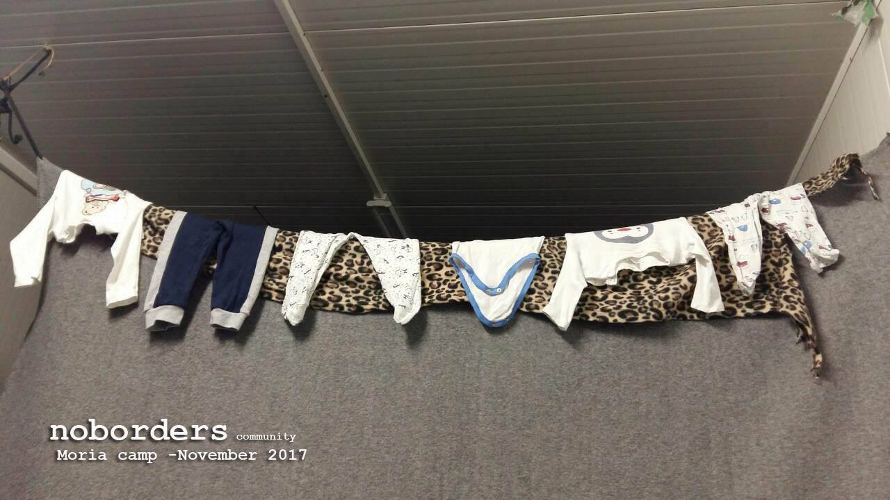
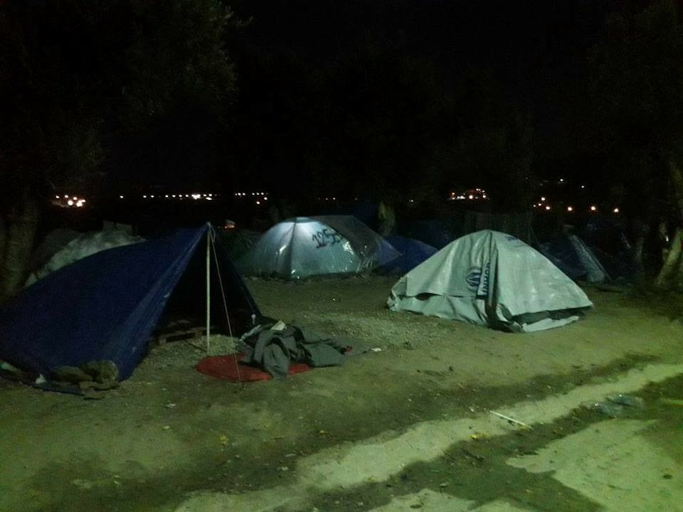
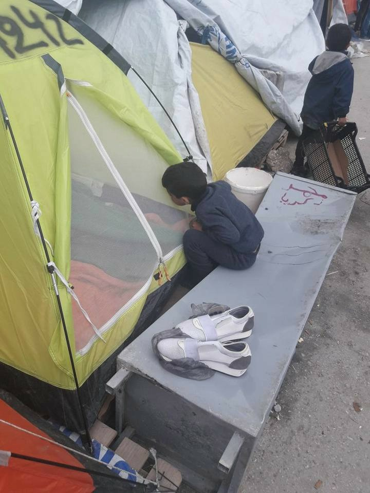
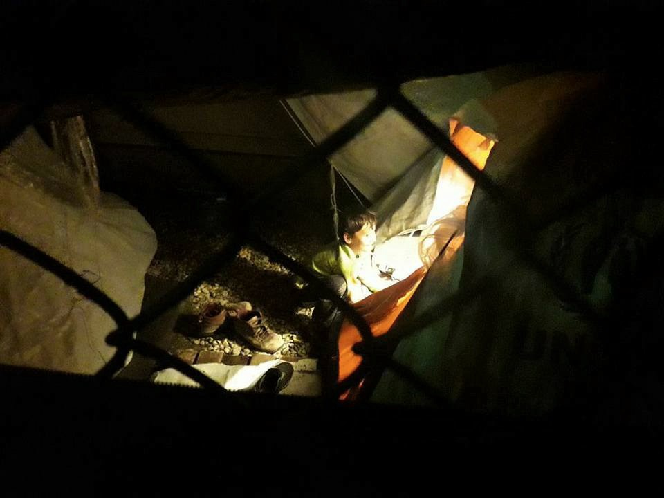
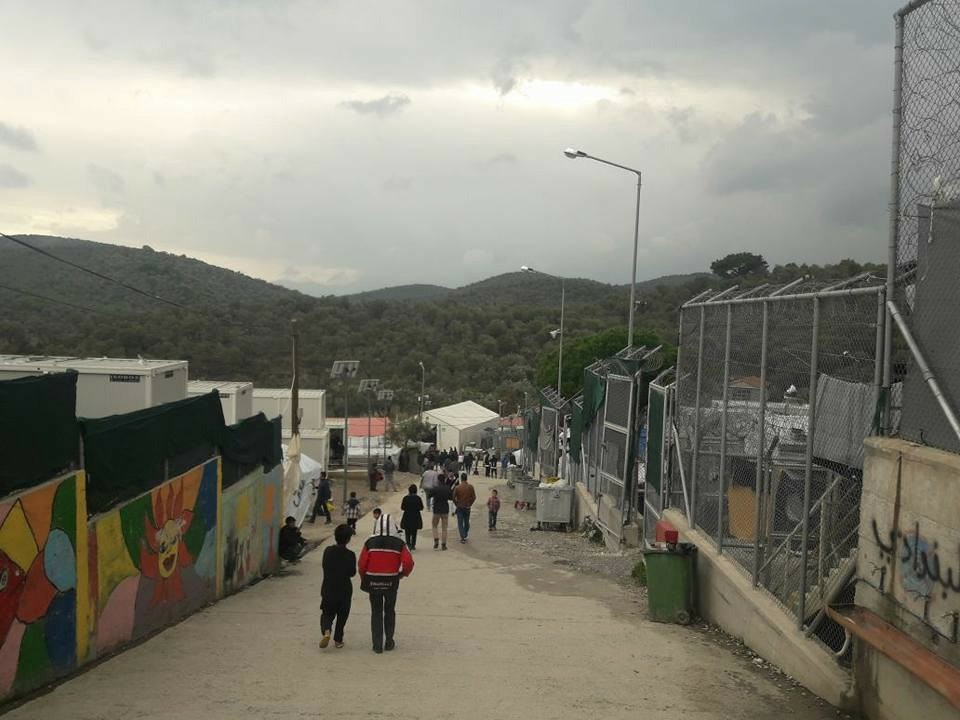
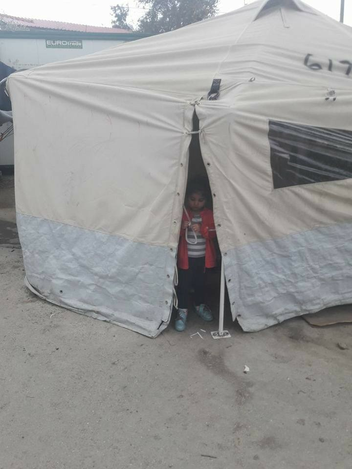
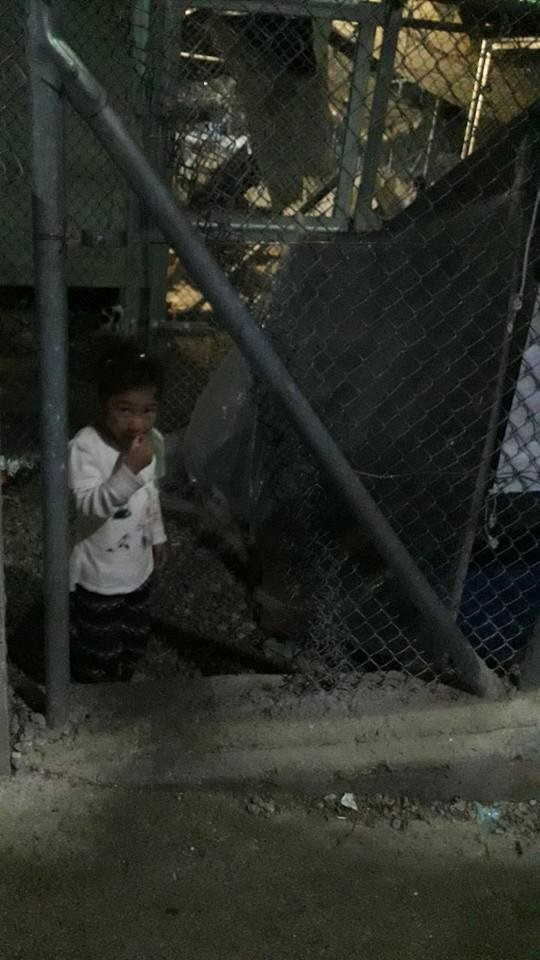
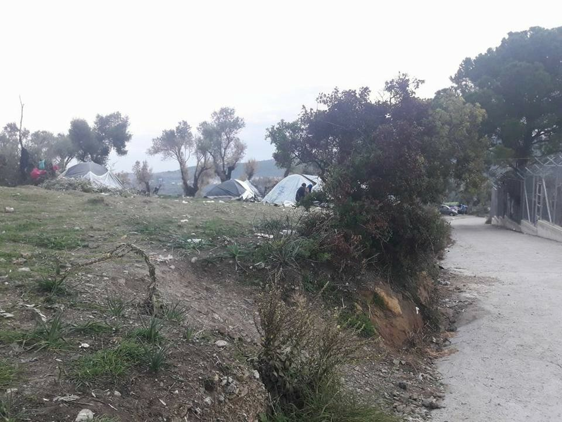
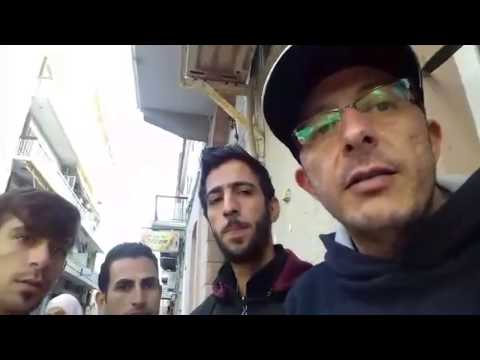

### AYS DAILY DIGEST 5/12/2017: Children of Moria

_Over the last 2 days over 260 people arrived to Greek islands // Deportation to Turkey continue // Number of people in Serbia is increasing // Suicide attempt in Croatia // Help needed in Serbia, Greece, Italy, France…_

No Borders Community
### Feature

Usually, we avoid showing pictures of children, but there is a need to remind all the people that among over 15\.000 who are stranded on the islands, there are children\. Most of them do not go to school and are forced to stay in unbearable living conditions that resemble prison camps, like in Moria\. And the winter is here\.

One of the residents of Moria found a way to send us photos from the camp this week\. This is their story\. \#opentheislands

### Greece

Despite bad weather, boats full of people are still arriving to Greece\. On Tuesday, three boats with 136 people arrived to islands\.

One boat carrying 38 people arrived to Samos in the morning\. The night before, the boat with 19 people arrived\.

At Chios, early in the morning, at 4:00 am, there was one landing with 72 new arrivals, including 27 kids, 18 women, and 27 men\.

On Lesvos, 2 boats arrived, carrying 124 people\.

Over the last two days, 6 boats have arrived on the islands, with a total of 266 people\.

Only 16 days are left until the official start of the winter, and so far no solution for all the people living on the islands exist\. The situation for all the people living in tents and shelters they build for themselves is getting worse\.

Lesvos

Greek government continues with deportations of people\. [No Border Kitchen Lesvos](https://noborderkitchenlesvos.noblogs.org/post/2017/12/05/nigerian-man-deported-despite-serious-health-condition-on-november-30th/) reports about a case of two Nigerian men who were deported despite serious health condition one of them suffers, on November 30th\. A video in their blog post of his deportation, shows that he was not even able to walk on his own when he was brought handcuffed on the ferry\.

He, together with his brother, was detained immediately upon arrival and he stayed in the pre\-removal prison inside the so\-called “Hotspot camp”, Moria for almost three months\. All that time, they were isolated and did not receive adequate legal assistance or support structures\.

> “All refugees from countries with less than 33% acceptance rate \(which are more than 28 countries including Syrian single men\) can currently be detained immediately after their arrival on Lesvos, for the entire duration of their asylum procedure\.” 

While in detention, both brothers got rejected for asylum, two times, under the fast\-track border procedure implemented on the Greek islands since the EU\-Turkey deal, and finally deported back to Turkey by ferry from Mytilene\.

> “They only experienced Europe from behind the barbed wire and blank walls of a detention center, guarded by policemen subject to a constant feeling of isolation and suffering inhuman treatment\.” 

Based on the previous experiences, people deported from Greece to Turkey, remain detained in prison in Turkey after deportation for an unknown period of time\.

Mayors from the islands of Lesvos, Chios, and Samos, met with the Greek Prime Minister and minister of migration in Athens on Tuesday to press the government for action to ease the pressure on their local communities\.

Before the meeting, they said they will demand from the government to speed up the transfer of people from the islands to mainland Greece\.

There are currently more than 15,000 migrants living in state\-run camps in Lesvos, Chios, Samos, Leros, and Kos\. So far, the government did not show the sign they have a plan for this situation\.

■■■■■■■■■■■■■■ 
> **[Eva Cossé](https://twitter.com/Eva_Cosse) @ Twitter Says:** 

> > “We ask someone to come with us, or we don’t wash ourselves.” –15 yr old asylum-seeking 
girl. Stuck on Greek islands, as weather worsens &amp; 17 days before winter starts, w/no access 2 
secure toilet or shower. Gov’t &amp; EU leaders shld #opentheislands [hrw.org/opentheislands](http://www.hrw.org/opentheislands) https://t.co/lRDEdONQ4g 

> **Tweeted at [2017-12-04 15:46:54](https://twitter.com/eva_cosse/status/937709805636149249).** 

■■■■■■■■■■■■■■ 

We keep following the situation on Lesvos with people who were on strike at the main square in Mytiline and arrested for no obvious reason\. [According to the local media](http://www.ekathimerini.com/223876/article/ekathimerini/news/push-to-move-migrants-from-islands-to-mainland) , a court on Lesvos indicted 16 North African migrants after they detained 25 protesters late on Sunday\. Those who were released are minors\.

The protests were going on for over one month in order to make a pressure on the authorities to speed up asylum applications process and transfer to mainland Greece\.

Unlike big organizations or the governments, volunteers do have plans for the winter\. [Refugee Info Bus](https://www.facebook.com/RefugeeInfoBus/?hc_ref=ARTgAk87t3UALznqeVIGHxYAqMjYKemsBtnFitthSvge-P5EhESQ7g4YpVfcIMGskQo&fref=nf) is moving in January to Samos where they plan to continue to assist people with their admissibility interview, providing essential legal and human rights information in people’s native tongues\. At the moment, only Samos Volunteers are present on this islands, and they need help\.

If you can help, please donate [here](https://mydonate.bt.com/charities/refugeeinfobus) \.

The Hero Centre at Chios supports five apartments which have so far been home to 25 people and they want to continue that support until March, at least\.

In order to do that, they need help\.

### Serbia

Officially, on December 3rd, 4,400 refugees, asylum\-seekers and migrants were counted in Serbia, with 4,026 housed in 18 governmental centers\.

Most of the people are coming from Afghanistan \(52%\), Iraq \(14%\) and Syria \(2%\) \. Among them, 34% are children\.
 
UNHCR is registering collective expulsions of people into Serbia\. Last week 98 were pushed back from Romania \(compared to 103 last week\), and 96 from Croatia \(99 weeks before\) \.
 
Last month, 549 persons registered intentions to seek asylum in Serbia, almost all a from Afghanistan \(26%\) \.

Total positive first\-instance decisions by the Asylum Office since the beginning of 2017 thus is 13\.

[No Name Kitchen](https://www.facebook.com/NoNameKitchenBelgrade/posts/436076533457303:0) is still in Sid where hundreds of people are staying in very dare conditions, mostly out in the open\. NNK provide meals and clothing for the people\. This week they have worked to build the room for the guys to come and change clothes in a warm\-ish environment\.

Every day NNK offer clean clothes and collect dirty thing to wash and keep on going\. To keep going with this extremely important work, they need your help\.
### Croatia

Yesterday morning, a young man has threatened to commit suicide in Zagreb reception center Porin by jumping from the building\. Both the firemen and the police intervened\.

Volunteers and refugees claim that the young man refused to go to Ježevo detention center — many refugees are very much afraid of going to Ježevo because of the prison\-like conditions and treatment \(it is a prison\) \. The refugee who threatened to commit suicide if he would be taken to Ježevo, allegedly participated in a fight, although this was not confirmed\.

AYS is especially worried because this would not be the first case of a person who needs psychological and/or medical support, yet he/she is taken to the infamous Ježevo instead\.

[Jesuit Refugee Service for Refugees](https://www.facebook.com/JRSizbjeglice/?hc_ref=ARSJZETlJIc_VLW1r6t48pzjQxN40PjBUEAsnqGhbx7oEpw7rdaLPvjzY1BuAvsk1lg&fref=nf) \(JRS\) plans a Christmas lunch with refugees, inviting local population to join and invite to their home refugees and asylum seekers\.

_“With this act of good will, we show respect for the others, and taking care for those who do need our help\.”_

For people who want to be part of this beautiful initiative, please get in touch with JRS ar [info@jrs\.hr](mailto:info@jrs.hr) or in FB inbox\.
### Italy

According to Oxfam, in the region of Liguria, Ventimiglia area, hundreds of migrants fleeing from wars in Sudan, Iraq, Afghanistan, and Eritrea, live under a highway, along river Roia\.

> “They have often seen their asylum right neglected in Italy, and their goal is to obtain it in France, crossing the border of the so\-called “pass of death”, where they find the French police sending them back though\. In the limbo of the camp along Roia river, there are 200–300 migrants, out of the 700 transiting in the area\. The others live in the Red Cross center\.” 

[So far, the most of the help](http://stream24.ilsole24ore.com/.../l-odissea.../AENpFEND) comes from volunteers in the field\.
### Cyprus

[The 37\-year\-old captain](http://cyprus-mail.com/2017/12/05/syrian-migrants-arrive-boat/) of a boat with 38 migrants on board that was towed into the Kato Pyrgos harbor by a police vessel around 1 am on Tuesday after it was located in the sea nearby was arrested later in the day and is being investigated for people smuggling\.
### Spain

During this year, a number of people arriving to Spain significantly increased, particularly people from the Middle East and Syria\.

Data shows that most Syrians who had reached Spain had not intended to go there\.

The report “From Syria to Spain” by REACH and the Mixed Migration Platform \(MMP\) focuses on the routes chosen by Syrian nationals to reach Spain between 2015 and 2017 and identifies why the country was selected as an entry point into Europe\. Furthermore, it looks at situations and challenges confronted by migrants along these routes\.

France

\#Coat4Calais campaign is still going on\.

> “Over 3,000 refugees are currently sleeping rough in northern France, and temperatures are rapidly dropping\. Some as young as 13, with no access to clean clothes, water or shelter\. So this holiday season our goal is to provide each and every one of these refugees with a warm winter coat\. To do this we URGENTLY need your help\. 
 

> We are asking each of you to look in your cupboards for a winter coat that you no longer wear\.
 

> • Take a picture of yourself holding up this coat and post it on social media with a message such as:
 

> “Show you [@Care4Calais](http://twitter.com/Care4Calais) by donating a coat to a refugee this winter\. Here’s my \#Coat4Calais”
 

> • Donate your coat to our nearest donation point — see: [https://goo\.gl/ULD9dG](https://goo.gl/ULD9dG) 
 

> • If you can’t give a coat, simply visit [https://goo\.gl/scNsbD](https://goo.gl/scNsbD) and buy a coat for a refugee for £25
 

> Let’s keep people warm this winter\!” 

[A guide has been launched in France](http://www.leguidedurefugie.com) to help facilitate the lives of refugees who have been granted asylum there\. The guide, which covers important subjects including identity papers, learning French, housing, health, and employment can be downloaded onto mobile phones and 1,500 printed copies will be distributed across the country\.
### Germany

[German police on Tuesday arrested](http://news.trust.org/item/20171205115803-rmdb4/) an Afghan citizen on suspicion of smuggling migrants by sea from Turkey to Greece\. During the crossing in January 2016, the boat sank and coast guards managed to retrieve 35 bodies from the water, and 24 people were rescued\. More than 90 people were on the boat, and the rest remain missing until today\.

The suspect was arrested in Osnabrueck\. Apparently, before coming to Germany he asked for refugee status in Greece\.
### European Union

The fortress Europe has a plan to fortify its border even more\. Germany, Italy and now even Belgium, plans are increasing security measures for flight passengers arriving from Greece\.

At the airport in Brussels passengers arriving from Greece have to stand in long queues and undergo strict security checks\. They are not considered as members of the Schengen area, but as if they were arriving from third countries\.

> **_We strive to echo correct news from the ground through collaboration and fairness, so let us know if something you read here isn’t right\._** 

> **_If there’s anything you want to share, contact us on Facebook or write to: areyousyrious@gmail\.com\._** 

_Converted [Medium Post](https://areyousyrious.medium.com/ays-daily-digest-5-12-2017-children-of-moria-26b5bf83f03b) by [ZMediumToMarkdown](https://github.com/ZhgChgLi/ZMediumToMarkdown)._
