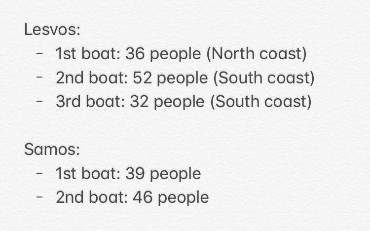
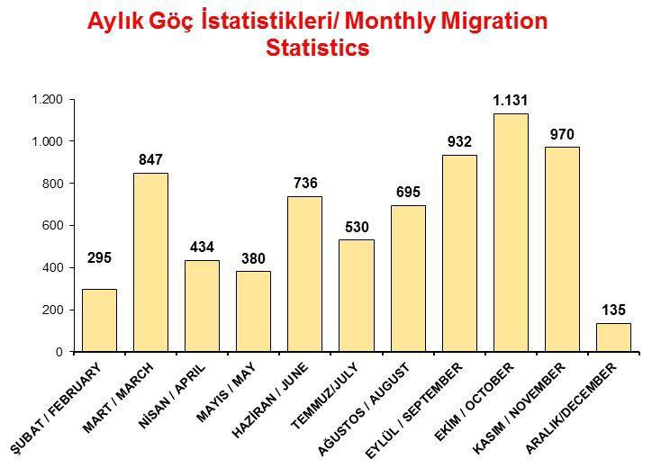
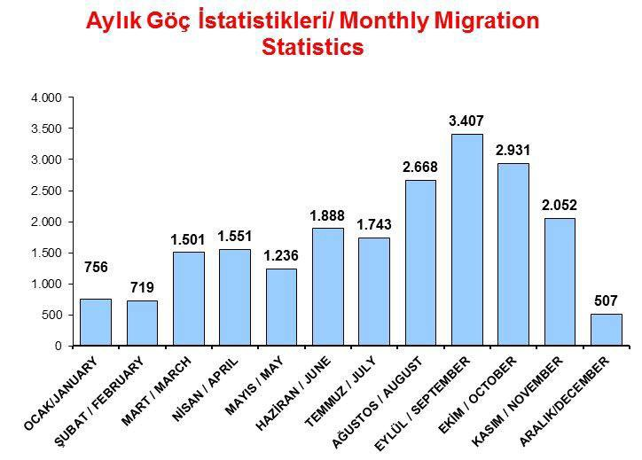
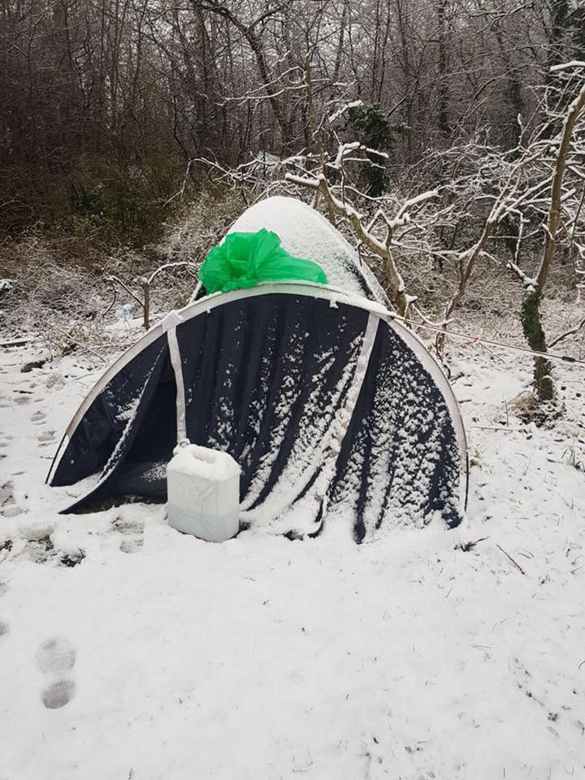
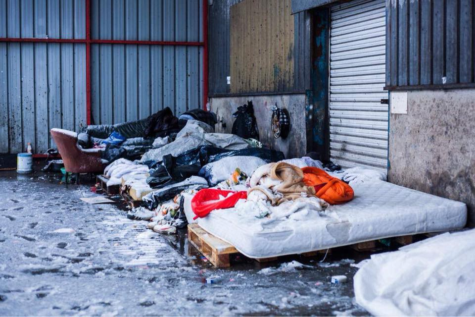
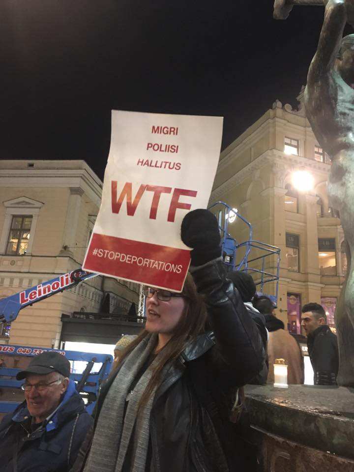

### AYS DAILY DIGEST 11/12/2017: “Militarisation of the route through Europe makes conditions for asylum seekers much worse\.”

_Denmark among the EU countries with the lowest asylum approval rates // What are some of the possible reasons for this status? // Greece and Turkey reached a controversial new deal between, media speculates // Letter for the mayor of Calais // Calls for donations in France and Italy_

](assets/467bf6be9a92/1*WY0FahyrBHEx2w1zIYedLA.jpeg)

Calais, December 2017\. Photo [L’Auberge des Migrants](https://www.facebook.com/AubergeMigrants/?fref=mentions)
### Feature

While the media dedicate most of the space \(if any\) to the living conditions of refugees and migrants in the Balkans, sometimes south of Italy, the situation in the rest of the European countries remains less known to the broader audience\.

One of the countries that are out of the radar for the most of the Europe, at least when it comes to the life of refugees and migrants, is Denmark where only [**26% of asylum applications were successful**](https://www.neweurope.eu/article/denmark-rejects-asylum-applications/) in the second quarter of 2017\. Last year in the same period it was 82%\.

After Bulgaria and Czech Republik, this is one of the lowest asylum approval rates in the European Union\. **Average in EU is 46%** , while Sweden and Germany both accepted 48%\.

While the Denish media are quoting Denmark’s immigration services saying that the cause is “a high number of applications from Iranian, Afghan and stateless seekers”, it can be argued that hate propaganda and ultra\-right politics did have influence\.

The far\-right Dansk Folkeparti celebrated this development, asking for even tighter immigration laws\.

Figures by [refugee\.dk](http://refugees.dk/en/news/2016/august/very-few-new-asylum-seekers-arrive-in-denmark/) are showing that **during the first 9 months of this year, only 2,597 people have applied for asylum in Denmark** , and 1,742 cases have been opened\. **It is the lowest number in 6 years** \.

In August this year, Refugees\.dr [published an article](http://refugees.dk/en/news/2016/august/very-few-new-asylum-seekers-arrive-in-denmark/) asking Martin Lemberg\-Pedersen, Professor at Global Refugee Studies, Aalborg University, to comment on decrees in asylum claims in Denmark, but also in other EU countries\.

Lemberg\-Pedersen stressed that the “militarization of the route through Europe, which NATO and Frontex have been summoned to perform, is making conditions for asylum seekers and NGOs much worse”\.

> “There are many cases of harassment from the police, and the Balkan route itself has partly been pushed into the hands of the mafia\. The difference is mainly that the majority of the refugee flow in 2015 literally was followed by the camera lenses, while the current escape through Serbia, Bulgaria etc\. have been forced underground, into irregularity and crime\. More and more information also points to a growing Egyptian\-Italian route for boat refugees, supposed to be a safer alternative to the dangerous Libya\-route\.” 

At the moment, approximately 65 people arrive to Denmark every week\.

Most of the people seeking asylum in Denmark are from Syria, Iran, Eritrea, Morocco, Afghanistan\.

According to the [date of the same organization](http://refugees.dk/en/facts/numbers-and-statistics/how-many-are-coming-and-from-where/) , people trying to travel from Italy, across Austria, and north towards Germany and Scandinavia, are now being stopped at the Brenner Pass, the Alpine border between Italy and Austria\.

> “Since August 2017 about 1,000 migrants are stopped and returned every month by Austrian military, while Italian police have also upgraded the control of passenger ships to the north\. In the fall of 2017, a few hundred also tried to sail to the Mangalia harbor in Romania via the old and dangerous route over the Black Sea\.” 

This year, the [NGO European Network Against Racism \(ENAR\)](http://www.enar-eu.org/Racism-plays-a-key-role-in-migrants-exclusion-and-violations-of-rights-in-the) issued the report stating that “anti\-migrant political discourses and exclusionary migration policies are having a disproportionate and harmful impact on migrants, including in Denmark”\.

The report covers 26 EU countries but gives examples of anti\-migrant discourse from Denmark\. One of the examples from 2015 is the advertisements placed by immigration minister Inger Støjberg in Lebanese newspapers telling refugees not to come to Denmark\.

But they also mention significant cuts to social benefits for refugees by up to 50%, with the purpose of making Denmark less attractive for refugees\.

“Foreigners’ retirement pension and child benefits have also been changed\. This means that access to social benefits is now dependent on the length of residence in Denmark,” says the report\.
### Greece

More people arrived today by boats to Greece\.

Transfer to the mainland from overcrowded islands continues slowly\. According to the official figures, over 3,500 persons were transferred to the mainland between October and November, and more will be transferred soon\.

Today the German Foreign Ministry announced that it will not provide additional winter assistance to refugees on the Aegean islands\. German foreign ministry explained this decision saying that “responsibility for accommodating and feeding refugees falls under the jurisdiction of each country,” dpa reports\.

Turkey continues intercepting people who are trying to cross\. Here are some statistics on a number of interceptions\.

More trouble on sight\. [The media are speculating](http://www.keeptalkinggreece.com/2017/12/11/greece-turkey-germany-refugees-migrants/) that Greece has persuaded Turkey to accept returns from the mainland in order to reduce critical overcrowding in its refugee camps\.

This information leaked after the two\-day state visit by Turkish President Recep Tayyip Erdogan\. However, Greek Prime Minister Alexis Tsipras’ office did not respond to media requests for comment on the report and there is no reaction from Brussels\.

HELP IF YOU CAN

[Zaatar’s Orange House](https://www.facebook.com/zaatarngo/) in Athens is in great need of volunteers\! \!

Candidates need to be willing to commit for a minimum of 2 weeks and should have the contextual understanding of the “crisis”\. Relevant languages \(Arabic, Farsi, French, etc\. \) are a huge plus\. Interested potential volunteers can email [volunteer@zaatarngo\.org](mailto:volunteer@zaatarngo.org) or can visit their facebook page\!

ITALY

More people are arriving in Italy, too\. On Monday, nearly 900 people who were rescued in Mediterranean off the coast of Libya in the past few days arrived in Sicily\. Among them one woman about to give birth\.

“Testimonies gathered Sunday aboard the Aquarius reflect the extreme gravity of the situation in Libya for migrants and refugees, who lacking a safer alternative, risk their lives at sea to escape what they call the Libyan hell,” said Francis Vallat, the SOS Mediterranee president in France\.

xx

[Signs are being posted](http://torino.repubblica.it/cronaca/2017/12/11/news/neve_in_valsusa_un_cartello_per_salvare_la_vita_ai_migranti_diretti_in_francia_non_valicate_le_montagne_morirete_-183751360/) near the border area between Italy and France warning people not to cross over the mountains, especially given the weather conditions, a lot of people get stuck at 2000 meters in heavy snow\.

SERBIA

[Refugee Aid Serbia](https://www.facebook.com/refugeeaidserbia/posts/1964494103873772) needs volunteers this Friday, the 15th, at 10 am to come and help they re\-organize their warehouse for the coming winter\.

> “We will meet outside the warehouse at Karadjordjeva 65 at 10 am\. Please remember to bring your passports\. There will be free coffee and tea\! Please send a message to [starz\.robertson\.ras@gmail\.com](mailto:starz.robertson.ras@gmail.com) if you can make it\.” 

FRANCE

L’Auberge des Migrants group reports that the Sub\-Prefecture of Calais has announced the opening of the “great cold” premises, after the campaign when people were called to sent a message to the prefect of the Pas\-de\-Calais\.

If you have not done so, they suggest you send this:

> “Finally, the premises planned in Calais to shelter the homeless under the cold plan are open\. For all these men, these women, these children, it is essential that they stay open this winter, and that the authorities coordinate with associations to organize dignified living conditions “ 

Send, if you agree with this message, to 
[pref\-communication@pas\-de\-calais\.gouv\.fr](mailto:pref-communication@pas-de-calais.gouv.fr) 
 
[Care4Calais](http://www.care4calais.org) continues to distribute winter coats and waterproof sleeping bag covers in Calais\.

“Temperatures dropped and the snow was driving but still people queued in the freezing cold to get these essential items\. The night before we took some refugees out for dinner\. We heard stories of homes torn apart by war and childhood spent without the education that we take for granted\. They explained the urgent need for escape that was accompanied by the pain of leaving home\.”

[Help is needed in Paris](https://www.facebook.com/PRGS.team/) \.
- Popup tents 
\-Thick blankets 
\(I don’t need to say sleeping bags as they are coming\)
\-Tarpaulins/massive rolls of polythene\.
\-emergency blankets 
\-Rain ponchos 
\-Shoes and Boots \(we have completely run out of size 41\) 
\-winter jackets 
\-trousers/jeans size 28 to 32
\-Hats/gloves/scarves\.
\-underwear \(s/m\)
\-Thick socks
\-Thermal underwear

[Refugee Community Kitchen](https://www.facebook.com/refugeeCkitchen/videos/1983528091664551/) is feeling cold in Calais\.

At least 1000 people are living rough in northern France in this freezing wet weather\.
Many nights whatever protection \(tents, sleeping bags, blankets, etc\. \) from the cold they have is destroyed by the French authorities\.
We’re cooking extra hard and our distribution teams and sister groups L’Auberge des Migrants, Help Refugees and Utopia 56 are out doing hypothermia checks and giving whatever support they can\.
Want to help? Please share & donate \-> refugeecommunitykitchen\.com

Snow in Dunkirk and donations needed

Dunkirk / Dunkerque Refugee Women’s Centre

“Families who have survived violence, years of war and treacherous journeys are arriving every day and we are now running out of options to keep them warm\.
Families need immediate access to warm and dry shelter, just £30 \(€34\) could pay for one night in a hotel for one family\.
This short\-term solution will prevent more unnecessary loss of life, particularly as children are more susceptible to hypothermia in freezing temperatures\. Please help us get shelter for these people who have so much to offer the world by donating through the following link:
[https://mydonate\.bt\.com/donation/start\.html?event=450804](https://mydonate.bt.com/donation/start.html?event=450804)

Finland

GENERAL

[The Guardian](https://www.theguardian.com/world/2017/dec/11/eu-may-scrap-refugee-quota-scheme-donald-tusk) published today that the EU “could scrap a divisive scheme that compels member states to accept quotas of refugees”\. They write that the president of the European Council, Donald Tusk, will tell that to EU leaders at a summit on Thursday “in a clear sign that he is ready to abandon the policy that has created bitter splits across the continent\.”

Apparently, he will ask the EU leaders to set a six months deadline “to reach unanimous agreement on reforms to the European asylum system”\.

He will also urge EU leaders “to spend more on schemes aimed at keeping refugees and would\-be migrants outside Europe, such as €3bn for Syrian refugees in Turkey and the €1\.9bn EU Africa trust fund\.”

The number of families being separated by conflict, violence and natural disaster is at a five year high according to data from the [International Committee of the Red Cross \(ICRC\)](https://www.icrc.org/en/document/number-families-separated-conflict-violence-or-natural-disaster-five-year-high-says) \.

New cases of relatives contacting the organization looking to reunite with loved ones have increased by almost 90% over this period \(2012–2016\) with 18,000 new cases opened last year alone\.

However, the ICRC warns that this is just the tip of the iceberg, with a lack of accurate data collection meaning the number of families torn apart is likely to be much higher\.

> **_We strive to echo correct news from the ground through collaboration and fairness\._** 

> **_Every effort has been made to credit organizations and individuals with regard to the supply of information, video, and photo material \(in cases where the source wanted to be accredited\) \. Please notify us regarding corrections\._** 

> **_If there’s anything you want to share or comment, contact us through Facebook or write to: areyousyrious@gmail\.com\._** 

_Converted [Medium Post](https://areyousyrious.medium.com/ays-daily-digest-11-12-2017-militarisation-of-the-route-through-europe-makes-conditions-for-467bf6be9a92) by [ZMediumToMarkdown](https://github.com/ZhgChgLi/ZMediumToMarkdown)._
