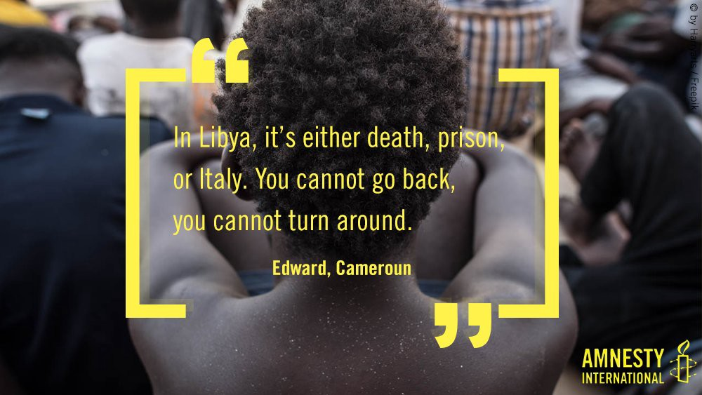
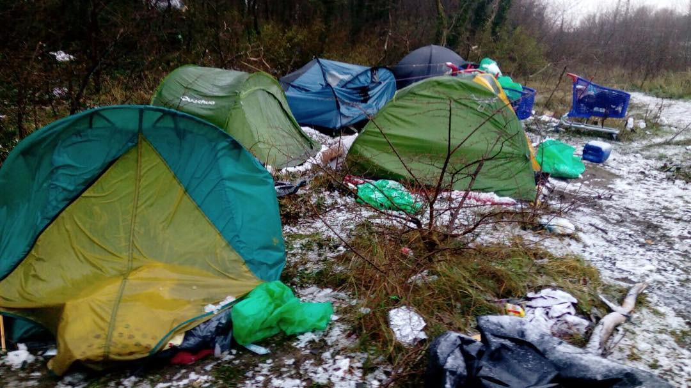

### AYS Daily Digest 12/12/17: “Europe — complicit in crime”
#### Amnesty International openly calls out EU states as part of the Libyan problem / Hard to get passports in Turkey / Asylum law changes in Greece / Italian organizations on poor state of help for minors / ECHR rules against Bulgaria for inhuman and degrading treatment / extreme weather calls for more help across Europe / more info, updates and news\. \.

#### FEATURE

19,452 people have so far in 2017 been intercepted by the coast guard, taken back to Libya and immediately transferred to detention centres\. This has been an immediate reaction of the European states that have decided to reinforce the capacity of Libyan authorities to intercept refugees and migrants at sea and transfer them back to Libya and to detention centres\.

■■■■■■■■■■■■■■ 
> **[SOS MEDITERRANEE France](https://twitter.com/SOSMedFrance) @ Twitter Says:** 

> > "On faisait tout pour essayer de sortir de la prison en #Libye (...) mais ils nous ont attrapés sur les grillages, ils nous ont frappés, je me suis évanoui, je vomissais du sang. Je n’ai plus jamais osé tenter la fuite, mais je n’avais plus peur de rien, j’étais déjà mort" https://t.co/xA6pE2Xccz 

> **Tweeted at [2017-12-12 06:48:56](https://twitter.com/sosmedfrance/status/940473525093138432).** 

■■■■■■■■■■■■■■ 

416,556 people were identified by IOM in Libya earlier this September, more than 60% of people fled Sub\-Saharan African countries\.

The case of an Italian ship, that had been donated to the Libyan coast guard, taking part in criminal actions against the people on board and the SAR vessels near by was the first time that a boat provided by a European government has been proven to have been used in such an incident\. UK has been previously warned about the support they gave to the Libyan CG:

> Ministers have been warned time and time again that the UK’s funding of the Libyan Coast Guard means the UK is supporting the depraved abuse and exploitation of thousands of refugees and migrants in Libya\. _— AI UK_ 

However, the reported and documented abuse at detention centres is merely part of a wider network of exploitation, paired with CG and officials’ corruption and cooperation with human smugglers\. The EU has not reacted properly to these serious breaches of human rights, as reported earlier on\.

They have instead increased funding for detained migrants and suposedly improved conditions after reports of abuses and [migrants being sold into slavery\.](http://m.dw.com/en/slave-trade-in-libya-outrage-across-africa/a-41486013) 
They also tried to speed up the repatriations from Libya to the countries of origin\.

Today, in their report [_‘Libya’s dark web of collusion’_](https://www.amnesty.org/en/documents/mde19/7561/2017/en/) Amnesty International explained how **European governments actively support a system of abuse** of refugees and migrants by the Libyan Coast Guard, the detention authorities in Libyan and smugglers operating in the country\.

■■■■■■■■■■■■■■ 
> **[Amnesty International](https://twitter.com/amnesty) @ Twitter Says:** 

> > Tortured. Raped. Sold. 

Rescued? No.

This is the real face of the horrific EU deal with #Libya → [amn.st/6016DGJLg](http://amn.st/6016DGJLg) https://t.co/76pnAtwQfi 

> **Tweeted at [2017-12-12 08:50:48](https://twitter.com/amnesty/status/940504193865076736).** 

■■■■■■■■■■■■■■ 

■■■■■■■■■■■■■■ 
> **[Jeff Crisp](https://twitter.com/JFCrisp) @ Twitter Says:** 

> > Not "turned a blind eye" The EU is directly implicated in these abuses. [twitter.com/AP/status/9403…](https://twitter.com/AP/status/940365554912780290) 

> **Tweeted at [2017-12-12 07:11:20](https://twitter.com/jfcrisp/status/940479161440890881).** 

■■■■■■■■■■■■■■ 

#### TURKEY

■■■■■■■■■■■■■■ 
> **[SARwatchMED](https://twitter.com/SARwatchMED) @ Twitter Says:** 

> > #TurkishCoastGuard stats: 41 boats with 1976 people intercepted in November in the #AegeanSea. A further 457 people were intercepted in the first 10 days of December, 268 on Thursday alone. [sahilguvenlik.gov.tr/baskanliklar/h…](http://www.sahilguvenlik.gov.tr/baskanliklar/harekat/faaliyet_istatistikleri/duzensiz_goc_istatistikleri_ege.html) https://t.co/Qk39gGoo38 

> **Tweeted at [2017-12-10 20:55:22](https://twitter.com/sarwatchmed/status/939961763759624192).** 

■■■■■■■■■■■■■■ 

### Difficulty to get passports

Due to the high number of Syrian refugees in Turkey, it is incredibly difficult to secure an appointment for a passport through official channels\. The procedure also takes a long time and is very costly [InfoMigrants reports](https://l.facebook.com/l.php?u=http%3A%2F%2Fwww.infomigrants.net%2Fen%2Fpost%2F6535%2Fharsh-challenges-for-syrians-renewing-passports-in-turkey&h=ATNacbCvSH8Yc5lwfyyrYcFBERycfiNXK7bIQujmSqrxaC4OMf4VqYVeeRKU84gM3rivx8wYFb_pejYASrXsltROIwBzSXBBaqUw8QpYrUYyeHH7h2aaapOQ4F8kWHcA4inKRWPRaWpuoMDAqegNykMcK_0Tauu6f2rMsc5amz7Brz7MLP7kt8bAJvQwbYADVbgBqNk5lVZdPwf6k5UxB0I6XLGau0BQb1Ie2WzJIakfU8LmoMHKuF3JGwE1v3t20hcTletQr0K5x6qSd8cslTbTKA) \.
### EU pitches in for cash cards

EU has released aid funds through two new projects in an attempt to “show solidarity with Turkey” that officially hosts over 3\.4 million refugees\.
They have announced in a [press release](http://europa.eu/rapid/press-release_IP-17-5204_en.htm) that the planned €650 million goes to the Emergency Social Safety Net which is implemented by the World Food Programme\. A further €50 million will boost the Conditional Cash Transfer for Education \(CCTE\) project implemented by UNICEF\.

■■■■■■■■■■■■■■ 
> **[IOM - UN Migration 🇺🇳](https://twitter.com/UNmigration) @ Twitter Says:** 

> > Breaking: 166,143 #migrants & #refugees arrived by sea to Europe. 

3,091 dead/missing ➡️ [missingmigrants.iom.int](http://missingmigrants.iom.int) https://t.co/A4fFfPe4ag 

> **Tweeted at [2017-12-12 09:43:23](https://twitter.com/unmigration/status/940517428693471233).** 

■■■■■■■■■■■■■■ 

#### EU
### Anti\-European European Council President

In a paper issued earlier, the president of the European Council, Polish Donald Tusk, has stated that the mandatory quotas, as proposed by the commission under broader asylum reforms, are both “highly divisive” and “turned out to be ineffective\.” The large discrepancy in respect to the aimed results of the so called quota system, as a part of the relocation scheme, has led the 2\-year project to end with the Commission taking Hungary, Poland and Czech Republic to the court in Luxembourg\.

Now, the EU migration commissioner very clearly said in his statement in Strasbourg that accepting such a stance would undermine “one of the main pillars of the European project, the principal of solidarity”\.
He also stated that the [note put forward by Tusk](http://www.consilium.europa.eu//media/32083/en_leaders-agenda-note-on-migration_.pdf) ahead of an EU summit is — anti\-European\.
#### GREECE
#### Arrivals

28 people arrived on a boat to Samos, while a boat arrived to the south coast of Lesvos carrying 63 people\.

■■■■■■■■■■■■■■ 
> **[MSF Sea](https://twitter.com/MSF_Sea) @ Twitter Says:** 

> > #EU and #Greek authorities seem to believe that by trapping people in awful conditions they will deter other refugees from coming. #People continue to risk their lives in the #Aegean sea every day. These cruel policies have to stop. #opentheislands https://t.co/h30x9ioN40 

> **Tweeted at [2017-12-11 11:03:41](https://twitter.com/msf_sea/status/940175249898958854).** 

■■■■■■■■■■■■■■ 

■■■■■■■■■■■■■■ 
> **[Michael Räber](https://twitter.com/iwatnew) @ Twitter Says:** 

> > Transfer of #refugeesGr ppl from #EU camps on greek islands to mainland last week: 1524 people in total. #Lesvos 833 people. #Chios 300 people. #Samos 176 people, other islands 215 people. Many thousands remain in horrible conditions. #humanrights  #EUTurkeyDeal #opentheislandsِ https://t.co/gl2vtbfqSw 

> **Tweeted at [2017-12-11 23:46:31](https://twitter.com/iwatnew/status/940367220517015552).** 

■■■■■■■■■■■■■■ 

As the anxiety is growing over the talks of a possible surge of returning people to Turkey, some recent events go to support that, but in other ways than one\. [Reportedly](http://www.real.gr/DefaultArthro.aspx?page=arthro&id=650478&catID=1) , Greece seems to have come to new decisions regarding the asylum law\. They have reduced the number of steps in the asylum procedure from four stages and approximately a year time to sixty days, thus possibly also facilitating quicker deportation\. 
Minister Mouzalas has met in Athens with Dimitris Avramopoulos, while on Thursday he will travel to Brussels to the summit\.
### Lesvos: “Green light” for the containers from mainland

Official Lesvos has accepted to have 50 shipping container homes intended for the migrant reception and processing center of Moria delivered\. Greek Minister of state has [reportedly](http://www.ekathimerini.com/224102/article/ekathimerini/news/lesvos-allows-prefabricated-refugee-homes-to-be-delivered) previously written the mayor to assure him the containers will not be used to host new people and create a new camp, but “only to accommodate refugees staying in tents in Moria\.”

■■■■■■■■■■■■■■ 
> **[MSF Sea](https://twitter.com/MSF_Sea) @ Twitter Says:** 

> > Many of the #people who arrive on the #Greek islands are in good health and get sick when they spend time in inhumane conditions in places like #Moria. It's time to stop these cruel containment policies. #OpenTheIslands https://t.co/nw810t12nf 

> **Tweeted at [2017-12-12 13:24:41](https://twitter.com/msf_sea/status/940573119269560320).** 

■■■■■■■■■■■■■■ 

### NGOs issue a report calling for common better solutions in Greece

More than 2,000 unaccompanied children are on the waiting list for safe shelters in Greece, according to a new report by 12 organisations\. The chronic shortage of accommodation for children is just one of the gaps in services that is worsening as the Greek Government prepares to take full control of the refugee response\.
In the report, they also call out the UNHCR, inviting them to be more vocal and take a stand against the policies and practices being implemented in Greece that reduce standards and minimize safeguards in the reception, asylum and returns procedures\.

The report, _Transitioning to a government\-run refugee and migrant response in Greece: A joint NGO roadmap for more fair and humane policies_ , was jointly written with input from the following organisations: ActionAid, CARE, Caritas Greece, Danish Refugee Council \(DRC\), Greek Helsinki Monitor, HIAS, International Rescue Committee \(IRC\), JRS, Oxfam, SolidarityNow, Spanish Commission for Refugees \(CEAR\) and Terre des hommes\.
### Lefteria to the 35 arested in Moria

On Wednesday, December 13, the Court Council will examine the extension of the detention of the 30 migrants currently in diffenet prisons in the country\. A ex officio process due to the completion of the first six months of their detention next month\.

A large groups of supporters expressed their solidarity with persecuted African refugees and they demand the lifting of their provisional detention and their discharge from the accusations\.

> At the same time, we declare that the demonstration held in Moria was fair and necessary\. No one can demand refugees or immigrants who have suffered misery in their countries of origin due to the wars and extreme poverty of the imperialist policies of the West, bend their heads and accept their unjust long\-term incarceration unhappily\. Below, under conditions of degrading and inhuman treatment, in the context of the deterrence policies adopted jointly by the EU and the Greek government, which maintains the same anti\-refugee / anti\-immigration stance as its predecessors\. 

Read the entire statement [here\.](http://diktiospartakos.blogspot.hr/2017/12/35.html?m=1)
### Katsikas

“Yesterday we were informed that Katsikas will be operational from Monday 18 November\.

**](assets/56e4cea4f995/1*o79ShaH_SQ-HURs5ZOAuJw.jpeg)

**Photo: [Refugee Support Europe](https://www.facebook.com/RefugeeSupportEurope/)**

We are to expect 150 arrivals a day for Monday, Tuesday and Wednesday\.
The new arrivals will be coming from the Islands\.
 With this large influx of people over a very short period of time extra volunteers would certainly help us to make sure we can service everyone’s needs\. If you have time to spare between now and the New Year please contact us either via our website or emailing info@refugeesupport\.eu”
**—** [Refugee Support Europe](https://www.facebook.com/RefugeeSupportEurope/?hc_ref=ARQ1P1CZIlKHROVoiEQ9O4J-uk0aZPbe8Tf2iI-9ZGfWFciOYtnsDM0xMd8w43JdTLs)

[T](https://www.facebook.com/RefugeeSupportEurope/?hc_ref=ARTy3uf0lMa0rkJvOr2Hl8QDk0xj7WUCYwQol2zSORQY2UO-6r3hQXK1uZ9ott9hCWY&fref=nf) hey also remind everyone that diapers are among the most needed items in the long list of needs on the field\.
#### BULGARIA

European Court of Human Rights \(ECHR\) has published a [press release](http://statewatch.org/news/2017/dec/bg-echr-sf-others-pr-12-17.pdf) regarding its [ruling](http://statewatch.org/news/2017/dec/bg-echr-sf-others-judgment-12-17.pdf) \(from 7 December 2017\) against Bulgaria a violation of Article 3 \(inhuman and degrading treatment\) concerning a family with its three children during their detainment in 2015\.

> \(…\) the applicants complained in particular about the conditions in which the three minors — then aged 16, 11 and one and a half years — had been kept in the detention facility in [Vidin](https://en.wikipedia.org/wiki/Vidin) \. Submitting a video recording, the applicants alleged in particular that the cell in which they had been held had been extremely run\-down, with dirty and worn out bunk beds, mattresses and bed linen as well as litter and damp cardboard on the floor; and that, as there had been no toilet in the cell, they had had to urinate on the floor\. They also complained that the authorities had failed to provide them with food and drink for the first 24 hours of their custody and that the baby bottle and milk of the youngest child had been taken away upon their arrival at the facility and only given to the mother 19 hours later\. 

#### ITALY

_Over the past few days we have experienced extreme weather conditions…… 50 hours of torrential downpours and incredibly strong winds\. The situation at the farm was touch and go last night, the wind threatening to take away people’s tents and the roof of the kitchen\! We were snugly tucked away in our van with the burner on — towels down to soak up the steady stream of water coming in through the bottom of the door\! \(…\)_

_Regarding the guys living under the bridge…\. the rain got so bad that the authorities decided to open the damn to let the water from the mountains rush through the city…\. \. meters away from the home of more than 200 men\. They were given shelter in the train station but most left before the morning when the rain subsided because they were fearful of deportation\. News from today is that all their blankets, sleeping bags and mattresses are wet and shoes and socks are in high demand\._ — [SolidariTea](https://www.facebook.com/refugeesolidaritea/?ref=gs&fref=gs&hc_location=group_dialog) at Ventimiglia
### Increasingly dramatic and worrying conditions of minors who arrive from Libya to Sicily

[Terre des Hommes Italia](https://www.facebook.com/terredeshommesitalia/?ref=gs&fref=gs&hc_location=group) says that a real protection of unaccompanied refugee minors is still far from being realized\.
Hypothermia, hypoglicemia, unconsciousness, malnutrition, burns, signs of violence and torture, … many evident proofs of suffering of migrants arriving from Libya, including the smallest among them, all go to support claims that the situation there has become unbearable\. Read more on the situation [here](http://bit.ly/2jQJwuX) \.

![“Transnational mobilization for the rights of migrants and against fascism\.
 Gorizia is by its nature a crossing point in the centre of a common territory, which was always, and is nowadays more than ever, transnational, multilingual and multicultural\. It is not a coincidence that diverse nations in this city stood together to stop the rise of Nazi after the fall of the Fascism in September 1943\. For the same reasons, Gorizia is also under constant pressure of nationalisms, of racism and fascism\. A hundred years ago in its surrounding area there used to be the most bloody battles of the First World War, which left hatred and false divisions behind\.
 In the past weeks this contrast was evident as never before: we could witness the civil war of institutions against the migrants who found shelter in the Bombi gallery — the gallery that years ago used to be a shelter for people during Second World War bombardments\. This gallery is a symbol and a proof of the past and actual Fascism\. A proof that can be summed up in one word: INHUMANITY\.
 IT IS INHUMAN:
 neglecting the hygienic minimum and even water to whom has no place to go to,
 forcing hundreds of people to sleep in makeshift shelters;
 in the depths of winter preventing an access to a few shelters, which protect from rain and snow;
 transforming the person who comes from somewhere else into an object of miserable political campaigns, stirring up xenophobia and intolerance\.
 This inhumanity has already many faces and too many responsibilities\. On the one hand, we can notice an obvious inhumanity, claimed by the mayors of Gorizia and Pordenone and their councils — among the members of the councils there are persons who have no problem sharing the table with whom openly praises Fascism\. On the other hand it is also true that the tragic situation of the migrants in Italy, Europe and African countries facing the Mediterranean, is a result of precise choices\.
 IT IS INHUMAN:
 externalizing the control of migration flows and national borders as the European Union does;
 the Italian Government’s deals with Libyan criminal militia, that practices slavery;
 the exploitation of migrants and the idea that someone can migrate only if he/she sacrifices his/her personal freedom and life itself;
 the criminalization of those who offer first aid to migrants, on the sea and land;
 the Dublin agreement and the pervert bureaucratic mechanisms asylum seekers are bound to;
 the false welcome actions, based on the principles of security, and the permission to application of them to private institutions that follow profits, or to volunteers, that are taking the risk of becoming instrument of control and blackmail;
 the use of administrative detention and imprisonment for those who don’t have personal identification documents;
 the exploitation and the denial of migrant labor rights as a feature of European labor policies;
 the economic exploitation by the European Union countries of the territories from which the migrants come;
 the military interventions and sale of weapons by the European Union countries, which perpetuate a state of permanent war in the countries from which migrants are forced to escape\.
 From Gorizia we can and we want to start renewing the idea of humanity, reconstruct the concepts of hospitality, mutualism, mutual recognition and universal equality\.
 FOR US IS HUMAN:
 rejecting and fighting any kind of war between the poor, and the inhuman idea that the poorest and weakest are the ones to pay the cost of a crazy development system;
 guaranteeing a suitable welcome, that is not only guaranteeing secure and easily accessible places, but also places integrated with the territory, which allow real mutual awareness and the approach of autonomy, identity and individual integrity of everyone;
 opposing ourselves to the opening of detention centres and fighting for the closure of the existing ones;
 unveiling that there is no “immigration emergency”, and that migrations are a structural phenomenon of human history, very extended in an irreversibly globalised world;
 understanding that this phenomenon can only be tackled by involving and including migrants in the decisions and routes that are related to them;
 learning to change through mutual recognition, all of us, HUMAN BEINGS, BORN EQUAL ON THE ONE AND UNIQUE PLANET\.
 To reaffirm these principles of universal humanity, in Gorizia we are starting a common transnational fight with common mobilization, which starts on the border crossing Casa Rossa/Rožna dolina, on Saturday, 16 December at 15 h\.” — [Rete Solidale Pordenone](https://www.facebook.com/retesolidalepn/)](assets/56e4cea4f995/1*wGdC9q0rP8mBuecTEdBmLg.jpeg)

“Transnational mobilization for the rights of migrants and against fascism\.
 Gorizia is by its nature a crossing point in the centre of a common territory, which was always, and is nowadays more than ever, transnational, multilingual and multicultural\. It is not a coincidence that diverse nations in this city stood together to stop the rise of Nazi after the fall of the Fascism in September 1943\. For the same reasons, Gorizia is also under constant pressure of nationalisms, of racism and fascism\. A hundred years ago in its surrounding area there used to be the most bloody battles of the First World War, which left hatred and false divisions behind\.
 In the past weeks this contrast was evident as never before: we could witness the civil war of institutions against the migrants who found shelter in the Bombi gallery — the gallery that years ago used to be a shelter for people during Second World War bombardments\. This gallery is a symbol and a proof of the past and actual Fascism\. A proof that can be summed up in one word: INHUMANITY\.
 IT IS INHUMAN:
 neglecting the hygienic minimum and even water to whom has no place to go to,
 forcing hundreds of people to sleep in makeshift shelters;
 in the depths of winter preventing an access to a few shelters, which protect from rain and snow;
 transforming the person who comes from somewhere else into an object of miserable political campaigns, stirring up xenophobia and intolerance\.
 This inhumanity has already many faces and too many responsibilities\. On the one hand, we can notice an obvious inhumanity, claimed by the mayors of Gorizia and Pordenone and their councils — among the members of the councils there are persons who have no problem sharing the table with whom openly praises Fascism\. On the other hand it is also true that the tragic situation of the migrants in Italy, Europe and African countries facing the Mediterranean, is a result of precise choices\.
 IT IS INHUMAN:
 externalizing the control of migration flows and national borders as the European Union does;
 the Italian Government’s deals with Libyan criminal militia, that practices slavery;
 the exploitation of migrants and the idea that someone can migrate only if he/she sacrifices his/her personal freedom and life itself;
 the criminalization of those who offer first aid to migrants, on the sea and land;
 the Dublin agreement and the pervert bureaucratic mechanisms asylum seekers are bound to;
 the false welcome actions, based on the principles of security, and the permission to application of them to private institutions that follow profits, or to volunteers, that are taking the risk of becoming instrument of control and blackmail;
 the use of administrative detention and imprisonment for those who don’t have personal identification documents;
 the exploitation and the denial of migrant labor rights as a feature of European labor policies;
 the economic exploitation by the European Union countries of the territories from which the migrants come;
 the military interventions and sale of weapons by the European Union countries, which perpetuate a state of permanent war in the countries from which migrants are forced to escape\.
 From Gorizia we can and we want to start renewing the idea of humanity, reconstruct the concepts of hospitality, mutualism, mutual recognition and universal equality\.
 FOR US IS HUMAN:
 rejecting and fighting any kind of war between the poor, and the inhuman idea that the poorest and weakest are the ones to pay the cost of a crazy development system;
 guaranteeing a suitable welcome, that is not only guaranteeing secure and easily accessible places, but also places integrated with the territory, which allow real mutual awareness and the approach of autonomy, identity and individual integrity of everyone;
 opposing ourselves to the opening of detention centres and fighting for the closure of the existing ones;
 unveiling that there is no “immigration emergency”, and that migrations are a structural phenomenon of human history, very extended in an irreversibly globalised world;
 understanding that this phenomenon can only be tackled by involving and including migrants in the decisions and routes that are related to them;
 learning to change through mutual recognition, all of us, HUMAN BEINGS, BORN EQUAL ON THE ONE AND UNIQUE PLANET\.
 To reaffirm these principles of universal humanity, in Gorizia we are starting a common transnational fight with common mobilization, which starts on the border crossing Casa Rossa/Rožna dolina, on Saturday, 16 December at 15 h\.” — [Rete Solidale Pordenone](https://www.facebook.com/retesolidalepn/)
### Rome

A new guide by [**InfoMigrants**](https://www.facebook.com/InfoMigrants/?hc_ref=ARQoYTC5gw2N-jokDgQ8fSGE1FyCv7zIx0byUJoB1M9oKFreaqsClBw2fFlx6OXNX1w&fref=nf) lists reception facilities and other services useful for migrants and the disadvantaged in Rome: [here](https://l.facebook.com/l.php?u=http%3A%2F%2Fwww.infomigrants.net%2Fen%2Fpost%2F6533%2Fitaly-sant-egidio-guide-lists-services-for-homeless&h=ATMKlz_NeaoKXN0jLRVuXU_ob4ex_6AXegx4FMlp4OZortssj4tqc3fx7CqVA7VHnVDVBMWTJFvN53lHN1igRA_ScXUBKGUZ2yfMpe-AxYQGOAOeV50_Je2IHV6Bejsf6xOx9WWDDN-cU6PtcnBtMd3qiD05G3WvcuDH6XFqAlcFppDqG1eosJDNPjIm9LwFdu4tqW_nlnQTrV4qPGpS80lZlFvf8Qgj0YVVVIaLkymotke5biz0EcJhDq7FSuNw0d2q9aMIf_AgrpaJYc12hStKaz8PlF0J-3JcNNs)

■■■■■■■■■■■■■■ 
> **[Sergio Scandura](https://twitter.com/scandura) @ Twitter Says:** 

> > Stampa oggi consentita in area sbarco #migranti al porto di Augusta. A Siracusa ci stanno questura e prefettura consapevoli di stare in paese membro UE 👍 https://t.co/nGFnEotxUj 

> **Tweeted at [2017-12-12 12:03:09](https://twitter.com/scandura/status/940552603443826690).** 

■■■■■■■■■■■■■■ 

#### SPAIN

■■■■■■■■■■■■■■ 
> **[Onda Cero](https://twitter.com/OndaCero_es) @ Twitter Says:** 

> > Rescatan a 37 inmigrantes de una patera semihundida cerca de Melilla [ondace.ro/jf4dt2](http://ondace.ro/jf4dt2) https://t.co/CmxdpWapny 

> **Tweeted at [2017-12-12 10:11:14](https://twitter.com/ondacero_es/status/940524437887246336).** 

■■■■■■■■■■■■■■ 

■■■■■■■■■■■■■■ 
> **[Sergio Rodrigo](https://twitter.com/SRodrigoruiz) @ Twitter Says:** 

> > #URGENTE España inicia el proceso de deportación de los migrantes encarcelados en #Archidona. Para el 17 de diciembre  prevén que todos estén deportados https://t.co/RGeyTCovdz 

> **Tweeted at [2017-12-11 23:17:38](https://twitter.com/srodrigoruiz/status/940359953575006208).** 

■■■■■■■■■■■■■■ 

#### FRANCE

_For volunteers working with refugees in Calais, and elsewhere this winter\._ 
_Early signs of hypothermia:_

_\- Shivering_ 
_\- Cold and pale skin_ 
_\- Slurred speech_ 
_\- Fast breathing_ 
_\- Tiredness_ 
_\- Confusion_

_These are symptoms of minor hypothermia, where someone’s body temperature is between 32°C and 35°C\._

Photo and text: Refugee Info Bus

> “So the good news is that there is accommodation for everyone one in Dunkirk camp atm\. but this wont last forever\. eventually everyone will be back to the wood by the lake\.
 

> one of the main problems with Dunkirk is the lack of 24/7 toilet facilities, there are portaloos on a trailer 5 days a week but so far away from where people are sleeping\. 
 

> with food and human excrement everywhere the rat population has exploded which will lead to sickness as rats run all over the rubbish and then over what people are sleeping in\.
 

> 2 ideas toilets and bins\. \(…\)” — _issues are growing and some volunteers from the field offer solutions and [ideas](https://www.facebook.com/groups/CalaisMigrantSolidarityActionFromUK/permalink/1744708538937219/) \._ 
 

> _Get involved and help people in serious conditions and great need\. \._ 

#### UK

A significant expansion of immigration detention powers is the practical effect of the new immigration bail that comes into force on 15 January 2018, FreeMovement [summed up](https://www.freemovement.org.uk/immigration-bail-commencement-15-january/) \.

> _Schedule 10 introduces a new framework for immigration bail, replacing a legal framework containing six different legal statuses \(including immigration bail and temporary admission\) with a single power of immigration bail\._ 

> _A grant of immigration bail to a person does not prevent the person’s subsequent detention…_ 

> _An immigration officer or a constable may arrest without warrant a person on immigration bail if the immigration officer or constable —_ 

> _\(a\) has reasonable grounds for believing that the person is **likely to fail to comply with a bail condition** , or_ 

> _\(b\) has reasonable grounds for suspecting that the person is failing, or has failed, to comply with a bail condition\._ 

#### GERMANY

On December 17th activists from Wuppertal and surrounding cities will head off to Greece to support refugees\. The central work will take place on Lesvos\. Part of the group will stay until mid\-January 2018\.

**_We strive to echo correct news from the ground through collaboration and fairness\._**

**_Every effort has been made to credit organizations and individuals with regard to the supply of information, video, and photo material \(in cases where the source wanted to be accredited\) \. Please notify us regarding corrections\._**

**_If there’s anything you want to share or comment, contact us through Facebook or write to: areyousyrious@gmail\.com_**

_Converted [Medium Post](https://areyousyrious.medium.com/ays-daily-digest-12-12-17-europe-complicit-in-crime-56e4cea4f995) by [ZMediumToMarkdown](https://github.com/ZhgChgLi/ZMediumToMarkdown)._
