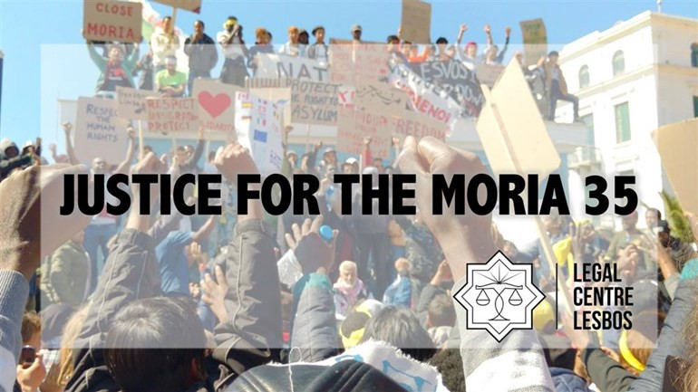
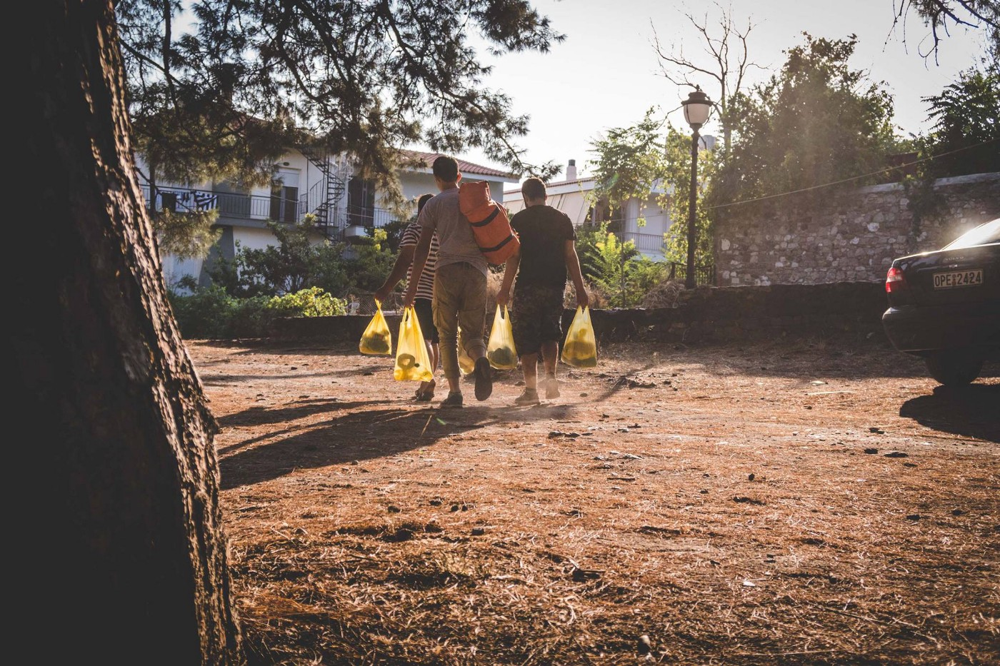

### AYS Daily Digest 16/12/17: Free the Moria 35

_Funds needed on Lesbos//Academics flee Turkey//Rescues at sea and three missing ships//Sleeping rough in Serbia//Day of action in Italy//Aid workers opposed by French municipality//and more…_

#### FEATURE: Legal Support Needed For Refugees on Lesbos

The Legal Center on Lesbos is currently looking for funds to support their advocacy for 35 detained refugees from the Moria camp\. These refugees were arbitrarily arrested following a peaceful demonstration by refugees from the camp, demanding humane treatment and removal to the Greek mainland\. The mass arrest was made in the midst of a raid, in which police assualted a number of people in the camp\. The Legal Center reports:

> On the morning of 18th July, for the second day running, observers reported that hundreds of refugees of different nationalities held a peaceful protest outside the European Asylum Support Office, demanding freedom of movement for everyone trapped on the island for over six months and denouncing inhumane living conditions\. 

> Clashes between police forces using tear gas and a handful of protesters followed\. Approximately an hour after this had died down, riot police entered Moria\. They violently raided the African section of the camp and arbitrarily arrested 35 people\. 

> There is substantial evidence that during the raid, arrests and whilst in Mytilene prison, police officers exercised disproportionate and excessive use of force against refugees: Shooting tear\-gas in enclosed spaces and at short range, throwing rocks, and perpetrating severe assaults, including with batons and boots\. Many of the defendants were not even present for the peaceful protest let alone the clashes that followed\. 

> This led observers to assume the basis on which the Moria 35 were arrested was their colour and location inside the camp while raids were taking place\. 

> The fact that all 35 have been charged with an identical catalogue of criminal offences — including arson, resisting arrest, attempted assault, rioting, damage to private property and disturbing the public peace — compounds indications that arrests were arbitrary: Intended as collective punishment to intimidate refugees out of mobilising to expose the realities of structural injustice and [dehumanising](http://www.msf.org/en/article/greece-eu-border-policies-fuel-mental-health-crisis-asylum-seekers) [conditions](http://greece.greekreporter.com/2017/10/06/migrant-camp-in-lesvos-a-concentration-camp-says-human-rights-watch/) for everyone [trapped](http://www.legalcentrelesbos.org/2017/10/12/solidarity-groups-call-for-closing-hotspots-for-refugees-as-winter-approaches/) on Lesbos\. 

The Legal Center reports that the police brutality displayed during this raid was so egregious, that based upon video evidence Amnesty International made a statement calling on the Greek government to investigate the Lesbos police for torture\. You can access the Amnesty report from this [page](https://www.justgiving.com/fundraising/justice-for-the-moria-35) \.

[No Borders Kitchen Lesvos](https://www.facebook.com/NBKLesvos/) is currently crowdfunding to keep their work going, as the group is on the verge of bankruptcy\. You can support their vital work [here](https://www.youcaring.com/refugeesonlesvosgreece-1045272) \. From their statement today:

Volunteers delivering meals\. Photo Credit: No Borders Kitchen

> We currently support 450 refugees to cook and subsist autonomously\. Our project is entirely volunteer run and we do not receive any regular funding\. In two weeks our bank account will run empty and we will need your support to continue our work\! 

> Every month we support more than 300 people with food boxes which enable them to live and cook autonomously at a cost of 3\.60 € per person per week\. For most, our support allows them to live outside the miserable, state\-run camp, and making their homes in their own flats and squats instead\. The demand for the boxes is huge and we currently have a long waiting list\. 

The [Together for Better Days](https://www.facebook.com/betterdays.ngo/?hc_ref=ARTgqiJ_0BHqvnXQl8slkRVeQRmO9YbpODnhpYmTr38Kz8VvAwcW62LKkWGEIPaOhvo&fref=nf) organization recently released a [video](https://www.facebook.com/betterdays.ngo/videos/1726052444126153/?hc_location=ufi) shot inside the Moria camp on Lesvos\. According to the group, conditions there have never been worse\. The group also reported on the effects of a secret deal struck between Greek and Turkish authorities in the wake of Erdogan’s visit to Greece:

> A few days ago, it seems a deal was struck between Athens and Ankara, allowing expedited removals to take place not only from the islands, but also from the Greek mainland\. On the heels of this agreement, it seems Greek authorities have become more willing to open the islands — provided that doing so will no longer mean that asylum seekers are removed from the reach of the EU\-Turkey deal\. 

### TURKEY

The Turkish Ministry of Education has released new guides for refugees to help them access educational services, accoridng to the [HarekAct outlet](http://harekact.bordermonitoring.eu/2017/12/16/guideline-booklets-prepared-for-integration-of-syrian-students-in-turkey/) \. They are scheduled to be distributed at the end of this month\.
### SEA

](assets/a31867e2bb49/1*GF6026aPPVrZwXrKOdQplw.jpeg)

Photo Credit: [Righteous of the Mediterranean](https://www.facebook.com/TheRighteousMedSea/?hc_ref=ARS01RtS2RtbF5SBF8inxqFa_-HnwpF5yaQvQrFKBuObsp_IPxC6zLI_dkC2Ia7Worw&fref=gs&hc_location=group)

Today a Libyan Coast Guard \(LCG\) vessel collided with a Lifeline rescue vessel\. According to members of the Lifeline crew, it seems likely that the collision was an accident, caused either by a temporary loss of steering or negligence by the LCG ship\. The organization has posted a short [video](https://www.facebook.com/seenotrettung/videos/vb.111682292571652/323595331380346/?type=2&theater) of the accident\. The group has estimated the cost of the damage at between 10 and 15 thousand euros\. While they are not sure whether insurance will cover the full cost yet, they need to pay for the repairs up front to ensure their ship is back on the sea and saving lives\. You can support their efforts [here](https://www.betterplace.org/en/projects/46977-mission-lifeline-search-and-rescue) \.

The [SOS MEDITERRANEE](http://sosmediterranee.org/?lang=en) organziation rescued 154 people off the coast of Libya today\.

■■■■■■■■■■■■■■ 
> **[SOS Humanity](https://twitter.com/soshumanity_de) @ Twitter Says:** 

> > UPDATE 154 people rescued by @[openarms_fund](https://twitter.com/openarms_fund) in international waters off the Libyan coasts have been transferred to the #Aquarius  now heading north towards a port of safety with 320 people on board #TogetherForRescue https://t.co/cq8lnvyju8 

> **Tweeted at [2017-12-16 17:57:47](https://twitter.com/sosmedgermany/status/942091398060310528).** 

■■■■■■■■■■■■■■ 

The Libyan Observer reported today that the LCG “saved” 157 refugees from the sea today\. It is inaccurate to say that the LCG saves anyone, as the refugees they take on their vessels are being forcibly taken back to a country where their lives are at risk\. The LCG has been repeatedly found to be in violation of international law, taking refugees from outside of their territorial waters, and even [beating and shooting at refugees](http://www.aljazeera.com/news/2017/05/libyan-coastguard-opens-fire-migrant-boats-ngos-170525100451559.html) at sea\.

According to the [Alarm Phone](https://twitter.com/alarm_phone) organization, a boat [carrying 11 people](https://twitter.com/alarm_phone/status/942035453414436864) was rescued by a Moroccan vessel\. Tragically, one person fell overboard during the rescue, and is believed to have drowned\.

The [Salvemento Maritimo](https://twitter.com/salvamentogob) organization rescued [20 people](https://twitter.com/salvamentogob/status/941967344976498690) in the Mediterranean today\.

There are currently three boats missing in the Mediterannean\. No more details are known at this point, other than the fact that these boats are filled with human beings trying to reach safety\.

■■■■■■■■■■■■■■ 
> **[Alarm Phone](https://twitter.com/alarm_phone) @ Twitter Says:** 

> > At 0500 CET we got informed about 3 boats in #distress in the Western #Mediterranean. They embarked at midnight and try to row to #EU. Weather conditions today are harsh and till this moment, no #rescue could be confirmed. @[salvamentogob](https://twitter.com/salvamentogob) seems to be busy with more cases. 

> **Tweeted at [2017-12-16 08:58:03](https://twitter.com/alarm_phone/status/941955573012103168).** 

■■■■■■■■■■■■■■ 

### GREECE

[32 Turkish refugees arrived](http://www.ekathimerini.com/224230/article/ekathimerini/news/group-of-32-turkish-civilians-set-to-seek-political-asylum-in-greece) on the island of Chios today, highlighting the increasingly precarious status of intellectuals and activists in the country\. As Turkey has grown increasingly authoritarian since the coup that occurred in the country, many academics have been laid off and face political persecution and imprisonment\. According to information from politischios\.gr, most of the refugees who arrived are university\-level persons, teachers and doctors\. Among them is a family with four underage children who claim that their life is at risk from the regime of freedom and persecution by the Turkish authorities\. Records have already been filed and are expected within the next few hours to be handed over to the Prosecutor of Chios\.
### SERBIA

Graffiti in a squat in Šid, Serbia\. Photo Credit: AYS

According to a recent report from MSF, there are currently [over 500 refugees living homeless](https://www.rferl.org/a/at-least-500-migrants-reported-living-open-serbia-winter-approaches-doctors-without-borders/28919415.html) in Serbia\. This is an obvious cause for concern as dropping temperatures mean increased danger for those living rough\. On the outskirts of Sombor in Northern Serbia, there are over 100 refugees sleeping in the woods, including many children\. Many refugees avoid the state\-run camps, because they fear being detained, and also want to remain close to the Croatian and Hungarian borders so they can continue their journey\.

According to volunteers on the ground, those who are sleeping rough are frequently taken by the police to state\-run camps, but they usually leave these camps\. Because distribution of food and other items is forbidden outside of the state\-run camps, those who are sleeping rough have great difficulty getting aid\. The only people supporting them are MSF workers and volunteers\.
### HUNGARY

Despite a rising wave of nationalist rhetoric and xenophobia in Eastern European politics, Hungary has accepted more than twice the number of asylum applications as they did last year\. So far, [Hungary has granted asylum](https://index.hu/belfold/2017/12/16/tobb_mint_ketszer_annyi_menedekkerot_fogadtunk_be_iden/) to over 1,000 people this year\. Despite this improvement, the transit zones in Hungary remain notorious for the abusive conditions in which refugees are held\.

The organization [Migration Aid](https://www.facebook.com/migrationaid.org/?hc_ref=ARRnWfKYle_NXU4qgvWx44yrmEM6mxV58F02GRJKg_GAV19yrOod08WW_y9d3uJZ910&fref=nf) has put out a call for donations in Hungary:

> Online communication is the only way for refugees to keep in touch with their loved ones in faraway countries, as the international call fees in these regions are unaffordably high\. As the devices capable of online communication are prone to wear and tear, if they don’t have the means to buy new devices, they can easily become unable to keep in contact with their families and friends\. As in the past few weeks we’ve been getting more and more often requests of this kind, we too ask help now: we are looking for smartphones, tablets and laptops fit for use for the refugees staying in Hungary who are in our care\. 
 

> If you have a device at home which you don’t use any more and you can part from it, it may give tremendous joy for a refugee family, who can’t afford to buy any\.
 

> Please get in touch with us on any of our contacts, if you can help\.
 

> Thank you\!
 

> E\-mail: info@migrationaid\.org 

### ITALY

Today was a [national day of action](https://www.facebook.com/Roma16Dicembre/photos/a.515699448798170.1073741827.515699235464858/526085724426209/?type=1&theater) in Italy for the rights of refugees and migrants, and to demand housing and social services for all\. The marches brought together over 2,500 people who took to the streets of Rome, and there were smaller marches in other cities throughout the country, including Cona and Gorzia\. Despite some police harassment, the marches were a success and showed it is possible to build political power from alliances between citizens and refugees\.

](assets/a31867e2bb49/1*JKPd_aSWn1DWqEqIeqO-KA.jpeg)

Marchers in Rome\. Photo Credit: [Global Project](http://www.globalproject.info/it/in_movimento/fightright-in-migliaia-a-roma-per-i-diritti-senza-confini/21216)
### FRANCE

This week the activist and aid group “ [Solidarity with Exiles](https://www.facebook.com/groups/177642579245883/?fref=gs&dti=177642579245883&hc_location=group_dialog) ” working in Paris put up signs on barriers that prevent refugees from sleeping in open areas\. The aim of this action was to highlight the many ways refugees are excluded and marginalized in the city, not only through policy, but through infrastructure as well\. How will putting up a fence around a park help solve the problem of homelesness?

](assets/a31867e2bb49/1*pQhm-7f1SSQmQrYoyhBG2g.jpeg)

“Barriers of Shame”\. Photo Credit: [Solidarity with Exiles](https://www.facebook.com/groups/177642579245883/?fref=gs&dti=177642579245883&hc_location=group_dialog)

In Northern France, in the town of Grande\-Synthe, the local government has helped to find emergency accommodation for [150 refugees in the area](http://www.lavoixdunord.fr/280265/article/2017-12-14/la-ville-met-l-abri-150-migrants-du-puythouck-l-espace-jeunes) , housing them in a local youth center\. We hope that more cities and towns in Northern France will follow this lead in setting up shelters, as human lives are at risk\.

](assets/a31867e2bb49/1*XIggZWtB2KPxuT6lK3UgaQ.jpeg)

“In memory of those killed by this border” Photo Credit: [Gregory Leclerc](https://twitter.com/GregLeclerc)

In the area of Menton in Southern France, there was a solidarity march for migrants and refugees in the area\. Over 500 protestors marched to the Italian border to bring attention to the arbitrary detention and abuse of refugees on the French\-Italian border\. When they reached the Italian border they were blocked by border police\.

Today 14 French Citizens painted “Accueil de Merde” \(Shit Reception\) on the wall of the ministry responsible for housing refugees\. This action was taken in protest of the outrageous policies and behaviors of the French authorities, who allow countless refugees to remain on the street\. The graffiti writers wrote an open letter to the relevant ministry to explain their action, which can be accessed through Twitter [here](https://twitter.com/AccueilDeMerde/status/941970533352181760) \.

The organization [L’Auberge Des Migrants](https://www.facebook.com/AubergeMigrants/?hc_ref=ARTLoADRWKNVKxgoRFp_cTOroG3-kh64BC1ybyn6CIXPK8At8qBrZiXass9MoQuOgpA&fref=nf) has started a new project providing wifi, a charging station, and info point for refugees via bus for refugees in Northern France\. You can learn more and support their efforts [here](https://www.gofundme.com/calais-infobus) \.

An organization in Lunel, Southern France, [has been forbidden by the local government](https://www.francebleu.fr/infos/societe/le-partage-du-coeur-1513245123) from distributing food in a city square, because they do not have the “authorization to do so”\. This incident is another example of authorities in France creating arbitrary and inhumane obstacles for those trying to aid refugees\.
### GENERAL

Today the Refugee Info Bus outlet published a very useful video explaining potential issues with the use of social media for asylum seekers in Europe\. The video explains that your social media profiles can and likely will be accessed by asylum offices, and so it is important not to post anything that may contradict claims you make in the interview\. This video is a great resource not only for refugees, but for volunteers and aid workers so they can give good advice to those they are working with\. The video is in Arabic with English subtitles, and you can watch it [here](https://www.facebook.com/RefugeeInfoBus/videos/2064451193790298/?fref=gs&dti=1652972374920129&hc_location=group) \.

The [day of action](https://www.facebook.com/plattform.refugees.welcome/posts/1930662730530144) against the Libyan Slave trade, occurring this Monday, has expanded from Austria, and now there are events being planned across Europe\. You can go [here](https://www.facebook.com/18d17ActionDay/) to find a march near you, or contact the group to add an event to the list\.
### AUSTRIA

The incoming far\-right chancellor of Austria, Sebastian Kurz, has announced that he plans not to accept EU refugee relocation quotas\. Under EU law, all member countries are obligated to accept a certain minimum number of refugees\. Some countries, such as Poland, the Czech Republic, and Hungary, have rejected these quotas, and received small penalties for their non\-compliance\.
### DENMARK

The right wing nationalist party, the Danish People’s Party \(DF\), is currently negotiating an agreement with other leading parties\. They are proposing [inhumane changes](https://www.thelocal.dk/20171215/danish-parties-in-race-against-clock-as-negotiations-continue-over-tax-immigration) to their asylum procedures, in order to orient the entire system towards deportation\. The party is attempting to end all family reunification cases, and end integration programs for refugees granted temporary protection status\.

> **_We strive to echo correct news from the ground through collaboration and fairness\._** 

> **_Every effort has been made to credit organizations and individuals with regard to the supply of information, video, and photo material \(in cases where the source wanted to be accredited\) \. Please notify us regarding corrections\._** 

> **_If there’s anything you want to share or comment, contact us through [Facebook](https://www.facebook.com/areyousyrious/) or write to: areyousyrious@gmail\.com\._** 

_Converted [Medium Post](https://areyousyrious.medium.com/ays-daily-digest-16-12-17-free-the-moria-35-a31867e2bb49) by [ZMediumToMarkdown](https://github.com/ZhgChgLi/ZMediumToMarkdown)._
