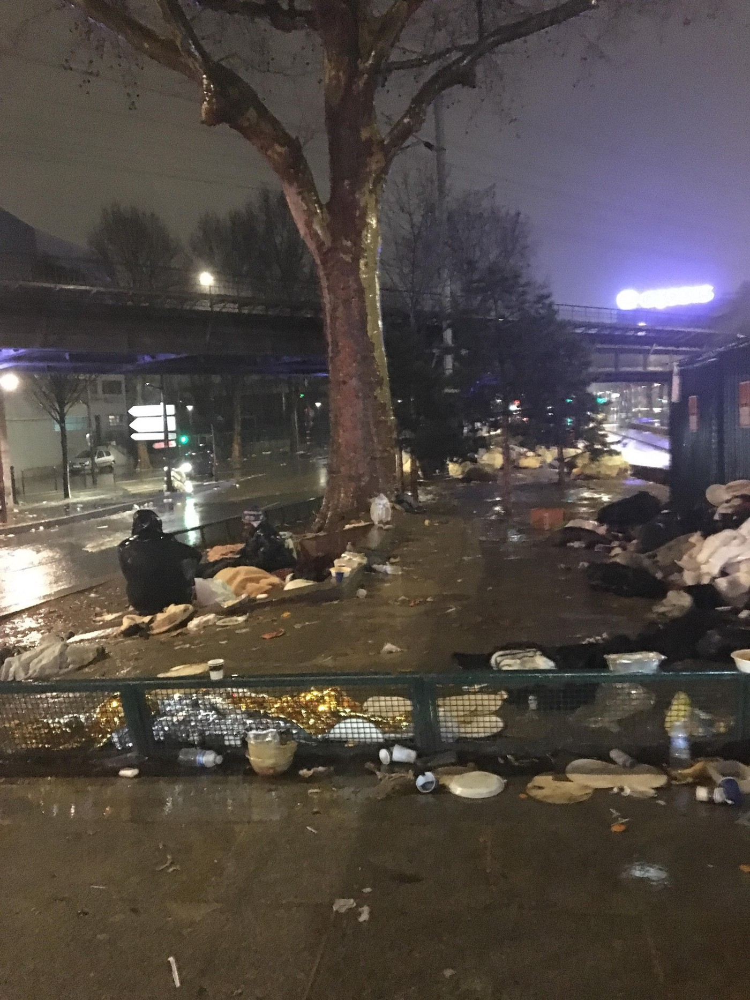
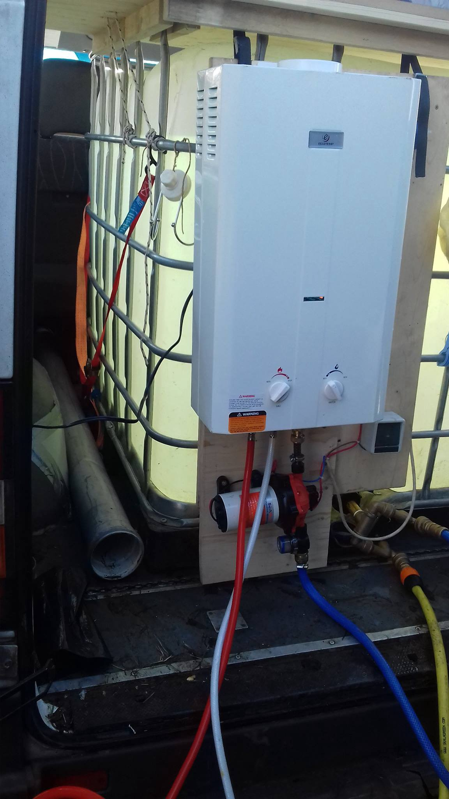

### AYS Daily Digest 23/12/17: France Abandons Refugee Children

//Minors abandoned in Paris// Forced marriages in Turkey//Sea rescues//New arrivals on the Aegean islands//Additional funding for Greece//Volunteers construct showers in Serbia and Italy// And more…

Young girl \(on left\) sitting with police officer in Port de la Chapelle, Paris\. Photo taken by a volunteer\.
### FEATURE

While around the global North many of us are enjoying time spent in our warm households surrounded by friends and family, refugees across Europe are still sleeping outside in the cold, facing harsh weather and abuse\. This is the case for many refugees sleeping rough in Paris and throughout France\. We have yet another reminder of this from the account of a Parisian volunteer this week\. Visiting refugees sleeping in tents at the Port de la Chapelle, Paris, she found two fifteen\-year old girls who were trying to survive on their own\. From her report:

> Yesterday whilst working with Utopia \[volunteer group\] I met two little girls sleeping rough in Paris\. They were in a tent with grown & drunk men, completely terrorised\.
 

> It was pouring rain yet they wore flip flops and socks that were soaked\. 

> Thankfully, a warm house had been found for them for the night and the three of us got on an hour tube ride to bring them to that safe place\. Who knows what would have happened to them had they spent the night in that tent\. 

> They are 15 years old and come from Eritrea\. To get to Paris, they have been through Sudan, Libya, the Mediterranean Sea and Italy\. I can’t even begin to think about what they’ve been through and what they’ve seen during that journey\. How vulnerable and frightened must two 15 year old girls be when crossing these unknown, hostile and very dangerous countries? 

> These little girls are complete heroes — So strong & resilient, it’s almost impossible to believe they’ve been through what they’ve been through\. Sticking to each other for months and taking care of each other, being all of the sudden each other’s mum, sister, friend, carer, pillar\. 

> But they SHOULDN’T have to\. 

> When did it become okay to leave two 15 year old girls to care for themselves and risk their lives to find peace & safety? When will the EU and its member states finally implement safe passage to allow people to claim asylum legally and safely? This is beyond disgraceful — it’s criminal\. Like so many current EU and other European governments’ policies\. 

> These little girls slept in a safe place yesterday\. But they were back in the streets this morning and are now on their way to Brussels to try and make it to the UK\. They both have family there\. 

As we enjoy the holiday season, let’s not forget the neediest and most vulnerable people among us\. It can seem too easy to turn a blind eye to people right in front of us\. But we should not invent excuses for treating others as less than human, and take a lesson from this French volunteer\.
### Turkey

Today the HarekAct outlet forwarded a [report](http://harekact.bordermonitoring.eu/2017/12/23/on-forced-and-second-marriage-of-syrian-women-in-turkey/) from DW Turkey, detailing the issue of Turkish men forcing Syrian refugees into marriages, or taking them as second wives\. According to the report, polygamy does exist in the Turkish countryside, and there has been a trend of Turkish men taking Syrian women as second wives\. Many of the Syrian women who enter into these arrangements are forced to do so either by threats or their own economic vulnerability\.
### Sea

The journalist Antonio Pampliega published a photo which reveals a great deal about the difference between Frontex border control vessels which aim to stop refugees and the volunteer rescue ships\. One group is underfunded and often unprotected, while the other is overfunded and over\-militarized\. In the front you can see a volunteer standing on the deck of a rescue ship which is dwarfed by a Frontex vessel\. “One sea: the Mediterranean\. Two boats: Open Arms and Olympic Commander\. Two realities: those who save lives and those who look away…” wrote Pampliega\.

■■■■■■■■■■■■■■ 
> **[Antonio Pampliega](https://twitter.com/APampliega) @ Twitter Says:** 

> > Un mar: El Mediterráneo. Dos barcos: Open Arms y el Olympic Commander. Dos realidades: Quienes salvan vidas y quienes miran a otro lado. Ninguna vida a la deriva. ¡Feliz Navidad! ©A.Pampliega (Diciembre 2017) https://t.co/IWEkoydKb4 

> **Tweeted at [2017-12-23 09:55:18](https://twitter.com/apampliega/status/944506693756555265).** 

■■■■■■■■■■■■■■ 

While the conditions are extremely dangerous for sea crossing, there have been hundreds of new arrivals to the Aegean islands in the past few weeks\. The MSF vessel Aquarius reports dangerous winds today on the Mediterranean\.

■■■■■■■■■■■■■■ 
> **[MSF Sea](https://twitter.com/MSF_Sea) @ Twitter Says:** 

> > #Aquarius is facing 3 meters waves and 30 knots winds in the #Med. People continue to cross the sea in the freezing winter. #Safepassage now https://t.co/ibpt4IFJXZ 

> **Tweeted at [2017-12-23 08:59:02](https://twitter.com/msf_sea/status/944492532041441280).** 

■■■■■■■■■■■■■■ 

The Alberan rescue vessel found and rescued 30 people from a dinghy last night\.

Guardamar Concepción Arenal rescued 11 people from a dinghy and landed in Barbate, Spain\. Salvamar Arcutus rescued 22 people from three boats\.
### Greece
#### Islands

■■■■■■■■■■■■■■ 
> **[Lesvos Solidarity](https://twitter.com/Lesvosolidarity) @ Twitter Says:** 

> > 61 people arrived onto #Lesvos last night on two boats. Increasingly cold and wet conditions in #Moria await them. #lesvosarrivals #opentheislands 

> **Tweeted at [2017-12-23 12:29:25](https://twitter.com/lesvosolidarity/status/944545476535373824).** 

■■■■■■■■■■■■■■ 

Today, “Enough is Enough” released a short video showing the despicable conditions at Moria camp on Lesvos\.

■■■■■■■■■■■■■■ 
> **[Enough 14](https://twitter.com/enough14) @ Twitter Says:** 

> > #RefugeesGR Outide of #Moria - Cars of Hope on #Lesvos 

You can support our work with refugees in Greece. You will find our crowdfunding campaing (until December 24) at [leetchi.com/c/soziales-von…](https://www.leetchi.com/c/soziales-von-cars-of-hope) PayPal account (permanent) carsofhopewtal@gmail.com https://t.co/0KLpIyfkO0 

> **Tweeted at [2017-12-23 19:42:57](https://twitter.com/enough14/status/944654579395907584).** 

■■■■■■■■■■■■■■ 

A source on the ground [reported today](https://twitter.com/freethemoria35/status/944631911829340161) that one of the imprisoned “Moria 35” refugees who are being held on false charges following a protest at the camp has been transferred to a prison on the mainland, where he no longer has access to his lawyer\. The Moria 35 are a group of African men who were seized in a violent raid [on the camp](http://www.legalcentrelesbos.org/2017/07/30/free-the-moria-35/) by the Greek police\. The riot that the police describe didn’t happen, as video evidence and eyewitness accounts show a peaceful protest, where only the police used violence\. Furthermore, the African men arrested following this incident had no connection to the protest\. Based on this, it seems likely that the arrest of the African men was motivated by racism, and used to threaten others who might protest\. The attempt to remove this man from his lawyer and minimal due process is another injustice on top of many\. The seemingly randomized punishment of the Moria 35 is an example of the way Greek and EU authorities bully refugees and treat them as if they don’t have rights\.

The “Happy Family Center” on Moria has opened “baby washing cabins”, where mothers can care for their babies under hygienic conditions\. They will start with 10 mothers per day, and increase to 20 mothers per day in the near future, Inshallah\.

 \.](assets/f1ae78cba03a/1*4YZqRaQiC4qToibtjV656w.jpeg)

“Baby Washing Cabin” on Lesbos\. Photo Credit: [Michael Raber](https://www.facebook.com/michael.raeber.swisscross?hc_ref=ARRwsy_GLuok05EM72ZPjOhtBjYjQB9cgwCMnA8RfCLd5AAQqXg6p583cTQ93Hiekr0) \.

According to activist Arash Hampay, the refugees who have been occupying the SYRIZA party building on Lesvos in the aftermath of the Moria protest and mass detentions have finally left\. They were able to do so after the granting of four of their demands\. According to Hampay, the party has promised them:

> 1\. They \[the protesting refugees\] will get their Athens papers and the papers that 20 people need to leave the island\. 

> 2\. Some promises about [\#hesam\_shaeri\_hesari](https://www.facebook.com/hashtag/hesam_shaeri_hesari?hc_location=ufi) \[a refugee who is being detained without due cause\] and his release from jail\. 

> 3\. The cancelation of rejection for six Iranian refugees\. 

> 4\. Athens papers for some other people as well\. 

We will be following up on this story to see if the SYRIZA party fulfills it’s promises\.

The European Commission [announced this week](http://www.keeptalkinggreece.com/2017/12/23/commission-refugees-greece-emergency-aid/) that it will be providing an additional seven million euros in funding to assist refugees in Greece\. This money is to provide for urgent needs such as shelter, food, and hygiene\. While there is certainly a need for immediate action and funds to solve these issues, those familiar with the situation in Greece may greet this news with more skepticism than optimism\. It should be noted that the European Commission has already awarded Greece over 561 million euros to assist refugees\. This figure does not represent the total sum allocated to refugees in Greece, as NGOs and other organizations provide other sources of funding\. However, despite this massive cash flow we are still seeing families and children sleeping in unheated tents on all the Greek islands, with a total lack of showers, toilets, acceptable accommodation, and social services\.

Surveying the situation in Greece, it is evident that in many cases private citizens and volunteer groups working on minimal budgets have done a better job of providing for refugees than have the well\-funded large NGOs or Greek authorities\. It is time to admit that the main obstacle in tackling this crisis is not only money — it is the question of will\.
#### Mainland

There are new winter shelters opening in Athens as of today, as Sumita Shah has informed us\. A winter shelter is located at the City of Athens Cultural Center, on Akadimias 50, Athina 106 79, Greece\. The number for the shelter is \+30 21 0362 1601\. Those who are in an emergency situation because of the cold can also dial 555\. Location [here](https://www.google.com/maps/place/City+of+Athens+Cultural+Center/@37.9813956,23.7328973,17z/data=!3m1!4b1!4m5!3m4!1s0x14a1bd39f01176a7:0xef0a5976e5620675!8m2!3d37.9813956!4d23.735086?hl=en-GB) \.

Médecins du Monde has a night shelter for homeless persons at 
49, Alikarnasou str\., Akadimia Platonos\. It is open daily from 21:00 to 12:00 and has the capacity to accommodate up to 50 persons per day\. It is not an emergency shelter, therefore please check whether they have space before going there\. You can find the location of the year\-round shelter [here](https://www.google.com/maps/place/Alikarnassou+49,+Athina+104+41,+Greece/@37.9859261,23.7095151,15z/data=!4m13!1m7!3m6!1s0x14a1bcd7e4ccb1d7:0x121c3a6dea4b5577!2sAlikarnassou+49,+Athina+104+41,+Greece!3b1!8m2!3d37.9870503!4d23.7151898!3m4!1s0x14a1bcd7e4ccb1d7:0x121c3a6dea4b5577!8m2!3d37.9870503!4d23.7151898) \.

The City Plaza hotel and solidarity space is facing closure because they are running low on funds\. City Plaza has hosted thousands of refugee families in Athens since the start of the crisis\. From their statement today:

> City Plaza is facing major financial difficulties today\. The international fund\-raising campaign and the direct donations which were so successful in the first year of the project have decreased severely\. Therefore, we appeal once more to all the individuals and groups who have made City Plaza possible through their contributions\. We ask for local groups and initiatives to spread the word and organize solidarity events and parties\. We ask for collectives or private individuals to join our campaign, to share our videos and our call to keep City Plaza alive\. 

> So far, for around 20 months, City Plaza has managed to be a house of dignity, safety and struggle for more than 1,700 refugees—more than a third of them babies and children\. This is due to the endless efforts of hundreds of activists, through solidarity and self\-organization, but this wouldn’t be enough without our donors’ support, without your support\. 

You can support City Plaza [here](https://best-hotel-in-europe.eu/donate/) \.

Today, City Plaza updated their list of contacts and available services for refugees in Athens, which you can see [here](https://www.facebook.com/sol2refugeesen/posts/1804502823175386) \.

There is an urgent need for shoes in the Ritsona camp\. Anyone on the ground who is available to help should contact [Antonis Dellatollas\.](https://www.facebook.com/delatollas?hc_ref=ARRPkXyBlIMIBJX9_d1Ok_U8pJs5FMrK1ECzMyB2VJYtlYhepkz8Bx3xrBpf0lV00DA&fref=nf)
### Serbia

](assets/f1ae78cba03a/1*Kv0W6Lb_aeOhQ9vLnC4UHw.jpeg)

Sleeping rough in Sombor\. Photo Credit: [Umino\.](https://www.facebook.com/umino.org/?fref=gs&hc_location=group_dialog)

The [Rigardu](https://www.facebook.com/rigardu/?hc_ref=ARQeMb3Pq4qHjqV2SEO-7OGt3ndch0sTYyrc9PY7jAINQTyqG8rJbNddNncVx3OQ5U0&fref=nf) organization is still operating their mobile shower initiative, helping refugees sleeping in the Sombor area to get clean\. As they state, “It’s about hygiene\. But it is also about humanity and dignity\.” Volunteers in the Sombor area report there are slightly fewer refugees there compared to a few months ago, but there are still many waiting to continue their journey, to find safety, and join relatives in Europe\. Rigardu is trying to raise slightly over 3,000 euros this month to continue their project\. You can support them [here](https://www.zusammen-fuer-fluechtlinge.de/projects/58785) \.

Mobile shower project, Serbia\. Photo Credit: Umino
### Italy

According to the [Baobab Experience](https://www.facebook.com/BaobabExperience/?fref=gs&hc_location=group_dialog) organization in Rome, volunteers have made some progress in meeting refugees’ needs in “Piazzale Maslax” \(a square which the group has named after a young refugee\) \. There have been thousands of refugees passing through this spot in the past year, some for only a few hours or days, some staying there for weeks or months\. Baobab reports: “Last Sunday we made a small step forward: thanks to Legambiente and architects from the [\#BAG\_BeyondArchitectureGroup](https://www.facebook.com/hashtag/bag_beyondarchitecturegroup?source=feed_text&story_id=1939596996257664) we installed four showers in modules, made with tubes and galvanized joints which are very resistant and wrapped in waterproof sheets\. While it was impossible to link them to a hydraulic service, they are fed by 10\-liter removable bags, to be filled during use with pre\-heated water\.”

 \.](assets/f1ae78cba03a/1*z6y1TIXk0wgsiGJtJakWiQ.jpeg)

Volunteers building the showers\. Photo Credit: [Baobab Experience](https://www.facebook.com/BaobabExperience/?fref=gs&hc_location=group_dialog) \.
### Germany

Deputy Chancellor Sigmar Gabriel is advocating for greater federal support and funding for the towns that are taking in refugees\. Sensibly, Gabriel has pointed out that making the towns pay for integration and housing costs on their own can increase resentment between refugees and locals\. By having the federal government support these efforts, locals will not feel as if they have to decide between “integrating refugees or renovating their swimming pool,” according to Gabriel\. “We have to reward cities and communities for taking in refugees,” Gabriel said\. “The costs of integration should be covered by the federal government\.”
### Belgium

As AYS reported previously, Belgium has an agreement with Sudan to send back refugees, despite the manifest dangers within the country\. According to [reports](https://www.courrierinternational.com/article/ce-qui-est-arrive-aux-migrants-que-la-belgique-renvoyes-au-soudan) of those who have been forcibly returned, many have been arrested and tortured upon return to Sudan\. Others have been forced to sign documents swearing they will not engage in political activity within the country\. Belgium claims that it has not received any “official complaints”, but that it will suspend deportations to Sudan until the end of January\. Once again, threats to refugees’ lives are being greeted by meaningless double\-talk from a European government\. If Belgium truly believes that Sudan is a safe country, then why is it ceasing to deport refugees there for the time being? Despite their claim to have received no “official complaints” the Belgian government has the resources and information to determine that Sudan is not a safe country for refugees\.
### UK

In the town of Oldham in Greater Manchester volunteers are collecting foodstuffs for a container to be sent to refugees on Lesvos\. To see their list of needs, click [here](https://www.facebook.com/groups/informationpointforlesvosvolunteers/permalink/799811740226275/) \.

> **_We strive to echo correct news from the ground through collaboration and fairness\._** 

> **_Every effort has been made to credit organizations and individuals with regard to the supply of information, video, and photo material \(in cases where the source wanted to be accredited\) \. Please notify us regarding corrections\._** 

> **_If there’s anything you want to share or comment, contact us through Facebook or write to: areyousyrious@gmail\.com_** 

_Converted [Medium Post](https://areyousyrious.medium.com/ays-daily-digest-23-12-17-france-abandons-refugee-children-f1ae78cba03a) by [ZMediumToMarkdown](https://github.com/ZhgChgLi/ZMediumToMarkdown)._
