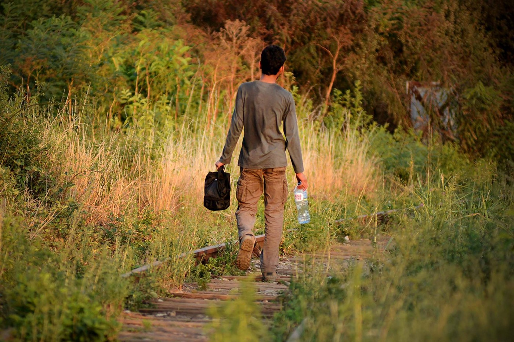
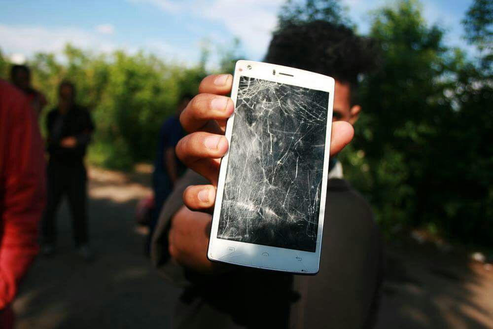
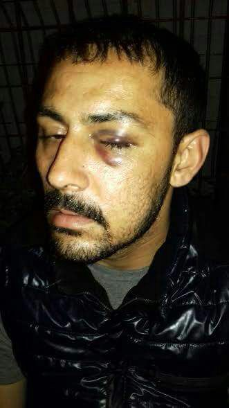
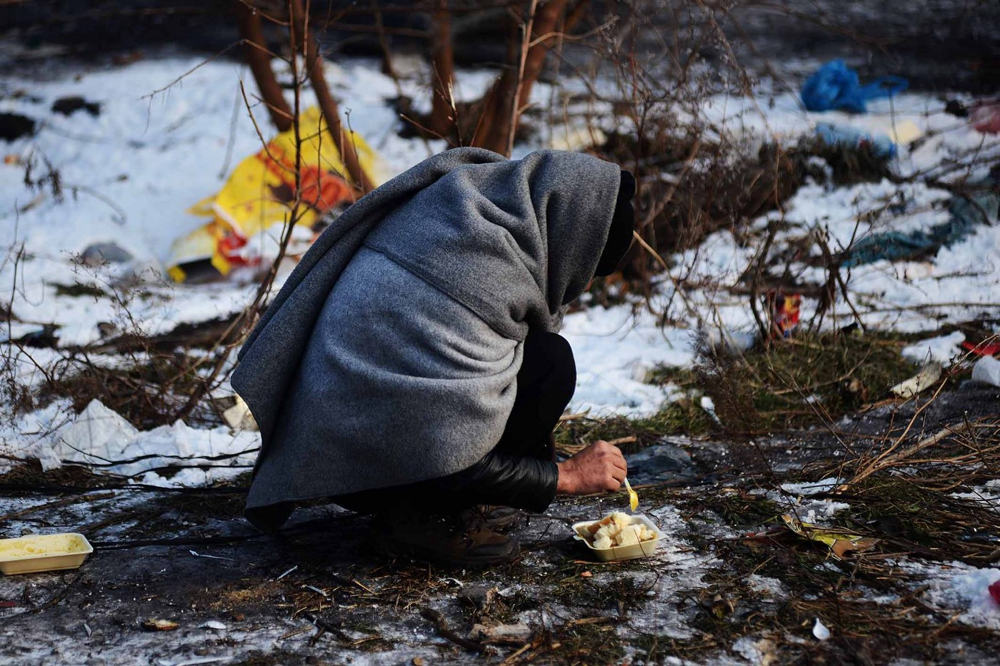

### AYS SPECIAL — Serbia: Life in Šid

Photo: No Name Kitchen\.

We have been working in Serbia on a daily basis for almost a year now\. All that time, [No Name Kitchen](https://www.facebook.com/NoNameKitchenBelgrade/) has been in contact with people on the move for several hours every day, and this gave us a firsthand perspective of what their current situation is\.

We are based in Šid, five km away from the Croatian border\. The fields and forests around the city are transit place for 150 to 200 people from different countries: Afghanistan, Pakistan, Algeria, Morocco, and Tunisia are the most common\. It’s a convenient place for them since it’s very close to the Croatian border so they can go quickly to what they call “the game”\.

The game consists of attempts to cross the border and passage through Croatia and Slovenia to reach western Europe\.

Unfortunately, the vast majority of the times, they have to come back, after being pushed back by the Croatian border police or Frontex\.

These human rights violations happen every day\. People come back with broken phones, stolen money, wounds, broken ribs, broken arms, baton marks and every once in a while the worst episode possible occurs, like the death of a [6\-year\-old child](https://www.theguardian.com/world/2017/dec/08/they-treated-her-like-a-dog-tragedy-of-the-six-year-old-killed-at-croatian-border) \.

The 1951 Refugee Convention and the Dublin Regulation, are both documents in which Croatia took part and agreed upon\. But all these conventions, regulations, laws, treaties… are far away from being applied\. Anyone who’s been present in the field longer than a day can easily realize that\.

Violence at the border\. Photo NNK\.

Sometimes an excuse is given, like “Today is Sunday, so no asylum,” some other times the answer is simply “no,” and they are pushed back to Serbia afterward\.

Serbia is currently serving as a border to the EU, and the member states surrounding it \(Hungary, Croatia, and Romania\), helped by the European border police, make sure that very few people succeed in crossing, if any\.

We have been collecting all the information possible these last months, but we are overwhelmed by the quantity of push\-backs happening every day\. Only over the last ten days, 123 were reported to us\.

These are the consequences of the current EU approach to this problem, and the voices of the affected are completely silenced\. Fortunately, there are still people who haven’t forgotten this issue and thanks to Doctors Without Borders, AYS or Rigardu, who recently launched this website to document illegal push\-backs and police violence inflicted by EU member state authorities, there are still ways of raising awareness\.

**Borders closed and no asylum, what to do then?**

These European policies result in frustration and many migrants stuck in Serbia\. Official data estimates that 4,150 people currently reside in centers for migrant reception and at least five hundred are living in improvised accommodations or under the open sky while winter weather conditions are growing harsher by the day\.

Considering that very few of them want to stay in Serbia and taking into account how difficult it is to request and receive asylum in this country, it’s no surprise that in 2016 only 42 persons were granted refugee status or subsidiary protection\.

All year long, over 20,000 thousand people received counseling on asylum by the UNHCR, so that makes 0\.12% of the people who were interested, at some point, in seeking asylum in Serbia actually receive it\.

At the time of this writing, the data for 2017 has not yet been published, but it’s estimated that the numbers are even lower\.

If, on top of this, we add that the EU borders are closed and humiliation and violence are applied systematically, we have the perfect breeding ground for conflicts such as stealing, robbery, violence and people\-smuggling\. In Šid we experience this every day and the situation triggers problems with neighbors and local authorities, who, in the end, suffer the consequences of these policies as well\.

Another direct consequence of this situation is that the best way to cross the borders is with the help of smugglers, who have built a really lucrative business by taking advantage of the circumstances\.

The price to try to reach western Europe normally runs between 1,000 and 2,000 euros, but the risks of being beaten up and robbed by the border police or drowned in the river are still there\.

Photo: NNK

This applies to the lucky ones who have the money to pay for a smuggler\. But the majority of the people who, after traveling/walking half of the world to reach Serbia, are struggling economically and have to try their luck on their own, and this means stowing away on a train, bus, truck or simply walking and running through the forests all the while hoping to remain undetected by the police and all the technological equipment they possess\. The risks of this operation are even greater and only this summer, there were three related deaths that we know of\.

**Border protection**

There’s a great deal of money being spent on protecting the EU borders\. Police, dogs, the army, motorbikes, cars, drones, thermal cameras and even helicopters are being used in order to keep people from entering European territory\. Hungary also has its infamous fence, for which, a few months ago, Prime Minister Viktor Orban—based his chief\-of\-staff Janos Lazar—was planning to write to European\-Commission President Jean\-Claude Juncker to ask the European Commission for a contribution of about 400 million euros to finance half the cost of Hungary’s border defense measures\.

At this point, one wonders what would happen if, instead of wasting this insane amount of money to keep people out, the same amount were to be invested in letting them in and providing them with education?

Most of the people are between 15 and 25, so, setting the humanitarian reasons aside, wouldn’t that be better for the economy of the country in the long term?

Sadly, the future doesn’t look too bright for them either\. Given the lack of interest from both Croatia and Hungary in resolving this issue, Serbia has been completely abandoned on the matter while the flow of new arrivals in the country does not stop\. There are currently around five thousand people in limbo\.

Who can stay in camps forever just being fed and accommodated?

**_\(Marc Pratllusà, volunteer with No Name Kitchen\)_**

> **_We strive to echo correct news from the ground through collaboration and fairness\._** 

> **_If there’s anything you want to share or comment, contact us through Facebook or write to: areyousyrious@gmail\.com\._** 

_Converted [Medium Post](https://medium.com/are-you-syrious/ays-special-serbia-life-in-%C5%A1id-df1cd66eb2ec) by [ZMediumToMarkdown](https://github.com/ZhgChgLi/ZMediumToMarkdown)._
