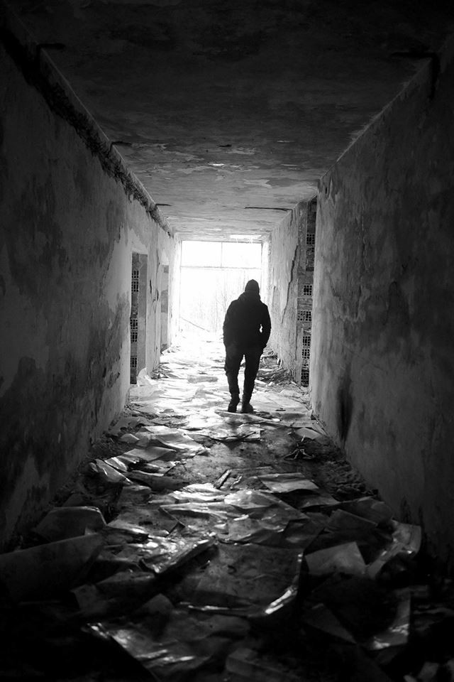
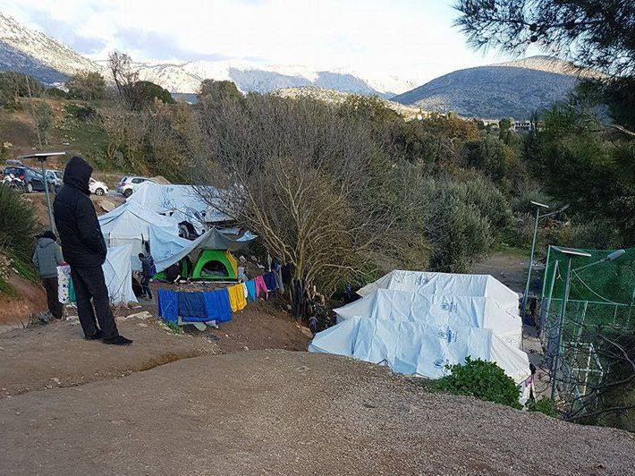
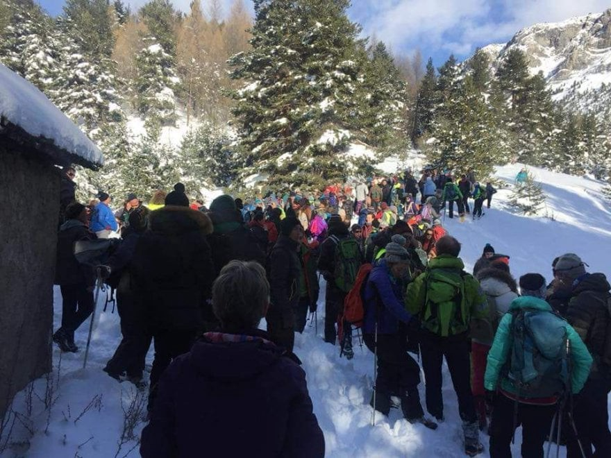

### AYS DAILY DIGEST 02\.01\.2018: Unaccompanied child refugees continue to be underserved

“The Loneliness of the Refugee,” Serbia\. Photo Credit: Gabriel Tizon
#### Feature

The plight of unaccompanied child refugees has been the focal point of many human rights groups when it comes to the shortcomings of EU policy\. Unaccompanied child refugees are among the most vulnerable of the group, and yet European authorities have been unable to provide them with the basic rights and guarantees that are enshrined by the law\.

They are also being met with increasing scrutiny, as a result of the European right’s cynical deployment of claims of dishonesty, namely that adults pose as children in order to acquire additional rights\.

While such cases have indeed been documented, this does not cancel out the very real threat that unaccompanied child refugees \(most of whom are, indeed, minors\) face on a regular basis\.

In its “Denouncement” series, the Athens Legal Support Team highlights the various aspects of the dangerous consequences of the EU policy\. This is the seventh such video, and this installment deals particularly with the issue of unaccompanied minors and the failures of the system in defending them\. As a result of which, most of the child minors in the country live in unsafe conditions while by law they are to be given special protections\.

The situation is indeed dire\.

In December 2017, by the IOM’s own admission, the organization was able to secure housing in safe zones for only 23 unaccompanied child minors\. One should keep in mind that there are well over 1000 unaccompanied child minors in Greece who do not receive this protection, so this figure does not even begin to make a dent in the numbers\.
#### Libya
### Gambian refugees repatriated to home country

More than one hundred migrants from Gambia have been repatriated on 1 January from the Libyan airport of Misurata, as part of a IOM program of Assisted Voluntary Repatriation to fight the overcrowding in the Libyan detention centers\. IOM has sped up with the repatriation timing: about 15,000 people were repatriated from Libya in December 2017\.
#### Mediterranean
### First refugees of 2018 saved from drowning

The first 306 migrants of 2018 were rescued in the afternoon of 1 January\. 92 of them were picked up by German Sea Watch, and 214 have been rescued by Proactiva Open Arms which — jointly with Aquarius from SOS Mediterranee — spent New Year’s Eve at sea to avoid leaving the search\-and\-rescue area on the border with the Libyan waters unguarded\. The migrants were traveling on board two dinghies, identified at the operation room in Rome by the coast guard\. According to them, more than the two vessels might be at sea, with weather conditions worsening\. During the last weeks, the Libyan coast guard has let it be known that it is not able to patrol the search\-and\-rescue area in international waters, which are now guarded only by three NGO ships and the military ships of Eunavformed\.
### SOS signal launched on December 26, those on board vessel brought to safety

On 26 December, the refugees aboard a small vessel sent out an SOS signal\. When authorities attempted to respond, no boat was found in the Strait of Sicily\. However, by a stroke of luck, the vessel reemerged on 31 December, when the five Tunisian refugees on board were saved by a trading ship\. On 1 January the ship docked in Trapani harbor and the refugees were brought to safety\.
#### Greece
### 110\-year\-old Syrian grandmother struggles to reach family in Germany

A 110\-year\-old Syrian\-Kurdish grandmother, along with several family members, has made the perilous journey from Kobani to Europe in the hopes of reuniting with family members who had come to Germany years before\.

The family has found shelter in an apartment in Athens thanks to the help of Solidarity Now\. Laila Saleh, traveling with her son’s family, remains very alert despite her physical fragility\.

In spite of her age, the asylum hearing is scheduled to take place in 2019\.
### Refugees arrested crossing from Turkey to Greece

67 refugees were arrested in Edirne while attempting to cross into Bulgaria and Greece\. They are of Syrian, Palestinian, Afghani, Moroccan, Indian, and Bangladeshi nationality\.
### Staff needed to keep cultural center running

The Be Sinor cultural center in Sinatex is looking for new staff with the following responsibilities:

—Women’s space facilitator/coordinator;
 — Builders, Crafty/handy people;
 — Sporty people to run our sport activities;
 — Art people willing to facilitate workshops, give classes or do other activities;
 — Co\-Coordinator: If you are good at organizing, we are also looking for long\-term volunteers to help with coordination tasks\.

If you are interested, you may contact them via their [Facebook page](https://www.facebook.com/besinor/?ref=hovercard) , or by emailing besinor@protonmail\.com\.
### Boat Refugee Foundation ending activities, seeking to build a new team

As of 1 January, Boat Refugee Foundation is forced to end its medical activities in Moria, where it has cared for people for nearly two years\.

Currently, no NGO has stepped in to take their place, and so the current medical staff is trying to build a new team\. They are in need of at least five medics, two–three people to plan logistics, and two–three translators starting from 7 January until another NGO is able to take over\.

If you have at least a year of clinical experience and can afford to spare at least two weeks, please contact w\.vandewiel@gmail\.com to learn more about the positions\.
### Arrivals

Lesvos: 2 boats carrying a total of 116 people

Chios: 1 boat carrying a total of 64 people \(33 men, 12 women, and 19 children\)

Samos: 1 boat carrying 16 children

According to Aegean Boat Report, a total of 57 boats arrived on the islands in December, carrying a total of 2493 people\. 25 of these boats landed on Lesvos, six on Chios, and 19 on Samos, along with small numbers of boats on other islands\. For the full report, [click here](https://www.facebook.com/AegeanBoatReport/photos/a.285312485325196.1073741828.285298881993223/288209918368786/?type=3) \.

Refugees in Vial continue to live on summer tents despite the difficult winter conditions ahead\. Photo Credit: Be Aware and Share
#### Italy
### Ghanese man attempting to reunite with family rescued

A Ghanese citizen has been rescued as he was trying to reach France through Bardonecchia on 31 December, joining his wife and two sons who had reached the country without problems\. The woman and the children have been helped by Tous Migrants activists: they had crossed the border by bus through Monginevro and faced the police control, while the man had been meaning to cross through Colle della Scala\. Once in Briançon, the family should have reunited, but the woman called for help as she did not see him coming\. After hours spent searching, the rescuers found the man in hypothermic shock, buried under one and a half meters of snow\. They built a protection igloo to revive him, then a helicopter took him to the hospital where he could join his family\.

Tous Migrants have organized a chain of solidarity to show everybody the risks that migrants run every day and night as they attempt to cross the Alps to reach France from Susa Valley\. During the demonstration, the Alpine rescuers took a migrant by helicopter to the hospital\.

Tous Migrants demonstrating to bring awareness of the dangers to refugee lives as a result of the closing of borders\.
### Fire damages building meant to host refugees

On New Year’s Eve, a malicious fire caused great damage to a three\-story building in Spinetoli \(Ascoli Piceno\), on via Tevere\. The structure was meant to host migrants\. The fire began at 4 am and engulfed the entire building\. Traces of flammable liquid have been found on all three stories\.

The firemen took almost four hours and needed four firetrucks to tame the fire\. A big debate and citizens’ protests had been going on over the previous weeks, as the news about migrants arriving in Spinetoli spread\.

The building belongs to a cooperative onlus \(non\-profit organization\), which bought it to host 40 migrants meant to arrive in the town\. The mayor and part of the inhabitants manifested to require that the 7,200\-resident town could receive no more than the maximum limit, and according to the calculation, only 10 asylum seekers more could have been accepted\.
### Ghanese refugee attempts suicide

A 40\-year\-old man from Ghana staying at the ex\-Moi center in Turin, the Olympic village used for more than four years by refugees and migrants’ families, threw himself from a building today out of desperation\. The fall was mitigated by a small terrace and the man, who had already attempted suicide previously, has been taken to CTO hospital\. His life is not in danger\.
### Donations needed in Ventimiglia

Eufemia is collecting items for refugee use in Ventimiglia, a list of which may be found below\. They range from electronics to clothing to hygiene products\.

#### Hungary
### Retrial of Ahmed H\. to continue next week

The retrial of Ahmed H\., a man who was arrested and sentenced to 10 years in prison for “terrorism” for being present at the site of a border clash, is set to begin in Szeged on 8 January\. The trial will continue on the 8th, 10th, and 12th of this month\.

The [Free the Röszke eleven](https://www.facebook.com/11personfreedom/?fref=mentions&hc_location=group) campaign invites all available people to take part in their action for Ahmed, performing such tasks as monitoring the trial, translating the proceedings for an international audience, and staging protests to bring attention to Hungary’s draconian border policies\. You may learn more by going to the above\-mentioned Facebook page\.
#### Austria
### Demonstration against new Austrian government to take place in Vienna

On 13 January, activists in Vienna will be taking part in an action against the newly elected Austrian government, which includes very significant far\-right\-wing elements seeking to further curtail refugees’ basic rights\. The demonstration will take place on 2 pm at the Westbahnhof station\.

#### Germany
### German doctors voice opposition to mandatory age tests

In the midst of an increasingly strong backlash against the idea of adult refugees posing as minors, governments across Europe are seeking to impose mandatory testing to establish refugees’ claims\.

The German medical association came out against such a move on Monday, arguing that such a move would be “an intrusion of the person’s physical integrity\.”

Furthermore, they argue that such tests have a very large margin of error, which may threaten the well\-being of child minors\. Previously such tests were only undertaken on a voluntary basis in Germany\.

This latest move to make testing mandatory came about as a result of the murder of a German girl by a 15\-year\-old refugee from Afghanistan, after she had broken up with him\. The family of the victim has come out to argue that the killer could not be 15 years old\. Although mandatory testing is not yet the law, anger with Germany’s acceptance of refugees could very well give the dangerous measure the push that it needs to become law\.
### Afghan refugee scheduled to be deported commit suicide

Taher Rezai was to be returned to Afghanistan, but rather than face that prospect he chose to end his life\. May he rest in peace\.

Deportations to Afghanistan continue to take place, and the next one is planned to depart on 23 January from Dusseldorf Airport, according to DW Dari\.
#### Poland
### Polish government debates bringing in refugees for medical treatment

The Polish government is in the midst of debating the idea of allowing Syrian refugees to come to Poland for medical treatment\. The move comes amidst increasing EU pressure over Poland’s refusal to bring in refugees under any circumstances\.

Senate Speaker Adam Bielan said, “I believe we can consider temporary aid to those most needy, elderly people, small children, especially Christians,” to be brought in through special humanitarian corridors\.
#### France
### Utopia 56 seeks additional volunteers in Paris

Utopia 56 is well\-known for its aid to refugees in Paris\. Now more than ever, in the midst of this very cold winter, they need additional hands to help the project\. Anyone who can help, even if it is only for half a day, is encouraged to do so\.

To learn more, please visit their [website](http://www.utopia56.com) \.
#### UK
### Group connects willing hosts with refugees

There are many refugees living in Britain with entirely precarious living situations\. Fortunately, there are also people with big hearts and big homes who are happy to take in a refugee in their time of need\. This is precisely what [Refugees at Home](https://www.facebook.com/refugeesathome/?fref=mentions) specializes in: finding people who would be happy to host a person in their time of need\.

> **_We strive to echo correct news from the ground through collaboration and fairness\._** 

> **_If there’s anything you want to share or comment, contact us through Facebook or write to: areyousyrious@gmail\.com\._** 

_Converted [Medium Post](https://areyousyrious.medium.com/ays-daily-digest-02-01-2018-unaccompanied-child-refugees-continue-to-be-underserved-7cc1b408f63e) by [ZMediumToMarkdown](https://github.com/ZhgChgLi/ZMediumToMarkdown)._
