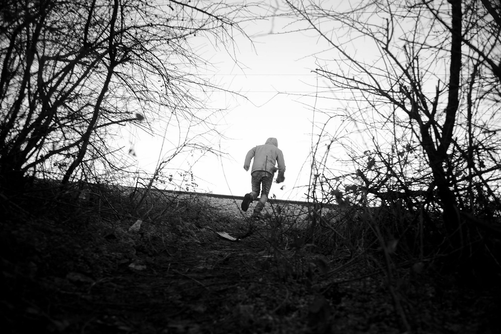
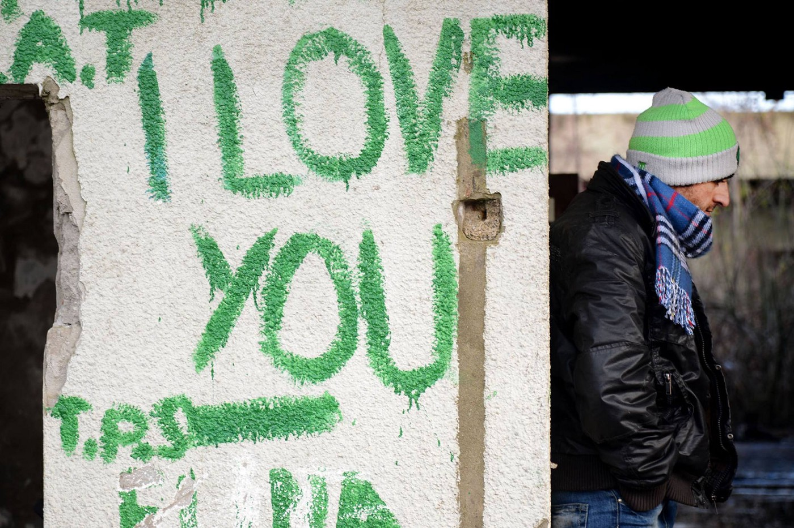
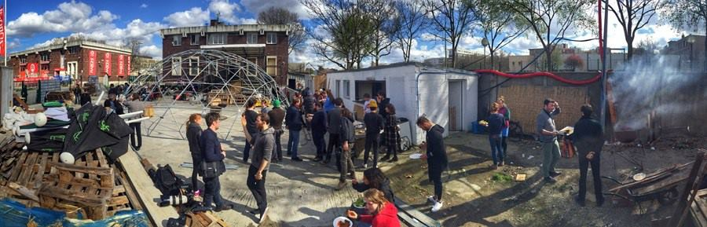

### AYS Daily Digest 05/01/2018: The trickle\-down effect\.

Attacks on refugee centers in Italy // Report on a psychologically vulnerable individual driven to suicide in Lampedusa // Attacks on migrant workers increasing in Greece // Volunteer opportunities across Greece // EU “discussing” Hungary, Poland and Czech Republic’s quota refusal // Austria considering night curfew for asylum seekers // New projects and new problems in France // and more…

](assets/d957f1623b03/1*DG3HA9uHeYzHBjCmvzk3iw.jpeg)

Lampedusa\. Photo credit: [**Leonardo Cavaliere**](https://www.facebook.com/msna.minoristranierinonaccompagnati?hc_location=group_dialog)
### FEATURE: The sinister collaboration — how policy affects people\.

In the night between 3 and 4 January, unknown people threw molotov cocktails at a door of a building meant to host migrants in the future\. This incident happened in Capriglia, in the hill town of Pietrasanta \(Lucca\) \. The door is blackened by the hot fire, which [fortunately burned out on its own](http://www.lanazione.it/viareggio/cronaca/molotov-contro-la-casa-dei-migranti-lievi-i-danni-al-portone-d-accesso-1.3644916) \. The Saturday before, some residents of Capriglia made a civil protest against the next arrival of asylum seekers in the town\. It is noted by volunteers that this is the second such incident in Italy in a week\.

For those in current reception centers, the situation is not much better, on January 2nd, refugees and migrants in a [center near Rome protested](http://www.ilgiornale.it/news/cronache/migranti-proteste-nel-centro-daccoglienza-arcinazzo-1479352.html) about the poor living conditions in their accommodation centre\. The protestors were

_“complaining about the hygienic conditions, the lack of documents and medicines, the low quality and repetitive food, and made a request of a vehicle to go to the prefecture, in order to state all these issues\. The municipality hosts 130 migrants out of 200 residents, and some migrants have recently moved out voluntarily\. According to the residents, there is no settled medical facility…\.an excessive number of migrants have been located in an area lacking basic services\.”_

A man from Tunisia hanged himself [in the hotspot centre in Lampedusa](https://www.facebook.com/askavusa/posts/1984526335139721) \. He had been in Italy for two months and already had been suffering from psychological problems, which were sadly exacerbated by being trapped in the hotspot\. The lack of sufficient psychosocial support as well as the stress imposed by the limiting hotspot system continues to exact a horrifying cost\.

The following is a translated report on the tragic deterioration of this man\.

> Having arrived in Lampedusa, Ali had decided to move out of the hotspot, scared of being seized and repatriated, since he was an economic migrant, so lacking the requirements to hope to stay in Europe\. The experience on the island, however, had been harder and harder, up to today\. The guys from association Askavusa in Lampedusa — who have been asking for a long time the closure of the identification center — found him in a house close to the hotspot\. 

> They recently realized about his conditions, since he started talking to himself\. According to Giacomo Sferlazzo, from the association Askavusa in Lampedusa, the psychologists at the hotspot Agrigento prefecture had been warned, but nothing had been done\. 

> “This is the most extreme fact of a series of acts of self harm that the Tunisian guys forced to stay have done to themselves\. I ask my friends not to call Lampedusa the “receiving island” any longer, because it has never been so\. This representation suits whom takes political and economic advantage from it\. Don’t talk about Lampedusa residents as heroes, please, because it is a big lie\.” 

The full article, in Italian, is available [here](http://meridionews.it/articolo/61867/lampedusa-migrante-si-toglie-la-vita-fuori-dallhotspot-attivisti-temeva-di-essere-rimpatriato-lasciato-solo/) \.

Refugee boy stuck in Serbia for 18 months\. Photo Gabriel Tizon\.

So what does this all mean? Molotov cocktails, protests against accommodation centers, people committing suicide from despair…step by step\.

Here we see the consequences and intersections of many different paths\.

**The effects of geopolitics on our immediate environment** ; in the case of the Italy\-Libya deal, the short\-term effect was noticed, but the long\-term cultural effect is ongoing and even more sinister — if a government treats a community as a pathology, even on the grounds of a bureaucratic “deal” with another country, it serves to reinforce negative ideologies about people on the ground\. “These are the people our government is trying to keep out — why should they be OUR problem\!”

No matter how sanitized and “professional” the agreements are on paper, the end result is the pathologizing of a group of people — people who are already vulnerable\. The vulnerable make the perfect target; with no power to speak back, they lack the “legitimacy” demanded by the system\.

Moreover, responsibility disappears into thin air\. Even in cases where the discourse has not gone so far as to pathologize refugees, these agreements serve to sever the connection between responsible parties and those dependent on them\.

If there is a story that many are familiar with it is the shell game of responsibility — the attitude of “not my job, not my problem” or “I don’t want to get involved — it’s not my place” in order to justify passivity in the face of injustice\. An, attitude of “but it’s not OUR responsibility” is an inseparable thread in the new discourse on refugees and migration\. This thread is reinforced by cynical and political deals\.

For this reason \(and others\), we cannot view our support for refugees on the ground in isolation from the broader geopolitical issues\. It can be easy to derail a conversation and focus on the immediate situation, and in urgent cases, this is required, but if we continue to divorce the immediate crisis from the broader interaction of policy and international collaborations, we rush to tend the symptom, not the cause\. Let us not lose sight of the end game\.

Speaking of speaking up: an update on a protest in support of refugees and migrants in Italy— the protest, due to poor weather conditions, has been moved to Sunday the 14th January\. Contact the [facebook page](https://www.facebook.com/briserlesfeontieres/?fref=mentions) for more information\.

### GENERAL

According to the UNHCR, between January 1 and November 30 2017, over 170,000 people arrived to Europe via the primary “pathways” \(Greece, Italy, Spain, Malta, etc\. \) \. Spain recorded the highest number of arrivals this year\.

MSF released a “year at a glance” for their rescue ship Aquarius:

■■■■■■■■■■■■■■ 
> **[MSF Sea](https://twitter.com/MSF_Sea) @ Twitter Says:** 

> > YEAR AT A GLANCE: In 2017, #Aquarius rescued 15,078 people in 112 different rescue or transfer operations. Among them, 14% were women and 12% pregnant. Children amounted to 23%, of which 79% were traveling alone. Top 3 nationalities on board: Nigeria, Eritrea and Guinea Conakry. https://t.co/iKZ9UDaDQt 

> **Tweeted at [2018-01-05 08:56:22](https://twitter.com/msf_sea/status/949202904157708294).** 

■■■■■■■■■■■■■■ 

### GREECE

A troubling increase in attacks in Piraeus, Greece against migrant workers, in particular those of Pakistani nationality, bear the trademarks of stemming from Golden Dawn’s “assault divisions”, Ekathimerini reports\.

> According to the Movement Against Racism and the Fascist Threat \(KEERFA\) more than 30 houses tenanted by migrants have been attacked in less than a month in those two areas by black\-hooded assailants throwing stones, sticks, bottles and even bitter oranges at the houses, breaking windows and frightening their tenants\. 

> “Despite complaints filed by the migrants with police, the group continues to be active in the neighborhood,” KEERFA said on Thursday, adding that the assaults have escalated since Christmas\. 

Read more on this troubling development [here](http://www.ekathimerini.com/224653/article/ekathimerini/news/as-attacks-on-migrant-homes-spike-group-fears-golden-dawn-threat) \.

The newspaper also reported on the arrest of two migrant smugglers who had been working on a route that ran between the land border of Turkey and Greece to Thessaloniki\. It is understood that the two men were part of [a larger network](http://www.ekathimerini.com/224646/article/ekathimerini/news/two-migrant-smugglers-nabbed-in-northern-greece) \.

According to [Refugee Info Bus](https://www.facebook.com/RefugeeInfoBus/posts/2075628439339240) , a citizen journalist was able to document more photos of Vial camp on Chios, with piles of trash and barely repaired tents and containers in shambles\. View the photos below\.

Many opportunities for potential volunteers in Greece\!

Amurtel in **Athens** is seeking speakers of Arabic and English with experience in midwifery and lactation care\. Contact them [here](https://www.facebook.com/AmurtelHellasforRefugeeMothersandBabies/photos/a.139709686384249.1073741828.139461616409056/553438601678020/?type=3&theater) \.

❤

Lighthouse Relief on **Lesvos** is in urgent need of long\-term spotters and first response — find their contact below\.

> “For February and March we are urgently looking for volunteers to help with spotting, first response for new arrivals and assistance in the nearby transit camp\. We require a minimum commitment of 3 weeks and volunteers to be in good physical health\. A valid driving license \(with experience in driving manual cars on unsealed roads\) and language skills in arabic, farsi and french are more than welcome\.” 

■■■■■■■■■■■■■■ 
> **[Lighthouse Relief](https://twitter.com/LighthouseRR) @ Twitter Says:** 

> > Calling for #volunteers to support our emergency response team on the Greek island of #Lesvos in February and March. Do you want to join our team? Apply here: [lighthouserelief.org/volunteer/](https://www.lighthouserelief.org/volunteer/) #refugees #Greece 

> **Tweeted at [2018-01-05 17:14:19](https://twitter.com/lighthouserr/status/949328220075233281).** 

■■■■■■■■■■■■■■ 

❤

DocMobile is looking for Doctors and Nurses to assist with their project\! See their post here\.

Katsikas camp is open again, and Habibi\.Works has a space nearby and will be able to lend support\!

> One week ago, people were moved into Camp Katsikas again, after the camp had been closed one year ago\. The people arrive from Samos and Lesvos where they have been living in terrible conditions\. The camp is only 300 meters away from our maker space\. This is an extraordinary chapter for the community of Habibi\.Works: All together we welcome the arriving people and support them in the many different needs they are facing\. Especially during the tea distribution we organise in the camp, people approach us for basic information\. In the meanwhile, the wood workshop of Habibi\.Works is the stage for the most amazing items coming to life\. People create according to their needs and ideas\. It works\. 

If you are interested in getting involved and supporting this project, please go [here](https://www.facebook.com/HabibiWorks/posts/1326845797460841) \.

Serbia, 2018\. Photo credit Gabriel Tizon

> In Serbia, a large number of expulsions have been reported by UNHCR and partners: 147 collective expulsions from Croatia, 85 from Romania and 79 from Hungary from December 11 to 24\. To put this in context, this is 311 expulsions in less than two weeks\. 

### HUNGARY

According to index\.hu the European Court of Justice will be discussing Czech Republic, Poland, and Hungary’s rejection of adhering to EU asylum seeker quotas\. According to the initial plan, 120,000 individuals were to be distributed across the EU, but Czech Republic, Poland, and Hungary each refused to participate in the quota distribution scheme, resulting in a lawsuit from the European Court of Justice in late 2017\.
### AUSTRIA

Austrian Vice Chancellor Strache argued that not only should refugees be put in military barracks while they wait on their asylum application, but that they be subject to curfew and other limitations\. Even other members of the Vice Chancellor’s right wing party have distanced themselves from the proposal, which immediately drew backlash, but the disturbing implication remains that even though the Vice Chancellor’s plan will not be enacted “immediately” that it is a veritable option for Austria\. \( [Source](https://www.politico.eu/article/austrian-refugees-curfew-heinz-christian-strache/amp/) \. \)
### FRANCE

Photo credit: Danika Jurisic

A great volunteer opportunity comes from our friend Danika in Paris\. Those who are interested will be able to get invovled in the work of a theatre — available for artistic projects to help support and reach out to the refugee and migrant population\. Read more below\!

_Good Chance is about to unveil an unprecedented project beginning in Paris in January 2018\._

> We have been invited by Anne Hidalgo, the Mayor of Paris, Emmaüs Solidarité, the leading charity working with refugees and disadvantaged people across France, and SNCF, France’s national state railway company, to establish and operate a new temporary theatre within the grounds of the largest refugee welcome centre in the French capital, ‘La Bulle’, in Porte de la Chapelle in the north of the city\. 

> Over the past twelve months, ‘La Bulle’ has welcomed close to 20,000 people, and this groundbreaking new collaboration will allow Good Chance to offer the first dedicated creative space for artistic expression for refugees and migrants newly\-arrived to Paris, reported being between 80 and 100 people every day\. 

For information on how to get involved, follow the [link](https://www.facebook.com/photo.php?fbid=1968801550113141&set=a.1443904252602876.1073741828.100009499466124&type=3&theater&ifg=1) \.

Indeed this is but a sliver of bright news in an otherwise bleak situation as volunteers continue to report truly horrifying sleeping and living conditions for refugees\.

The group Faces Before Numbers posted a heartrending and infuriating account of police harassment of refugees in Paris\. After being intercepted by police at the border, arrested, and released, they returned to the location where they slept, only to be again attacked by police — who took everything they had and while chasing them with pepper spray and attempting to arrest them\. They arrested six people\. Their crime? Simply existing\. Read the full account [here](https://www.facebook.com/FacesBeforeNumbers/photos/a.370049416799720.1073741829.368064216998240/371670429970952/?type=3&theater) \.

> **In Germany, [ECADA — European Citizens Against Deportation to Afghanistan](https://www.facebook.com/ecada2017/) warns that another deportation is scheduled for January 23rd in Dusseldorf\. Watch their page and make plans accordingly if you want to be involved in actions to resist this deportation\.** 

### NORWAY

The number of asylum seekers in Norway dropped to the lowest in over 20 years, according to recent data\. At their lowest since 1995, the number of asylum applications was registered as around 3,500\. A corresponding decrease in the number of housing complexes for asylum seekers has been seen, dropping from 150 to around 50\.

_“The majority of individuals that applied for asylum in Norway last year came to the country from Italy or Greece, according to the agency\._

_The asylum seekers were of different nationalities, but migration from Turkey clearly increased, the UDI \[Norwegian Directorate of Immigration: Utlendingsdirektorate\] reports\.”_

For more details, please see [here](https://www.thelocal.no/20180104/norway-records-lowest-asylum-seeker-numbers-since-1995) \.

**We strive to echo correct news from the ground through collaborationand fairness\.**

**Every effort has been made to credit organizations and individuals with regard to the supply of information, video, and photo material \(in cases where the source wanted to be credited\) \. Please notify us regarding corrections\.**

**If there’s anything you want to share or comment, contact us through Facebook or write to: areyousyrious@gmail\.com**

_Converted [Medium Post](https://areyousyrious.medium.com/ays-daily-digest-05-01-2018-the-trickle-down-effect-d957f1623b03) by [ZMediumToMarkdown](https://github.com/ZhgChgLi/ZMediumToMarkdown)._
