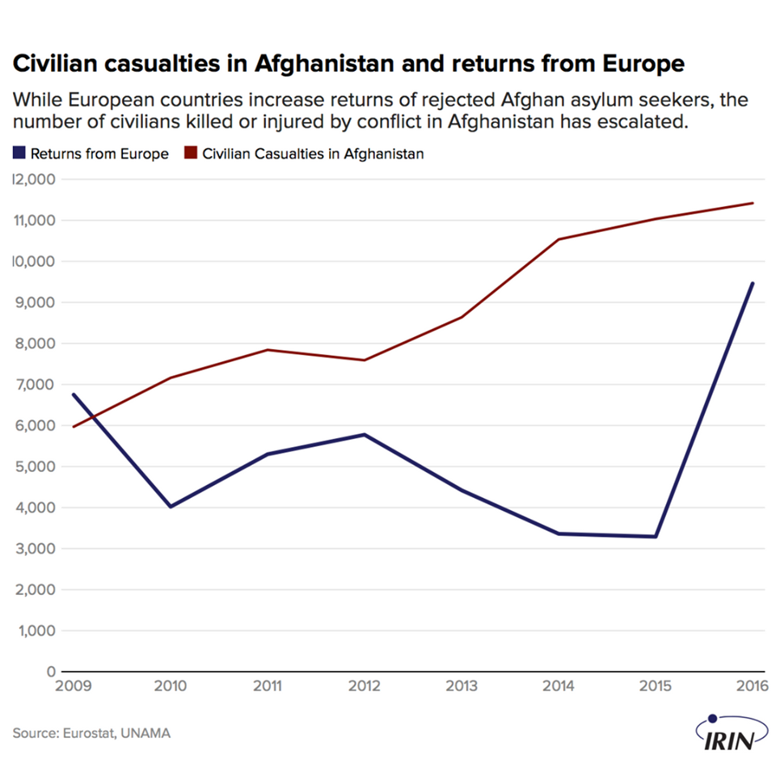
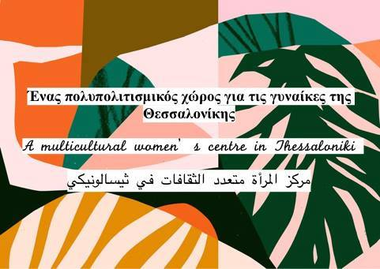
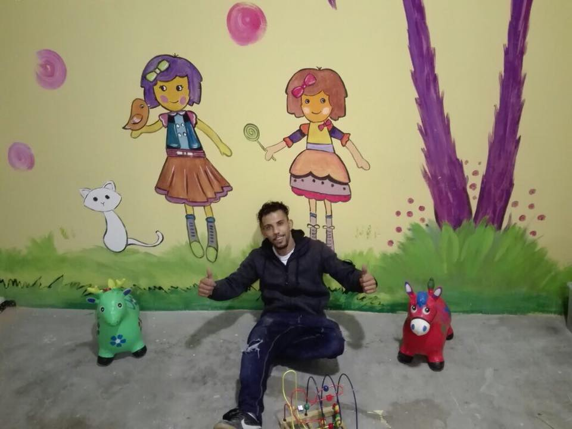
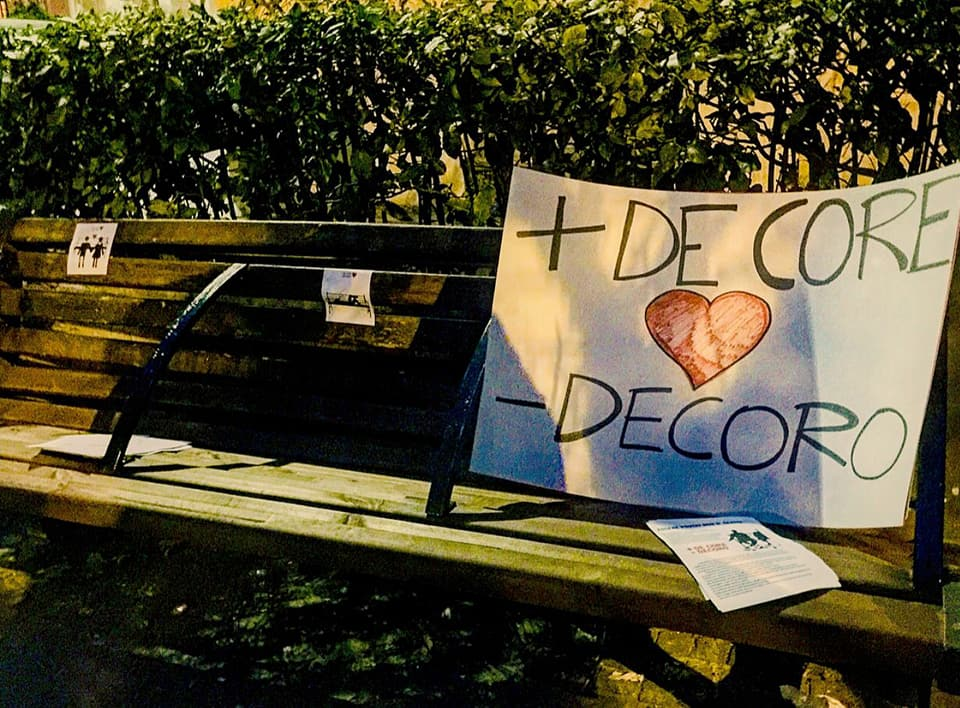
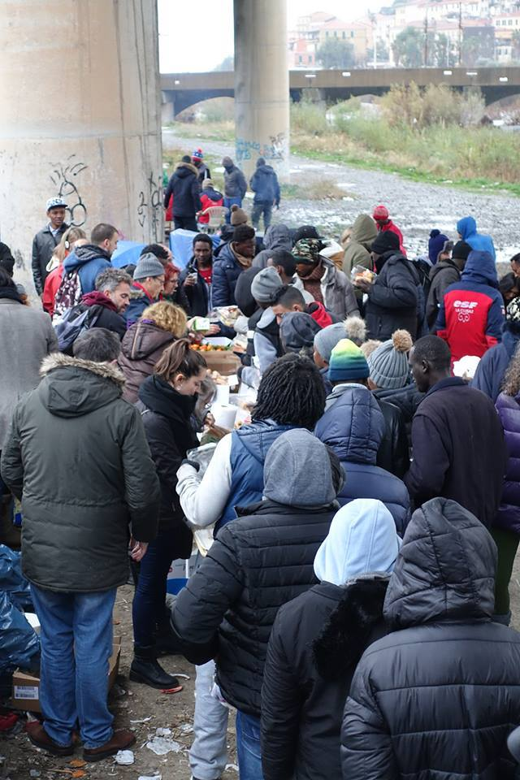
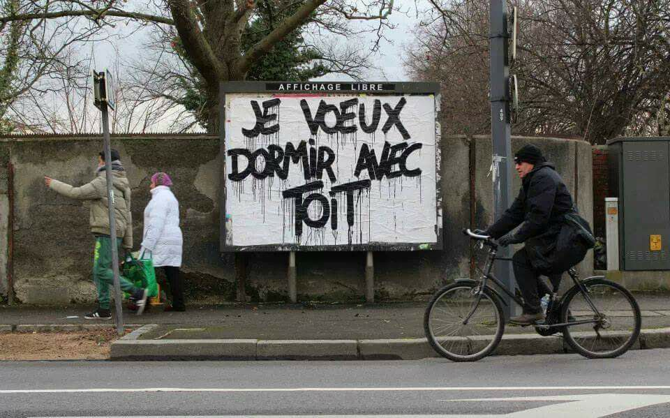
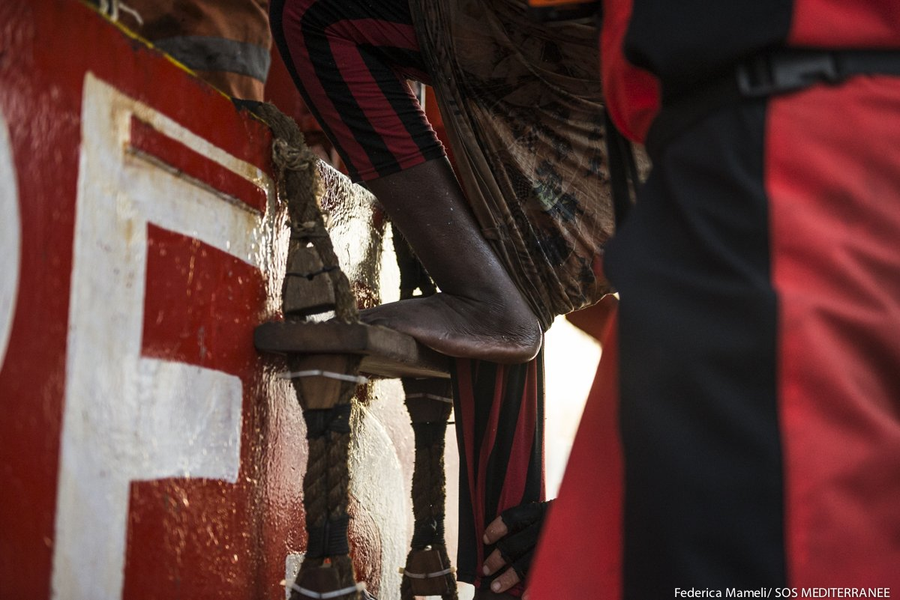

### AYS Daily Digest 07/01/2018: Deportations to Afghanistan continue while civilian casualties increase

_New testimonies on police violence in Calais//New community activities in Greece//Refugees rescued off the coast of Libya//Baobab experience fights anti\-homeless installations in Rome_

](assets/917c6eb3599e/1*m2Z7DU5PR9ULk-rBfzYG-Q.png)

Photo credit: [**Gabriel Tizon**](https://www.facebook.com/gabrieltizonfotografo/)
#### Afghanistan
### Deportations accelerate despite growing dangers in Afghanistan

[Irin](https://www.irinnews.org/news/2018/01/04/europe-sends-afghans-back-danger?utm_source=facebook&utm_medium=irinsocial&utm_campaign=irinupdates) reports on deportations to Afghanistan, noting that the country “faces a revolving cycle of migration that will see more Afghans continue to flee even while others are forced back”\. Germany, Sweden and Finland all saw asylum recognition rates for Afghans plummet in 2017 and European countries returned almost 10,000 rejected Afghan asylum seekers in 2016 — almost triple the number in the previous year\. Meanwhile, civilian casualities in Afghanistan have escalated\.

#### Greece
### Arrivals

Two boats arrived in the south of Lesvos, with 53 and 42 people each\. Another boat with 42 people was picked up outside Samos\. A total of 2,358 people were registered in December 2017\.
### Volunteering opportunities in Athens

The [Athens Volunteers Information and Co\-ordination Group](https://www.facebook.com/groups/AthensVolunteersInformation/) has updated its [volunteering opportunities for Athens](https://www.facebook.com/groups/AthensVolunteersInformation/permalink/1278926692239625/) , including jobs in official camps, community centres, street outreach and squats\. As always, volunteer needs all across Greece can be found on [Greecevol](https://www.greecevol.info/) \.
### New Multicultural Women’s Centre opens in Thessaloniki

Intervolve will have its first full week of activities at their new centre [Irida ίριδα ايريدا](https://www.facebook.com/IridaWomensCentre/?fref=mentions) , a multicultural Women’s Centre in Thessaloniki, according to Help Refugees\.

There will be language lessons, I\.T\. sessions, yoga, film nights, with the team always staying flexible and listening to the community to provide relevant and popular services to participants\.

Irida will help to combat feelings of isolation, and facilitate integration with practical guidance, emotional support, and an open door\.

Meanwhile, the Little Happy Familly Center on Lesvos is continuing its renovations and is building a new kids’ space\.

Given the dramatic waste and sanituation situation in Moria, documented several times \( [here](https://www.facebook.com/kostas.kallergis/videos/10159799452930584/) and [here](https://www.facebook.com/christian.zeier.1/videos/10154939148631640/) \), _Because We Carry_ says it has started to collaborate with a local cleaning company who will be coming to clean in Moria for three months and on top of this will also involve the residents in a new cleaning project\.
#### Bosnia
### 35 “irregular migrants” detained in 2017

Border police detained 735 irregular migrants in 2017, compared with fewer than 100 in all of 2016\. Most are single men from northern African countries, but there are also families from Syria and Afghanistan\.
#### Italy
### Baobab experience fights anti\-homeless installations

Baobab experience fights agains the installation of bars on benches in Rome that would prevent homeless persons & refugees from sleeping there\. It managed to remove one and distributed flyers around the neighborhood and brought signs with data on inequality and poverty in Italy, showing that the money is there, but is badly redistributed\.

L’Altra Voce summarises the issues faced by refugees throughout Italy:

_“In Ventimiglia, there are 250\-300 refugees under bridges along the river and authorities are preparing other regulations to ban food distributions\. In The Italo\-French Alps, refugees attempt the impossible with the risk of freezing to death\. In Lampedusa, a boy hanged himself\. 4 people died of cold in the last few days on the streets of Italy\. In Gorizia there are always about 100 people living in the streetsout of reception\.”_

#### France
### Testimonies from Calais

Photo by Pierre Fraenkel

In Calais, there is still no shelter, temperatures are dropping and conditions are fierce as wind and rain dominate\. Care4Calais brings back the testimony of one refugee, describing interactions with police:

> “They come and find us in the early mornings, spray all our sleeping bags and clothing with tear gas and until we get the strength to get up and run for our lives\. We just want a better life” 

[A similar testimony was recently recorded](https://vimeo.com/249675570) by the filmaker Alice Rowsome\. Syrian refugee Mohammad\* said:

> “Every morning you have to wake up early, because they come, take your clothes, and everything, you know? Three days ago, four days ago, first time in my life, when I wake up I see my entire body and sleeping bag covered in snow\. It’s really really cold” 

Between 600 and 900 people still live in the Calais area and without a camp, access to water, shelter and information is much more difficult\. Of those that were evacuated from the Jungle more than a year ago, 42% of asylum\-seekers received asylum, 7% were rejected and 46% are waiting for an answer\.
#### Spain
### 119 refugees reach the Spanish coast

119 refugees reached the Spanish coast in the first week of 2018 according to [Europapress](http://www.europapress.es/andalucia/noticia-mas-centenar-migrantes-llega-patera-costas-andalucia-primera-semana-2018-20180107183435.html) , all rescued by the Spanish coastguard\.
#### Libya

SOS Méditerranée says 27 people from Nigeria, Sudan, Somalia, Senegal, Guinea Conakry and the Ivory Coas were rescued by a merchant ship near an oil platform and brought to the Aquarius\. MSF adds that in 2017, most of the people rescued by the Aquarius were Nigerians \(18%\) \. More than half of the women traveling alone — in high risk of being victims of trafficking — were also from Nigeria\.

According to the Lybian coastguards, two women were found dead and around 270 refugees were rescued from two boats off the coast of Libya on Sunday\. IOM says 270 refugees \(159 men, 53 women, 46 boys and 12 girls\) received humanitarian emergency assistance after having spent two days off the Libyan coast as they attempted to reach Italy by sea\.

Meanwhile, [Telegraph](http://www.telegraph.co.uk/news/2018/01/07/migrants-sent-home-eu-find-broken-promises-white-elephant-repatriation/) reports that EU\-funded migration repatriation schemes aimed at convincing refugees Libya to return to sub\-Saharan Africa rather than trying to cross the Mediterranean to Europe are not working, with returnees accusing them of breaking pledges to provide grants and training packages upon their return home\. Returnees in Gambia pelted the IOM offices with rocks, saying that while in Libya, they had been told they would get €3,000 to help them start new businesses\. Instead, all they got upon their return to Gambia was a €56 handout as emergency pocket money\.

#### **We strive to echo correct news from the ground through collaborationand fairness\.**

> **Every effort has been made to credit organizations and individuals with regard to the supply of information, video, and photo material \(in cases where the source wanted to be credited\) \. Please notify us regarding corrections\.** 

> **If there’s anything you want to share or comment, contact us through Facebook or write to: areyousyrious@gmail\.com** 

_Converted [Medium Post](https://areyousyrious.medium.com/ays-daily-digest-07-01-2018-deportations-to-afghanistan-continue-while-civilian-casualties-917c6eb3599e) by [ZMediumToMarkdown](https://github.com/ZhgChgLi/ZMediumToMarkdown)._
